以下转载自公众号：code秘密花园，作者 ConardLi

## 四、时间复杂度和空间复杂度

在开始学习之前，我们首先要搞懂时间复杂度和空间复杂度的概念，它们的高低共同决定着一段代码质量的好坏：

### 4.1 时间复杂度

一个算法的时间复杂度反映了程序运行从开始到结束所需要的时间。把算法中基本操作重复执行的次数（频度）作为算法的时间复杂度。

没有循环语句，记作 `O(1)`，也称为常数阶。只有一重循环，则算法的基本操作的执行频度与问题规模n呈线性增大关系，记作 `O（n）`，也叫线性阶。

常见的时间复杂度有：

- `O(1)`: Constant Complexity: Constant 常数复杂度
- `O(log n)`: Logarithmic Complexity: 对数复杂度
- `O(n)`: Linear Complexity: 线性时间复杂度
- `O(n^2)`: N square Complexity 平⽅方
- `O(n^3)`: N square Complexity ⽴立⽅方
- `O(2^n)`: Exponential Growth 指数
- `O(n!)`: Factorial 阶乘

### 4.2 空间复杂度

一个程序的空间复杂度是指运行完一个程序所需内存的大小。利用程序的空间复杂度，可以对程序的运行所需要的内存多少有个预先估计。

一个程序执行时除了需要存储空间和存储本身所使用的指令、常数、变量和输入数据外，还需要一些对数据进行操作的工作单元和存储一些为现实计算所需信息的辅助空间。

## 五、数据结构

数据结构这个词相信大家都不陌生，在很多场景下可能都听过，但你有没有考虑过“数据结构”究竟是一个什么东西呢？

> 数据结构即数据元素相互之间存在的一种和多种特定的关系集合。

一般你可以从两个维度来理解它，逻辑结构和存储结构。

### 5.1 逻辑结构

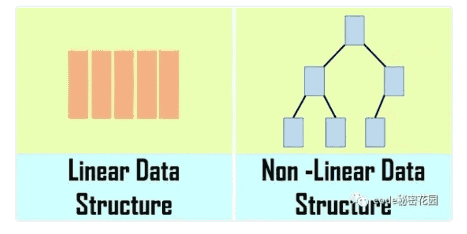

简单的来说逻辑结构就是数据之间的关系，逻辑结构大概统一的可以分成两种：线性结构、非线性结构。

:yum:线性结构：**是一个有序数据元素的集合。其中数据元素之间的关系是一对一的关系，即除了第一个和最后一个数据元素之外，其它数据元素都是首尾相接的。**

常用的线性结构有: 栈，队列，链表，线性表。

:yum:非线性结构：**各个数据元素不再保持在一个线性序列中，每个数据元素可能与零个或者多个其他数据元素发生联系。**

常见的非线性结构有 二维数组，树等。

### 5.2 存储结构

**逻辑结构指的是数据间的关系，而存储结构是逻辑结构用计算机语言的实现**。常见的存储结构有顺序存储、链式存储、索引存储以及散列存储。

例如：数组在内存中的位置是连续的，它就属于顺序存储；链表是主动建立数据间的关联关系的，在内存中却不一定是连续的，它属于链式存储；还有顺序和逻辑上都不存在顺序关系，但是你可以通过一定的方式去访问它的哈希表，数据散列存储。

### 5.3 数据结构-二叉树

树是用来模拟具有树状结构性质的数据集合。根据它的特性可以分为非常多的种类，对于我们来讲，掌握二叉树这种结构就足够了，它也是树最简单、应用最广泛的种类。

> 二叉树是一种典型的树树状结构。如它名字所描述的那样，二叉树是每个节点最多有两个子树的树结构，通常子树被称作“左子树”和“右子树”。

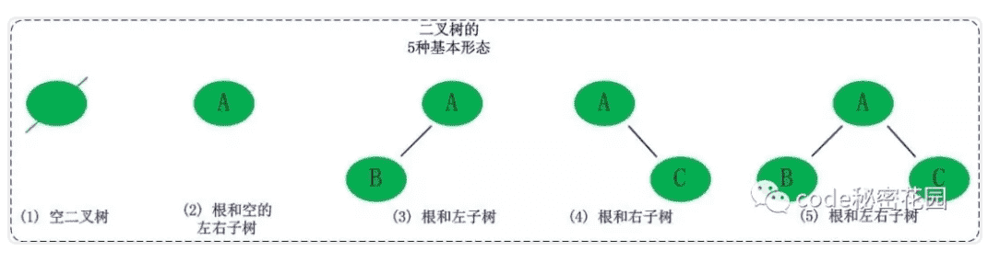

#### 5.3.1 二叉树遍历

> 重点中的重点，最好同时掌握递归和非递归版本，递归版本很容易书写，但是真正考察基本功的是非递归版本。

- 二叉树的中序遍历
- 二叉树的前序遍历
- 二叉树的后序遍历

> 根据前序遍历和中序遍历的特点重建二叉树，逆向思维，很有意思的题目

- 重建二叉树
- 求二叉树的遍历

#### 5.3.2 二叉树的对称性

- 对称的二叉树
- 二叉树的镜像

#### 5.3.3 二叉搜索树

> 二叉搜索树是特殊的二叉树，考察二叉搜索树的题目一般都是考察二叉搜索树的特性，所以掌握好它的特性很重要。

::: tip 特性

1. 若任意节点的左⼦子树不不空，则左子树上所有结点的值均小于它的 根结点的值;
2. 若任意节点的右⼦子树不不空，则右子树上所有结点的值均大于它的 根结点的值;
3. 任意节点的左、右子树也分别为二叉查找树。

:::

- 二叉搜索树的第k个节点
- 二叉搜索树的后序遍历

#### 5.3.4 二叉树的深度

> 二叉树的深度为根节点到最远叶子节点的最长路径上的节点数。
>
> 平衡二叉树：左右子树深度之差大于1

- 二叉树的最大深度
- 二叉树的最小深度
- 平衡二叉树

### 5.4 数据结构-链表

用一组任意存储的单元来存储线性表的数据元素。一个对象存储着本身的值和下一个元素的地址。

- 需要遍历才能查询到元素，查询慢。
- 插入元素只需断开连接重新赋值，插入快。

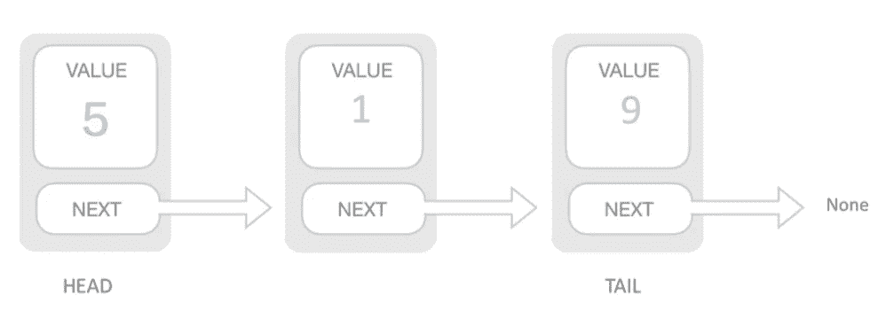

链表在开发中也是经常用到的数据结构， `React16`的 `FiberNode`连接起来形成的 `FiberTree`, 就是个单链表结构。

#### 5.4.1 基本应用

> 主要是对链表基本概念和特性的应用，如果基础概念掌握牢靠，此类问题即可迎刃而解

- 从尾到头打印链表
- 删除链表中的节点
- 反转链表
- 复杂链表的复制

#### 5.4.2 环类题目

> 环类题目即从判断一个单链表是否存在循环而扩展衍生的问题

- 环形链表
- 链表环的入口节点
- 约瑟夫环

#### 5.4.3 双指针

> 双指针的思想在链表和数组中的题目都经常会用到，主要是利用两个或多个不同位置的指针，通过速度和方向的变换解决问题。

- 两个指针从不同位置出发：一个从始端开始，另一个从末端开始；
- 两个指针以不同速度移动：一个指针快一些，另一个指针慢一些。

对于单链表，因为我们只能在一个方向上遍历链表，所以第一种情景可能无法工作。然而，第二种情景，也被称为慢指针和快指针技巧，是非常有用的。

- 两个链表的公共节点
- 链表倒数第k个节点
- 相交链表

#### 5.4.4 双向链表

双链还有一个引用字段，称为 `prev`字段。有了这个额外的字段，您就能够知道当前结点的前一个结点。

- 扁平化多级双向链表

### 5.5 数据结构-数组

数组是我们在开发中最常见到的数据结构了，用于按顺序存储元素的集合。但是元素可以随机存取，因为数组中的每个元素都可以通过数组索引来识别。插入和删除时要移动后续元素，还要考虑扩容问题，插入慢。

数组与日常的业务开发联系非常紧密，如何巧妙的用好数组是我们能否开发出高质量代码的关键。

#### 5.5.1 双指针

> 上面链表中提到的一类题目，主要是利用两个或多个不同位置的指针，通过速度和方向的变换解决问题。注意这种技巧经常在排序数组中使用。

- 调整数组顺序使奇数位于偶数前面
- 和为S的两个数字
- 和为S的连续正整数序列

#### 5.5.2 N数之和问题

> 非常常见的问题，基本上都是一个套路，主要考虑如何比暴力法降低时间复杂度，而且也会用到上面的双指针技巧

- 两数之和
- 三数之和
- 四数之和

#### 5.5.3 二维数组

> 建立一定的抽象建模能力，将实际中的很多问题进行抽象

- 构建乘积数组
- 顺时针打印矩阵

#### 5.5.4 数据统计

> 数组少不了的就是统计和计算，此类问题考察如何用更高效的方法对数组进行统计计算。

- 数组中出现次数超过数组长度一半的数字
- 连续子数组的最大和
- 扑克牌顺子
- 第一个只出现一次的字符

### 5.6 数据结构-栈和队列

在上面的数组中，我们可以通过索引随机访问元素，但是在某些情况下，我们可能要限制数据的访问顺序，于是有了两种限制访问顺序的数据结构：栈（后进先出）、队列（先进先出）

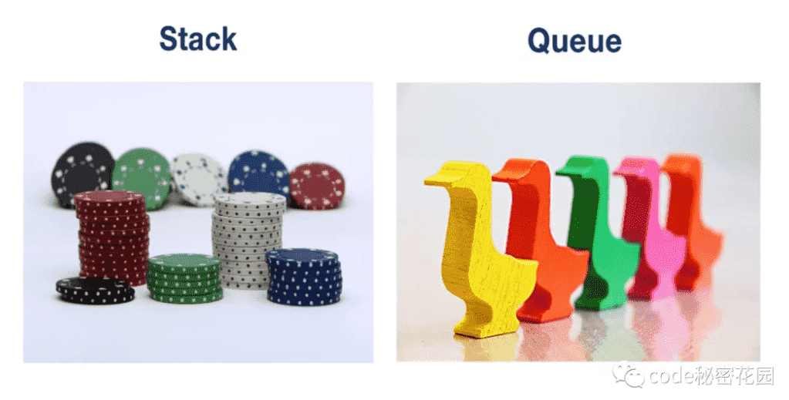

- 队列和栈的互相实现
- 包含min函数的栈
- 栈的压入弹出序列
- 滑动窗口最大值
- 接雨水

### 5.7 数据结构-哈希表

哈希的基本原理是将给定的键值转换为偏移地址来检索记录。

键转换为地址是通过一种关系（公式）来完成的，这就是哈希（散列）函数。

虽然哈希表是一种有效的搜索技术，但是它还有些缺点。两个不同的关键字，由于哈希函数值相同，因而被映射到同一表位置上。该现象称为冲突。发生冲突的两个关键字称为该哈希函数的同义词。

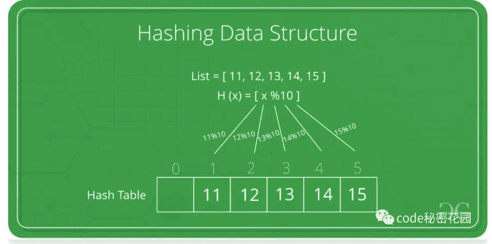

::: tip 如何设计哈希函数以及如何避免冲突就是哈希表的常见问题。好的哈希函数的选择有两条标准：

- 1.简单并且能够快速计算
- 2.能够在址空间中获取键的均匀分布

:::

例如下面的题目：

- 常数时间插入、删除和获取随机元素

> 当用到哈希表时我们通常是要开辟一个额外空间来记录一些计算过的值，同时我们又要在下一次计算的过程中快速检索到它们，例如上面提到的两数之和、三数之和等都利用了这种思想。

- 两数之和
- 三数之和
- 字符流中第一个不重复的字符
- 宝石与石头

### 5.8 数据结构-堆

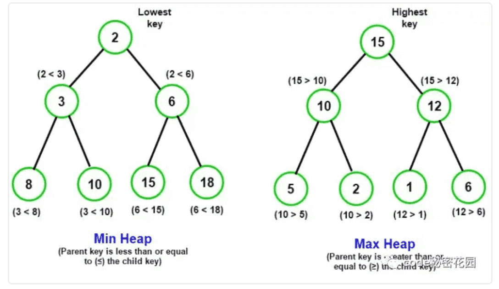

堆的底层实际上是一棵完全二叉树，可以用数组实现

- 每个的节点元素值不小于其子节点 - 最大堆
- 每个的节点元素值不大于其子节点 - 最小堆

> 堆在处理某些特殊场景时可以大大降低代码的时间复杂度，例如在庞大的数据中找到最大的几个数或者最小的几个数，可以借助堆来完成这个过程。

- 堆的基本操作
- 数据流中的中位数
- 最小的k个数

## 六、算法

### 6.1 排序

排序或许是前端接触最多的算法了，很多人的算法之路是从一个冒泡排序开始的，排序的方法有非常多种，它们各自有各自的应用场景和优缺点，这里我推荐如下6种应用最多的排序方法，如果你有兴趣也可以研究下其他几种。

- 快速排序

> 选择一个目标值，比目标值小的放左边，比目标值大的放右边，目标值的位置已排好，将左右两侧再进行快排。

- 归并排序

> 将大序列二分成小序列，将小序列排序后再将排序后的小序列归并成大序列。

- 选择排序

> 每次排序取一个最大或最小的数字放到前面的有序序列中。

- 插入排序

> 将左侧序列看成一个有序序列，每次将一个数字插入该有序序列。插入时，从有序序列最右侧开始比较，若比较的数较大，后移一位。

- 冒泡排序

> 循环数组，比较当前元素和下一个元素，如果当前元素比下一个元素大，向上冒泡。下一次循环继续上面的操作，不循环已经排序好的数。

- 堆排序

> 创建一个大顶堆，大顶堆的堆顶一定是最大的元素。交换第一个元素和最后一个元素，让剩余的元素继续调整为大顶堆。从后往前依次和第一个元素交换并重新构建，排序完成。

### 6.2 二分查找

查找是计算机中最基本也是最有用的算法之一。它描述了在有序集合中搜索特定值的过程。

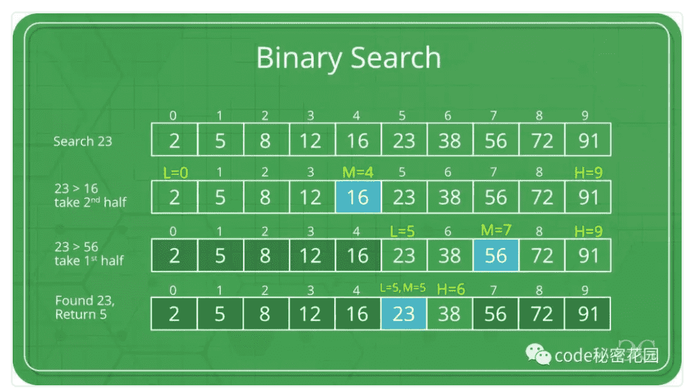

二分查找维护查找空间的左、右和中间指示符，并比较查找目标或将查找条件应用于集合的中间值；如果条件不满足或值不相等，则清除目标不可能存在的那一半，并在剩下的一半上继续查找，直到成功为止。如果查以空的一半结束，则无法满足条件，并且无法找到目标。

- 二维数组查找
- 旋转数组的最小数字
- 在排序数组中查找数字
- x 的平方根
- 猜数字大小

### 6.3 递归

递归是一种解决问题的有效方法，在递归过程中，函数将自身作为子例程调用。

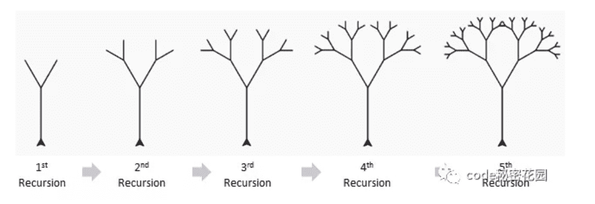

你可能想知道如何实现调用自身的函数。诀窍在于，每当递归函数调用自身时，它都会将给定的问题拆解为子问题。递归调用继续进行，直到到子问题无需进一步递归就可以解决的地步。

::: tip 为了确保递归函数不会导致无限循环，它应具有以下属性：

- 一个简单的基本案例 —— 能够不使用递归来产生答案的终止方案。
- 一组规则，也称作递推关系，可将所有其他情况拆分到基本案例。

:::

#### 6.3.1 重复计算

一些问题使用递归考虑，思路是非常清晰的，但是却不推荐使用递归，例如下面的几个问题：

- 斐波拉契数列
- 跳台阶
- 矩形覆盖

这几个问题使用递归都有一个共同的缺点，那就是包含大量的重复计算，如果递归层次比较深的话，直接会导致JS进程崩溃。

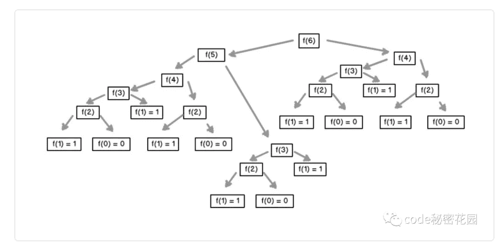

你可以使用 `记忆化`的方法来避免重复计算，即开辟一个额外空间来存储已经计算过的值，但是这样又会浪费一定的内存空间。因此上面的问题一般会使用动态规划求解。

> 所以，在使用递归之前，一定要判断代码是否含有重复计算，如果有的话，不推荐使用递归。

递归是一种思想，而非一个类型，很多经典算法都是以递归为基础，因此这里就不再给出更多问题。

### 6.4 广度优先搜索

广度优先搜索（ `BFS`）是一种遍历或搜索数据结构（如树或图）的算法，也可以在更抽象的场景中使用。

**它的特点是越是接近根结点的结点将越早地遍历。**

例如，我们可以使用 `BFS` 找到从起始结点到目标结点的路径，特别是最短路径。

在 `BFS`中，结点的处理顺序与它们添加到队列的顺序是完全相同的顺序，即先进先出，所以广度优先搜索一般使用队列实现。

- 从上到下打印二叉树
- 单词接龙
- 员工的重要性
- 岛屿数量

### 6.5 深度优先搜索

和广度优先搜索一样，深度优先搜索（ `DFS`）是用于在树/图中遍历/搜索的一种重要算法。

与 `BFS` 不同，更早访问的结点可能不是更靠近根结点的结点。因此，你在 `DFS` 中找到的第一条路径可能不是最短路径。

在 `DFS`中，结点的处理顺序是完全相反的顺序，就像它们被添加到栈中一样，它是后进先出。所以深度优先搜索一般使用栈实现。

- 二叉树的中序遍历
- 二叉树的最大深度
- 路径总和
- 课程表
- 岛屿数量

### 6.6 回溯算法

从解决问题每一步的所有可能选项里系统选择出一个可行的解决方案。

在某一步选择一个选项后，进入下一步，然后面临新的选项。重复选择，直至达到最终状态。

::: tip 回溯法解决的问题的所有选项可以用树状结构表示。

- 在某一步有n个可能的选项，该步骤可看作树中一个节点。
- 节点每个选项看成节点连线，到达它的n个子节点。
- 叶节点对应终结状态。
- 叶节点满足约束条件，则为一个可行的解决方案。
- 叶节点不满足约束条件，回溯到上一个节点，并尝试其他叶子节点。
- 节点所有子节点均不满足条件，再回溯到上一个节点。
- 所有状态均不能满足条件，问题无解。

:::

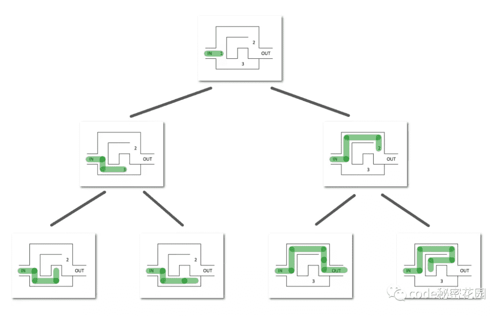

回溯算法适合由多个步骤组成的问题，并且每个步骤都有多个选项。

- 二叉树中和为某一值的路径
- 字符串的排列
- 和为sum的n个数
- 矩阵中的路径
- 机器人的运动范围
- N皇后问题

### 6.7 动态规划

动态规划往往是最能有效考察算法和设计能力的题目类型，面对这类题目最重要的是抓住问题的阶段，了解每个阶段的状态，从而分析阶段之间的关系转化。

适用于动态规划的问题，需要满足**最优子结构和无后效性**，动态规划的求解过程，在于找到状态转移方程，进行自底向上的求解。

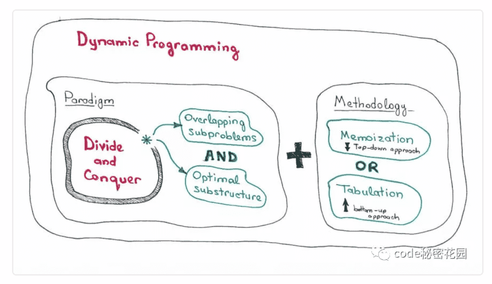

自底向上的求解，可以帮你省略大量的复杂计算，例如上面的斐波拉契数列，使用递归的话时间复杂度会呈指数型增长，而动态规划则让此算法的时间复杂度保持在 `O(n)`。

#### 6.7.1 路径问题

- 最小路径和
- 不同路径
- 不同路径 II
- 形成字符串的最短路径

#### 6.7.2 买卖股票类问题

- 买卖股票的最佳时机
- 买卖股票的最佳时机 III
- 打家劫舍
- 打家劫舍 II

#### 子序列问题

- 不同的子序列
- 乘积最大子序列
- 最长上升子序列
- 最长回文子序列

### 6.8 贪心算法

贪心算法：对问题求解的时候，总是做出在当前看来是最好的做法。

**适用贪心算法的场景：问题能够分解成子问题来解决，子问题的最优解能递推到最终问题的最优解。这种子问题最优解成为最优子结构**

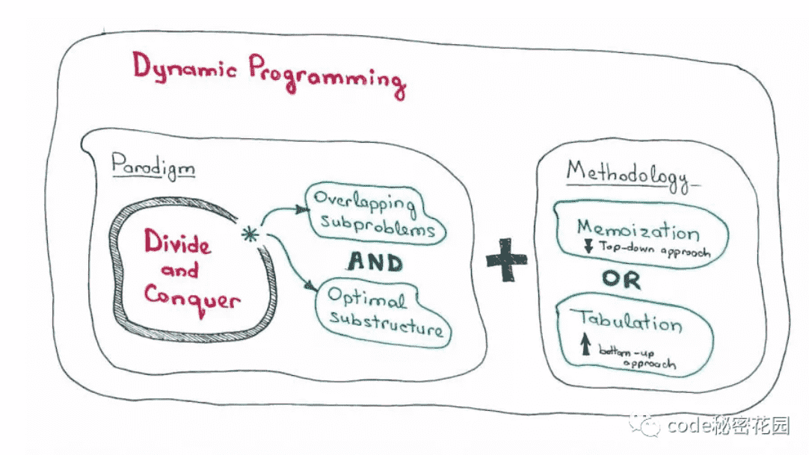

#### 6.8.1 买卖股票类问题

- 买卖股票的最佳时机 II
- 买卖股票的最佳时机含手续费

#### 6.8.2 货币选择问题

- 零钱兑换
- 零钱兑换 II

### 6.9 贪心算法、动态规划、回溯的区别

**贪心算法与动态规划的不同在于它对每个子问题的解决方案都作出选择，不能回退，动态规划则会保存以前的运算结果，并根据以前的结果对当前进行选择，有回退功能，而回溯算法就是大量的重复计算来获得最优解。**

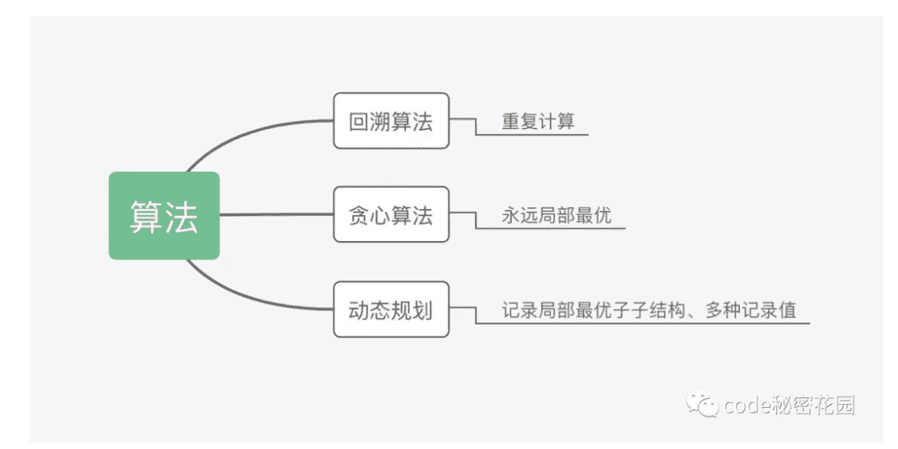

有很多算法题目都是可以用这三种思想同时解答的，但是总有一种最适合的解法，这就需要不断的练习和总结来进行深入的理解才能更好的选择解决办法。

## 七、前端编码能力

这部分是与前端开发贴近最紧密的一部分了，在写业务代码的同时，我们也应该关心一些类库或框架的内部实现。

大多数情况下，我们在写业务的时候不需要手动实现这些轮子，但是它们非常考察一个前端程序员的编码功底，如果你有一定的算法和数据结构基础，很多源码看起来就非常简单。

下面我拣选了一些问题：

- 手动实现call、apply、bind
- EventEmitter
- 防抖
- 节流
- 浅拷贝和深拷贝
- 数组去重、扁平、最值
- 数组乱序-洗牌算法
- 函数柯里化
- 手动实现JSONP
- 模拟实现promise
- 手动实现ES5继承
- 手动实现instanceof