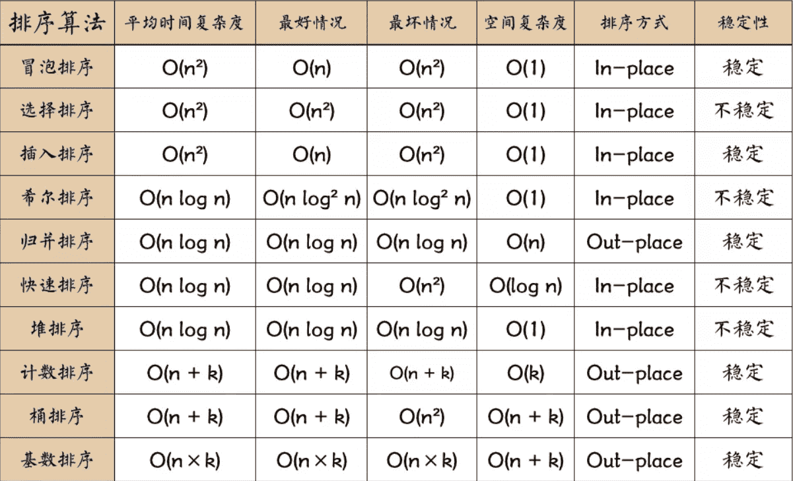

以下部分代码来自<http://caibaojian.com/interview-map/>



比较次数与初始元素顺序无关的排序算法（即最好、最坏情况的时间复杂度一样）

选择排序O(n^2)

堆排序O(nlogn)

归并排序O(nlogn)

基数排序O(tn)

### 先封装公共类供使用

```js
//common.js
//导出可能会用到的两个公共函数
exports.checkArray = function (array) {
    if (!array || array.length <= 2) return;
}
//ES5实现交换
exports.swap = function (array, left, right) {
    let temp = array[right];
    array[right] = array[left];
    array[left] = temp;
}

//ES6实现交换
exports.swap2 = function (array, left, right) {
  [array[left],array[right]] = [array[right],array[left]];
}
```

## 冒泡排序

```js
//冒泡排序
function bubbleSort(array) {
  common.checkArray(array)
  for (let i = arr.length - 1; i > 0; i--) {
    for (let j = 0; j < i; j++) {
      if (array[j] > array[j + 1]) {
        common.swap(array, j, j + 1)
      }
    }
  }
  return array
}
```

## 插入排序

```js
//插入排序
function insertSort(array) {
  common.checkArray(array);
  for (let i = 1; i < array.length; i++) {
    for (let j = i; j > 0; j--) {
      if (array[j] < array[j - 1]) {
        common.swap(array, j, j - 1);
      } else {
        break;
      }
    }
  }
  return array;
}
```

## 希尔排序

```js
function shellSort(array, gap) {
  for (let i = 0; i < gap.length; i++) { //最外层循环，一次取不同的步长，步长需要预先给出
    let n = gap[i]; //步长为n
    for (let j = i + n; j < array.length; j++) { //接下类和插入排序一样，j循环依次取后面的数
      for (let k = j; k > 0; k -= n) { //k循环进行比较，和直接插入的唯一区别是1变为了n
        if (array[k] < array[k - 1]) {
          common.swap(array, k, k - 1);
        } else {
          continue;
        }
      }
    }
  }
  return array;
}
```

## 选择排序

```js
//选择排序
function selectSort(array) {
  common.checkArray(array)
  for (let i = 0; i < array.length - 1; i++) {
    let minIndex = i
    for (let j = i + 1; j < array.length; j++) {
      minIndex = array[j] < array[minIndex] ? j : minIndex
    }
    common.swap(array, i, minIndex)
  }
  return array;
}
```

## 快速排序

```js
//简单版
function quickSort(array) {
  if (array.length <= 1) {
    return array; //递归出口
  }
  let left = [],
    right = [],
    current = array.splice(0,1); //注意splice后，数组长度少了一个
  for (let i = 0; i < array.length; i++) {
    if (array[i] < current) {
      left.push(array[i]); //放在左边
    } else {
      right.push(array[i]); //放在右边
    }
  }
  return quickSort(left).concat(current, quickSort(right)); //递归
}

//复杂版(不需要额外存储空间)
function quickSort1(array, start, end) {
  if (start - end < 2) {
    return;
  }
  let l = start,
      r = end;
  const current = array[l];
  while (l < r) {
    while (l < r && array[r] > current) {
      r--;
    }
    array[l] = array[r]
    while (l < r && array[l] < current) {
      l++;
    }
    array[r] = array[l];
  }
  array[l] = current;
  quickSort(array, start, l - 1);
  quickSort(array, l + 1, end);
  return array;
}
```

## 归并排序

```js
//归并排序(简单版，空间复杂度略高，需要复制多个数组)
function mergeSort(array) {
  if (array.length < 2) {
    return array;
  }
  var mid = Math.floor(array.length / 2),
    left = array.slice(0, mid),
    right = array.slice(mid, array.length)
  return merge(mergeSort(left), mergeSort(right))
}

function merge(left, right) {
  var result = [];
  while (left.length && right.length) {
    if (left[0] < right[0]) {
      result.push(left.shift())
    } else {
      result.push(right.shift())
    }
  }
  while (left.length) {
    result.push(left.shift())
  }
  while (right.length) {
    result.push(right.shift())
  }
  return result
}
```

## 堆排序

```js
//堆排序
function stack(array) {
  common.checkArray(array);
  //将最大值交换到首位
  for (let i = 0; i < array.length; i++) {
    stackInsert(array, i)
  }
  let length = array.length;
  //交换首位与末尾
  common.swap(array, 0, --length);
  while (length > 0) {
    //交换首尾后重新调整堆
    stackAdjust(array, 0, length)
    common.swap(array, 0, --length);
  }
  return array
}

function stackInsert(array, index) {
  //如果当前节点比父节点大，就交换
  while (array[index] > array[parseInt((index - 1) / 2)]) {
    common.swap(array, index, parseInt((index - 1) / 2))
    //将索引变成父节点
    index = parseInt((index - 1) / 2);
  }
}

function stackAdjust(array, index, size) {
  let left = index * 2 + 1;
  while (left < size) {
    //判断左右节点大小
    let largest = left + 1 < size && array[left] < array[left + 1] ? left + 1 : left;
    //判断父子节点大小
    largest = array[index] < array[largest] ? largest : index;
    if (index === largest) break;
    common.swap(array, index, largest);
    index = largest;
    left = index * 2 + 1;
  }
}
```

