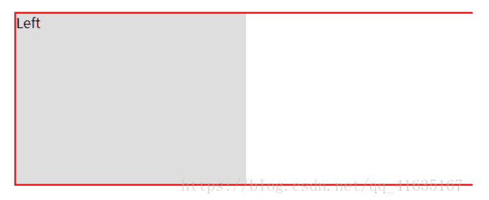

## 一、BFC

BFC 即 Block Formatting Contexts (**块级格式化上下文**)，具有 BFC 特性的元素可以看作是隔离了的独立容器，容器里面的元素不会在布局上影响到外面的元素，并且 BFC 具有普通容器所没有的一些特性。通俗一点来讲，可以把 BFC 理解为一个封闭的大子，箱子内部的元素无论如何翻江倒海，都不会影响到外部。就像js的函数作用域一样，BFC是页面上的作用域。

## 二、BFC 的原理/BFC的布局规则

::: tip BFC 的原理，其实也就是 BFC 的渲染规则（能说出以下四点就够了）。包括：

- （1）BFC **内部的**子元素，在垂直方向，**边距会发生重叠**。
- （2）BFC在页面中是独立的容器，外面的元素不会影响里面的元素，反之亦然。（稍后看`举例1`）
- （3）**BFC区域不与旁边的float box区域重叠**。（可以用来清除浮动带来的影响）。（稍后看`举例2`）
- （4）计算BFC的高度时，浮动的子元素也参与计算。（稍后看`举例3`）

:::

## 三、如何生成BFC

::: tip 有以下几种方法：

- 方法1：overflow: 不为visible，可以让属性是 **hidden、auto**。【最常用】
- 方法2：浮动中：float的属性值不为none。意思是，**只要设置了浮动，当前元素就创建了BFC。**
- 方法3：定位中：只要posiiton的值不是 static或者是relative即可，**可以是`absolute`或`fixed`，**也就生成了一个BFC。
- 方法4：display为inline-block, table-cell, table-caption, flex, inline-flex
- 方法5：body根元素
- 方法6(新方法):display : `flow-root` 

:::

## 四、清除浮动

什么是浮动？为什么要清除？浮动就是因为有元素使用了float属性，使得元素处于半脱离文档流的状态，无法撑开父元素。来看下面这个例子

```html
<style type="text/css">
.div1{border: 2px solid red}
.left{
    float:left;
    width:20%;
    height:200px;
    background:#DDD}
</style>
 
<body>
<div class="div1">
<div class="left">Left</div>
</div>
<body>	
```

在这个例子中，我们希望它的效果应该是这样的，父级元素div1应当包含left元素。



但实际效果却是这样的


这就是浮动带来的影响，无法撑开父级元素，父级元素高度为0，这显然不是我们希望看到的，所以我们要清除浮动。清除浮动共有八种方式，下面来一一介绍，前五种我们可能会使用到，后三种只做了解就可以。

### **1.设置父级元素的高度**

这是最简单容易理解的方式，但只适合高度固定的布局，要给出精确的高度，如果高度和父级div不一样时，会产生问题，不推荐使用。

```html
<style type="text/css">
.div1{
    border: 2px solid red；
    height:200px}
.left{
    float:left;
    width:20%;
    height:200px;
    background:#DDD}
</style>
```

### 2.结尾处加空标签clear：both

这种方法简单、代码少、浏览器支持好、不容易出现怪问题，但原理不好理解，而且如果页面浮动布局多，就要增加很多空div，让人感觉很不好，不推荐使用。关于css的clear属性大家如果不懂的话可以直接百度，both代表元素的左右都不允许出现浮动元素。

```html
<style type="text/css">
.div1{border: 2px solid red}
.left{
    float:left;
    width:20%;
    height:200px;
    background:#DDD}
 
.clearfloat{clear:both}
</style>
 
<body>
<div class="div1">
<div class="left">Left</div>
 
<div class="clearfloat"></div>
</div>
<body>
```

### 3.父级div定义 伪类:after 和 zoom

原理类似方法2，浏览器支持好、不容易出现怪问题，大部分的网站都在用，建议使用，但代码多、不少初学者不理解原理，要两句代码结合使用才能让主流浏览器都支持。其中的{zoom:1}是兼容IE6/7的写法，IE6/7通过zoom:1可以触发hasLayout。

```html
<style type="text/css">
.div1{border: 2px solid red}
.left{float:left;
    width:20%;
    height:200px;
    background:#DDD}
.clearfloat:after{
    display:block;
    clear:both;
    content:"";
    display:hidden;
    height:0}
.clearfloat{zoom:1}
</style>
<body>
<div class="div1 clearfloat">
<div class="left">Left</div>
</div>
<body>
```

### **4. 父级div定义 overflow:hidden**

简单、代码少、浏览器支持好，不能和position配合使用，因为超出的尺寸的会被隐藏。只推荐没有使用position或对overflow:hidden理解比较深的朋友使用。这个方法与第五个方法的原理都是触发了BFC。

```html
<style type="text/css">
.div1{
    border: 2px solid red；
    overflow:hidden}
.left{
    float:left;
    width:20%;
    height:200px;
    background:#DDD}
</style>
 
<body>
<div class="div1">
<div class="left">Left</div>
</div>
<body>
```

### **5.父级div定义 overflow:auto**

简单、代码少、浏览器支持好，但内部宽高超过父级div时，会出现滚动条。不推荐使用，如果你需要出现滚动条或者确保你的代码不会出现滚动条就使用吧。

```html
<style type="text/css">
.div1{
    border: 2px solid red；
    overflow:auto}
.left{
    float:left;
    width:20%;
    height:200px;
    background:#DDD}
</style>
 
<body>
<div class="div1">
<div class="left">Left</div>
</div>
<body>
```

### **6.父级div 也一起浮动**

所有元素一起浮动，就变成了一个整体，但会产生新的浮动问题。

```html
<style type="text/css">
.div1{
    background:#000080;
    border:1px solid red;
    width:98%;
    margin-bottom:10px;
    float:left}
.div2{
    background:#800080;
    border:1px solid red;
    height:100px;width:98%;
    clear:both  /*解决代码*/}
.left{
    float:left;
    width:20%;
    height:200px;
    background:#DDD}
.right{
    float:right;
    width:30%;
    height:80px;
    background:#DDD}
</style>
<div class="div1">
<div class="left">Left</div>
<div class="right">Right</div>
</div>
<div class="div2">
div2
</div>
```

