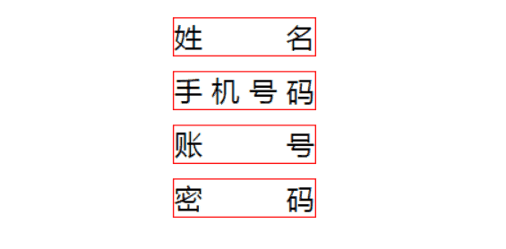

## 1. 建议使用 padding 代替 margin

我们在设计稿还原的时候，`padding` 和 `margin` 两个是常用的属性，但我们知道**属于同一个 BFC 的两个相邻 Box 的 margin 会发生重叠**，所以如果 `margin` 使用的过于频繁的时候，Box 的垂直距离可能就会发生重叠。

还有一个问题就是第一个子元素的 `margin-top` 值会加在父元素上的 bug（最后一个子元素的 `margin-bottom` 也存在类似的问题）。这里是不是有人问为什么呢？

原因就在于：

> 所有毗邻的两个或多个盒元素的 `margin` 将会合并为一个 `margin` 共享。 毗邻的定义为：同级或者嵌套的盒元素，并且它们之间没有非空内容、`Padding` 或 `Border` 分隔。

至于为什么合并我个人觉得这和排队的安全距离有点类似，人与人之间的安全距离是 1m，如果安全距离不合并，那么我们在排队的时候是不是人与人的距离就变成 2m 了。当然很可能不是这个原因。

所以我们可以在首位元素使用 `padding` 来替代 `margin`。当然有的时候使用 `padding` 不能满足需求，这时你也可以在“非空内容”这个条件做文章。即在父元素添加一个伪元素。

> **所以我们在使用 margin 的时候一定要注意 collapsing margins 问题。**

## 2. position:fixed 降级问题

不知道曾经的你是不是遇到吸顶效果，就是使用 `position:fixed` 这个属性。其实如果其父元素中有使用 `transform`，`fixed` 的效果会降级为 `absolute`。

**解决方案：**

既然会降级为 `absolute` 效果，我们该怎么解决这个问题呢？我们就改考虑什么情况下 `fixed` 和 `absolute` 的表现效果会是一样的。

即当使用 `fixed` 的直接父元素的高度和屏幕的高度相同时 `fixed` 和 `absolute` 的表现效果会是一样的。

> 如果这个直接父级内的元素存在滚动的情况，那就加上 `overflow-y: auto`。

## 3. 合理使用 px | em | rem | % 等单位

在 CSS 中有许多距离单位，比如 px | em | rem | %，还有 CSS3 中的 vh | vw 等单位。

那么我们在项目中应该如何使用呢？我们在 pc 端不需要考虑的这么复杂，所以这里我们主要讲讲这些单位在移动端中的使用。

#### 基础单位 px

px 是我们最早接触到的单位了，不过我们在移动端自适应的要求下，使用的频率不是很高；我总结了以下使用的情况：

**比较小的图案**

比如需要我们画一个 r 为 5px 的圆，如果我们使用 rem 作为单位，我们很快会发现在一些机型上的图案不圆，会呈现椭圆形。这是由于 rem 转 px 会存在精度丢失问题。

所以这个时候我们就需要使用 px 配合 dpr 来实现：

```less
// less 
/*@size 建议取双数*/
.circle(@size, @backgroundColor) {  
    width: @size;
    height: @size;
    background-color: @backgroundColor;
    [data-dpr="1"] & {
        width: @size * 0.5;
        height: @size * 0.5;
    }
    [data-dpr="3"] & {
        width: @size * 1.5;
        height: @size * 1.5;
    }
}
```

**1px 细线问题**

这个问题下面我会单独做一小节讲，在这里就不累述。

**字体大小（基本都是用 rem 作为单位）**

一般情况字体的大小我也会使用 rem 作为单位，因为精度丢失我认为在可以接受的范围之内。

#### 相对单位 rem

rem 是 CSS3 新增的一个相对单位（root em），即**相对 HTML 根元素的字体大小的值。**

rem 应该是自适应使用的最广泛的单位了。

#### 相对单位 em

em 也是一个相对单位，却是**相对于当前对象内文本的字体大小**。

**line-height**

**一般建议在 `line-height` 使用 em**。因为在需要调整字体大小的时候，只需修改 `font-size` 的值，而 `line-height` 已经设置成了相对行高了。

**首行缩进两个字符**

在存在首行缩进的需求，我也会使用这个单位。

```css
text-indent: 2em
```

#### 视口单位 vw | vh

> vw: 1vw = 视口宽度的 1%
>  vh: 1vh = 视口高度的 1%

我们知道以 rem 单位设计的弹性布局，是需要在头部加载一段脚本来进行监听分辨率的变化来动态改变根元素字体大小，使得 CSS 与 JS 耦合了在一起。

那么有没有方案解决这个耦合的问题呢？

> 答案就是视口单位 vw | vh。

以下就是前人给出的使用方案：

```scss
$vm_fontsize: 75;
@function rem($px) {
     @return ($px / $vm_fontsize ) * 1rem;
}
$vm_design: 750;
html {
    font-size: ($vm_fontsize / ($vm_design / 2)) * 100vw; 
    @media screen and (max-width: 320px) {
        font-size: 64px;
    }
    @media screen and (min-width: 540px) {
        font-size: 108px;
    }
}
// body 也增加最大最小宽度限制，避免默认100%宽度的 block 元素跟随 body 而过大过小
body {
    max-width: 540px;
    min-width: 320px;
}
```

## 4. 合理使用变量

一般设计稿中的某一类的文字（元素）都是用相同的字体大小、颜色、行高等样式属性，所以这些值我们不必每次都重复写，因为当 UI 更新设计方案，你需要改的地方就很多了。这些重复使用的值我们完全可以存放在变量里面。

Sass 和 Less 稍微有点区别：

```less
// sass
$direction: left;
// less
@direction: left;
复制代码
```

当然 CSS 原生也是存在变量的，使用规则如下：

> 变量定义的语法是： --*；  //  *为变量名称。 变量使用的语法是：var(*)；

1. 无论是变量的定义和使用只能在声明块 {} 里面
2. CSS 变量字符限制为： [0-9]、[a-zA-Z]、_、-、中文和韩文等。

```css
:root {
    --blue_color: #3388ff;
    --main_bgcolor: #fafafa;
    --font_size_12: 12px;
    --font_size_14: 14px;
    --color: 20px;
}
.div1{
    background-color: var(--main_bgcolor);
    font-size: var(--font_size_12);
}
```

## 5. 使用 Mixin 归类重复样式

和重复变量一样，重复的样式也可以归类。我觉得优秀的代码其中有一条肯定是代码的复用性强。

之前我们写 CSS 的时候，也会将一些重复使用的代码放在一个 class 中，这样的确达到了一定的复用性，不过最后的效果可能就是在一个元素里面放了很多 class，如下图：


这样下一个接手得人难免会有点迷糊，而且这样会造成样式越来越难修改。

这个时候，mixin( 可以理解成 class 中的 class )就能发挥它的作用了。

这是一个描述性文字的样式：

```less
.font-description {
    .font-des-style(24px,#fff,1.5em);
    .line-camp(2);
}

// less
/* 多行显示 */
.line-camp( @clamp:2 ) {
    text-overflow: -o-ellipsis-lastline;
    overflow: hidden;
    text-overflow: ellipsis;
    display: -webkit-box;
    -webkit-line-clamp: @clamp;
    -webkit-box-orient: vertical; 
}

.font-des-style( @fontSize, @color, @lineHeight, @textAlign:left ) {
    font-size: @fontSize;
    color: @color;
    line-height: @lineHeight;
    text-align: @textAlign;
}
```

这只是一个简单的例子，我们可以把可复用的样式放在 mixin 中，这样接手项目的人只需要熟悉你写的 mixin.less 就可以开始迭代需求了。

## 6. 1px 方案

做过移动端需求的前端肯定是避免不了处理 `1px` 细线问题，这个问题的原因就是 UI 对页面美观度的要求越来越高（不要和我说这是 retina 屏的问题）。

据小生所知好像没有什么兼容性特别好的方案，这里我只是提供两种种相对较好的方案。

#### 使用伪类 + transform

```css
.border_bottom { 
    overflow: hidden; 
    position: relative; 
    border: none!important; 
}
.border_bottom:after { 
    content: "";
    display: block;
    position: absolute; 
    left: 0; 
    bottom: 0; 
    width: 100%; 
    height: 1px; 
    background-color: #d4d6d7; 
    -webkit-transform-origin: 0 0;  
    transform-origin: 0 0; 
    -webkit-transform: scaleY(0.5);
    transform: scaleY(0.5);
}
复制代码
```

当然这个方案在一些版本较低的机型也是会出现粗细不均、细线消失断裂的兼容性问题。不过现在已经 2019 年了，版本较低的机型也淘汰的差不多了。

#### 使用 box-shadow 模拟

```css
.border_bottom {
  box-shadow: inset 0px -1px 1px -1px #d4d6d7;
}
```

这个方案基本可以满足所有场景，不过有个缺点也就是颜色会变浅。

**多谢 D文斌 分享的另一种方案：** 这种方案对 dpr 做了不同的处理，可谓更加精细。

```scss
.min-device-pixel-ratio(@scale2, @scale3) {
  @media screen and (min-device-pixel-ratio: 2), (-webkit-min-device-pixel-ratio: 2) {
    transform: @scale2;
  }
  @media screen and (min-device-pixel-ratio: 3), (-webkit-min-device-pixel-ratio: 3) {
    transform: @scale3;
  }
}

.border-1px(@color: #DDD, @radius: 2PX, @style: solid) {
  &::before {
    content: "";
    pointer-events: none;
    display: block;
    position: absolute;
    left: 0;
    top: 0;
    transform-origin: 0 0;
    border: 1PX @style @color;
    border-radius: @radius;
    box-sizing: border-box;
    width: 100%;
    height: 100%;
    @media screen and (min-device-pixel-ratio: 2), (-webkit-min-device-pixel-ratio: 2) {
      width: 200%;
      height: 200%;
      border-radius: @radius * 2;
      transform: scale(.5);
    }
    @media screen and (min-device-pixel-ratio: 3), (-webkit-min-device-pixel-ratio: 3) {
      width: 300%;
      height: 300%;
      border-radius: @radius * 3;
      transform: scale(.33);
    }
  }
}

.border-top-1px(@color: #DDD, @style: solid) {
  &::before {
    content: "";
    position: absolute;
    left: 0;
    top: 0;
    width: 100%;
    border-top: 1Px @style @color;
    transform-origin: 0 0;
    .min-device-pixel-ratio(scaleY(.5), scaleY(.33));
  }
}
```

### 7. 从 html 元素继承 box-sizing

在大多数情况下我们在设置元素的 `border` 和 `padding` 并不希望改变元素的 `width,height` 值，这个时候我们就可以为该元素设置 `box-sizing:border-box;`。

我不希望每次都重写一遍，而是希望他是继承而来的，那么我们可以使用如下代码：

```css
html {
  box-sizing: border-box;
}
*, *:before, *:after {
  box-sizing: inherit;
}
```

这样的好处在于他不会覆盖其他组件的 `box-sizing` 值，又无需为每一个元素重复设置 `box-sizing: border-box;`。

## 8. 内联首屏关键 CSS

性能优化中有一个重要的指标 —— 首次有效绘制（FMP），即指页面的首要内容（primary content）出现在屏幕上的时间。这一指标影响用户看到页面前所需等待的时间，而 **内联首屏关键 CSS（即 Critical CSS，可以称之为首屏关键 CSS）** 能给用户一个更好的心理预期。

如图：


我们知道内联 CSS 能够使浏览器开始页面渲染的时间提前，即在 HTML 下载完成之后就能渲染了。

> 既然是内联关键 CSS，也就说明我们只会将少部分的 CSS 代码直接写入 HTML 中。至于内联哪些 CSS 你可以使用 Critical。

### 9. 文字超出省略、文字两端对齐

需求中我们也经常遇到这样的需求，这里直接提供方案。

#### 超出省略

```scss
.line-camp( @clamp:2 ) {
    text-overflow: -o-ellipsis-lastline;
    overflow: hidden;
    text-overflow: ellipsis;
    display: -webkit-box;
    -webkit-line-clamp: @clamp;
    -webkit-box-orient: vertical; 
}
```

**所遇到的问题：**

> `-webkit-box-orient: vertical` 在使用 webpack 打包的时候这段代码会被删除掉，原因是  `optimize-css-assets-webpack-plugin` 这个插件的问题。

**解决方案：**

可以使用如下的写法：

```scss
.line-camp( @clamp:2 ) {
    text-overflow: -o-ellipsis-lastline;
    overflow: hidden;
    text-overflow: ellipsis;
    display: -webkit-box;
    -webkit-line-clamp: @clamp;
    /*! autoprefixer: off */
    -webkit-box-orient: vertical;
    /* autoprefixer: on */
}
```


#### 两端对齐

```css
// html
<div>姓名</div>
<div>手机号码</div>
<div>账号</div>
<div>密码</div>

// css
div {
    margin: 10px 0; 
    width: 100px;
    border: 1px solid red;
    text-align: justify;
    text-align-last:justify
}
div:after{
    content: '';
    display: inline-block;
    width: 100%;
}
```

效果如下：



作者：小生方勤

链接：https://juejin.im/post/5cb45a06f265da03474df54e

来源：掘金

