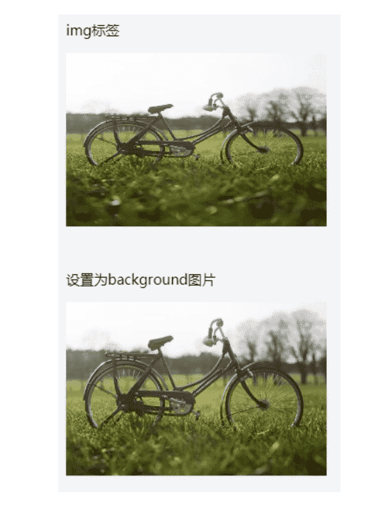
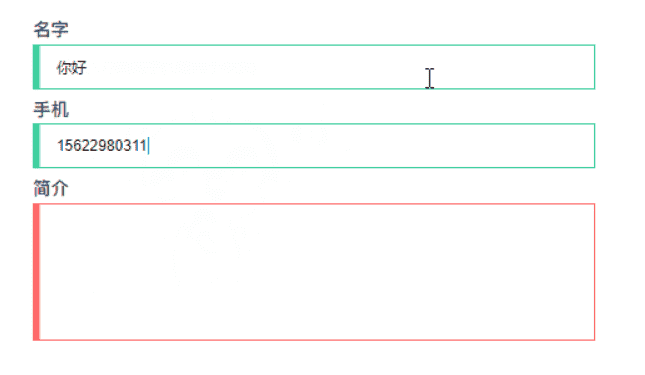
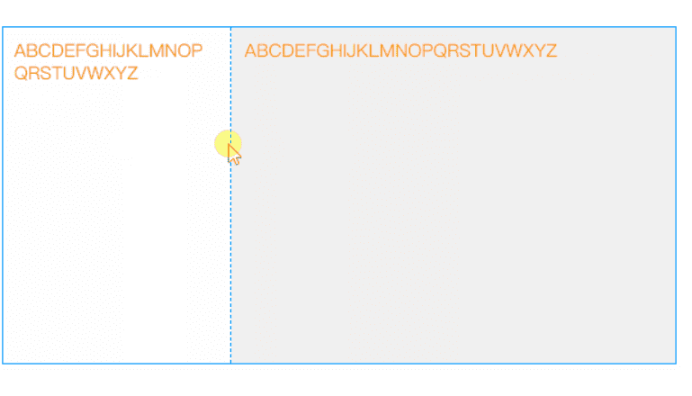
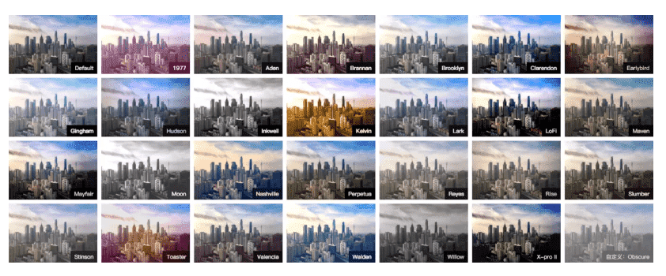

## 1. 建议使用 padding 代替 margin

我们在设计稿还原的时候，`padding` 和 `margin` 两个是常用的属性，但我们知道**属于同一个 BFC 的两个相邻 Box 的 margin 会发生重叠**，所以如果 `margin` 使用的过于频繁的时候，Box 的垂直距离可能就会发生重叠。

还有一个问题就是第一个子元素的 `margin-top` 值会加在父元素上的 bug（最后一个子元素的 `margin-bottom` 也存在类似的问题）。这里是不是有人问为什么呢？

原因就在于：

> 所有毗邻的两个或多个盒元素的 `margin` 将会合并为一个 `margin` 共享。 毗邻的定义为：同级或者嵌套的盒元素，并且它们之间没有非空内容、`Padding` 或 `Border` 分隔。

至于为什么合并我个人觉得这和排队的安全距离有点类似，人与人之间的安全距离是 1m，如果安全距离不合并，那么我们在排队的时候是不是人与人的距离就变成 2m 了。当然很可能不是这个原因。

所以我们可以在首位元素使用 `padding` 来替代 `margin`。当然有的时候使用 `padding` 不能满足需求，这时你也可以在“非空内容”这个条件做文章。即在父元素添加一个伪元素。

> **所以我们在使用 margin 的时候一定要注意 collapsing margins 问题。**

## 2. position:fixed 降级问题

不知道曾经的你是不是遇到吸顶效果，就是使用 `position:fixed` 这个属性。其实如果其父元素中有使用 `transform`，`fixed` 的效果会降级为 `absolute`。

**解决方案：**

既然会降级为 `absolute` 效果，我们该怎么解决这个问题呢？我们就改考虑什么情况下 `fixed` 和 `absolute` 的表现效果会是一样的。

即当使用 `fixed` 的直接父元素的高度和屏幕的高度相同时 `fixed` 和 `absolute` 的表现效果会是一样的。

> 如果这个直接父级内的元素存在滚动的情况，那就加上 `overflow-y: auto`。

## 3. 合理使用 px | em | rem | % 等单位

在 CSS 中有许多距离单位，比如 px | em | rem | %，还有 CSS3 中的 vh | vw 等单位。

那么我们在项目中应该如何使用呢？我们在 pc 端不需要考虑的这么复杂，所以这里我们主要讲讲这些单位在移动端中的使用。

#### 基础单位 px

px 是我们最早接触到的单位了，不过我们在移动端自适应的要求下，使用的频率不是很高；我总结了以下使用的情况：

**比较小的图案**

比如需要我们画一个 r 为 5px 的圆，如果我们使用 rem 作为单位，我们很快会发现在一些机型上的图案不圆，会呈现椭圆形。这是由于 rem 转 px 会存在精度丢失问题。

所以这个时候我们就需要使用 px 配合 dpr 来实现：

```less
// less 
/*@size 建议取双数*/
.circle(@size, @backgroundColor) {  
    width: @size;
    height: @size;
    background-color: @backgroundColor;
    [data-dpr="1"] & {
        width: @size * 0.5;
        height: @size * 0.5;
    }
    [data-dpr="3"] & {
        width: @size * 1.5;
        height: @size * 1.5;
    }
}
```

**1px 细线问题**

这个问题下面我会单独做一小节讲，在这里就不累述。

**字体大小（基本都是用 rem 作为单位）**

一般情况字体的大小我也会使用 rem 作为单位，因为精度丢失我认为在可以接受的范围之内。

#### 相对单位 rem

rem 是 CSS3 新增的一个相对单位（root em），即**相对 HTML 根元素的字体大小的值。**

rem 应该是自适应使用的最广泛的单位了。

#### 相对单位 em

em 也是一个相对单位，却是**相对于当前对象内文本的字体大小**。

**line-height**

**一般建议在 `line-height` 使用 em**。因为在需要调整字体大小的时候，只需修改 `font-size` 的值，而 `line-height` 已经设置成了相对行高了。

**首行缩进两个字符**

在存在首行缩进的需求，我也会使用这个单位。

```css
text-indent: 2em
```

#### 视口单位 vw | vh

> vw: 1vw = 视口宽度的 1%
>  vh: 1vh = 视口高度的 1%

我们知道以 rem 单位设计的弹性布局，是需要在头部加载一段脚本来进行监听分辨率的变化来动态改变根元素字体大小，使得 CSS 与 JS 耦合了在一起。

那么有没有方案解决这个耦合的问题呢？

> 答案就是视口单位 vw | vh。

以下就是前人给出的使用方案：

```scss
$vm_fontsize: 75;
@function rem($px) {
     @return ($px / $vm_fontsize ) * 1rem;
}
$vm_design: 750;
html {
    font-size: ($vm_fontsize / ($vm_design / 2)) * 100vw; 
    @media screen and (max-width: 320px) {
        font-size: 64px;
    }
    @media screen and (min-width: 540px) {
        font-size: 108px;
    }
}
// body 也增加最大最小宽度限制，避免默认100%宽度的 block 元素跟随 body 而过大过小
body {
    max-width: 540px;
    min-width: 320px;
}
```

## 4. 合理使用变量

一般设计稿中的某一类的文字（元素）都是用相同的字体大小、颜色、行高等样式属性，所以这些值我们不必每次都重复写，因为当 UI 更新设计方案，你需要改的地方就很多了。这些重复使用的值我们完全可以存放在变量里面。

Sass 和 Less 稍微有点区别：

```less
// sass
$direction: left;
// less
@direction: left;
复制代码
```

当然 CSS 原生也是存在变量的，使用规则如下：

> 变量定义的语法是： --*；  //  *为变量名称。 变量使用的语法是：var(*)；

1. 无论是变量的定义和使用只能在声明块 {} 里面
2. CSS 变量字符限制为： [0-9]、[a-zA-Z]、_、-、中文和韩文等。

```css
:root {
    --blue_color: #3388ff;
    --main_bgcolor: #fafafa;
    --font_size_12: 12px;
    --font_size_14: 14px;
    --color: 20px;
}
.div1{
    background-color: var(--main_bgcolor);
    font-size: var(--font_size_12);
}
```

## 5. 使用 Mixin 归类重复样式

和重复变量一样，重复的样式也可以归类。我觉得优秀的代码其中有一条肯定是代码的复用性强。

之前我们写 CSS 的时候，也会将一些重复使用的代码放在一个 class 中，这样的确达到了一定的复用性，不过最后的效果可能就是在一个元素里面放了很多 class，如下图：


这样下一个接手得人难免会有点迷糊，而且这样会造成样式越来越难修改。

这个时候，mixin( 可以理解成 class 中的 class )就能发挥它的作用了。

这是一个描述性文字的样式：

```less
.font-description {
    .font-des-style(24px,#fff,1.5em);
    .line-camp(2);
}

// less
/* 多行显示 */
.line-camp( @clamp:2 ) {
    text-overflow: -o-ellipsis-lastline;
    overflow: hidden;
    text-overflow: ellipsis;
    display: -webkit-box;
    -webkit-line-clamp: @clamp;
    -webkit-box-orient: vertical; 
}

.font-des-style( @fontSize, @color, @lineHeight, @textAlign:left ) {
    font-size: @fontSize;
    color: @color;
    line-height: @lineHeight;
    text-align: @textAlign;
}
```

这只是一个简单的例子，我们可以把可复用的样式放在 mixin 中，这样接手项目的人只需要熟悉你写的 mixin.less 就可以开始迭代需求了。

## 6. 1px 方案

做过移动端需求的前端肯定是避免不了处理 `1px` 细线问题，这个问题的原因就是 UI 对页面美观度的要求越来越高（不要和我说这是 retina 屏的问题）。

据小生所知好像没有什么兼容性特别好的方案，这里我只是提供两种种相对较好的方案。

#### 使用伪类 + transform

```css
.border_bottom { 
    overflow: hidden; 
    position: relative; 
    border: none!important; 
}
.border_bottom:after { 
    content: "";
    display: block;
    position: absolute; 
    left: 0; 
    bottom: 0; 
    width: 100%; 
    height: 1px; 
    background-color: #d4d6d7; 
    -webkit-transform-origin: 0 0;  
    transform-origin: 0 0; 
    -webkit-transform: scaleY(0.5);
    transform: scaleY(0.5);
}
复制代码
```

当然这个方案在一些版本较低的机型也是会出现粗细不均、细线消失断裂的兼容性问题。不过现在已经 2019 年了，版本较低的机型也淘汰的差不多了。

#### 使用 box-shadow 模拟

```css
.border_bottom {
  box-shadow: inset 0px -1px 1px -1px #d4d6d7;
}
```

这个方案基本可以满足所有场景，不过有个缺点也就是颜色会变浅。

**多谢 D文斌 分享的另一种方案：** 这种方案对 dpr 做了不同的处理，可谓更加精细。

```scss
.min-device-pixel-ratio(@scale2, @scale3) {
  @media screen and (min-device-pixel-ratio: 2), (-webkit-min-device-pixel-ratio: 2) {
    transform: @scale2;
  }
  @media screen and (min-device-pixel-ratio: 3), (-webkit-min-device-pixel-ratio: 3) {
    transform: @scale3;
  }
}

.border-1px(@color: #DDD, @radius: 2PX, @style: solid) {
  &::before {
    content: "";
    pointer-events: none;
    display: block;
    position: absolute;
    left: 0;
    top: 0;
    transform-origin: 0 0;
    border: 1PX @style @color;
    border-radius: @radius;
    box-sizing: border-box;
    width: 100%;
    height: 100%;
    @media screen and (min-device-pixel-ratio: 2), (-webkit-min-device-pixel-ratio: 2) {
      width: 200%;
      height: 200%;
      border-radius: @radius * 2;
      transform: scale(.5);
    }
    @media screen and (min-device-pixel-ratio: 3), (-webkit-min-device-pixel-ratio: 3) {
      width: 300%;
      height: 300%;
      border-radius: @radius * 3;
      transform: scale(.33);
    }
  }
}

.border-top-1px(@color: #DDD, @style: solid) {
  &::before {
    content: "";
    position: absolute;
    left: 0;
    top: 0;
    width: 100%;
    border-top: 1Px @style @color;
    transform-origin: 0 0;
    .min-device-pixel-ratio(scaleY(.5), scaleY(.33));
  }
}
```

## 7. 从 html 元素继承 box-sizing

在大多数情况下我们在设置元素的 `border` 和 `padding` 并不希望改变元素的 `width,height` 值，这个时候我们就可以为该元素设置 `box-sizing:border-box;`。

我不希望每次都重写一遍，而是希望他是继承而来的，那么我们可以使用如下代码：

```css
html {
  box-sizing: border-box;
}
*, *:before, *:after {
  box-sizing: inherit;
}
```

这样的好处在于他不会覆盖其他组件的 `box-sizing` 值，又无需为每一个元素重复设置 `box-sizing: border-box;`。

## 8. 内联首屏关键 CSS

性能优化中有一个重要的指标 —— 首次有效绘制（FMP），即指页面的首要内容（primary content）出现在屏幕上的时间。这一指标影响用户看到页面前所需等待的时间，而 **内联首屏关键 CSS（即 Critical CSS，可以称之为首屏关键 CSS）** 能给用户一个更好的心理预期。

如图：


我们知道内联 CSS 能够使浏览器开始页面渲染的时间提前，即在 HTML 下载完成之后就能渲染了。

> 既然是内联关键 CSS，也就说明我们只会将少部分的 CSS 代码直接写入 HTML 中。至于内联哪些 CSS 你可以使用 Critical。

## 9. 文字超出省略、文字两端对齐

需求中我们也经常遇到这样的需求，这里直接提供方案。

#### 超出省略

```scss
.line-camp( @clamp:2 ) {
    text-overflow: -o-ellipsis-lastline;
    overflow: hidden;
    text-overflow: ellipsis;
    display: -webkit-box;
    -webkit-line-clamp: @clamp;
    -webkit-box-orient: vertical; 
}
```

**所遇到的问题：**

> `-webkit-box-orient: vertical` 在使用 webpack 打包的时候这段代码会被删除掉，原因是  `optimize-css-assets-webpack-plugin` 这个插件的问题。

**解决方案：**

可以使用如下的写法：

```scss
.line-camp( @clamp:2 ) {
    text-overflow: -o-ellipsis-lastline;
    overflow: hidden;
    text-overflow: ellipsis;
    display: -webkit-box;
    -webkit-line-clamp: @clamp;
    /*! autoprefixer: off */
    -webkit-box-orient: vertical;
    /* autoprefixer: on */
}
```


#### 两端对齐

```css
// html
<div>姓名</div>
<div>手机号码</div>
<div>账号</div>
<div>密码</div>

// css
div {
    margin: 10px 0; 
    width: 100px;
    border: 1px solid red;
    text-align: justify;
    text-align-last:justify
}
div:after{
    content: '';
    display: inline-block;
    width: 100%;
}
```

效果如下：


来自：作者：小生方勤

链接：https://juejin.im/post/5cb45a06f265da03474df54e

来源：掘金


## 10.注意外边距折叠

与其他大多数属性不同，上下的垂直外边距margin在同时存在时会发生外边距折叠。这意味着当一个元素的下边缘接触到另一个元素的上边缘时，只会保留两个margin值中较大的那个。例如：

HTML

```html
<div class="square red"></div>
<div class="square blue"></div>
```

CSS

```css
.square {
    width: 80px;
    height: 80px;
}
.red {
    background-color: #F44336;
    margin-bottom: 40px;
}
.blue {
    background-color: #2196F3;
    margin-top: 30px;
}
```


红色方块与蓝色方块的上下间距是40px，而不是70px。解决外边距折叠的方法有很多种，对于初学者来说最简单的就是所有元素只使用一个方向上的margin，比如上下的外边距我们统统使用margin-bottom。

## 11.重置元素的CSS样式

尽管这些年来有了很大的改善，但是不同浏览器对于各种元素的默认样式仍然存在很大的差异。解决这个问题的最佳办法是在CSS开头为所有的元素设置通用的CSS Reset重置代码，这样你是在没有任何默认内外边距的基础上进行布局，于是所产生的效果也就是统一的。

网络上已经有成熟的CSS代码库为我们解决浏览器不一致问题，例如normalize.css、minireset和ress，你可以在你的项目中引用它们。如果你不想使用第三方代码库，你可以使用下面的样式来进行一个非常基本的CSS reset：

```css
* {
    margin: 0;
    padding: 0;
    box-sizing: border-box;
}
```

上面的代码看起来有些霸道，将所有元素的内外边距都设置为0了，而正是没有了这些默认内外边距的影响，使得我们后面的CSS设置会更加的容易。同时box-sizing: border-box也是一个很棒的设置，我们紧接着就会介绍它。

## 12.所有元素设置为Border-box

大多数初学者都不知道box-sizing这个属性，但实际上它非常重要。box-sizing属性有两个值：

- content-box（默认） - 当我们设置一个元素的宽度或高度时，就是设置它的内容的大小。所有的padding和边框值都不包含。例如，一个div的宽度设置为100，padding为10，于是这个元素将占用120像素（100+2*10）。
- border-box - padding与边框包含在元素的宽度或高度中，一个设置为width: 100px和box-sizing:
  border-box的div元素，他的总宽度就是100px，无论它的内边距和边框有多少。

将所有元素都设置为border-box，可以更轻松的改变元素的大小，而不必担心padding或者border值会将元素撑开变形或者换行显示。

## 13.将图片作为背景

当给页面添加图片时，尤其需要图片是响应式的时候，最好使用backgroundå±æ€§æ¥å¼•å…¥å›¾ç‰‡ï¼Œè€Œä¸æ˜¯æ ‡ç­¾ã€‚

这看起来使用图片会更复杂，但实际上它会使设置图片的样式变得更加容易。有了background-size, background-position和其它的属性，保持或改变图片原始尺寸和宽高比会更方便。

举个例子
HTML

```html
<section>
    <p>Img element</p>
    
</section>

<section>
    <p>Div with background image</p>
    <div></div>
</section>
```

CSS

```css
img {
    width: 300px;
    height: 200px;
}

div {
    width: 300px;
    height: 200px;
    background: url('https://tutorialzine.com/media/2016/08/bicycle.jpg');
    background-position: center center;
    background-size: cover;
}

section{
    float: left;
    margin: 15px;
}
```



background引入图片的一个缺点是页面的Web可访问性会受到轻微的影响，因为屏幕阅读器和搜索引擎无法正确地获取到图像。这个问题可以通过CSS object-fit属性解决，到目前为止除了IE浏览器其他的浏览器都可以使用object-fit(如下)。

每个属性值的具体含义如下（自己理解的白话文，官方释义见官网）：

- **fill**: 中文释义“填充”。默认值。替换内容拉伸填满整个content box, 不保证保持原有的比例。
- **contain**: 中文释义“包含”。保持原有尺寸比例。保证替换内容尺寸一定可以在容器里面放得下。因此，此参数可能会在容器内留下空白。
- **cover**: 中文释义“覆盖”。保持原有尺寸比例。保证替换内容尺寸一定大于容器尺寸，宽度和高度至少有一个和容器一致。因此，此参数可能会让替换内容（如图片）部分区域不可见。
- **none**: 中文释义“无”。保持原有尺寸比例。同时保持替换内容原始尺寸大小。
- **scale-down**: 中文释义“降低”。就好像依次设置了**none**或**contain**, 最终呈现的是尺寸比较小的那个。

## 14.短横线命名

当class或者ID包含多个单词时，应使用连字符（-），CSS不区分大小写，因此不能使用驼峰式命名。同样，CSS中也不建议使用下划线连接的命名方式。

```css
/*  正确     */
.footer-column-left { }

/*  错误  */
.footerColumnLeft { }

.footer_column_left { }
```

当涉及到命名时，您还可以考虑BEM，它遵循一组原则，提供基于组件并增加一致性的开发方法。

## 15.不要重复设置

大多数CSS属性的值都是从DOM树中向上一级的元素继承的，因此才被命名为级联样式表。以font属性为例-它总是从父级继承的，您不必为页面上的每个元素都单独设置。

只需将要设置的字体样式添加到html或body元素中，然后让它们自动向下继承。

```css
html {
    font: normal 16px/1.4 sans-serif;
}
```

然后我们就可以统一的一次改变页面上所有的文字样式了。当然，CSS中并不是所有的属性都是可继承的，对于这些属性我们仍然需要在每个元素上单独设置。

::: tip 附：可继承属性

所有元素可继承：visibility和cursor。 

内联元素可继承：[letter-spacing](https://www.baidu.com/s?wd=letter-spacing&tn=44039180_cpr&fenlei=mv6quAkxTZn0IZRqIHckPjm4nH00T1Ykm1m4PHwhPjf1PWczujDk0ZwV5Hcvrjm3rH6sPfKWUMw85HfYnjn4nH6sgvPsT6KdThsqpZwYTjCEQLGCpyw9Uz4Bmy-bIi4WUvYETgN-TLwGUv3EnHDLn1bknjmsn1cdn104Pjc4rf)、[word-spacing](https://www.baidu.com/s?wd=word-spacing&tn=44039180_cpr&fenlei=mv6quAkxTZn0IZRqIHckPjm4nH00T1Ykm1m4PHwhPjf1PWczujDk0ZwV5Hcvrjm3rH6sPfKWUMw85HfYnjn4nH6sgvPsT6KdThsqpZwYTjCEQLGCpyw9Uz4Bmy-bIi4WUvYETgN-TLwGUv3EnHDLn1bknjmsn1cdn104Pjc4rf)、[white-space](https://www.baidu.com/s?wd=white-space&tn=44039180_cpr&fenlei=mv6quAkxTZn0IZRqIHckPjm4nH00T1Ykm1m4PHwhPjf1PWczujDk0ZwV5Hcvrjm3rH6sPfKWUMw85HfYnjn4nH6sgvPsT6KdThsqpZwYTjCEQLGCpyw9Uz4Bmy-bIi4WUvYETgN-TLwGUv3EnHDLn1bknjmsn1cdn104Pjc4rf)、[line-height](https://www.baidu.com/s?wd=line-height&tn=44039180_cpr&fenlei=mv6quAkxTZn0IZRqIHckPjm4nH00T1Ykm1m4PHwhPjf1PWczujDk0ZwV5Hcvrjm3rH6sPfKWUMw85HfYnjn4nH6sgvPsT6KdThsqpZwYTjCEQLGCpyw9Uz4Bmy-bIi4WUvYETgN-TLwGUv3EnHDLn1bknjmsn1cdn104Pjc4rf)、color、font、[font-family](https://www.baidu.com/s?wd=font-family&tn=44039180_cpr&fenlei=mv6quAkxTZn0IZRqIHckPjm4nH00T1Ykm1m4PHwhPjf1PWczujDk0ZwV5Hcvrjm3rH6sPfKWUMw85HfYnjn4nH6sgvPsT6KdThsqpZwYTjCEQLGCpyw9Uz4Bmy-bIi4WUvYETgN-TLwGUv3EnHDLn1bknjmsn1cdn104Pjc4rf)、font-size、font-style、font-variant、[font-weight](https://www.baidu.com/s?wd=font-weight&tn=44039180_cpr&fenlei=mv6quAkxTZn0IZRqIHckPjm4nH00T1Ykm1m4PHwhPjf1PWczujDk0ZwV5Hcvrjm3rH6sPfKWUMw85HfYnjn4nH6sgvPsT6KdThsqpZwYTjCEQLGCpyw9Uz4Bmy-bIi4WUvYETgN-TLwGUv3EnHDLn1bknjmsn1cdn104Pjc4rf)、[text-decoration](https://www.baidu.com/s?wd=text-decoration&tn=44039180_cpr&fenlei=mv6quAkxTZn0IZRqIHckPjm4nH00T1Ykm1m4PHwhPjf1PWczujDk0ZwV5Hcvrjm3rH6sPfKWUMw85HfYnjn4nH6sgvPsT6KdThsqpZwYTjCEQLGCpyw9Uz4Bmy-bIi4WUvYETgN-TLwGUv3EnHDLn1bknjmsn1cdn104Pjc4rf)、text-transform、direction。 

终端块状元素可继承：text-indent和text-align。 

列表元素可继承：list-style、list-style-type、list-style-position、list-style-image。  

:::

## 16.使用transform属性来创建动画

最好使用transform()函数来创建元素的位移或大小动画，尽量不要直接改变元素的width，height以及left/top/bottom/right属性值。

下面的例子中，我们给.ball元素添加了一个从左向右的移动动画。推荐使用transform: translateX()函数来代替left属性。

```css
.ball {
    left: 50px;
    transition: 0.4s ease-out;
}

/* 不建议 */
.ball.slide-out {
    left: 500px;
}

/* 建议 */
.ball.slide-out {
    transform: translateX(450px);
}
```

transform以及它的所有函数（translate, rotate, scale等）几乎没有浏览器兼容性问题，可以随意使用。

## 17.使用text-transform转换字母为大写

> 本条适用于英文环境，不适合中文

在HTML中，可以将某个单词全部写为大写字母来表达强调的含义。比如：

```html
<h3>Employees MUST wear a helmet!</h3>
```

如果你需要将某段文字全部转化为大写，我们可以在HTML中正常书写，然后通过CSS来转化。这样可以保持上下文内容的一致性。

```html
<div class="movie-poster">Star Wars: The Force Awakens</div>
```


```css
.movie-poster {
    text-transform: uppercase;
}
```

## 18.em, rem与px

设置元素与文本的大小应该用哪种单位，em，rem，还是px？一直以来都有很多的争论。事实是，这三种选择都是可行的，都有其利弊。

在什么时候在什么项目使用哪种单位是没有一个定论的，开发人员的习惯不同，项目的要求不同，都可能会使用不同的单位。然而，虽然没有固定的规则，但是每种单位还是有一些要注意的地方的：

- em - **设置元素为1em，其大小与父元素的font-size属性有关**。这个单位用于媒体查询中，特别适用于响应式开发，但是由于em单位在每一级中都是相对于父元素进行计算的，所以要得出某个子元素em单位对应的px值，有时候是很麻烦的。
- rem - **相对于html元素的font-size大小计算**，rem使得统一改变页面上的所有标题和段落文本大小变得非常容易。
- px - **像素单位是最精确的，但是不适用于自适应的设计**。px单位是可靠的，并且易于理解，我们可以精细的控制元素的大小和移动到1px。

最重要的是，不要害怕尝试，尝试所有方法，看看最适合什么。有时候，em和rem可以节省很多工作，尤其是在构建响应式页面时。

来自：https://segmentfault.com/a/1190000019542534


## 19.使用负值 outline-offset 实现加号

假设我们有这样一个简单的结构：

```css
<div></div>
div {
    width: 200px; height: 200px;
    outline: 20px solid #000;
    outline-offset: 10px;
}
```


修改 `outline-offset` 到一个合适的负值 ，那么在恰当的时候，outline 边框就会向内缩进为一个加号。

经过一番尝试，修改上述 div 的 `outline-offset`为 -118px。

```css
div {
    width: 200px; height: 200px;
    outline: 20px solid #000;
    outline-offset: -118px;
}
```


很有意思，我尝试了很多不同的情况，最后总结了一个简单的规律，要使用负的 outline-offset 生成一个加号有一些简单的限制：

::: tip 特性

- 容器得是个正方形
- outline 边框本身的宽度不能太小
- outline-offset 负值 x 的取值范围为: -(容器宽度的一半 + outline宽度的一半) < x < -(容器宽度的一半 + outline宽度)

:::

在这个例子后，我又想，CSS 属性可以取负值的地方有很多。大家最为熟知的就是**负margin**，使用负的 marign，可以用来实现类似多列等高布局、垂直居中等等。那还有没有其他一些有意思的负值使用技巧呢？

下文就再介绍一些 CSS 负值有意思的使用场景。

## 20.单侧投影

先说单侧投影，关于 `box-shadow`，大部分时候，我们使用它都是用来生成一个两侧的投影，或者一个四侧的投影。如下：


OK，那如果要生成一个单侧的投影呢？

我们来看看 box-shadow 的用法定义：

```css
{
    box-shadow: none | [inset? && [ <offset-x> <offset-y> <blur-radius>? <spread-radius>? 				  <color>? ] ]#
}
```

以 `box-shadow: 1px 2px 3px 4px #333` 为例，4 个数值的含义分别是，x 方向偏移值、y 方向偏移值 、模糊半径、扩张半径。

这里有一个小技巧，**扩张半径可以为负值**。

继续，如果阴影的模糊半径，与**负的**扩张半径一致，那么我们将看不到任何阴影，因为生成的阴影将被包含在原来的元素之下，除非给它设定一个方向的偏移量。所以这个时候，我们给定一个方向的偏移值，即可实现单侧投影：


[CodePen Demo -- css单侧投影](https://link.juejin.im/?target=https%3A%2F%2Fcodepen.io%2FChokcoco%2Fpen%2FpergRb)

## 21.使用 scale(-1) 实现翻转

通常，我们要实现一个元素的 180° 翻转，我们会使用 `transform: rotate(180deg)`，这里有个小技巧，使用 `transform: scale(-1)` 可以达到同样的效果。看个 Demo：

```css
<p class="scale">CSS Nagative Scale(-1)</p>
.scale {
    transform: scale(1);
    animation: scale 10s infinite linear;
}

@keyframes scale{
    50% {
        transform: scale(-1);
    }  
    100% {
        transform: scale(-1);
    }
}
```

看看效果：


（**GIF 中第一行是使用了 transform: rotate(180deg) 的效果**）

[CodePen Demo -- 使用 scale(-1) 实现元素的翻转](https://link.juejin.im/?target=https%3A%2F%2Fcodepen.io%2FChokcoco%2Fpen%2FVoQXVq)

## 22.使用负 letter-spacing 倒序排列文字

与上面 scale(-1) 有异曲同工之妙的是负的 `letter-spacing`。

`letter-spacing` 属性明确了文字的间距行为，通常而言，除了关键字 `normal`，我们还可以指定一个大小，表示文字的间距。像这样：

```css
<p class="letter_spacing">倒序排列文字</p>
复制代码
.letter_spacing {
    font-size: 36px;
    letter-spacing: 0px;
    animation: move 10s infinite;
}

@keyframes move {
    40% {
        letter-spacing: 36px;
    }
    80% {
        letter-spacing: -72px;
    }
    100% {
        letter-spacing: -72px;
    }
}
```

我们设置文字的 `letter-spacing` 从 0 -> 36px -> -72px，观察不同的变化：


[CodePen Demo -- 负letter-spacing倒序排列文字](https://link.juejin.im/?target=https%3A%2F%2Fcodepen.io%2FChokcoco%2Fpen%2FQeQXpW)


然而，受到中英文混排或者不同字体的影响，以及倒序后的排列方式，不建议使用这种方式来倒序排列文字。

## 23.transition-delay 及 animation-delay 的负值使用，立刻开始动画

我们知道，CSS 动画及过渡提供了一个 delay 属性，可以延迟动画的进行。

考虑下面这个动画：


简单的代码大概是这样：

```css
<div class="g-container">
    <div class="item"></div>
    <div class="item"></div>
    <div class="item"></div>
</div>
.item {
    transform: rotate(0) translate(-80px, 0) ;
}

.item:nth-child(1) {
    animation: rotate 3s infinite linear;
}

.item:nth-child(2) {
    animation: rotate 3s infinite 1s linear;
}

.item:nth-child(3) {
    animation: rotate 3s infinite 2s linear;
}


@keyframes rotate {
    100% {
        transform: rotate(360deg) translate(-80px, 0) ;
    }
}
```

如果，我们想去掉这个延迟，希望在一进入页面的时候，3 个球就是同时运动的。这个时候，只需要把正向的 animation-delay 改成负向的即可。

```css
.item:nth-child(1) {
    animation: rotate 3s infinite linear;
}

.item:nth-child(2) {
    animation: rotate 3s infinite -1s linear;
}

.item:nth-child(3) {
    animation: rotate 3s infinite -2s linear;
}
```

这里，有个小技巧，**被设置了 animation-dealy 为负值的动画会立刻执行，开始的位置是其动画阶段中的一个阶段**。所以，动画在一开始的时刻就是下面这样：


以上述动画为例，一个被定义执行 3s 的动画，如果 `animation-delay` 为 -1s，起点相当于正常执行时，第2s（3-1）时的位置。

[CodePen Demo -- 使用负值 animation-delay 提前执行动画](https://link.juejin.im/?target=https%3A%2F%2Fcodepen.io%2FChokcoco%2Fpen%2Fymvjez)

## 24.负值 margin

负值 margin 在 CSS 中算是运用的比较多的，元素的外边距可以设置为负值。

在 flexbox 布局规范还没流行之前，实现多行等高布局还是需要下一番功夫的。其中一种方法便是使用正 padding 负 margin 相消的方法。

有如下一个布局：


左右两栏的内容都是不确定的，也就是高度未知。但是希望无论左侧内容较多还是右侧内容较多，两栏的高度始终保持一致。

OK，其中一种 Hack 办法便是使用一个很大的正 padding 和相同的负 margin 相消的方法填充左右两栏：

```css
.g-left {
  ...
  padding-bottom: 9999px;
  margin-bottom: -9999px;
}

.g-right {
  ...
  padding-bottom: 9999px;
  margin-bottom: -9999px;
}
```

可以做到无论左右两栏高度如何变化，高度较低的那一栏都会随着另外一栏变化。

具体的代码可以看看这里：[CodePen Demo -- 正padding负margin实现多列等高布局](https://link.juejin.im?target=https%3A%2F%2Fcodepen.io%2FChokcoco%2Fpen%2FZgrmVy)

### 总结一下

另外，还有一些大家熟知的没有单独列出来的，譬如：

- 使用负 marign 实现元素的水平垂直居中
- 使用负 marign隐藏列表 li 首尾多余的边框
- 使用负 text-indent 实现文字的隐藏
- 使用负的 z-index 参与层叠上下文排序

还有一些很深奥的，譬如张鑫旭大大在今年的 CSS 大会上分享的，利用负的 opacity 在 CSS 中实现了伪条件判断，配合 CSS 自定义属性，使用纯 CSS 实现 360° 的饼图效果：

- [第五届CSS大会主题分享之CSS创意与视觉表现](https://link.juejin.im?target=https%3A%2F%2Fwww.zhangxinxu.com%2Fwordpress%2F2019%2F06%2Fcssconf-css-idea%2F)


技巧大全：https://juejin.im/post/5d3eca78e51d4561cb5dde12#heading-9

简单整理了一下：

### 01.【负边距】💘负边距的效果。注意左右负边距表现并不一致。左为负时，是左移，右为负时，是左拉。上下与左右类似；

### 05.【flex不为人知的特性之一】💕flex布局下margin:auto的神奇用法(自动占据剩余部分);

### 06.【flex不为人知的特性之二】💖flex布局，当flex-grow之和小于1时，只能按比例分配部分剩余空间，而不是全部;

### 07.【input的宽度】💗并不是给元素设置display:block就会自动填充父元素宽度。input 就是个例外，其默认宽度取决于size特性(width等)的值;

### 08.【定位特性】💙绝对定位和固定定位时，同时设置 left 和 right 等同于隐式地设置宽度;

### 12.【模态框】🖤要使模态框背景透明，用rgba是一种简单方式;

### 13.【三角形】💝css绘制三角形的原理(border:red transparent transparent transparent);

### 16.【定宽高比】♥css实现定宽高比的原理：padding的百分比是相对于其包含块的宽度，而不是高度;

### 17.【动画方向】🐹动画方向可以选择alternate，去回交替进行;

### 19.【隐藏文本】🐯隐藏文字内容的两种办法(text-indent:-9999px或font-size:0px)

### 21.【角向渐变】🐲新的渐变：角向渐变。可以用来实现饼图(border-radius:npx;background:conic-gradient(red 0 30%,yellow 30% 60%,blue 60% 100%));

### 23.【背景重复新值】🐴background-repeat新属性值：round和space。前者表示凑个整，后者表示留点缝;

### 30【object-fit】🍓图片在指定尺寸后，可以设置object-fit为contain或cover保持比例;

### 32【背景虚化】🍑使用CSS滤镜实现背景虚化(filter:blur(2px));

### 33【fill-available】🍏设置宽度为fill-available，可以使inline-block像block那样填充整个空间;

### 34【fit-content】🍎设置宽度为fit-content，可以使block像inline-block那样实现收缩宽度包裹内容的效果;

### 36【min-content/max-content】🍍可以设置宽度为min-content和max-content，前者让内容尽可能地收缩，后者让内容尽可能地展开;

### 45【过渡】🍆爱的魔力转圈圈;

下面转载自公众号：小生方勤，作者：小生方勤

## 25. 每个单词的首字母大写

其实我第一次看到这个功能的时候就是使用 JS 去实现这个功能，想都没想 CSS 可以完成这个功能。马上就屁颠屁颠的写了一个方法：

```js
function capitalizeFirst( str ) {    
    let result = '';    
    result = str.toLowerCase().replace(/( |^)[a-z]/g, (L) => L.toUpperCase());     return result
}  
```

写完这个方法后，还有点小得意，也就没想其他方案。直到有一天看到 CSS 也能做这个功能的时候，我才反应过来明明一句 CSS 就能解决的问题，我却使用了更复杂的方案。

CSS 方案如下：

```css
.capitalizeFirst-css {    
	text-transform: capitalize;
}
```

是不是特别简单（代码在上面的 blog 仓库，访问 cssDo 路由便可，下面的案例都是这个路由下）：


#### text-transform 简单介绍

> 这是 CSS2 中的属性，参数有 capitalize | uppercase | lowercase | none

参数介绍：

1. none：默认。定义带有小写字母和大写字母的标准的文本。
2. capitalize：文本中的每个单词以大写字母开头。
3. uppercase：定义仅有大写字母。
4. lowercase：定义无大写字母，仅有小写字母。

从这个属性我们可以知道全部大写（小写）的需求这个属性也能轻易实现。

## 26. 单选高亮

可能你看到“单选高亮”没反应过来，直接来张图片你就马上清楚了：


不知道你是否第一次看到这种单选高亮的需求时，是怎么处理的。我第一次直接是用 JS 控制的。后来我发现这个需求用 CSS 更方便处理。

主要代码就是一段 CSS 代码：

```html
// 省略部分代码，详细代码看仓库
.input:checked + .colors {  
border-color: #e63838;  
color: #e63838;
}

<div class="single-check">    
    <input class="input" type="radio" name="colors" value="1">    
    <div class="colors">天空之境</div> 
</div>
```

**看效果：**


#### 两个选择器的区别

`~选择器`：查找某个元素后面的所有兄弟元素

`+选择器`：查找某个元素后面紧邻的兄弟元素

#### 扩展

其实这个技巧也完全可以使用在导航栏的交互效果，个人觉得可以简化一部分工作。

### 3、多列等高问题

之前做 pc 端的客户画像需求时，遇到需要左右两边等到的需求（左边块的高度会随着内容变化）。

最初我使用的 JS 计算高度再赋值，可是这样会有页面闪动的效果。所以找到了两种 CSS 的处理方案：

1. 每列设置一个很大的 padding，再设置一个很大的负的 margin
2. 使用 `display:table;`

第一种有明显的缺陷：

1. `border-bottom` 看不到了
2. 设置的下方的两个圆角也不见了

所以我使用了 `display:table;` 的方式来实现等高，可以说非常的方便。


>建议不要一味的抵触 table，有的场景还是可以使用的。

### 4、表单验证

> 先声明：这里没有用到 JS，不过用到了 HTML5 关于 `<input>` 的新属性 —— pattern( 检查控件值的正则表达式 )。
> 还有一点：其实我在实际项目中没这么用过。

**代码如下：**

```html
input[type="text"]:invalid ~ input[type="submit"] {    
display: none
}

<div class="form-css">    
    <input type="text" name="tel" placeholder="输入手机号码" pattern="^1[3456789]\d{9}$" required><br>    
    <input type="text" name="smscode" placeholder="输入验证码" pattern="\d{4}" required><br>    
    <input type="submit" ></input>
</div>
```

**效果如下（样式不好看的问题请忽略）：**


#### invalid 伪类和 vaild 伪类

- valid 伪类，匹配通过 pattern 验证的元素

- invalid 伪类，匹配未通过 pattern 验证的元素

- ##### 使用:valid和:invalid校验表单

  - 要点：`<input>`使用伪类`:valid`和`:invalid`配合`pattern`校验表单输入的内容
  - 场景：**表单校验**
  - 兼容：[pattern](https://link.juejin.im/?target=https%3A%2F%2Fcaniuse.com%2F%23search%3Dpattern)、[:valid](https://link.juejin.im/?target=https%3A%2F%2Fcaniuse.com%2F%23search%3D%3Avalid)、[:invalid](https://link.juejin.im/?target=https%3A%2F%2Fcaniuse.com%2F%23search%3D%3Ainvalid)
  - 代码：[在线演示](https://link.juejin.im/?target=https%3A%2F%2Fcodepen.io%2FJowayYoung%2Fpen%2FQemxKr)

  

以下内容转载自：

作者：JowayYoung

链接：https://juejin.im/post/5d4d0ec651882549594e7293

来源：掘金著作权归作者所有。

## 27.使用writing-mode排版竖文

- 要点：通过`writing-mode`调整文本排版方向
- 场景：**竖行文字**、**文言文**、**诗词**
- 兼容：[writing-mode](https://link.juejin.im/?target=https%3A%2F%2Fcaniuse.com%2F%23search%3Dwriting-mode)
- 代码：[在线演示](https://link.juejin.im/?target=https%3A%2F%2Fcodepen.io%2FJowayYoung%2Fpen%2FXvExJO)


## 28使用text-align-last对齐两端文本

- 要点：通过`text-align-last:justify`设置文本两端对齐
- 场景：**未知字数中文对齐**
- 兼容：[text-align-last](https://link.juejin.im/?target=https%3A%2F%2Fcaniuse.com%2F%23search%3Dtext-align-last)
- 代码：[在线演示](https://link.juejin.im/?target=https%3A%2F%2Fcodepen.io%2FJowayYoung%2Fpen%2FZgxZJa)


## 29.使用object-fit规定图像尺寸

- 要点：通过`object-fit`使图像脱离`background-size`的约束，使用``来标记图像背景尺寸
- 场景：**图片尺寸自适应**
- 兼容：[object-fit](https://link.juejin.im/?target=https%3A%2F%2Fcaniuse.com%2F%23search%3Dobject-fit)
- 代码：[在线演示](https://link.juejin.im/?target=https%3A%2F%2Fcodepen.io%2FJowayYoung%2Fpen%2FLwBKLV)


## 30.使用letter-spacing排版倒序文本

- 要点：通过`letter-spacing`设置负值字体间距将文本倒序
- 场景：**文言文**、**诗词**
- 兼容：[letter-spacing](https://link.juejin.im/?target=https%3A%2F%2Fcaniuse.com%2F%23search%3Dletter-spacing)
- 代码：[在线演示](https://link.juejin.im/?target=https%3A%2F%2Fcodepen.io%2FJowayYoung%2Fpen%2FzYOBgqB)


## 31.使用margin-left排版左重右轻列表

- 要点：使用`flexbox横向布局`时，最后一个元素通过`margin-left:auto`实现向右对齐
- 场景：**右侧带图标的导航栏**
- 兼容：[margin](https://link.juejin.im/?target=https%3A%2F%2Fcaniuse.com%2F%23search%3Dmargin)
- 代码：[在线演示](https://link.juejin.im/?target=https%3A%2F%2Fcodepen.io%2FJowayYoung%2Fpen%2FPoYpROw)


## 32.使用attr()抓取data-*

- 要点：在标签上自定义属性`data-*`，通过`attr()`获取其内容赋值到`content`上
- 场景：**提示框**
- 兼容：[data-*](https://link.juejin.im/?target=https%3A%2F%2Fcaniuse.com%2F%23search%3Ddata-)、[attr()](https://link.juejin.im/?target=https%3A%2F%2Fcaniuse.com%2F%23search%3Dattr())
- 代码：[在线演示](https://link.juejin.im/?target=https%3A%2F%2Fcodepen.io%2FJowayYoung%2Fpen%2FvoRdKX)


## 33.使用pointer-events禁用事件触发

- 要点：通过`pointer-events:none`禁用事件触发(默认事件、冒泡事件、鼠标事件、键盘事件等)，相当于`<button>`的`disabled`
- 场景：**限时点击按钮**(发送验证码倒计时)、**事件冒泡禁用**(多个元素重叠且自带事件、a标签跳转)
- 兼容：[pointer-events](https://link.juejin.im?target=https%3A%2F%2Fcaniuse.com%2F%23search%3Dpointer-events)
- 代码：[在线演示](https://link.juejin.im?target=https%3A%2F%2Fcodepen.io%2FJowayYoung%2Fpen%2FdxmrLj)


## 34.使用+或~美化选项框

- 要点：`<label>`使用`+`或`~`配合`for`绑定`radio`或`checkbox`的选择行为
- 场景：**选项框美化**、**选中项增加选中样式**
- 兼容：[+](https://link.juejin.im/?target=https%3A%2F%2Fcaniuse.com%2F%23search%3D%2B)、[~](https://link.juejin.im/?target=https%3A%2F%2Fcaniuse.com%2F%23search%3D~)
- 代码：[在线演示](https://link.juejin.im/?target=https%3A%2F%2Fcodepen.io%2FJowayYoung%2Fpen%2FrXdbgZ)


## 35.使用:focus-within分发冒泡响应

- 要点：表单控件触发`focus`和`blur`事件后往父元素进行冒泡，在父元素上通过`:focus-within`捕获该冒泡事件来设置样式
- 场景：**登录注册弹框**、**表单校验**、[**离屏导航**](https://link.juejin.im?target=https%3A%2F%2Fcodepen.io%2Fdannievinther%2Fpen%2FNvZjvz)、[**导航切换**](https://link.juejin.im?target=https%3A%2F%2Fcodepen.io%2FChokcoco%2Fpen%2FRJEpaP)
- 兼容：[:focus-within](https://link.juejin.im?target=https%3A%2F%2Fwww.caniuse.com%2F%23search%3D%3Afocus-within)、[:placeholder-shown](https://link.juejin.im?target=https%3A%2F%2Fwww.caniuse.com%2F%23search%3D%3Aplaceholder-shown)
- 代码：[在线演示](https://link.juejin.im?target=https%3A%2F%2Fcodepen.io%2FJowayYoung%2Fpen%2FBaBjaBP)


## 36.使用animation-delay保留动画起始帧

- 要点：通过`transform-delay`或`animation-delay`设置负值时延保留动画起始帧，让动画进入页面不用等待即可运行
- 场景：**开场动画**
- 兼容：[transform](https://link.juejin.im?target=https%3A%2F%2Fwww.caniuse.com%2F%23search%3Dtransform)、[animation](https://link.juejin.im?target=https%3A%2F%2Fwww.caniuse.com%2F%23search%3Danimation)
- 代码：[在线演示](https://link.juejin.im?target=https%3A%2F%2Fcodepen.io%2FJowayYoung%2Fpen%2FWNexVoB)


## 37.使用resize拉伸分栏

- 要点：通过`resize`设置横向自由拉伸来调整目标元素的宽度
- 场景：**富文本编辑器**、**分栏阅读**
- 兼容：[resize](https://link.juejin.im/?target=https%3A%2F%2Fcaniuse.com%2F%23search%3Dresize)
- 代码：[在线演示](https://link.juejin.im/?target=https%3A%2F%2Fcodepen.io%2FJowayYoung%2Fpen%2FJjPEdWO)



## 38使用color改变边框颜色

- 要点：`border`没有定义`border-color`时，设置`color`后，`border-color`会被定义成`color`
- 场景：**边框颜色与文字颜色相同**
- 兼容：[color](https://link.juejin.im?target=https%3A%2F%2Fcaniuse.com%2F%23search%3Dcolor)

```css
.elem {
    border: 1px solid;
    color: #f66;
}
```


## 39.使用::selection改变文本选择颜色

- 要点：通过`::selection`根据主题颜色自定义文本选择颜色
- 场景：**主题化**
- 兼容：[::selection](https://link.juejin.im/?target=https%3A%2F%2Fcaniuse.com%2F%23search%3D%3A%3Aselection)
- 代码：[在线演示](https://link.juejin.im/?target=https%3A%2F%2Fcodepen.io%2FJowayYoung%2Fpen%2FjONrjXX)


## 40.使用linear-gradient控制背景渐变

- 要点：通过`linear-gradient`设置背景渐变色并放大背景尺寸，添加背景移动效果
- 场景：**主题化**、**彩虹背景墙**
- 兼容：[gradient](https://link.juejin.im/?target=https%3A%2F%2Fcaniuse.com%2F%23search%3Dgradient)、[animation](https://link.juejin.im/?target=https%3A%2F%2Fwww.caniuse.com%2F%23search%3Danimation)
- 代码：[在线演示](https://link.juejin.im/?target=https%3A%2F%2Fcodepen.io%2FJowayYoung%2Fpen%2FoNvbRwN)


## 41.使用linear-gradient控制文本渐变

- 要点：通过`linear-gradient`设置背景渐变色，配合`background-clip:text`对背景进行文本裁剪，添加滤镜动画
- 场景：**主题化**、**特色标题**
- 兼容：[gradient](https://link.juejin.im?target=https%3A%2F%2Fcaniuse.com%2F%23search%3Dgradient)、[background-clip](https://link.juejin.im?target=https%3A%2F%2Fwww.caniuse.com%2F%23search%3Dbackground-clip)、[filter](https://link.juejin.im?target=https%3A%2F%2Fcaniuse.com%2F%23search%3Dfilter)、[animation](https://link.juejin.im?target=https%3A%2F%2Fwww.caniuse.com%2F%23search%3Danimation)、[text-fill-color](https://link.juejin.im?target=https%3A%2F%2Fwww.caniuse.com%2F%23search%3Dtext-fill-color)
- 代码：[在线演示](https://link.juejin.im?target=https%3A%2F%2Fcodepen.io%2FJowayYoung%2Fpen%2FpozgQVo)


## 42.使用caret-color改变光标颜色

- 要点：通过`caret-color`根据主题颜色自定义光标颜色
- 场景：**主题化**
- 兼容：[caret-color](https://link.juejin.im/?target=https%3A%2F%2Fcaniuse.com%2F%23search%3Dcaret-color)
- 代码：[在线演示](https://link.juejin.im/?target=https%3A%2F%2Fcodepen.io%2FJowayYoung%2Fpen%2FQemxKr)


## 43.使用:scrollbar改变滚动条样式

- 要点：通过`scrollbar`的`scrollbar-track`和`scrollbar-thumb`等属性来自定义滚动条样式
- 场景：**主题化**、**页面滚动**
- 兼容：[:scrollbar](https://link.juejin.im/?target=https%3A%2F%2Fwww.caniuse.com%2F%23search%3Dscrollbar)
- 代码：[在线演示](https://link.juejin.im/?target=https%3A%2F%2Fcodepen.io%2FJowayYoung%2Fpen%2FExYPMog)


## 44.使用filter模拟Instagram滤镜

- 要点：通过`filter`的滤镜组合起来模拟`Instagram滤镜`
- 场景：**图片滤镜**
- 兼容：[filter](https://link.juejin.im/?target=https%3A%2F%2Fcaniuse.com%2F%23search%3Dfilter)
- 代码：[在线演示](https://link.juejin.im/?target=https%3A%2F%2Fcodepen.io%2FJowayYoung%2Fpen%2FNWKbVNQ)、[css-gram](https://link.juejin.im/?target=https%3A%2F%2Fgithub.com%2Funa%2FCSSgram%2Fblob%2Fmaster%2FREADME-CN.md)



### Figure Skill

## 45.:heart:使用div描绘各种图形

- 要点：`<div>`配合其伪元素(`::before`、`::after`)通过`clip`、`transform`等方式绘制各种图形
- 场景：各种图形容器
- 兼容：[clip](https://link.juejin.im/?target=https%3A%2F%2Fcaniuse.com%2F%23search%3Dclip)、[transform](https://link.juejin.im/?target=https%3A%2F%2Fcaniuse.com%2F%23search%3Dtransform)
- 代码：[在线演示](https://link.juejin.im/?target=https%3A%2F%2Fcss-tricks.com%2Fthe-shapes-of-css%2F)

详情请点击<https://juejin.im/post/5d4d0ec651882549594e7293#heading-38>