文章转载自公众号：前端下午茶，作者 SHERlocked93

## 1. 层叠上下文 (Stacking Context)

**层叠上下文** (堆叠上下文, Stacking Context)，是 HTML 中一个三维的概念。在 CSS2.1 规范中，每个元素的位置是三维的，当元素发生层叠，这时它可能覆盖了其他元素或者被其他元素覆盖；排在 `z` 轴越靠上的位置，距离屏幕观察者越近。

文章 <关于z-index 那些你不知道的事> 有一个很好的比喻，这里引用一下；

可以想象一张桌子，上面有一堆物品，这张桌子就代表着一个层叠上下文。如果在第一张桌子旁还有第二张桌子，那第二张桌子就代表着另一个层叠上下文。现在想象在第一张桌子上有四个小方块，他们都直接放在桌子上。在这四个小方块之上有一片玻璃，而在玻璃片上有一盘水果。这些方块、玻璃片、水果盘，各自都代表着层叠上下文中一个不同的层叠层，而这个层叠上下文就是桌子。

每一个网页都像一个房间，这个房间就是 `<html></html>`，其他层叠上下文就像这个房间里的桌子，HTML 标签中的一切都被置于这个房间中。

当给一个元素的 `position` 值赋为 `fixed` 或 `sticky` 值时，你就创建了一个新的层叠上下文，其中有着独立于页面上其他层叠上下文和层叠层的层叠层，这就相当于你把另一张桌子带到了房间里。

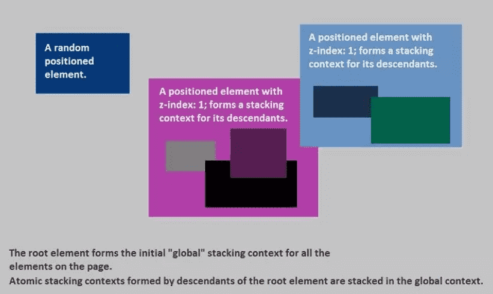

层叠上下文 1 (Stacking Context 1)是由文档根元素形成的， 层叠上下文 2 和 3 (Stacking Context 2, 3) 都是层叠上下文 1 (Stacking Context 1) 上的层叠层。他们各自也都形成了新的层叠上下文，其中包含着新的层叠上下文。

::: tip 在层叠上下文中，其子元素按照上面解释的规则进行层叠。形成层叠上下文的方法有：

- 根元素 `<html></html>`；
- `position` 值为 `absolute|relative`，且 `z-index` 值不为 `auto`；
- `position` 值为 `fixed|sticky`；
- `z-index` 值不为 `auto` 的 flex 元素，即父元素属性 `display:flex|inline-flex`；
- `opacity` 属性值小于 `1` 的元素；
- `transform` 属性值不为 `none` 的元素；
- `mix-blend-mode` 属性值不为 `normal` 的元素；
- `filter`、 `perspective`、 `clip-path`、 `mask`、 `mask-image`、 `mask-border`、 `motion-path`值不为 `none` 的元素；
- `perspective` 值不为 `none` 的元素；
- `isolation` 属性被设置为 `isolate` 的元素；
- `will-change` 中指定了任意 CSS 属性，即便你没有直接指定这些属性的值
- `-webkit-overflow-scrolling` 属性设置为 `touch` 的元素；

:::

::: tip 总结:

1. 层叠上下文可以包含在其他层叠上下文中，并且一起组建了一个有层级的层叠上下文；
2. 每个层叠上下文完全独立于它的兄弟元素，当处理层叠时只考虑子元素，类似于 BFC；
3. 每个层叠上下文是自包含的：当元素的内容发生层叠后，整个该元素将会**在父级叠上下文**中按顺序进行层叠；

:::

## 2. 层叠等级 (Stacking Level)

**层叠等级** (层叠水平, Stacking Level) 决定了在同一个层叠上下文中，元素在 `z` 轴上的显示的顺序；

1. 普通元素的层叠等级优先由其所在的层叠上下文决定；
2. 层叠等级的比较，只有在同一个层叠上下文元素中才有意义；
3. 在同一个层叠上下文中，层叠等级描述定义的是该层叠上下文中的元素在 `z` 轴上的上下顺序；

对于普通元素的层叠水平探讨只局限于在当前层叠上下文中：

> 层叠上下文本身是一个强力的「层叠结界」，普通的元素水平是无法突破这个结界和结界外的元素去较量层叠水平的。
>
> — CSS 世界

另外，层叠等级并不一定由 `z-index` 决定，只有定位元素的层叠等级才由 `z-index` 决定，其他类型元素的层叠等级由层叠顺序、他们在 HTML 中出现的顺序、他们的祖先元素的层叠等级一同决定，详细的规则见下面层叠顺序的介绍。

## 3. z-index

> 在 CSS 2.1 中, 所有的盒模型元素都处于三维坐标系中。除了我们常用的横坐标和纵坐标， 盒模型元素还可以沿着「z 轴」层叠摆放，当他们相互覆盖时，z 轴顺序就变得十分重要。
>
> -- CSS 2.1 Section 9.9.1 - Layered presentation

`z-index` 只适用于定位的元素，对非定位元素无效，它可以被设置为正整数、负整数、 `0`、 `auto`，如果一个定位元素没有设置 `z-index`，那么默认为 `auto`；

元素的 `z-index` 值只在同一个层叠上下文中有意义。如果父级层叠上下文的层叠等级低于另一个层叠上下文的，那么它 `z-index` 设的再高也没用。所以如果你遇到 `z-index` 值设了很大，但是不起作用的话，就去看看它的父级层叠上下文是否被其他层叠上下文盖住了。

## 4. 层叠顺序 (Stacking Order)

::: tip 层叠顺序 (层叠次序, 堆叠顺序, Stacking Order) 描述的是元素在同一个层叠上下文中的顺序规则（之前的层叠上下文和层叠等级是概念），从层叠的底部开始，共有七种层叠顺序：

1. **背景和边框**：形成层叠上下文的元素的背景和边框。
2. **负 z-index 值**：层叠上下文内有着负 `z-index` 值的定位子元素，负的越大层叠等级越低；
3. **块级盒**：文档流中的块级、非定位子元素；
4. **浮动盒**：非定位浮动元素；
5. **行内盒**：文档流中行内、非定位子元素；
6. **z-index: 0**： `z-index` 为 `0` 或 `auto` 的定位元素， 这些元素形成了新的层叠上下文；
7. **正 z-index 值**： `z-index` 为正的定位元素，正的越大层叠等级越高；

:::

第 7 级顺序的元素会显示在之前顺序元素的上方，也就是看起来覆盖了更低级的元素：


除层叠顺序优先级规则之外，还有一条**后来居上**规则：同一个层叠顺序的元素按照在 HTML 里出现的顺序依次层叠。这两个规则共同决定浏览器元素在文档中是如何层叠的。

## 5. 文档流 (Document Flow)

::: tip 5.1 常规流 (Normal flow)

- 在常规流中，盒一个接着一个排列;
- 在块级格式化上下文里面， 它们竖着排列；
- 在行内格式化上下文里面， 它们横着排列;
- 当 `position` 为 `static` 或 `relative`，并且 `float` 为 `none` 时会触发常规流；
- 对于静态定位(static positioning)， `position:static`，盒的位置是常规流布局里的位置；
- 对于相对定位(relative positioning)， `position:relative`，盒偏移位置由 `top`、 `bottom`、 `left`、 `right` 属性定义。即使有偏移，仍然保留原有的位置，其它常规流不能占用这个位置。

:::

::: tip 5.2 浮动 (Floats)

1. 左浮动元素尽量靠左、靠上，右浮动同理；
2. 这导致常规流环绕在它的周边，除非设置 `clear` 属性；
3. 浮动元素不会影响块级元素的布局；
4. 但浮动元素会影响行内元素的布局，让其围绕在自己周围，撑大父级元素，从而间接影响块级元素布局；
5. 最高点不会超过当前行的最高点、它前面的浮动元素的最高点；
6. 不超过它的包含块，除非元素本身已经比包含块更宽；
7. 行内元素出现在左浮动元素的右边和右浮动元素的左边，左浮动元素的左边和右浮动元素的右边是不会摆放浮动元素的；

:::

::: tip 5.3 绝对定位 (Absolute positioning)

1. 绝对定位方案，盒从常规流中被移除，不影响常规流的布局；
2. 它的定位相对于它的包含块，相关 CSS 属性： `top`、 `bottom`、 `left`、 `right`；
3. 如果元素的属性 `position` 为 `absolute` 或 `fixed`，它是绝对定位元素；
4. 对于 `position:absolute`，元素定位将相对于上级元素中最近的一个 `relative`、 `fixed`、 `absolute`，如果没有则相对于 body；

:::

## 6. BFC （Block Formatting Context）

### 6.1 什么是 BFC

**BFC** (Block Formatting Context) 块级格式化上下文，是用于布局块级盒子的一块渲染区域，相对应的还有 IFC（Inline Formatting Context）内联格式化上下文，不是本文重点，读者可以自行查阅相关知识。

> BFC 是 Web 页面 CSS 视觉渲染的一部分，用于决定块盒子的布局及浮动相互影响范围的一个区域。
>
> — MDN - 块格式化上下文

一个 BFC 的范围包含创建该上下文元素的所有子元素，但**不包括**创建了新 BFC 的子元素的内部元素。这从另一方角度说明，一个元素不能同时存在于两个 BFC 中。因为如果一个元素能够同时处于两个 BFC 中，那么就意味着这个元素能与两个 BFC 中的元素发生作用，就违反了 BFC 的隔离作用。

触发 BFC 的方式有：

1. 根元素，即 HTML 标签;
2. 浮动元素，即 `float` 值为 `left`、 `right`;
3. `overflow` 值不为 `visible`，即值为 `auto`、 `scroll`、 `hidden`；
4. `display` 值为 `inline-block`、 `table-cell`、 `table-caption`、 `table`、 `inline-table`、 `flex`、 `inline-flex`、 `grid`、 `inline-grid`；
5. 定位元素： `position` 值为 `absolute`、 `fixed`；
6. `contain` 为 `layout`、 `content`、 `paint` 的元素；

**注意：** `display:table` 也可以生成 BFC 的原因在于 Table 会默认生成一个匿名的 `table-cell`，是这个匿名的 `table-cell` 生成了 BFC。

### 6.2 用法

#### 1. 阻止相邻元素的 margin 合并

属于同一个 BFC 的两个相邻块级子元素的上下 `margin` 会发生重叠，(设置 `writing-mode:tb-rl`时，水平 `margin` 会发生重叠)。所以当两个相邻块级子元素分属于不同的 BFC 时可以阻止 `margin` 重叠。可以给任一个相邻块级盒子的外面包一个 div，通过改变此 div 的属性使两个原盒子分属于两个不同的 BFC，以此来阻止 `margin` 重叠。

代码和预览参见：Codepen - 使用BFC阻止margin合并：https://codepen.io/SHERlocked93/pen/eVOevN

#### 2. 阻止元素被浮动元素覆盖

一个正常文档流的块级元素可能被一个 `float` 元素覆盖，挤占正常文档流，因此可以设置一个元素的 `float`、 `display`、 `position` 值等方式触发 BFC，以阻止被浮动盒子覆盖。

代码和预览参见：Codepen - 使用BFC阻止元素被浮动元素覆盖：https://codepen.io/SHERlocked93/pen/pazdzB

#### 3. 包含浮动元素

通过改变包含浮动子元素的父盒子的属性值，触发 BFC，以此来包含子元素的浮动盒子。

代码和预览参见：Codepen - 使用BFC包含浮动元素：https://codepen.io/SHERlocked93/pen/OQLOqG

## 7. 实战

下面一起来看几个例子实战一下，帮助理解。

### 7.1 普通情况

三个 `relative` 定位的 `div` 块中各有 `absolute` 的不同颜色的 `span.red`、 `span.green`、 `span.blue`，它们都设置了 `position:absolute`；

代码和预览参见：Codepen - 普通情况：https://codepen.io/SHERlocked93/pen/aaPord

那么当没有元素包含 `z-index` 属性时，这个例子中的元素按照如下顺序层叠（从底到顶顺序）：

1. 根元素的背景和边界；
2. 块级非定位元素按 HTML 中的出现顺序层叠；
3. 行内非定位元素按 HTML 中的出现顺序层叠；
4. 定位元素按 HTML中的出现顺序层叠；

红绿蓝都属于 `z-index` 为 `auto` 的定位元素，因此按照 7 层层叠顺序规则来说同属于层叠顺序第 6 级，所以按 HTML 中的出现顺序层叠：`红->绿->蓝`


### 7.2 在相同层叠上下文的父元素内的情况 

红绿位于一个 `div.first-box` 下，蓝位于 `div.second-box` 下，红绿蓝都设置了 `position:absolute`， `first-box` 与 `second-box` 都设置了 `position:relative`；

代码和预览参见：Codepen - 父元素不同但都位于根元素下：https://codepen.io/SHERlocked93/pen/RYENBw

这个例子中，红蓝绿元素的父元素 `first-box` 与 `second-box` 都没有生成新的层叠上下文，都属于根层叠上下文中的元素，且都是层叠顺序第 6 级，所以按 HTML 中的出现顺序层叠：`红->绿->蓝`

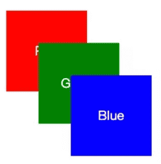

### 7.3 给子元素增加 z-index

红绿位于一个 `div.first-box` 下，蓝黄位于 `div.second-box` 下，红绿蓝都设置了 `position:absolute`，如果这时给绿加一个属性 `z-index:1`，那么此时 `.green` 位于最上面；

如果再在 `.second-box` 下 `.green` 后加一个绝对定位的 `span.gold`，设置 `z-index:-1`，那么它将位于红绿蓝的下面；

代码和预览参见：Codepen - 设置了z-index：https://codepen.io/SHERlocked93/pen/gdZOrK

这个例子中，红蓝绿黄元素的父元素中都没有生成新的层叠上下文，都属于根层叠上下文中的元素

1. 红蓝都没有设置 z-index，同属于层叠顺序中的第 6 级，按 HTML 中的出现顺序层叠；
2. 绿设置了正的 z-index，属于第 7 级；
3. 黄设置了负的 z-index，属于第 2 级；

所以这个例子中的从底到高显示的顺序就是：`黄->红->蓝->绿`


### 7.4 在不同层叠上下文的父元素内的情况

红绿位于一个 `div.first-box` 下，蓝位于 `div.second-box` 下，红绿蓝都设置了 `position:absolute`，如果 `first-box` 的 z-index 设置的比 `second-box` 的大，那么此时无论蓝的 z-index 设置的多大 `z-index:999`，蓝都位于红绿的下面；如果我们只更改红绿的 z-index 值，由于这两个元素都在父元素 `first-box` 产生的层叠上下文中，此时谁的 z-index 值大，谁在上面；

代码和预览参见：Codepen - 不同层叠上下文的父元素：https://codepen.io/SHERlocked93/pen/gdZbOJ

这个例子中，红绿蓝都属于设置了 z-index 的定位元素，不过他们的父元素创建了新的层叠上下文；

1. 红绿的父元素 `first-box` 是设置了正 z-index 的定位元素，因此创建了一个层叠上下文，属于层叠顺序中的第 7 级；
2. 蓝的父元素 `second-box` 也同样创建了一个层叠上下文，属于层叠顺序中的第6级；
3. 按照层叠顺序， `first-box` 中所有元素都排在 `second-box` 上；
4. 红绿都属于层叠上下文 `first-box` 中且设置了不同的正 z-index，都属于层叠顺序中第 7 级；
5. 蓝属于层叠上下文 `second-box`，且设置了一个很大的正 z-index，属于层叠元素中第 7 级；
6. 虽然蓝的 z-index 很大，但是因为 `second-box` 的层叠等级比 `first-box` 小，因此位于红绿之下；

所以这个例子中从低到到显示的顺序：`蓝->红->绿`

(我遇到的的情况就属于这个例子类似情形)


### 7.5 给子元素设置 opacity

红绿位于 `div.first-box` 下，蓝位于 `div.second-box` 下，红绿蓝都设置了 `position:absolute`，绿设置了 `z-index:1`，那么此时绿位于红蓝的最上面；

如果此时给 `first-box` 设置 `opacity:.99`，这时无论红绿的 z-index 设置的多大 `z-index:999`，蓝都位于红绿的上面；

如果再在 `.second-box` 下 `.green` 后加一个 `span.gold`，设置 `z-index:-1`，那么它将位于红绿蓝的下面；

代码和预览参见：Codepen - opacity的影响：https://codepen.io/SHERlocked93/pen/GXPRWB

之前已经介绍了，设置 `opacity` 也可以形成层叠上下文，因此：

1. `first-box` 设置了 `opacity`， `first-box` 成为了一个新的层叠上下文；
2. `second-box` 没有形成新的层叠上下文，因此其中的元素都属于根层叠上下文；
3. 黄属于层叠顺序中第 2 级，红绿属于第 7 级， `first-box` 属于第 6 级，蓝属于层叠顺序中第6级且按HTML出现顺序位于 `first-box` 之上；

所以这个例子中从低到到显示的顺序：`黄->红->绿->蓝`


以下内容：

作者：幻灵尔依

链接：https://juejin.im/post/5ce607a7e51d454f6f16eb3d

来源：掘金著作权归作者所有。

## 8.流

**“流”又叫文档流，是css的一种基本定位和布局机制**。流是html的一种抽象概念，暗喻这种排列布局方式好像水流一样自然自动。“流体布局”是html默认的布局机制，如你写的html不用css，默认自上而下（块级元素如`div`）从左到右（内联元素如`span`）堆砌的布局方式。

## 9.块级元素和内联元素

这个大家肯定都知道。

块级元素是指单独撑满一行的元素，如`div、ul、li、table、p、h1`等元素。这些元素的display值默认是`block、table、list-item`等。

内联元素又叫行内元素，指只占据它对应标签的边框所包含的空间的元素，这些元素如果父元素宽度足够则并排在一行显示的，如`span、a、em、i、img、td`等。这些元素的display值默认是`inline、inline-block、inline-table、table-cell`等。

实际开发中，我们经常把`display`计算值为`inline` `inline-block` `inline-table` `table-cell`的元素叫做内联元素，而把`display`计算值为`block`的元素叫做块级元素。

## 10.:star:width: auto 和 height: auto

`width`、`height`的默认值都是`auto`。

对于块级元素，流体布局之下`width: auto`自适应撑满父元素宽度。这里的撑满并不同于`width: 100%`的固定宽度，而是像水一样能够根据`margin`不同而自适应父元素的宽度。

对于内联元素，`width: auto`则呈现出包裹性，即由子元素的宽度决定。

无论内联元素还是块级元素，`height: auto`都是呈现包裹性，即高度由子级元素撑开。

注意父元素`height: auto`会导致子元素`height: 100%`百分比失效。

css的属性非常有意思，正常流下，如果块级元素的`width`是个固定值，`margin`是`auto`，则`margin`会撑满剩下的空间；如果`margin`是固定值，`width`是`auto`，则`width`会撑满剩下的空间。这就是流体布局的根本所在。

## 11.外在盒子和内在盒子

外在盒子是决定元素排列方式的盒子，即决定盒子具有块级特性还是内联特性的盒子。外在盒子负责结构布局。

内在盒子是决定元素内部一些属性是否生效的盒子。内在盒子负责内容显示。

如 `display: inline-table;` 外在盒子就是`inline`，内在盒子就是`table`。外在盒子决定了元素要像内联元素一样并排在一排显示，内在盒子则决定了元素可以设置宽高、垂直方向的margin等属性。如下图


右侧的table和左侧的文字在一行排列（外在盒子inline的表现特征），同时有拥有自定义宽度111px（内在盒子table可以设置宽高）。

## 12.:star:css权重和超越`!important`

曾经有道面试题把我难住了：

```css
// 假设下面样式都作用于同一个节点元素`span`，判断下面哪个样式会生效
body#god div.dad span.son {width: 200px;}
body#god span#test {width: 250px;}
```

可怜当时做了三年前端的我竟然还不知道css有权重😓

css选择器权重列表如下：

| 权重值  | 选择器                                                       |
| ------- | ------------------------------------------------------------ |
| 1,0,0,0 | 内联样式：style=""                                           |
| 0,1,0,0 | ID选择器：`#idName{...}`                                     |
| 0,0,1,0 | 类、伪类、属性选择器：`.className{...}` / `:hover{...}` / `[type="text"] ={...}` |
| 0,0,0,1 | 标签、伪元素选择器：`div{...}` / `:after{...}`               |
| 0,0,0,0 | 通用选择器（*）、子选择器（>）、相邻选择器（+）、同胞选择器（~） |

::: danger

注意这样的比较是错误的！！！：第一个样式权重计算是`(body+div+span=3) + (#god+.dad+.son=120) = 123`;第二个样式权重计算是`(body+span=2) + (#god+#test=200) = 202`，`202 > 123`所以最终计算结果是取`width: 250px;`。 

:::

中文社区坑人的文章真的是数不胜数啊，如果不是掘友`@collins是个爱哭的鼻涕虫`提出怀疑，我可能永远也不会知道这是错误的比较方式！感谢`@collins是个爱哭的鼻涕虫`！

如果按照上面错误的比较方式，则十一个class选择器的权重高于一个ID选择器。但经测试并非如此：[地址](https://link.juejin.im?target=http%3A%2F%2Fjs.jirengu.com%2Fgigab%2F1%2Fedit%3Fhtml%2Ccss%2Coutput)


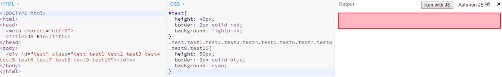

可以看到十一个class选择器的样式并没有覆盖一个id选择器的样式，因为：

> 当两个权值进行比较的时候，是从高到低逐级将等级位上的权重值（如 权值 1,0,0,0、0,1,0,0、0,0,1,0、0,0,0,1 对应--> 第一等级权重值，第二等级权重值，第三等级权重值，第四等级权重值）来进行比较的，而不是简单的 1000*个数 + 100*个数 + 10*个数 + 1*个数 的总和来进行比较的，换句话说，低等级的选择器，个数再多（只要不超过256个，因为css权重256进制，我打赌世界上没有一个样式会写256个class的）也不会越等级超过高等级的选择器的优先级的。

::: tip 正确规则：

1. 先从高等级进行比较，高等级相同时，再比较低等级的，以此类推；
2. 完全相同的话，就采用 后者优先 原则；

:::

因此上面那道的面试题比较应该是在第二等级id选择器的比较就结束了：(#god + #test = 0,2,0,0) > (#god = 0,1,0,0)；而上图种例子中两个权重分别是：(#test = 0,1,0,0) > (.test....test10 = 0,0,11,0)，也是在第二等级id选择器的比较时就结束了。所以以后比较权重，就先比较id选择器个数，如果id一样多，再比较class选择器个数。哇，感觉这是一道专坑中文社区的面试题啊。

在css中，`!important`的权重相当的高。如果出现了`!important`，则不管权重如何都取有`!important`的属性值。**但是宽高有例外情况，由于宽高会被`max-width`/`min-width`覆盖，所以`!important`会失效。**

```css
width: 100px!important;
min-width: 200px;
```

上面代码计算之后会被引擎解析成：

```css
width: 200px;
```

## 13.:star:盒模型（盒尺寸）

元素的内在盒子是由`margin box`、`border box`、`padding box`、`content box`组成的，这四个盒子由外到内构成了盒模型。

IE模型： `box-sizing: border-box`  此模式下，元素的宽度计算为`border+padding+content`的宽度总和。

w3c标准模型）： `box-sizing: content-box` 此模式下，元素的宽度计算为`content`的宽度。

由于`content-box`在计算宽度的时候不包含`border pading`很烦人，而且又是默认值，业内一般采用以下代码重置样式：

```css
:root {
  box-sizing: border-box;    
}
* {
  box-sizing: inherit;
}
```

## 14.内联盒模型

内联元素是指外在盒子是内联盒子的元素。从表现来说，内联元素的典型特征就是可以和文字在一行显示。文字也是内联元素。图片、按钮、输入框、下拉框等替换元素也是内联元素。内联盒模型是指内联元素包含的几个盒子，理解记忆下面的几个概念对css的深入学习极其重要。

1. 内容区域：本质上是字符盒子。在浏览器中，文字选中状态的背景色就是内容区域。
2. 内联盒子：内联盒子就是指元素的外在盒子是内联的，会和其他内联盒子排成一行。
3. 行框盒子：由内联元素组成的每一行都是一个行框盒子。如果一行里面没有内联元素如一个空的`div`标签，则不会形成行框盒子。行框盒子由一个个内联盒子组成，如果换行，那就是两个行框盒子。比如一个包含了很多字符的换行的的`p`标签，每一行都存在一个行框盒子。值得注意的是，如果给元素设置`display: inline-block`，则创建了一个独立的行框盒子。`line-height`是作用在行框盒子上的，并最终决定高度。
4. 包含盒子：就是包含块。多行文字组成一个包含块，一个包含块有若干个行框盒子。
5. 幽灵空白节点：内联元素的每个行框盒子前面有一个“空白节点”，这个“空白节点”不占据任何宽度，无法选中获取，但是又实实在在存在，表现就如同文本节点一样（本文中大量例子会用字母x模拟幽灵空白节点）。

## 15.替换元素

替换元素是指内容可以替换的元素，实际上就是`content box`可以被替换的元素。如存在`src=""`属性的` <audio> <video> <iframe>`元素和可以输入文本的`<input> <select> <textarea>`元素等。

所有替换元素都是内联元素，默认`display`属性是`inline`或`inline-block`（除了`input[type="hidden"]`默认`display: none;`）。

**替换元素有自己默认的样式**、尺寸（根据浏览器不同而不同），而且其`vertical-align`属性默认是`bottom`（非替换元素默认值是`baseline`）。

## 16.:star:盒模型四大金刚

### content

对于非替换元素如`div`,其`content`就是div内部的元素。 而对于替换元素，其`content`就是可替换部分的内容。

CSS中的`content`属性主要用于伪元素`:before/:after`中，除了做字体库或少写个div，对于一般开发来说并无卵用。

### padding

`padding`是四大金刚中最稳定的了，少见有什么异常。尽管如此还是有些需要注意的地方：

1. 大部分情况下我们会将元素重置为`box-sizing: border-box`，宽高的计算是包含了`padding`的，给人一种`padding`也是`content box`一部分的感觉，好像`line-height`属性也作用于`padding`上。但实际上，:smile:**元素真正的内容的宽高只是`content box`的宽高**，而`line-height`属性是不作用于`padding`的。

   

2. `padding`不可为负值，但是可以为百分比值。为百分比时水平和垂直方向的`padding`都是相对于父级元素宽度计算的。将一个`div`设为`padding: 100%`就能得到一个正方形，`padding: 10% 50%`可以得到一个宽高比 5:1 的矩形。

   ```css
   body {
     width: 400px;
   }
   .box {
     padding: 10% 50%;
   }
   ```

   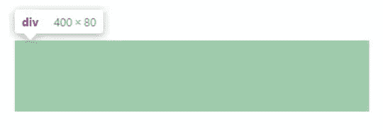

3. `padding`配合`background-clip`属性，可以制作一些特殊形状：

```css
/*三道杠*/
.icon1 {
  box-sizing: border-box;
  display: inline-block;
  width: 12px;
  height: 10px;
  padding: 2px 0;
  border-top: 2px solid currentColor;
  border-bottom: 2px solid currentColor;
  background: currentColor; /*注意如果此处背景颜色属性用缩写的话，需要放到其他背景属性的前面，否则会覆盖前面的属性值（此处为background-clip）为默认值*/
  background-clip: content-box;
}
/*双层圆点*/
.icon2 {
  display: inline-block;
  width: 12px;
  height: 12px;
  padding: 2px;
  border: 2px solid currentColor;
  border-radius: 50%;
  background-color: currentColor;
  background-clip: content-box;
}

```


预览如下：（:ox:**currentColor是css中为数不多的变量，指当前文字的颜色值，非常好用**）（孤陋寡闻）

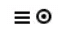

### margin

1. 作为外边距，`margin`属性并不会参与盒子宽度的计算，但通过设置`margin`为负值，却能改变元素水平方向的尺寸：

```css
<div>asdf</div>
<style>
  div {
    margin: 0 -100px;
  }
</style>
```

此时`div`元素的宽度是比父级元素的宽度大`200px`的。但是这种情况只会发生在元素是流布局的时候，即元素`width`是默认的`auto`并且可以撑满一行的时候。如果元素设定了宽度，或者元素设置了`float: left` / `position: absolute`这样的属性改变了流体布局，那么`margin`为负也无法改变元素的宽度了。

1. 块级元素的垂直方向会发生`margin`合并，存在以下三种场景：

::: tip 场景

- 相邻兄弟元素之间`margin`合并；
- 父元素`margin-top`和子元素`margin-top`，父元素`margin-bottom`和子元素`margin-bottom`；
- 空块级元素自身的`margin-top`和`margin-botom`合并，例子如下。

:::

要阻止`margin`合并，可以：1. 把元素放到`bfc`中；2. 设置`border`或`padding`阻隔`margin`；3.  用内联元素（如文字）阻隔；4. 给父元素设定高度。

2. `margin`的百分比值跟`padding`一样，垂直方向的`margin`和水平方向上的一样都是相对于父元素宽度计算的。

```css
<div class="box">
  <div></div>
</div>
<style>
  .box{
    overflow: hidden;
    background-color: lightblue;
  }
  .box > div{
    margin: 50%;
  }
</style>
```

此时 .box 是一个宽高比 2:1 的矩形，因为空块级元素自身的垂直方向的`margin`发生了合并。

这里父元素设置`overflow: hidden`是利用 `bfc` 的特性阻止子元素的`margin`和父元素合并，换成其他 `bfc` 特性或者设置 `1px` 的 `border` / `padding`都是可以达到效果的。

3. `margin: auto`能在块级元素设定宽高之后自动填充剩余宽高。`margin: auto`自动填充触发的前提条件是元素在对应的水平或垂直方向具有自动填充特性，显然默认情况下块级元素的高度是不具备这个条件的。典型应用是块级元素水平局中的实现：

```css
display: block;
width: 200px;
margin: 0 auto;
```

`auto`的特性是，如果两侧都是`auto`，则两侧均分剩余宽度；如果一侧`margin`是固定的，另一侧是`auto`，则这一侧`auto`为剩余宽度。栗子：


这个特性鲜为人知，且很实用。

**除了水平方向，垂直方向的`margin`也能实现垂直居中，但是需要元素在垂直方向具有自动填充特性，而这个特性可以利用`position`实现：**

```css
position: absolute;
left: 0; right: 0; top: 0; bottom: 0;
width: 200px;
height: 200px;
margin: auto;
```

### border

`border`主要作用是做边框。`border-style`属性的值有`none/solid/dashed/dotted/double`等，基本看名字就能猜出什么来了:

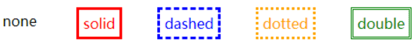

`border-width`属性的默认值是`3px`，是为了照顾小弟`border-style: double`，你懂的。值得注意的是，`border-color`默认是跟随字体的颜色，相当于默认设置了`border-color: currentColor`一样。

`border`另一广受欢迎的功能就是图形构建，特别是做应用广泛的三角形，其原理可看下图的1-3：

```css
div{
  float: left;
  margin: 20px;
}
div:nth-child(1){
  width: 20px;
  height: 20px;
  border: 20px solid;
  border-color: blue red orange green;
}
div:nth-child(2){
  width: 20px;
  height: 20px;
  border: 20px solid;
  border-color: blue transparent transparent transparent;
}
div:nth-child(3){
  border: 20px solid;
  border-color: blue transparent transparent transparent;
}
div:nth-child(4){
  border-style: solid;
  border-width: 40px 20px;
  border-color: blue transparent transparent transparent;
}
div:nth-child(5){
  border-style: solid;
  border-width: 40px 20px;
  border-color: blue red transparent transparent;
}
```


其实就是将其他三个边框的颜色设置透明，并把宽高设为 0 。图中4-5两个图形，是通过调整边框宽度和颜色调整三角形的形状，把最后一个图的红色改为蓝色，则是一个直角三角形了。

## 17.:star:好基友`line-height`和`vertical-align`

`line-height`和`vertical-align`是控制元素垂直对齐的两大属性，也是最难理解搞懂的属性。

### 字母 x 的角色

在内联元素的垂直方向对齐中，基线是最为重要的概念。`line-height`定义的就是两基线之间的距离，`vertical-align`的默认值就是基线。基线的定义则是字母 x 的下边缘。

css中有个概念叫`x-height`，指的是小写字母 x 的高度。`vertical-align: middle`对齐的就是基线往上1/2`x-height`高度的地方，可以理解为近似字母 x 的交叉点。

css中除了`px/em/rem`等，还有个单位是`ex`。指的就是小写字母x的高度，即`x-height`。用处不大，不再介绍。

### line-height

- `line-height`各类属性值

`normal`： 默认值`normal`其实是类型为数值的变量，根据浏览器和字体'font-family'不同而不同，一般约为 :yum:1.2 。

数值和百分比：最终会被计算为带单位的值，具体计算方法就是乘以字体大小`font-size`。

长度值：就是`100px`这样带单位的值。

这几类值的继承特性不同：`line-height`是数值的元素的子元素继承的就是这个数值，百分比/长度值继承的都是计算后得出的带单位的值（px）。

- `line-height`的作用：

`line-height`属性用于设置多行元素的空间量，如多行文本的间距。

**对块级元素来说，`line-height`决定了:yum:行框盒子的最小高度。**注意是行框盒子的最小高度，而不是块级元素的实际高度。（图中两个`div`行高一样，`div.one` 的背景色区域就是行框盒子的高度，而 `div.two` 的背景区域则是实际高度，其行框盒子高度和 `div.one` 是一样的。）


- 对于非替代的 inline 元素，它用于计算行框盒子的高度。此时内联元素的行框盒子的高度完全由`line-height`决定，不受其他任何属性的影响。

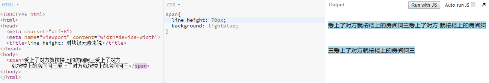

- `line-height`实现垂直居中的本质：行距

行距是指一行文本和相邻文本之间的距离。:smile:行距 = `line-height` — `font-size`。行距具有上下等分的机制：意思就是文字上下的行距是一样的，各占一半，这也是`line-height`能让内联元素垂直居中的原因。下图中字母x上下行距各占一半，共同撑起了`div`。

下图中和上图唯一不同之处就是多了个`display: inline-block`的`span`元素，但是此处的`span`元素并没有影响`div`元素的高度，而只是靠着`vertical-align: middle`属性将自身中心点对齐了字母x的交叉点实现垂直居中而已。`div`元素的高度仍然和上图一模一样，由字母x和行距共同撑起。此时如果删除字母x，`div`的高度不变，因为`span`元素的行框盒子前会产生幽灵空白节点，而幽灵空白节点+行高也能撑起`div`。


- 内联元素的大值特性

```css
<div class="box">
  <span>asdf</span>
</div>
```

样式1：此时 .box 高度是多少？

```css
.box {
  line-height: 100px;
  background: lightgreen;
}
.box span {
  line-height: 30px;
}
```

样式2：此时 .box 高度是多少？

```css
.box {
  line-height: 30px;
  background: lightgreen;
}
.box span {
  line-height: 100px;
}
```

:star:先说结论：无论内联元素的`line-height`如何设置，最终父元素的高度都是数值大的那个`line-height`决定的。

样式1中，`span`元素的行框盒子前存在一个幽灵空白节点，而这个幽灵空白节点的行高是100px；样式2中，幽灵空白节点的行高是30px，但是这时span元素的行高是100px。两种情况其实一样，取大值而已。

### vertical-align

- `vertical-align`的属性值

线类： 如`baseline（默认值）` `top` `middle` `bottom`（`baseline`使元素的基线与父元素的基线对齐，`middle`使元素的中部与父元素的基线往上`x-height`的一半对齐。`top` `bottom`使元素及其后代元素的底部与整行或整块的底部对齐。）

文本类： `text-top` `text-bottom`（使元素的顶部与父元素的字体顶部对齐。）

上标下标： `sub` `super`（使元素的基线与父元素的下标基线对齐。）

数值： `20px` `2em` （默认值`baseline`相当于数值的 0 。使元素的基线对齐到父元素的基线之上的给定长度，数值正值是基线往上偏移，负值是往下偏移，借此可以实现元素垂直方向精确对齐。）

百分比： `20%` （使元素的基线对齐到父元素的基线之上的给定百分比，该百分比是line-height属性的百分比。）

- `vertical-align` 的作用前提

**vertical-align属性起作用的前提必须是作用在内联元素上。** 即`display`计算值为`inline` `inline-block` `inline-table` `table-cell`的元素。所以如果元素设置了`float: left`或者`position: absolute`，则其`vertical-align`属性不能生效，因为此时元素的`display`计算值为`block`了。

- 好基友`line-height`、`vertical-align`和第三者幽灵空白节点的爱恨情仇

有时候会遇见下面这样高度和设置不一致的情况：


`div`的实际高度比设定的行高大了，为什么呢？

内联元素的默认对齐方式是`baseline`，所以此时此时`span`元素的基线是和父元素的基线相对齐的，而此时父元素的基线在哪呢？

父元素的基线其实就是行框盒子前的幽灵空白节点的基线。把幽灵空白节点具象化为字母`x`可能容易理解些：

由于`div`行高是`30px`，所以字母`x`和`span`元素的高度都是`30px`。但是字母x的`font-size`较小，`span`元素的`font-size`较大，而行高一样的情况下`font-size`越大基线的位置越偏下，所以两者的基线不在同一水平线上。如下图左边部分：

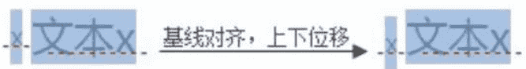

由于内联元素默认基线对齐，所以字母`x`和`span`元素发生了位移以使基线对齐，导致`div`高度变大。而此时字母`x`的半行距比`span`元素的半行距大，大出的部分就是`div`的高度增加的部分。

- `display: inline-block`基线的不同之处

先看例子，图中`span`元素设置了`display: inline-block`和宽高，从而撑起了父元素`div`的高度，但`span`本身并无`margin`属性，那为什么底部和`div`下边缘之间会有空隙呢？[地址](https://link.juejin.im?target=http%3A%2F%2Fjs.jirengu.com%2Fmesif%2F1%2Fedit%3Fhtml%2Ccss%2Coutput)


这就要说到`inline-block`的不同之处了。一个设置了`display: inline-block`的元素：

1. 如果元素内部没有内联元素，则该元素基线就是该元素下边缘；
2. 如果元素设置了`overflow`为`hidden auto scroll`，则其基线就是该元素下边缘；
3. 如果元素内部还有内联元素，则其基线就是内部最后一行内联元素的基线。

知道了这点，那么再回到上面的例子：

原来是第三者幽灵空白节点搞的鬼。此时`span`的行框盒子前，还存在一个幽灵空白节点。由于`span`元素默认基线对齐，所以`span`元素的基线也就是其下边缘是和幽灵空白节点的基线对齐的。从而导致幽灵空白节点基线下面的半行距撑高了`div`元素，造成空隙。如下图：


如果`span`元素中存在内联元素呢？


可以看到，此时`span`元素下边缘的空隙没了，因为此时`span`元素的基线是内部最后一行内联元素的基线。

值得一提的是，由于替换元素内部不可能再有别的元素，所以其基线位置永远位于下边缘。

- 解决问题

间隙产生本质上是由基线对齐引发的错位造成的，源头上是`vertical-align`和`line-height`共同造成的，所以要想解决这个问题，只要直接或间接改造两个属性中的一个就行了：

1. 给元素设置块状化`display: block`使`vertical-align`属性失效；
2. 尝试不同的`vertical-align`值如`bottom/middle/top`；
3. 直接修改`line-height`值；
4. 如果`line-height`为相对值如`1.4`，设置`font-size: 0`间接改变`line-height`。

- 弹框dialog

下面是张鑫旭大佬推荐的利用`vertical-align`实现的水平垂直居中弹框，能够理解的话就说明你已经完全掌握了好基友和第三者的关系了。

```css
<div class="container">
  <div class="dialog">自适应弹出层</div>
</div>
<style>
.container{
  position: fixed;
  top: 0; right: 0; bottom: 0; left: 0;
  background-color: rgba(0, 0, 0, .15);
  text-align: center;
  font-size: 0;
  white-space: nowrap;
  overflow: auto;
}
.container:after{
  content: '';
  display: inline-block;
  height: 100%;
  vertical-align: middle;
}
.dialog{
  display: inline-block;
  width: 400px;
  height: 400px;
  vertical-align: middle;
  text-align: left;
  font-size: 14px;
  white-space: normal;
  background: white;
}
</style>
```

## 18.:star:流的破坏

现在UI框架横行的年代，我们的css写的越来越少了。这对于很多老鸟来说是件好事，但是对于初入前端的小白却未必。因为写的少了，就少了很多练手和总结的机会，对于很多样式理解就不透彻。本章介绍的`float`、`position` 和`BFC`对于前端页面布局非常重要，希望诸位看官们静下心来仔细研读。

### `float`属性的特性

`float`属性应该是css世界最令人意外的属性了，倒不是因为他的表现，而是他的设计初衷竟然只是为了实现“文字环绕图片”的效果。只不过因为`float`属性的一些特性，才导致其被到处使用以致于产生了诸多不利于维护的页面。 

::: tip 下面看看`float`属性的特性：

1. 包裹性：即此时元素`width`会像`height`一样由子元素决定，而不是默认撑满父元素。
2. 块状化并格式化上下文：这个就是后面会讲的BFC特性。块状是指元素设置`float: left`之后，其`display`的计算值就成了`block`。格式化上下文是指会创建一个BFC，这个后面会讲。
3. 没有任何`margin`合并；
4. 脱离文档流：`float`设计的初衷就是为了“文字环绕”效果，为了让文字环绕图片，就需要具备两个条件。第一是元素高度坍塌，第二是行框盒子不可与浮动元素重叠。而元素高度坍塌就导致元素后面的非浮动块状元素会和其重叠，于是他就像脱离文档流了。

:::

前三个特性都是正能量满满，但是最后一个特性却给我们开发者带来了很多麻烦，需要用到`clear`来清除浮动。

### `clear`的作用和不足

大家都知道`clear: both`可以清除前面浮动元素的浮动，但实际上，他并不是真的清除了浮动。

`clear`的定义是：元素盒子的边不能与前面的浮动元素相邻。也就是虽然浮动元素高度坍塌，但是设置了`clear: both`的元素却将其高度视为仍然占据位置。

`clear`只能作用于块级元素，并且其并不能解决后面元素可能发生的文字环绕问题。

### BFC：块级格式化上下文

- 概念

BFC是一个独立的渲染区域，只有`Block-level box`参与， 它规定了内部的`Block-level Box`如何布局，并且与这个区域外部毫不相干。 BFC 就好像一个结界，结界里面的东西不能影响外面的布局，也就是说，**BFC的子元素再翻江倒海，都不会影响外面的元素。** 所以：

1. BFC本身不会发生`margin`重叠。
2. BFC可以彻底解决子元素浮动带来的的高度坍塌和文字环绕问题。

::: tip BFC的创建方法

1. 根元素；
2. 浮动元素 (`float`不为`none`的元素)；
3. 绝对定位元素 (元素的`position`为`absolute`或`fixed`)；
4. `inline-blocks`(元素的 `display: inline-block`)；
5. 表格单元格(元素的`display: table-cell`，`HTML`表格单元格默认属性)；
6. `overflow`的值不为`visible`的元素；
7. 弹性盒 `flex boxes` (元素的`display: flex`或`inline-flex`)；

:::

BFC包含创建该上下文元素的所有子元素，但不包括创建了新BFC的子元素的内部元素。

::: tip 特性

1. 内部的盒会在垂直方向一个接一个排列（可以看作BFC中有一个的常规流）；
2. Box垂直方向的距离由`margin`决定。属于同一个BFC的两个相邻Box的`margin`会发生重叠；
3. 每一个盒子的左外边距应该和包含块的左边缘相接触。即使存在浮动也是如此，除非子盒子形成了一个新的BFC。
4. BFC就是页面上的一个隔离的独立容器，容器里面的子元素不会影响到外面的元素，反之亦然；
5. 计算BFC的高度时，考虑BFC所包含的所有元素，连浮动元素也参与计算；
6. BFC的区域不会与`float box`重叠；

:::

乍一看还挺多的，但真正要注意并用心理解的只有 3 4 6 。

特性 1 中内部的盒是指块级盒。因为`<html>`根元素也是BFC，所以我们平常写的`div p`都是独自占一行。

特性 2 `<html>`是BFC，所以里面的元素垂直方向的`margin`会发生折叠。但是，直接子孙元素与该BFC上下边界`margin`不能折叠，保证了BFC内部的元素不会影响外部的元素。两个上下相邻的BFC之间折不折叠要看具体情况，如`display: inline-block` `float: left`不会折叠，而`overflow: hidden`则会折叠。

特性 3 完全解读：

> In a block formatting context, each box's left outer edge touches the left edge of the containing block (for right-to-left formatting, right edges touch). This is true even in the presence of floats (although a box's line boxes may shrink due to the floats), unless the box establishes a new block formatting context (in which case the box itself may become narrower due to the floats). 

网上很多翻译成“每个元素的`margin box`的左边， 与包含块`border box`的左边相接触”的，这样的翻译是不准确甚至错误的，曾给我造成莫大的困惑和迷茫（这翻译太坑爹了一度让我怀疑人生）。正确的翻译是“每一个盒子的左外边距应该和包含块的左边缘相接触”。

第一，包含块未必就是父级元素。对于`position: absolute`来说，包含块是指第一个`positoin`不为`static`的祖先元素。

第二，BFC中的盒子应该与其自身的包含块相接触，而非与BFC盒子本身相接触。

第三，BFC中的盒子是与其包含块的 `left edge` 相接触，而不是包含块的 `left-border` 相接触。`left edge` 正确的翻译为左边缘。左边缘可能是`content box`的左边缘（非绝对定位如`position: relative` `float: left`），也可能是`padding box`的左边缘（如绝对定位`position: absolute` `position: fixed`）。

理解了上面三点，其实特性 3 就是普通的流布局和定位布局默认贴着“左侧”思想的总结。


如图，`aside`元素的`margin box`的左边距和BFC元素的左边缘相接触。并且由于`float box`高度坍塌，`main`占据了`body`全部空间并且和包含块BFC盒子左边缘相接触（特性3“即使存在浮动也是如此”）。

特性 4 正是BFC存在的意义。它规定了BFC子元素无论`margin-top: -10000px` `float: left` 等都不会影响到BFC外部的元素的布局。所以BFC是最好的清除浮动的方式，连浮动的文字环绕问题都能解决。

特性 5 BFC计算高度时包含浮动元素的高度。可以利用BFC此特性解决浮动元素高度坍塌的问题。

特性 6 ：利用特性6实现自适应两栏布局。此时`main`宽度是自适应的。


### 绝对定位`position: absolute`

- 定义

和浮动元素一样，绝对定位也具有块状化、BFC、包裹性、脱离文档流、没有`margin`合并的特性。

但和浮动不同的是，绝对定位是完全的脱离文档流。大家还记得浮动产生的目的就是为了实现文字环绕效果，所以浮动元素虽然脱离了文档流，但是后面的文字还是会环绕在浮动元素周围。而绝对定位一但产生，就不会再对周围元素产生任何影响。

而且两者包含块不同，浮动元素包含块只能是父级元素，绝对定位的包含块则是距离最近的`position`不为`static`的祖先元素。

- 无依赖绝对定位

大多数用到绝对定位的时候，都是存在包含块和`left/top`等方向属性的。但其实`position: absolute`是非常独立的css属性，其样式和行为表现不依赖任何css属性就可以完成。


可以看出，无依赖的`position: absolute`元素定位的位置和其本身无定位属性时候的位置和`display`的值有关。如果元素在没有`position`的情况下是内联元素，则和内联元素在同一行显示；如果元素在没有`position`属性的情况下是块级元素，则换行显示。

无依赖绝对定位的实用性虽然还行，但是其功能却完全可以用`left/top`实现。所以了解即可，如果有兴趣可以自行尝试。

- 绝对定位和`overflow: hidden`

其实一句话就可以表示两者之间的关系：当`overflow: hidden`元素在绝对定位元素和其包含块之间的时候，绝对定位元素不会被剪裁。

以下两种绝对定位元素不会被剪裁:

```html
<div style="overflow: hidden;">
  
</div>
<div style="position: relative;">
  <div style="overflow: hidden;">
    
  </div>    
</div>
```

以下两种绝对定位元素会被剪裁：

```html
<div style="overflow: hidden; position: relative;">
  
</div>
<div style="overflow: hidden;">
  <div style="position: relative;">
    
  </div>    
</div>
```

- `position: absolute`的流体特性

当绝对定位元素的水平方向(`left/right`)或垂直方向(`top/bottom`)的两个定位属性同时存在的时候，绝对元素在该方向上便具有了流体特性。此时的`width/height`属性具有自动撑满的特性，和一个正常流的`div`元素的`width`属性别无二致。如图，设置了固定`margin`值的元素，宽高`auto`能够自动适应剩余空间：


同样的，设置了固定宽高的元素，如果`margin: auto`，则`margin`平分剩余空间导致垂直水平居中：


# 19.:star:层叠规则

层叠规则是指当网页中的元素发生层叠时侯的遵循的规则。

## 层叠上下文

层叠上下文好像是一个结界，层叠上下文内的元素如果跟层叠上下文外的元素发生层叠，则比较该层叠上下文和外部元素的层叠上下文的层叠水平高低。

**创建一个层叠上下文的方法就是给position值为relative/aboslute/fixed的元素设置z-index不为auto的值。**

层叠上下文内元素的层叠水平如下图：


1. 最底层的`border/background`是指当前层叠上下文元素的边框和背景色。`z-index`为负值的元素在其之上。

:yum:如下图所示`.dad`元素默认设置`z-index: auto`，没有创建层叠上下文，此时其就是一个普通的块级盒子，所以设置了`z-index: -1`的`.son`元素跑到了爸爸身后看不见了。

而由于`.mom`设置了`z-index: 0`，创建出了一个层叠上下文，所以`.son`元素就算设置了`z-index: -1`也跑不出老妈的视线。[地址](https://link.juejin.im?target=http%3A%2F%2Fjs.jirengu.com%2Flitay%2F1%2Fedit%3Fhtml%2Ccss%2Coutput)


2. 当块级元素和内联元素发生层叠，内联元素居于块级元素之上。如下图：[地址](https://link.juejin.im/?target=http%3A%2F%2Fjs.jirengu.com%2Fgafof%2F1%2Fedit%3Fhtml%2Ccss%2Coutput)


3. 普通定位元素层叠水平在普通元素之上。普通定位元素是指`z-index`为`auto`的定位元素。下图`span`就是普通定位元素：[地址](https://link.juejin.im/?target=http%3A%2F%2Fjs.jirengu.com%2Fxisoz%2F1%2Fedit%3Fhtml%2Ccss%2Coutput)

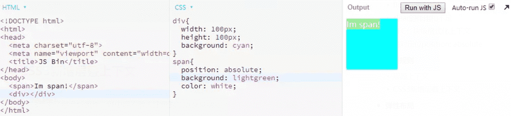

## CSS3新增层叠上下文

CSS3带来了很多新属性，其中很不惹人注意的一点就是增加了很多会自动创建层叠上下文的属性：

1. 元素的`opacity`值不为`1`，也就是透明元素；
2. 元素的`transform`值不为`none`；
3. 元素的`filter`值不为`none`；
4. 元素的设置`-webkit-overflow-scrolling: touch`；
5. `z-index`不为`auto`的弹性盒子的子元素；
6. 元素的`isolation`值为`isolate`；
7. 元素的`mix-blend-mode`值不为`normal`；
8. 元素的`will-change`值为`opacity/transform/filter/isolation/mix-blend-mode`中的一个。

这些属性大都不支持`z-index`，所以他们都默认`z-index: auto`，跟普通定位元素层叠水平一样，所以如果发生层叠会后来居上：[地址](https://link.juejin.im?target=http%3A%2F%2Fjs.jirengu.com%2Fqivik%2F1%2Fedit%3Fhtml%2Ccss%2Coutput)


但是弹性盒子`display: flex`不同，弹性盒子的子元素支持设置`z-index`，且设置了数值的`z-index`也会自动创建层叠上下文。如下图，可以看到设置了`z-index: 0`的元素层叠水平更高。[地址](https://link.juejin.im/?target=http%3A%2F%2Fjs.jirengu.com%2Fkavaw%2F1%2Fedit%3Fhtml%2Ccss%2Coutput)


# 20.:star:弹性布局

弹性布局是指`display: flex`或`display: inline-flex`的布局。注意，设为弹性布局以后，子元素的`float、clear、vertical-align`属性都会失效。参见阮一峰大佬的 [Flex 布局教程](https://link.juejin.im/?target=http%3A%2F%2Fwww.ruanyifeng.com%2Fblog%2F2015%2F07%2Fflex-grammar.html)。

主要属性应用如下：


# 21.:star:网格布局

网格布局（Grid）是最强大的 CSS 布局方案。注意，设为网格布局以后，容器子元素（项目）的`float、display: inline-block、display: table-cell、vertical-align和column-*等`设置都将失效。参见阮一峰大佬的[CSS Grid 网格布局教程](https://link.juejin.im?target=http%3A%2F%2Fwww.ruanyifeng.com%2Fblog%2F2019%2F03%2Fgrid-layout-tutorial.html)。


# 22.:star:文本控制

以下css属性为文本相关。

### `::first-letter` 应用实例

`::first-letter`选中首个字符：[地址](https://link.juejin.im/?target=http%3A%2F%2Fjs.jirengu.com%2Fyunas%2F1%2Fedit)

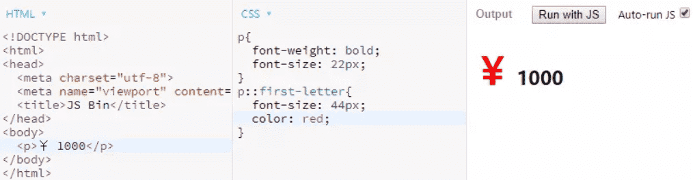

### :star:`text-transform` 应用

假设有个输入框只能输入大写字母，那么如下设置，输入小写字母出现的却是大写字母，可用于身份证输入框或验证码输入框等：

```css
  input {
    text-transform: uppercase;
  }
```

### :star:`white-space` 空白处理

我们都知道如果在`html`中输入多个空白符，默认会被当成一个空白符处理，实际上就是这个属性控制的：[地址](https://link.juejin.im?target=http%3A%2F%2Fjs.jirengu.com%2Fdanim%2F1%2Fedit%3Fhtml%2Ccss%2Coutput)

1. normal：合并空白符和换行符；
2. nowrap：合并空白符，但不许换行；
3. pre：不合并空白符，并且只在有换行符的地方换行；
4. pre-wrap：不合并空白符，允许换行符换行和文本自动换行；


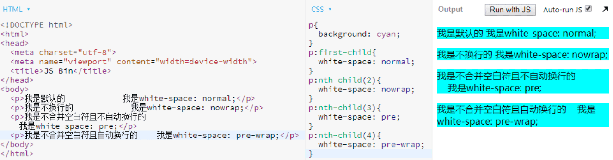

### `text-align: justify`（本文重点例子!）

`text-align: justify`为两端对齐。除了实现文字的两端对齐，还能用来做一些两端对齐的布局。（注意下面例子自己测试时需要保证每行三个方块！！！）下面介绍个两端对齐布局的实例：[地址](https://link.juejin.im/?target=http%3A%2F%2Fjs.jirengu.com%2Fjihay%2F1%2Fedit%3Fhtml%2Ccss%2Coutput)


由于`text-align: justify`最后一行是左对齐，所以利用了三个空的`i`标签模拟最后一行。虽然实现了两端对齐，但是最后一行却出现间隙。根据之前的经验应该是`vertical-align`和`line-height`搞的鬼，我们给`i`标签加上`outline`并用字母 x 模拟幽灵空白节点，现形：[地址](https://link.juejin.im?target=http%3A%2F%2Fjs.jirengu.com%2Fjihay%2F2%2Fedit%3Fhtml%2Ccss%2Coutput)


上图分析：首先第一个`i`标签基线与第二行的`span`标签中的数字的基线对其，所以其位置在中间。其次最后一行的`i`标签基线对齐幽灵空白节点字母x的基线，没有错位，所以此时最后一行的间隙高度就是字母x的高度。所以很容易想到把幽灵空白节点的行高设为 0 来解决问题：[地址](https://link.juejin.im?target=http%3A%2F%2Fjs.jirengu.com%2Fjihay%2F3%2Fedit%3Fhtml%2Ccss%2Coutput)


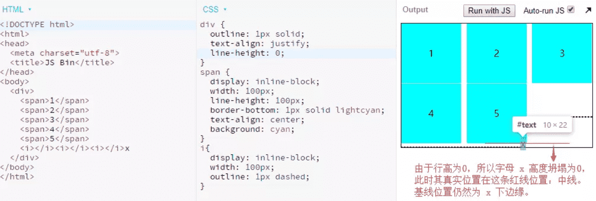

然而间隙虽然缩小了，但是还是存在。此时由于行高为 0 ，幽灵空白节点也就是字母x在页面中占用的真实位置其实是红线所示。也就是说虽然字母 x 还显示在页面上，但是其真实高度已经为0，此时其中线、上边缘线、下边缘线合一，都在红线位置，其真实位置自然也就在红线位置。然而其基线却不会改变，在字母 x 下边缘。

此时`i`标签的基线发生错位，位移到下面与幽灵空白节点基线对齐，导致产生了间隙。

所以只需要再改变`i`标签的对齐方式，就能彻底清除间隙：[地址](https://link.juejin.im?target=http%3A%2F%2Fjs.jirengu.com%2Fjihay%2F4%2Fedit%3Fhtml%2Ccss%2Coutput)


此时`i`标签的基线对齐其幽灵空白节点的下边缘线，没有了错位，也就没有了间隙。

如果改为`vertical-align: top`是一样的，因为合一了。但是`vertical-align: middle`却不行，因为此`middle`的位置是基线往上 1/2 个`e-height`的地方。

好吧本例结束了，没想到解释起来这么复杂。好好理解此例加深对`vertical-align`和`line-height`的理解。

# 23.:star:元素的显示与隐藏

元素的显示隐藏方法很多，不同方法的在不同的场景下页面效果不一，对页面的性能也有不同的影响。

### 元素隐藏方法总结：

1. 如果希望元素不可见、不占据空间、资源会加载、DOM 可访问： `display: none`；
2. 如果希望元素不可见、不能点击、但占据空间、资源会加载，可以使用： `visibility: hidden`；
3. 如果希望元素不可见、不占据空间、显隐时可以又`transition`淡入淡出效果：[地址](https://link.juejin.im?target=http%3A%2F%2Fjs.jirengu.com%2Fguyin%2F2%2Fedit%3Fhtml%2Ccss%2Cjs%2Coutput)

```
div{
  position: absolute;
  visibility: hidden;
  opacity: 0;
  transition: opacity .5s linear;
  background: cyan;
}
div.active{
  visibility: visible;
  opacity: 1;
}
复制代码
```

:yum:这里使用`visibility: hidden`而不是`display: none`，是因为`display: none`会影响css3的`transition`过渡效果。 但是`display: none`并不会影响css`animation`动画的效果。

4. 如果希望元素不可见、可以点击、占据空间，可以使用： `opacity: 0`；

5. 如果希望元素不可见、可以点击、不占据空间，可以使用： `opacity: 0; position: abolute;`；

6. 如果希望元素不可见、不能点击、占据空间，可以使用： `position: relative; z-index: -1;`；

7. 如果希望元素不可见、不能点击、不占据空间，可以使用： `position: absolute ; z-index: -1;`；

### :star:`display: none`与`visibility: hidden`的区别

1. `display: none`的元素不占据任何空间，`visibility: hidden`的元素空间保留；
2. `display: none`会影响css3的`transition`过渡效果，`visibility: hidden`不会；
3. `display: none`隐藏产生重绘 ( repaint ) 和回流 ( relfow )，`visibility: hidden`只会触发重绘；（回流重绘知识点参考：[真正理解重绘和回流](https://link.juejin.im?target=https%3A%2F%2Fsegmentfault.com%2Fa%2F1190000018181862)）
4. 株连性：`display: none`的节点和子孙节点元素全都不可见，`visibility: hidden`的节点的子孙节点元素可以设置 `visibility: visible`显示。`visibility: hidden`属性值具有继承性，所以子孙元素默认继承了`hidden`而隐藏，但是当子孙元素重置为`visibility: visible`就不会被隐藏。

