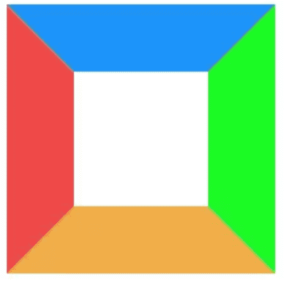
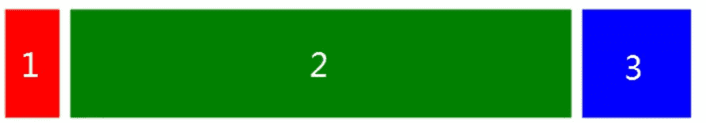
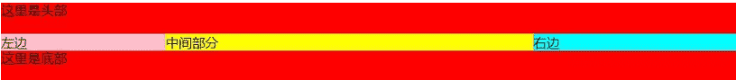
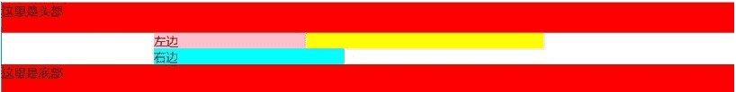
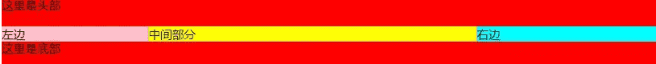

## **CSS3中新增的选择器以及属性**

这里只是列出来, 具体的使用,请查看我的关于css3新增选择器与属性文章

- 属性选择器

| 属性选择器    | 含义描述                             |
| :------------ | :----------------------------------- |
| E[att^="val"] | 属性att的值以"val"**开头**的元素     |
| E[att$="val"] | 属性att的值以"val"**结尾**的元素     |
| E[att*="val"] | 属性att的值**包含**"val"字符串的元素 |

- 结构伪类选择器

| 选择器                | 含义描述                                                     |
| :-------------------- | :----------------------------------------------------------- |
| E:root                | 匹配文档的**根元素**，对于HTML文档，就是HTML元素             |
| E:nth-child(n)        | 匹配其**父元素的第n个子元素**，第一个编号为1                 |
| E:nth-last-child(n)   | 匹配其父元素的**倒数第n个子元素**，第一个编号为1             |
| E:nth-of-type(n)      | 与:nth-child()作用类似，但是仅匹配使用同种标签的元素         |
| E:nth-last-of-type(n) | 与:nth-last-child() 作用类似，但是仅匹配使用同种标签的元素   |
| E:last-child          | 匹配父元素的最后一个子元素，等同于:nth-last-child(1)         |
| E:first-of-type       | 匹配父元素下使用同种标签的第一个子元素，等同于:nth-of-type(1) |
| E:last-of-type        | 匹配父元素下使用同种标签的最后一个子元素，等同于:nth-last-of-type(1) |
| E:only-child          | 匹配父元素下仅有的一个子元素，等同于:first-child:last-child或 :nth-child(1):nth-last-child(1) |
| E:only-of-type        | 匹配父元素下使用同种标签的唯一一个子元素，等同于:first-of-type:last-of-type或 :nth-of-type(1):nth-last-of-type(1) |
| E:empty               | 匹配一个不包含任何子元素的元素，注意，文本节点也被看作子元素 |

- css3新增属性

| 属性              | 含义描述                                             | 兼容                                 |
| :---------------- | :--------------------------------------------------- | :----------------------------------- |
| transition        | 设置过渡效果                                         |                                      |
| transform         | 变换效果(移动、缩放、转动、拉长或拉伸)               |                                      |
| animation         | 动画效果                                             |                                      |
| box-shadow        | 阴影效果                                             | FF3.5, Safari 4, Chrome 3            |
| text-shadow       | 文本阴影                                             | FF 3.5, Opera 10, Safari 4, Chrome 3 |
| border-colors     | 为边框设置多种颜色                                   | FF3+                                 |
| boder-image       | 图片边框                                             | FF 3.5, Safari 4, Chrome 3           |
| text-overflow     | 文本截断                                             | IE6+, Safari4, Chrome3, Opera10      |
| word-wrap         | 自动换行                                             | IE6+, FF 3.5, Safari 4, Chrome 3     |
| border-radius     | 圆角边框                                             | FF 3+, Safari 4 , Chrome 3           |
| opacity           | 不透明度                                             | all                                  |
| box-sizing        | 控制盒模型的组成模式                                 | FF3+, Opera 10, Safari 4, Chrome 3   |
| outline           | 外边框                                               | FF3+, safari 4, chrome 3, opera 10   |
| background-size   | 不指定背景图片的尺寸                                 | safari 4, chrome 3, opera 10         |
| background-origin | 指定背景图片从哪里开始显示                           | safari 4, chrome 3, FF 3+            |
| background-clip   | 指定背景图片从什么位置开始裁切                       | safari 4, chrome 3                   |
| rgba              | 基于r,g,b三个颜色通道来设置颜色值, 通过a来设置透明度 | safari 4, chrome 3, FF3, opera 10    |

## **居中布局**

- 水平居中

- 1. 行内元素: `text-align:center`
  2. 块级元素: `margin:0 auto`
  3. 绝对定位和移动: `absolute + transform`
  4. 绝对定位和负边距: `absolute + margin`
  5. flex布局: `flex + justify-content:center`

- 垂直居中

- 1. 子元素为单行文本: `line-height:height`
  2. `absolute + transform`
  3. `flex + align-items:center`
  4. table: `display:table-cell; vertical-align: middle`
  5. 利用position和top和负margin

## **用纯CSS创建一个三角形的原理是什么**

之前写三角形, 都是直接记住代码,没有探究原因,我也是直到有一次面试时,面试大哥让我说说css创建三角形的原理,我就......回来就赶紧翻资料.接下来我就将当时我理解的过程列举出来:

1. 写一个我们最熟悉的 border应用

```css
.box{	
    width:100px;	
    height:100px;	
    border: 3px solid;	
    border-color:#1b93fb #1bfb24 #efad48 #ef4848;
}
```

效果如下:


2. 接下来,我们将border值增大

```css
.box{	
    width:100px;	
    height:100px;	
    border: 50px solid;	
    border-color:#1b93fb #1bfb24 #efad48 #ef4848;}
```



很容易发现, border渲染并不是正方形, 而是梯形的.

3. 在增大border的基础下, 此时我们将盒子宽高变成0,会产生什么效果呢!

```css
.box{	
    width:0px;	
    height:0px;	
    border: 50px solid;	
    border-color:#1b93fb #1bfb24 #efad48 #ef4848;
}
```


四个三角形拼合成的矩形呈现在我们眼前,那如如果我们只想要一个三角形, 我们是不是可以设想将其他三个设为不可见;

4. 设置透明, 隐藏其中三个三角形

```css
 .box{	
     width:0px;	
     height:0px;	
     border: 50px solid;	
     border-color:transparent transparent transparent #ef4848;
}
```


三角形这样就出来, 有木有很简单, 当然我们也可以采用逆向思维来写这个效果, 就是先将所有边框设为透明, 然后需要哪边再对其设置颜色, 效果是一样的

```css
.box{	
    width:0px;	
    height:0px;	
    border: 50px solid transparent;	
    border-left:50px solid #ef4848;
}
```


## **实现三栏布局有哪些方法, 分别描述一下**

三栏布局，顾名思义就是两边固定，中间自适应。三栏布局在开发十分常见，那么什么是三栏布局？即左右模块固定宽度，中间模块随浏览器变化自适应，想要完成的最终效果如下图所示：



下面列出四种实现方式, 在开发中可以根据实际需求选择适合自己的方法进行编码:

- ### Flex 布局(设中间为flex:1)

```css
<style>
.container{  
    display:flex;  
    justify-content: center;  
    height: 200px;  background: #eee;
}
.left {   
    width: 200px;   
    background-color: red;   
    height: 100%; 
}
.main {    
    background-color: yellow;    
    flex: 1;
}
.right {    
    width: 200px;    
    background-color: green;
}
</style>
<div class="container">  
	<div class="left">1</div>  
	<div class="main">2</div>  
	<div class="right">3</div>
</div>
```

> 简单实用，现在比较流行的方案，但是需要考虑浏览器的兼容性。

- ### 绝对定位布局(左右两个设置为绝对定位，left(right):0)

```css
<style>
.container {  
    position: relative;  
    background:#eee;  
    height:200px;	
}
.main {  
    height: 200px;  
    margin: 0 120px;  
    background-color: yellow;	
}
.left {  
    position: absolute;  
    width: 100px;  
    height: 200px;  
    left: 0;  
    top: 0;  
    background-color: red;	
}
.right {  
    position: absolute;  
    width: 100px;  
    height: 200px;  
    background-color: green;  
    right: 0;  top: 0;
}
</style>
<div class="container">  
	<div class="left">1</div>  
	<div class="main">2</div>  
	<div class="right">3</div>
</div>
```

> 这种方案也简单实用, 并且可以将 `<div class="main"></div>`元素放到第一位,使得主要内容优先加载!

- ### 双飞翼布局(浮动)

```css
<style>
  .content {
    float: left;
    width: 100%;
  }

  .main {
    height: 200px;
    margin-left: 110px;
    margin-right: 220px;
    background-color: yellow;
  }

  .left {
    float: left;
    height: 200px;
    width: 100px;
    margin-left: -100%;
    background-color: red;
  }

  .right {
    width: 200px;
    height: 200px;
    float: right;
    margin-left: -200px;
    background-color: green;
  }
</style>
<div class="content">
  <div class="main"></div>
</div>
<div class="left"></div>
<div class="right"></div>
```

- ### 圣杯布局(三个全左浮动，然后左右两个加上负的margin)

```css
<style>
  .container {
    margin-left: 120px;
    margin-right: 220px;
  }

  .main {
    float: left;
    width: 100%;
    height: 300px;
    background-color: yellow;
  }

  .left {
    float: left;
    width: 100px;
    height: 300px;
    margin-left: -100%;/*在main前显示，左边距设置为main的宽度也就是负的100%*/
    position: relative;
    left: -120px;
    background-color: blue;
  }

  .right {
    float: left;
    width: 200px;
    height: 300px;
    margin-left: -200px;/*在mian后显示，左边距设置为负的自己的宽度*/
    position: relative;
    right: -220px;
    background-color: green;
  }
</style>
<div class="container">
  <div class="main"></div>
  <div class="left"></div>
  <div class="right"></div>
</div>
```

> 圣杯布局和双飞翼布局解决问题的方案在前一半是相同的，也就是三栏全部float浮动，但左右两栏加上负margin让其跟中间栏div并排，以形成三栏布局。

详细的圣杯布局与双飞翼布局请跳转<https://www.cnblogs.com/imwtr/p/4441741.html>查看

## 除了`screen`，你还能说出一个 @media 属性的例子吗？

- all
  适用于所有设备。
- print
  为了加载合适的文档到当前使用的可视窗口. 需要提前咨询 paged media（媒体屏幕尺寸）, 以满足个别设备网页尺寸不匹配等问题。
- screen
  主要适用于彩色的电脑屏幕
- speech
  解析speech这个合成器. 注意: CSS2已经有一个相似的媒体类型叫aural.
  [https://developer.mozilla.org/zh-CN/docs/Web/CSS/@media](https://link.zhihu.com/?target=https%3A//developer.mozilla.org/zh-CN/docs/Web/CSS/%40media)

## 使用 CSS 预处理的优缺点分别是什么？

**优点：**

- 提高 CSS 可维护性。
- 易于编写嵌套选择器。
- 引入变量，增添主题功能。可以在不同的项目中共享主题文件。
- 通过混合（Mixins）生成重复的 CSS。
- 将代码分割成多个文件。不进行预处理的 CSS，虽然也可以分割成多个文件，但需要建立多个 HTTP 请求加载这些文件。

**缺点：**

- 需要预处理工具。
- 重新编译的时间可能会很慢。

## 对于你使用过的 CSS 预处理，说说喜欢和不喜欢的地方？

**喜欢：**

- 绝大部分优点上题以及提过。
- Less 用 JavaScript 实现，与 NodeJS 高度结合。

**Dislikes:**

- 我通过`node-sass`使用 Sass，它用 C ++ 编写的 LibSass 绑定。在 Node 版本切换时，我必须经常重新编译。
- Less 中，变量名称以`@`作为前缀，容易与 CSS 关键字混淆，如`@media`、`@import`和`@font-face`。

## 解释浏览器如何确定哪些元素与 CSS 选择器匹配。

这部分与上面关于编写高效的 CSS 有关。:yum:浏览器从最右边的选择器（关键选择器）根据关键选择器，浏览器从 DOM 中筛选出元素，然后向上遍历被选元素的父元素，判断是否匹配。**选择器匹配语句链越短，浏览器的匹配速度越快。**

例如，对于形如`p span`的选择器，浏览器首先找到所有`<span>`元素，并遍历它的父元素直到根元素以找到`<p>`元素。对于特定的`<span>`，只要找到一个`<p>`，就知道'`已经匹配并停止继续匹配。

## 描述伪元素及其用途。

CSS 伪元素是添加到选择器的关键字，**去选择元素的特定部分**。它们可以用于装饰（`:first-line`，`:first-letter`）或将元素添加到标记中（与 content:...组合），而不必修改标记（`:before`，`:after`）。

- `:first-line`和`:first-letter`可以用来修饰文字。
- 上面提到的`.clearfix`方法中，使用`clear: both`来添加不占空间的元素。
- 使用`:before`和`after`展示提示中的三角箭头。鼓励关注点分离，因为三角被视为样式的一部分，而不是真正的 DOM。如果不使用额外的 HTML 元素，只用 CSS 样式绘制三角形是不太可能的。

## 说说你对盒模型的理解，以及如何告知浏览器使用不同的盒模型渲染布局。

CSS 盒模型描述了**以文档树中的元素而生成的矩形框**，**并根据排版模式进行布局**。每个盒子都有一个内容区域（例如文本，图像等）以及周围可选的`padding`、`border`和`margin`区域。

CSS 盒模型负责计算：

- 块级元素占用多少空间。
- 边框是否重叠，边距是否合并。
- 盒子的尺寸。

盒模型有以下规则：

- 块级元素的大小由`width`、`height`、`padding`、`border`和`margin`决定。
- 如果没有指定`height`，则块级元素的高度等于其包含子元素的内容高度加上`padding`（除非有浮动元素，请参阅下文）。
- 如果没有指定`width`，则非浮动块级元素的宽度等于其父元素的宽度减去父元素的`padding`。
- 元素的`height`是由内容的`height`来计算的。
- 元素的`width`是由内容的`width`来计算的。
- 默认情况下，`padding`和`border`不是元素`width`和`height`的组成部分。

### 参考

- [https://www.smashingmagazine.com/2010/06/the-principles-of-cross-browser-css-coding/#understand-the-css-box-model](https://link.zhihu.com/?target=https%3A//www.smashingmagazine.com/2010/06/the-principles-of-cross-browser-css-coding/%23understand-the-css-box-model)

### `* { box-sizing: border-box; }`会产生怎样的效果？

- 元素默认应用了`box-sizing: content-box`，元素的宽高只会决定内容（content）的大小。
- `box-sizing: border-box`改变计算元素`width`和`height`的方式，`border`和`padding`的大小也将计算在内。
- 元素的`height` = 内容（content）的高度 + 垂直方向的`padding` + 垂直方向`border`的宽度
- 元素的`width` = 内容（content）的宽度 + 水平方向的`padding` + 水平方向`border`的宽度

## `inline`和`inline-block`有什么区别？

我把`block`也加入其中，为了获得更好的比较。

|                                 | `block`                                                     | `inline-block`                             | `inline`                                                     |
| ------------------------------- | ----------------------------------------------------------- | ------------------------------------------ | ------------------------------------------------------------ |
| 大小                            | 填充其父容器的宽度。                                        | 取决于内容。                               | 取决于内容。                                                 |
| 定位                            | 从新的一行开始，并且不允许旁边有 HTML 元素（除非是`float`） | 与其他内容一起流动，并允许旁边有其他元素。 | 与其他内容一起流动，并允许旁边有其他元素。                   |
| 能否设置`width`和`height`       | 能                                                          | 能                                         | 不能。 设置会被忽略。                                        |
| 可以使用`vertical-align`对齐    | 不可以                                                      | 可以                                       | 可以                                                         |
| 边距（margin）和填充（padding） | 各个方向都存在                                              | 各个方向都存在                             | 只有水平方向存在。垂直方向会被忽略。 尽管`border`和`padding`在`content`周围，但垂直方向上的空间取决于'line-height' |
| 浮动（float）                   | -                                                           | -                                          | 就像一个`block`元素，可以设置垂直边距和填充。                |

## `relative`、`fixed`、`absolute`和`static`四种定位有什么区别？

经过定位的元素，其`position`属性值必然是`relative`、`absolute`、`fixed`或`sticky`。

- `static`：默认定位属性值。该关键字指定元素使用正常的布局行为，即元素在文档常规流中当前的布局位置。此时 top, right, bottom, left 和 z-index 属性无效。
- `relative`：该关键字下，元素先放置在未添加定位时的位置，再在不改变页面布局的前提下调整元素位置（因此会在此元素未添加定位时所在位置留下空白）。
- `absolute`：不为元素预留空间，通过指定元素相对于最近的非 static 定位祖先元素的偏移，来确定元素位置。绝对定位的元素可以设置外边距（margins），且不会与其他边距合并。
- `fixed`：不为元素预留空间，而是通过指定元素相对于屏幕视口（viewport）的位置来指定元素位置。元素的位置在屏幕滚动时不会改变。打印时，元素会出现在的每页的固定位置。fixed 属性会创建新的层叠上下文。当元素祖先的 transform 属性非 none 时，容器由视口改为该祖先。
- `sticky`：盒位置根据正常流计算(这称为正常流动中的位置)，然后相对于该元素在流中的 flow root（BFC）和 containing block（最近的块级祖先元素）定位。在所有情况下（即便被定位元素为 `table` 时），该元素定位均不对后续元素造成影响。当元素 B 被粘性定位时，后续元素的位置仍按照 B 未定位时的位置来确定。`position: sticky` 对 `table` 元素的效果与 `position: relative` 相同。

## 响应式设计与自适应设计有何不同？

**响应式设计和自适应设计都以提高不同设备间的用户体验为目标，根据视窗大小、分辨率、使用环境和控制方式等参数进行优化调整。**

响应式设计的适应性原则：网站应该凭借:yum:**一份代码**，在各种设备上都有良好的显示和使用效果。响应式网站通过使用媒体查询，自适应栅格和响应式图片，基于多种因素进行变化，创造出优良的用户体验。就像一个球通过膨胀和收缩，来适应不同大小的篮圈。

自适应设计更像是渐进式增强的现代解释。与响应式设计单一地去适配不同，自适应设计通过检测设备和其他特征，从早已定义好的一系列视窗大小和其他特性中，选出最恰当的功能和布局。**与使用一个球去穿过各种的篮筐不同，自适应设计允许使用多个球，然后根据不同的篮筐大小，去选择最合适的一个。**

## 什么情况下，用`translate()`而不用绝对定位？什么时候，情况相反。

`translate()`是`transform`的一个值。改变`transform`或`opacity`不会触发浏览器重新布局（reflow）或重绘（repaint），只会触发复合（compositions）。而改变绝对定位会触发重新布局，进而触发重绘和复合。`transform`使浏览器为元素创建一个 GPU 图层，但改变绝对定位会使用到 CPU。 因此`translate()`更高效，可以缩短平滑动画的绘制时间。

当使用`translate()`时，元素仍然占据其原始空间（有点像`position：relative`），这与改变绝对定位不同。

## display:none、visibile:hidden、opacity:0的区别

|                  | 是否隐藏 | 是否在文档中占用空间 | 是否会触发事件 |
| ---------------- | -------- | -------------------- | -------------- |
| display: none    | 是       | 否                   | 否             |
| visibile: hidden | 是       | 是                   | 否             |
| opacity: 0       | 是       | 是                   | 是             |

## 已知父级盒子的宽高，子级img宽高未知，想让img铺满父级盒子且图片不能变形

需要用到`css`的`object-fit`属性

```css
div {
    width: 200px;
    height: 200px;
}
img {
    object-fit: cover;
    width: 100%;
    height: 100%;
}
```

查看object-fit:[MDN](https://link.zhihu.com/?target=https%3A//developer.mozilla.org/zh-CN/docs/Web/CSS/object-fit)

使用background-size可以设置有图片背景的元素的缩放(background-image),


## 去除inline-block元素间间距的方法(据说在新版chrome已解决)


- 
- 移除空格
- 使用margin负值
- 使用font-size:0
- letter-spacing
- word-spacing

### 产生空白的原因

元素被当成行内元素排版的时候，元素之间的空白符（空格、回车换行等）都会被浏览器处理，根据CSS中white-space属性的处理方式（默认是normal，合并多余空白），原来`HTML代码中的回车换行被转成一个空白符`，在字体不为0的情况下，空白符占据一定宽度，所以inline-block的元素之间就出现了空隙。

更详细的介绍请看:[去除inline-block元素间间距的N种方法](https://link.zhihu.com/?target=https%3A//www.zhangxinxu.com/wordpress/2012/04/inline-block-space-remove-%E5%8E%BB%E9%99%A4%E9%97%B4%E8%B7%9D/)

以下面试题来自：
作者：神三元
链接：https://juejin.im/post/5da282015188257d2a1c9e1d
来源：掘金著作权归作者所有。

## 一、让一个元素水平垂直居中，到底有多少种方案？


### 水平居中

- 对于`行内元素`: text-align: center;
- 对于确定宽度的块级元素：

1. width和margin实现。margin: 0 auto;
2. 绝对定位和margin-left: -width/2, 前提是父元素position: relative

- 对于宽度未知的块级元素

1. table标签配合margin左右auto实现水平居中。使用table标签（或直接将块级元素设值为display:table），再通过给该标签添加左右margin为auto。
2. inline-block实现水平居中方法。display：inline-block和text-align:center实现水平居中。
3. 绝对定位+transform，translateX可以移动本身元素的50%。
4. flex布局使用justify-content:center

### 垂直居中

1. 利用`line-height`实现居中，这种方法适合纯文字类
2. 通过设置父容器`相对定位`，子级设置`绝对定位`，标签通过margin实现自适应居中
3. 弹性布局`flex`:父级设置display: flex; 子级设置margin为auto实现自适应居中
4. 父级设置相对定位，子级设置绝对定位，并且通过位移`transform`实现
5. `table`布局，父级通过转换成表格形式，然后子级设置`vertical-align`实现。（需要注意的是：vertical-align: middle使用的前提条件是内联元素以及display值为table-cell的元素）。

## 二、浮动布局的优点？有什么缺点？清除浮动有哪些方式？

> 浮动布局简介:当元素浮动以后可以向左或向右移动，直到它的外边缘碰到包含它的框或者另外一个浮动元素的边框为止。元素浮动以后会脱离正常的文档流，所以文档的普通流中的框就变现的好像浮动元素不存在一样。

### 优点

这样做的优点就是在图文混排的时候可以很好的使文字环绕在图片周围。另外当元素浮动了起来之后，它有着块级元素的一些性质例如可以设置宽高等，但它与inline-block还是有一些区别的，第一个就是关于横向排序的时候，float可以设置方向而inline-block方向是固定的；还有一个就是inline-block在使用时有时会有空白间隙的问题

### 缺点

最明显的缺点就是浮动元素一旦脱离了文档流，就无法撑起父元素，会造成父级元素高度塌陷。

### 清除浮动的方式

请跳转[BFC与清除浮动](/font/CSS/BFC与清除浮动.html)一文

## 四、布局题：div垂直居中，左右10px，高度始终为宽度一半

> 问题描述: 实现一个div垂直居中, 其距离屏幕左右两边各10px, 其高度始终是宽度的50%。同时div中有一个文字A，文字需要水平垂直居中。

### 思路一：利用height:0; padding-bottom: 50%;

```html
<!DOCTYPE html>
<html lang="en">
  <head>
    <meta charset="UTF-8">
    <meta name="viewport" content="width=device-width, initial-scale=1.0">
    <meta http-equiv="X-UA-Compatible" content="ie=edge">
    <title>Document</title>
    <style>
      *{
        margin: 0;
        padding: 0;
      }
      html, body {
        height: 100%;
        width: 100%;
      }
      .outer_wrapper {
        margin: 0 10px;
        height: 100%;
        /* flex布局让块垂直居中 */
        display: flex;
        align-items: center;
      }
      .inner_wrapper{
        background: red;
        position: relative;
        width: 100%;
        height: 0;
        padding-bottom: 50%;
      }
      .box{
        position: absolute;
        width: 100%;
        height: 100%;
        display: flex;
        justify-content: center;
        align-items: center;
        font-size: 20px;
      }
    </style>
  </head>
  <body>
    <div class="outer_wrapper">
      <div class="inner_wrapper">
        <div class="box">A</div>
      </div>
    </div>
  </body>
</html>
```

强调两点:

1. padding-bottom究竟是相对于谁的？

答案是相对于`父元素的width值`。

那么对于这个out_wrapper的用意就很好理解了。 CSS呈流式布局，div默认宽度填满，即100%大小，给out_wrapper设置margin: 0 10px;相当于让左右分别减少了10px。

1. 父元素相对定位，那绝对定位下的子元素宽高若设为百分比，是相对谁而言的？

相对于父元素的(content + padding)值, 注意不含border

> 延伸：如果子元素不是绝对定位，那宽高设为百分比是相对于父元素的宽高，标准盒模型下是content, IE盒模型是content+padding+border。

### 思路二: 利用calc和vw

```html
<!DOCTYPE html>
<html lang="en">
  <head>
    <meta charset="UTF-8">
    <meta name="viewport" content="width=device-width, initial-scale=1.0">
    <meta http-equiv="X-UA-Compatible" content="ie=edge">
    <title>Document</title>
    <style>
      * {
        padding: 0;
        margin: 0;
      }

      html,
      body {
        width: 100%;
        height: 100%;
      }

      .wrapper {
        position: relative;
        width: 100%;
        height: 100%;
      }

      .box {
        margin-left: 10px;
        /* vw是视口的宽度， 1vw代表1%的视口宽度 */
        width: calc(100vw - 20px);
        /* 宽度的一半 */
        height: calc(50vw - 10px);
        position: absolute;
        background: red;
        /* 下面两行让块垂直居中 */
        top: 50%;
        transform: translateY(-50%);
        display: flex;
        align-items: center;
        justify-content: center;
        font-size: 20px;
      }
    </style>
  </head>
  <body>
    <div class="wrapper">
      <div class="box">A</div>
    </div>
  </body>
</html>
```

## 六、CSS如何进行圣杯布局

圣杯布局如图:



而且要做到左右宽度固定，中间宽度自适应。

### 1.利用flex布局

```html
<!DOCTYPE html>
<html lang="en">
<head>
	<meta charset="UTF-8">
	<title>Document</title>
	<style>
    *{
      margin: 0;
      padding: 0;
    }
    .header,.footer{
        height:40px;
        width:100%;
        background:red;
    }
    .container{
        display: flex;
    }
    .middle{
        flex: 1;
        background:yellow;
    }
    .left{
        width:200px;
        background:pink;
    }
    .right{
        background: aqua;
        width:300px;
    }
	</style>
</head>
<body>
    <div class="header">这里是头部</div>
    <div class="container">
        <div class="left">左边</div>
        <div class="middle">中间部分</div>
        <div class="right">右边</div>
    </div>
    <div class="footer">这里是底部</div>
</body>
</html>
```

### 2.float布局(全部float:left)

```html
<!DOCTYPE html>
<html lang="en">

<head>
  <meta charset="UTF-8">
  <meta name="viewport" content="width=device-width, initial-scale=1.0">
  <meta http-equiv="X-UA-Compatible" content="ie=edge">
  <title>Document</title>
  <style>
    *{
      margin: 0;
      padding: 0;
    }
    .header,
    .footer {
      height: 40px;
      width: 100%;
      background: red;
    }

    .footer {
      clear: both;
    }

    .container {
      padding-left: 200px;
      padding-right: 250px;
    }

    .container div {
      position: relative;
      float: left;
    }

    .middle {
      width: 100%;
      background: yellow;
    }

    .left {
      width: 200px;
      background: pink;
      margin-left: -100%;
      left: -200px;
    }

    .right {
      width: 250px;
      background: aqua;
      margin-left: -250px;
      left: 250px; 
    }
  </style>
</head>

<body>
  <div class="header">这里是头部</div>
  <div class="container">
    <div class="middle">中间部分</div>
    <div class="left">左边</div>
    <div class="right">右边</div>
  </div>
  <div class="footer">这里是底部</div>
</body>

</html>
```

这种float布局是最难理解的，主要是浮动后的负margin操作，这里重点强调一下。

设置负margin和left值之前是这样子:


左边的盒子设置margin-left: -100%是将盒子拉上去，效果:

```css
.left{
  /* ... */
  margin-left: -100%;
}
```



然后向左移动200px来填充空下来的padding-left部分

```css
.left{
  /* ... */
  margin-left: -100%;
  left: -200px;
}
```

效果呈现:


右边的盒子设置margin-left: -250px后，盒子在该行所占空间为0，因此直接到上面的middle块中,效果:

```css
.right{
  /* ... */
  margin-left: -250px;
}
```


然后向右移动250px, 填充父容器的padding-right部分:

```css
.right{
  /* ... */
  margin-left: -250px;
  left: 250px;
}
```

现在就达到最后的效果了:



### 3.float布局(左边float: left, 右边float: right)

```html
<!DOCTYPE html>
<html lang="en">

<head>
  <meta charset="UTF-8">
  <meta name="viewport" content="width=device-width, initial-scale=1.0">
  <meta http-equiv="X-UA-Compatible" content="ie=edge">
  <title>Document</title>
  <style>
    *{
      margin: 0;
      padding: 0;
    }
    .header,
    .footer {
      height: 40px;
      width: 100%;
      background: red;
    }
    .container{
      overflow: hidden;
    }

    .middle {
      background: yellow;
    }

    .left {
      float: left;
      width: 200px;
      background: pink;
    }

    .right {
      float: right;
      width: 250px;
      background: aqua;
    }
  </style>
</head>

<body>
  <div class="header">这里是头部</div>
  <div class="container">
    <div class="left">左边</div>
    <div class="right">右边</div>
    <div class="middle">中间部分</div>
  </div>
  <div class="footer">这里是底部</div>
</body>

</html>
```

### 4. 绝对定位

```html
<!DOCTYPE html>
<html lang="en">

<head>
  <meta charset="UTF-8">
  <meta name="viewport" content="width=device-width, initial-scale=1.0">
  <meta http-equiv="X-UA-Compatible" content="ie=edge">
  <title>Document</title>
  <style>
    *{
      margin: 0;
      padding: 0;
    }
    .header,
    .footer {
      height: 40px;
      width: 100%;
      background: red;
    }
    .container{
      min-height: 1.2em;
      position: relative;
    }

    .container>div {
      position: absolute;
    }

    .middle {
      left: 200px;
      right: 250px;
      background: yellow;
    }

    .left {
      left: 0;
      width: 200px;
      background: pink;
    }

    .right {
      right: 0;
      width: 250px;
      background: aqua;
    }
  </style>
</head>

<body>
  <div class="header">这里是头部</div>
  <div class="container">
    <div class="left">左边</div>
    <div class="right">右边</div>
    <div class="middle">中间部分</div>
  </div>
  <div class="footer">这里是底部</div>
</body>

</html>
```

### 5.grid布局

```html
<!DOCTYPE html>
<html lang="en">

<head>
  <meta charset="UTF-8">
  <meta name="viewport" content="width=device-width, initial-scale=1.0">
  <meta http-equiv="X-UA-Compatible" content="ie=edge">
  <title>Document</title>
  <style>
    body{
        display: grid;
    }
    #header{
        background: red;
        grid-row:1;
        grid-column:1/5;
    }
        
    #left{
        grid-row:2;
        grid-column:1/2;
        background: orange;
    }
    #right{
        grid-row:2;
        grid-column:4/5;
        background: cadetblue;
    }
    #middle{
        grid-row:2;
        grid-column:2/4;
        background: rebeccapurple
    }
    #footer{
        background: gold;
        grid-row:3;
        grid-column:1/5;
    }
  </style>
</head>

<body>
    <div id="header">header</div>
    <div id="left">left</div>
    <div id="middle">middle</div>
    <div id="right">right</div>     
    <div id="footer">footer</footer></div>
       
</body>

</html>
   
```

看看grid布局，其实也挺简单的吧，里面的参数应该不言而喻了。

另外说一点，到2019年为止，grid现在绝大多数浏览器已经可以兼容了，可以着手使用了

 当然，还有table布局，年代比较久远了，而且对SEO不友好，知道就可以，这里就不浪费篇幅了。 

## 七、CSS如何实现双飞翼布局？


有了圣杯布局的铺垫，双飞翼布局也就问题不大啦。这里采用经典的float布局来完成。

```html
<!DOCTYPE html>
<html lang="en">

<head>
  <meta charset="UTF-8">
  <meta name="viewport" content="width=device-width, initial-scale=1.0">
  <meta http-equiv="X-UA-Compatible" content="ie=edge">
  <title>Document</title>
  <style>
    *{
      margin: 0;
      padding: 0;
    }
    .container {
        min-width: 600px;
    }
    .left {
        float: left;
        width: 200px;
        height: 400px;
        background: red;
        margin-left: -100%;
    }
    .center {
        float: left;
        width: 100%;
        height: 500px;
        background: yellow;
    }
    .center .inner {
        margin: 0 200px; 
    }
    .right {
        float: left;
        width: 200px;
        height: 400px;
        background: blue;
        margin-left: -200px;
    }
  </style>
</head>

<body>
  <article class="container">
    <div class="center">
        <div class="inner">双飞翼布局</div>
    </div>
    <div class="left"></div>
    <div class="right"></div>
</article>
</body>

</html>
```

