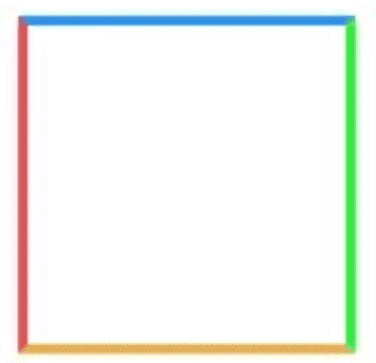

## **CSS3中新增的选择器以及属性**

这里只是列出来, 具体的使用,请查看我的关于css3新增选择器与属性文章

- 属性选择器

| 属性选择器    | 含义描述                             |
| :------------ | :----------------------------------- |
| E[att^="val"] | 属性att的值以"val"**开头**的元素     |
| E[att$="val"] | 属性att的值以"val"**结尾**的元素     |
| E[att*="val"] | 属性att的值**包含**"val"字符串的元素 |

- 结构伪类选择器

| 选择器                | 含义描述                                                     |
| :-------------------- | :----------------------------------------------------------- |
| E:root                | 匹配文档的**根元素**，对于HTML文档，就是HTML元素             |
| E:nth-child(n)        | 匹配其**父元素的第n个子元素**，第一个编号为1                 |
| E:nth-last-child(n)   | 匹配其父元素的**倒数第n个子元素**，第一个编号为1             |
| E:nth-of-type(n)      | 与:nth-child()作用类似，但是仅匹配使用同种标签的元素         |
| E:nth-last-of-type(n) | 与:nth-last-child() 作用类似，但是仅匹配使用同种标签的元素   |
| E:last-child          | 匹配父元素的最后一个子元素，等同于:nth-last-child(1)         |
| E:first-of-type       | 匹配父元素下使用同种标签的第一个子元素，等同于:nth-of-type(1) |
| E:last-of-type        | 匹配父元素下使用同种标签的最后一个子元素，等同于:nth-last-of-type(1) |
| E:only-child          | 匹配父元素下仅有的一个子元素，等同于:first-child:last-child或 :nth-child(1):nth-last-child(1) |
| E:only-of-type        | 匹配父元素下使用同种标签的唯一一个子元素，等同于:first-of-type:last-of-type或 :nth-of-type(1):nth-last-of-type(1) |
| E:empty               | 匹配一个不包含任何子元素的元素，注意，文本节点也被看作子元素 |

- css3新增属性

| 属性              | 含义描述                                             | 兼容                                 |
| :---------------- | :--------------------------------------------------- | :----------------------------------- |
| transition        | 设置过渡效果                                         |                                      |
| transform         | 变换效果(移动、缩放、转动、拉长或拉伸)               |                                      |
| animation         | 动画效果                                             |                                      |
| box-shadow        | 阴影效果                                             | FF3.5, Safari 4, Chrome 3            |
| text-shadow       | 文本阴影                                             | FF 3.5, Opera 10, Safari 4, Chrome 3 |
| border-colors     | 为边框设置多种颜色                                   | FF3+                                 |
| boder-image       | 图片边框                                             | FF 3.5, Safari 4, Chrome 3           |
| text-overflow     | 文本截断                                             | IE6+, Safari4, Chrome3, Opera10      |
| word-wrap         | 自动换行                                             | IE6+, FF 3.5, Safari 4, Chrome 3     |
| border-radius     | 圆角边框                                             | FF 3+, Safari 4 , Chrome 3           |
| opacity           | 不透明度                                             | all                                  |
| box-sizing        | 控制盒模型的组成模式                                 | FF3+, Opera 10, Safari 4, Chrome 3   |
| outline           | 外边框                                               | FF3+, safari 4, chrome 3, opera 10   |
| background-size   | 不指定背景图片的尺寸                                 | safari 4, chrome 3, opera 10         |
| background-origin | 指定背景图片从哪里开始显示                           | safari 4, chrome 3, FF 3+            |
| background-clip   | 指定背景图片从什么位置开始裁切                       | safari 4, chrome 3                   |
| rgba              | 基于r,g,b三个颜色通道来设置颜色值, 通过a来设置透明度 | safari 4, chrome 3, FF3, opera 10    |

## **居中布局**

- 水平居中

- 1. 行内元素: `text-align:center`
  2. 块级元素: `margin:0 auto`
  3. 绝对定位和移动: `absolute + transform`
  4. 绝对定位和负边距: `absolute + margin`
  5. flex布局: `flex + justify-content:center`

- 垂直居中

- 1. 子元素为单行文本: `line-height:height`
  2. `absolute + transform`
  3. `flex + align-items:center`
  4. table: `display:table-cell; vertical-align: middle`
  5. 利用position和top和负margin

## **用纯CSS创建一个三角形的原理是什么**

之前写三角形, 都是直接记住代码,没有探究原因,我也是直到有一次面试时,面试大哥让我说说css创建三角形的原理,我就......回来就赶紧翻资料.接下来我就将当时我理解的过程列举出来:

1. 写一个我们最熟悉的 border应用

```css
.box{	
    width:100px;	
    height:100px;	
    border: 3px solid;	
    border-color:#1b93fb #1bfb24 #efad48 #ef4848;
}
```

效果如下:



2. 接下来,我们将border值增大

```css
.box{	
    width:100px;	
    height:100px;	
    border: 50px solid;	
    border-color:#1b93fb #1bfb24 #efad48 #ef4848;}
```


很容易发现, border渲染并不是正方形, 而是梯形的.

3. 在增大border的基础下, 此时我们将盒子宽高变成0,会产生什么效果呢!

```css
.box{	
    width:0px;	
    height:0px;	
    border: 50px solid;	
    border-color:#1b93fb #1bfb24 #efad48 #ef4848;
}
```


四个三角形拼合成的矩形呈现在我们眼前,那如如果我们只想要一个三角形, 我们是不是可以设想将其他三个设为不可见;

4. 设置透明, 隐藏其中三个三角形

```css
 .box{	
     width:0px;	
     height:0px;	
     border: 50px solid;	
     border-color:transparent transparent transparent #ef4848;
}
```


三角形这样就出来, 有木有很简单, 当然我们也可以采用逆向思维来写这个效果, 就是先将所有边框设为透明, 然后需要哪边再对其设置颜色, 效果是一样的

```css
.box{	
    width:0px;	
    height:0px;	
    border: 50px solid transparent;	
    border-left:50px solid #ef4848;
}
```


## **实现三栏布局有哪些方法, 分别描述一下**

三栏布局，顾名思义就是两边固定，中间自适应。三栏布局在开发十分常见，那么什么是三栏布局？即左右模块固定宽度，中间模块随浏览器变化自适应，想要完成的最终效果如下图所示：


下面列出四种实现方式, 在开发中可以根据实际需求选择适合自己的方法进行编码:

- ### Flex 布局(设中间为flex:1)

```css
<style>
.container{  
    display:flex;  
    justify-content: center;  
    height: 200px;  background: #eee;
}
.left {   
    width: 200px;   
    background-color: red;   
    height: 100%; 
}
.main {    
    background-color: yellow;    
    flex: 1;
}
.right {    
    width: 200px;    
    background-color: green;
}
</style>
<div class="container">  
	<div class="left">1</div>  
	<div class="main">2</div>  
	<div class="right">3</div>
</div>
```

> 简单实用，现在比较流行的方案，但是需要考虑浏览器的兼容性。

- ### 绝对定位布局(左右两个设置为绝对定位，left(right):0)

```css
<style>
.container {  
    position: relative;  
    background:#eee;  
    height:200px;	
}
.main {  
    height: 200px;  
    margin: 0 120px;  
    background-color: yellow;	
}
.left {  
    position: absolute;  
    width: 100px;  
    height: 200px;  
    left: 0;  
    top: 0;  
    background-color: red;	
}
.right {  
    position: absolute;  
    width: 100px;  
    height: 200px;  
    background-color: green;  
    right: 0;  top: 0;
}
</style>
<div class="container">  
	<div class="left">1</div>  
	<div class="main">2</div>  
	<div class="right">3</div>
</div>
```

> 这种方案也简单实用, 并且可以将 `<div class="main"></div>`元素放到第一位,使得主要内容优先加载!

- ### 双飞翼布局(浮动)

```css
<style>
  .content {
    float: left;
    width: 100%;
  }

  .main {
    height: 200px;
    margin-left: 110px;
    margin-right: 220px;
    background-color: yellow;
  }

  .left {
    float: left;
    height: 200px;
    width: 100px;
    margin-left: -100%;
    background-color: red;
  }

  .right {
    width: 200px;
    height: 200px;
    float: right;
    margin-left: -200px;
    background-color: green;
  }
</style>
<div class="content">
  <div class="main"></div>
</div>
<div class="left"></div>
<div class="right"></div>
```

- ### 圣杯布局(三个全左浮动，然后左右两个加上负的margin)

```css
<style>
  .container {
    margin-left: 120px;
    margin-right: 220px;
  }

  .main {
    float: left;
    width: 100%;
    height: 300px;
    background-color: yellow;
  }

  .left {
    float: left;
    width: 100px;
    height: 300px;
    margin-left: -100%;
    position: relative;
    left: -120px;
    background-color: blue;
  }

  .right {
    float: left;
    width: 200px;
    height: 300px;
    margin-left: -200px;
    position: relative;
    right: -220px;
    background-color: green;
  }
</style>
<div class="container">
  <div class="main"></div>
  <div class="left"></div>
  <div class="right"></div>
</div>
```

> 圣杯布局和双飞翼布局解决问题的方案在前一半是相同的，也就是三栏全部float浮动，但左右两栏加上负margin让其跟中间栏div并排，以形成三栏布局。