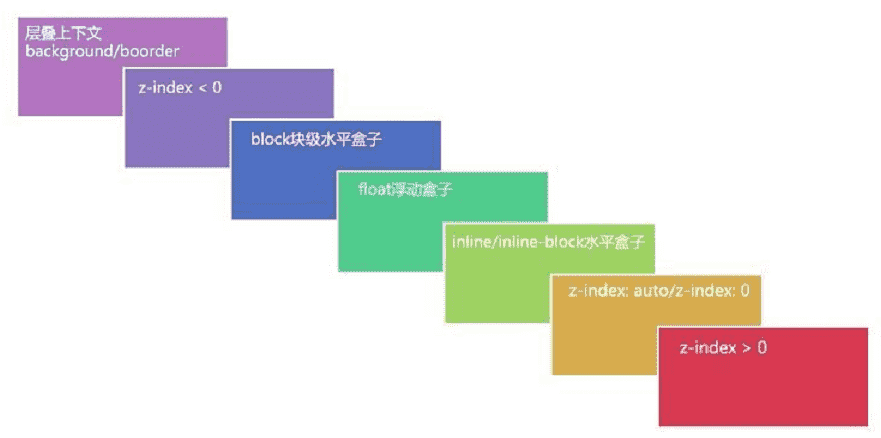

CSS当中的`z-index`属性看起来足够简单，但是如果你真的想了解它是如何工作的话，在这简单的表面之下，又有许多值得探究的内容。 在这篇教程中，通过探究**层叠上下文**和一系列实际的例子，我们将会阐明z-index的内在机理。

CSS为盒模型的布局提供了三种不同的[定位方案](http://www.w3.org/TR/CSS2/visuren.html#positioning-scheme)：

- 常规文档流
- 浮动
- 绝对定位

其中最后一种定位方案将一个元素从常规流中移除，完全依赖开发者来确定元素显示的位置。

通过赋予top, left, bottom 和 right 属性值，可以在二维平面上放置元素，此外CSS也允许使用[z-index属性](http://www.w3.org/TR/CSS2/visuren.html#layers)以在第三维上放置元素。

表面上，z-index看起来像是一个简单的属性。 你可以设置各种值来决定某一个元素会被置于第三维的何处，然后就完成了。 实际上，这其中还有许多许多可以研究的内容，包括确定哪一类元素会被放置到其他元素上的一些规则。

不如让我们从基础开始，以确保我们对此能有共同的理解。随后，我们会谈一些关于层叠的内容，以更好地理解在[z-index](http://www.vanseodesign.com/css/css-stack-z-index/)的背后到底发生了什么。

## z-index 基础

我相信你一定对三维坐标空间很熟悉。 我们有x轴通常用来表示水平位置，y轴来表示垂直位置，还有z轴来表示在纸面内外方向上的位置，或者说在本文的语境下，屏幕内外方向上的位置。


由于屏幕是一个二维平面，因此我们并不是真正地看到了z轴。 我们说看到z轴，其实是通过透视，通过元素展现在与其共享二维空间的其他元素的前面或者后面来看到的。

要确定沿着这z轴元素是如何分布的，CSS允许我们对z-index属性设置[三种值](http://www.w3.org/TR/CSS21/visuren.html#propdef-z-index)。

- auto (自动，**默认值**)
- (整数)
- inherit (继承)

目前，先让我们关注在整数值上。 整数值可以是正值，负值，或0。数值越大，元素也就越靠近观察者。 数值越小，元素看起来也就越远。

如果有两个元素放在了一起，占据了二维平面上一块共同的区域，那么有着较大z-index值的元素就会掩盖或者阻隔有着较低z-index值的元素在共同区域的那一部分。

我想上面的逻辑非常易于理解，而且很有可能和你的预期是一致的。 尽管如此，现在还是有一些问题悬而未决、等待解答。

- 当一个设置了z-index值的定位元素与常规文档流中的元素相互重叠的时候，谁会被置于上方？
- 当定位元素与浮动元素相互重叠的时候，谁会被置于上方？
- 当定位元素被嵌套在其他定位元素中时会发生什么？

要回答这些问题，我们需要进一步地理解z-index是如何工作的，尤其是层叠上下文，层叠层，以及层叠次序这些概念。

## 层叠上下文和层叠层

层叠上下文和层叠层会有一些难以概念化，所以暂时让我们想象一张桌子，上面有一堆物品。 这张桌子就代表着一个层叠上下文。 如果在第一张桌子旁还有第二张桌子，那第二张桌子就代表着另一个层叠上下文。


现在想象在第一张桌子上有四个小方块，他们都直接放在桌子上。 在这四个小方块之上有一片玻璃，而在玻璃片上有一盘水果。 这些方块、玻璃片、水果盘，各自都代表着层叠上下文中一个不同的层叠层，而这个层叠上下文就是桌子。

每一个网页都有一个默认的[层叠上下文](https://developer.mozilla.org/en-US/docs/Web/Guide/CSS/Understanding_z_index/The_stacking_context)。 这个层叠上下文（桌子）的根源就是`html`元素。 html标签中的一切都被置于这个默认的层叠上下文的一个层叠层上（物品放在桌子上）。

**当你给一个元素赋予了除 auto (自动) 外的z-index值时，你就创建了一个新的[层叠上下文](http://www.w3.org/TR/CSS21/zindex.html)，其中有着独立于页面上其他层叠上下文和层叠层的层叠层。 这就相当于你把另一张桌子带到了房间里。**

## 层叠次序

最容易理解层叠次序的方法就是用一个简单的例子来说明，这个例子会简单到我们甚至暂时不考虑[定位元素](http://www.vanseodesign.com/css/css-positioning/)。

想象一张非常简单的网页。 除了默认的`<html>`, `<head>`, `<body>`之类的元素，你会发现在每个页面上都有那么一个`<div>`元素。 在你的CSS文件中，你给html元素设置了蓝色的背景颜色。 对于div元素，你设置了宽高和红色的背景颜色。

那么在你加载页面的时候，你会期望看到什么呢？

希望这不会花你很多时间来想象出一幅几乎全是蓝色的屏幕，除了上面有一块红色的方块，这个方块有着你设置的宽和高。 这个红色方块应该会出现在页面的左上角，除非你比较有想象力，给这个方块设置了额外的css来把它显示在其他地方。

你也许会想“那又怎样呢？这不是很明显嘛”，但是不那么明显的是为什么你会在蓝色的背景上看到有一个红色的方块。 为什么你会看到div元素在html元素上方？ 原因就是他们都遵循着层叠次序的规则。

比如在这个简单的例子中，规则规定常规流（例子中的div）中的子块会被置于根元素（例子中的html元素）的背景和边框之上。 你会看到div元素在最上面是因为它在更高的层叠层上。

尽管上面给出的例子只包含了一个两级的层叠，事实上在一个层叠上下文中一共可以有7种层叠等级，列举如下：

1. **背景和边框** —— 形成层叠上下文的元素的背景和边框。 层叠上下文中的最低等级。
2. **负z-index值** —— 层叠上下文内有着负z-index值的子元素。
3. **块级盒** —— 文档流中非行内非定位子元素。
4. **浮动盒** —— 非定位浮动元素。
5. **行内盒** —— 文档流中行内级别非定位子元素。
6. **z-index: 0** —— 定位元素。 这些元素形成了新的层叠上下文。
7. **正z-index值** —— 定位元素。 层叠上下文中的最高等级。



这七个层叠等级构成了层叠次序的规则。 在层叠等级七上的元素会比在等级一至六上的元素显示地更上方（更靠近观察者）。 在层叠等级五上的元素会显示在等级二上的元素之上。 在...上的元素会... 好吧，我想你已经明白了。

我在第一次碰上上面的层叠次序规则时想到一些事情。 如果你只看层叠等级2, 6, 7（那些提到了z-index的等级），很有可能你会发现这和你对于z-index的理解相符。 正z-index值比0 z-index值更高一层，0 z-index值又比负z-index值高一层。 尽管这也很有可能是我们大部分人停止思考关于这些层叠层的地方。

**在见到这些规则之前我还以为一切其他东西都和0值z-index是一样的呢。很显然事实并非如此。 事实上，大多数的一切都比z-index为0的层叠等级低。**

另外同样有趣的是非定位元素分散在四个不同的层叠等级上。 不过当你思考起来就会发现这有道理。 如果所有的非定位元素都在同一层叠等级上，那么我们就不会看到文字（行内盒）在div上了（块级盒）。

## 综合总结

文章里我多次提到创建形成新的层叠上下文。 当你将除了`auto`以外的z-index值赋给一个元素，你就创建了一个新的层叠上下文，它独立于其他的层叠上下文。

让我们再次把桌子当作层叠上下文来考虑。 之前，我们有一张桌子，桌子上有四个方块、一片玻璃和一盘水果。 想象在这第二张桌子上也有四个同样大小的方块，方块上有一片玻璃，不过没有水果盘。

你一定会想第一张桌子上的水果盘是房间里最高的东西了。 因为它在最高的层叠层上（有着最大的z-index值）。 但要是我们把第一张桌子和这张桌子上的一切东西放到地下室去呢？ 那么水果盘现在就会比所有在第二张桌子上的东西低了，因为第一张桌子本身已经被移到比第二张桌子低的层叠层去了。

对于网页上的定位元素来说也是同样。 考虑如下网页和样式。 `div.two`会显示在`div.four`上面还是下面呢？

HTML:

```html
<div class="one">  
    <div class="two"></div>  
    <div class="three"></div>
</div>
<div class="four"></div>
```

CSS:

```css
div {
  width: 200px;
  height: 200px;
  padding: 20px;
}

.one, .two, .three, .four {
  position: absolute;
}
 
.one {
  background: #f00;
  outline: 5px solid #000;
  top: 100px;
  left: 200px;
  z-index: 10;
}
 
.two {
  background: #0f0;
  outline: 5px solid #000;
  top: 50px;
  left: 75px;
  z-index: 100;
}

.three {
  background: #0ff;
  outline: 5px solid #000;
  top: 125px;
  left: 25px;
  z-index: 150;
}

.four {
  background: #00f;
  outline: 5px solid #ff0;
  top: 200px;
  left: 350px;
  z-index: 50;
}
```

尽管div.two有着更大的z-index (100)，它实际上比同一页面上的div.four (z-index为50) 位置更低。 你可以在下面的图中看到上面代码的结果。 黑色和黄色的边框表示着每个元素所处的不同的层叠上下文。


由于div.two被包含在div.one中，它的z-index值也是相对于`div.one`的层叠上下文来说的。 事实上，我们真正得到的是如下结果：

- .one — z-index = 10
- .two — z-index = 10.100
- .three — z-index = 10.150
- .four — z-index = 50

我们所做的其实是把`div.one`和它所包含的一切放在了`div.four`之下。 不管我们给`div.one`中的元素设置了什么z-index值，他们永远都会显示在`div.four`的下面。

如果你像我一样，这可能在你处理z-index的时候已经坑了你一两次。 希望这些例子能帮助你厘清为什么有时一个有着较大z-index值的元素却显示在只有较小z-index值的元素的后面。

## 结论

当你初次遇到z-index时，它就像一个非常简单、易于理解的属性。 它的值代表着在朝向屏幕内外的轴上的位置，没有别的。

而[深入探究z-index](https://link.juejin.im/?target=http%3A%2F%2Fcoding.smashingmagazine.com%2F2009%2F09%2F15%2Fthe-z-index-css-property-a-comprehensive-look%2F)揭示出在z-index的背后，还发生了许多事情。 包括层叠上下文、层叠层和确定哪个元素在上哪个元素在下的层叠次序规则。

定位元素还会产生新的层叠上下文，而这整一个层叠层会显示在另一个层叠上下文中的所有层叠层的上面或者下面。

来自：<https://juejin.im/entry/5754dd636be3ff006bf589b9#comment>

另外一篇：<https://juejin.im/post/5b876f86518825431079ddd6#heading-8>