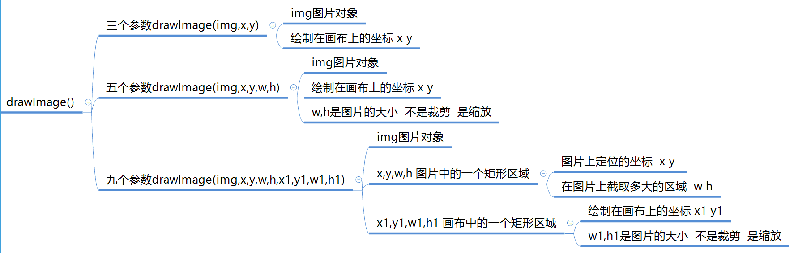
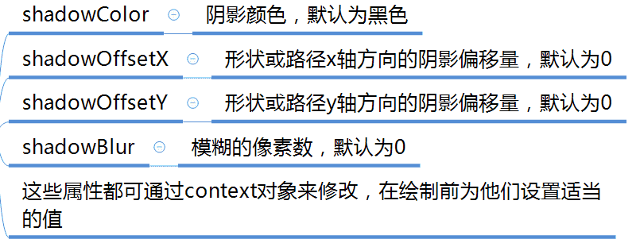

**canvas画布是白色的，默认为300*150**。

**获取画布**

​	1.通过DOM方式

​	2.通过绘制工具。ctx.canvas.width / ctx.canvas.height

## 基本步骤
```js
var myCanvas = document.querySelector('canvas');
var ctx = myCanvas.getContext('2d');//获取上下文，绘制工具箱
ctx.moveTo(100,100);//移动画笔
ctx.lineTo(200,100);//绘制直线(路径)
ctx.stroke();//描边
```

## 路径的绘制

- 描边 **stroke()**
- 填充 **fill()**  

**填充规则(非零环绕)**：非零就填充，零就不填充。拉一条线出来，顺时针+1，逆时针-1，顺逆时针说的是绘制路径的方向

## 路径

### 闭合路径

 - 手动闭合
 - 程序闭合 closePath()

### 开启新的路径

- beginPath()

## 画笔的状态

- **lineWidth**：线宽，默认1px
- **lineCap**：线末端类型：(butt默认)、round、square 
- **lineJoin**：相交线的拐点 miter(默认)、round、bevel
- **strokeStyle**：线的颜色
- **fillStyle**：填充颜色
- **setLineDash()**：设置虚线
- **getLineDash()**：获取虚线宽度集合，获取的是不重复的那一段的排列方式
- **lineDashOffset**：设置虚线偏移量（负值向右偏移）

## 绘制矩形

- **rect(x,y,w,h)**：没有独立路径
- **strokeRect(x,y,w,h)**：有独立路径，不影响别的绘制
- **fillRect(x,y,w,h)**：有独立路径，不影响别的绘制
- **clearRect(x,y,w,h)**：擦除矩形区域
  	

## 渐变

- **createLinearGradient(x0,y0,x1,y1)**：创建线性的渐变对象
  	- x0y0 起始点 x1y1 结束点  确定长度和方向
  	- **.addColorStop**：规定 gradient 对象中的颜色和位置

- **createRadialGradient(x1,y1,r1,x2,y2,r2)**：创建放射渐变对象
  	- 前三个参数指定起点圆的原心和半径，后三个指定终点圆

## 圆弧绘制

- **arc(x,y,r,startAngle,endAngle,anticlockwise)**
  	- x 圆心横坐标
  	- y 圆心纵坐标
  	- r 半径
  	- startAngle 开始角度：Math.PI计算
  	- endAngle 结束角度：Math.PI计算
  	- anticlockwise 是否逆时针方向绘制（默认false表示顺时针；true表示逆时针）

## 绘制文本

- **ctx.font** = '40px 微软雅黑'：设置字体
- **ctx.textAlign** = 'center'：左右对齐方式
  - center left right start end
  - 基准起始坐标
  - 建议不用left和right
  
- **ctx.textBaseline** = 'middle'：垂直对齐的方式
  - baseline(默认),top,bottom,middle
  
- 绘制
   - **ctx.strokeText(text,x,y);**
   - **ctx.fillText(text,x,y);**
   - text 要绘制的文本
   - x,y 文本绘制的坐标（文本左下角）
   - maxWidth 设置文本最大宽度，可选参数
- measureText()：获取文本宽度

## 绘制图片

### drawImage()



### img对象创建


## 坐标变换


## 阴影



## 模式


## 与SVG的区别

:::tip 区别

- 从图像类别区分，Canvas是**基于像素**的位图，而SVG却是**基于矢量**图形。可以简单的把两者的区别看成photoshop与illustrator的区别。
- 从结构上说，Canvas**没有图层的概念**，所有的修改整个画布都要重新渲染，而SVG**则可以对单独的标签进行修改**。 
- 从操作对象上说，Canvas是**基于HTML canvas标签**，通过宿主提供的Javascript API对整个画布进行操作的，而SVG则是**基于XML元素的。**
- 从功能上讲，SVG发布日期较早，所以功能相对Canvas比较完善。 
- 关于动画，Canvas更适合做**基于位图的动画**，而SVG则**适合图表的展示。** 
- 从搜索引擎角度分析，由于**svg是有大量标签组成，所以可以通过给标签添加属性，便于爬虫搜索**。
:::

区别转载自：作者：徐小夕

链接：https://juejin.im/post/5d8989296fb9a06b1f147070

来源：掘金著作权归作者所有。