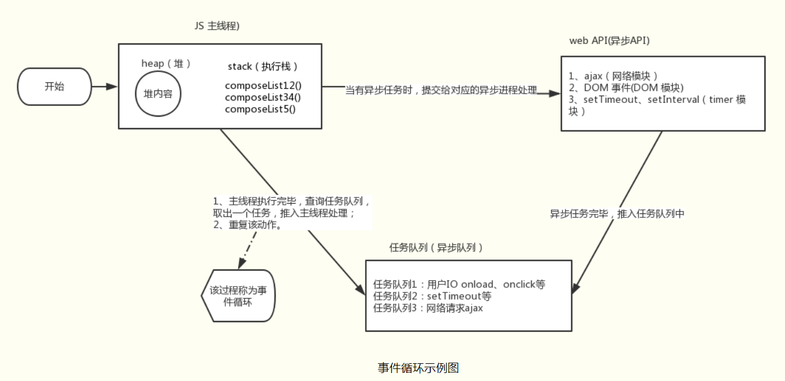
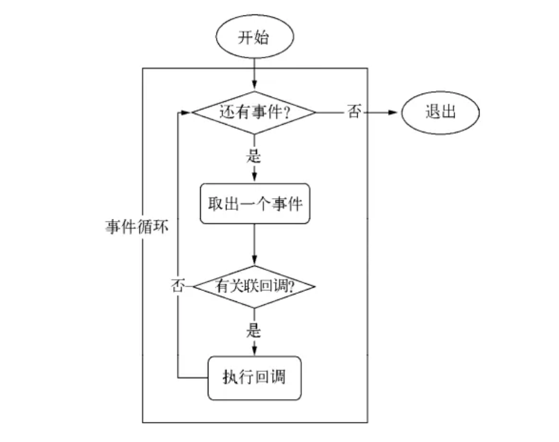
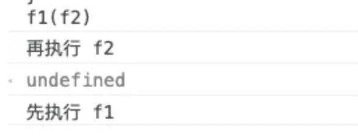

## 一、JS单线程、异步、同步概念

js是单线程语言，但js的宿主环境（比如浏览器，Node）是多线程的，宿主环境通过某种方式使得js具备了异步的属性。

js是单线程语言，浏览器只分配给js一个主线程，用来执行任务（函数），但一次只能执行一个任务，这些任务形成一个任务队列排队等候执行，但前端的某些任务是非常耗时的，比如网络请求，定时器和事件监听，如果让他们和别的任务一样，都老老实实的排队等待执行的话，执行效率会非常的低，甚至导致页面的假死。所以，浏览器为这些耗时任务开辟了另外的线程，主要包括http请求线程，浏览器定时触发器，浏览器事件触发线程，这些任务是异步的。同步执行是主线程按照顺序，串行执行任务；异步执行就是cpu跳过等待，先处理后续的任务（CPU与网络模块、timer等并行进行任务）。由此产生了任务队列与事件循环，来协调主线程与异步模块之间的工作。

## 二、任务队列和Event Loop（事件循环）

### 任务队列

所有任务可以分成两种，一种是同步任务（synchronous），另一种是异步任务（asynchronous）。同步任务指的是，在主线程上排队执行的任务，只有前一个任务执行完毕，才能执行后一个任务。异步任务指的是，不进入主线程、而进入"任务队列"（task queue）的任务，只有"任务队列"通知主线程，某个异步任务可以执行了，该任务才会进入主线程执行。

总结：**只要主线程空了，就会去读取"任务队列"，这就是JavaScript的运行机制**。【重要】

### Event Loop

**主线程从"任务队列"中读取事件，这个过程是循环不断的**，所以整个的这种运行机制又称为Event Loop（事件循环）。



Javascript是单线程的，所有的同步任务都会在主线程中执行。

当主线程中的任务，都执行完之后，系统会 “依次” 读取任务队列里的事件。与之相对应的异步任务进入主线程，开始执行。

异步任务之间，会存在差异，所以它们执行的优先级也会有区别。大致分为 微任务（micro task，如：Promise、MutaionObserver等）和宏任务（macro task，如：setTimeout、setInterval、I/O等）。

Promise 执行器中的代码会被同步调用，但是回调是基于微任务的。

宏任务的优先级低于微任务

每一个宏任务执行完毕都必须将当前的微任务队列清空

第一个 script 标签的代码是第一个宏任务

主线程会不断重复上面的步骤，直到执行完所有任务。

#### 宏任务macrotask：

（事件队列中的每一个事件都是一个macrotask）

优先级：主代码块 > setImmediate > MessageChannel > setTimeout / setInterval

比如：setImmediate指定的回调函数，总是排在setTimeout前面

#### 微任务包括：

优先级：process.nextTick > Promise > MutationObserver

## 三、异步

### 浏览器线程

在开始之前简单的说一下浏览器的线程，对浏览器的作业有个基础的认识。之前说过 `JavaScript`是单线程作业，但是并不代表浏览器就是单线程的。

在 `JavaScript`引擎中负责解析和执行 `JavaScript`代码的线程只有一个。但是除了这个主进程以外，还有其他很多辅助线程。那么诸如 `onclick`回调， `setTimeout`， `Ajax`这些都是怎么实现的呢？即浏览器搞了几个其他线程去辅助 `JavaScript`线程的运行。

浏览器有很多线程，例如：

1. **GUI渲染线程** - GUI渲染线程处于挂起状态的，也就是冻结状态
2. **JavaScript引擎线程** - 用于解析JavaScript代码
3. **定时器触发线程** - 浏览器定时计数器并不是 js引擎计数
4. **浏览器事件线程** - 用于解析BOM渲染等工作
5. **http线程** - 主要负责数据请求
6. **EventLoop轮询处理线程** - 事件被触发时该线程会把事件添加到待处理队列的队尾
7. 等等等

从上面来看可以得出，浏览器其实也做了很多事情，远远的没有想象中的那么简单，上面这些线程中 `GUI渲染线程`, `JavaScript引擎线程`, `浏览器事件线程`是浏览器的常驻线程。

当浏览器开始解析代码的时候，会根据代码去分配给不同的辅助线程去作业。

**进程**

进程是指在操作系统中正在运行的一个应用程序

**线程**

线程是指进程内独立执行某个任务的一个单元。线程自己基本上不拥有系统资源，只拥有一点在运行中必不可少的资源(如程序计数器，一组寄存器和栈)。

进程中包含线程，一个进程中可以有N个进程。我们可以在电脑的任务管理器中查看到正在运行的进程，可以认为一个进程就是在运行一个程序，比如用浏览器打开一个网页，这就是开启了一个进程。但是比如打开3个浏览器，那么就开启了3个进程。

#### 同步&异步

既然要了解同步异步当然要简单的说一下同步和异步。说到同步和异步最有发言权的真的就属 `Ajax`了，为了让例子更加明显没有使用 `Ajax`举例。(●ˇ∀ˇ●)

**同步**

同步会逐行执行代码，会对后续代码造成阻塞，直至代码接收到预期的结果之后，才会继续向下执行。

```js
console.log(1);
alert("同步");
console.log(2);
//  结果：
//  1
//  同步
//  2
```

**异步**

如果在函数返回的时候，调用者还不能够得到预期结果，而是将来通过一定的手段得到结果（例如回调函数），这就是异步。

```js
console.log(1);
setTimeout(() =## {   
	alert("异步"); 
},0);
console.log(2);
//  结果：
//  1
//  2
//  异步
```

### 为什么JavaScript要采用异步编程

一开始就说过， `JavaScript`是一种单线程执行的脚本语言（这可能是由于历史原因或为了简单而采取的设计）。它的单线程表现在任何一个函数都要从头到尾执行完毕之后，才会执行另一个函数，界面的更新、鼠标事件的处理、计时器（ `setTimeout、setInterval`等）的执行也需要先排队，后串行执行。假如有一段 `JavaScript`从头到尾执行时间比较长，那么在执行期间任何 `UI`更新都会被阻塞，界面事件处理也会停止响应。这种情况下就需要异步编程模式，目的就是把代码的运行打散或者让 `IO`调用（例如 `AJAX`）在后台运行，让界面更新和事件处理能够及时地运行。

`JavaScript`语言的设计者意识到，这时主线程完全可以不管 `IO`设备，挂起处于等待中的任务，先运行排在后面的任务。等到 `IO`设备返回了结果，再回过头，把挂起的任务继续执行下去。

::: tip 异步运行机制：

1. 所有同步任务都在主线程上执行，形成一个执行栈。
2. 主线程之外，还存在一个 `任务队列`。只要异步任务有了运行结果，就在 `任务队列`之中放置一个事件。
3. 一旦 `执行栈`中的所有同步任务执行完毕，系统就会读取 `任务队列`，看看里面有哪些事件。那些对应的异步任务，于是结束等待状态，进入执行栈，开始执行。
4. 主线程不断重复上面的第三步。

:::

举个例子：

```js
<button onclick="updateSync()">同步</button>
<button onclick="updateAsync()">异步</button>
<div id="output"></div>
<script>
    function updateSync() {  
    	for (var i = 0; i < 1000000; i++) {   
            document.getElementById('output').innerHTML = i;  
        }
}
	function updateAsync() {  
        var i = 0;  
        function updateLater() {    
            document.getElementById('output').innerHTML = (i++);    
            if (i < 1000000) {      
                setTimeout(updateLater, 0);    
            }  
        }  updateLater();
    }
</script>
```

点击 `同步`按钮会调用 `updateSync`的同步函数，逻辑非常简单，循环体内每次更新 `output`结点的内容为 `i`。如果在其他多线程模型下的语言，你可能会看到界面上以非常快的速度显示从 `0`到 `999999`后停止。但是在 `JavaScript`中，你会感觉按钮按下去的时候卡了一下，然后看到一个最终结果 `999999`，而没有中间过程，这就是因为在 `updateSync`函数运行过程中 `UI`更新被阻塞，只有当它结束退出后才会更新 `UI`。反之，当点击 `异步`的时候，会明显的看到 `Dom`在逐步更新的过程。

从上面的例子中可以明显的看出，异步编程对于 `JavaScript`来说是多么多么的重要。

### 异步编程有什么好处

从编程方式来讲当然是同步编程的方式更为简单，但是同步有其局限性一是**假如是单线程那么一旦遇到阻塞调用，会造成整个线程阻塞**，导致 `cpu`无法得到有效利用，而浏览器的 `JavaScript`执行和浏览器渲染是运行在单线程中，一旦遇到阻塞调用不仅意味 `JavaScript`的执行被阻塞更意味整个浏览器渲染也被阻塞这就导致界面的卡死，若是多线程则不可避免的要考虑互斥和同步问题，而互斥和同步带来复杂度也很大，实际上浏览器下因为同时只能执行一段 `JavaScript`代码这意味着不存在互斥问题，但是同步问题仍然不可避免，以往回调风格中异步的流程控制（其实就是同步问题）也比较复杂。浏览器端的编程方式也即是 `GUI编程`，其本质就是事件驱动的（鼠标点击， `Http`请求结束等）异步编程更为自然。

突然有个疑问，既然如此为什么 `JavaScript`没有使用多线程作业呢？就此就去 `Google`了一下 `JavaScript多线程`，在 `HTML5`推出之后是提供了多线程只是比较局限。**在使用多线程的时候无法使用 `window`对象。**若 `JavaScript`使用多线程，在 `A`线程中正在操作 `DOM`，但是 `B`线程中已经把该 `DOM`已经删除了（只是简单的小栗子，可能还有很多问题，至于这些历史问题无从考究了）。会给编程作业带来很大的负担。就我而言我想这也就说明了为什么 `JavaScript`没有使用异步编程的原因吧。

### 异步与回调

回调到底属于异步么？会想起刚刚开始学习 `JavaScript`的时候常常吧这两个概念混合在一起。在搞清楚这个问题，首先要明白什么是回调函数。

百科：**回调函数是一个函数，它作为参数传递给另一个函数，并在父函数完成后执行**。回调的特殊之处在于，**出现在“父类”之后的函数可以在回调执行之前执行**。另一件需要知道的重要事情是如何正确地传递回调。这就是我经常忘记正确语法的地方。

通过上面的解释可以得出，回调函数本质上其实就是一种设计模式，例如我们熟悉的 `JQuery`也只不过是遵循了这个设计原则而已。在 `JavaScript`中，回调函数具体的定义为：**函数 `A`作为参数(函数引用)传递到另一个函数 `B`中，并且这个函数 `B`执行函数 `A`。我们就说函数 `A`叫做回调函数。**如果没有名称(函数表达式)，就叫做匿名回调函数。

简单的举个小例子：

```js
function test (n,fn){    
	console.log(n);    
	fn && fn(n);
}
console.log(1);
test(2);
test(3,function(n){    
    console.log(n+1)
});
console.log(5)
//  结果
//  1
//  2
//  3
//  4
//  5
```

通过上面的代码输出的结果可以得出回调函数不一定属于异步，一般同步会阻塞后面的代码，通过输出结果也就得出了这个结论。回调函数，一般在同步情境下是最后执行的，而在异步情境下有可能不执行，因为事件没有被触发或者条件不满足。

**回调函数应用场景**

1. 资源加载：动态加载js文件后执行回调，加载iframe后执行回调，ajax操作回调，图片加载完成执行回调，AJAX等等。
2. DOM事件及Node.js事件基于回调机制(Node.js回调可能会出现多层回调嵌套的问题)。
3. setTimeout的延迟时间为0，这个hack经常被用到，settimeout调用的函数其实就是一个callback的体现
4. 链式调用：链式调用的时候，在赋值器(setter)方法中(或者本身没有返回值的方法中)很容易实现链式调用，而取值器(getter)相对来说不好实现链式调用，因为你需要取值器返回你需要的数据而不是this指针，如果要实现链式方法，可以用回调函数来实现。
5. setTimeout、setInterval的函数调用得到其返回值。由于两个函数都是异步的，即：调用时序和程序的主流程是相对独立的，所以没有办法在主体里面等待它们的返回值，它们被打开的时候程序也不会停下来等待，否则也就失去了setTimeout及setInterval的意义了，所以用return已经没有意义，只能使用callback。callback的意义在于将timer执行的结果通知给代理函数进行及时处理。

## 四、JavaScript中的那些异步操作

`JavaScript`既然有很多的辅助线程，不可能所有的工作都是通过主线程去做，既然分配给辅助线程去做事情。

**XMLHttpRequest**

`XMLHttpRequest`对象应该不是很陌生的，主要用于浏览器的数据请求与数据交互。 `XMLHttpRequest`对象提供两种请求数据的方式，一种是 `同步`，一种是 `异步`。可以通过参数进行配置。默认为异步。

对于 `XMLHttpRequest`这里就不作太多的赘述了。

```js
var xhr = new XMLHttpRequest();
xhr.open("GET", url, false);    //同步方式请求 
xhr.open("GET", url, true);     //异步
xhr.send();
```

同步 `Ajax`请求：

当请求开始发送时， `浏览器事件线程`通知 `主线程`，让 `Http线程`发送数据请求，主线程收到请求之后，通知 `Http线程`发送请求， `Http线程`收到 `主线程`通知之后就去请求数据，等待服务器响应，过了 `N`年之后，收到请求回来的数据，返回给 `主线程`数据已经请求完成， `主线程`把结果返回给了 `浏览器事件线程`，去完成后续操作。

异步 `Ajax`请求：

当请求开始发送时， `浏览器事件线程`通知， `浏览器事件线程`通知 `主线程`，让 `Http线程`发送数据请求，主线程收到请求之后，通知 `Http线程`发送请求， `Http线程`收到 `主线程`通知之后就去请求数据，并通知 `主线程`请求已经发送， `主进程`通知 `浏览器事件线程`已经去请求数据，则
`浏览器事件线程`，只需要等待结果，并不影响其他工作。

**setInterval&setTimeout**

`setInterval`与 `setTimeout`同属于异步方法，其异步是通过回调函数方式实现。:yum:**其两者的区别则 `setInterval`会连续调用回调函数，则 `setTimeout`会延时调用回调函数只会执行一次。**

```js
setInterval(() =## {    
            alert(1)
},2000)
//  每隔2s弹出一次1
setTimeout(() =## {    
           alert(2)
},2000)
//  进入页面后2s弹出2，则不会再次弹出
```

**requestAnimationFarme**

`requestAnimationFrame`字面意思就是去请求动画帧，在没有 `API`之前都是基于 `setInterval`，与 `setInterval`相比， `requestAnimationFrame`最大的优势是由系统来决定回调函数的执行时机。具体一点讲，如果屏幕刷新率是 `60Hz`,那么回调函数就每 `16.7ms`被执行一次，如果刷新率是 `75Hz`，那么这个时间间隔就变成了 `1000/75=13.3ms`，换句话说就是， `requestAnimationFrame`的步伐跟着系统的刷新步伐走。它能保证回调函数在屏幕每一次的刷新间隔中只被执行一次，这样就不会引起丢帧现象，也不会导致动画出现卡顿的问题。

举个小例子：

```js
var progress = 0;
//回调函数
function render() {   
    progress += 1; //修改图像的位置    
    if (progress < 100) {        
        //在动画没有结束前，递归渲染        
        window.requestAnimationFrame(render);    
    }
}
//第一帧渲染
window.requestAnimationFrame(render);
```

**Object.observe - 观察者**

`Object.observe`是一个提供数据监视的 `API`，在 `chrome`中已经可以使用。是 `ECMAScript 7` 的一个提案规范，官方建议的是 `谨慎使用`级别，但是个人认为这个 `API`非常有用，例如可以对现在流行的 `MVVM`框架作一些简化和优化。虽然标准还没定，但是标准往往是滞后于实现的，只要是有用的东西，肯定会有越来越多的人去使用，越来越多的引擎会支持，最终促使标准的生成。从 `observe`字面意思就可以知道，这玩意儿就是用来做观察者模式之类。

```js
var obj = {a: 1};
Object.observe(obj, output);
obj.b = 2;
obj.a = 2;
Object.defineProperties(obj, {a: { enumerable: false}}); //修改属性设定
delete obj.b;
function output(change) {    
    console.log(1)
}
```

**Node.js异步I/O**

当我们发起 `IO`请求时，调用的是各个不同平台的操作系统内部实现的线程池内的线程。这里的 `IO`请求可不仅仅是读写磁盘文件，在 `*nix`中，将计算机抽象了一层，磁盘文件、硬件、套接字等几乎所有计算机资源都被抽象为文件，常说的 `IO`请求就是抽象后的文件。完成 `Node`整个异步 `IO`环节的有事件循环、观察者、请求对象。

**事件循环机制**

单线程就意味着，所有任务需要排队，前一个任务结束，才会执行后一个任务。如果前一个任务耗时很长，后一个任务就不得不一直等着。于是就有一个概念，任务队列。如果排队是因为计算量大， `CPU`忙不过来，倒也算了，但是很多时候 `CPU`是闲着的，因为 `IO`设备（输入输出设备）很慢（比如 `Ajax`操作从网络读取数据），不得不等着结果出来，再往下执行。

事件循环是 `Node`的自身执行模型，正是事件循环使得回调函数得以在 `Node`中大量的使用。在进程启动时 `Node`会创建一个 `while(true)`死循环，这个和 `Netty`也是一样的，每次执行循环体，都会完成一次 `Tick`。每个 `Tick`的过程就是查看是否有事件等待被处理。如果有，就取出事件及相关的回调函数，并执行关联的回调函数。如果不再有事件处理就退出进程。



线程只会做一件事情，就是从事件队列里面取事件、执行事件，再取事件、再事件。当消息队列为空时，就会等待直到消息队列变成非空。而且主线程只有在将当前的消息执行完成后，才会去取下一个消息。这种机制就叫做事件循环机制，取一个消息并执行的过程叫做一次循环。

```js
while(true) {    
	var message = queue.get();    
	execute(message);
}
```

我们可以把整个事件循环想象成一个事件队列，在进入事件队列时开始对事件进行弹出操作，直至事件为 `0`为止。

**process.nextTick**(微任务)

`process.nextTick()`方法可以在当前"执行栈"的尾部-->下一次 `EventLoop`（主线程读取"任务队列"）之前-->触发 `process`指定的回调函数。也就是说，**它指定的任务总是发生在所有异步任务之前，当前主线程的末尾。（ `nextTick`虽然也会异步执行，但是不会给其他 `io`事件执行的任何机会）;**

```js
process.nextTick(function A() {  
    console.log(1);  process.nextTick(function B(){console.log(2);});
});
setTimeout(function C() {  
    console.log(3);
}, 0);
// 1
// 2
// 3
```

## 五、异步过程的构成要素

异步函数实际上很快就调用完成了，但是后面还有工作线程执行异步任务，通知主线程，主线程调用回调函数等很多步骤。我们把整个过程叫做异步过程，异步函数的调用在整个异步过程中只是一小部分。

一个异步过程的整个过程：主线程发一起一个异步请求，相应的工作线程接收请求并告知主线程已收到通知（异步函数返回）；主线程可以继续执行后面的代码，同时工作线程执行异步任务；工作线程完成工作后，通知主线程；主线程收到通知后，执行一定的动作（调用回调函数）。

它可以叫做异步过程的发起函数，或者叫做异步任务注册函数。 `args`是这个函数需要的参数， `callbackFn`（回调函数）也是这个函数的参数，但是它比较特殊所以单独列出来。所以，从主线程的角度看，一个异步过程包括下面两个要素：

1. 发起函数;
2. 回调函数callbackFn

它们都是主线程上调用的，其中注册函数用来发起异步过程，回调函数用来处理结果。

举个具体的栗子：

```js
setTimeout(function,1000);
```

其中 `setTimeout`就是异步过程的发起函数， `function`是回调函数。

注：前面说得形式 `A(args...,callbackFn)`只是一种抽象的表示，并不代表回调函数一定要作为发起函数的参数，例如：

```js
var xhr = new XMLHttpRequest();
xhr.onreadystatechange = xxx;
xhr.open('GET'， url);
xhr.send();　　
```

## 六、异步编程的六种方式

- 回调函数
- 事件监听
- 发布订阅模式
- Promise
- Generator (ES6)
- async (ES7)


异步编程传统的解决方案：**回调函数**和**事件监听**

初始示例：假设有两个函数, f1 和 f2，f1 是一个需要一定时间的函数。

```javascript
function f1() {    
    setTimeout(function(){        
        console.log('先执行 f1')    
    },1000)
}
function f2() {    
    console.log('再执行 f2')
}
```

### 回调函数

因为 f1 是一个需要一定时间的函数，所以可以将 f2 写成 f1 的 `回调函数`，将同步操作变成异步操作，f1 不会阻塞程序的运行，f2 也无需空空等待，例如 JQuery 的 ajax。

回调函数的demo：

```javascript
function f1(f2){    
    setTimeout(function(){        
        console.log('先执行 f1')    
    },1000)    
    f2()
}
function f2() {    
    console.log('再执行 f2')
}
```

效果如下：


总结：回调函数易于实现、便于理解，但是多次回调会导致代码高度耦合

### 事件监听

脚本的执行不取决代码的顺序，而取决于某一个事件是否发生。

事件监听的demo

```javascript
$(document).ready(function(){     
    console.log('DOM 已经 ready')
});
```

### 发布订阅模式

发布/订阅模式是利用一个消息中心，发布者发布一个消息给消息中心，订阅者从消息中心订阅该消息，。类似于 vue 的父子组件之间的传值。

发布订阅模式的 demo

```javascript
//订阅done事件
$('#app').on('done',function(data){    
console.log(data)
})
//发布事件
$('#app').trigger('done,'haha')
```

### Promise

Promise 实际就是一个对象， 从它可以获得异步操作的消息，Promise 对象有三种状态，pending(进行中)、fulfilled（已成功）和rejected（已失败）。Promise 的状态一旦改变之后，就不会在发生任何变化,将回调函数变成了链式调用。

Promise 封装异步请求demo

```javascript
export default function getMethods (url){    
    return new Promise(function(resolve, reject){        
        axios.get(url).then(res => {            
            resolve(res)        
        }).catch(err =>{            
            reject(err)        
        })    
    })
}
getMethods('/api/xxx').then(res => {    
    console.log(res)
}, err => {    
    console.log(err)
})
```

### Generator

Generator 函数是一个状态机，封装了多个内部状态。执行 Generator 函数会返回一个遍历器对象，使用该对象的 next() 方法，可以遍历 Generator 函数内部的每一个状态，直到 return 语句。

形式上，Generator 函数是一个普通函数，但是有两个特征。一是，function关键字与函数名之间有一个星号；二是，函数体内部使用yield表达式， yield是暂停执行的标记。

next() 方法遇到yield表达式，就暂停执行后面的操作，并将紧跟在yield后面的那个表达式的值，作为返回的对象的value属性值。

Generator 的 demo

```javascript
function *generatorDemo() {  
    yield 'hello'; 
    yield  1 + 2;  
    return 'ok';
}
var demo = generatorDemo()
demo.next()   // { value: 'hello', done: false } 
demo.next()   // { value: 3, done: false } 
demo.next()   // { value: 'ok', done: ture } 
demo.next()   // { value: undefined, done: ture } 
```

### async

async函数返回的是一个 Promise 对象，可以使用 then 方法添加回调函数，async 函数内部 return 语句返回的值，会成为 then 方法回调函数的参数。当函数执行的时候，一旦遇到await就会先返回，等到异步操作完成，再接着执行函数体内后面的语句。

1.await命令后面返回的是 Promise 对象，运行结果可能是rejected，所以最好把await命令放在try...catch代码块中。

async 的 demo1

```javascript
async function demo() {  
    try {    
        await new Promise(function (resolve, reject) {      
            // something    
        });  
    } catch (err) {    
        console.log(err);  
    }
}
demo().then(data => {    
    console.log(data)  // 
})
```

作者：Aima
https://segmentfault.com/a/1190000019188824