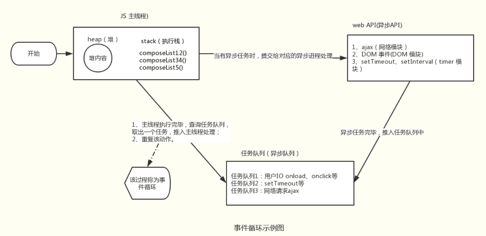

## 一、JS单线程、异步、同步概念

js是单线程语言，但js的宿主环境（比如浏览器，Node）是多线程的，宿主环境通过某种方式使得js具备了异步的属性。

js是单线程语言，浏览器只分配给js一个主线程，用来执行任务（函数），但一次只能执行一个任务，这些任务形成一个任务队列排队等候执行，但前端的某些任务是非常耗时的，比如网络请求，定时器和事件监听，如果让他们和别的任务一样，都老老实实的排队等待执行的话，执行效率会非常的低，甚至导致页面的假死。所以，浏览器为这些耗时任务开辟了另外的线程，主要包括http请求线程，浏览器定时触发器，浏览器事件触发线程，这些任务是异步的。同步执行是主线程按照顺序，串行执行任务；异步执行就是cpu跳过等待，先处理后续的任务（CPU与网络模块、timer等并行进行任务）。由此产生了任务队列与事件循环，来协调主线程与异步模块之间的工作。

## 二、任务队列和Event Loop（事件循环）

### 任务队列

所有任务可以分成两种，一种是同步任务（synchronous），另一种是异步任务（asynchronous）。同步任务指的是，在主线程上排队执行的任务，只有前一个任务执行完毕，才能执行后一个任务。异步任务指的是，不进入主线程、而进入"任务队列"（task queue）的任务，只有"任务队列"通知主线程，某个异步任务可以执行了，该任务才会进入主线程执行。

总结：**只要主线程空了，就会去读取"任务队列"，这就是JavaScript的运行机制**。【重要】

### Event Loop

**主线程从"任务队列"中读取事件，这个过程是循环不断的**，所以整个的这种运行机制又称为Event Loop（事件循环）。



Javascript是单线程的，所有的同步任务都会在主线程中执行。

当主线程中的任务，都执行完之后，系统会 “依次” 读取任务队列里的事件。与之相对应的异步任务进入主线程，开始执行。

异步任务之间，会存在差异，所以它们执行的优先级也会有区别。大致分为 微任务（micro task，如：Promise、MutaionObserver等）和宏任务（macro task，如：setTimeout、setInterval、I/O等）。

Promise 执行器中的代码会被同步调用，但是回调是基于微任务的。

宏任务的优先级低于微任务

每一个宏任务执行完毕都必须将当前的微任务队列清空

第一个 script 标签的代码是第一个宏任务

主线程会不断重复上面的步骤，直到执行完所有任务。

#### 宏任务macrotask：

（事件队列中的每一个事件都是一个macrotask）

优先级：主代码块 > setImmediate > MessageChannel > setTimeout / setInterval

比如：setImmediate指定的回调函数，总是排在setTimeout前面

#### 微任务包括：

优先级：process.nextTick > Promise > MutationObserver

## 三、异步编程的六种方式

- 回调函数
- 事件监听
- 发布订阅模式
- Promise
- Generator (ES6)
- async (ES7)


异步编程传统的解决方案：**回调函数**和**事件监听**

初始示例：假设有两个函数, f1 和 f2，f1 是一个需要一定时间的函数。

```javascript
function f1() {    
    setTimeout(function(){        
        console.log('先执行 f1')    
    },1000)
}
function f2() {    
    console.log('再执行 f2')
}
```

### 回调函数

因为 f1 是一个需要一定时间的函数，所以可以将 f2 写成 f1 的 `回调函数`，将同步操作变成异步操作，f1 不会阻塞程序的运行，f2 也无需空空等待，例如 JQuery 的 ajax。

回调函数的demo：

```javascript
function f1(f2){    
    setTimeout(function(){        
        console.log('先执行 f1')    
    },1000)    
    f2()
}
function f2() {    
    console.log('再执行 f2')
}
```

效果如下：


总结：回调函数易于实现、便于理解，但是多次回调会导致代码高度耦合

### 事件监听

脚本的执行不取决代码的顺序，而取决于某一个事件是否发生。

事件监听的demo

```javascript
$(document).ready(function(){     
    console.log('DOM 已经 ready')
});
```

### 发布订阅模式

发布/订阅模式是利用一个消息中心，发布者发布一个消息给消息中心，订阅者从消息中心订阅该消息，。类似于 vue 的父子组件之间的传值。

发布订阅模式的 demo

```javascript
//订阅done事件
$('#app').on('done',function(data){    
console.log(data)
})
//发布事件
$('#app').trigger('done,'haha')
```

### Promise

Promise 实际就是一个对象， 从它可以获得异步操作的消息，Promise 对象有三种状态，pending(进行中)、fulfilled（已成功）和rejected（已失败）。Promise 的状态一旦改变之后，就不会在发生任何变化,将回调函数变成了链式调用。

Promise 封装异步请求demo

```javascript
export default function getMethods (url){    
    return new Promise(function(resolve, reject){        
        axios.get(url).then(res => {            
            resolve(res)        
        }).catch(err =>{            
            reject(err)        
        })    
    })
}
getMethods('/api/xxx').then(res => {    
    console.log(res)
}, err => {    
    console.log(err)
})
```

### Generator

Generator 函数是一个状态机，封装了多个内部状态。执行 Generator 函数会返回一个遍历器对象，使用该对象的 next() 方法，可以遍历 Generator 函数内部的每一个状态，直到 return 语句。

形式上，Generator 函数是一个普通函数，但是有两个特征。一是，function关键字与函数名之间有一个星号；二是，函数体内部使用yield表达式， yield是暂停执行的标记。

next() 方法遇到yield表达式，就暂停执行后面的操作，并将紧跟在yield后面的那个表达式的值，作为返回的对象的value属性值。

Generator 的 demo

```javascript
function *generatorDemo() {  
    yield 'hello'; 
    yield  1 + 2;  
    return 'ok';
}
var demo = generatorDemo()
demo.next()   // { value: 'hello', done: false } 
demo.next()   // { value: 3, done: false } 
demo.next()   // { value: 'ok', done: ture } 
demo.next()   // { value: undefined, done: ture } 
```

### async

async函数返回的是一个 Promise 对象，可以使用 then 方法添加回调函数，async 函数内部 return 语句返回的值，会成为 then 方法回调函数的参数。当函数执行的时候，一旦遇到await就会先返回，等到异步操作完成，再接着执行函数体内后面的语句。

1.await命令后面返回的是 Promise 对象，运行结果可能是rejected，所以最好把await命令放在try...catch代码块中。

async 的 demo1

```javascript
async function demo() {  
    try {    
        await new Promise(function (resolve, reject) {      
            // something    
        });  
    } catch (err) {    
        console.log(err);  
    }
}
demo().then(data => {    
    console.log(data)  // 
})
```

作者：Aima
https://segmentfault.com/a/1190000019188824