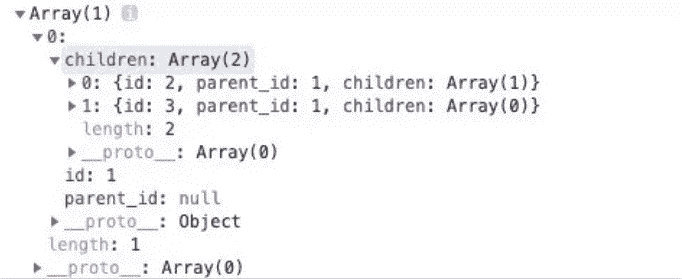

以下转载自公众号([前端劝退师]( https://mp.weixin.qq.com/s?__biz=MzI1NDU3NzM5Mg==&mid=2247483966&idx=1&sn=8854541fe88741b9b9523faaf234cf6a&chksm=e9c25da1deb5d4b7011d004e50ae5a6d831e63bdff303671beba7fe5d7d04ea24adeba0e91ee&mpshare=1&scene=1&srcid=&sharer_sharetime=1571132963007&sharer_shareid=26f3e37bab0c8fb6da7d7f1cf50286f7&key=035834a4bedb3232634560f7789798a65930cae77e9885afd6c3c6d795dd382ad0d54599780c351e17ad108796f87fc4db8e6bdf683cbaaf0b85f9630d17e8e3cea635806e91afdee89c95f2f9103483&ascene=1&uin=MTM1NzkzOTQ4MA%3D%3D&devicetype=Windows+10&version=62060833&lang=zh_CN&pass_ticket=wKSLLQJMdQ1C%2BXKEJz96YlgJWlbHxGuwI9CbY6KEEXlyCpL0y9G1YV9eFoXCIXKG ))

**本文工具函数的命名非常值得借鉴。**

## 1. 第一部分：数组

### 1. `all`：布尔全等判断

```js
const all = (arr, fn = Boolean) => arr.every(fn);
all([4, 2, 3], x => x > 1); // true
all([1, 2, 3]); // true
```

### 2. `allEqual`：检查数组各项相等

```js
const allEqual = arr => arr.every(val => val === arr[0]);
allEqual([1, 2, 3, 4, 5, 6]); // false
allEqual([1, 1, 1, 1]); // true
```

### 3.`approximatelyEqual`：约等于

```js
const approximatelyEqual = (v1, v2, epsilon = 0.001) => Math.abs(v1 - v2) < epsilon;
approximatelyEqual(Math.PI / 2.0, 1.5708); // true
```

### 5.`arrayToHtmlList`：数组转`li`列表

此代码段将数组的元素转换为``标签，并将其附加到给定ID的列表中。

```js
const arrayToHtmlList = (arr, listID) =>
  (el => (
    (el = document.querySelector('#' + listID)),
    (el.innerHTML += arr.map(item => `<li>${item}</li>`).join(''))
  ))();
arrayToHtmlList(['item 1', 'item 2'], 'myListID');
```

### 6. `average`：平均数

```js
const average = (...nums) => nums.reduce((acc, val) => acc + val, 0) / nums.length;
average(...[1, 2, 3]); // 2
average(1, 2, 3); // 2
```

### 10. `compact`：去除数组中的无效/无用值

```js
const compact = arr => arr.filter(Boolean);
compact([0, 1, false, 2, '', 3, 'a', 'e' * 23, NaN, 's', 34]);
// [ 1, 2, 3, 'a', 's', 34 ]
```

### 11. `countOccurrences`：检测数值出现次数

```js
const countOccurrences = (arr, val) => arr.reduce((a, v) => (v === val ? a + 1 : a), 0);
countOccurrences([1, 1, 2, 1, 2, 3], 1); // 3
```

### 12. `deepFlatten`：递归扁平化数组

```js
const deepFlatten = arr => [].concat(...arr.map(v => (Array.isArray(v) ? deepFlatten(v) : v)));
deepFlatten([1, [2], [[3], 4], 5]); // [1,2,3,4,5]
```

### 13. `difference`：寻找差异

此代码段查找两个数组之间的差异。

```js
const difference = (a, b) => {  
const s = new Set(b);  
    return a.filter(x => !s.has(x));};
difference([1, 2, 3], [1, 2, 4]); // [3]
```

### 16. `flatten`：指定深度扁平化数组

此代码段第二参数可指定深度。

```js
const flatten = (arr, depth = 1) =>  
	arr.reduce((a, v) => a.concat(depth > 1 && Array.isArray(v) ? flatten(v, depth - 1) : v), []);
flatten([1, [2], 3, 4]); // [1, 2, 3, 4]
flatten([1, [2, [3, [4, 5], 6], 7], 8], 2); // [1, 2, 3, [4, 5], 6, 7, 8]
```

### 17. `indexOfAll`：返回数组中某值的所有索引

此代码段可用于获取数组中某个值的所有索引，如果此值中未包含该值，则返回一个空数组。

```js
const indexOfAll = (arr, val) => arr.reduce((acc, el, i) => (el === val ? [...acc, i] : acc), []);
indexOfAll([1, 2, 3, 1, 2, 3], 1); // [0,3]
indexOfAll([1, 2, 3], 4); // []
```

### 18. `intersection`：两数组的交集

```js
const intersection = (a, b) => {  
	const s = new Set(b);  
	return a.filter(x => s.has(x));};
intersection([1, 2, 3], [4, 3, 2]); // [2, 3]
```

### 23.:star: `randomIntArrayInRange`：生成两数之间指定长度的随机数组

```js
const randomIntArrayInRange = (min, max, n = 1) =>  
	Array.from({ length: n }, () => Math.floor(Math.random() * (max - min + 1)) + min);

randomIntArrayInRange(12, 35, 10); // [ 34, 14, 27, 17, 30, 27, 20, 26, 21, 14 ]
```

### 26. `shuffle`：“洗牌” 数组

此代码段使用`Fisher-Yates`算法随机排序数组的元素。

```js
const shuffle = ([...arr]) => {  
    let m = arr.length;  
    while (m) {    
        const i = Math.floor(Math.random() * m--);    
        [arr[m], arr[i]] = [arr[i], arr[m]];  
    }  
    return arr;
};
const foo = [1, 2, 3];
shuffle(foo); // [2, 3, 1], foo = [1, 2, 3]
```

### 27. :star:`nest`：根据`parent_id`生成树结构（阿里一面真题）

根据每项的`parent_id`，生成具体树形结构的对象。

```js
const nest = (items, id = null, link = 'parent_id') =>  
  items    
	.filter(item => item[link] === id)    
	.map(item => ({ ...item, children: nest(items, item.id) }));
```

用法：

```js
const comments = [  
    { id: 1, parent_id: null },  
    { id: 2, parent_id: 1 },  
    { id: 3, parent_id: 1 },  
    { id: 4, parent_id: 2 },  
    { id: 5, parent_id: 4 }];
const nestedComments = nest(comments); // [{ id: 1, parent_id: null, children: [...] }]
```



真题：


## 2. 第二部分：函数

### 4. :star:`timeTaken`：计算函数执行时间

```js
const timeTaken = callback => {  
    console.time('timeTaken');  
    const r = callback();  
    console.timeEnd('timeTaken');  
    return r;
};
timeTaken(() => Math.pow(2, 10)); // 1024, (logged): timeTaken: 0.02099609375ms
```

### 5. :star:`createEventHub`：简单的发布/订阅模式

创建一个发布/订阅（发布-订阅）事件集线，有`emit`，`on`和`off`方法。

1. 使用`Object.create(null)`创建一个空的`hub`对象。
2. `emit`，根据`event`参数解析处理程序数组，然后`.forEach()`通过传入数据作为参数来运行每个处理程序。
3. `on`，为事件创建一个数组（若不存在则为空数组），然后`.push()`将处理程序添加到该数组。
4. `off`，用`.findIndex()`在事件数组中查找处理程序的索引，并使用`.splice()`删除。

```js
const createEventHub = () => ({
  hub: Object.create(null),
  emit(event, data) {
    (this.hub[event] || []).forEach(handler => handler(data));
  },
  on(event, handler) {
    if (!this.hub[event]) this.hub[event] = [];
    this.hub[event].push(handler);
  },
  off(event, handler) {
    const i = (this.hub[event] || []).findIndex(h => h === handler);
    if (i > -1) this.hub[event].splice(i, 1);
    if (this.hub[event].length === 0) delete this.hub[event];
  }
});
```

用法：

```js
const handler = data => console.log(data);
const hub = createEventHub();
let increment = 0; 

// 订阅，监听不同事件
hub.on('message', handler);
hub.on('message', () => console.log('Message event fired'));
hub.on('increment', () => increment++); 

// 发布：发出事件以调用所有订阅给它们的处理程序，并将数据作为参数传递给它们
hub.emit('message', 'hello world'); // 打印 'hello world' 和 'Message event fired'
hub.emit('message', { hello: 'world' }); // 打印 对象 和 'Message event fired'
hub.emit('increment'); // increment = 1

// 停止订阅
hub.off('message', handler);
```

### 7. `once`：只调用一次的函数

```js
const once = fn => {  
    let called = false  
    return function () {    
        if (!called) {      
            called = true      
            fn.apply(this, arguments)    
        }  
    }
};
```