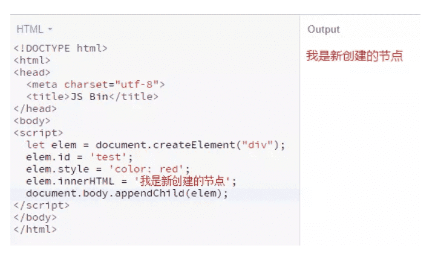
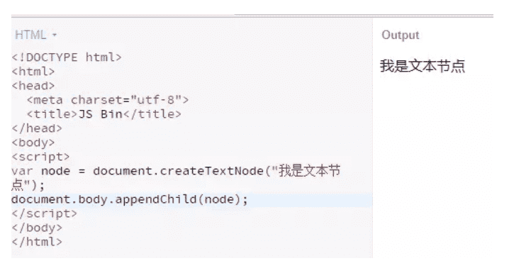
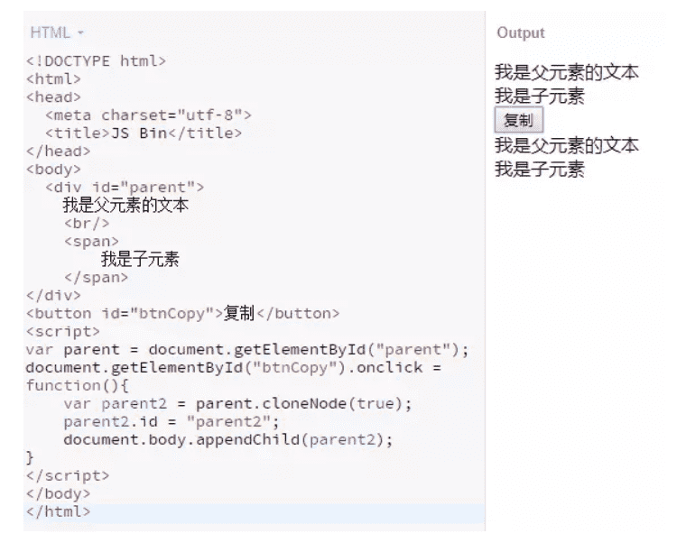
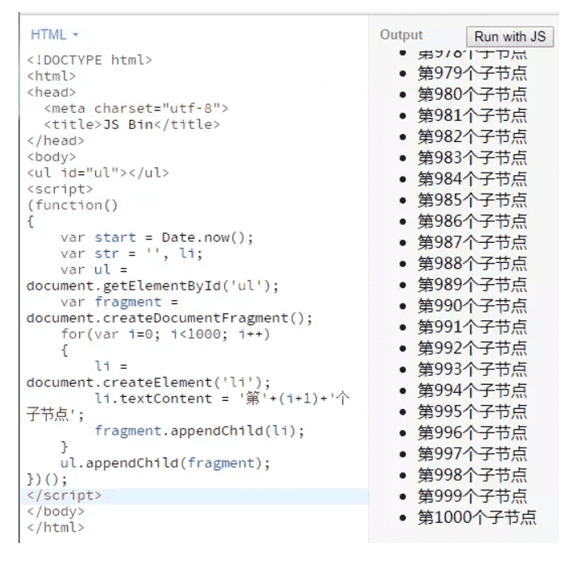

作者：YyzclYang

链接：https://juejin.im/post/5af43bd5f265da0b8336c6f7

来源：掘金著作权归作者所有。

## 1 什么是DOM

文档对象模型 (DOM) 是HTML和XML文档的**编程接口**。它提供了对文档的结构化的表述，并定义了一种方式可以使从程序中对该结构进行访问，从而改变文档的结构，样式和内容。
 **文档对象模型 (DOM)** 是对HTML文件的另一种展示，通俗地说，一个HTML 文件，我们可以用编辑器以代码的形式展示它，也可以用浏览器以页面的形式展示它，同一份文件通过不同的展示方式，就有了不一样的表现形式。而DOM 将文档解析为一个由节点和对象（包含属性和方法的对象）组成的结构集合。简言之，它会将web页面和脚本或程序语言连接起来，我们可以使用脚本或者程序语言通过DOM 来改变或者控制web页面。

## 2 如何访问DOM

我们可以通过JavaScript 来调用`document`和`window`元素的API来操作文档或者获取文档的信息。

## 3 Node

Node 是一个接口，有许多接口都从Node 继承方法和属性： `Document`, `Element`, `CharacterData (which Text, Comment, and CDATASection inherit)`, `ProcessingInstruction`, `DocumentFragment`, `DocumentType`, `Notation`, `Entity`, `EntityReference`。 Node 有一个`nodeType`的属性表示Node 的类型，是一个整数，不同的值代表不同的节点类型。具体如下表所示：

**节点类型常量**

| 常量                               |  值  | 描述                                                         |
| ---------------------------------- | :--: | :----------------------------------------------------------- |
| `Node.ELEMENT_NODE`                |  1   | 一个元素节点，例如 `<p>` 和 `<div>`                          |
| `Node.TEXT_NODE`                   |  3   | `Element` 或者 `Attr` 中实际的文字                           |
| `Node.PROCESSING_INSTRUCTION_NODE` |  7   | 一个用于XML文档的 `ProcessingInstruction` ，例如 `<?xml-stylesheet ... ?>` 声明 |
| `Node.COMMENT_NODE`                |  8   | 一个 `Comment` 节点                                          |
| `Node.DOCUMENT_NODE`               |  9   | 一个 `Document` 节点                                         |
| `Node.DOCUMENT_TYPE_NODE`          |  10  | 描述文档类型的 `DocumentType` 节点。例如 `<!DOCTYPE html>`  就是用于 HTML5 的 |
| `Node.DOCUMENT_FRAGMENT_NODE`      |  11  | 一个 `DocumentFragment` 节点                                 |

**已弃用的节点类型常量**

| 常量                         |  值  | 描述                                                         |
| ---------------------------- | :--: | :----------------------------------------------------------- |
| `Node.ATTRIBUTE_NODE`        |  2   | 元素的耦合属性。在DOM4 规范里`Node` 接口将不再实现这个元素属性 |
| `Node.CDATA_SECTION_NODE`    |  4   | 一个`CDATASection`。在DOM4 规范里被移除                      |
| `Node.ENTITY_REFERENCE_NODE` |  5   | 一个XML 实体引用节点。在DOM4 规范里被移除                    |
| `Node.ENTITY_NODE`           |  6   | 一个XML `<!ENTITY ...>`节点。在DOM4 规范中被移除             |
| `Node.NOTATION_NODE`         |  12  | 一个XML `<!NOTATION ...>`节点。在DOM4 规范里被移除           |

假设我们要判断一个Node 是不是一个`元素`，通过查表可知`元素`的`nodeType`属性值为1，代码可以这么写：

```js
if(X.nodeType === 1){
  console.log('X 是一个元素');
}
```

在Node 类型中，比较常用的就是`element`，`text`，`comment`，`document`，`document_fragment`这几种类型。

### 3.1 Element

Element提供了对元素标签名，子节点和特性的访问，我们常用HTML元素比如`div`，`span`，`a`等标签就是`element`中的一种。

::: tip Element有下面几条特性：
- nodeType为1
- **nodeName为元素标签名，tagName也是返回标签名**
- **nodeValue为null**
- parentNode可能是Document或Element
- 子节点可能是Element，Text，Comment，Processing_Instruction，CDATASection或EntityReference
:::

### 3.2 Text

Text表示文本节点，它包含的是纯文本内容，不能包含html代码，但可以包含转义后的html代码。
::: tip Text有下面的特性：
- nodeType为3
- nodeName为#text
- **nodeValue为文本内容**
- **parentNode是一个Element**
- 没有子节点
:::

### 3.3 Comment

Comment表示HTML文档中的注释，
::: tip 它有下面的几种特征：
- nodeType为8
- nodeName为#comment
- **nodeValue为注释的内容**
- parentNode可能是Document或Element
- 没有子节点
:::

### 3.4 Document

Document表示文档，在浏览器中，`document`对象是HTMLDocument的一个实例，表示整个页面，它同时也是window对象的一个属性。
::: tip Document有下面的特性：
- nodeType为9
- nodeName为#document
- **nodeValue为null**
- **parentNode为null**
- 子节点可能是一个DocumentType或Element
:::

### 3.5 DocumentFragment

DocumentFragment是所有节点中唯一一个没有对应标记的类型，它表示一种轻量级的文档，可能当作一个临时的仓库用来保存可能会添加到文档中的节点。
::: tip DocumentFragment有下面的特性：
- nodeType为11
- nodeName为#document-fragment
- nodeValue为null
- parentNode为null
:::

## 4 节点创建型API

用如其名，这类API是用来创建节点的

### 4.1 createElement

`createElement`通过传入**指定的一个标签名来创建一个元素**，**如果传入的标签名是一个未知的，则会创建一个自定义的标签**，注意：IE8以下浏览器不支持自定义标签。

**语法**

```js
  let element = document.createElement(tagName);
```

使用`createElement`要注意：通过`createElement`创建的元素**并不属于HTML文档**，它只是创建出来，并未添加到HTML文档中，要调用`appendChild`或`insertBefore`等方法将其添加到HTML文档树中。

例子：

```js
  let elem = document.createElement("div");
  elem.id = 'test';
  elem.style = 'color: red';
  elem.innerHTML = '我是新创建的节点';
  document.body.appendChild(elem);
```

运行结果为：



### 4.2 createTextNode

`createTextNode`用来**创建一个文本节点**

**语法**

```js
  var text = document.createTextNode(data);
```

`createTextNode`接收一个参数，这个参数就是文本节点中的文本，和`createElement`一样，创建后的文本节点也只是独立的一个节点，同样需要`appendChild`将其添加到HTML文档树中

例子：

```js
  var node = document.createTextNode("我是文本节点");
  document.body.appendChild(node);
```

运行结果为：



### 4.3 cloneNode

`cloneNode`**返回调用该方法的节点的一个副本**

**语法**

```js
  var dupNode = node.cloneNode(deep);
```

:yum:`node` 将要被克隆的节点 `dupNode` 克隆生成的副本节点 `deep`（可选）是否采用深度克隆,如果为**true**,则该节点的所有后代节点也都会被克隆,如果为**false**,则只克隆该节点本身.

::: tip 这里有几点要注意：
 （1）和`createElement`一样，`cloneNode`创建的节点**只是游离有HTML文档外的节点**，要调用`appendChild`方法才能添加到文档树中

 （2）如果复制的元素有`id`，则其副本同样会包含该`id`，**由于`id`具有唯一性，所以在复制节点后必须要修改其`id`**

 （3）**调用接收的`deep`参数最好传入**，如果不传入该参数，不同浏览器对其默认值的处理可能不同

:::

**注意**
 如果被复制的节点绑定了事件，则副本也会跟着绑定该事件吗？这里要分情况讨论：

 （1）:star:**如果是通过addEventListener或者比如onclick进行绑定事件，则副本节点不会绑定该事件**

 （2）:star:**如果是内联方式绑定比如：`<div onclick="showParent()"></div>`，这样的话，副本节点同样会触发事件。**

例子：

```js
<body>
  <div id="parent">
    我是父元素的文本
    <br/>
    <span>
        我是子元素
    </span>
  </div>
  <button id="btnCopy">复制</button>
</body>
<script>
  var parent = document.getElementById("parent");
  document.getElementById("btnCopy").onclick = function(){
  	var parent2 = parent.cloneNode(true);
  	parent2.id = "parent2";
  	document.body.appendChild(parent2);
  }
</script>
```

运行结果为：



### 4.4 createDocumentFragment

`DocumentFragments` 是DOM节点。它们不是主DOM树的一部分。通常的用例是**创建文档片段，将元素附加到文档片段，然后将文档片段附加到DOM树**。在DOM树中，文档片段被其所有的子元素所代替。
 因为文档片段存在于内存中，并不在DOM树中，所以将子元素插入到文档片段时**不会引起页面回流**(reflow)(对元素位置和几何上的计算)。因此，使用文档片段`document fragments` 通常会起到**优化性能**的作用。

**语法**

```js
  let fragment = document.createDocumentFragment();
```

例子：

```js
<body>
  <ul id="ul"></ul>
</body>
<script>
  (function()
  {
    var start = Date.now();
    var str = '', li;
    var ul = document.getElementById('ul');
    var fragment = document.createDocumentFragment();
    for(var i=0; i<1000; i++)
    {
        li = document.createElement('li');
        li.textContent = '第'+(i+1)+'个子节点';
        fragment.appendChild(li);
    }
    ul.appendChild(fragment);
  })();
</script>
```

运行结果为：



### 4.5 节点创建型API总结

节点创建型API主要包括`createElement`，`createTextNode`，`cloneNode`和`createDocumentFragment`四个方法，

::: tip 需要注意下面几点：
 （1）它们创建的节点只是一个**孤立的**节点，要通过`appendChild`添加到文档中

 （2）`cloneNode`要注意如果被复制的节点**是否包含子节点以及事件绑定**等问题

 （3）使用`createDocumentFragment`来**解决添加大量节点时的性能问题**

:::

