## 对象(数据结构化)

::: tip 三要素：

**继承**：子类继承父类

**封装**：数据的权限和保密

**多态**：同一接口不同实现

:::

::: tip 三要素—封装：

减少耦合，不该外露的不外露

利于数据、接口的权限管理

ES6目前不支持，一般认为_开头的属性是private

:::

**泛化->继承**

**关联->引用**

## 设计原则与设计模式

### 设计原则

**设计**：即按照哪一种思路或者标准来实现功能

::: tip 《UNIX/LINUX设计哲学》

- 准则1：**小则是美**
- 准则2：**让每个程序只做好一件事**
- 准则3：**快速建立原型**
- 准则4：**舍弃高效率而取可移植性**
- 准则5：**采用纯文本来存储数据**
- 准则6：**充分利用软件的杠杆效应（软件复用）**
- 准则7：**使用 shell 脚本来提高杠杆效应和可移植性**
- 准则8：**避免强制性的用户界面**
- 准则9：**让每个程序都称为过滤器**
- 小准则：**允许用户定制环境**
- 小准则：**尽量使操作系统内核小而轻量化**
- 小准则：**使用小写字母并尽量简短**
- 小准则：**沉默是金**
- 小准则：**各部分之和大于整体**
- 小准则：**寻求90%的解决方案**

:::

::: tip S O L I D五大设计原则

- :yum:S - **单一职责原则**（一个程序只做好一件事）
- :key:O - **开放封闭原则**（对扩展开放，对修改封闭）
- :ox:L - **李氏置换原则**（子类能覆盖父类，父类能出现的地方子类就能出现）
- :cloud:I - **接口独立原则**（保持接口的单一独立，避免出现“胖接口”）
- :o:D - **依赖导致原则**（面向接口编程，依赖于抽象而不依赖于具体）

:::

### 设计模式

::: tip 创建型

- **工厂模式**（工厂方法模式，抽象工厂模式，建造者模式）
- **单例模式**
- **原型模式**

:::

::: tip 结构型

- **适配器模式**
- **装饰器模式**
- **代理模式**
- **外观模式**
- （上面的用得多，下面的少）
- **桥接模式**
- **组合模式**
- **享元模式**

:::

::: tip 行为型

- **策略模式**
- **模板方法模式**
- **观察者模式**（:yum:重要）
- **迭代器模式**（:smile:重要）
- **职责连模式**
- **命令模式**
- **备忘录模式**
- **状态模式**（:yum:重要）
- **访问者模式**
- **中介者模式**
- **解释器模式**

:::

## 工厂模式

### 介绍

- 将 new 操作**单独封装**
- **遇到 new 时**，就要考虑是否该使用工厂模式

**UML类图**

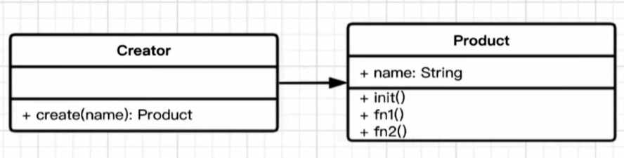

```js
class Product {
  constructor (name) {
    this.name = name;
  }
  init() {
    console.log(`${this.name} init`)
  }
}

class Creator {
  create(name) {
    return new Product(name) //工厂模式精髓
  }
}

let creator = new Creator();
let p = creator.create('p1')
p.init()
```

### 场景

- JQuery - $( 'div' )
- React.createElement
- vue异步组件

### 设计原则验证

- 构造函数与创建者分离:white_check_mark:
- 符合开放封闭原则:white_check_mark:

## 单例模式

### 介绍

- 系统中被**唯一**使用
- **一个类只有一个实例**

**UML类图**

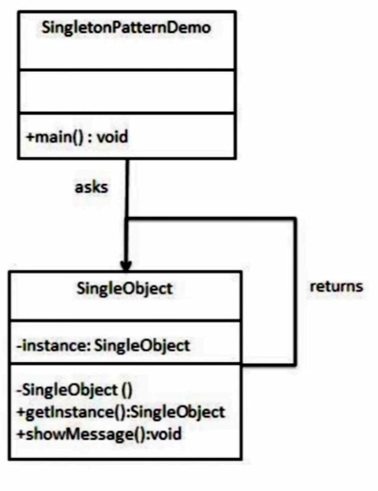

```js
class SingleObject {
  login() {
    console.log('login....')
  }
}
SingleObject.getInstance = (function () {
  //利用了闭包
  let instance
  return function () {
    if (!instance) {
      instance = new SingleObject()
    }
    return instance
  }
})()

let obj1 = SingleObject.getInstance()
obj1.login()
let obj2 = SingleObject.getInstance()
obj2.login()
//单例模式所讲就是每次获取都是唯一的那一个
console.log('obj1是否强相等于obj2 ==>',obj1 === obj2)

let obj3 = new SingleObject()//无法完全控制别人按照文档规范来创建对象
obj3.login()
//此时就不强相等了
console.log('obj1是否强相等于obj2 ==>',obj1 === obj3)
```

### 场景

- 购物车（和登录框类似）
- vuex 和 redux 中的store

### 设计原则验证

- 符合单一职责原则，只实例化唯一的对象
- 没法具体开放封闭原则，但是绝对不违反开放封闭原则

## 适配器模式

### 介绍

- 旧接口格式和使用者不兼容
- 中间加一个适配转换接口

**UML类图**

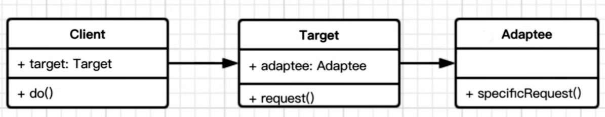

```js
class Adaptee {
  specificRequest() {
    return '德国插头'
  }
}

class Target {
  constructor () {
    this.adaptee = new Adaptee()
  }
  request() {
    let info = this.adaptee.specificRequest()
    return `${info} - 转换器 - 中国插头`
  }
}

let target = new Target()
console.log(target.request())
```

### 场景

- 封装旧接口
- vue computed

### 设计原则验证

- 讲旧接口和使用者进行分离
- 符合开放封闭原则

## 装饰器模式(给手机加上手机壳)

### 介绍

- 为对象**添加新功能**
- 不改变其原有的结构和功能

**UML类图**

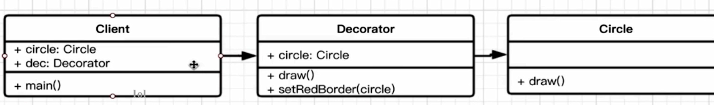

```js
class Circle {
  draw() {
    console.log('画一个圆形')
  }
}

class Decorator {
  constructor(circle) {
    this.circle = circle
  }
  draw() {
    this.circle.draw()
    this.setRedBorder(circle)
  }
  setRedBorder(circle){
    console.log('设置红色边框')
  }
}
let circle = new Circle()
circle.draw()
let dec = new Decorator(circle)
dec.draw()
```

### 场景

- ES7 装饰器
- 装饰类和方法
- core-decorators

### 设计原则验证

- 将现有对象和装饰器进行分离，两者独立
- 符合开放封闭原则

## 代理者模式

- 使用者**无权**访问目标对象
- 中间加代理，通过代理做授权和控制

**UML类图**

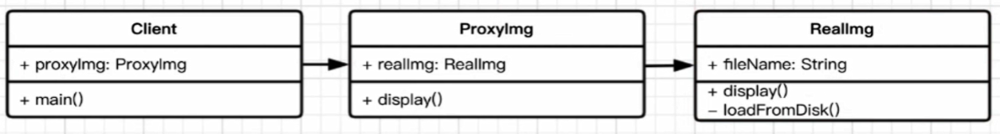

```js
//明星经纪人例子
// 明星
let star = {
    name: '张XX',
    age: 25,
    phone: '13910733521'
}

// 经纪人
let agent = new Proxy(star, {
    get: function (target, key) {
        if (key === 'phone') {
            // 返回经纪人自己的手机号
            return '18611112222'
        }
        if (key === 'price') {
            // 明星不报价，经纪人报价
            return 120000
        }
        return target[key]
    },
    set: function (target, key, val) {
        if (key === 'customPrice') {
            if (val < 100000) {
                // 最低 10w
                throw new Error('价格太低')
            } else {
                target[key] = val
                return true
            }
        }
    }
})

// 主办方
console.log(agent.name)
console.log(agent.age)
console.log(agent.phone)
console.log(agent.price)

// 想自己提供报价（砍价，或者高价争抢）
agent.customPrice = 150000
// agent.customPrice = 90000  // 报错：价格太低
console.log('customPrice', agent.customPrice)
```

### 场景

- 网页事件代理
- jQuery $.proxy
- ES6 Proxy

### 设计模式验证

- 代理类和目标类分离，隔离开目标类和使用者
- 符合开放封闭原则

::: tip 代理模式 VS 适配器模式

- 适配器模式：提供一个**不同**的接口（如不同版本的插头）
- 代理模式：提供**一摸一样**的接口

:::

::: tip 代理模式 VS 装饰器模式

- 装配器模式：**扩展功能**，原有功能不变且可直接使用
- 代理模式：**显示原有功能**，但是经过限制或阉割

:::

## 外观模式

### 介绍

- 为子系统中的一组接口提供了一个高层接口
- 使用者使用这个高层接口

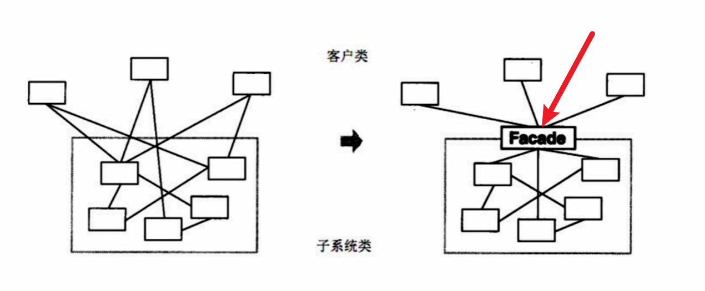

**UML类图**

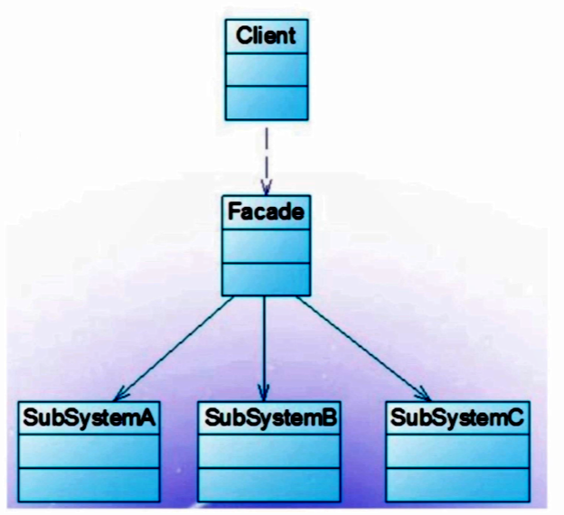

### 设计原则验证

- 不符合单一职责原则和开放封闭原则，因为谨慎使用，不可滥用

## 观察者模式:star:

### 介绍

- **发布** & **订阅**
- 一对多

**UML类图**

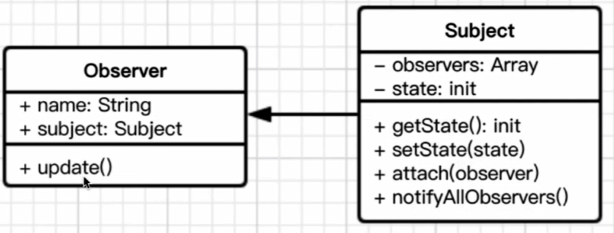

```js
//主题 保存状态，状态变化之后触发所有观察者对象
class Subject {
  constructor() {
    this.state = 0
    this.observers = []
  }
  getState() {
    return this.state
  }
  setState(state) {
    this.state = state
    this.notifyAllObservers()
  }
  notifyAllObservers() {
    this.observers.forEach(observer => {
      observer.update()
    })
  }
  attach(observer) {
    this.observers.push(observer)
  }
}

//观察者
class Observer {
  constructor(name, subject) {
    this.name = name
    this.subject = subject
    this.subject.attach(this)
  }
  update() {
    console.log(`${this.name} update,state :${this.subject.getState()}`)
  }
}

let s = new Subject()
let o1 = new Observer('01',s)
let o2 = new Observer('02',s)
let o3 = new Observer('03',s)

s.setState(1)
s.setState(2)
s.setState(3)
```

### 场景

- 网页事件绑定
- Promise
- jQuery callbacks
- node 自定义事件（Event事件）
- nodejs 中：处理HTTP请求；多进程通讯
- vue 和 React 组件生命周期触发
- vue watch

### 设计原则验证

- 主题和观察者分离，不是主动触发而是被动监听，两者解耦
-  符合开放封闭原则

## 迭代器模式

### 介绍

- **顺序**访问一个集合
- 使用者无需知道集合的内部结构（封装）

**UML类图**

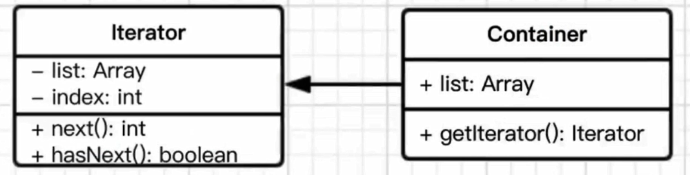

```js
class Iterator {
    constructor(conatiner) {
        this.list = conatiner.list
        this.index = 0
    }
    next() {
        if (this.hasNext()) {
            return this.list[this.index++]
        }
        return null
    }
    hasNext() {
        if (this.index >= this.list.length) {
            return false
        }
        return true
    }
}

class Container {
    constructor(list) {
        this.list = list
    }
    getIterator() {
        return new Iterator(this)
    }
}

// 测试代码
let container = new Container([1, 2, 3, 4, 5])
let iterator = container.getIterator()
while(iterator.hasNext()) {
    console.log(iterator.next())
}
```

### 场景

- jQuery each
- ES6 Iterator

### 设计原则验证

- 迭代器对象和目标对象分离
- 迭代器将使用者与目标对象隔离开
- 符合开放封闭原则

## 状态模式

- 一个对象有状态变化
- 每次状态变化都会触发一个逻辑
- 不能总是用 if...else 来控制

**UML类图**

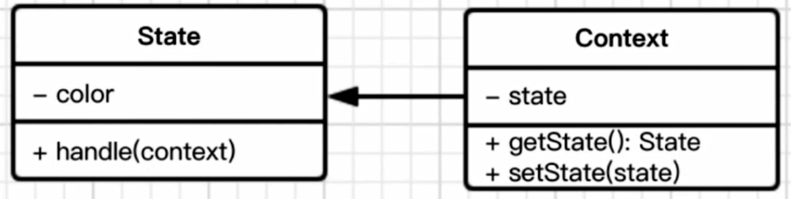

```js
class State {
    constructor(color) {
        this.color = color
    }
    handle(context) {
        console.log(`turn to ${this.color} light`)
        context.setState(this)
    }
}

class Context {
    constructor() {
        this.state = null
    }
    setState(state) {
        this.state = state
    }
    getState() {
        return this.state
    }
}

// 测试代码
let context = new Context()

let greed = new State('greed')
let yellow = new State('yellow')
let red = new State('red')

// 绿灯亮了
greed.handle(context)
console.log(context.getState())
// 黄灯亮了
yellow.handle(context)
console.log(context.getState())
// 红灯亮了
red.handle(context)
console.log(context.getState())
```

### 场景

- 有限状态机
- 一个简单的Promise

### 设计原则验证

- 将状态对象和主题对象分离，状态的变化逻辑单独处理
- 符合开放封闭原则

## 其他设计模式

### 原型模式

- clone 自己，生成一个新对象
- java 默认有clone接口，不用自己实现
- JS中的应用 - Object.create( )

### 桥接模式

- 用于把抽象化与实现化解耦
- 使得两者可以独立变化
- 抽象和实现分离，解耦
- 符合开放封闭原则

### 组合模式

- 生成树形模式，表示 “整体-部分”关系
- 让整体和部分都具有一致的操作方式，数据结构也保持一致
- 将整体和单一节点的操作抽象出来
- 符合开放封闭原则

### 享元模式

- 共享内存（主要考虑内存，而非效率）
- 相同的数据，共享使用
- 将相同的部分抽象出来
- 符合开放封闭原则

### 策略模式

- 不同策略分开处理
- 避免出现大量的 if...else 或者 switch...case
- 符合开放封闭原则

### 模板方法模式

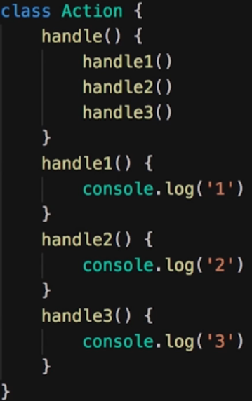

### 职责链模式

- 一步操作可能分为多个职责角色来完成
- 把这些角色都分开，然后用一个链串起来
- 将发起者和各个处理者进行隔离
- JS中的链式操作
- 符合开放封闭原则

### 命令模式

- 执行命令时，发布者和执行者分开
- 中间加入命令对象，作为中转站
- 符合开放封闭原则

### 备忘录模式

- 随时记录一个对象的状态变化
- 随时可以恢复之前的某个状态（如撤销功能）
- 状态对象于使用者分开，解耦
- 符合开放封闭原则

### 中介模式

- 各关联对象通过中介者隔离
- 符合开放封闭原则