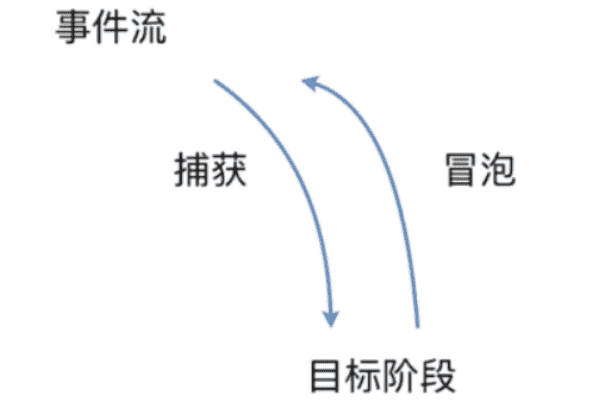
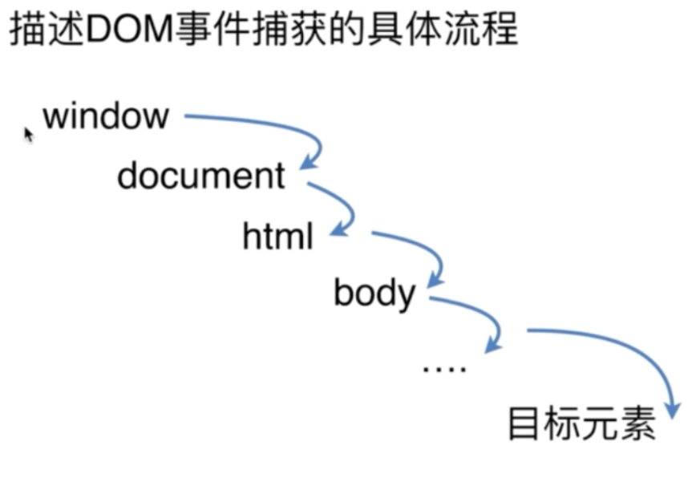
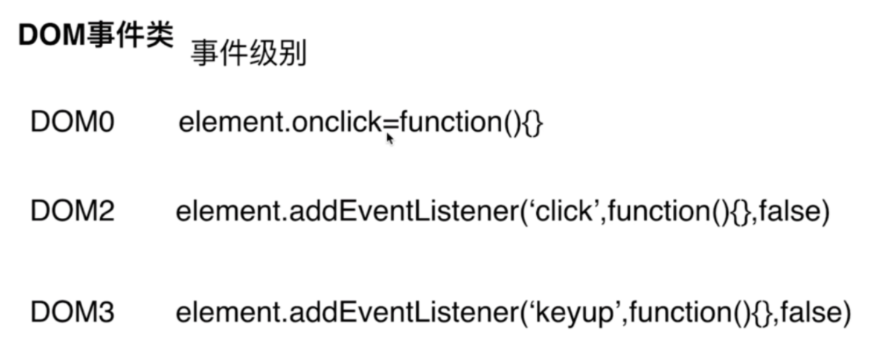
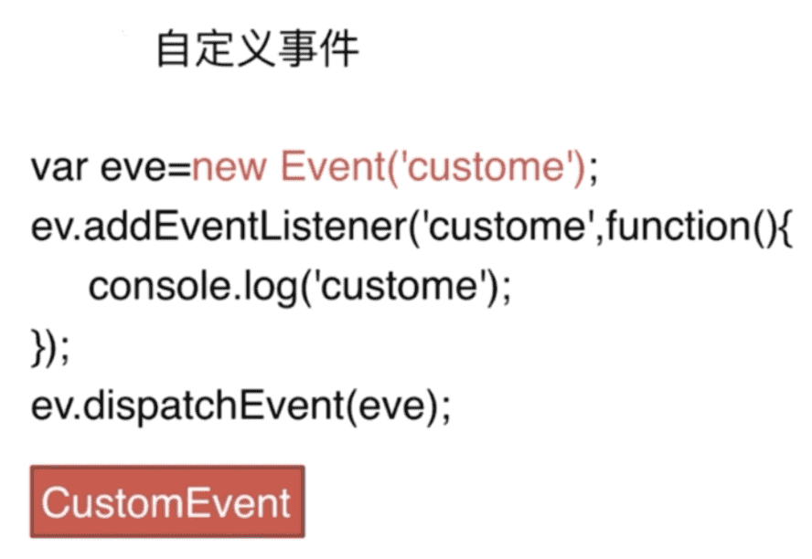
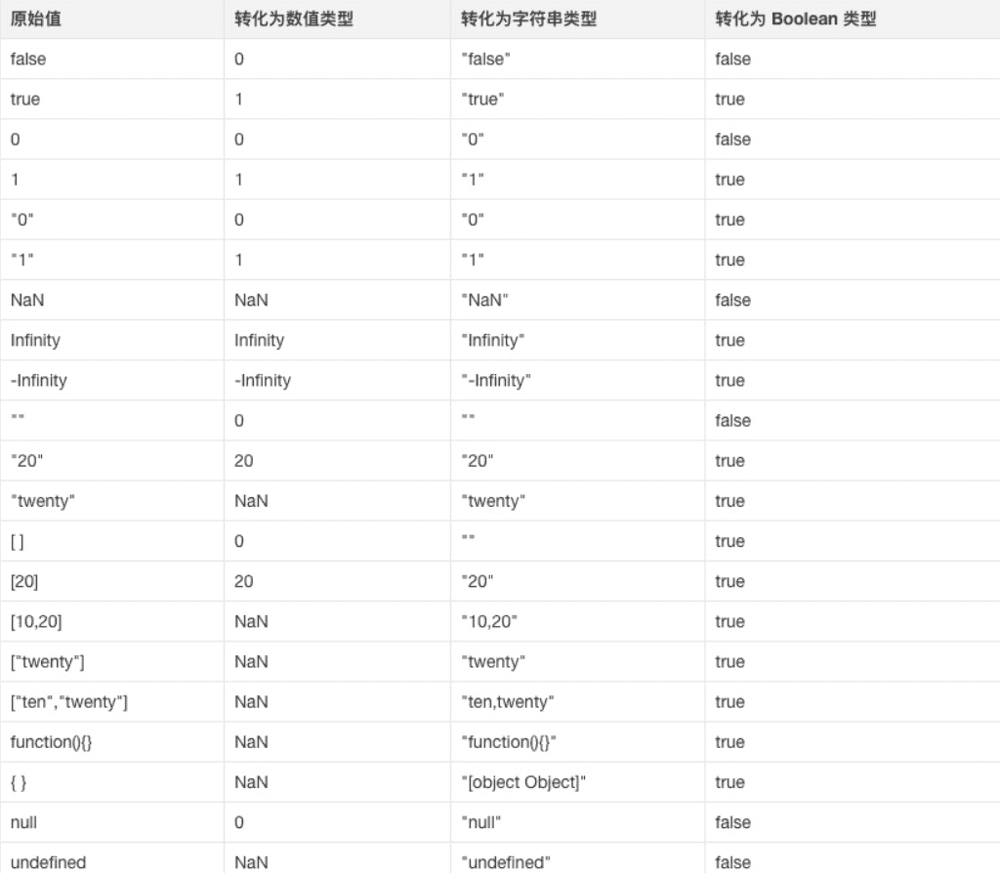

## DOM事件流

DOM事件流讲的就是：浏览器在于当前页面做交互时，这个事件是怎么传递到页面上的。

类似于Android里面的事件传递。

完整的事件流，分三个阶段：

- （1）捕获：从 window 对象传到 目标元素。
- （2）目标阶段：事件通过捕获，到达目标元素，这个阶段就是目标阶段。
- （3）冒泡：从**目标元素**传到 Window 对象。









事件捕获：是一种自顶向下的事件类型，从DOM层次的顶端沿着子节点依次向下延伸，直到目标节点。

事件冒泡：和事件捕获正好相反，从目标节点开始沿着父节点逐层向上传播。

W3C中阻止事件默认行为：**e.preventDefault()**方法，阻止事件冒泡：**e.stopPropogation()**方法，阻止元素的同类型事件：**e.stopImmediatePropagation()**

IE中，阻止事件默认行为：event.returnValue=false ,阻止事件冒泡：event.cancelBubble=true

## 事件委托

简介：事件委托指的是，不在事件的发生地（直接dom）上设置监听函数，而是在其父元素上设置监听函数，通过事件冒泡，父元素可以监听到子元素上事件的触发，通过判断事件发生元素DOM的类型，来做出不同的响应。

举例：最经典的就是ul和li标签的事件监听，比如我们在添加事件时候，采用事件委托机制，不会在li标签上直接添加，而是在ul父元素上添加。

好处：比较合适动态元素的绑定，新添加的子元素也会有监听函数，也可以有事件触发机制。

### **event.currentTarget和event.target**

<https://www.cnblogs.com/yzhihao/p/9398917.html>

## mouseover和mouseenter的区别

mouseover：当鼠标移入元素或其子元素都会触发事件，所以有一个重复触发:yum:，**冒泡**的过程。对应的移除事件是mouseout

mouseenter：当鼠标移除元素本身（不包含元素的子元素）会触发事件，也就是不会冒泡，对应的移除事件是mouseleave

<https://www.w3school.com.cn/tiy/t.asp?f=jquery_event_mouseenter_mouseover>

## js的各种位置，比如clientHeight,scrollHeight,offsetHeight ,以及scrollTop, offsetTop,clientTop的区别？

clientHeight：表示的是可视区域的高度，不包含border和滚动条

offsetHeight：表示可视区域的高度，包含了border和滚动条

scrollHeight：表示了所有区域的高度，包含了因为滚动被隐藏的部分。

clientTop：表示边框border的厚度，在未指定的情况下一般为0

scrollTop：滚动后被隐藏的高度，获取对象相对于由offsetParent属性指定的父坐标(css定位的元素或body元素)距离顶端的高度。


scrollHeight: 获取对象的滚动高度。 

scrollWidth:获取对象的滚动宽度 。

scrollLeft:设置或获取位于对象左边界和窗口中目前可见内容的最左端之间的距离 

scrollTop:设置或获取位于对象最顶端和窗口中可见内容的最顶端之间的距离 

offsetHeight:获取对象相对于版面或由父坐标 offsetParent 属性指定的父坐标的高度 

offsetLeft:获取对象相对于版面或由 offsetParent 属性指定的父坐标的计算左侧位置 

offsetTop:获取对象相对于版面或由 offsetTop 属性指定的父坐标的计算顶端位置 

event.clientX 相对文档的水平座标 

event.clientY 相对文档的垂直座标 

event.offsetX 相对容器的水平坐标 

event.offsetY 相对容器的垂直坐标 

document.documentElement.scrollTop 垂直方向滚动的值 

event.clientX+document.documentElement.scrollTop 相对文档的水平座标+垂直方向滚动的量

这里是JavaScript中建造迁移转变代码的常用属性

网页可见区域宽： document.body.clientWidth;

网页可见区域高： document.body.clientHeight;

网页可见区域宽： document.body.offsetWidth   （包含边线的宽）;

网页可见区域高： document.body.offsetHeight （包含边线的宽）;

网页正文全文宽： document.body.scrollWidth;

网页正文全文高： document.body.scrollHeight;

网页被卷去的高： document.body.scrollTop;

网页被卷去的左： document.body.scrollLeft;

网页正文项目组上： window.screenTop;

网页正文项目组左： window.screenLeft;

屏幕辨别率的高： window.screen.height;

屏幕辨别率的宽： window.screen.width;

屏幕可用工作区高度： window.screen.availHeight;


## JS中的垃圾回收机制

必要性：由于字符串、对象和数组没有固定大小，所有当他们的大小已知时，才能对他们进行动态的存储分配。JavaScript程序每次创建字符串、数组或对象时，解释器都必须分配内存来存储那个实体。只要像这样动态地分配了内存，最终都要释放这些内存以便他们能够被再用，否则，JavaScript的解释器将会消耗完系统中所有可用的内存，造成系统崩溃。

这段话解释了为什么需要系统需要垃圾回收，JS不像C/C++，他有自己的一套垃圾回收机制（Garbage Collection）。JavaScript的解释器可以检测到何时程序不再使用一个对象了，当他确定了一个对象是无用的时候，他就知道不再需要这个对象，可以把它所占用的内存释放掉了。例如：

```js
var a="hello world";
var b="world";
var a=b;
```

//这时，会释放掉"hello world"，释放内存以便再引用

垃圾回收的方法：标记清除、计数引用。

标记清除

这是最常见的垃圾回收方式，当变量进入环境时，就标记这个变量为”进入环境“,从逻辑上讲，永远不能释放进入环境的变量所占的内存，永远不能释放进入环境变量所占用的内存，只要执行流程进入相应的环境，就可能用到他们。当离开环境时，就标记为离开环境。

垃圾回收器在运行的时候会给存储在内存中的变量都加上标记（所有都加），然后去掉环境变量中的变量，以及被环境变量中的变量所引用的变量（条件性去除标记），删除所有被标记的变量，删除的变量无法在环境变量中被访问所以会被删除，最后垃圾回收器，完成了内存的清除工作，并回收他们所占用的内存。

引用计数法

另一种不太常见的方法就是引用计数法，引用计数法的意思就是每个值没引用的次数，当声明了一个变量，并用一个引用类型的值赋值给改变量，则这个值的引用次数为1,；相反的，如果包含了对这个值引用的变量又取得了另外一个值，则原先的引用值引用次数就减1，当这个值的引用次数为0的时候，说明没有办法再访问这个值了，因此就把所占的内存给回收进来，这样垃圾收集器再次运行的时候，就会释放引用次数为0的这些值。

用引用计数法会存在内存泄露，下面来看原因：

```js
function problem() {
	var objA = new Object();
	var objB = new Object();
	objA.someOtherObject = objB;
	objB.anotherObject = objA;
}
```

在这个例子里面，objA和objB通过各自的属性相互引用，这样的话，两个对象的引用次数都为2，在采用引用计数的策略中，由于函数执行之后，这两个对象都离开了作用域，函数执行完成之后，因为计数不为0，这样的相互引用如果大量存在就会导致内存泄露。

特别是在DOM对象中，也容易存在这种问题：

```js
var element=document.getElementById（’‘）；
var myObj=new Object();
myObj.element=element;
element.someObject=myObj;
```

这样就不会有垃圾回收的过程。

## setTimeout、setInterval和requestAnimationFrame之间的区别

这里有一篇文章讲的是requestAnimationFrame：<http://www.cnblogs.com/xiaohuochai/p/5777186.html>

与setTimeout和setInterval不同，requestAnimationFrame不需要设置时间间隔，

RAF采用的是系统时间间隔，不会因为前面的任务，不会影响RAF，但是如果前面的任务多的话，
会响应setTimeout和setInterval真正运行时的时间间隔。

::: tip 特点：
（1）requestAnimationFrame会把每一帧中的所有DOM操作集中起来，在一次重绘或回流中就完成，并且重绘或回流的时间间隔紧紧跟随浏览器的刷新频率。

（2）在隐藏或不可见的元素中，requestAnimationFrame将不会进行重绘或回流，这当然就意味着更少的CPU、GPU和内存使用量

（3）requestAnimationFrame是由浏览器专门为动画提供的API，在运行时浏览器会自动优化方法的调用，并且如果页面不是激活状态下的话，动画会自动暂停，有效节省了CPU开销。

:::

## 简单实现Node的Events模块

### 参考回答：

简介：观察者模式或者说订阅模式，它定义了对象间的一种一对多的关系，让多个观察者对象同时监听某一个主题对象，当一个对象发生改变时，所有依赖于它的对象都将得到通知。

node中的Events模块就是通过观察者模式来实现的：

```js
var events = require('events');
var eventEmitter = new events.EventEmitter();
eventEmitter.on('say', function (name) {
  console.log('Hello', name);
})
eventEmitter.emit('say', 'Jony yu');
```

这样，eventEmitter发出say事件，通过On接收，并且输出结果，这就是一个订阅模式的实现，下面我们来简单的实现一个Events模块的EventEmitter。

(1)实现简单的Event模块的emit和on方法

```js
function Events() {
  this.on = function (eventName, callBack) {
    if (!this.handles) {
      this.handles = {};
    }
    if (!this.handles[eventName]) {
      this.handles[eventName] = [];
    }
    this.handles[eventName].push(callBack);
  }
  this.emit = function (eventName, obj) {
    if (this.handles[eventName]) {
      for (var i = 0; o < this.handles[eventName].length; i++) {
        this.handles[eventName][i](obj);
      }
    }
  }
  return this;
}
```

这样我们就定义了Events，现在我们可以开始来调用：

```js
var events = new Events();
events.on('say', function (name) {
  console.log('Hello', nama)
});
events.emit('say', 'Jony yu');
```

//结果就是通过emit调用之后，输出了Jony yu

(2)每个对象是独立的

因为是通过new的方式，每次生成的对象都是不相同的，因此：

```js
var event1 = new Events();
var event2 = new Events();
event1.on('say', function () {
  console.log('Jony event1');
});
event2.on('say', function () {
  console.log('Jony event2');
})
event1.emit('say');
event2.emit('say');
```

//event1、event2之间的事件监听互相不影响

//输出结果为'Jony event1' 'Jony event2'

## 类型转换的规则有哪些？

在if语句、逻辑语句、数学运算逻辑、==等情况下都可能出现隐士类型转换。



## JavaScript的参数是按照什么方式传递的？

### 基本类型传递方式

由于js中存在**复杂类型**和**基本类型**,对于**基本类型**而言,是按值传递的.

```javascript
var a = 1;
function test(x) {
  x = 10;
  console.log(x);
}
test(a); // 10
console.log(a); // 1
```

虽然在函数`test`中`a`被修改,并没有有影响到 外部`a`的值,基本类型是按值传递的.

### 复杂类型按引用传递?

我们将外部`a`作为一个对象传入`test`函数.

```javascript
var a = {
  a: 1,
  b: 2
};
function test(x) {
  x.a = 10;
  console.log(x);
}
test(a); // { a: 10, b: 2 }
console.log(a); // { a: 10, b: 2 }
```

可以看到,在函数体内被修改的`a`对象也同时影响到了外部的`a`对象,可见复杂类型是按**引用传递的**.

可是如果再做一个实验:

```javascript
var a = {
  a: 1,
  b: 2
};
function test(x) {
  x = 10;
  console.log(x);
}
test(a); // 10
console.log(a); // { a: 1, b: 2 }
```

外部的`a`并没有被修改,如果是按引用传递的话,由于共享同一个堆内存,`a`在外部也会表现为`10`才对. 此时的复杂类型同时表现出了`按值传递`和`按引用传递`的特性.

### 按共享传递

复杂类型之所以会产生这种特性,原因就是在传递过程中,对象`a`先产生了一个`副本a`,这个`副本a`并不是深克隆得到的`副本a`,`副本a`地址同样指向对象`a`指向的堆内存.

因此在函数体中修改`x=10`只是修改了`副本a`,`a`对象没有变化. 但是如果修改了`x.a=10`是修改了两者指向的同一堆内存,此时对象`a`也会受到影响.

有人讲这种特性叫做**传递引用**,也有一种说法叫做**按共享传递**.