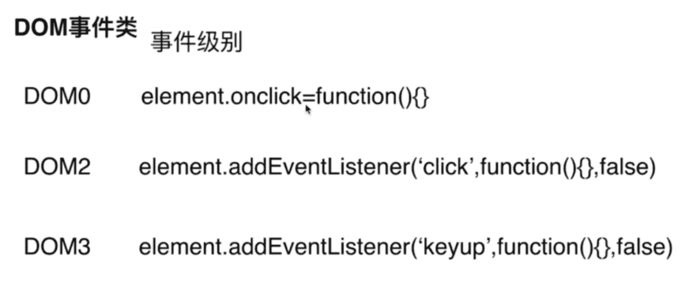

## DOM事件流

DOM事件流讲的就是：浏览器在于当前页面做交互时，这个事件是怎么传递到页面上的。

类似于Android里面的事件传递。

完整的事件流，分三个阶段：

- （1）捕获：从 window 对象传到 目标元素。
- （2）目标阶段：事件通过捕获，到达目标元素，这个阶段就是目标阶段。
- （3）冒泡：从**目标元素**传到 Window 对象。





事件捕获：是一种自顶向下的事件类型，从DOM层次的顶端沿着子节点依次向下延伸，直到目标节点。

事件冒泡：和事件捕获正好相反，从目标节点开始沿着父节点逐层向上传播。

W3C中阻止事件默认行为：**e.preventDefault()**方法，阻止事件冒泡：**e.stopPropogation()**方法，阻止元素的同类型事件：**e.stopImmediatePropagation()**

IE中，阻止事件默认行为：event.returnValue=false ,阻止事件冒泡：event.cancelBubble=true

## 事件委托

简介：事件委托指的是，不在事件的发生地（直接dom）上设置监听函数，而是在其父元素上设置监听函数，通过事件冒泡，父元素可以监听到子元素上事件的触发，通过判断事件发生元素DOM的类型，来做出不同的响应。

举例：最经典的就是ul和li标签的事件监听，比如我们在添加事件时候，采用事件委托机制，不会在li标签上直接添加，而是在ul父元素上添加。

好处：比较合适动态元素的绑定，新添加的子元素也会有监听函数，也可以有事件触发机制。

### **event.currentTarget和event.target**

<https://www.cnblogs.com/yzhihao/p/9398917.html>

## mouseover和mouseenter的区别

mouseover：当鼠标移入元素或其子元素都会触发事件，所以有一个重复触发:yum:，**冒泡**的过程。对应的移除事件是mouseout

mouseenter：当鼠标移除元素本身（不包含元素的子元素）会触发事件，也就是不会冒泡，对应的移除事件是mouseleave

<https://www.w3school.com.cn/tiy/t.asp?f=jquery_event_mouseenter_mouseover>

## js的各种位置，比如clientHeight,scrollHeight,offsetHeight ,以及scrollTop, offsetTop,clientTop的区别？

clientHeight：表示的是可视区域的高度，不包含border和滚动条

offsetHeight：表示可视区域的高度，包含了border和滚动条

scrollHeight：表示了所有区域的高度，包含了因为滚动被隐藏的部分。

clientTop：表示边框border的厚度，在未指定的情况下一般为0

scrollTop：滚动后被隐藏的高度，获取对象相对于由offsetParent属性指定的父坐标(css定位的元素或body元素)距离顶端的高度。


scrollHeight: 获取对象的滚动高度。 

scrollWidth:获取对象的滚动宽度 。

scrollLeft:设置或获取位于对象左边界和窗口中目前可见内容的最左端之间的距离 

scrollTop:设置或获取位于对象最顶端和窗口中可见内容的最顶端之间的距离 

offsetHeight:获取对象相对于版面或由父坐标 offsetParent 属性指定的父坐标的高度 

offsetLeft:获取对象相对于版面或由 offsetParent 属性指定的父坐标的计算左侧位置 

offsetTop:获取对象相对于版面或由 offsetTop 属性指定的父坐标的计算顶端位置 

event.clientX 相对文档的水平座标 

event.clientY 相对文档的垂直座标 

event.offsetX 相对容器的水平坐标 

event.offsetY 相对容器的垂直坐标 

document.documentElement.scrollTop 垂直方向滚动的值 

event.clientX+document.documentElement.scrollTop 相对文档的水平座标+垂直方向滚动的量

这里是JavaScript中建造迁移转变代码的常用属性

网页可见区域宽： document.body.clientWidth;

网页可见区域高： document.body.clientHeight;

网页可见区域宽： document.body.offsetWidth   （包含边线的宽）;

网页可见区域高： document.body.offsetHeight （包含边线的宽）;

网页正文全文宽： document.body.scrollWidth;

网页正文全文高： document.body.scrollHeight;

网页被卷去的高： document.body.scrollTop;

网页被卷去的左： document.body.scrollLeft;

网页正文项目组上： window.screenTop;

网页正文项目组左： window.screenLeft;

屏幕辨别率的高： window.screen.height;

屏幕辨别率的宽： window.screen.width;

屏幕可用工作区高度： window.screen.availHeight;


## JS中的垃圾回收机制

必要性：由于字符串、对象和数组没有固定大小，所有当他们的大小已知时，才能对他们进行动态的存储分配。JavaScript程序每次创建字符串、数组或对象时，解释器都必须分配内存来存储那个实体。只要像这样动态地分配了内存，最终都要释放这些内存以便他们能够被再用，否则，JavaScript的解释器将会消耗完系统中所有可用的内存，造成系统崩溃。

这段话解释了为什么需要系统需要垃圾回收，JS不像C/C++，他有自己的一套垃圾回收机制（Garbage Collection）。JavaScript的解释器可以检测到何时程序不再使用一个对象了，当他确定了一个对象是无用的时候，他就知道不再需要这个对象，可以把它所占用的内存释放掉了。例如：

```js
var a="hello world";
var b="world";
var a=b;
```

//这时，会释放掉"hello world"，释放内存以便再引用

垃圾回收的方法：标记清除、计数引用。

标记清除

这是最常见的垃圾回收方式，当变量进入环境时，就标记这个变量为”进入环境“,从逻辑上讲，永远不能释放进入环境的变量所占的内存，永远不能释放进入环境变量所占用的内存，只要执行流程进入相应的环境，就可能用到他们。当离开环境时，就标记为离开环境。

垃圾回收器在运行的时候会给存储在内存中的变量都加上标记（所有都加），然后去掉环境变量中的变量，以及被环境变量中的变量所引用的变量（条件性去除标记），删除所有被标记的变量，删除的变量无法在环境变量中被访问所以会被删除，最后垃圾回收器，完成了内存的清除工作，并回收他们所占用的内存。

引用计数法

另一种不太常见的方法就是引用计数法，引用计数法的意思就是每个值没引用的次数，当声明了一个变量，并用一个引用类型的值赋值给改变量，则这个值的引用次数为1,；相反的，如果包含了对这个值引用的变量又取得了另外一个值，则原先的引用值引用次数就减1，当这个值的引用次数为0的时候，说明没有办法再访问这个值了，因此就把所占的内存给回收进来，这样垃圾收集器再次运行的时候，就会释放引用次数为0的这些值。

用引用计数法会存在内存泄露，下面来看原因：

```js
function problem() {
	var objA = new Object();
	var objB = new Object();
	objA.someOtherObject = objB;
	objB.anotherObject = objA;
}
```

在这个例子里面，objA和objB通过各自的属性相互引用，这样的话，两个对象的引用次数都为2，在采用引用计数的策略中，由于函数执行之后，这两个对象都离开了作用域，函数执行完成之后，因为计数不为0，这样的相互引用如果大量存在就会导致内存泄露。

特别是在DOM对象中，也容易存在这种问题：

```js
var element=document.getElementById（’‘）；
var myObj=new Object();
myObj.element=element;
element.someObject=myObj;
```

这样就不会有垃圾回收的过程。