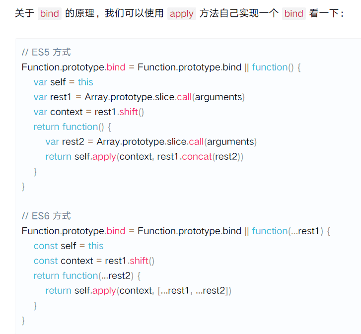
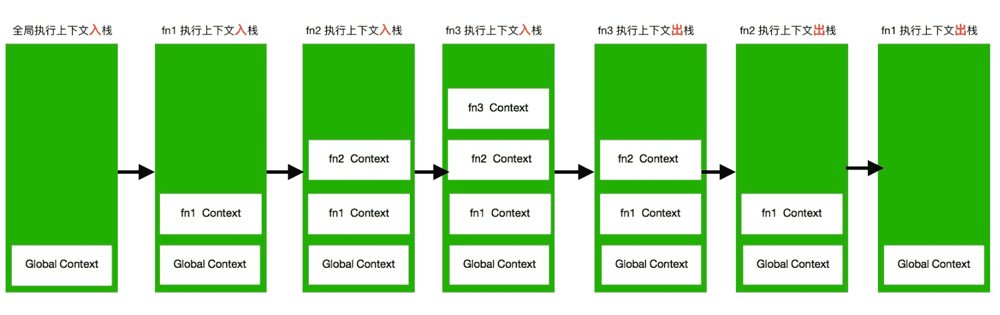

## 1.浏览器控制台上会打印什么？

```js
var a = 10;
function foo() {
    console.log(a); // ??
    var a = 20;
}
foo();
```

#### 问题1： `undefined`

#### 解析：

使用`var`关键字声明的变量在JavaScript中会被提升，并在内存中分配值`undefined`。 但初始化恰发生在你给变量赋值的地方。 另外，`var`声明的变量是[函数作用域的](https://link.juejin.im?target=https%3A%2F%2F2ality.com%2F2011%2F02%2Fjavascript-variable-scoping-and-its.html)，而`let`和`const`是块作用域的。 所以，这就是这个过程的样子：

```js
var a = 10; // 全局使用域
function foo() {
// var a 的声明将被提升到到函数的顶部。
// 比如:var a

console.log(a); // 打印 undefined

// 实际初始化值20只发生在这里
   var a = 20; // local scope
}
```

## 2.如果我们使用 let 或 const 代替 var，输出是否相同

```js
var a = 10;
function foo() {
    console.log(a); // ??
    let a = 20;
}
foo();    
```

#### 问题 2：`ReferenceError：a undefined`。

#### 解析：

`let`和`const`声明可以让变量在其作用域上受限于它所使用的块、语句或表达式。与`var`不同的是，这些变量没有被提升，并且有一个所谓的**暂时死区(TDZ)**。试图访问**TDZ**中的这些变量将引发`ReferenceError`，因为只有在执行到达声明时才能访问它们。

```js
var a = 10; // 全局使用域
function foo() { // TDZ 开始

// 创建了未初始化的'a'
    console.log(a); // ReferenceError

// TDZ结束，'a'仅在此处初始化，值为20
    let a = 20;
}
```

下表概述了与JavaScript中使用的不同关键字声明的变量对应的提升行为和使用域：


## 3.“newArray”中有哪些元素？

```js
var array = [];
for(var i = 0; i <3; i++) {
 array.push(() => i);
}
var newArray = array.map(el => el());
console.log(newArray); // ??   
```

#### 问题 3: `[3, 3, 3]`

#### 解析：

在`for`循环的头部声明带有`var`关键字的变量会为该变量创建单个绑定（存储空间）。 阅读更多关于[闭包](https://link.juejin.im?target=http%3A%2F%2Fdmitrysoshnikov.com%2Fecmascript%2Fchapter-6-closures%2F)的信息。 让我们再看一次for循环。

```js
// 误解作用域:认为存在块级作用域
var array = [];
for (var i = 0; i < 3; i++) {
  // 三个箭头函数体中的每个`'i'`都指向相同的绑定，
  // 这就是为什么它们在循环结束时返回相同的值'3'。
  array.push(() => i);
}
var newArray = array.map(el => el());
console.log(newArray); // [3, 3, 3]
```

如果使用 `let` 声明一个具有块级作用域的变量，则为每个循环迭代创建一个新的绑定。

```js
// 使用ES6块级作用域
var array = [];
for (let i = 0; i < 3; i++) {
  // 这一次，每个'i'指的是一个新的的绑定，并保留当前的值。
 // 因此，每个箭头函数返回一个不同的值。
  array.push(() => i);
}
var newArray = array.map(el => el());
console.log(newArray); // [0, 1, 2]
```

解决这个问题的另一种方法是使用[闭包](https://link.juejin.im?target=http%3A%2F%2Fdmitrysoshnikov.com%2Fecmascript%2Fchapter-6-closures%2F)。

```js
let array = [];
for (var i = 0; i < 3; i++) {

  array[i] = (function(x) {
    return function() {
      return x;
    };
  })(i);
}
const newArray = array.map(el => el());
console.log(newArray); // [0, 1, 2]  
```

## 4.如果我们在浏览器控制台中运行'foo'函数，是否会导致堆栈溢出错误？

```js
function foo() {
  setTimeout(foo, 0); // 是否存在堆栈溢出错误?
};    
```

#### 问题4 : 不会溢出

#### 解析：

JavaScript并发模型基于“事件循环”。 当我们说“浏览器是 JS 的家”时我真正的意思是浏览器提供运行时环境来执行我们的JS代码。

浏览器的主要组件包括**调用堆栈**，**事件循环****，任务队列**和**Web API**。 像`setTimeout`，`setInterval`和`Promise`这样的全局函数不是JavaScript的一部分，而是 Web API 的一部分。 JavaScript 环境的可视化形式如下所示：


JS调用栈是后进先出(LIFO)的。引擎每次从堆栈中取出一个函数，然后从上到下依次运行代码。每当它遇到一些异步代码，如`setTimeout`，它就把它交给`Web API`(箭头1)。因此，每当事件被触发时，`callback` 都会被发送到任务队列（箭头2）。

**事件循环(Event loop)不断地监视任务队列(Task Queue)，并按它们排队的顺序一次处理一个回调。每当调用堆栈(call stack)为空时，Event loop获取回调并将其放入堆栈(stack )**(箭头3)中进行处理。请记住，如果调用堆栈不是空的，**则事件循环不会将任何回调推入堆栈**。

现在，有了这些知识，让我们来回答前面提到的问题：

### 步骤

1. 调用 `foo()`会将`foo`函数放入**调用堆栈(call stack)**。
2. 在处理内部代码时，JS引擎遇到`setTimeout`。
3. 然后将`foo`回调函数传递给**WebAPIs**(箭头1)并从函数返回，调用堆栈再次为空
4. 计时器被设置为0，因此`foo`将被发送到**任务队列**(箭头2)。
5. 由于调用堆栈是空的，事件循环将选择`foo`回调并将其推入调用堆栈进行处理。
6. 进程再次重复，堆栈不会溢出。

运行示意图如下所示：


## 5.如果在控制台中运行以下函数，页面(选项卡)的 UI 是否仍然响应

```js
function foo() {
  return Promise.resolve().then(foo);
};
```

#### 问题5 : 不会响应

#### 解析：

大多数时候，开发人员假设在**事件循环图中只有一个任务队列。但事实并非如此，我们可以有多个任务队列。由浏览器选择其中的一个队列并在该队列中处理回调**。

在底层来看，JavaScript中有宏任务和微任务。`setTimeout`回调是**宏任务**，而`Promise`回调是**微任务**。

主要的区别在于他们的执行方式。宏任务在单个循环周期中一次一个地推入堆栈，但是微任务队列总是在执行后返回到事件循环之前清空。因此，如果你以处理条目的速度向这个队列添加条目，那么你就永远在处理微任务。只有当微任务队列为空时，事件循环才会重新渲染页面、

现在，当你在控制台中运行以下代码段

```js
function foo() {
  return Promise.resolve().then(foo);
};
```

每次调用'`foo`'都会继续在微任务队列上添加另一个'`foo`'回调，因此事件循环无法继续处理其他事件（滚动，单击等），直到该队列完全清空为止。 因此，它会阻止渲染。

## 6.我们能否以某种方式为下面的语句使用展开运算而不导致类型错误

```js
var obj = { x: 1, y: 2, z: 3 };
[...obj]; // TypeError 
```

#### 问题6 : 会导致TypeError错误

#### 解析：

[展开语法](https://link.juejin.im?target=https%3A%2F%2Fdeveloper.mozilla.org%2Fen-US%2Fdocs%2FWeb%2FJavaScript%2FReference%2FOperators%2FSpread_syntax) 和 [for-of](https://link.juejin.im?target=https%3A%2F%2Fdeveloper.mozilla.org%2Fen-US%2Fdocs%2FWeb%2FJavaScript%2FReference%2FStatements%2Ffor...of) 语句遍历`iterable`对象定义要遍历的数据。`Array` 或`Map` 是具有默认迭代行为的内置迭代器。对象不是可迭代的，但是可以通过使用[iterable](https://link.juejin.im?target=https%3A%2F%2Fdeveloper.mozilla.org%2Fen-US%2Fdocs%2FWeb%2FJavaScript%2FReference%2FIteration_protocols%23The_iterable_protocol)和[iterator](https://link.juejin.im?target=https%3A%2F%2Fdeveloper.mozilla.org%2Fen-US%2Fdocs%2FWeb%2FJavaScript%2FReference%2FIteration_protocols%23The_iterator_protocol)协议使它们可迭代。

在**Mozilla**文档中，如果一个对象实现了`@@iterator`方法，那么它就是可迭代的，这意味着这个对象(或者它原型链上的一个对象)必须有一个带有`@@iterator`键的属性，这个键可以通过常量`Symbol.iterator`获得。

上述语句可能看起来有点冗长，但是下面的示例将更有意义：

```js
var obj = { x: 1, y: 2, z: 3 };
obj[Symbol.iterator] = function() {
  
  // iterator 是一个具有 next 方法的对象，
  // 它的返回至少有一个对象
  // 两个属性：value＆done。

  // 返回一个 iterator 对象
  return {
    next: function() {
      if (this._countDown === 3) {
        const lastValue = this._countDown;
        return { value: this._countDown, done: true };
      }
      this._countDown = this._countDown + 1;
      return { value: this._countDown, done: false };
    },
    _countDown: 0
  };
};
[...obj]; // 打印 [1, 2, 3]
```

还可以使用 [generator](https://link.juejin.im?target=https%3A%2F%2Fdeveloper.mozilla.org%2Fen-US%2Fdocs%2FWeb%2FJavaScript%2FReference%2FStatements%2Ffunction*) 函数来定制对象的迭代行为：

```js
var obj = {x:1, y:2, z: 3}
obj[Symbol.iterator] = function*() {
  yield 1;
  yield 2;
  yield 3;
}
[...obj]; // 打印 [1, 2, 3]
```

## 7.运行以下代码片段时，控制台上会打印什么？

```js
var obj = { a: 1, b: 2 };
Object.setPrototypeOf(obj, {c: 3});
Object.defineProperty(obj, 'd', { value: 4, enumerable: false });

// what properties will be printed when we run the for-in loop?
for(let prop in obj) {
    console.log(prop);
}  
```

#### 问题7 : a, b, c

#### 解析：

`for-in`循环遍历对象本身的[可枚举属性](https://link.juejin.im?target=https%3A%2F%2Fdeveloper.mozilla.org%2Fen-US%2Fdocs%2FWeb%2FJavaScript%2FEnumerability_and_ownership_of_properties)以及对象从其原型继承的属性。 可枚举属性是可以在`for-in`循环期间包含和访问的属性。

```js
var obj = { a: 1, b: 2 };
var descriptor = Object.getOwnPropertyDescriptor(obj, "a");
console.log(descriptor.enumerable); // true
console.log(descriptor);
// { value: 1, writable: true, enumerable: true, configurable: true }
```

现在你已经掌握了这些知识，应该很容易理解为什么我们的代码要打印这些特定的属性

```js
var obj = { a: 1, b: 2 }; //a，b 都是 enumerables 属性

// 将{c：3}设置为'obj'的原型，并且我们知道
// for-in 循环也迭代 obj 继承的属性
// 从它的原型，'c'也可以被访问。
Object.setPrototypeOf(obj, { c: 3 });

// 我们在'obj'中定义了另外一个属性'd'，但是 
// 将'enumerable'设置为false。 这意味着'd'将被忽略。
Object.defineProperty(obj, "d", { value: 4, enumerable: false });

for (let prop in obj) {
  console.log(prop);
}
// 打印
// a
// b
// c
```


## 8.xGetter() 会打印什么值？

```js
var x = 10;
var foo = {
  x: 90,
  getX: function() {
    return this.x;
  }
};
foo.getX(); // prints 90
var xGetter = foo.getX;
xGetter(); // prints ??
```

#### 问题8 : 10

#### 解析：

在全局范围内初始化`x`时，它成为window对象的属性(不是严格的模式)。看看下面的代码:

```js
var x = 10; // global scope
var foo = {
  x: 90,
  getX: function() {
    return this.x;
  }
};
foo.getX(); // prints 90
let xGetter = foo.getX;
xGetter(); // prints 10
```

咱们可以断言：

```js
window.x === 10; // true
```

`this` 始终指向调用方法的对象。因此，在`foo.getx()`的例子中，它指向`foo`对象，返回`90`的值。而在`xGetter()`的情况下，`this`指向 window对象, 返回 **window** 中的`x`的值，即`10`。

要获取 `foo.x`的值，可以通过使用`Function.prototype.bind`将`this`的值绑定到`foo`对象来创建新函数。

```js
let getFooX = foo.getX.bind(foo);
getFooX(); // 90
```

作者：前端小智

链接：https://juejin.im/post/5d2d146bf265da1b9163c5c9

来源：掘金著作权归作者所有。

下面的转载自：http://www.codeceo.com/article/25-essential-javascript-interview-questions.html

## 9.:star:下面的代码将输出什么到控制台，为什么？

```js
(function(){
  var a = b = 3;
})();

console.log("a defined? " + (typeof a !== 'undefined'));
console.log("b defined? " + (typeof b !== 'undefined'));
```

由于 `a` 和 `b` 都定义在函数的封闭范围内，并且都始于 `var`关键字，大多数JavaScript开发人员期望 `typeof a` 和 `typeof b` 在上面的例子中都是undefined。

然而，事实并非如此。这里的问题是，大多数开发人员将语句 `var a = b = 3;` 错误地理解为是以下声明的简写：

```js
var b = 3;
var a = b;
```

但事实上，`var a = b = 3;` 实际是以下声明的简写：

```js
b = 3;
var a = b;
```

因此（如果你不使用严格模式的话），该代码段的输出是：

```js
a defined? false
b defined? true
```

但是， `b` 如何才能被定义在封闭函数的范围之外呢？是的，既然语句 `var a = b = 3;` 是语句 `b = 3;` 和 `var a = b;`的简写， `b` 最终成为了一个全局变量（因为它没有前缀 `var` 关键字），因此仍然在范围内甚至封闭函数之外。

需要注意的是，在严格模式下（即使用 [`use strict`](http://www.w3schools.com/js/js_strict.asp)），语句`var a = b = 3;` 将生成`ReferenceError: b is not defined`的运行时错误，从而避免任何否则可能会导致的headfakes /bug。 （还是你为什么应该理所当然地在代码中使用 `use strict` 的最好例子！）

## 10.下面的代码将输出什么到控制台，为什么？

```js
var myObject = {
    foo: "bar",
    func: function() {
        var self = this;
        console.log("outer func:  this.foo = " + this.foo);
        console.log("outer func:  self.foo = " + self.foo);
        (function() {
            console.log("inner func:  this.foo = " + this.foo);
            console.log("inner func:  self.foo = " + self.foo);
        }());
    }
};
myObject.func();
```

上面的代码将输出以下内容到控制台：

```js
outer func:  this.foo = bar
outer func:  self.foo = bar
inner func:  this.foo = undefined
inner func:  self.foo = bar
```

在外部函数中， `this` 和`self` 两者都指向了 `myObject`，因此两者都可以正确地引用和访问 `foo`。

在内部函数中， `this` 不再指向 `myObject`。其结果是，`this.foo` 没有在内部函数中被定义，相反，指向到本地的变量`self` 保持在范围内，并且可以访问。 （在ECMA 5之前，在内部函数中的`this` 将指向全局的 `window` 对象；反之，因为作为ECMA 5，内部函数中的功能`this` 是未定义的。）

## 11.封装JavaScript源文件的全部内容到一个函数块有什么意义及理由？

这是一个越来越普遍的做法，被许多流行的JavaScript库（jQuery，Node.js等）采用。这种技术创建了一个围绕文件全部内容的[闭包](http://www.codeceo.com/article/javascript-bibao.html)，也许是最重要的是，创建了一个私有的命名空间，从而有助于避免不同JavaScript模块和库之间潜在的名称冲突。

这种技术的另一个特点是，允许一个易于引用的（假设更短的）别名用于全局变量。

## 12.:star:在JavaScript源文件的开头包含 `use strict` 有什么意义和好处？

对于这个问题，既简要又最重要的答案是，`use strict` 是一种在**JavaScript代码运行时自动实行更严格解析和错误处理**的方法。那些被忽略或默默失败了的代码错误，会产生错误或抛出异常。通常而言，这是一个很好的做法。

::: tip 严格模式的一些主要优点包括：

- **使调试更加容易**。那些被忽略或默默失败了的代码错误，会产生错误或抛出异常，因此尽早提醒你代码中的问题，你才能更快地指引到它们的源代码。
- **防止意外的全局变量**。如果没有严格模式，将值分配给一个未声明的变量会自动创建该名称的全局变量。这是JavaScript中最常见的错误之一。在严格模式下，这样做的话会抛出错误。
- **消除 `this` 强制**。如果没有严格模式，引用null或未定义的值到 `this` 值会自动强制到全局变量。这可能会导致许多令人头痛的问题和让人恨不得拔自己头发的bug。在严格模式下，引用 null或未定义的 `this` 值会抛出错误。
- **不允许重复的属性名称或参数值**。当检测到对象（例如，`var object = {foo: "bar", foo: "baz"};`）中重复命名的属性，或检测到函数中（例如，`function foo(val1, val2, val1){}`）重复命名的参数时，严格模式会抛出错误，因此捕捉几乎可以肯定是代码中的bug可以避免浪费大量的跟踪时间。
- **使`eval()` 更安全**。在严格模式和非严格模式下，`eval()` 的行为方式有所不同。最显而易见的是，在严格模式下，变量和声明在 `eval()` 语句内部的函数不会在包含范围内创建（它们会在非严格模式下的包含范围中被创建，这也是一个常见的问题源）。
- **在 `delete`使用无效时抛出错误**。`delete`操作符（用于从对象中删除属性）不能用在对象不可配置的属性上。当试图删除一个不可配置的属性时，非严格代码将默默地失败，而严格模式将在这样的情况下抛出异常。

:::

## 13.考虑以下两个函数。它们会返回相同的东西吗？ 为什么相同或为什么不相同？

```js
function foo1()
{
  return {
      bar: "hello"
  };
}

function foo2()
{
  return
  {
      bar: "hello"
  };
}
```

出人意料的是，这两个函数返回的内容并不相同。更确切地说是：

```js
console.log("foo1 returns:");
console.log(foo1());
console.log("foo2 returns:");
console.log(foo2());
```

将产生：

```js
foo1 returns:
Object {bar: "hello"}
foo2 returns:
undefined
```

这不仅是令人惊讶，而且特别让人困惑的是， `foo2()`返回undefined却没有任何错误抛出。

原因与这样一个事实有关，即分号在JavaScript中是一个可选项（尽管省略它们通常是非常糟糕的形式）。其结果就是，**当碰到 `foo2()`中包含 `return`语句的代码行（代码行上没有其他任何代码），分号会立即自动插入到返回语句之后**。

也不会抛出错误，因为代码的其余部分是完全有效的，即使它没有得到调用或做任何事情（相当于它就是是一个未使用的代码块，定义了等同于字符串 `"hello"`的属性 `bar`）。

这种行为也支持放置左括号于JavaScript代码行的末尾，而不是新代码行开头的约定。正如这里所示，这不仅仅只是JavaScript中的一个风格偏好。

## 14.`NaN` 是什么？它的类型是什么？你如何可靠地测试一个值是否等于 `NaN` ？

`NaN` 属性代表一个“不是数字”的值。这个特殊的值是因为运算不能执行而导致的，不能执行的原因要么是因为其中的运算对象之一非数字（例如， `"abc" / 4`），要么是因为运算的结果非数字（例如，除数为零）。

虽然这看上去很简单，但 `NaN` 有一些令人惊讶的特点，如果你不知道它们的话，可能会导致令人头痛的bug。

首先，虽然 `NaN` 意味着“不是数字”，但是它的类型，不管你信不信，是 `Number`：

```js
console.log(typeof NaN === "number");  // logs "true"
```

此外， `NaN` 和任何东西比较——甚至是它自己本身！——结果是false：

```js
console.log(NaN === NaN);  // logs "false"
```

一种半可靠的方法来测试一个数字是否等于 NaN，是使用内置函数 `isNaN()`，但即使使用 `isNaN()` 依然并非是一个完美的解决方案。

一个更好的解决办法是使用 `value !== value`，如果值等于NaN，只会产生true。另外，ES6提供了一个新的 [`Number.isNaN()`](https://developer.mozilla.org/en-US/docs/Web/JavaScript/Reference/Global_Objects/Number/isNaN) 函数，这是一个不同的函数，并且比老的全局 `isNaN()` 函数更可靠。

## 15.讨论写函数 `isInteger(x)` 的可能方法，用于确定x是否是整数。

这可能听起来是小菜一碟，但事实上，这很琐碎，因为ECMAScript 6引入了一个新的正以此为目的 `Number.isInteger()` 函数。然而，之前的ECMAScript 6，会更复杂一点，因为没有提供类似的 `Number.isInteger()` 方法。

问题是，在ECMAScript规格说明中，整数只概念上存在：即，数字值总是存储为浮点值。

考虑到这一点，最简单又最干净的ECMAScript6之前的解决方法（同时也非常稳健地返回 `false` ，即使一个非数字的值，如字符串或 `null` ，被传递给函数）如下：

```js
function isInteger(x) { return (x^0) === x; }
```

下面的解决方法也是可行的，虽然不如上面那个方法优雅：

```js
function isInteger(x) { return Math.round(x) === x; }
```

请注意 `Math.ceil()` 和 `Math.floor()` 在上面的实现中等同于 `Math.round()`。

或：

```js
function isInteger(x) { return (typeof x === 'number') && (x % 1 === 0);
```

相当普遍的一个不正确的解决方案是：

```js
function isInteger(x) { return parseInt(x, 10) === x; }
```

虽然这个以 `parseInt`函数为基础的方法在 `x` 取许多值时都能工作良好，但一旦 `x` 取值相当大的时候，就会无法正常工作。问题在于 `parseInt()` 在解析数字之前强制其第一个参数到字符串。因此，一旦数目变得足够大，它的字符串就会表达为指数形式（例如， `1e+21`）。因此，`parseInt()` 函数就会去解析 `1e+21`，但当到达 `e`字符串的时候，就会停止解析，因此只会返回值 `1`。注意：

```js
> String(1000000000000000000000)
'1e+21'

> parseInt(1000000000000000000000, 10)
1

> parseInt(1000000000000000000000, 10) === 1000000000000000000000
false
```

## 16.:star:写一个简单的函数（少于80个字符），要求返回一个布尔值指明字符串是否为回文结构。

下面这个函数在 `str` 是回文结构的时候返回true，否则，返回false。

```js
function isPalindrome(str) {
    str = str.replace(/\W/g, '').toLowerCase();
    return (str == str.split('').reverse().join(''));
}
```

例如：

```js
console.log(isPalindrome("level"));                   // logs 'true'
console.log(isPalindrome("levels"));                  // logs 'false'
console.log(isPalindrome("A car, a man, a maraca"));  // logs 'true'
```

## 17.:star:写一个 `sum`方法，在使用下面任一语法调用时，都可以正常工作。

```js
console.log(sum(2,3));   // Outputs 5
console.log(sum(2)(3));  // Outputs 5
```

（至少）有两种方法可以做到：

**方法1**

```js
function sum(x) {
  if (arguments.length == 2) {
    return arguments[0] + arguments[1];
  } else {
    return function(y) { return x + y; };
  }
}
```

在JavaScript中，函数可以提供到 `arguments` 对象的访问，`arguments` 对象提供传递到函数的实际参数的访问。这使我们能够使用 `length` 属性来确定在运行时传递给函数的参数数量。

如果传递两个参数，那么只需加在一起，并返回。

否则，我们假设它被以 `sum(2)(3)`这样的形式调用，所以我们返回一个匿名函数，这个匿名函数合并了传递到 `sum()`的参数和传递给匿名函数的参数。

**方法2**

```js
function sum(x, y) {
  if (y !== undefined) {
    return x + y;
  } else {
    return function(y) { return x + y; };
  }
}
```

:smile:**当调用一个函数的时候，JavaScript不要求参数的数目匹配函数定义中的参数数量。如果传递的参数数量大于函数定义中参数数量，那么多余参数将简单地被忽略。另一方面，如果传递的参数数量小于函数定义中的参数数量，那么缺少的参数在函数中被引用时将会给一个 `undefined`值。**所以，在上面的例子中，简单地检查第2个参数是否未定义，就可以相应地确定函数被调用以及进行的方式。

## 18.:star:请看下面的代码片段：

```js
for (var i = 0; i < 5; i++) {
  var btn = document.createElement('button');
  btn.appendChild(document.createTextNode('Button ' + i));
  btn.addEventListener('click', function(){ console.log(i); });
  document.body.appendChild(btn);
}
```

（a）当用户点击“Button 4”的时候会输出什么到控制台，为什么？（b）提供一个或多个备用的可按预期工作的实现方案。

（a）无论用户点击什么按钮，数字5将总会输出到控制台。这是因为，当 `onclick` 方法被调用（对于任何按钮）的时候， `for` 循环已经结束，变量 `i` 已经获得了5的值。（面试者如果能够谈一谈有关如何执行上下文，可变对象，激活对象和内部“范围”属性贡有助于闭包行为，则可以加分）。

（b）要让代码工作的关键是，通过传递到一个新创建的函数对象，在每次传递通过 `for` 循环时，捕捉到 `i` 值。下面是三种可能实现的方法：

```js
for (var i = 0; i < 5; i++) {
  var btn = document.createElement('button');
  btn.appendChild(document.createTextNode('Button ' + i));
  btn.addEventListener('click', (function(i) {
    return function() { console.log(i); };
  })(i));
  document.body.appendChild(btn);
}
```

或者，你可以封装全部调用到在新匿名函数中的 `btn.addEventListener` ：

```js
for (var i = 0; i < 5; i++) {
  var btn = document.createElement('button');
  btn.appendChild(document.createTextNode('Button ' + i));
  (function (i) {
    btn.addEventListener('click', function() { console.log(i); });
  })(i);
  document.body.appendChild(btn);
}
```

也可以调用数组对象的本地 `forEach` 方法来替代 `for` 循环：

```js
['a', 'b', 'c', 'd', 'e'].forEach(function (value, i) {
  var btn = document.createElement('button');
  btn.appendChild(document.createTextNode('Button ' + i));
  btn.addEventListener('click', function() { console.log(i); });
  document.body.appendChild(btn);
});
```

## 19.:star:下面的代码将输出什么到控制台，为什么？

```js
var arr1 = "john".split('');
var arr2 = arr1.reverse();
var arr3 = "jones".split('');
arr2.push(arr3);
console.log("array 1: length=" + arr1.length + " last=" + arr1.slice(-1));
console.log("array 2: length=" + arr2.length + " last=" + arr2.slice(-1));
```

输出结果是：

```js
"array 1: length=5 last=j,o,n,e,s"
"array 2: length=5 last=j,o,n,e,s"
```

`arr1` 和 `arr2` 在上述代码执行之后，两者相同了，原因是：

- **调用数组对象的 `reverse()` 方法并不只返回反顺序的阵列，它也反转了数组本身的顺序**（即，在这种情况下，指的是 `arr1`）。
-  **`reverse()` 方法返回一个到数组本身的引用（在这种情况下即，`arr1`）。其结果为，`arr2` 仅仅是一个到 `arr1`的:smile:引用（而不是副本）**。因此，当对 `arr2`做了任何事情（即当我们调用 `arr2.push(arr3);`）时，`arr1` 也会受到影响，因为 `arr1` 和 `arr2` 引用的是同一个对象。

这里有几个侧面点有时候会让你在回答这个问题时，阴沟里翻船：

传递数组到另一个数组的 `push()` 方法会让整个数组作为单个元素映射到数组的末端。其结果是，语句 `arr2.push(arr3);` **在其整体中添加 `arr3` 作为一个单一的元素到 `arr2` 的末端**（也就是说，它并没有连接两个数组，连接数组是 `concat()` 方法的目的）。

和Python一样，JavaScript标榜数组方法调用中的负数下标，例如 `slice()` 可作为引用数组末尾元素的方法：例如，**-1下标表示数组中的最后一个元素，等等。**

## 20.:star:下面的代码将输出什么到控制台，为什么？

```js
console.log(1 +  "2" + "2");
console.log(1 +  +"2" + "2");
console.log(1 +  -"1" + "2");
console.log(+"1" +  "1" + "2");
console.log( "A" - "B" + "2");
console.log( "A" - "B" + 2);
```

上面的代码将输出以下内容到控制台：

```js
"122"
"32"
"02"
"112"
"NaN2"
NaN
```

原因是…

这里的根本问题是，JavaScript（ECMAScript）是一种弱类型语言，它可对值进行自动类型转换，以适应正在执行的操作。让我们通过上面的例子来说明这是如何做到的。

例1：`1 + "2" + "2"` 输出：`"122"` 说明： `1 + "2"` 是执行的第一个操作。由于其中一个运算对象（`"2"`）是字符串，JavaScript会假设它需要执行字符串连接，因此，会将 `1` 的类型转换为 `"1"`， `1 + "2"`结果就是 `"12"`。然后， `"12" + "2"` 就是 `"122"`。

例2： `1 + +"2" + "2"` 输出： `"32"` 说明：根据运算的顺序，要执行的第一个运算是 `+"2"`（第一个 `"2"` 前面的额外 `+` 被视为一元运算符）。因此，JavaScript将 `"2"` 的类型转换为数字，然后应用一元 `+` 号（即，将其视为一个正数）。其结果是，接下来的运算就是 `1 + 2` ，这当然是 `3`。然后我们需要在一个数字和一个字符串之间进行运算（即， `3` 和 `"2"`），同样的，JavaScript会将数值类型转换为字符串，并执行字符串的连接，产生 `"32"`。

例3： `1 + -"1" + "2"` 输出： `"02"`  说明：这里的解释和前一个例子相同，除了此处的一元运算符是 `-` 而不是 `+`。先是 `"1"` 变为 `1`，然后当应用 `-` 时又变为了 `-1` ，然后将其与 `1`相加，结果为 `0`，再将其转换为字符串，连接最后的 `"2"` 运算对象，得到 `"02"`。

例4： `+"1" + "1" + "2"` 输出： `"112"` 说明：虽然第一个运算对象 `"1"`因为前缀的一元 `+` 运算符类型转换为数值，但又立即转换回字符串，当连接到第二个运算对象 `"1"` 的时候，然后又和最后的运算对象`"2"` 连接，产生了字符串 `"112"`。

例5： `"A" - "B" + "2"` 输出： `"NaN2"` 说明：由于运算符 `-`  不能被应用于字符串，并且 `"A"` 和 `"B"` 都不能转换成数值，因此，`"A" - "B"`的结果是 `NaN`，然后再和字符串 `"2"` 连接，得到 `"NaN2"` 。

例6： `"A" - "B" + 2` 输出： `NaN` 说明：参见前一个例子， `"A" - "B"` 结果为 `NaN`。但是，应用任何运算符到NaN与其他任何的数字运算对象，结果仍然是 `NaN`。

## 21.下面的递归代码在数组列表偏大的情况下会导致堆栈溢出。在保留递归模式的基础上，你怎么解决这个问题？

```js
var list = readHugeList();

var nextListItem = function() {
    var item = list.pop();

    if (item) {
        // process the list item...
        nextListItem();
    }
};
```

潜在的堆栈溢出可以通过修改`nextListItem` 函数避免：

```js
var list = readHugeList();

var nextListItem = function() {
    var item = list.pop();

    if (item) {
        // process the list item...
        setTimeout( nextListItem, 0);
    }
};
```

堆栈溢出之所以会被消除，是因为事件循环操纵了递归，而不是调用堆栈。当 `nextListItem` 运行时，如果 `item`不为空，timeout函数（`nextListItem`）就会被推到事件队列，该函数退出，因此就清空调用堆栈。当事件队列运行其timeout事件，且进行到下一个 `item` 时，定时器被设置为再次调用 `nextListItem`。因此，该方法从头到尾都没有直接的递归调用，所以无论迭代次数的多少，调用堆栈保持清空的状态。

## 22.JavaScript中的“闭包”是什么？请举一个例子。

闭包是一个可以访问外部（封闭）函数作用域链中的变量的内部函数。闭包可以访问三种范围中的变量：这三个范围具体为：（1）自己范围内的变量，（2）封闭函数范围内的变量，以及（3）全局变量。

下面是一个简单的例子：

```js
var globalVar = "xyz";

(function outerFunc(outerArg) {
  var outerVar = 'a';

  (function innerFunc(innerArg) {
    var innerVar = 'b';

    console.log(
      "outerArg = " + outerArg + "\n" +
      "innerArg = " + innerArg + "\n" +
      "outerVar = " + outerVar + "\n" +
      "innerVar = " + innerVar + "\n" +
      "globalVar = " + globalVar);

  })(456);
})(123);
```

在上面的例子中，来自于 `innerFunc`， `outerFunc`和全局命名空间的变量都在 `innerFunc`的范围内。因此，上面的代码将输出如下：

```js
outerArg = 123
innerArg = 456
outerVar = a
innerVar = b
globalVar = xyz
```

## 23.下面的代码将输出什么：

```js
for (var i = 0; i < 5; i++) {
  setTimeout(function() { console.log(i); }, i * 1000 );
}
```

解释你的答案。闭包在这里能起什么作用？

上面的代码不会按预期显示值0，1，2，3，和4，而是会显示5，5，5，5，和5。

原因是，在循环中执行的每个函数将整个循环完成之后被执行，因此，将会引用存储在 `i`中的最后一个值，那就是5。

闭包可以通过为每次迭代创建一个唯一的范围，存储范围内变量的每个唯一的值，来防止这个问题，如下：

```js
for (var i = 0; i < 5; i++) {
	(function(x) {
    	setTimeout(function() { console.log(x); }, x * 1000 );
    })(i);
}
```

这就会按预期输出0，1，2，3，和4到控制台。

## 24.:star:以下代码行将输出什么到控制台？

```js
console.log("0 || 1 = "+(0 || 1));
console.log("1 || 2 = "+(1 || 2));
console.log("0 && 1 = "+(0 && 1));
console.log("1 && 2 = "+(1 && 2));
```

并解释。

该代码将输出：

```js
0 || 1 = 1
1 || 2 = 1
0 && 1 = 0
1 && 2 = 2
```

在JavaScript中， `||` 和 `&&`都是逻辑运算符，用于在从左至右计算时，返回第一个可完全确定的“逻辑值”。

或（ `||` ）运算符。在形如 `X||Y`的表达式中，首先计算`X` 并将其解释执行为一个布尔值。如果这个布尔值`true`，那么返回`true`（1），不再计算 `Y`，因为“或”的条件已经满足。如果这个布尔值为`false`，那么我们仍然不能知道 `X||Y`是真是假，直到我们计算 `Y`，并且也把它解释执行为一个布尔值。

因此， `0 || 1` 的计算结果为true（1），同理计算`1 || 2`。

与（ `&&`）运算符。在形如 `X&&Y`的表达式中，首先计算 `X`并将其解释执行为一个布尔值。如果这个布尔值为 `false`，那么返回 `false`（0），不再计算 `Y`，因为“与”的条件已经失败。如果这个布尔值为`true`，但是，我们仍然不知道 `X&&Y` 是真是假，直到我们去计算 `Y`，并且也把它解释执行为一个布尔值。

不过，**关于 `&&`运算符有趣的地方在于，当一个表达式计算为“true”的时候，那么就返回表达式本身。**这很好，虽然它在逻辑表达式方面计算为“真”，但如果你希望的话也可用于返回该值。这就解释了为什么，有些令人奇怪的是， `1 && 2`返回 `2`（而不是你以为的可能返回 `true` 或 `1`）。

## 25.以下代码将输出什么？并解释你的答案。

```js
var a={},
    b={key:'b'},
    c={key:'c'};

a[b]=123;
a[c]=456;

console.log(a[b]);
```

这段代码将输出 `456`（而不是 `123`）。

原因为：当设置对象属性时，JavaScript会暗中字符串化参数值。在这种情况下，由于 `b` 和 `c`都是对象，因此它们都将被转换为`"[object Object]"`。结果就是， `a[b]`和`a[c]`均相当于`a["[object Object]"]` ，并可以互换使用。因此，设置或引用 `a[c]`和设置或引用 `a[b]`完全相同。

## 26.下面的代码将输出什么到控制台，为什么：

```js
var hero = {
    _name: 'John Doe',
    getSecretIdentity: function (){
        return this._name;
    }
};

var stoleSecretIdentity = hero.getSecretIdentity;

console.log(stoleSecretIdentity());
console.log(hero.getSecretIdentity());
```

代码有什么问题，以及应该如何修复。

代码将输出：

```js
undefined
John Doe
```

第一个 `console.log`之所以输出 `undefined`，是因为我们正在从 `hero`对象提取方法，所以调用了全局上下文中（即窗口对象）的 `stoleSecretIdentity()`，而在此全局上下文中， `_name`属性不存在。

其中一种修复`stoleSecretIdentity()` 函数的方法如下：

```js
var stoleSecretIdentity = hero.getSecretIdentity.bind(hero);
```

## 27.创建一个给定页面上的一个DOM元素，就会去访问元素本身及其所有子元素（不只是它的直接子元素）的函数。对于每个被访问的元素，函数应该传递元素到提供的回调函数。

此函数的参数为：

- DOM元素
- 回调函数（将DOM元素作为其参数）

访问树（DOM）的所有元素是经典的深度优先搜索算法应用。下面是一个示范的解决方案：

```js
function Traverse(p_element,p_callback) {
   p_callback(p_element);
   var list = p_element.children;
   for (var i = 0; i < list.length; i++) {
       Traverse(list[i],p_callback);  // recursive call
   }
}
```

下面转载自：
作者：刘小夕

链接：https://juejin.im/post/5d124a12f265da1b9163a28d

来源：掘金著作权归作者所有。

## 28. :star:new的实现原理是什么？

::: tip `new` 的实现原理:

1. 创建一个空对象，构造函数中的this指向这个空对象
2. 这个新对象被执行 [[原型]] 连接
3. 执行构造函数方法，属性和方法被添加到this引用的对象中
4. 如果构造函数中没有返回其它对象，那么返回this，即创建的这个的新对象，否则，返回构造函数中返回的对象。

:::

```js
function _new() {
    let target = {}; //创建的新对象
    //第一个参数是构造函数
    let [constructor, ...args] = [...arguments];
    //执行[[原型]]连接;target 是 constructor 的实例
    target.__proto__ = constructor.prototype;
    //执行构造函数，将属性或方法添加到创建的空对象上
    let result = constructor.apply(target, args);
    if (result && (typeof (result) == "object" || typeof (result) == "function")) {
        //如果构造函数执行的结构返回的是一个对象，那么返回这个对象
        return result;
    }
    //如果构造函数返回的不是一个对象，返回创建的新对象
    return target;
}
```

## 29. :star:如何正确判断this的指向？

如果用一句话说明 this 的指向，那么即是: 谁调用它，this 就指向谁。

但是仅通过这句话，我们很多时候并不能准确判断 this 的指向。因此我们需要借助一些规则去帮助自己：

this 的指向可以按照以下顺序判断:

#### 全局环境中的 this

浏览器环境：无论是否在严格模式下，在全局执行环境中（在任何函数体外部）this 都指向全局对象 `window`;

node 环境：无论是否在严格模式下，在全局执行环境中（在任何函数体外部），this 都是空对象 `{}`;

#### 是否是 `new` 绑定

如果是 `new` 绑定，并且构造函数中没有返回 function 或者是 object，那么 this 指向这个新对象。如下:

> 构造函数返回值不是 function 或 object。`new Super()` 返回的是 this 对象。

```js
function Super(age) {
    this.age = age;
}

let instance = new Super('26');
console.log(instance.age); //26
```

> 构造函数返回值是 function 或 object，`new Super()`是返回的是Super种返回的对象。

```js
function Super(age) {
    this.age = age;
    let obj = {a: '2'};
    return obj;
}

let instance = new Super('hello'); 
console.log(instance);//{ a: '2' }
console.log(instance.age); //undefined
```

#### 函数是否通过 call,apply 调用，或者使用了 bind 绑定，如果是，那么this绑定的就是指定的对象【归结为显式绑定】。

```js
function info(){
    console.log(this.age);
}
var person = {
    age: 20,
    info
}
var age = 28;
var info = person.info;
info.call(person);   //20
info.apply(person);  //20
info.bind(person)(); //20
```

这里同样需要注意一种**特殊**情况，如果 call,apply 或者 bind 传入的第一个参数值是 `undefined` 或者 `null`，严格模式下 this 的值为传入的值 null /undefined。非严格模式下，实际应用的默认绑定规则，this 指向全局对象(node环境为global，浏览器环境为window)

```js
function info(){
    //node环境中:非严格模式 global，严格模式为null
    //浏览器环境中:非严格模式 window，严格模式为null
    console.log(this);
    console.log(this.age);
}
var person = {
    age: 20,
    info
}
var age = 28;
var info = person.info;
//严格模式抛出错误；
//非严格模式，node下输出undefined（因为全局的age不会挂在 global 上）
//非严格模式。浏览器环境下输出 28（因为全局的age会挂在 window 上）
info.call(null);
```

#### 隐式绑定，函数的调用是在某个对象上触发的，即调用位置上存在上下文对象。典型的隐式调用为: `xxx.fn()`

```js
function info(){
    console.log(this.age);
}
var person = {
    age: 20,
    info
}
var age = 28;
person.info(); //20;执行的是隐式绑定
```

#### 默认绑定，在不能应用其它绑定规则时使用的默认规则，通常是独立函数调用。

非严格模式： node环境，执行全局对象 global，浏览器环境，执行全局对象 window。

严格模式：执行 undefined

```js
function info(){
    console.log(this.age);
}
var age = 28;
//严格模式；抛错
//非严格模式，node下输出 undefined（因为全局的age不会挂在 global 上）
//非严格模式。浏览器环境下输出 28（因为全局的age会挂在 window 上）
//严格模式抛出，因为 this 此时是 undefined
info(); 
```

#### 箭头函数的情况：

箭头函数没有自己的this，继承外层上下文绑定的this。

```js
let obj = {
    age: 20,
    info: function() {
        return () => {
            console.log(this.age); //this继承的是外层上下文绑定的this
        }
    }
}

let person = {age: 28};
let info = obj.info();
info(); //20

let info2 = obj.info.call(person);
info2(); //28
```

## 30.:star:实现一个深拷贝

#### 深拷贝实现

> 1.深拷贝最简单的实现是: `JSON.parse(JSON.stringify(obj))`

`JSON.parse(JSON.stringify(obj))` 是最简单的实现方式，但是有一些缺陷：

1. 对象的属性值是函数时，无法拷贝。
2. 原型链上的属性无法拷贝
3. 不能正确的处理 Date 类型的数据
4. 不能处理 RegExp
5. 会忽略 symbol
6. 会忽略 undefined

> 2.实现一个 deepClone 函数

1. 如果是基本数据类型，直接返回
2. 如果是 `RegExp` 或者 `Date` 类型，返回对应类型
3. 如果是复杂数据类型，递归。
4. 考虑循环引用的问题

```js
function deepClone(obj, hash = new WeakMap()) { //递归拷贝
    if (obj instanceof RegExp) return new RegExp(obj);
    if (obj instanceof Date) return new Date(obj);
    if (obj === null || typeof obj !== 'object') {
        //如果不是复杂数据类型，直接返回
        return obj;
    }
    if (hash.has(obj)) {
        return hash.get(obj);
    }
    /**
     * 如果obj是数组，那么 obj.constructor 是 [Function: Array]
     * 如果obj是对象，那么 obj.constructor 是 [Function: Object]
     */
    let t = new obj.constructor();
    hash.set(obj, t);
    for (let key in obj) {
        //递归
        if (obj.hasOwnProperty(key)) {//是否是自身的属性
            t[key] = deepClone(obj[key], hash);
        }
    }
    return t;
}
```

## 31. :star:call/apply/bind 的实现原理是什么？

call 和 apply 的功能相同，都是改变 `this` 的执行，并立即执行函数。区别在于传参方式不同。

- `func.call(thisArg, arg1, arg2, ...)`：第一个参数是 `this` 指向的对象，其它参数依次传入。
- `func.apply(thisArg, [argsArray])`：第一个参数是 `this` 指向的对象，第二个参数是数组或类数组。

一起思考一下，如何模拟实现 `call` ？

首先，我们知道，函数都可以调用 `call`，说明 `call` 是函数原型上的方法，所有的实例都可以调用。即: `Function.prototype.call`。

- 在 `call` 方法中获取调用`call()`函数
- 如果第一个参数没有传入，那么默认指向 `window / global`(非严格模式)
- 传入 `call` 的第一个参数是 this 指向的对象，根据隐式绑定的规则，我们知道 `obj.foo()`, `foo()`中的 `this` 指向 `obj`;因此我们可以这样调用函数 `thisArgs.func(...args)`
- 返回执行结果

```js
Function.prototype.call = function() {
    let [thisArg, ...args] = [...arguments];
    if (!thisArg) {
        //context为null或者是undefined
        thisArg = typeof window === 'undefined' ? global : window;
    }
    //this的指向的是当前函数 func (func.call)
    thisArg.func = this;
    //执行函数
    let result = thisArg.func(...args);
    delete thisArg.func; //thisArg上并没有 func 属性，因此需要移除
    return result;
}
```

bind 的实现思路和 `call` 一致，仅参数处理略有差别。如下：

```js
Function.prototype.apply = function(thisArg, rest) {
    let result; //函数返回结果
    if (!thisArg) {
        //context为null或者是undefined
        thisArg = typeof window === 'undefined' ? global : window;
    }
    //this的指向的是当前函数 func (func.call)
    thisArg.func = this;
    if(!rest) {
        //第二个参数为 null / undefined 
        result = thisArg.func();
    }else {
        result = thisArg.func(...rest);
    }
    delete thisArg.func; //thisArg上并没有 func 属性，因此需要移除
    return result;
}
```



图来自：https://www.imooc.com/read/38/article/477

## 32.:star: 如何让 (a == 1 && a == 2 && a == 3) 的值为true？

> 1. 利用隐式类型转换

`==` 操作符在左右数据类型不一致时，会先进行隐式转换。

`a == 1 && a == 2 && a == 3` 的值意味着其不可能是基本数据类型。因为如果 a 是 null 或者是 undefined bool类型，都不可能返回true。

因此可以推测 a 是复杂数据类型，JS 中复杂数据类型只有 `object`，回忆一下，Object 转换为原始类型会调用什么方法？

- 如果部署了 `[Symbol.toPrimitive]` 接口，那么调用此接口，若返回的不是基本数据类型，抛出错误。
- 如果没有部署 `[Symbol.toPrimitive]` 接口，那么根据要转换的类型，先调用 `valueOf` / `toString`
  1. 非Date类型对象，`hint` 是 `default` 时，调用顺序为：`valueOf` >>> `toString`，即`valueOf`返回的不是基本数据类型，才会继续调用 `valueOf`，如果`toString` 返回的还不是基本数据类型，那么抛出错误。
  2. 如果 `hint` 是 `string`(Date对象的hint默认是string) ，调用顺序为：`toString` >>> `valueOf`，即`toString` 返回的不是基本数据类型，才会继续调用 `valueOf`，如果`valueOf` 返回的还不是基本数据类型，那么抛出错误。
  3. 如果 `hint` 是 `number`，调用顺序为： `valueOf` >>> `toString`

```js
//部署 [Symbol.toPrimitive] / valueOf/ toString 皆可
//一次返回1，2，3 即可。
let a = {
    [Symbol.toPrimitive]: (function(hint) {
            let i = 1;
            //闭包的特性之一：i 不会被回收
            return function() {
                return i++;
            }
    })()
}
```

> 1. 利用数据劫持(Proxy/Object.definedProperty)

```js
let i = 1;
let a = new Proxy({}, {
    i: 1,
    get: function () {
        return () => this.i++;
    }
});
```

> 1. 数组的 `toString` 接口默认调用数组的 `join` 方法，重新 `join` 方法

```js
let a = [1, 2, 3];
a.join = a.shift;
```

## 33. :star:ES5有几种方式可以实现继承？分别有哪些优缺点？

ES5 有 6 种方式可以实现继承，分别为：

##### 1. 原型链继承

原型链继承的基本思想是利用原型让一个引用类型继承另一个引用类型的属性和方法。

```js
function SuperType() {
    this.name = 'Yvette';
    this.colors = ['pink', 'blue', 'green'];
}
SuperType.prototype.getName = function () {
    return this.name;
}
function SubType() {
    this.age = 22;
}
SubType.prototype = new SuperType();
SubType.prototype.getAge = function() {
    return this.age;
}
SubType.prototype.constructor = SubType;
let instance1 = new SubType();
instance1.colors.push('yellow');
console.log(instance1.getName()); //'Yvette'
console.log(instance1.colors);//[ 'pink', 'blue', 'green', 'yellow' ]

let instance2 = new SubType();
console.log(instance2.colors);//[ 'pink', 'blue', 'green', 'yellow' ]
```

> 缺点：

1. 通过原型来实现继承时，原型会变成另一个类型的实例，原先的实例属性变成了现在的原型属性，该原型的引用类型属性会被所有的实例共享。
2. 在创建子类型的实例时，没有办法在不影响所有对象实例的情况下给超类型的构造函数中传递参数。

##### 2. 借用构造函数

**借用构造函数**的技术，其基本思想为:

在子类型的构造函数中调用超类型构造函数。

```js
function SuperType(name) {
    this.name = name;
    this.colors = ['pink', 'blue', 'green'];
}
function SubType(name) {
    SuperType.call(this, name);
}
let instance1 = new SubType('Yvette');
instance1.colors.push('yellow');
console.log(instance1.colors);//['pink', 'blue', 'green', yellow]

let instance2 = new SubType('Jack');
console.log(instance2.colors); //['pink', 'blue', 'green']
```

> 优点:

1. 可以向超类传递参数
2. 解决了原型中包含引用类型值被所有实例共享的问题

> 缺点:

1. 方法都在构造函数中定义，函数复用无从谈起，另外超类型原型中定义的方法对于子类型而言都是不可见的。

##### 3. 组合继承(原型链 + 借用构造函数)

组合继承指的是将原型链和借用构造函数技术组合到一块，从而发挥二者之长的一种继承模式。基本思路：

使用原型链实现对原型属性和方法的继承，通过借用构造函数来实现对实例属性的继承，既通过在原型上定义方法来实现了函数复用，又保证了每个实例都有自己的属性。

```js
function SuperType(name) {
    this.name = name;
    this.colors = ['pink', 'blue', 'green'];
}
SuperType.prototype.sayName = function () {
    console.log(this.name);
}
function SuberType(name, age) {
    SuperType.call(this, name);
    this.age = age;
}
SuberType.prototype = new SuperType();
SuberType.prototype.constructor = SuberType;
SuberType.prototype.sayAge = function () {
    console.log(this.age);
}
let instance1 = new SuberType('Yvette', 20);
instance1.colors.push('yellow');
console.log(instance1.colors); //[ 'pink', 'blue', 'green', 'yellow' ]
instance1.sayName(); //Yvette

let instance2 = new SuberType('Jack', 22);
console.log(instance2.colors); //[ 'pink', 'blue', 'green' ]
instance2.sayName();//Jack
```

> 缺点:

- 无论什么情况下，都会调用两次超类型构造函数：一次是在创建子类型原型的时候，另一次是在子类型构造函数内部。

> 优点:

- 可以向超类传递参数
- 每个实例都有自己的属性
- 实现了函数复用

##### 4. 原型式继承

原型继承的基本思想：

借助原型可以基于已有的对象创建新对象，同时还不必因此创建自定义类型。

```js
function object(o) {
    function F() { }
    F.prototype = o;
    return new F();
}
```

在 `object()` 函数内部，先穿甲一个临时性的构造函数，然后将传入的对象作为这个构造函数的原型，最后返回了这个临时类型的一个新实例，从本质上讲，`object()` 对传入的对象执行了一次浅拷贝。

ECMAScript5通过新增 `Object.create()`方法规范了原型式继承。这个方法接收两个参数：一个用作新对象原型的对象和（可选的）一个为新对象定义额外属性的对象(可以覆盖原型对象上的同名属性)，在传入一个参数的情况下，`Object.create()` 和 `object()` 方法的行为相同。

```js
var person = {
    name: 'Yvette',
    hobbies: ['reading', 'photography']
}
var person1 = Object.create(person);
person1.name = 'Jack';
person1.hobbies.push('coding');
var person2 = Object.create(person);
person2.name = 'Echo';
person2.hobbies.push('running');
console.log(person.hobbies);//[ 'reading', 'photography', 'coding', 'running' ]
console.log(person1.hobbies);//[ 'reading', 'photography', 'coding', 'running' ]
```

在没有必要创建构造函数，仅让一个对象与另一个对象保持相似的情况下，原型式继承是可以胜任的。

> 缺点:

同原型链实现继承一样，包含引用类型值的属性会被所有实例共享。

##### 5. 寄生式继承

寄生式继承是与原型式继承紧密相关的一种思路。寄生式继承的思路与寄生构造函数和工厂模式类似，即创建一个仅用于封装继承过程的函数，该函数在内部已某种方式来增强对象，最后再像真地是它做了所有工作一样返回对象。

```js
function createAnother(original) {
    var clone = object(original);//通过调用函数创建一个新对象
    clone.sayHi = function () {//以某种方式增强这个对象
        console.log('hi');
    };
    return clone;//返回这个对象
}
var person = {
    name: 'Yvette',
    hobbies: ['reading', 'photography']
};

var person2 = createAnother(person);
person2.sayHi(); //hi
```

基于 `person` 返回了一个新对象 -—— `person2`，新对象不仅具有 `person` 的所有属性和方法，而且还有自己的 `sayHi()` 方法。在考虑对象而不是自定义类型和构造函数的情况下，寄生式继承也是一种有用的模式。

> 缺点：

- 使用寄生式继承来为对象添加函数，会由于不能做到函数复用而效率低下。
- 同原型链实现继承一样，包含引用类型值的属性会被所有实例共享。

##### 6. 寄生组合式继承

所谓寄生组合式继承，即通过借用构造函数来继承属性，通过原型链的混成形式来继承方法，基本思路：

不必为了指定子类型的原型而调用超类型的构造函数，我们需要的仅是超类型原型的一个副本，本质上就是使用寄生式继承来继承超类型的原型，然后再将结果指定给子类型的原型。寄生组合式继承的基本模式如下所示：

```js
function inheritPrototype(subType, superType) {
    var prototype = object(superType.prototype); //创建对象
    prototype.constructor = subType;//增强对象
    subType.prototype = prototype;//指定对象
}
```

- 第一步：创建超类型原型的一个副本
- 第二步：为创建的副本添加 `constructor` 属性
- 第三步：将新创建的对象赋值给子类型的原型

至此，我们就可以通过调用 `inheritPrototype` 来替换为子类型原型赋值的语句：

```js
function SuperType(name) {
    this.name = name;
    this.colors = ['pink', 'blue', 'green'];
}
//...code
function SuberType(name, age) {
    SuperType.call(this, name);
    this.age = age;
}
SuberType.prototype = new SuperType();
inheritPrototype(SuberType, SuperType);
//...code
```

> 优点:

只调用了一次超类构造函数，效率更高。避免在`SuberType.prototype`上面创建不必要的、多余的属性，与其同时，原型链还能保持不变。

因此寄生组合继承是引用类型最理性的继承范式。

## 34.:star: 隐藏页面中的某个元素的方法有哪些？

> 隐藏类型

屏幕并不是唯一的输出机制，比如说屏幕上看不见的元素（隐藏的元素），其中一些依然能够被读屏软件阅读出来（因为读屏软件依赖于可访问性树来阐述）。为了消除它们之间的歧义，我们将其归为三大类：

- 完全隐藏：元素从渲染树中消失，不占据空间。
- 视觉上的隐藏：屏幕中不可见，占据空间。
- 语义上的隐藏：读屏软件不可读，但正常占据空。

> 完全隐藏

##### 1.`display` 属性

```css
display: none;
```

##### 2.hidden 属性

HTML5 新增属性，相当于 `display: none`

```html
<div hidden>
</div>
```

> 视觉上的隐藏

##### 1.利用 `position` 和 盒模型 将元素移出可视区范围

1. 设置 `posoition` 为 `absolute` 或 `fixed`，�通过设置 `top`、`left` 等值，将其移出可视区域。

```css
position:absolute;
left: -99999px;
```

1. 设置 `position` 为 `relative`，通过设置 `top`、`left` 等值，将其移出可视区域。

```css
position: relative;
left: -99999px;
height: 0
```

1. 设置 margin 值，将其移出可视区域范围（可视区域占位）。

```css
margin-left: -99999px;
height: 0;
```

##### 2.利用 transfrom

1. 缩放

```css
transform: scale(0);
height: 0;
```

1. 移动 `translateX`, `translateY`

```css
transform: translateX(-99999px);
height: 0
```

1. 旋转 `rotate`

```css
transform: rotateY(90deg);
```

##### 3.设置其大小为0

1. 宽高为0，字体大小为0：

```css
height: 0;
width: 0;
font-size: 0;
```

1. 宽高为0，超出隐藏:

```css
height: 0;
width: 0;
overflow: hidden;
```

##### 4.设置透明度为0

```css
opacity: 0;
```

##### 5.`visibility`属性

```css
visibility: hidden;
```

##### 6.层级覆盖，`z-index` 属性

```css
position: relative;
z-index: -999;
```

再设置一个层级较高的元素覆盖在此元素上。

##### 7.clip-path 裁剪

```css
clip-path: polygon(0 0, 0 0, 0 0, 0 0);
```

> 语义上的隐藏

##### aria-hidden 属性

读屏软件不可读，占据空间，可见。

```css
<div aria-hidden="true">
</div>
```

### 35.:star: let、const、var 的区别有哪些？

| 声明方式 | 变量提升 | 暂时性死区 | 重复声明 | 块作用域有效 | 初始值 | 重新赋值 |
| -------- | -------- | ---------- | -------- | ------------ | ------ | -------- |
| var      | 会       | 不存在     | 允许     | 不是         | 非必须 | 允许     |
| let      | 不会     | 存在       | 不允许   | 是           | 非必须 | 允许     |
| const    | 不会     | 存在       | 不允许   | 是           | 必须   | 不允许   |

1.let/const 定义的变量不会出现变量提升，而 var 定义的变量会提升。

2.相同作用域中，let 和 const 不允许重复声明，var 允许重复声明。

3.const 声明变量时必须设置初始值

4.const 声明一个只读的常量，这个常量不可改变。

这里有一个非常重要的点即是：在JS中，复杂数据类型，存储在栈中的是堆内存的地址，存在栈中的这个地址是不变的，但是存在堆中的值是可以变得。有没有相当常量指针/指针常量~

```js
const a = 20;
const b = {
    age: 18,
    star: 500
}
```

一图胜万言，如下图所示，不变的是栈内存中 a 存储的 20，和 b 中存储的 0x0012ff21（瞎编的一个数字）。而 {age: 18, star: 200} 是可变的。


### 36. :star:说一说你对JS执行上下文栈和作用域链的理解？

在开始说明JS上下文栈和作用域之前，我们先说明下JS上下文以及作用域的概念。

#### [JS执行上下文](https://tc39.github.io/ecma262/?nsukey=rQHqMrFpKq6JJN%2F%2FOeubPCslaSTSRyuc%2FXCznnIDze1SGzwva5SZtzixJ13p2gAlxua95Xa7fraZXwj5tyLRDK33%2BpNhyfKR%2FxyzhWNyB%2FqaIlsDGyQBckNoHQGPveOB24M%2BcK%2FgF8Tg1ehUGLWiCvumxdgcQwZOWj2BGfD3n%2FY%3D#sec-execution-contexts)

执行上下文就是当前 JavaScript 代码被解析和执行时所在环境的抽象概念， JavaScript 中运行任何的代码都是在执行上下文中运行。

> 执行上下文类型分为：

- 全局执行上下文
- 函数执行上下文

执行上下文创建过程中，需要做以下几件事:

1. 创建变量对象：首先初始化函数的参数arguments，提升函数声明和变量声明。
2. 创建作用域链（Scope Chain）：在执行期上下文的创建阶段，作用域链是在变量对象之后创建的。
3. 确定this的值，即 ResolveThisBinding

#### 作用域

**作用域**负责收集和维护由所有声明的标识符（变量）组成的一系列查询，并实施一套非常严格的规则，确定当前执行的代码对这些标识符的访问权限。—— 摘录自《你不知道的JavaScript》(上卷)

作用域有两种工作模型：词法作用域和动态作用域，JS采用的是**词法作用域**工作模型，词法作用域意味着作用域是由书写代码时变量和函数声明的位置决定的。(`with` 和 `eval` 能够修改词法作用域，但是不推荐使用，对此不做特别说明)

> 作用域分为：

- 全局作用域
- 函数作用域
- 块级作用域

#### JS执行上下文栈(后面简称执行栈)

执行栈，也叫做调用栈，具有 **LIFO** (后进先出) 结构，用于存储在代码执行期间创建的所有执行上下文。

> 规则如下：

- 首次运行JavaScript代码的时候,会创建一个全局执行的上下文并Push到当前的执行栈中，每当发生函数调用，引擎都会为该函数创建一个新的函数执行上下文并Push当前执行栈的栈顶。
- 当栈顶的函数运行完成后，其对应的函数执行上下文将会从执行栈中Pop出，上下文的控制权将移动到当前执行栈的下一个执行上下文。

以一段代码具体说明：

```js
function fun3() {
    console.log('fun3')
}

function fun2() {
    fun3();
}

function fun1() {
    fun2();
}

fun1();
```

`Global Execution Context` (即全局执行上下文)首先入栈，过程如下：



#### 作用域链

作用域链就是从当前作用域开始一层一层向上寻找某个变量，直到找到全局作用域还是没找到，就宣布放弃。这种一层一层的关系，就是作用域链。

如：

```js
var a = 10;
function fn1() {
    var b = 20;
    console.log(fn2)
    function fn2() {
        a = 20
    }
    return fn2;
}
fn1()();
```

fn2作用域链 = [fn2作用域, fn1作用域，全局作用域]


### 13. 防抖函数的作用是什么？请实现一个防抖函数

> 防抖函数的作用

防抖函数的作用就是控制函数在一定时间内的执行次数。防抖意味着N秒内函数只会被执行一次，如果N秒内再次被触发，则**重新**计算延迟时间。

**举例说明：** 小思最近在减肥，但是她非常吃吃零食。为此，与其男朋友约定好，如果10天不吃零食，就可以购买一个包(不要问为什么是包，因为**包治百病**)。但是如果中间吃了一次零食，那么就要重新计算时间，直到小思坚持10天没有吃零食，才能购买一个包。所以，管不住嘴的小思，没有机会买包(悲伤的故事)... 这就是 **防抖**。

> 防抖函数实现

1. 事件第一次触发时，`timer` 是 `null`，调用 `later()`，若 `immediate` 为`true`，那么立即调用 `func.apply(this, params)`；如果 `immediate` 为 `false`，那么过 `wait` 之后，调用 `func.apply(this, params)`
2. 事件第二次触发时，如果 `timer` 已经重置为 `null`(即 `setTimeout` 的倒计时结束)，那么流程与第一次触发时一样，若 `timer` 不为 `null`(即 setTimeout 的倒计时未结束)，那么清空定时器，重新开始计时。

```
function debounce(func, wait, immediate = true) {
    let timeout, result;
    // 延迟执行函数
    const later = (context, args) => setTimeout(() => {
        timeout = null;// 倒计时结束
        if (!immediate) {
            //执行回调
            result = func.apply(context, args);
            context = args = null;
        }
    }, wait);
    let debounced = function (...params) {
        if (!timeout) {
            timeout = later(this, params);
            if (immediate) {
                //立即执行
                result = func.apply(this, params);
            }
        } else {
            clearTimeout(timeout);
            //函数在每个等待时延的结束被调用
            timeout = later(this, params);
        }
        return result;
    }
    //提供在外部清空定时器的方法
    debounced.cancel = function () {
        clearTimeout(timer);
        timer = null;
    };
    return debounced;
};
```

`immediate` 为 true 时，表示函数在每个等待时延的开始被调用。`immediate` 为 false 时，表示函数在每个等待时延的结束被调用。

> 防抖的应用场景

1. 搜索框输入查询，如果用户一直在输入中，没有必要不停地调用去请求服务端接口，等用户停止输入的时候，再调用，设置一个合适的时间间隔，有效减轻服务端压力。
2. 表单验证
3. 按钮提交事件。
4. 浏览器窗口缩放，resize事件(如窗口停止改变大小之后重新计算布局)等。

### 37. :star:节流函数的作用是什么？有哪些应用场景，请实现一个节流函数

> 节流函数的作用

节流函数的作用是规定一个单位时间，在这个单位时间内最多只能触发一次函数执行，如果这个单位时间内多次触发函数，只能有一次生效。

> 节流函数实现

```js
function throttle(func, wait, options = {}) {
    var timeout, context, args, result;
    var previous = 0;
    var later = function () {
        previous = options.leading === false ? 0 : (Date.now() || new Date().getTime());
        timeout = null;
        result = func.apply(context, args);
        if (!timeout) context = args = null;
    };

    var throttled = function () {
        var now = Date.now() || new Date().getTime();
        if (!previous && options.leading === false) previous = now;
        //remaining 为距离下次执行 func 的时间
        //remaining > wait，表示客户端系统时间被调整过
        var remaining = wait - (now - previous);
        context = this;
        args = arguments;
        //remaining 小于等于0，表示事件触发的间隔时间大于设置的 wait
        if (remaining <= 0 || remaining > wait) {
            if (timeout) {
                //清空定时器
                clearTimeout(timeout);
                timeout = null;
            }
            //重置 previous
            previous = now;
            //执行函数
            result = func.apply(context, args); 
            if (!timeout) context = args = null;
        } else if (!timeout && options.trailing !== false) {
            timeout = setTimeout(later, remaining);
        }
        return result;
    };

    throttled.cancel = function () {
        clearTimeout(timeout);
        previous = 0;
        timeout = context = args = null;
    };

    return throttled;
}
```

禁用第一次首先执行，传递 `{leading: false}` ；想禁用最后一次执行，传递 `{trailing: false}`

> 节流的应用场景

1. 按钮点击事件
2. 拖拽事件
3. onScoll
4. 计算鼠标移动的距离(mousemove)

## 38. 什么是闭包？闭包的作用是什么？

##### 闭包的定义

《JavaScript高级程序设计》:

> 闭包是指有权访问另一个函数作用域中的变量的函数

《JavaScript权威指南》：

> 从技术的角度讲，所有的JavaScript函数都是闭包：它们都是对象，它们都关联到作用域链。

《你不知道的JavaScript》

> 当函数可以记住并访问所在的词法作用域时，就产生了闭包，即使函数是在当前词法作用域之外执行。

##### 创建一个闭包

```js
function foo() {
    var a = 2;
    return function fn() {
        console.log(a);
    }
}
let func = foo();
func(); //输出2
```

闭包使得函数可以继续访问定义时的词法作用域。拜 fn 所赐，在 foo() 执行后，foo 内部作用域不会被销毁。

##### 闭包的作用

1. 能够访问函数定义时所在的词法作用域(阻止其被回收)。
2. 私有化变量

```js
function base() {
    let x = 10; //私有变量
    return {
        getX: function() {
            return x;
        }
    }
}
let obj = base();
console.log(obj.getX()); //10
```

1. 模拟块级作用域

```js
var a = [];
for (var i = 0; i < 10; i++) {
    a[i] = (function(j){
        return function () {
            console.log(j);
        }
    })(i);
}
a[6](); // 6
```

1. 创建模块

```js
function coolModule() {
    let name = 'Yvette';
    let age = 20;
    function sayName() {
        console.log(name);
    }
    function sayAge() {
        console.log(age);
    }
    return {
        sayName,
        sayAge
    }
}
let info = coolModule();
info.sayName(); //'Yvette'
```

模块模式具有两个必备的条件(来自《你不知道的JavaScript》)

- 必须有外部的封闭函数，该函数必须至少被调用一次(每次调用都会创建一个新的模块实例)
- 封闭函数必须返回至少**一个**内部函数，这样内部函数才能在私有作用域中形成闭包，并且可以访问或者修改私有的状态。

## 39. 实现 Promise.all 方法

在实现 Promise.all 方法之前，我们首先要知道 Promise.all 的功能和特点，因为在清楚了 Promise.all 功能和特点的情况下，我们才能进一步去写实现。

> Promise.all 功能

`Promise.all(iterable)` 返回一个新的 Promise 实例。此实例在 `iterable` 参数内所有的 `promise` 都 `fulfilled` 或者参数中不包含 `promise` 时，状态变成 `fulfilled`；如果参数中 `promise` 有一个失败`rejected`，此实例回调失败，失败原因的是第一个失败 `promise` 的返回结果。

```js
let p = Promise.all([p1, p2, p3]);
```

p的状态由 p1,p2,p3决定，分成以下；两种情况：

（1）只有p1、p2、p3的状态都变成 `fulfilled`，p的状态才会变成 `fulfilled`，此时p1、p2、p3的返回值组成一个数组，传递给p的回调函数。

（2）只要p1、p2、p3之中有一个被 `rejected`，p的状态就变成 `rejected`，此时第一个被reject的实例的返回值，会传递给p的回调函数。

> Promise.all 的特点

Promise.all 的返回值是一个 promise 实例

- 如果传入的参数为空的可迭代对象，`Promise.all` 会 **同步** 返回一个已完成状态的 `promise`
- 如果传入的参数中不包含任何 promise,`Promise.all` 会 **异步** 返回一个已完成状态的 `promise`
- 其它情况下，`Promise.all` 返回一个 **处理中（pending）** 状态的 `promise`.

> Promise.all 返回的 promise 的状态

- 如果传入的参数中的 promise 都变成完成状态，`Promise.all` 返回的 `promise` 异步地变为完成。
- 如果传入的参数中，有一个 `promise` 失败，`Promise.all` 异步地将失败的那个结果给失败状态的回调函数，而不管其它 `promise` 是否完成
- 在任何情况下，`Promise.all` 返回的 `promise` 的完成状态的结果都是一个数组

> Promise.all 实现

```js
Promise.all = function (promises) {
    //promises 是可迭代对象，省略参数合法性检查
    return new Promise((resolve, reject) => {
        //Array.from 将可迭代对象转换成数组
        promises = Array.from(promises);
        if (promises.length === 0) {
            resolve([]);
        } else {
            let result = [];
            let index = 0;
            for (let i = 0;  i < promises.length; i++ ) {
                //考虑到 i 可能是 thenable 对象也可能是普通值
                Promise.resolve(promises[i]).then(data => {
                    result[i] = data;
                    if (++index === promises.length) {
                        //所有的 promises 状态都是 fulfilled，promise.all返回的实例才变成 fulfilled 态
                        resolve(result);
                    }
                }, err => {
                    reject(err);
                    return;
                });
            }
        }
    });
}
```

## 40.:star: 请实现一个 flattenDeep 函数，把嵌套的数组扁平化

例如:

```js
flattenDeep([1, [2, [3, [4]], 5]]); //[1, 2, 3, 4, 5]
```

> 利用 Array.prototype.flat

ES6 为数组实例新增了 `flat` 方法，用于将嵌套的数组“拉平”，变成一维的数组。该方法返回一个新数组，对原数组没有影响。

`flat` 默认只会 “拉平” 一层，如果想要 “拉平” 多层的嵌套数组，需要给 `flat` 传递一个整数，表示想要拉平的层数。

```js
function flattenDeep(arr, deepLength) {
    return arr.flat(deepLength);
}
console.log(flattenDeep([1, [2, [3, [4]], 5]], 3));
```

当传递的整数大于数组嵌套的层数时，会将数组拉平为一维数组，JS能表示的最大数字为 `Math.pow(2, 53) - 1`，因此我们可以这样定义 `flattenDeep` 函数

```js
function flattenDeep(arr) {
    //当然，大多时候我们并不会有这么多层级的嵌套
    return arr.flat(Math.pow(2,53) - 1); 
}
console.log(flattenDeep([1, [2, [3, [4]], 5]]));
```

> 利用 reduce 和 concat

```js
function flattenDeep(arr){
    return arr.reduce((acc, val) => Array.isArray(val) ? acc.concat(flattenDeep(val)) : acc.concat(val), []);
}
console.log(flattenDeep([1, [2, [3, [4]], 5]]));
```

> 使用 stack 无限反嵌套多层嵌套数组

```js
function flattenDeep(input) {
    const stack = [...input];
    const res = [];
    while (stack.length) {
        // 使用 pop 从 stack 中取出并移除值
        const next = stack.pop();
        if (Array.isArray(next)) {
            // 使用 push 送回内层数组中的元素，不会改动原始输入 original input
            stack.push(...next);
        } else {
            res.push(next);
        }
    }
    // 使用 reverse 恢复原数组的顺序
    return res.reverse();
}
console.log(flattenDeep([1, [2, [3, [4]], 5]]));
```

## 41. :star:请实现一个 uniq 函数，实现数组去重

例如:

```js
uniq([1, 2, 3, 5, 3, 2]);//[1, 2, 3, 5]
```

> 法1: 利用ES6新增数据类型 `Set`

`Set`类似于数组，但是成员的值都是唯一的，没有重复的值。

```js
function uniq(arry) {
    return [...new Set(arry)];
}
```

> 法2: 利用 `indexOf`

```js
function uniq(arry) {
    var result = [];
    for (var i = 0; i < arry.length; i++) {
        if (result.indexOf(arry[i]) === -1) {
            //如 result 中没有 arry[i],则添加到数组中
            result.push(arry[i])
        }
    }
    return result;
}
```

> 法3: 利用 `includes`

```js
function uniq(arry) {
    var result = [];
    for (var i = 0; i < arry.length; i++) {
        if (!result.includes(arry[i])) {
            //如 result 中没有 arry[i],则添加到数组中
            result.push(arry[i])
        }
    }
    return result;
}
```

> 法4：利用 `reduce`

```js
function uniq(arry) {
    return arry.reduce((prev, cur) => prev.includes(cur) ? prev : [...prev, cur], []);
}
```

> 法5：利用 `Map`

```js
function uniq(arry) {
    let map = new Map();
    let result = new Array();
    for (let i = 0; i < arry.length; i++) {
        if (map.has(arry[i])) {
            map.set(arry[i], true);
        } else {
            map.set(arry[i], false);
            result.push(arry[i]);
        }
    }
    return result;
}
```

### 19. :star:可迭代对象有哪些特点

ES6 规定，默认的 `Iterator` 接口部署在数据结构的 `Symbol.iterator` 属性，换个角度，也可以认为，一个数据结构只要具有 `Symbol.iterator` 属性(`Symbol.iterator` 方法对应的是遍历器生成函数，返回的是一个遍历器对象)，那么就可以其认为是可迭代的。

::: tip 可迭代对象的特点

- 具有 `Symbol.iterator` 属性，`Symbol.iterator()` 返回的是一个遍历器对象
- 可以使用 `for ... of` 进行循环
- 通过被 `Array.from` 转换为数组

::: tip

```js
let arry = [1, 2, 3, 4];
let iter = arry[Symbol.iterator]();
console.log(iter.next()); //{ value: 1, done: false }
console.log(iter.next()); //{ value: 2, done: false }
console.log(iter.next()); //{ value: 3, done: false }
```

::: tip 原生具有 `Iterator` 接口的数据结构：

- Array
- Map
- Set
- String
- TypedArray
- 函数的 arguments 对象
- NodeList 对象

:::

### 20.:star: JSONP 的原理是什么？

尽管浏览器有同源策略，但是 `<script>` 标签的 `src` 属性不会被同源策略所约束，可以获取任意服务器上的脚本并执行。`jsonp` 通过插入 `script` 标签的方式来实现跨域，参数只能通过 `url` 传入，仅能支持 `get` 请求。

::: tip 实现原理:

- Step1: 创建 callback 方法
- Step2: 插入 script 标签
- Step3: 后台接受到请求，解析前端传过去的 callback 方法，返回该方法的调用，并且数据作为参数传入该方法
- Step4: 前端执行服务端返回的方法调用

:::

> jsonp源码实现

```js
function jsonp({url, params, callback}) {
    return new Promise((resolve, reject) => {
        //创建script标签
        let script = document.createElement('script');
        //将回调函数挂在 window 上
        window[callback] = function(data) {
            resolve(data);
            //代码执行后，删除插入的script标签
            document.body.removeChild(script);
        }
        //回调函数加在请求地址上
        params = {...params, callback} //wb=b&callback=show
        let arrs = [];
        for(let key in params) {
            arrs.push(`${key}=${params[key]}`);
        }
        script.src = `${url}?${arrs.join('&')}`;
        document.body.appendChild(script);
    });
}
```

> 使用:

```js
function show(data) {
    console.log(data);
}
jsonp({
    url: 'http://localhost:3000/show',
    params: {
        //code
    },
    callback: 'show'
}).then(data => {
    console.log(data);
});
```

> 服务端代码(node):

```js
//express启动一个后台服务
let express = require('express');
let app = express();

app.get('/show', (req, res) => {
    let {callback} = req.query; //获取传来的callback函数名，callback是key
    res.send(`${callback}('Hello!')`);
});
app.listen(3000);
```