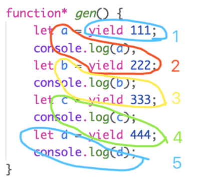
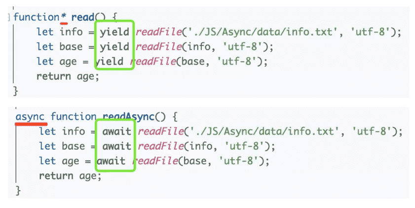
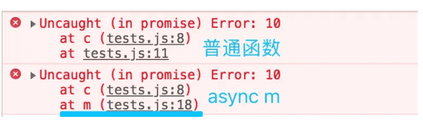
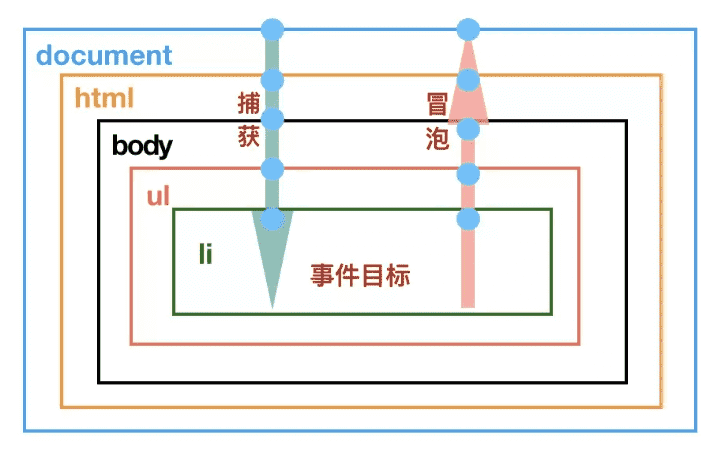

## 1.原始类型有哪几种？null 是对象吗？原始数据类型和复杂数据类型存储有什么区别？

::: tip

- 原始类型有6种，分别是**undefined,null,bool,string,number,symbol**(ES6新增)。
- 虽然 typeof null 返回的值是 object,但是null不是对象，而是基本数据类型的一种。
- 原始数据类型存储在栈内存，存储的是值。
- 复杂数据类型存储在堆内存，存储的是地址。当我们把对象赋值给另外一个变量的时候，复制的是地址，指向同一块内存空间，当其中一个对象改变时，另一个对象也会变化。

:::

## 2.typeof 是否正确判断类型? instanceof呢？ instanceof 的实现原理是什么？

首先 typeof 能够正确的​​判断基本数据类型，但是除了 null, **typeof null输出的是对象。**

但是对象来说，typeof 不能正确的判断其类型， **typeof 一个函数可以输出 ‘function’,**而除此之外，输出的全是 object,这种情况下，我们无法准确的知道对象的类型。

instanceof可以准确的判断复杂数据类型，但是不能正确判断基本数据类型。(正确判断数据类型请戳：<https://github.com/YvetteLau/Blog/blob/master/JS/data-type.js>)

instanceof 是通过原型链判断的，A instanceof B, 在A的原型链中层层查找，是否有原型等于B.prototype，如果一直找到A的原型链的顶端(null;即`Object.prototype.__proto__`),仍然不等于B.prototype，那么返回false，否则返回true.

instanceof的实现代码:

```javascript
// L instanceof R
function instance_of(L, R) {//L 表示左表达式，R 表示右表达式
    var O = R.prototype;// 取 R 的显式原型
    L = L.__proto__;    // 取 L 的隐式原型
    while (true) { 
        if (L === null) //已经找到顶层
            return false;  
        if (O === L)   //当 O 严格等于 L 时，返回 true
            return true; 
        L = L.__proto__;  //继续向上一层原型链查找
    } 
}
```

## 3.for of , for in 和 forEach,map 的区别。

::: tip

- for…of循环：具有 iterator 接口，就可以用for…of循环遍历它的成员(属性值)。for…of循环可以使用的范围包括数组、Set 和 Map 结构、某些类似数组的对象、Generator 对象，以及字符串。for…of循环调用遍历器接口，数组的遍历器接口只返回具有数字索引的属性。对于普通的对象，for…of结构不能直接使用，会报错，必须部署了 Iterator 接口后才能使用。可以中断循环。
- for…in循环：遍历对象自身的和继承的可枚举的属性, 不能直接获取属性值。可以中断循环。
- forEach: 只能遍历数组，不能中断，没有返回值(或认为返回值是undefined)。
- map: 只能遍历数组，不能中断，返回值是修改后的数组。

PS: Object.keys()：返回给定对象所有可枚举属性的字符串数组。

:::

关于forEach是否会改变原数组的问题，有些小伙伴提出了异议，为此我写了代码测试了下(注意数组项是复杂数据类型的情况)。
除了forEach之外，map等API，也有同样的问题。

```javascript
let arry = [1, 2, 3, 4];

arry.forEach((item) => {
    item *= 10;
});
console.log(arry); //[1, 2, 3, 4]

arry.forEach((item) => {
    arry[1] = 10; //直接操作数组
});
console.log(arry); //[ 1, 10, 3, 4 ]

let arry2 = [
    { name: "Yve" },
    { age: 20 }
];
arry2.forEach((item) => {
    item.name = 10;
});
console.log(arry2);//[ { name: 10 }, { age: 20, name: 10 } ]
```

如还不了解 iterator 接口或 for…of, 请先阅读ES6文档: [Iterator 和 for…of 循环](http://es6.ruanyifeng.com/#docs/iterator)

更多细节请戳: <https://github.com/YvetteLau/Blog/blob/master/JS/for.js>

## 4.如何判断一个变量是不是数组？

::: tip

- 使用 Array.isArray 判断，如果返回 true, 说明是数组
- 使用 instanceof Array 判断，如果返回true, 说明是数组
- 使用 Object.prototype.toString.call 判断，如果值是 [object Array], 说明是数组
- 通过 constructor 来判断，如果是数组，那么 `arr.constructor === Array`. (不准确，因为我们可以指定 `obj.constructor = Array`)

:::

```javascript
function fn() {
    console.log(Array.isArray(arguments));   //false; 因为arguments是类数组，但不是数组
    console.log(Array.isArray([1,2,3,4]));   //true
    console.log(arguments instanceof Array); //fasle
    console.log([1,2,3,4] instanceof Array); //true
    console.log(Object.prototype.toString.call(arguments)); //[object Arguments]
    console.log(Object.prototype.toString.call([1,2,3,4])); //[object Array]
    console.log(arguments.constructor === Array); //false
    arguments.constructor = Array;
    console.log(arguments.constructor === Array); //true
    console.log(Array.isArray(arguments));        //false
}
fn(1,2,3,4);
```

##  5.类数组和数组的区别是什么？

> 类数组:

1）拥有length属性，其它属性（索引）为非负整数（对象中的索引会被当做字符串来处理）;

2）不具有数组所具有的方法；

类数组是一个普通对象，而真实的数组是Array类型。

常见的类数组有: 函数的参数 arugments, DOM 对象列表(比如通过 document.querySelectorAll 得到的列表), jQuery 对象 (比如 $(“div”)).

类数组可以转换为数组:

```javascript
//第一种方法
Array.prototype.slice.call(arrayLike, start);
//第二种方法
[...arrayLike];
//第三种方法:
Array.from(arrayLike);
```

**PS:** 任何定义了遍历器（Iterator）接口的对象，都可以用扩展运算符转为真正的数组。

Array.from方法用于将两类对象转为真正的数组：类似数组的对象（array-like object）和可遍历（iterable）的对象。

## 6.== 和 === 有什么区别？

::: tip

=== 不需要进行类型转换，只有类型相同并且值相等时，才返回 true.

== 如果两者类型不同，首先需要进行类型转换。具体流程如下:

1. 首先判断两者类型是否相同，如果相等，判断值是否相等.
2. 如果类型不同，进行类型转换
3. 判断比较的是否是 null 或者是 undefined, 如果是, 返回 true .
4. 判断两者类型是否为 string 和 number, 如果是, 将字符串转换成 number
5. 判断其中一方是否为 boolean, 如果是, 将 boolean 转为 number 再进行判断
6. 判断其中一方是否为 object 且另一方为 string、number 或者 symbol , 如果是, 将 object 转为原始类型再进行判断

:::

```js
let person1 = {
    age: 25
}
let person2 = person1;
person2.gae = 20;
console.log(person1 === person2); //true,注意复杂数据类型，比较的是引用地址
```

### 思考: `[] == ![]`

我们来分析一下: `[] == ![]` 是true还是false？

1. 首先，我们需要知道 ! 优先级是高于 == (更多运算符优先级可查看: [运算符优先级](https://link.juejin.im?target=https%3A%2F%2Fdeveloper.mozilla.org%2Fzh-CN%2Fdocs%2FWeb%2FJavaScript%2FReference%2FOperators%2FOperator_Precedence))
2. `![]` :yum:**引用类型转换成布尔值都是true**,因此`![]`的是false
3. 根据上面的比较步骤中的第五条，其中一方是 boolean，将 boolean 转为 number 再进行判断，false转换成 number，对应的值是 0.
4. 根据上面比较步骤中的第六条，有一方是 number，那么将object也转换成Number,:ox:**空数组转换成数字，对应的值是0.**(空数组转换成数字，对应的值是0，如果数组中只有一个数字，那么转成number就是这个数字，其它情况，均为NaN)
5. 0 == 0; 为true

## 7.ES6中的class和ES5的类有什么区别？

::: tip

1. ES6 class 内部所有定义的方法都是不可枚举的;
2. ES6 class 必须使用 new 调用;
3. ES6 class 不存在变量提升;
4. ES6 class 默认即是严格模式;
5. ES6 class 子类必须在父类的构造函数中调用super()，这样才有this对象;ES5中类继承的关系是相反的，先有子类的this，然后用父类的方法应用在this上。

:::

## 8. 数组的哪些API会改变原数组？

::: tip

修改原数组的API有:

splice/reverse/fill/copyWithin/sort/push/pop/unshift/shift

:::

::: tip

不修改原数组的API有:

slice/map/forEach/every/filter/reduce/entries/find

:::

注: 数组的每一项是简单数据类型，且未直接操作数组的情况下(稍后会对此题重新作答)。

## 9. let、const 以及 var 的区别是什么？

::: tip

- let 和 const 定义的变量不会出现变量提升，而 var 定义的变量会提升。
- let 和 const 是JS中的块级作用域
- let 和 const 不允许重复声明(会抛出错误)
- let 和 const 定义的变量在定义语句之前，如果使用会抛出错误(形成了暂时性死区)，而 var 不会。
- const 声明一个只读的常量。一旦声明，常量的值就不能改变(如果声明是一个对象，那么不能改变的是对象的引用地址)

:::

## 10. 在JS中什么是变量提升？什么是暂时性死区？

变量提升就是变量在声明之前就可以使用，值为undefined。

在代码块内，使用 let/const 命令声明变量之前，该变量都是不可用的(会抛出错误)。这在语法上，称为“暂时性死区”。暂时性死区也意味着 typeof 不再是一个百分百安全的操作。

```js
typeof x; // ReferenceError(暂时性死区，抛错)
let x;

typeof y; // 值是undefined,不会报错
```

:yum:暂时性死区的本质就是，只要一进入当前作用域，所要使用的变量就已经存在了，但是不可获取，只有等到声明变量的那一行代码出现，才可以获取和使用该变量。

## 11. 如何正确的判断this? 箭头函数的this是什么？

::: tip

this的绑定规则有四种：默认绑定，隐式绑定，显式绑定，new绑定.

1. 函数是否在 new 中调用(new绑定)，如果是，那么 this 绑定的是新创建的对象【前提是构造函数中没有返回对象或者是function，否则this指向返回的对象/function】。
2. 函数是否通过 call,apply 调用，或者使用了 bind (即硬绑定)，如果是，那么this绑定的就是指定的对象。
3. 函数是否在某个上下文对象中调用(隐式绑定)，如果是的话，this 绑定的是那个上下文对象。一般是 obj.foo()
4. 如果以上都不是，那么使用默认绑定。**如果在严格模式下，则绑定到 undefined，否则绑定到全局对象。**
5. 如果把 null 或者 undefined 作为 this 的绑定对象传入 call、apply 或者 bind, 这些值在调用时会被忽略，实际应用的是默认绑定规则。
6. 箭头函数没有自己的 this, 它的this继承于上一层代码块的this。

:::

测试下是否已经成功Get了此知识点(浏览器执行环境):

```js
var number = 5;
var obj = {
    number: 3,
    fn1: (function () {
        var number;
        this.number *= 2;
        number = number * 2;
        number = 3;
        return function () {
            var num = this.number;
            this.number *= 2;
            console.log(num);
            number *= 3;
            console.log(number);
        }
    })()
}
var fn1 = obj.fn1;
fn1.call(null);
obj.fn1();
console.log(window.number);
```

如果this的知识点，您还不太懂，请戳: [嗨，你真的懂this吗？](https://link.juejin.im?target=https%3A%2F%2Fgithub.com%2FYvetteLau%2FBlog%2Fissues%2F6)

## 12. 词法作用域和this的区别。

- 词法作用域是由你在写代码时将变量和块作用域写在哪里来决定的
- this 是在调用时被绑定的，this 指向什么，完全取决于函数的调用位置(关于this的指向问题，本文已经有说明)

## 13. 谈谈你对JS执行上下文栈和作用域链的理解。

执行上下文就是当前 JavaScript 代码被解析和执行时所在环境, JS执行上下文栈可以认为是一个存储函数调用的栈结构，遵循先进后出的原则。

- JavaScript执行在单线程上，所有的代码都是排队执行。
- 一开始浏览器执行全局的代码时，首先创建全局的执行上下文，压入执行栈的顶部。
- 每当进入一个函数的执行就会创建函数的执行上下文，并且把它压入执行栈的顶部。当前函数执行-完成后，当前函数的执行上下文出栈，并等待垃圾回收。
- 浏览器的JS执行引擎总是访问栈顶的执行上下文。
- 全局上下文只有唯一的一个，它在浏览器关闭时出栈。

作用域链: 无论是 LHS 还是 RHS 查询，都会在当前的作用域开始查找，如果没有找到，就会向上级作用域继续查找目标标识符，每次上升一个作用域，一直到全局作用域为止。

## 14. 什么是闭包？闭包的作用是什么？闭包有哪些使用场景？

**闭包是指有权访问另一个函数作用域中的变量的函数**，创建闭包最常用的方式就是在一个函数内部创建另一个函数。

::: tip

闭包的作用有:

1. 封装私有变量
2. 模仿块级作用域(ES5中没有块级作用域)
3. 实现JS的模块

:::

## 15. call、apply有什么区别？call,aplly和bind的内部是如何实现的？

call 和 apply 的功能相同，区别在于传参的方式不一样:

- fn.call(obj, arg1, arg2, ...),调用一个函数, 具有一个指定的this值和分别地提供的参数(参数的列表)。
- fn.apply(obj, [argsArray]),调用一个函数，具有一个指定的this值，以及作为一个数组（或类数组对象）提供的参数。

::: tip

call核心:

- 将函数设为传入参数的属性
- 指定this到函数并传入给定参数执行函数
- 如果不传入参数或者参数为null，默认指向为 window / global
- 删除参数上的函数

:::

```js
Function.prototype.call = function (context) {
    /** 如果第一个参数传入的是 null 或者是 undefined, 那么指向this指向 window/global */
    /** 如果第一个参数传入的不是null或者是undefined, 那么必须是一个对象 */
    if (!context) {
        //context为null或者是undefined
        context = typeof window === 'undefined' ? global : window;
    }
    context.fn = this; //this指向的是当前的函数(Function的实例)
    let rest = [...arguments].slice(1);//获取除了this指向对象以外的参数, 空数组slice后返回的仍然是空数组
    let result = context.fn(...rest); //隐式绑定,当前函数的this指向了context.
    delete context.fn;
    return result;
}

//测试代码
var foo = {
    name: 'Selina'
}
var name = 'Chirs';
function bar(job, age) {
    console.log(this.name);
    console.log(job, age);
}
bar.call(foo, 'programmer', 20);
// Selina programmer 20
bar.call(null, 'teacher', 25);
// 浏览器环境: Chirs teacher 25; node 环境: undefined teacher 25

```

> apply:

apply的实现和call很类似，但是需要注意他们的参数是不一样的，apply的第二个参数是数组或类数组.

```js
Function.prototype.apply = function (context, rest) {
    if (!context) {
        //context为null或者是undefined时,设置默认值
        context = typeof window === 'undefined' ? global : window;
    }
    context.fn = this;
    let result;
    if(rest === undefined || rest === null) {
        //undefined 或者 是 null 不是 Iterator 对象，不能被 ...
        result = context.fn(rest);
    }else if(typeof rest === 'object') {
        result = context.fn(...rest);
    }
    delete context.fn;
    return result;
}
var foo = {
    name: 'Selina'
}
var name = 'Chirs';
function bar(job, age) {
    console.log(this.name);
    console.log(job, age);
}
bar.apply(foo, ['programmer', 20]);
// Selina programmer 20
bar.apply(null, ['teacher', 25]);
// 浏览器环境: Chirs programmer 20; node 环境: undefined teacher 25
```

> bind

bind 和 call/apply 有一个很重要的区别，一个函数被 call/apply 的时候，会直接调用，但是 bind 会创建一个新函数。当这个新函数被调用时，bind() 的第一个参数将作为它运行时的 this，之后的一序列参数将会在传递的实参前传入作为它的参数。

```js
Function.prototype.bind = function(context) {
    if(typeof this !== "function"){
       throw new TypeError("not a function");
    }
    let self = this;
    let args = [...arguments].slice(1);
    function Fn() {};
    Fn.prototype = this.prototype;
    let bound = function() {
        let res = [...args, ...arguments]; //bind传递的参数和函数调用时传递的参数拼接
        context = this instanceof Fn ? this : context || this;
        return self.apply(context, res);
    }
    //原型链
    bound.prototype = new Fn();
    return bound;
}

var name = 'Jack';
function person(age, job, gender){
    console.log(this.name , age, job, gender);
}
var Yve = {name : 'Yvette'};
let result = person.bind(Yve, 22, 'enginner')('female');	
```

## 16. new的原理是什么？通过new的方式创建对象和通过字面量创建有什么区别？

::: tip new:

1. 创建一个新对象。
2. 这个新对象会被执行[[原型]]连接。
3. 属性和方法被加入到 this 引用的对象中。并执行了构造函数中的方法.
4. 如果函数没有返回其他对象，那么this指向这个新对象，否则this指向构造函数中返回的对象。

:::

```js
function new(func) {
    let target = {};
    target.__proto__ = func.prototype;
    let res = func.call(target);
    if (res && typeof(res) == "object" || typeof(res) == "function") {
    	return res;
    }
    return target;
}
```

字面量创建对象，不会调用 Object构造函数, 简洁且性能更好;

new Object() 方式创建对象本质上是方法调用，涉及到在proto链中遍历该方法，当找到该方法后，又会生产方法调用必须的 堆栈信息，方法调用结束后，还要释放该堆栈，性能不如字面量的方式。

通过对象字面量定义对象时，不会调用Object构造函数。

## 17. 谈谈你对原型的理解？

:yum:在 JavaScript 中，每当定义一个对象（函数也是对象）时候，对象中都会包含一些预定义的属性。其中每个函数对象都有一个prototype 属性，这个属性指向函数的原型对象。使用原型对象的好处是**所有对象实例共享它所包含的属性和方法**。

## 18. 什么是原型链？【原型链解决的是什么问题？】

原型链解决的主要是继承问题。

每个对象拥有一个原型对象，通过 **proto** (读音: dunder proto) 指针指向其原型对象，并从中继承方法和属性，同时原型对象也可能拥有原型，这样一层一层，最终指向 null(`Object.proptotype.__proto__` 指向的是null)。这种关系被称为原型链 (prototype chain)，通过原型链一个对象可以拥有定义在其他对象中的属性和方法。

构造函数 Parent、Parent.prototype 和 实例 p 的关系如下:`(p.__proto__ === Parent.prototype)`


## 19. prototype 和 `__proto__` 区别是什么？

prototype是构造函数的属性。

`__proto__` 是每个实例都有的属性，可以访问 [[prototype]] 属性。

实例的`__proto__` 与其构造函数的prototype指向的是同一个对象。

```js
function Student(name) {
    this.name = name;
}
Student.prototype.setAge = function(){
    this.age=20;
}
let Jack = new Student('jack');
console.log(Jack.__proto__);
//console.log(Object.getPrototypeOf(Jack));;
console.log(Student.prototype);
console.log(Jack.__proto__ === Student.prototype);//true
```

## 20. 使用ES5实现一个继承？

> 组合继承(最常用的继承方式)

```js
function SuperType(name) {
    this.name = name;
    this.colors = ['red', 'blue', 'green'];
}
SuperType.prototype.sayName = function() {
    console.log(this.name);
}

function SubType(name, age) {
    SuperType.call(this, name);
    this.age = age;
}
SubType.prototype = new SuperType();
SubType.prototype.constructor = SubType;

SubType.prototype.sayAge = function() {
    console.log(this.age);
}
```

其它继承方式实现，可以参考《JavaScript高级程序设计》

请跳转《[原型继承](/font/JS/构造函数、原型、继承和原型链.md)》一文

## 21. 什么是深拷贝？深拷贝和浅拷贝有什么区别？

浅拷贝是指只复制第一层对象，但是当对象的属性是引用类型时，实质复制的是其引用，当引用指向的值改变时也会跟着变化。

深拷贝复制变量值，对于非基本类型的变量，则递归至基本类型变量后，再复制。深拷贝后的对象与原来的对象是完全隔离的，互不影响，对一个对象的修改并不会影响另一个对象。

实现一个深拷贝:

```js
function deepClone(obj) { //递归拷贝
    if(obj === null) return null; //null 的情况
    if(obj instanceof RegExp) return new RegExp(obj);
    if(obj instanceof Date) return new Date(obj);
    if(typeof obj !== 'object') {
        //如果不是复杂数据类型，直接返回
        return obj;
    }
    /**
     * 如果obj是数组，那么 obj.constructor 是 [Function: Array]
     * 如果obj是对象，那么 obj.constructor 是 [Function: Object]
     */
    let t = new obj.constructor();
    for(let key in obj) {
        //如果 obj[key] 是复杂数据类型，递归
        t[key] = deepClone(obj[key]);
    }
    return t;
}
```

## 22. 防抖和节流的区别是什么？防抖和节流的实现。

防抖和节流的作用都是防止函数多次调用。区别在于，假设一个用户一直触发这个函数，且每次触发函数的间隔小于设置的时间，防抖的情况下只会调用一次，而节流的情况会每隔一定时间调用一次函数。

> 防抖(debounce): n秒内函数只会执行一次，如果n秒内高频事件再次被触发，则重新计算时间

```js
function debounce(func, wait, immediate = true) {
    let timer;
    // 延迟执行函数
    const later = (context, args) => setTimeout(() => {
        timer = null;// 倒计时结束
        if (!immediate) {
            func.apply(context, args);
            //执行回调
            context = args = null;
        }
    }, wait);
    let debounced = function (...params) {
        let context = this;
        let args = params;
        if (!timer) {
            timer = later(context, args);
            if (immediate) {
                //立即执行
                func.apply(context, args);
            }
        } else {
            clearTimeout(timer);
            //函数在每个等待时延的结束被调用
            timer = later(context, args);
        }
    }
    debounced.cancel = function () {
        clearTimeout(timer);
        timer = null;
    };
    return debounced;
};
```

防抖的应用场景:

- 每次 resize/scroll 触发统计事件
- 文本输入的验证（连续输入文字后发送 AJAX 请求进行验证，验证一次就好）

> 节流(throttle): 高频事件在规定时间内只会执行一次，执行一次后，只有大于设定的执行周期后才会执行第二次。

```js
//underscore.js
function throttle(func, wait, options) {
    var timeout, context, args, result;
    var previous = 0;
    if (!options) options = {};

    var later = function () {
        previous = options.leading === false ? 0 : Date.now() || new Date().getTime();
        timeout = null;
        result = func.apply(context, args);
        if (!timeout) context = args = null;
    };

    var throttled = function () {
        var now = Date.now() || new Date().getTime();
        if (!previous && options.leading === false) previous = now;
        var remaining = wait - (now - previous);
        context = this;
        args = arguments;
        if (remaining <= 0 || remaining > wait) {
            if (timeout) {
                clearTimeout(timeout);
                timeout = null;
            }
            previous = now;
            result = func.apply(context, args);
            if (!timeout) context = args = null;
        } else if (!timeout && options.trailing !== false) {
            // 判断是否设置了定时器和 trailing
            timeout = setTimeout(later, remaining);
        }
        return result;
    };

    throttled.cancel = function () {
        clearTimeout(timeout);
        previous = 0;
        timeout = context = args = null;
    };

    return throttled;
};
```

函数节流的应用场景有:

- DOM 元素的拖拽功能实现（mousemove）
- 射击游戏的 mousedown/keydown 事件（单位时间只能发射一颗子弹）
- 计算鼠标移动的距离（mousemove）
- Canvas 模拟画板功能（mousemove）
- 搜索联想（keyup）
- 监听滚动事件判断是否到页面底部自动加载更多：给 scroll 加了 debounce 后，只有用户停止滚动后，才会判断是否到了页面底部；如果是 throttle 的话，只要页面滚动就会间隔一段时间判断一次

------

## 23. 取数组的最大值（ES5、ES6）

```js
// ES5 的写法
Math.max.apply(null, [14, 3, 77, 30]);

// ES6 的写法
Math.max(...[14, 3, 77, 30]);

// reduce
[14,3,77,30].reduce((accumulator, currentValue)=>{
    return accumulator = accumulator > currentValue ? accumulator : currentValue
});
```

------

## 24. ES6新的特性有哪些？

1. 新增了块级作用域(let,const)
2. 提供了定义类的语法糖(class)
3. 新增了一种基本数据类型(Symbol)
4. 新增了变量的解构赋值
5. 函数参数允许设置默认值，引入了rest参数，新增了箭头函数
6. 数组新增了一些API，如 isArray / from / of 方法;数组实例新增了 entries()，keys() 和 values() 等方法
7. 对象和数组新增了扩展运算符
8. ES6 新增了模块化(import/export)
9. ES6 新增了 Set 和 Map 数据结构
10. ES6 原生提供 Proxy 构造函数，用来生成 Proxy 实例
11. ES6 新增了生成器(Generator)和遍历器(Iterator)

------

## 25. setTimeout倒计时为什么会出现误差？

setTimeout() 只是将事件插入了“任务队列”，必须等当前代码（执行栈）执行完，主线程才会去执行它指定的回调函数。要是当前代码消耗时间很长，也有可能要等很久，所以并没办法保证回调函数一定会在 setTimeout() 指定的时间执行。所以， setTimeout() 的第二个参数表示的是最少时间，并非是确切时间。

HTML5标准规定了 setTimeout() 的第二个参数的最小值不得小于4毫秒，如果低于这个值，则默认是4毫秒。在此之前。老版本的浏览器都将最短时间设为10毫秒。另外，对于那些DOM的变动（尤其是涉及页面重新渲染的部分），通常是间隔16毫秒执行。这时使用 requestAnimationFrame() 的效果要好于 setTimeout();

------

## 26. 为什么 0.1 + 0.2 != 0.3 ?

0.1 + 0.2 != 0.3 是因为在进制转换和进阶运算的过程中出现精度损失。

下面是详细解释:

JavaScript使用 Number 类型表示数字(整数和浮点数)，使用64位表示一个数字。


图片说明:

- 第0位：符号位，0表示正数，1表示负数(s)
- 第1位到第11位：储存指数部分（e）
- 第12位到第63位：储存小数部分（即有效数字）f

计算机无法直接对十进制的数字进行运算, 需要先对照 IEEE 754 规范转换成二进制，然后对阶运算。

> 1.进制转换

0.1和0.2转换成二进制后会无限循环

```js
0.1 -> 0.0001100110011001...(无限循环)
0.2 -> 0.0011001100110011...(无限循环)
```

但是由于IEEE 754尾数位数限制，需要将后面多余的位截掉，这样在进制之间的转换中精度已经损失。

> 2.对阶运算

由于指数位数不相同，运算时需要对阶运算 这部分也可能产生精度损失。

按照上面两步运算（包括两步的精度损失），最后的结果是

0.0100110011001100110011001100110011001100110011001100

结果转换成十进制之后就是 0.30000000000000004。

### 方法：parseFloat((0.1 + 0.2).toFixed(10))

## 27. promise 有几种状态, Promise 有什么优缺点 ?

promise有三种状态: fulfilled, rejected, pending.

> Promise 的优点:

1. 一旦状态改变，就不会再变，任何时候都可以得到这个结果
2. 可以将异步操作以同步操作的流程表达出来，避免了层层嵌套的回调函数

> Promise 的缺点:

1. 无法取消 Promise
2. 当处于pending状态时，无法得知目前进展到哪一个阶段

------

## 28. Promise构造函数是同步还是异步执行，then中的方法呢 ?promise如何实现then处理 ?

Promise的构造函数是同步执行的。then 中的方法是异步执行的。

promise的then实现，详见: [Promise源码实现](https://juejin.im/post/5c88e427f265da2d8d6a1c84)

------

## 29. Promise和setTimeout的区别 ?

Promise 是微任务，setTimeout 是宏任务，同一个事件循环中，promise.then总是先于 setTimeout 执行。

------

## 30. 如何实现 Promise.all ?

要实现 Promise.all,首先我们需要知道 Promise.all 的功能：

1. 如果传入的参数是一个空的可迭代对象，那么此promise对象回调完成(resolve),只有此情况，是同步执行的，其它都是异步返回的。
2. 如果传入的参数不包含任何 promise，则返回一个异步完成. promises 中所有的promise都“完成”时或参数中不包含 promise 时回调完成。
3. 如果参数中有一个promise失败，那么Promise.all返回的promise对象失败
4. 在任何情况下，Promise.all 返回的 promise 的完成状态的结果都是一个数组

```
Promise.all = function (promises) {
    return new Promise((resolve, reject) => {
        let index = 0;
        let result = [];
        if (promises.length === 0) {
            resolve(result);
        } else {
            function processValue(i, data) {
                result[i] = data;
                if (++index === promises.length) {
                    resolve(result);
                }
            }
            for (let i = 0; i < promises.length; i++) {
                //promises[i] 可能是普通值
                Promise.resolve(promises[i]).then((data) => {
                    processValue(i, data);
                }, (err) => {
                    reject(err);
                    return;
                });
            }
        }
    });
}
```

如果想了解更多Promise的源码实现，可以参考我的另一篇文章：[Promise的源码实现（完美符合Promise/A+规范）](https://juejin.im/post/5c88e427f265da2d8d6a1c84#heading-24)

------

## 31.如何实现 Promise.finally ?

不管成功还是失败，都会走到finally中,并且finally之后，还可以继续then。并且会将值原封不动的传递给后面的then.

```js
Promise.prototype.finally = function (callback) {
    return this.then((value) => {
        return Promise.resolve(callback()).then(() => {
            return value;
        });
    }, (err) => {
        return Promise.resolve(callback()).then(() => {
            throw err;
        });
    });
}
```

------

## 32. 什么是函数柯里化？实现 sum(1)(2)(3) 返回结果是1,2,3之和

函数柯里化是把接受多个参数的函数变换成接受一个单一参数（最初函数的第一个参数）的函数，并且返回接受余下的参数而且返回结果的新函数的技术。

```js
function sum(a) {
    return function(b) {
        return function(c) {
            return a+b+c;
        }
    }
}
console.log(sum(1)(2)(3)); // 6
```

引申：实现一个curry函数，将普通函数进行柯里化:

```js
function curry(fn, args = []) {
    return function(){
        let rest = [...args, ...arguments];
        if (rest.length < fn.length) {
            return curry.call(this,fn,rest);
        }else{
            return fn.apply(this,rest);
        }
    }
}
//test
function sum(a,b,c) {
    return a+b+c;
}
let sumFn = curry(sum);
console.log(sumFn(1)(2)(3)); //6
console.log(sumFn(1)(2, 3)); //6
```


作者：刘小夕链接：https://juejin.im/post/5cab0c45f265da2513734390来源：掘金著作权归作者所有。

NOSCRIPT标签用来定义在脚本未被执行时的替代内容。也可以用在检测浏览器是否支持脚本，若不支持脚本则可以显示NOSCRIPT标签里的innerText

以下来自：https://juejin.im/post/5cbd1e33e51d45789161d053

## 33.说一说JS异步发展史

异步最早的解决方案是回调函数，如事件的回调，setInterval/setTimeout中的回调。但是回调函数有一个很常见的问题，就是回调地狱的问题(稍后会举例说明);

为了解决回调地狱的问题，社区提出了Promise解决方案，ES6将其写进了语言标准。Promise解决了回调地狱的问题，但是Promise也存在一些问题，如错误不能被try catch，而且使用Promise的链式调用，其实并没有从根本上解决回调地狱的问题，只是换了一种写法。

ES6中引入 Generator 函数，Generator是一种异步编程解决方案，Generator 函数是协程在 ES6 的实现，最大特点就是可以交出函数的执行权，Generator 函数可以看出是异步任务的容器，需要暂停的地方，都用yield语句注明。但是 Generator 使用起来较为复杂。

ES7又提出了新的异步解决方案:async/await，async是 Generator 函数的语法糖，async/await 使得异步代码看起来像同步代码，异步编程发展的目标就是让异步逻辑的代码看起来像同步一样。

> 1.回调函数: callback

```js
//node读取文件
fs.readFile(xxx, 'utf-8', function(err, data) {
    //code
});
```

回调函数的使用场景(包括但不限于):

1. 事件回调
2. Node API
3. setTimeout/setInterval中的回调函数

异步回调嵌套会导致代码难以维护，并且不方便统一处理错误，不能try catch 和 回调地狱(如先读取A文本内容，再根据A文本内容读取B再根据B的内容读取C...)。

```js
fs.readFile(A, 'utf-8', function(err, data) {
    fs.readFile(B, 'utf-8', function(err, data) {
        fs.readFile(C, 'utf-8', function(err, data) {
            fs.readFile(D, 'utf-8', function(err, data) {
                //....
            });
        });
    });
});
```

> 2.Promise

Promise 主要解决了回调地狱的问题，Promise 最早由社区提出和实现，ES6 将其写进了语言标准，统一了用法，原生提供了Promise对象。

那么我们看看Promise是如何解决回调地狱问题的，仍然以上文的readFile为例。

```js
function read(url) {
    return new Promise((resolve, reject) => {
        fs.readFile(url, 'utf8', (err, data) => {
            if(err) reject(err);
            resolve(data);
        });
    });
}
read(A).then(data => {
    return read(B);
}).then(data => {
    return read(C);
}).then(data => {
    return read(D);
}).catch(reason => {
    console.log(reason);
});
```

想要运行代码看效果，请戳(小姐姐使用的是VS的 Code Runner 执行代码): [github.com/YvetteLau/B…](https://link.juejin.im?target=https%3A%2F%2Fgithub.com%2FYvetteLau%2FBlog%2Fblob%2Fmaster%2FJS%2FAsync%2Fpromise.js)

思考一下在Promise之前，你是如何处理异步并发问题的，假设有这样一个需求：读取三个文件内容，都读取成功后，输出最终的结果。有了Promise之后，又如何处理呢？代码可戳: [github.com/YvetteLau/B…](https://link.juejin.im?target=https%3A%2F%2Fgithub.com%2FYvetteLau%2FBlog%2Fblob%2Fmaster%2FJS%2FAsync%2Findex.js)

注: 可以使用 bluebird 将接口 promise化;

**引申:** Promise有哪些优点和问题呢？

> 3.Generator

Generator 函数是 ES6 提供的一种异步编程解决方案，整个 Generator 函数就是一个封装的异步任务，或者说是异步任务的容器。异步操作需要暂停的地方，都用 yield 语句注明。

Generator 函数一般配合 yield 或 Promise 使用。Generator函数返回的是迭代器。对生成器和迭代器不了解的同学，请自行补习下基础。下面我们看一下 Generator 的简单使用:

```js
function* gen() {
    let a = yield 111;
    console.log(a);
    let b = yield 222;
    console.log(b);
    let c = yield 333;
    console.log(c);
    let d = yield 444;
    console.log(d);
}
let t = gen();
//next方法可以带一个参数，该参数就会被当作上一个yield表达式的返回值
t.next(1); //第一次调用next函数时，传递的参数无效
t.next(2); //a输出2;
t.next(3); //b输出3; 
t.next(4); //c输出4;
t.next(5); //d输出5;
```

为了让大家更好的理解上面代码是如何执行的，我画了一张图，分别对应每一次的next方法调用:



仍然以上文的readFile为例，使用 Generator + co库来实现:

```js
const fs = require('fs');
const co = require('co');
const bluebird = require('bluebird');
const readFile = bluebird.promisify(fs.readFile);

function* read() {
    yield readFile(A, 'utf-8');
    yield readFile(B, 'utf-8');
    yield readFile(C, 'utf-8');
    //....
}
co(read()).then(data => {
    //code
}).catch(err => {
    //code
});

```

不使用co库，如何实现？能否自己写一个最简的my_co？请戳: [github.com/YvetteLau/B…](https://link.juejin.im?target=https%3A%2F%2Fgithub.com%2FYvetteLau%2FBlog%2Fblob%2Fmaster%2FJS%2FAsync%2Fgenerator.js)

PS: 如果你还不太了解 Generator/yield，建议阅读ES6相关文档。

> 4.async/await

ES7中引入了 async/await 概念。async其实是一个语法糖，它的实现就是将Generator函数和自动执行器（co），包装在一个函数中。

async/await 的优点是代码清晰，不用像 Promise 写很多 then 链，就可以处理回调地狱的问题。错误可以被try catch。

```js
const fs = require('fs');
const bluebird = require('bluebird');
const readFile = bluebird.promisify(fs.readFile);


async function read() {
    await readFile(A, 'utf-8');
    await readFile(B, 'utf-8');
    await readFile(C, 'utf-8');
    //code
}

read().then((data) => {
    //code
}).catch(err => {
    //code
});
```

可执行代码，请戳：[github.com/YvetteLau/B…](https://link.juejin.im?target=https%3A%2F%2Fgithub.com%2FYvetteLau%2FBlog%2Fblob%2Fmaster%2FJS%2FAsync%2Fasync.js)

思考一下 async/await 如何处理异步并发问题的？ [github.com/YvetteLau/B…](https://link.juejin.im?target=https%3A%2F%2Fgithub.com%2FYvetteLau%2FBlog%2Fblob%2Fmaster%2FJS%2FAsync%2Findex.js)

## 34.谈谈对 async/await 的理解，async/await 的实现原理是什么?

async/await 就是 Generator 的语法糖，使得异步操作变得更加方便。来张图对比一下:



async 函数就是将 Generator 函数的星号（*）替换成 async，将 yield 替换成await。

::: tip 我们说 async 是 Generator 的语法糖，那么这个糖究竟甜在哪呢？

1）async函数内置执行器，函数调用之后，会自动执行，输出最后结果。而Generator需要调用next或者配合co模块使用。

2）更好的语义，async和await，比起星号和yield，语义更清楚了。async表示函数里有异步操作，await表示紧跟在后面的表达式需要等待结果。

3）更广的适用性。co模块约定，yield命令后面只能是 Thunk 函数或 Promise 对象，而async 函数的 await 命令后面，可以是 Promise 对象和原始类型的值。

4）返回值是Promise，async函数的返回值是 Promise 对象，Generator的返回值是 Iterator，Promise 对象使用起来更加方便。

:::

> async 函数的实现原理，就是将 Generator 函数和自动执行器，包装在一个函数里。

具体代码试下如下(和spawn的实现略有差异，个人觉得这样写更容易理解)，如果你想知道如何一步步写出 my_co ，可戳: [github.com/YvetteLau/B…](https://link.juejin.im?target=https%3A%2F%2Fgithub.com%2FYvetteLau%2FBlog%2Fblob%2Fmaster%2FJS%2FAsync%2Fmy_async.js)

```js
function my_co(it) {
    return new Promise((resolve, reject) => {
        function next(data) {
            try {
                var { value, done } = it.next(data);
            }catch(e){
                return reject(e);
            }
            if (!done) { 
                //done为true,表示迭代完成
                //value 不一定是 Promise，可能是一个普通值。使用 Promise.resolve 进行包装。
                Promise.resolve(value).then(val => {
                    next(val);
                }, reject);
            } else {
                resolve(value);
            }
        }
        next(); //执行一次next
    });
}
function* test() {
    yield new Promise((resolve, reject) => {
        setTimeout(resolve, 100);
    });
    yield new Promise((resolve, reject) => {
        // throw Error(1);
        resolve(10)
    });
    yield 10;
    return 1000;
}

my_co(test()).then(data => {
    console.log(data); //输出1000
}).catch((err) => {
    console.log('err: ', err);
});
```

如果你有更好的答案或想法，欢迎在这题目对应的github下留言：[谈谈对 async/await 的理解，async/await 的实现原理是什么?](https://link.juejin.im?target=https%3A%2F%2Fgithub.com%2FYvetteLau%2FBlog%2Fissues%2F11)

## 35.使用 async/await 需要注意什么？

1. await 命令后面的Promise对象，运行结果可能是 rejected，此时等同于 async 函数返回的 Promise 对象被reject。因此需要加上错误处理，可以给每个 await 后的 Promise 增加 catch 方法；也可以将 await 的代码放在 `try...catch` 中。
2. 多个await命令后面的异步操作，如果不存在继发关系，最好让它们同时触发。

```js
//下面两种写法都可以同时触发
//法一
async function f1() {
    await Promise.all([
        new Promise((resolve) => {
            setTimeout(resolve, 600);
        }),
        new Promise((resolve) => {
            setTimeout(resolve, 600);
        })
    ])
}
//法二
async function f2() {
    let fn1 = new Promise((resolve) => {
            setTimeout(resolve, 800);
        });
    
    let fn2 = new Promise((resolve) => {
            setTimeout(resolve, 800);
        })
    await fn1;
    await fn2;
}
```

1. await命令只能用在async函数之中，如果用在普通函数，会报错。
2. async 函数可以保留运行堆栈。

```js
/**
* 函数a内部运行了一个异步任务b()。当b()运行的时候，函数a()不会中断，而是继续执行。
* 等到b()运行结束，可能a()早就* 运行结束了，b()所在的上下文环境已经消失了。
* 如果b()或c()报错，错误堆栈将不包括a()。
*/
function b() {
    return new Promise((resolve, reject) => {
        setTimeout(resolve, 200)
    });
}
function c() {
    throw Error(10);
}
const a = () => {
    b().then(() => c());
};
a();
/**
* 改成async函数
*/
const m = async () => {
    await b();
    c();
};
m();
```

报错信息如下，可以看出 async 函数可以保留运行堆栈。



如果你有更好的答案或想法，欢迎在这题目对应的github下留言：[使用 async/await 需要注意什么？](https://link.juejin.im/?target=https%3A%2F%2Fgithub.com%2FYvetteLau%2FBlog%2Fissues%2F12)

## 36.如何实现 Promise.race？

::: tip 在代码实现前，我们需要先了解 Promise.race 的特点：

1. Promise.race返回的仍然是一个Promise. 它的状态与第一个完成的Promise的状态相同。它可以是完成（ resolves），也可以是失败（rejects），这要取决于第一个Promise是哪一种状态。
2. 如果传入的参数是不可迭代的，那么将会抛出错误。
3. 如果传的参数数组是空，那么返回的 promise 将永远等待。
4. 如果迭代包含一个或多个非承诺值和/或已解决/拒绝的承诺，则 Promise.race 将解析为迭代中找到的第一个值。

:::

```js
Promise.race = function (promises) {
    //promises 必须是一个可遍历的数据结构，否则抛错
    return new Promise((resolve, reject) => {
        if (typeof promises[Symbol.iterator] !== 'function') {
            //真实不是这个错误
            Promise.reject('args is not iteratable!');
        }
        if (promises.length === 0) {
            return;
        } else {
            for (let i = 0; i < promises.length; i++) {
                Promise.resolve(promises[i]).then((data) => {
                    resolve(data);
                    return;
                }, (err) => {
                    reject(err);
                    return;
                });
            }
        }
    });
}
```

测试代码:

```js
//一直在等待态
Promise.race([]).then((data) => {
    console.log('success ', data);
}, (err) => {
    console.log('err ', err);
});
//抛错
Promise.race().then((data) => {
    console.log('success ', data);
}, (err) => {
    console.log('err ', err);
});
Promise.race([
    new Promise((resolve, reject) => { setTimeout(() => { resolve(100) }, 1000) }),
    new Promise((resolve, reject) => { setTimeout(() => { resolve(200) }, 200) }),
    new Promise((resolve, reject) => { setTimeout(() => { reject(100) }, 100) })
]).then((data) => {
    console.log(data);
}, (err) => {
    console.log(err);
});
```

**引申:** Promise.all/Promise.reject/Promise.resolve/Promise.prototype.finally/Promise.prototype.catch 的实现原理，如果还不太会，戳:[Promise源码实现](https://link.juejin.im?target=https%3A%2F%2Fgithub.com%2FYvetteLau%2FBlog%2Fissues%2F2)

如果你有更好的答案或想法，欢迎在这题目对应的github下留言：[如何实现 Promise.race？](https://link.juejin.im?target=https%3A%2F%2Fgithub.com%2FYvetteLau%2FBlog%2Fissues%2F13)

## 37.可遍历数据结构的有什么特点？

一个对象如果要具备可被 for...of 循环调用的 Iterator 接口，就必须在其 Symbol.iterator 的属性上部署遍历器生成方法(或者原型链上的对象具有该方法)

**PS:** 遍历器对象根本特征就是具有next方法。每次调用next方法，都会返回一个代表当前成员的信息对象，具有value和done两个属性。

```js
//如为对象添加Iterator 接口;
let obj = {
    name: "Yvette",
    age: 18,
    job: 'engineer',
    [Symbol.iterator]() {
        const self = this;
        const keys = Object.keys(self);
        let index = 0;
        return {
            next() {
                if (index < keys.length) {
                    return {
                        value: self[keys[index++]],
                        done: false
                    };
                } else {
                    return { value: undefined, done: true };
                }
            }
        };
    }
};

for(let item of obj) {
    console.log(item); //Yvette  18  engineer
}
```

使用 Generator 函数(遍历器对象生成函数)简写 Symbol.iterator 方法，可以简写如下:

```js
let obj = {
    name: "Yvette",
    age: 18,
    job: 'engineer',
    * [Symbol.iterator] () {
        const self = this;
        const keys = Object.keys(self);
        for (let index = 0;index < keys.length; index++) {
            yield self[keys[index]];//yield表达式仅能使用在 Generator 函数中
        } 
    }
};
```

::: tip 原生具备 Iterator 接口的数据结构如下。

- Array
- Map
- Set
- String
- TypedArray
- 函数的 arguments 对象
- NodeList 对象
- ES6 的数组、Set、Map 都部署了以下三个方法: entries() / keys() / values()，调用后都返回遍历器对象。

:::

如果你有更好的答案或想法，欢迎在这题目对应的github下留言：[可遍历数据结构的有什么特点？](https://link.juejin.im?target=https%3A%2F%2Fgithub.com%2FYvetteLau%2FBlog%2Fissues%2F14)

## 38.requestAnimationFrame 和 setTimeout/setInterval 有什么区别？使用 requestAnimationFrame 有哪些好处？

在 requestAnimationFrame 之前，我们主要使用 setTimeout/setInterval 来编写JS动画。

编写动画的关键是循环间隔的设置，一方面，循环间隔足够短，动画效果才能显得平滑流畅；另一方面，循环间隔还要足够长，才能确保浏览器有能力渲染产生的变化。

大部分的电脑显示器的刷新频率是60HZ，也就是每秒钟重绘60次。大多数浏览器都会对重绘操作加以限制，不超过显示器的重绘频率，因为即使超过那个频率用户体验也不会提升。因此，最平滑动画的最佳循环间隔是 1000ms / 60 ，约为16.7ms。

setTimeout/setInterval 有一个显著的缺陷在于时间是不精确的，setTimeout/setInterval 只能保证延时或间隔不小于设定的时间。因为它们实际上只是把任务添加到了任务队列中，但是如果前面的任务还没有执行完成，它们必须要等待。

requestAnimationFrame 才有的是系统时间间隔，保持最佳绘制效率，不会因为间隔时间过短，造成过度绘制，增加开销；也不会因为间隔时间太长，使用动画卡顿不流畅，让各种网页动画效果能够有一个统一的刷新机制，从而节省系统资源，提高系统性能，改善视觉效果。

综上所述，requestAnimationFrame 和 setTimeout/setInterval 在编写动画时相比，优点如下:

1.requestAnimationFrame 不需要设置时间，采用系统时间间隔，能达到最佳的动画效果。

2.requestAnimationFrame 会把每一帧中的所有DOM操作集中起来，在一次重绘或回流中就完成。

3.当 requestAnimationFrame() 运行在后台标签页或者隐藏的 `<iframe>` 里时，requestAnimationFrame() 会被暂停调用以提升性能和电池寿命（大多数浏览器中）。

requestAnimationFrame 使用(试试使用requestAnimationFrame写一个移动的小球，从A移动到B初):

```js
function step(timestamp) {
    //code...
    window.requestAnimationFrame(step);
}
window.requestAnimationFrame(step);

```

如果你有更好的答案或想法，欢迎在这题目对应的github下留言：[requestAnimationFrame 和 setTimeout/setInterval 有什么区别？使用 requestAnimationFrame 有哪些好处？](https://link.juejin.im?target=https%3A%2F%2Fgithub.com%2FYvetteLau%2FBlog%2Fissues%2F15)

## 39.JS 类型转换的规则是什么？

类型转换的规则三言两语说不清，真想哇得一声哭出来~

JS中类型转换分为 强制类型转换 和 隐式类型转换 。

- 通过 Number()、parseInt()、parseFloat()、toString()、String()、Boolean(),进行强制类型转换。
- 逻辑运算符(&&、 ||、 !)、运算符(+、-、*、/)、关系操作符(>、 <、 <= 、>=)、相等运算符(==)或者 if/while 的条件，可能会进行隐式类型转换。

### **强制类型转换**

> 1.Number() 将任意类型的参数转换为数值类型

::: tip 规则如下:

- 如果是布尔值，true和false分别被转换为1和0
- 如果是数字，返回自身
- 如果是 null，返回 0
- 如果是 undefined，返回 `NAN`
- 如果是字符串，遵循以下规则: 
  1. 如果字符串中只包含数字(或者是 `0X` / `0x` 开头的十六进制数字字符串，允许包含正负号)，则将其转换为十进制
  2. 如果字符串中包含有效的浮点格式，将其转换为浮点数值
  3. 如果是空字符串，将其转换为0
  4. 如不是以上格式的字符串，均返回 `NaN`
- 如果是Symbol，抛出错误
- 如果是对象，则调用对象的 `valueOf()` 方法，然后依据前面的规则转换返回的值。如果转换的结果是 `NaN` ，则调用对象的 `toString()` 方法，再次依照前面的规则转换返回的字符串值。

:::

部分内置对象调用默认的 `valueOf` 的行为:

| 对象     | 返回值                                                       |
| -------- | ------------------------------------------------------------ |
| Array    | 数组本身（对象类型）                                         |
| Boolean  | 布尔值（原始类型）                                           |
| Date     | 从 UTC 1970 年 1 月 1 日午夜开始计算，到所封装的日期所经过的毫秒数 |
| Function | 函数本身（对象类型）                                         |
| Number   | 数字值（原始类型）                                           |
| Object   | 对象本身（对象类型）                                         |
| String   | 字符串值（原始类型）                                         |

```js
Number('0111'); //111
Number('0X11') //17
Number(null); //0
Number(undefined)//NaN
Number(''); //0
Number('1a'); //NaN
Number(-0X11);//-17
Number(true);//1
Number(Symbol)//NaN
Number(Symbol(1))//Uncaught TypeError: Cannot convert a Symbol value to a number
```

> 2.parseInt(param, radix)

::: tip 如果第一个参数传入的是字符串类型:

1. 忽略字符串前面的空格，直至找到第一个非空字符，如果是空字符串，返回NaN
2. 如果第一个字符不是数字符号或者正负号，返回NaN
3. 如果第一个字符是数字/正负号，则继续解析直至字符串解析完毕或者遇到一个非数字符号为止

:::

::: tip 如果第一个参数传入的Number类型:

- 数字如果是0开头，则将其当作八进制来解析(如果是一个八进制数)；如果以0x开头，则将其当作十六进制来解析

:::

::: tip 如果第一个参数是 null 或者是 undefined，或者是一个对象类型：

- 返回 NaN

:::

::: tip 如果第一个参数是数组：

- 去数组的第一个元素，按照上面的规则进行解析

:::

::: tip 如果第一个参数是Symbol类型： 

- 抛出错误

:::

如果指定radix参数，以radix为基数进行解析

```js
parseInt('0111'); //111
parseInt(0111); //八进制数 73
parseInt('');//NaN
parseInt('0X11'); //17
parseInt('1a') //1
parseInt('a1'); //NaN
parseInt(['10aa','aaa']);//10
parseInt([]);//NaN; 
parseInt({});//NaN;
parseInt(null);//NaN;
parseInt(undefined);//NaN;
parseInt([1,2,3,1,4,5,6,7])//1(按第一个元素解析)
```

> 3.parseFloat

规则和`parseInt`基本相同，接受一个Number类型或字符串，如果是字符串中，那么只有第一个小数点是有效的。

> 4.toString()

::: tip 规则如下:

- 如果是Number类型，输出数字字符串
- 如果是 null 或者是 undefined，抛错
- 如果是数组，那么将数组展开输出。空数组，返回`''`
- 如果是对象，返回 `[object Object]`
- 如果是Date, 返回日期的文字表示法
- 如果是函数，输出对应的字符串(如下demo)
- 如果是Symbol，输出Symbol字符串

:::

```js
let obj = {a:1};
let sym = Symbol(100);
let date = new Date();
let fn = function() {console.log('稳住，我们能赢！')}
let str = 'hello world';
let num=123;
console.log([].toString()); // ''
console.log([1, 2, 3, undefined, 5, 6].toString());//1,2,3,,5,6
console.log(obj.toString()); // [object Object]
console.log(date.toString()); // Sun Apr 21 2019 16:11:39 GMT+0800 (CST)
console.log(fn.toString());// function () {console.log('稳住，我们能赢！')}
console.log(str.toString());// 'hello world'
console.log(sym.toString());// "Symbol(100)"
console.log(undefined.toString());// 抛错
console.log(null.toString());// 抛错
console.log(num.toString());//'123'
true.toString()//"true"
false.toString()//"false"
```

> 5.String()


String()` 的转换规则与 `toString()` 基本一致，最大的一点不同在于 `null` 和 `undefined`，使用 String 进行转换，null 和 undefined对应的是字符串 `'null'` 和 `'undefined'

> Boolean

除了 undefined、 null、 false、 ''、 0(包括 +0，-0)、 NaN 转换出来是false，其它都是true.

### **隐式类型转换**

> && 、|| 、 ! 、 if/while 的条件判断

需要将数据转换成 Boolean 类型，转换规则同 Boolean 强制类型转换

> 运算符: + - * /

`+` 号操作符，不仅可以用作数字相加，还可以用作字符串拼接。

仅当 `+` 号两边都是数字时，进行的是加法运算。如果两边都是字符串，直接拼接，无需进行隐式类型转换。

除了上面的情况外，如果操作数是对象、数值或者布尔值，则调用toString()方法取得字符串值(toString转换规则)。对于 undefined 和 null，分别调用String()显式转换为字符串，然后再进行拼接。

```js
console.log({}+10); //[object Object]10
console.log([1, 2, 3, undefined, 5, 6] + 10);//1,2,3,,5,610
```

>`-`、`*`、`/` 

操作符针对的是运算，如果操作值之一不是数值，则被隐式调用Number()函数进行转换。如果其中有一个转换除了为NaN，结果为NaN.

> 关系操作符: ==、>、< 、<=、>=

::: tip `>` , `<` ，`<=` ，`>=`

1. 如果两个操作值都是数值，则进行数值比较
2. 如果两个操作值都是字符串，则比较字符串对应的字符编码值
3. 如果有一方是Symbol类型，抛出错误
4. 除了上述情况之外，都进行Number()进行类型转换，然后再进行比较。

:::

**注：** NaN是非常特殊的值，它不和任何类型的值相等，包括它自己，同时它与任何类型的值比较大小时都返回false。

```js
console.log(10 > {});//返回false.
/**
 *{}.valueOf ---> {}
 *{}.toString() ---> '[object Object]' ---> NaN
 *NaN 和 任何类型比大小，都返回 false
 */
```

::: tip 相等操作符：`==`

1. 如果类型相同，无需进行类型转换。
2. 如果其中一个操作值是 null 或者是 undefined，那么另一个操作符必须为 null 或者 undefined 时，才返回 true，否则都返回 false.
3. 如果其中一个是 Symbol 类型，那么返回 false.
4. 两个操作值是否为 string 和 number，就会将字符串转换为 number
5. 如果一个操作值是 boolean，那么转换成 number
6. 如果一个操作值为 object 且另一方为 string、number 或者 symbol，是的话就会把 object 转为原始类型再进行判断(调用object的valueOf/toString方法进行转换)

:::

> 对象如何转换成原始数据类型

如果部署了 [Symbol.toPrimitive] 接口，那么调用此接口，若返回的不是基础数据类型，抛出错误。

如果没有部署 [Symbol.toPrimitive] 接口，那么先返回 valueOf() 的值，若返回的不是基础类型的值，再返回 toString() 的值，若返回的不是基础类型的值， 则抛出异常。

```js
//先调用 valueOf, 后调用 toString
let obj = {
    [Symbol.toPrimitive]() {
        return 200;
    },
    valueOf() {
        return 300;
    },
    toString() {
        return 'Hello';
    }
}
//如果 valueOf 返回的不是基本数据类型，则会调用 toString， 
//如果 toString 返回的也不是基本数据类型，会抛出错误
console.log(obj + 200); //400
```

如果你有更好的答案或想法，欢迎在这题目对应的github下留言：[JS 类型转换的规则是什么？](https://link.juejin.im/?target=https%3A%2F%2Fgithub.com%2FYvetteLau%2FBlog%2Fissues%2F16)

## 40.简述下对 webWorker 的理解？

HTML5则提出了 Web Worker 标准，表示js允许多线程，但是子线程完全受主线程控制并且不能操作dom，只有主线程可以操作dom，所以js本质上依然是单线程语言。

web worker就是在js单线程执行的基础上开启一个子线程，进行程序处理，而不影响主线程的执行，当子线程执行完之后再回到主线程上，在这个过程中不影响主线程的执行。子线程与主线程之间提供了数据交互的接口postMessage和onmessage，来进行数据发送和接收。

```js
var worker = new Worker('./worker.js'); //创建一个子线程
worker.postMessage('Hello');
worker.onmessage = function (e) {
    console.log(e.data); //Hi
    worker.terminate(); //结束线程
};

//worker.js
onmessage = function (e) {
    console.log(e.data); //Hello
    postMessage("Hi"); //向主进程发送消息
};
```

仅是最简示例代码，项目中通常是将一些耗时较长的代码，放在子线程中运行。

如果你有更好的答案或想法，欢迎在这题目对应的github下留言：[简述下对 webWorker 的理解](https://link.juejin.im?target=https%3A%2F%2Fgithub.com%2FYvetteLau%2FBlog%2Fissues%2F17)

## 41.ES6模块和CommonJS模块的差异？

::: tip 差异


1. ES6模块在编译时，就能确定模块的依赖关系，以及输入和输出的变量。

   CommonJS 模块，运行时加载。

2. ES6 模块自动采用严格模式，无论模块头部是否写了 `"use strict";`

3. require 可以做动态加载，import 语句做不到，import 语句必须位于顶层作用域中。

4. ES6 模块中顶层的 this 指向 undefined，CommonJS 模块的顶层 this 指向当前模块。

5. CommonJS 模块输出的是一个值的拷贝，ES6 模块输出的是值的引用。

:::

CommonJS 模块输出的是值的拷贝，也就是说，一旦输出一个值，模块内部的变化就影响不到这个值。如：

```js
//name.js
var name = 'William';
setTimeout(() => name = 'Yvette', 200);
module.exports = {
    name
};
//index.js
const name = require('./name');
console.log(name); //William
setTimeout(() => console.log(name), 300); //William
```

对比 ES6 模块看一下:

ES6 模块的运行机制与 CommonJS 不一样。JS 引擎对脚本静态分析的时候，遇到模块加载命令 import ，就会生成一个只读引用。等到脚本真正执行时，再根据这个只读引用，到被加载的那个模块里面去取值。

```js
//name.js
var name = 'William';
setTimeout(() => name = 'Yvette', 200);
export { name };
//index.js
import { name } from './name';
console.log(name); //William
setTimeout(() => console.log(name), 300); //Yvette
```

如果你有更好的答案或想法，欢迎在这题目对应的github下留言：[ES6模块和CommonJS模块的差异？](https://link.juejin.im?target=https%3A%2F%2Fgithub.com%2FYvetteLau%2FBlog%2Fissues%2F18)

## 42.浏览器事件代理机制的原理是什么？

在说浏览器事件代理机制原理之前，我们首先了解一下事件流的概念，早期浏览器，IE采用的是事件冒泡事件流，而Netscape采用的则是事件捕获。"DOM2级事件"把事件流分为三个阶段，捕获阶段、目标阶段、冒泡阶段。现代浏览器也都遵循此规范。




::: tip 那么事件代理是什么呢？

事件代理又称为事件委托，在祖先级DOM元素绑定一个事件，当触发子孙级DOM元素的事件时，利用事件冒泡的原理来触发绑定在祖先级DOM的事件。因为事件会从目标元素一层层冒泡至document对象。

:::

::: tip 为什么要事件代理？

1. 添加到页面上的事件数量会影响页面的运行性能，如果添加的事件过多，会导致网页的性能下降。采用事件代理的方式，可以大大减少注册事件的个数。
2. 事件代理的当时，某个子孙元素是动态增加的，不需要再次对其进行事件绑定。
3. 不用担心某个注册了事件的DOM元素被移除后，可能无法回收其事件处理程序，我们只要把事件处理程序委托给更高层级的元素，就可以避免此问题。

:::

> 如将页面中的所有click事件都代理到document上:

addEventListener 接受3个参数，分别是要处理的事件名、处理事件程序的函数和一个布尔值。布尔值默认为false。表示冒泡阶段调用事件处理程序，若设置为true，表示在捕获阶段调用事件处理程序。

```js
document.addEventListener('click', function (e) {
    console.log(e.target);
    /**
    * 捕获阶段调用调用事件处理程序，eventPhase是 1; 
    * 处于目标，eventPhase是2 
    * 冒泡阶段调用事件处理程序，eventPhase是 1；
    */ 
    console.log(e.eventPhase);
    
});
```

如果你有更好的答案或想法，欢迎在这题目对应的github下留言：[浏览器事件代理机制的原理是什么？](https://link.juejin.im?target=https%3A%2F%2Fgithub.com%2FYvetteLau%2FBlog%2Fissues%2F19)

## 43.js如何自定义事件？

> 自定义 DOM 事件(不考虑IE9之前版本)

自定义事件有三种方法,一种是使用 `new Event()`, 另一种是 `createEvent('CustomEvent')` , 另一种是 `new customEvent()`

1. 使用 `new Event()`

获取不到 `event.detail`

```js
let btn = document.querySelector('#btn');
let ev = new Event('alert', {
    bubbles: true,    //事件是否冒泡;默认值false
    cancelable: true, //事件能否被取消;默认值false
    composed: false
});
btn.addEventListener('alert', function (event) {
    console.log(event.bubbles); //true
    console.log(event.cancelable); //true
    console.log(event.detail); //undefined
}, false);
btn.dispatchEvent(ev);
```

2. 使用 `createEvent('CustomEvent')` (DOM3)

要创建自定义事件，可以调用 `createEvent('CustomEvent')`，返回的对象有 initCustomEvent 方法，接受以下四个参数:

- type: 字符串，表示触发的事件类型，如此处的'alert'
- bubbles: 布尔值： 表示事件是否冒泡
- cancelable: 布尔值，表示事件是否可以取消
- detail: 任意值，保存在 event 对象的 detail 属性中

```js
let btn = document.querySelector('#btn');
let ev = btn.createEvent('CustomEvent');
ev.initCustomEvent('alert', true, true, 'button');
btn.addEventListener('alert', function (event) {
    console.log(event.bubbles); //true
    console.log(event.cancelable);//true
    console.log(event.detail); //button
}, false);
btn.dispatchEvent(ev);
```

3. 使用 `new customEvent()` (DOM4)

使用起来比 `createEvent('CustomEvent')`  更加方便

```js
var btn = document.querySelector('#btn');
/*
 * 第一个参数是事件类型
 * 第二个参数是一个对象
 */
var ev = new CustomEvent('alert', {
    bubbles: 'true',
    cancelable: 'true',
    detail: 'button'
});
btn.addEventListener('alert', function (event) {
    console.log(event.bubbles); //true
    console.log(event.cancelable);//true
    console.log(event.detail); //button
}, false);
btn.dispatchEvent(ev);
```

> 自定义非 DOM 事件(观察者模式)

EventTarget类型有一个单独的属性handlers，用于存储事件处理程序（观察者）。

addHandler() 用于注册给定类型事件的事件处理程序；

fire() 用于触发一个事件；

removeHandler() 用于注销某个事件类型的事件处理程序。

```js
function EventTarget(){
    this.handlers = {};
}

EventTarget.prototype = {
    constructor:EventTarget,
    addHandler:function(type,handler){
        if(typeof this.handlers[type] === "undefined"){
            this.handlers[type] = [];
        }
        this.handlers[type].push(handler);
    },
    fire:function(event){
        if(!event.target){
            event.target = this;
        }
        if(this.handlers[event.type] instanceof Array){
            const handlers = this.handlers[event.type];
            handlers.forEach((handler)=>{
                handler(event);
            });
        }
    },
    removeHandler:function(type,handler){
        if(this.handlers[type] instanceof Array){
            const handlers = this.handlers[type];
            for(var i = 0,len = handlers.length; i < len; i++){
                if(handlers[i] === handler){
                    break;
                }
            }
            handlers.splice(i,1);
        }
    }
}
//使用
function handleMessage(event){
    console.log(event.message);
}
//创建一个新对象
var target = new EventTarget();
//添加一个事件处理程序
target.addHandler("message", handleMessage);
//触发事件
target.fire({type:"message", message:"Hi"}); //Hi
//删除事件处理程序
target.removeHandler("message",handleMessage);
//再次触发事件，没有事件处理程序
target.fire({type:"message",message: "Hi"});
```

如果你有更好的答案或想法，欢迎在这题目对应的github下留言：[js如何自定义事件？](https://link.juejin.im?target=https%3A%2F%2Fgithub.com%2FYvetteLau%2FBlog%2Fissues%2F20)

## 44.跨域的方法有哪些？原理是什么？

知其然知其所以然，在说跨域方法之前，我们先了解下什么叫跨域，浏览器有同源策略，只有当“协议”、“域名”、“端口号”都相同时，才能称之为是同源，其中有一个不同，即是跨域。

那么同源策略的作用是什么呢？同源策略限制了从同一个源加载的文档或脚本如何与来自另一个源的资源进行交互。这是一个用于隔离潜在恶意文件的重要安全机制。

那么我们又为什么需要跨域呢？一是前端和服务器分开部署，接口请求需要跨域，二是我们可能会加载其它网站的页面作为iframe内嵌。

> **跨域的方法有哪些？**

> 常用的跨域方法

1. jsonp

尽管浏览器有同源策略，但是 `<script>` 标签的 src 属性不会被同源策略所约束，可以获取任意服务器上的脚本并执行。jsonp 通过插入script标签的方式来实现跨域，参数只能通过url传入，仅能支持get请求。

实现原理:

Step1: 创建 callback 方法

Step2: 插入 script 标签

Step3: 后台接受到请求，解析前端传过去的 callback 方法，返回该方法的调用，并且数据作为参数传入该方法

Step4: 前端执行服务端返回的方法调用

下面代码仅为说明 jsonp 原理，项目中请使用成熟的库。分别看一下前端和服务端的简单实现：

```js
//前端代码
function jsonp({url, params, cb}) {
    return new Promise((resolve, reject) => {
        //创建script标签
        let script = document.createElement('script');
        //将回调函数挂在 window 上
        window[cb] = function(data) {
            resolve(data);
            //代码执行后，删除插入的script标签
            document.body.removeChild(script);
        }
        //回调函数加在请求地址上
        params = {...params, cb} //wb=b&cb=show
        let arrs = [];
        for(let key in params) {
            arrs.push(`${key}=${params[key]}`);
        }
        script.src = `${url}?${arrs.join('&')}`;
        document.body.appendChild(script);
    });
}
//使用
function sayHi(data) {
    console.log(data);
}
jsonp({
    url: 'http://localhost:3000/say',
    params: {
        //code
    },
    cb: 'sayHi'
}).then(data => {
    console.log(data);
});

//express启动一个后台服务
let express = require('express');
let app = express();

app.get('/say', (req, res) => {
    let {cb} = req.query; //获取传来的callback函数名，cb是key
    res.send(`${cb}('Hello!')`);
});
app.listen(3000);
```

从今天起，jsonp的原理就要了然于心啦~

2. cors

jsonp 只能支持 get 请求，cors 可以支持多种请求。cors 并不需要前端做什么工作。

> 简单跨域请求:

只要服务器设置的Access-Control-Allow-Origin Header和请求来源匹配，浏览器就允许跨域

1. 请求的方法是get，head或者post。
2. Content-Type是application/x-www-form-urlencoded, multipart/form-data 或 text/plain中的一个值，或者不设置也可以，一般默认就是application/x-www-form-urlencoded。
3. 请求中没有自定义的HTTP头部，如x-token。(应该是这几种头部 Accept，Accept-Language，Content-Language，Last-Event-ID，Content-Type）

```js
//简单跨域请求
app.use((req, res, next) => {
    res.setHeader('Access-Control-Allow-Origin', 'XXXX');
});
```

> 带预检(Preflighted)的跨域请求

不满于简单跨域请求的，即是带预检的跨域请求。服务端需要设置 Access-Control-Allow-Origin (允许跨域资源请求的域) 、 Access-Control-Allow-Methods (允许的请求方法) 和 Access-Control-Allow-Headers (允许的请求头)

```js
app.use((req, res, next) => {
    res.setHeader('Access-Control-Allow-Origin', 'XXX');
    res.setHeader('Access-Control-Allow-Headers', 'XXX'); //允许返回的头
    res.setHeader('Access-Control-Allow-Methods', 'XXX');//允许使用put方法请求接口
    res.setHeader('Access-Control-Max-Age', 6); //预检的存活时间
    if(req.method === "OPTIONS") {
        res.end(); //如果method是OPTIONS，不做处理
    }
});
```

更多CORS的知识可以访问: [HTTP访问控制（CORS） ](https://link.juejin.im?target=https%3A%2F%2Fdeveloper.mozilla.org%2Fzh-CN%2Fdocs%2FWeb%2FHTTP%2FAccess_control_CORS)

3. nginx 反向代理

使用nginx反向代理实现跨域，只需要修改nginx的配置即可解决跨域问题。

A网站向B网站请求某个接口时，向B网站发送一个请求，nginx根据配置文件接收这个请求，代替A网站向B网站来请求。 nginx拿到这个资源后再返回给A网站，以此来解决了跨域问题。

例如nginx的端口号为 8090，需要请求的服务器端口号为 3000。（localhost:8090 请求 localhost:3000/say）

nginx配置如下:

```js
server {
    listen       8090;

    server_name  localhost;

    location / {
        root   /Users/liuyan35/Test/Study/CORS/1-jsonp;
        index  index.html index.htm;
    }
    location /say {
        rewrite  ^/say/(.*)$ /$1 break;
        proxy_pass   http://localhost:3000;
        add_header 'Access-Control-Allow-Origin' '*';
        add_header 'Access-Control-Allow-Credentials' 'true';
        add_header 'Access-Control-Allow-Methods' 'GET, POST, OPTIONS';
    }
    # others
}
```

4. websocket

Websocket 是 HTML5 的一个持久化的协议，它实现了浏览器与服务器的全双工通信，同时也是跨域的一种解决方案。

Websocket 不受同源策略影响，只要服务器端支持，无需任何配置就支持跨域。

前端页面在 8080 的端口。

```js
let socket = new WebSocket('ws://localhost:3000'); //协议是ws
socket.onopen = function() {
    socket.send('Hi,你好');
}
socket.onmessage = function(e) {
    console.log(e.data)
}
```

服务端 3000端口。可以看出websocket无需做跨域配置。

```js
let WebSocket = require('ws');
let wss = new WebSocket.Server({port: 3000});
wss.on('connection', function(ws) {
    ws.on('message', function(data) {
        console.log(data); //接受到页面发来的消息'Hi,你好'
        ws.send('Hi'); //向页面发送消息
    });
});
```

5. postMessage

postMessage 通过用作前端页面之前的跨域，如父页面与iframe页面的跨域。window.postMessage方法，允许跨窗口通信，不论这两个窗口是否同源。

话说工作中两个页面之前需要通信的情况并不多，我本人工作中，仅使用过两次，一次是H5页面中发送postMessage信息，ReactNative的webview中接收此此消息，并作出相应处理。另一次是可轮播的页面，某个轮播页使用的是iframe页面，为了解决滑动的事件冲突，iframe页面中去监听手势，发送消息告诉父页面是否左滑和右滑。

> 子页面向父页面发消息

父页面

```js
window.addEventListener('message', (e) => {
    this.props.movePage(e.data);
}, false);
```

子页面(iframe):

```js
if(/*左滑*/) {
    window.parent && window.parent.postMessage(-1, '*')
}else if(/*右滑*/){
    window.parent && window.parent.postMessage(1, '*')
}
```

> 父页面向子页面发消息

父页面:

```js
let iframe = document.querySelector('#iframe');
iframe.onload = function() {
    iframe.contentWindow.postMessage('hello', 'http://localhost:3002');
}
```

子页面:

```js
window.addEventListener('message', function(e) {
    console.log(e.data);
    e.source.postMessage('Hi', e.origin); //回消息
});
```

6. node 中间件

node 中间件的跨域原理和nginx代理跨域，同源策略是浏览器的限制，服务端没有同源策略。

node中间件实现跨域的原理如下:

1.接受客户端请求

2.将请求 转发给服务器。

3.拿到服务器 响应 数据。

4.将 响应 转发给客户端。

> 不常用跨域方法

以下三种跨域方式很少用，如有兴趣，可自行查阅相关资料。

1. window.name + iframe
2. location.hash + iframe
3. document.domain (主域需相同)

如果你有更好的答案或想法，欢迎在这题目对应的github下留言：[跨域的方法有哪些？原理是什么？](https://link.juejin.im?target=https%3A%2F%2Fgithub.com%2FYvetteLau%2FBlog%2Fissues%2F21)

## 45.js异步加载的方式有哪些？

1. script的 defer 属性，HTML4 中新增
2. script 的 async 属性，HTML5 中新增

script标签打开defer属性，脚本就会异步加载。渲染引擎遇到这一行命令，就会开始下载外部脚本，但不会等它下载和执行，而是直接执行后面的命令。

defer 和 async 的区别在于: defer要等到整个页面在内存中正常渲染结束，才会执行；

async一旦下载完，渲染引擎就会中断渲染，执行这个脚本以后，再继续渲染。defer是“渲染完再执行”，async是“下载完就执行”。

如果有多个 defer 脚本，会按照它们在页面出现的顺序加载。

多个async脚本是不能保证加载顺序的。

1. 动态插入 script 脚本

```js
function downloadJS() { 
    varelement = document.createElement("script"); 
    element.src = "XXX.js"; 
    document.body.appendChild(element); 
}
//何时的时候，调用上述方法 
```

1. 有条件的动态创建脚本

如页面 onload 之后，

如果你有更好的答案或想法，欢迎在这题目对应的github下留言：[js异步加载的方式有哪些？](https://link.juejin.im?target=https%3A%2F%2Fgithub.com%2FYvetteLau%2FBlog%2Fissues%2F22)

## 46.下面代码a在什么情况中打印出1？

```js
//?
if(a == 1 && a == 2 && a == 3) {
    console.log(1);
}
```

1.在类型转换的时候，我们知道了对象如何转换成原始数据类型。如果部署了 [Symbol.toPrimitive]，那么返回的就是[Symbol.toPrimitive]()的返回值。当然，我们也可以把此函数部署在valueOf或者是toString接口上，效果相同。

```js
//利用闭包延长作用域的特性
let a = {
    [Symbol.toPrimitive]: (function() {
            let i = 1;
            return function() {
                return i++;
            }
    })()
}
```

（1）. 比较 a == 1 时，会调用 [Symbol.toPrimitive]，此时 i 是 1，相等。 （2）. 继续比较 a == 2,调用 [Symbol.toPrimitive]，此时 i 是 2，相等。 （3）. 继续比较 a == 3,调用 [Symbol.toPrimitive]，此时 i 是 3，相等。

2.利用Object.defineProperty在window/global上定义a属性，获取a属性时，会调用get.

```js
let val = 1;
Object.defineProperty(window, 'a', {
  get: function() {
    return val++;
  }
});
```

3.利用数组的特性。

```js
var a = [1,2,3];
a.join = a.shift;
```

数组的 `toString` 方法返回一个字符串，该字符串由数组中的每个元素的 toString() 返回值经调用 join() 方法连接（由逗号隔开）组成。

因此，我们可以重新 join 方法。返回第一个元素，并将其删除。

如果你有更好的答案或想法，欢迎在这题目对应的github下留言：[下面代码a在什么情况中打印出1？](https://link.juejin.im?target=https%3A%2F%2Fgithub.com%2FYvetteLau%2FBlog%2Fissues%2F23)

## 47.下面这段代码的输出是什么？

```js
function Foo() {
    getName = function() {console.log(1)};
    return this;
}
Foo.getName = function() {console.log(2)};
Foo.prototype.getName = function() {console.log(3)};
var getName = function() {console.log(4)};
function getName() {console.log(5)};

Foo.getName();
getName();
Foo().getName();
getName();
new Foo.getName();
new Foo().getName();
new new Foo().getName();
```

**说明：**一道经典的面试题，仅是为了帮助大家回顾一下知识点，加深理解，真实工作中，是不可能这样写代码的，否则，肯定会被打死的。

1.首先预编译阶段，变量声明与函数声明提升至其对应作用域的最顶端。

因此上面的代码编译后如下(函数声明的优先级先于变量声明):

```js
function Foo() {
    getName = function() {console.log(1)};
    return this;
}
function getName() {console.log(5)}; //函数优先(函数首先被提升)
var getName;//重复声明，被忽略
Foo.getName = function() {console.log(2)};
Foo.prototype.getName = function() {console.log(3)};
getName = function() {console.log(4)};
```

2.`Foo.getName()`;直接调用Foo上getName方法，输出2

3.`getName()`;输出4，getName被重新赋值了

4.`Foo().getName()`;执行Foo()，window的getName被重新赋值，返回this;浏览器环境中，非严格模式，this 指向 window，this.getName();输出为1.

如果是严格模式，this 指向 undefined，此处会抛出错误。

如果是node环境中，this 指向 global，node的全局变量并不挂在global上，因为global.getName对应的是undefined，不是一个function，会抛出错误。

5.`getName()`;已经抛错的自然走不动这一步了；继续浏览器非严格模式；window.getName被重新赋过值，此时再调用，输出的是1

6.`new Foo.getName()`;考察[运算符优先级](https://link.juejin.im?target=https%3A%2F%2Fdeveloper.mozilla.org%2Fzh-CN%2Fdocs%2FWeb%2FJavaScript%2FReference%2FOperators%2FOperator_Precedence)的知识，new 无参数列表，对应的优先级是18；成员访问操作符 `.` , 对应的优先级是 19。因此相当于是 `new (Foo.getName)()`;new操作符会执行构造函数中的方法，因此此处输出为 2.

7.`new Foo().getName()`；new 带参数列表，对应的优先级是19，和成员访问操作符`.`优先级相同。同级运算符，按照从左到右的顺序依次计算。`new Foo()`先初始化 Foo 的实例化对象，实例上没有getName方法，因此需要原型上去找，即找到了 `Foo.prototype.getName`，输出3

8.`new new Foo().getName()`; new 带参数列表，优先级19，因此相当于是 `new (new Foo()).getName()`；先初始化 Foo 的实例化对象，然后将其原型上的 getName 函数作为构造函数再次 new ，输出3

因此最终结果如下:

```js
Foo.getName(); //2
getName();//4
Foo().getName();//1
getName();//1
new Foo.getName();//2
new Foo().getName();//3
new new Foo().getName();//3
```

如果你有更好的答案或想法，欢迎在这题目对应的github下留言：[下面这段代码的输出是什么？](https://link.juejin.im?target=https%3A%2F%2Fgithub.com%2FYvetteLau%2FBlog%2Fissues%2F24)

## 48.实现双向绑定 Proxy 与 Object.defineProperty 相比优劣如何?

::: tip 优劣

1. Object.definedProperty 的作用是劫持一个对象的属性，劫持属性的getter和setter方法，在对象的属性发生变化时进行特定的操作。而 Proxy 劫持的是整个对象。
2. Proxy 会返回一个代理对象，我们只需要操作新对象即可，而 `Object.defineProperty`  只能遍历对象属性直接修改。
3. Object.definedProperty 不支持数组，更准确的说是不支持数组的各种API，因为如果仅仅考虑arry[i] = value 这种情况，是可以劫持的，但是这种劫持意义不大。而 Proxy 可以支持数组的各种API。
4. 尽管 Object.defineProperty 有诸多缺陷，但是其兼容性要好于 Proxy.

:::

PS: Vue2.x 使用 Object.defineProperty 实现数据双向绑定，V3.0 则使用了 Proxy.

```js
//拦截器
let obj = {};
let temp = 'Yvette';
Object.defineProperty(obj, 'name', {
    get() {
        console.log("读取成功");
        return temp
    },
    set(value) {
        console.log("设置成功");
        temp = value;
    }
});

obj.name = 'Chris';
console.log(obj.name);
```

**PS:** Object.defineProperty 定义出来的属性，默认是不可枚举，不可更改，不可配置【无法delete】

我们可以看到 Proxy 会劫持整个对象，读取对象中的属性或者是修改属性值，那么就会被劫持。但是有点需要注意，复杂数据类型，监控的是引用地址，而不是值，如果引用地址没有改变，那么不会触发set。

```js
let obj = {name: 'Yvette', hobbits: ['travel', 'reading'], info: {
    age: 20,
    job: 'engineer'
}};
let p = new Proxy(obj, {
    get(target, key) { //第三个参数是 proxy， 一般不使用
        console.log('读取成功');
        return Reflect.get(target, key);
    },
    set(target, key, value) {
        if(key === 'length') return true; //如果是数组长度的变化，返回。
        console.log('设置成功');
        return Reflect.set([target, key, value]);
    }
});
p.name = 20; //设置成功
p.age = 20; //设置成功; 不需要事先定义此属性
p.hobbits.push('photography'); //读取成功;注意不会触发设置成功
p.info.age = 18; //读取成功;不会触发设置成功
```

最后，我们再看下对于数组的劫持，Object.definedProperty 和 Proxy 的差别

Object.definedProperty 可以将数组的索引作为属性进行劫持，但是仅支持直接对 arry[i] 进行操作，不支持数组的API，非常鸡肋。

```js
let arry = []
Object.defineProperty(arry, '0', {
    get() {
        console.log("读取成功");
        return temp
    },
    set(value) {
        console.log("设置成功");
        temp = value;
    }
});

arry[0] = 10; //触发设置成功
arry.push(10); //不能被劫持
```

Proxy 可以监听到数组的变化，支持各种API。注意数组的变化触发get和set可能不止一次，如有需要，自行根据key值决定是否要进行处理。

```js
let hobbits = ['travel', 'reading'];
let p = new Proxy(hobbits, {
    get(target, key) {
        // if(key === 'length') return true; //如果是数组长度的变化，返回。
        console.log('读取成功');
        return Reflect.get(target, key);
    },
    set(target, key, value) {
        // if(key === 'length') return true; //如果是数组长度的变化，返回。
        console.log('设置成功');
        return Reflect.set([target, key, value]);
    }
});
p.splice(0,1) //触发get和set，可以被劫持
p.push('photography');//触发get和set
p.slice(1); //触发get；因为 slice 是不会修改原数组的
```

如果你有更好的答案或想法，欢迎在这题目对应的github下留言：[实现双向绑定 Proxy 与 Object.defineProperty 相比优劣如何?](https://link.juejin.im?target=https%3A%2F%2Fgithub.com%2FYvetteLau%2FBlog%2Fissues%2F25)

## 49.`Object.is()` 与比较操作符 `===`、`==` 有什么区别？

以下情况，Object.is认为是相等

```js
两个值都是 undefined
两个值都是 null
两个值都是 true 或者都是 false
两个值是由相同个数的字符按照相同的顺序组成的字符串
两个值指向同一个对象
两个值都是数字并且
都是正零 +0
都是负零 -0
都是 NaN
都是除零和 NaN 外的其它同一个数字
```

Object.is() 类似于 ===，但是有一些细微差别，如下：

1. NaN 和 NaN 相等
2. -0 和 +0 不相等

```js
console.log(Object.is(NaN, NaN));//true
console.log(NaN === NaN);//false
console.log(Object.is(-0, +0)); //false
console.log(-0 === +0); //true
```

Object.is 和 `==`差得远了， `==` 在类型不同时，需要进行类型转换，前文已经详细说明。

如果你有更好的答案或想法，欢迎在这题目对应的github下留言：[Object.is() 与比较操作符 `===`、`==` 有什么区别?](https://link.juejin.im?target=https%3A%2F%2Fgithub.com%2FYvetteLau%2FBlog%2Fissues%2F26)


作者：刘小夕

链接：https://juejin.im/post/5cbd1e33e51d45789161d053

来源：掘金著作权归作者所有。