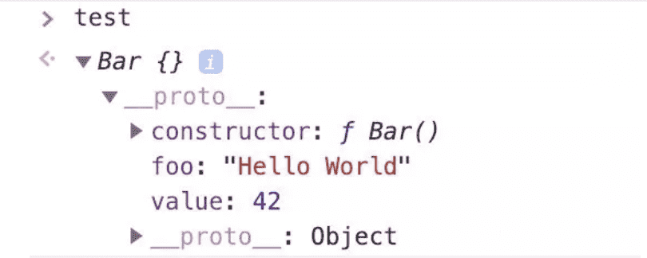
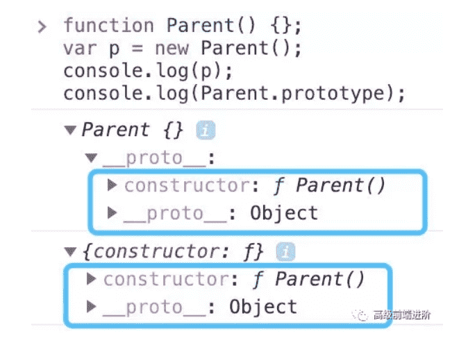
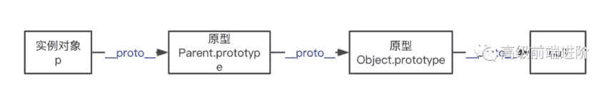
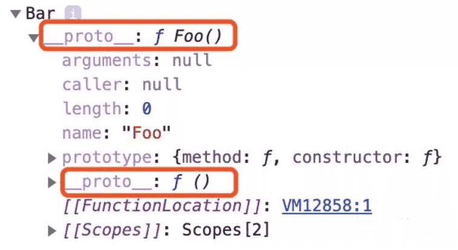
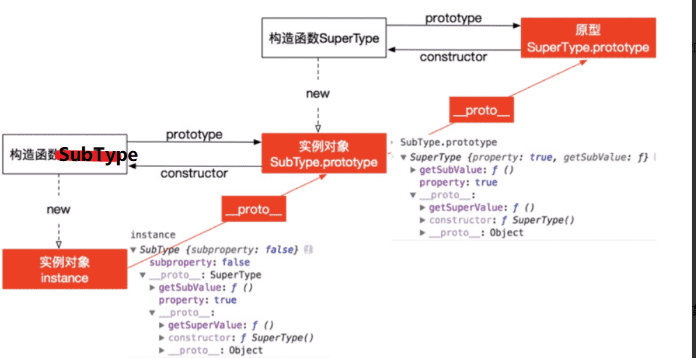
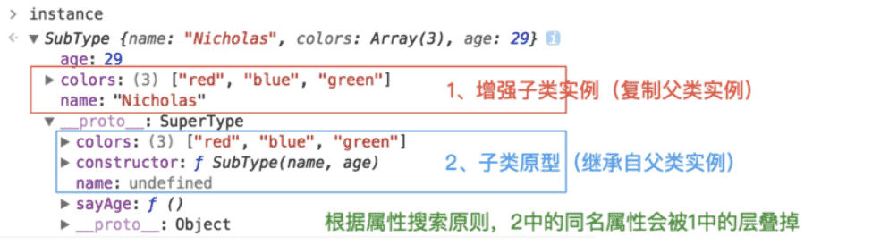
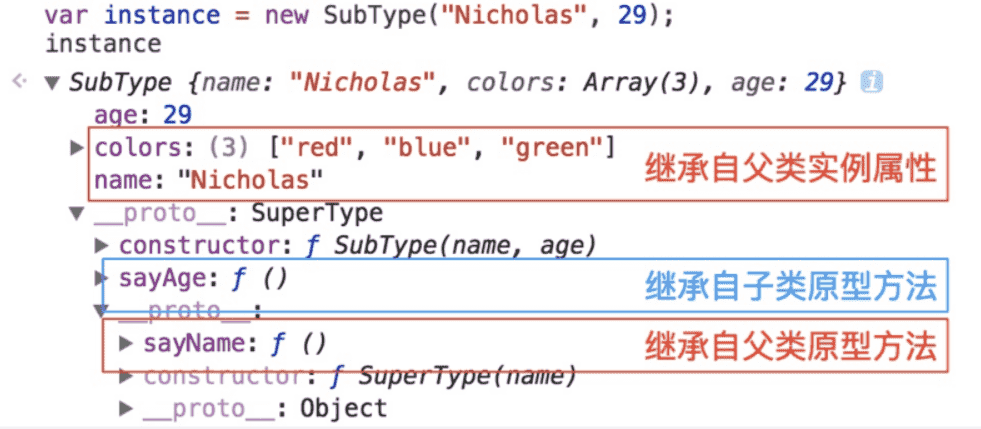

## 构造函数

### 什么是构造函数

:yum:`constructor` **返回创建实例对象时构造函数的引用**。**此属性的值是对函数本身的引用，而不是一个包含函数名称的字符串。**

```js
function Parent(age) {
    this.age = age;
}

var p = new Parent(50);
p.constructor === Parent; // true
p.constructor === Object; // false
```

构造函数本身就是一个函数，与普通函数没有任何区别，不过为了规范一般将其**首字母大写**。构造函数和普通函数的区别在于，**使用 `new` 生成实例的函数就是构造函数，直接调用的就是普通函数**。

那是不是意味着**普通函数创建的实例没有 `constructor` 属性呢？不一定。**

```js
// 普通函数
function parent2(age) {
    this.age = age;
}
var p2 = parent2(50);
// undefined

// 普通函数
function parent3(age) {
    return {
        age: age
    }
}
var p3 = parent3(50);
p3.constructor === Object; // true
```

### Symbol 是构造函数吗

MDN 是这样介绍 `Symbol` 的:

**`Symbol` 是基本数据类型**，但作为构造函数来说它并不完整，因为它不支持语法 `new Symbol()`，Chrome 认为其不是构造函数，如果要生成实例直接使用 `Symbol()` 即可。（来自 MDN）

```js
new Symbol(123); // Symbol is not a constructor 

Symbol(123); // Symbol(123)
```

:ox:虽然是基本数据类型，但  `Symbol(123)` 实例可以获取 `constructor` 属性值。

```js
var sym = Symbol(123); 
console.log( sym );
// Symbol(123)

console.log( sym.constructor );
// ƒ Symbol() { [native code] }
```

这里的  `constructor` 属性来自哪里？其实是 `Symbol` 原型上的，即 `Symbol.prototype.constructor` 返回创建实例原型的函数， 默认为 `Symbol` 函数。

### constructor 值只读吗

这个得分情况，对于引用类型来说 `constructor` 属性值是可以修改的，但是对于基本类型来说是只读的。

引用类型情况其值可修改这个很好理解，比如原型链继承方案中，就需要对 `constructor`重新赋值进行修正。

```js
function Foo() {
    this.value = 42;
}
Foo.prototype = {
    method: function() {}
};

function Bar() {}

// 设置 Bar 的 prototype 属性为 Foo 的实例对象
Bar.prototype = new Foo();
Bar.prototype.foo = 'Hello World';

Bar.prototype.constructor === Object;
// true

// 修正 Bar.prototype.constructor 为 Bar 本身
Bar.prototype.constructor = Bar;

var test = new Bar() // 创建 Bar 的一个新实例
console.log(test);
```



对于基本类型来说是只读的，比如 `1、“muyiy”、true、Symbol`，当然 `null` 和 `undefined`是没有 `constructor` 属性的。

```js
function Type() { };
var    types = [1, "muyiy", true, Symbol(123)];

for(var i = 0; i < types.length; i++) {
    types[i].constructor = Type;
    types[i] = [ types[i].constructor, types[i] instanceof Type, types[i].toString() ];
};

console.log( types.join("\n") );
// function Number() { [native code] }, false, 1
// function String() { [native code] }, false, muyiy
// function Boolean() { [native code] }, false, true
// function Symbol() { [native code] }, false, Symbol(123)
```

为什么呢？因为创建他们的是只读的原生构造函数（`native constructors`），这个例子也说明了依赖一个对象的 `constructor` 属性并不安全。

## 原型

### prototype

`JavaScript` 是一种**基于原型的语言** (prototype-based language)，这个和 `Java` 等基于类的语言不一样。

:star2:每个对象拥有一个**原型对象**，**对象以其原型为模板，从原型继承方法和属性，这些属性和方法定义在对象的构造器函数的 `prototype` 属性上，而非对象实例本身。**


从上面这张图可以发现，`Parent` 对象有一个原型对象 `Parent.prototype`，其上有两个属性，分别是 `constructor` 和 `__proto__`，其中 `__proto__` 已被弃用。

构造函数 `Parent` 有一个指向原型的指针，原型 `Parent.prototype` 有一个指向构造函数的指针 `Parent.prototype.constructor`，如上图所示，其实就是一个循环引用。


### __proto__

上图可以看到  Parent 原型（ `Parent.prototype` ）上有 `__proto__` 属性，这是一个**访问器属性**（即 getter 函数和 setter 函数），通过它可以访问到对象的内部 `[[Prototype]]` (一个对象或  `null` )。

`__proto__` 发音 dunder prototype，最先被 Firefox使用，后来在 ES6 被列为 Javascript 的标准内建属性。

`[[Prototype]]` 是对象的一个内部属性，外部代码无法直接访问。

::: tip

遵循 ECMAScript 标准，someObject.[[Prototype]] 符号用于指向 someObject 的原型。

:::



这里用 `p.__proto__` 获取对象的原型，`__proto__` 是每个实例上都有的属性，`prototype` 是构造函数的属性，这两个并不一样，但  `p.__proto__` 和 `Parent.prototype` 指向同一个对象。

```js
function Parent() {}
var p = new Parent();
p.__proto__ === Parent.prototype
// true
```

所以构造函数  `Parent`、`Parent.prototype` 和 `p` 的关系如下图。


### 注意点

`__proto__` 属性在 `ES6` 时才被标准化，以确保 Web 浏览器的兼容性，但是不推荐使用，除了标准化的原因之外还有性能问题。为了更好的支持，推荐使用 `Object.getPrototypeOf()`。

::: tip

通过改变一个对象的 `[[Prototype]]` 属性来改变和继承属性会对性能造成非常严重的影响，并且性能消耗的时间也不是简单的花费在 `obj.__proto__ = ...` 语句上, 它还会影响到所有继承自该 `[[Prototype]]` 的对象，如果你关心性能，你就不应该修改一个对象的 `[[Prototype]]`。

:::

如果要读取或修改对象的 `[[Prototype]]` 属性，建议使用如下方案，但是此时设置对象的 `[[Prototype]]` 依旧是一个缓慢的操作，如果性能是一个问题，就要避免这种操作。

```js
// 获取
Object.getPrototypeOf()
Reflect.getPrototypeOf()

// 修改
Object.setPrototypeOf()
Reflect.setPrototypeOf()
```

如果要创建一个新对象，同时继承另一个对象的  `[[Prototype]]` ，推荐使用 `Object.create()`。

```js
function Parent() {
    age: 50
};
var p = new Parent();
var child = Object.create(p);
```

这里 `child` 是一个新的空对象，有一个指向对象 p 的指针 `__proto__`。

## 原型链

每个对象拥有一个原型对象，通过 `__proto__` 指针指向上一个原型 ，并从中继承方法和属性，同时原型对象也可能拥有原型，这样一层一层，最终指向 `null`。这种关系被称为**原型链 (prototype chain)**，:yum:通过原型链一个对象会拥有定义在其他对象中的属性和方法。

我们看下面一个例子

```js
function Parent(age) {
    this.age = age;
}

var parent = new Parent(50);
parent.constructor === Parent; // true
```

这里 `parent.constructor` 指向 `Parent`，那是不是意味着 `parent` 实例存在 `constructor`属性呢？并不是。

我们打印下 `parent` 值就知道了。


由图可以看到实例对象 `p` 本身没有 `constructor` 属性，是通过原型链向上查找 `__proto__`，最终查找到 `constructor` 属性，该属性指向 `Parent`。

```js
function Parent(age) {
    this.age = age;
}
var p = new Parent(50);

p;    // Parent {age: 50}
p.__proto__ === Parent.prototype; // true
p.__proto__.__proto__ === Object.prototype; // true
p.__proto__.__proto__.__proto__ === null; // true
```

下图展示了原型链的运作机制。




### 小结

- `Symbol` 作为构造函数来说并不完整，因为不支持语法 `new Symbol()`，但其原型上拥有 `constructor` 属性，即 `Symbol.prototype.constructor`。


- 引用类型 `constructor` 属性值是可以修改的，但是对于基本类型来说是只读的，当然 `null` 和 `undefined` 没有 `constructor` 属性。


- `__proto__` 是每个实例上都有的属性，`prototype` 是构造函数的属性，这两个并不一样，但  `p.__proto__` 和 `Parent.prototype` 指向同一个对象。


- `__proto__` 属性在 `ES6` 时被标准化，但因为性能问题并不推荐使用，推荐使用 `Object.getPrototypeOf()`。


- 每个对象拥有一个原型对象，通过 `__proto__` 指针指向上一个原型 ，并从中继承方法和属性，同时原型对象也可能拥有原型，这样一层一层，最终指向 `null`，这就是原型链。

## 原型链


我们介绍了原型链的概念，即每个对象拥有一个原型对象，通过 `__proto__` 指针指向上一个原型 ，并从中**继承方法和属性**，同时原型对象也可能拥有原型，这样一层一层，最终指向 `null`，这种关系被称为**原型链 **(prototype chain)。

根据规范不建议直接使用 `__proto__`，推荐使用 `Object.getPrototypeOf()`，不过为了行文方便逻辑清晰，下面都以 `__proto__` 代替。

注意上面的说法，原型上的方法和属性被 **继承** 到新对象中，并不是被复制到新对象，我们看下面这个例子。

```js
// 木易杨
function Foo(name) {
    this.name = name;
}
Foo.prototype.getName = function() {
      return this.name;
}
Foo.prototype.length = 3;
let foo = new Foo('muyiy'); // 相当于 foo.__proto__ = Foo.prototype
console.dir(foo);
```


原型上的属性和方法定义在 `prototype` 对象上，而非对象实例本身。**当访问一个对象的属性 / 方法时，它不仅仅在该对象上查找，还会查找该对象的原型，以及该对象的原型的原型，一层一层向上查找，直到找到一个名字匹配的属性 / 方法或到达原型链的末尾（`null`）。**

::: tip 比如调用 `foo.valueOf()` 会发生什么？

- 首先检查 `foo` 对象是否具有可用的 `valueOf()` 方法。
- 如果没有，则检查 `foo` 对象的原型对象（即 `Foo.prototype`）是否具有可用的 `valueof()` 方法。
- 如果没有，则检查 `Foo.prototype` 所指向的对象的原型对象（即 `Object.prototype`）是否具有可用的 `valueOf()` 方法。这里有这个方法，于是该方法被调用。

:::


### prototype 和 __ proto __

上篇文章介绍了 `prototype` 和 `__proto__` 的区别，其中原型对象 `prototype` 是构造函数的属性，`__proto__` 是每个实例上都有的属性，这两个并不一样，但 `foo.__proto__` 和 `Foo.prototype` 指向同一个对象。

这次我们再深入一点，原型链的构建是依赖于 `prototype` 还是 `__proto__` 呢？


`Foo.prototype` 中的 `prototype` 并没有构建成一条原型链，其只是指向原型链中的某一处。原型链的构建依赖于 `__proto__`，如上图通过 `foo.__proto__` 指向 `Foo.prototype`，`foo.__proto__.__proto__` 指向 `Bichon.prototype`，如此一层一层最终链接到 `null`。

::: tip 可以这么理解 Foo:

我是一个 constructor，我也是一个 function，我身上有着 prototype 的 reference，只要随时调用 foo = new Foo()，我就会将 `foo.__proto__` 指向到我的 prototype 对象。

:::

不要使用 `Bar.prototype = Foo`，因为这不会执行 `Foo` 的原型，而是指向函数 `Foo`。 因此原型链将会回溯到 `Function.prototype` 而不是 `Foo.prototype`，因此 `method` 方法将不会在 Bar 的原型链上。

```js
// 木易杨
function Foo() {
      return 'foo';
}
Foo.prototype.method = function() {
      return 'method';
}
function Bar() {
      return 'bar';
}
Bar.prototype = Foo; // Bar.prototype 指向到函数
let bar = new Bar();
console.dir(bar);

bar.method(); // Uncaught TypeError: bar.method is not a function
```



### instanceof 原理及实现

`instanceof` 运算符用来检测 `constructor.prototype` 是否存在于参数 `object` 的原型链上。

```js
// 木易杨
function C(){} 
function D(){} 

var o = new C();

o instanceof C; // true，因为 Object.getPrototypeOf(o) === C.prototype
o instanceof D; // false，因为 D.prototype 不在 o 的原型链上
```

instanceof 原理就是一层一层查找 `__proto__`，如果和 `constructor.prototype` 相等则返回 true，如果一直没有查找成功则返回 false。

```js
instance.[__proto__...] === instance.constructor.prototype
```

知道了原理后我们来实现 instanceof，代码如下。

```js
// 木易杨
function instance_of(L, R) {//L 表示左表达式，R 表示右表达式
   var O = R.prototype;// 取 R 的显示原型
   L = L.__proto__;// 取 L 的隐式原型
   while (true) { 
       // Object.prototype.__proto__ === null
       if (L === null) 
         return false; 
       if (O === L)// 这里重点：当 O 严格等于 L 时，返回 true 
         return true; 
       L = L.__proto__; 
   } 
}

// 测试
function C(){} 
function D(){} 

var o = new C();

instance_of(o, C); // true
instance_of(o, D); // false
```

## 原型链继承

原型链继承的本质是**重写原型对象，代之以一个新类型的实例**。如下代码，新原型 `Cat` 不仅有 `new Animal()` **实例**上的全部属性和方法，并且由于指向了 `Animal` 原型，所以还继承了`Animal` **原型**上的属性和方法。

```js
// 木易杨
function Animal() {
    this.value = 'animal';
}

Animal.prototype.run = function() {
    return this.value + ' is runing';
}

function Cat() {}

// 这里是关键，创建 Animal 的实例，并将该实例赋值给 Cat.prototype
// 相当于 Cat.prototype.__proto__ = Animal.prototype
Cat.prototype = new Animal(); 

var instance = new Cat();
instance.value = 'cat'; // 创建 instance 的自身属性 value
console.log(instance.run()); // cat is runing
```

::: tip 原型链继承方案有以下缺点：

- 1、多个实例对引用类型的操作会被篡改
- 2、子类型的原型上的 constructor 属性被重写了
- 3、给子类型原型添加属性和方法必须在替换原型之后
- 4、创建子类型实例时无法向父类型的构造函数传参

:::

### 问题 1

原型链继承方案中，原型实际上会变成另一个类型的实例，如下代码，`Cat.prototype` 变成了 `Animal` 的一个实例，所以 `Animal` 的实例属性 `names` 就变成了 `Cat.prototype` 的属性。

而原型属性上的引用类型值会被所有实例共享，所以多个实例对引用类型的操作会被篡改。如下代码，改变了 `instance1.names` 后影响了 `instance2`。

```js
// 木易杨
function Animal(){
  this.names = ["cat", "dog"];
}
function Cat(){}

Cat.prototype = new Animal();

var instance1 = new Cat();
instance1.names.push("tiger");
console.log(instance1.names); // ["cat", "dog", "tiger"]

var instance2 = new Cat(); 
console.log(instance2.names); // ["cat", "dog", "tiger"]
```

### 问题 2

子类型原型上的 constructor 属性被重写了，执行 `Cat.prototype = new Animal()` 后原型被覆盖，`Cat.prototype` 上丢失了 constructor 属性， `Cat.prototype` 指向了 `Animal.prototype`，而 `Animal.prototype.constructor` 指向了 `Animal`，所以 `Cat.prototype.constructor` 指向了 `Animal`。

```js
Cat.prototype = new Animal(); 
Cat.prototype.constructor === Animal
// true
```


解决办法就是重写 `Cat.prototype.constructor` 属性，指向自己的构造函数 `Cat`。

```js
// 木易杨
function Animal() {
    this.value = 'animal';
}

Animal.prototype.run = function() {
    return this.value + ' is runing';
}

function Cat() {}
Cat.prototype = new Animal(); 

// 新增，重写 Cat.prototype 的 constructor 属性，指向自己的构造函数 Cat
Cat.prototype.constructor = Cat; 
```


### 问题 3

给子类型原型添加属性和方法必须在替换原型之后，原因在第二点已经解释过了，因为子类型的原型会被覆盖。

```js
// 木易杨
function Animal() {
    this.value = 'animal';
}

Animal.prototype.run = function() {
    return this.value + ' is runing';
}

function Cat() {}
Cat.prototype = new Animal(); 
Cat.prototype.constructor = Cat; 

// 新增
Cat.prototype.getValue = function() {
  return this.value;
}

var instance = new Cat();
instance.value = 'cat'; 
console.log(instance.getValue()); // cat
```

### 属性遮蔽

改造上面的代码，在 `Cat.prototype` 上添加 `run` 方法，但是 `Animal.prototype` 上也有一个 `run` 方法，不过它不会被访问到，这种情况称为属性遮蔽 (property shadowing)。

```js
// 木易杨
function Animal() {
    this.value = 'animal';
}

Animal.prototype.run = function() {
    return this.value + ' is runing';
}

function Cat() {}
Cat.prototype = new Animal(); 
Cat.prototype.constructor = Cat; 

// 新增
Cat.prototype.run = function() {
  return 'cat cat cat';
}

var instance = new Cat();
instance.value = 'cat'; 
console.log(instance.run()); // cat cat cat
```

那如何访问被遮蔽的属性呢？通过 `__proto__` 调用原型链上的属性即可。

```js
// 接上
console.log(instance.__proto__.__proto__.run()); // undefined is runing
```

### 小结

- 每个对象拥有一个原型对象，通过 `__proto__` 指针指向上一个原型 ，并从中**继承方法和属性**，同时原型对象也可能拥有原型，这样一层一层，最终指向 `null`，这种关系被称为**原型链**


- 当访问一个对象的属性 / 方法时，它不仅仅在该对象上查找，还会查找该对象的原型，以及该对象的原型的原型，一层一层向上查找，直到找到一个名字匹配的属性 / 方法或到达原型链的末尾（`null`）。


- 原型链的构建依赖于 `__proto__`，一层一层最终链接到 `null`。


- instanceof 原理就是一层一层查找 `__proto__`，如果和 `constructor.prototype` 相等则返回 true，如果一直没有查找成功则返回 false。


- 原型链继承的本质是**重写原型对象，代之以一个新类型的实例**。

## JavaScript常用八种继承方案

### 1、原型链继承

构造函数、原型和实例之间的关系：每个构造函数都有一个原型对象，原型对象都包含一个指向构造函数的指针，而实例都包含一个原型对象的指针。

继承的本质就是**复制，即重写原型对象，代之以一个新类型的实例**。

```js
function SuperType() {
    this.property = true;
}

SuperType.prototype.getSuperValue = function() {
    return this.property;
}

function SubType() {
    this.subproperty = false;
}

// 这里是关键，创建SuperType的实例，并将该实例赋值给SubType.prototype
SubType.prototype = new SuperType(); 

SubType.prototype.getSubValue = function() {
    return this.subproperty;
}

var instance = new SubType();
console.log(instance.getSuperValue()); // true
```



原型链方案存在的缺点：:ox:**多个实例对引用类型的操作会被篡改**。

```js
function SuperType(){
  this.colors = ["red", "blue", "green"];
}
function SubType(){}

SubType.prototype = new SuperType();

var instance1 = new SubType();
instance1.colors.push("black");
alert(instance1.colors); //"red,blue,green,black"

var instance2 = new SubType(); 
alert(instance2.colors); //"red,blue,green,black"
```

### 2、借用构造函数继承

使用父类的构造函数来增强子类**实例**，等同于复制父类的实例给子类（不使用原型）

```js
function  SuperType(){
    this.color=["red","green","blue"];
}
function  SubType(){
    //继承自SuperType
    SuperType.call(this);
}
var instance1 = new SubType();
instance1.color.push("black");
alert(instance1.color);//"red,green,blue,black"

var instance2 = new SubType();
alert(instance2.color);//"red,green,blue"
```

核心代码是`SuperType.call(this)`，创建子类实例时调用`SuperType`构造函数，于是`SubType`的每个实例都会将SuperType中的属性复制一份。

::: tip 缺点：

- :yum:只能继承父类的**实例**属性和方法，不能继承原型属性/方法
- 无法实现复用，每个子类都有父类实例函数的副本，影响性能

:::

### 3、组合继承

组合上述两种方法就是组合继承。**用原型链实现对原型属性和方法的继承**，**用借用构造函数技术来实现实例属性的继承。**

```js
function SuperType(name){
  this.name = name;
  this.colors = ["red", "blue", "green"];
}
SuperType.prototype.sayName = function(){
  alert(this.name);
};

function SubType(name, age){
  // 继承属性
  // 第二次调用SuperType()
  SuperType.call(this, name);
  this.age = age;
}

// 继承方法
// 构建原型链
// 第一次调用SuperType()
SubType.prototype = new SuperType(); 
// 重写SubType.prototype的constructor属性，指向自己的构造函数SubType
SubType.prototype.constructor = SubType; 
SubType.prototype.sayAge = function(){
    alert(this.age);
};

var instance1 = new SubType("Nicholas", 29);
instance1.colors.push("black");
alert(instance1.colors); //"red,blue,green,black"
instance1.sayName(); //"Nicholas";
instance1.sayAge(); //29

var instance2 = new SubType("Greg", 27);
alert(instance2.colors); //"red,blue,green"
instance2.sayName(); //"Greg";
instance2.sayAge(); //27
```



::: tip 缺点：

- 第一次调用`SuperType()`：给`SubType.prototype`写入两个属性name，color。
- 第二次调用`SuperType()`：给`instance1`写入两个属性name，color。

实例对象`instance1`上的两个属性就屏蔽了其原型对象SubType.prototype的两个同名属性。所以，组合模式的缺点就是在使用子类创建实例对象时，**其原型中会存在两份相同的属性/方法。让父亲的构造方法执行了两次.**

:::

### 4、原型式继承

利用一个空对象作为中介，将某个对象直接赋值给空对象构造函数的原型。

```js
function object(obj){
  function F(){}
  F.prototype = obj;
  return new F();
}
```

object()对传入其中的对象执行了一次`浅复制`，将构造函数F的原型直接指向传入的对象。

```js
var person = {
  name: "Nicholas",
  friends: ["Shelby", "Court", "Van"]
};

var anotherPerson = object(person);
anotherPerson.name = "Greg";
anotherPerson.friends.push("Rob");

var yetAnotherPerson = object(person);
yetAnotherPerson.name = "Linda";
yetAnotherPerson.friends.push("Barbie");

alert(person.friends);   //"Shelby,Court,Van,Rob,Barbie"
```

::: tip 缺点：

- 原型链继承多个实例的引用类型属性指向相同，存在篡改的可能。
- 无法传递参数

另外，ES5中存在`Object.create()`的方法，能够代替上面的object方法。

:::

### 5、寄生式继承

核心：在原型式继承的基础上，增强对象，返回构造函数

```js
function createAnother(original){
  var clone = object(original); // 通过调用 object() 函数创建一个新对象
  clone.sayHi = function(){  // 以某种方式来增强对象
    alert("hi");
  };
  return clone; // 返回这个对象
}
```

函数的主要作用是为构造函数新增属性和方法，以**增强函数**

```js
var person = {
  name: "Nicholas",
  friends: ["Shelby", "Court", "Van"]
};
var anotherPerson = createAnother(person);
anotherPerson.sayHi(); //"hi"
```

::: tip 缺点（同原型式继承）：

- 原型链继承多个实例的引用类型属性指向相同，存在篡改的可能。
- 无法传递参数

:::

### 6、寄生组合式继承

结合借用构造函数传递参数和寄生模式实现继承

```js
function inheritPrototype(subType, superType){
  var prototype = Object.create(superType.prototype); // 创建对象，创建父类原型的一个副本
  prototype.constructor = subType;                    // 增强对象，弥补因重写原型而失去的默认的constructor 属性
  subType.prototype = prototype;                      // 指定对象，将新创建的对象赋值给子类的原型
}

// 父类初始化实例属性和原型属性
function SuperType(name){
  this.name = name;
  this.colors = ["red", "blue", "green"];
}
SuperType.prototype.sayName = function(){
  alert(this.name);
};

// 借用构造函数传递增强子类实例属性（支持传参和避免篡改）
function SubType(name, age){
  SuperType.call(this, name);
  this.age = age;
}

// 将父类原型指向子类
inheritPrototype(SubType, SuperType);

// 新增子类原型属性
SubType.prototype.sayAge = function(){
  alert(this.age);
}

var instance1 = new SubType("xyc", 23);
var instance2 = new SubType("lxy", 23);

instance1.colors.push("2"); // ["red", "blue", "green", "2"]
instance1.colors.push("3"); // ["red", "blue", "green", "3"]
```



这个例子的高效率体现在它只调用了一次`SuperType` 构造函数，并且因此避免了在`SubType.prototype` 上创建不必要的、多余的属性。于此同时，原型链还能保持不变；因此，还能够正常使用`instanceof` 和`isPrototypeOf()`

**这是最成熟的方法，也是现在库实现的方法**

### 7、混入方式继承多个对象

```js
function MyClass() {
     SuperClass.call(this);
     OtherSuperClass.call(this);
}

// 继承一个类
MyClass.prototype = Object.create(SuperClass.prototype);
// 混合其它
Object.assign(MyClass.prototype, OtherSuperClass.prototype);
// 重新指定constructor
MyClass.prototype.constructor = MyClass;

MyClass.prototype.myMethod = function() {
     // do something
};
```

`Object.assign`会把  `OtherSuperClass`原型上的函数拷贝到 `MyClass`原型上，使 MyClass 的所有实例都可用 OtherSuperClass 的方法。

### 8、ES6类继承extends

`extends`关键字主要用于类声明或者类表达式中，以创建一个类，该类是另一个类的子类。其中`constructor`表示构造函数，一个类中只能有一个构造函数，有多个会报出`SyntaxError`错误,如果没有显式指定构造方法，则会添加默认的 `constructor`方法，使用例子如下。

```js
class Rectangle {
    // constructor
    constructor(height, width) {
        this.height = height;
        this.width = width;
    }
    
    // Getter
    get area() {
        return this.calcArea()
    }
    
    // Method
    calcArea() {
        return this.height * this.width;
    }
}

const rectangle = new Rectangle(10, 20);
console.log(rectangle.area);
// 输出 200

-----------------------------------------------------------------
// 继承
class Square extends Rectangle {

  constructor(length) {
    super(length, length);
    
    // 如果子类中存在构造函数，则需要在使用“this”之前首先调用 super()。
    this.name = 'Square';
  }

  get area() {
    return this.height * this.width;
  }
}

const square = new Square(10);
console.log(square.area);
// 输出 100
```

`extends`继承的核心代码如下，其实现和上述的寄生组合式继承方式一样

```js
function _inherits(subType, superType) {
  
    // 创建对象，创建父类原型的一个副本
    // 增强对象，弥补因重写原型而失去的默认的constructor 属性
    // 指定对象，将新创建的对象赋值给子类的原型
    subType.prototype = Object.create(superType && superType.prototype, {
        constructor: {
            value: subType,
            enumerable: false,
            writable: true,
            configurable: true
        }
    });
    
    if (superType) {
        Object.setPrototypeOf 
            ? Object.setPrototypeOf(subType, superType) 
            : subType.__proto__ = superType;
    }
}
```

### 总结

1、函数声明和类声明的区别

函数声明会提升，类声明不会。首先需要声明你的类，然后访问它，否则像下面的代码会抛出一个ReferenceError。

```js
let p = new Rectangle(); 
// ReferenceError

class Rectangle {}
复制代码
```

2、ES5继承和ES6继承的区别

- ES5的继承实质上是先创建子类的实例对象，然后再将父类的方法添加到this上（Parent.call(this)）.
- ES6的继承有所不同，实质上是先创建父类的实例对象this，然后再用子类的构造函数修改this。因为子类没有自己的this对象，所以必须先调用父类的super()方法，否则新建实例报错。

作者：木易杨说

链接：https://juejin.im/post/5bcb2e295188255c55472db0

来源：掘金