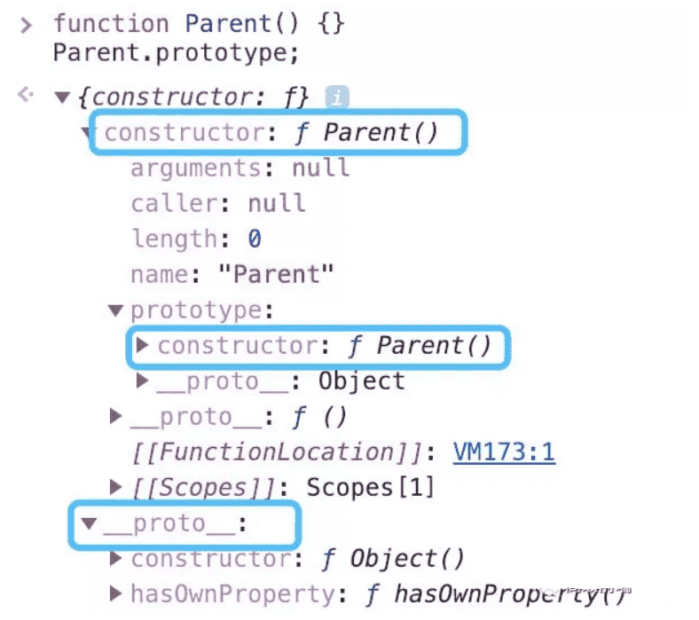
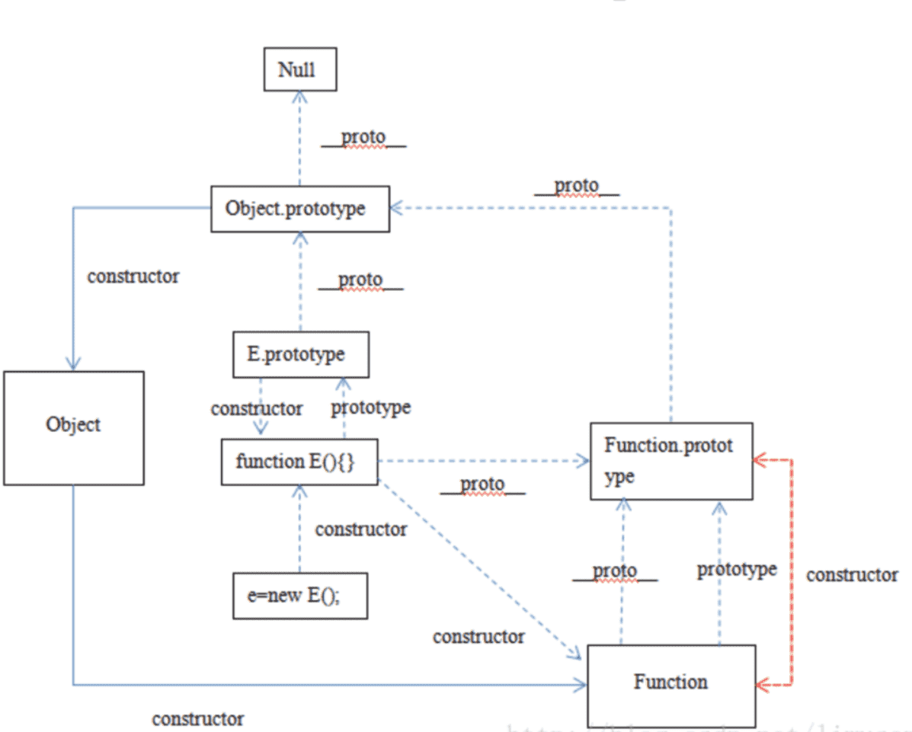
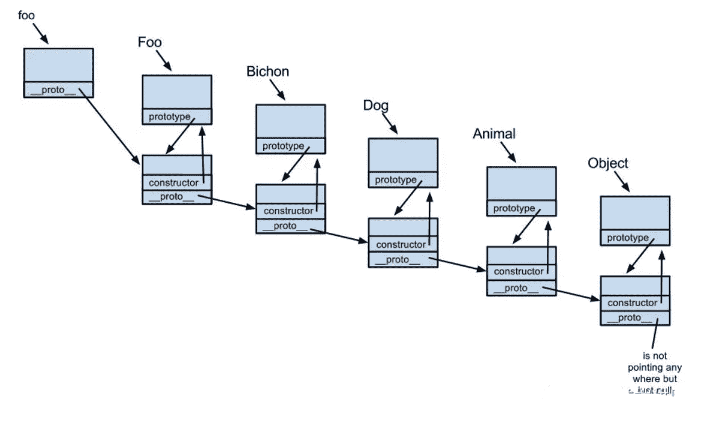

## 构造函数

### 什么是构造函数

:yum:`constructor` **返回创建实例对象时构造函数的引用**。**此属性的值是对函数本身的引用，而不是一个包含函数名称的字符串。**

```js
function Parent(age) {
    this.age = age;
}

var p = new Parent(50);
p.constructor === Parent; // true
p.constructor === Object; // false
```

构造函数本身就是一个函数，与普通函数没有任何区别，不过为了规范一般将其**首字母大写**。构造函数和普通函数的区别在于，**使用 `new` 生成实例的函数就是构造函数，直接调用的就是普通函数**。

那是不是意味着**普通函数创建的实例没有 `constructor` 属性呢？不一定。**

```js
// 普通函数
function parent2(age) {
    this.age = age;
}
var p2 = parent2(50);
// undefined

// 普通函数
function parent3(age) {
    return {
        age: age
    }
}
var p3 = parent3(50);
p3.constructor === Object; // true
```

### Symbol 是构造函数吗

MDN 是这样介绍 `Symbol` 的:

**`Symbol` 是基本数据类型**，但作为构造函数来说它并不完整，因为它不支持语法 `new Symbol()`，Chrome 认为其不是构造函数，如果要生成实例直接使用 `Symbol()` 即可。（来自 MDN）

```js
new Symbol(123); // Symbol is not a constructor 

Symbol(123); // Symbol(123)
```

:ox:虽然是基本数据类型，但  `Symbol(123)` 实例可以获取 `constructor` 属性值。

```js
var sym = Symbol(123); 
console.log( sym );
// Symbol(123)

console.log( sym.constructor );
// ƒ Symbol() { [native code] }
```

这里的  `constructor` 属性来自哪里？其实是 `Symbol` 原型上的，即 `Symbol.prototype.constructor` 返回创建实例原型的函数， 默认为 `Symbol` 函数。

### constructor 值只读吗

这个得分情况，对于引用类型来说 `constructor` 属性值是可以修改的，但是对于基本类型来说是只读的。

引用类型情况其值可修改这个很好理解，比如原型链继承方案中，就需要对 `constructor`重新赋值进行修正。

```js
function Foo() {
    this.value = 42;
}
Foo.prototype = {
    method: function() {}
};

function Bar() {}

// 设置 Bar 的 prototype 属性为 Foo 的实例对象
Bar.prototype = new Foo();
Bar.prototype.foo = 'Hello World';

Bar.prototype.constructor === Object;
// true

// 修正 Bar.prototype.constructor 为 Bar 本身
Bar.prototype.constructor = Bar;

var test = new Bar() // 创建 Bar 的一个新实例
console.log(test);
```


对于基本类型来说是只读的，比如 `1、“muyiy”、true、Symbol`，当然 `null` 和 `undefined`是没有 `constructor` 属性的。

```js
function Type() { };
var    types = [1, "muyiy", true, Symbol(123)];

for(var i = 0; i < types.length; i++) {
    types[i].constructor = Type;
    types[i] = [ types[i].constructor, types[i] instanceof Type, types[i].toString() ];
};

console.log( types.join("\n") );
// function Number() { [native code] }, false, 1
// function String() { [native code] }, false, muyiy
// function Boolean() { [native code] }, false, true
// function Symbol() { [native code] }, false, Symbol(123)
```

为什么呢？因为创建他们的是只读的原生构造函数（`native constructors`），这个例子也说明了依赖一个对象的 `constructor` 属性并不安全。

## 原型

### prototype

`JavaScript` 是一种**基于原型的语言** (prototype-based language)，这个和 `Java` 等基于类的语言不一样。

:star2:每个对象拥有一个**原型对象**，**对象以其原型为模板，从原型继承方法和属性，这些属性和方法定义在对象的构造器函数的 `prototype` 属性上，而非对象实例本身。**



从上面这张图可以发现，`Parent` 对象有一个原型对象 `Parent.prototype`，其上有两个属性，分别是 `constructor` 和 `__proto__`，其中 `__proto__` 已被弃用。

构造函数 `Parent` 有一个指向原型的指针，原型 `Parent.prototype` 有一个指向构造函数的指针 `Parent.prototype.constructor`，如上图所示，其实就是一个循环引用。


### __proto__

上图可以看到  Parent 原型（ `Parent.prototype` ）上有 `__proto__` 属性，这是一个**访问器属性**（即 getter 函数和 setter 函数），通过它可以访问到对象的内部 `[[Prototype]]` (一个对象或  `null` )。

`__proto__` 发音 dunder prototype，最先被 Firefox使用，后来在 ES6 被列为 Javascript 的标准内建属性。

`[[Prototype]]` 是对象的一个内部属性，外部代码无法直接访问。

::: tip

遵循 ECMAScript 标准，someObject.[[Prototype]] 符号用于指向 someObject 的原型。

:::


这里用 `p.__proto__` 获取对象的原型，`__proto__` 是每个实例上都有的属性，`prototype` 是构造函数的属性，这两个并不一样，但  `p.__proto__` 和 `Parent.prototype` 指向同一个对象。

```js
function Parent() {}
var p = new Parent();
p.__proto__ === Parent.prototype
// true
```

所以构造函数  `Parent`、`Parent.prototype` 和 `p` 的关系如下图。


### 注意点

`__proto__` 属性在 `ES6` 时才被标准化，以确保 Web 浏览器的兼容性，但是不推荐使用，除了标准化的原因之外还有性能问题。为了更好的支持，推荐使用 `Object.getPrototypeOf()`。

::: tip

通过改变一个对象的 `[[Prototype]]` 属性来改变和继承属性会对性能造成非常严重的影响，并且性能消耗的时间也不是简单的花费在 `obj.__proto__ = ...` 语句上, 它还会影响到所有继承自该 `[[Prototype]]` 的对象，如果你关心性能，你就不应该修改一个对象的 `[[Prototype]]`。

:::

如果要读取或修改对象的 `[[Prototype]]` 属性，建议使用如下方案，但是此时设置对象的 `[[Prototype]]` 依旧是一个缓慢的操作，如果性能是一个问题，就要避免这种操作。

```js
// 获取
Object.getPrototypeOf()
Reflect.getPrototypeOf()

// 修改
Object.setPrototypeOf()
Reflect.setPrototypeOf()
```

如果要创建一个新对象，同时继承另一个对象的  `[[Prototype]]` ，推荐使用 `Object.create()`。

```js
function Parent() {
    age: 50
};
var p = new Parent();
var child = Object.create(p);
```

这里 `child` 是一个新的空对象，有一个指向对象 p 的指针 `__proto__`。

## 原型链

每个对象拥有一个原型对象，通过 `__proto__` 指针指向上一个原型 ，并从中继承方法和属性，同时原型对象也可能拥有原型，这样一层一层，最终指向 `null`。这种关系被称为**原型链 (prototype chain)**，:yum:通过原型链一个对象会拥有定义在其他对象中的属性和方法。

我们看下面一个例子

```js
function Parent(age) {
    this.age = age;
}

var parent = new Parent(50);
parent.constructor === Parent; // true
```

这里 `parent.constructor` 指向 `Parent`，那是不是意味着 `parent` 实例存在 `constructor`属性呢？并不是。

我们打印下 `parent` 值就知道了。


由图可以看到实例对象 `p` 本身没有 `constructor` 属性，是通过原型链向上查找 `__proto__`，最终查找到 `constructor` 属性，该属性指向 `Parent`。

```js
function Parent(age) {
    this.age = age;
}
var p = new Parent(50);

p;    // Parent {age: 50}
p.__proto__ === Parent.prototype; // true
p.__proto__.__proto__ === Object.prototype; // true
p.__proto__.__proto__.__proto__ === null; // true
```

下图展示了原型链的运作机制。




## 小结

- `Symbol` 作为构造函数来说并不完整，因为不支持语法 `new Symbol()`，但其原型上拥有 `constructor` 属性，即 `Symbol.prototype.constructor`。


- 引用类型 `constructor` 属性值是可以修改的，但是对于基本类型来说是只读的，当然 `null` 和 `undefined` 没有 `constructor` 属性。


- `__proto__` 是每个实例上都有的属性，`prototype` 是构造函数的属性，这两个并不一样，但  `p.__proto__` 和 `Parent.prototype` 指向同一个对象。


- `__proto__` 属性在 `ES6` 时被标准化，但因为性能问题并不推荐使用，推荐使用 `Object.getPrototypeOf()`。


- 每个对象拥有一个原型对象，通过 `__proto__` 指针指向上一个原型 ，并从中继承方法和属性，同时原型对象也可能拥有原型，这样一层一层，最终指向 `null`，这就是原型链。

## 原型链


我们介绍了原型链的概念，即每个对象拥有一个原型对象，通过 `__proto__` 指针指向上一个原型 ，并从中**继承方法和属性**，同时原型对象也可能拥有原型，这样一层一层，最终指向 `null`，这种关系被称为**原型链 **(prototype chain)。

根据规范不建议直接使用 `__proto__`，推荐使用 `Object.getPrototypeOf()`，不过为了行文方便逻辑清晰，下面都以 `__proto__` 代替。

注意上面的说法，原型上的方法和属性被 **继承** 到新对象中，并不是被复制到新对象，我们看下面这个例子。

```js
// 木易杨
function Foo(name) {
    this.name = name;
}
Foo.prototype.getName = function() {
      return this.name;
}
Foo.prototype.length = 3;
let foo = new Foo('muyiy'); // 相当于 foo.__proto__ = Foo.prototype
console.dir(foo);
```


原型上的属性和方法定义在 `prototype` 对象上，而非对象实例本身。**当访问一个对象的属性 / 方法时，它不仅仅在该对象上查找，还会查找该对象的原型，以及该对象的原型的原型，一层一层向上查找，直到找到一个名字匹配的属性 / 方法或到达原型链的末尾（`null`）。**

比如调用 `foo.valueOf()` 会发生什么？

- 首先检查 `foo` 对象是否具有可用的 `valueOf()` 方法。
- 如果没有，则检查 `foo` 对象的原型对象（即 `Foo.prototype`）是否具有可用的 `valueof()` 方法。
- 如果没有，则检查 `Foo.prototype` 所指向的对象的原型对象（即 `Object.prototype`）是否具有可用的 `valueOf()` 方法。这里有这个方法，于是该方法被调用。


### prototype 和 __ proto __

上篇文章介绍了 `prototype` 和 `__proto__` 的区别，其中原型对象 `prototype` 是构造函数的属性，`__proto__` 是每个实例上都有的属性，这两个并不一样，但 `foo.__proto__` 和 `Foo.prototype` 指向同一个对象。

这次我们再深入一点，原型链的构建是依赖于 `prototype` 还是 `__proto__` 呢？



`Foo.prototype` 中的 `prototype` 并没有构建成一条原型链，其只是指向原型链中的某一处。原型链的构建依赖于 `__proto__`，如上图通过 `foo.__proto__` 指向 `Foo.prototype`，`foo.__proto__.__proto__` 指向 `Bichon.prototype`，如此一层一层最终链接到 `null`。

::: tip 可以这么理解 Foo:

我是一个 constructor，我也是一个 function，我身上有着 prototype 的 reference，只要随时调用 foo = new Foo()，我就会将 `foo.__proto__` 指向到我的 prototype 对象。

:::

不要使用 `Bar.prototype = Foo`，因为这不会执行 `Foo` 的原型，而是指向函数 `Foo`。 因此原型链将会回溯到 `Function.prototype` 而不是 `Foo.prototype`，因此 `method` 方法将不会在 Bar 的原型链上。

```js
// 木易杨
function Foo() {
      return 'foo';
}
Foo.prototype.method = function() {
      return 'method';
}
function Bar() {
      return 'bar';
}
Bar.prototype = Foo; // Bar.prototype 指向到函数
let bar = new Bar();
console.dir(bar);

bar.method(); // Uncaught TypeError: bar.method is not a function
```


### instanceof 原理及实现

`instanceof` 运算符用来检测 `constructor.prototype` 是否存在于参数 `object` 的原型链上。

```js
// 木易杨
function C(){} 
function D(){} 

var o = new C();

o instanceof C; // true，因为 Object.getPrototypeOf(o) === C.prototype
o instanceof D; // false，因为 D.prototype 不在 o 的原型链上
```

instanceof 原理就是一层一层查找 `__proto__`，如果和 `constructor.prototype` 相等则返回 true，如果一直没有查找成功则返回 false。

```js
instance.[__proto__...] === instance.constructor.prototype
```

知道了原理后我们来实现 instanceof，代码如下。

```js
// 木易杨
function instance_of(L, R) {//L 表示左表达式，R 表示右表达式
   var O = R.prototype;// 取 R 的显示原型
   L = L.__proto__;// 取 L 的隐式原型
   while (true) { 
       // Object.prototype.__proto__ === null
       if (L === null) 
         return false; 
       if (O === L)// 这里重点：当 O 严格等于 L 时，返回 true 
         return true; 
       L = L.__proto__; 
   } 
}

// 测试
function C(){} 
function D(){} 

var o = new C();

instance_of(o, C); // true
instance_of(o, D); // false
```

## 原型链继承

