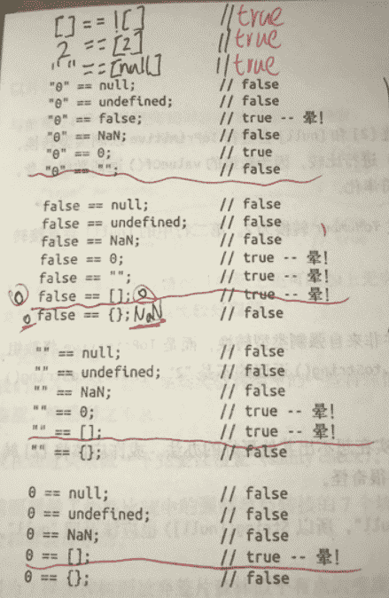

```js
Boolean([]); //true
Boolean({});//true
Number([]); //0
Number({}); // NaN
Number(false); //0
```

因此：

```js
console.log(([])?true:fasle);// => console.log((true)?true:false);
console.log([]==false?true:false); // => console.log(0==0?true:false);
console.log(({}==false)?true:false); // => console.log((NaN==0)?true:false);
```

#### 《JavaScript权威指南》的部分相关知识点

------

**“==”运算符（两个操作数的类型不相同时）**

- 如果一个值是null，另一个值是undefined，则它们相等
- 如果一个值是数字，另一个值是字符串，先将字符串转换为数学，然后使用转换后的值进行比较。
- 如果其中一个值是true，则将其转换为1再进行比较。如果其中的一个值是false，则将其转换为0再进行比较。
- 如果一个值是对象，另一个值是数字或字符串，则将对象转换为原始值，再进行比较。

------

**对象到数字的转换**

- 如果对象具有valueOf()方法，后者返回一个原始值，则JavaScript将这个原始值转换为数字（如果需要的话）并返回一个数字。
- 否则，如果对象具有toString()方法，后者返回一个原始值，则JavaScript将其转换并返回。（对象的toString()方法返回一个字符串直接量（作者所说的原始值），JavaScript将这个字符串转换为数字类型，并返回这个数字）。
- 否则，JavaScript抛出一个类型错误异常。

------

**空数组转换为数字0**

- 数组继承了默认的valueOf()方法，这个方法返回一个对象而不是一个原始值，因此，数组到数学的转换则调用toString()方法。空数组转换为空字符串，空字符串转换为数字0.

**假值列表**

除了常规的布尔值 `true`和 `false`之外，JavaScript还将所有其他值视为 **‘truthy’**或**‘falsy’**。

除非另有定义，否则 **JavaScript 中的所有值都是'truthy'**，除了 `0`， `“”`， `null`， `undefined`， `NaN`，当然还有 `false`，这些都是'falsy'。

::: tip 假值列表

- 0（包括+0、-0）
- null
- undefined
- NaN
- false

:::

| 数据类型  | 转换为true的值               | 转换为false的值 |
| --------- | ---------------------------- | --------------- |
| Boolean   | true                         | false           |
| String    | 任何非空字符串               | 空字符串        |
| Number    | 任何非零数字值（包括无穷大） | 0和NaN          |
| Object    | 任何对象                     | null            |
| Undefined |                              | Undefined       |

==**假值相等比较**



::: tip typeof

typeof Symbol()    //"symbol"

typeof Number()    //"number"

typeof String()    //"string"

typeof Function()    //"function"

typeof Array()       //"object"

typeof Object()    //"object"

typeof Boolean()    //"boolean"

typeof null    //"object"

typeof undefined    //"undefined"

:::