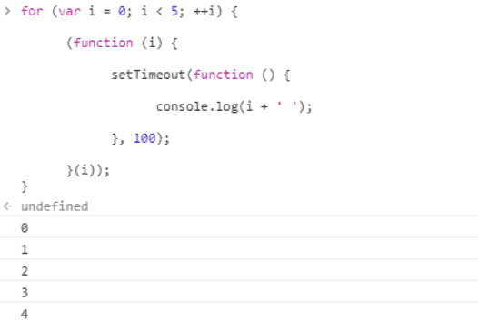

## 一、什么是闭包

闭包，官方对闭包的解释是：一个拥有许多变量和绑定了这些变量的环境的表达式（通常是一个函数），因而这些变量也是该表达式的一部分。闭包的特点：
　　1. 作为一个函数变量的一个引用，当函数返回时，其处于激活状态。
　　2. 一个闭包就是当一个函数返回时，一个没有释放资源的栈区。
　　**简单的说，Javascript允许使用内部函数---即函数定义和函数表达式位于另一个函数的函数体内。而且，这些内部函数可以访问它们所在的外部函数中声明的所有局部变量、参数和声明的其他内部函数。当其中一个这样的内部函数在包含它们的外部函数之外被调用时，就会形成闭包。**

::: tip 我们首先知道闭包有3个特性：

**①函数嵌套函数**

**②函数内部可以引用函数外部的参数和变量**

**③参数和变量不会被垃圾回收机制回收**

:::

## 二、闭包两种的主要形式

### **①函数作为返回值**

在这段代码中，a()中的返回值是一个匿名函数，这个函数在a()作用域内部，所以它可以获取a()作用域下变量name的值，将这个值作为返回值赋给全局作用域下的变量b,实现了在全局变量下获取到局部变量中的变量的值

再来看一个闭包的经典例子

一般情况下，在函数fn执行完后，就应该连同它里面的变量一同被销毁，但是在这个例子中，匿名函数作为fn的返回值被赋值给了fn1，这时候相当于fn1=function(){var n = 0 ... }，并且**匿名函数内部引用着fn里的变量num，所以变量num无法被销毁，而变量n是每次被调用时新创建的**，所以每次fn1执行完后它就把属于自己的变量连同自己一起销毁，于是乎最后就剩下孤零零的num，于是这里就产生了**内存消耗**的问题。

**再来看一个经典例子-定时器与闭包**

写一个for循环，让它按顺序打印出当前循环次数

按照预期它应该依次输出1 2 3 4 5，而结果它输出了五次5，这是为什么呢？原来由于js是单线程的，所以在执行for循环的时候**定时器setTimeout被安排到任务队列中排队等待执行**，而在等待过程中for循环就已经在执行，等到setTimeout可以执行的时候，for循环已经结束，i的值也已经编程5，所以打印出来五个5，那么我们为了实现预期结果应该怎么改这段代码呢？（ps:如果把for循环里面的var变成let，也能实现预期结果）

**引入闭包来保存变量i**，将setTimeout放入立即执行函数中，将for循环中的循环值i作为参数传递，100毫秒后同时打印出1 2 3 4 5

那如果我们想实现每隔100毫秒分别依次输出数字，又该怎么改呢?

在这段代码中，相当于同时启动3个定时器，i*100是为4个定时器分别设置了不同的时间，同时启动，但是执行时间不同，每个定时器间隔都是100毫秒，实现了每隔100毫秒就执行一次打印的效果。

### **②闭包作为参数传递**

在这段代码中，函数fn1作为参数传入立即执行函数中，在执行到fn2(30)的时候，30作为参数传入fn1中，这时候if(x>num)中的num取的并不是立即执行函数中的num，而是取创建函数的作用域中的num这里函数创建的作用域是全局作用域下，所以num取的是全局作用域中的值15，即30>15，打印30

## 三、闭包的好处与坏处

### 好处

①**保护函数内的变量安全** ，实现封装，防止变量流入其他环境发生命名冲突

②**在内存中维持一个变量**，可以做缓存（但使用多了同时也是一项缺点，消耗内存）

③**匿名自执行函数可以减少内存消耗**

④**设计私有方法和变量**

### 坏处

①其中一点上面已经有体现了，就是被引用的私有变量不能被销毁，增大了内存消耗，**造成内存泄漏**，解决方法是可以在使用完变量后手动为它赋值为null；

②其次由于闭包涉及跨域访问，所以会导致性能损失，我们可以通过把跨作用域变量存储在局部变量中，然后直接访问局部变量，来减轻对执行速度的影响

作者：dovlie 
来源：CSDN 
原文：https://blog.csdn.net/dovlie/article/details/76339244 

::: tip

一个函数可以访问在它的调用上下文中定义的变量，这个就是词法作用域（Lexical scope）。

首先，函数定义可以存储在变量中，函数定义在程序调用之前是不可见的。其次，每次调用函数时，都会(临时)创建一个本地执行上下文。当函数完成时，执行上下文将消失。函数在遇到return或右括号}时执行完成。

我将永远记住闭包的方法是通过背包的类比。当一个函数被创建并传递或从另一个函数返回时，它会携带一个背包。背包中是函数声明时作用域内的所有变量。

:::