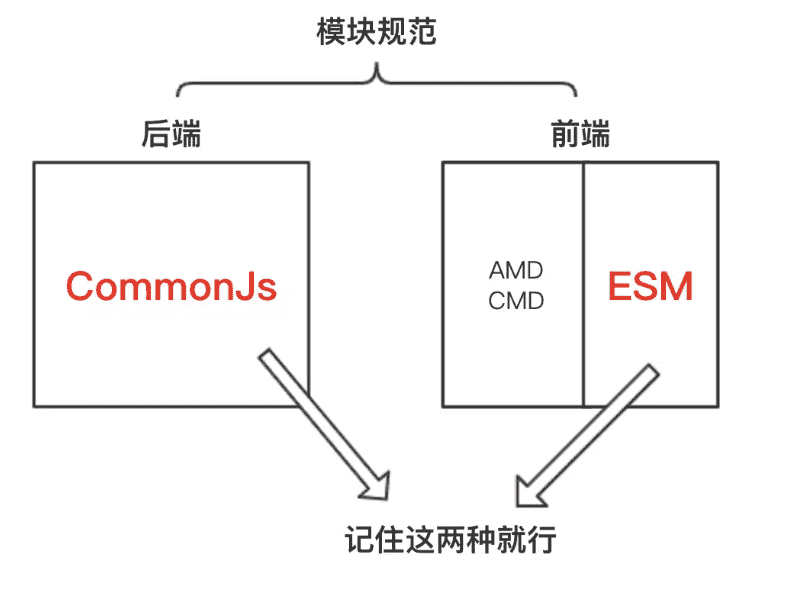

## node 初识

### node 是什么

首先 node 不是一门后台语言而是一个环境，一个能够让 js 运行在服务器的环境，这个环境就好比是服务器上的浏览器（虽然不是很恰当），但正是因为有了它才使得 js 变成了一门后台语言。

### node 遵循的规范

其次 node 遵循的是 CommonJs 规范，什么意思？其实就是规定了导入导出的方式😬，就向下面这样：

```
require('./module')
module.exports = {
    a: 1,
}
exports.a = 1;
复制代码
```

这就是 node 的规范，用 `require` 导入、用 `module.exports` 导出。那 node 为什么不支持 ESM（就是用 `import` 导入、用 `export` 导出）规范呢，因为它出现的比较早，仅此而已，然后一时半会儿还改不过来，以后应就会支持了。另外，我们时常在 webpack 里看到 `require()` 字样却没有看见 `import()` 就是因为 webpack 是要用 node 来执行的，而 node 目前只支持 `require()`。
 这里顺带来一张各种规范图（这种东西容易忘，当作历史看看就行🙄），如下：



### require 寻找依赖

`require()` 里面的参数有两种写法，一种带路径一种不带路径。就像下面这样：

```
require('./module'); // 带相对路径
require('/module'); // 带绝对路径
require('module'); // 不带路径
复制代码
```

这种不带路径的 `require('module')` 引入方式，可能是内置模块，也可能是第三方模块，内置模块优先查找，没有的话就是第三方模块了，它会先从当前目录的 `node_modules` 里面查找，没有的话就到父目录下的 `node_modules` 里面去找，如此向上追溯，直到根目录下的 `node_modules` 目录，要是还没有的话就会到全局里面去找，大概是这么一个搜索过程。
 另外一种带路径的方式，就会沿着路径去找，如果没有找到则会尝试将当前目录作一个包来加载。此外，使用绝对路径的速度查找最快，当然了，node 也对路径查找做了缓存机制。

 