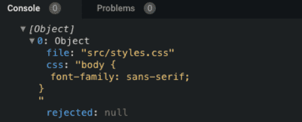

## 1 状态共享

随着组件的细化，就会遇到多组件状态共享的情况，`Vuex`当然可以解决这类问题，不过就像`Vuex`官方文档所说的，如果应用不够大，为避免代码繁琐冗余，最好不要使用它，今天我们介绍的是vue.js 2.6新增加的[Observable API](https://link.juejin.im?target=https%3A%2F%2Fvuejs.org%2Fv2%2Fapi%2F%23Vue-observable) ，通过使用这个api我们可以应对一些简单的跨组件数据状态共享的情况。

如下这个例子，我们将在组件外创建一个`store`，然后在`App.vue`组件里面使用store.js提供的`store`和`mutation`方法，同理其它组件也可以这样使用，从而实现多个组件共享数据状态。

首先创建一个store.js，包含一个`store`和一个`mutations`，分别用来指向数据和处理方法。

```js
import Vue from "vue";

export const store = Vue.observable({ count: 0 });

export const mutations = {
  setCount(count) {
    store.count = count;
  }
};
```

然后在`App.vue`里面引入这个store.js，在组件里面使用引入的数据和方法

```vue
<template>
  <div id="app">
    
    <p>count:{{count}}</p>
    <button @click="setCount(count+1)">+1</button>
    <button @click="setCount(count-1)">-1</button>
  </div>
</template>

<script>
import { store, mutations } from "./store";
export default {
  name: "App",
  computed: {
    count() {
      return store.count;
    }
  },
  methods: {
    setCount: mutations.setCount
  }
};
</script>

<style>
```

## 2 长列表性能优化

我们应该都知道`vue`会通过`object.defineProperty`对数据进行劫持，来实现视图响应数据的变化，然而有些时候我们的组件就是纯粹的数据展示，不会有任何改变，我们就不需要`vue`来劫持我们的数据，在大量数据展示的情况下，这能够很明显的减少组件初始化的时间，那如何禁止`vue`劫持我们的数据呢？可以通过`object.freeze`方法来冻结一个对象，一旦被冻结的对象就再也不能被修改了。

```js
export default {
  data: () => ({
    users: {}
  }),
  async created() {
    const users = await axios.get("/api/users");
    this.users = Object.freeze(users);
  }
};
```

另外需要说明的是，这里只是冻结了`users`的值，引用不会被冻结，当我们需要`reactive`数据的时候，我们可以重新给`users`赋值。

```js
export default {
  data: () => ({
    users: []
  }),
  async created() {
    const users = await axios.get("/api/users");
    this.users = Object.freeze(users);
  },
  methods:{
    // 改变值不会触发视图响应
    this.users[0] = newValue
    // 改变引用依然会触发视图响应
    this.users = newArray
  }
};
```

## 3 去除多余的样式

随着项目越来越大，书写的不注意，不自然的就会产生一些多余的css，小项目还好，一旦项目大了以后，多余的css会越来越多，导致包越来越大，从而影响项目运行性能，所以有必要在正式环境去除掉这些多余的css，这里推荐一个库[purgecss](https://link.juejin.im?target=https%3A%2F%2Fwww.purgecss.com%2F)，支持CLI、JavascriptApi、Webpack等多种方式使用，通过这个库，我们可以很容易的去除掉多余的css。

```html
<h1>Hello Vanilla!</h1>
<div>
  We use Parcel to bundle this sandbox, you can find more info about Parcel
  <a href="https://parceljs.org" target="_blank" rel="noopener noreferrer">here</a>.
</div>
```

```css
body {
  font-family: sans-serif;
}
a {
  color: red;
}
ul {
  li {
    list-style: none;
  }
}
```

```js
import Purgecss from "purgecss";
const purgecss = new Purgecss({
  content: ["**/*.html"],
  css: ["**/*.css"]
});
const purgecssResult = purgecss.purge();
```

最终产生的`purgecssResult`结果如下，可以看到多余的`a`和`ul`标签的样式都没了	

