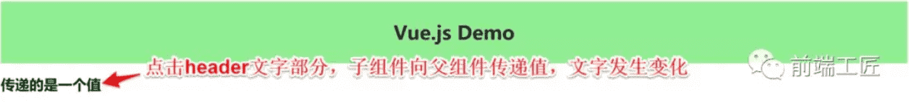
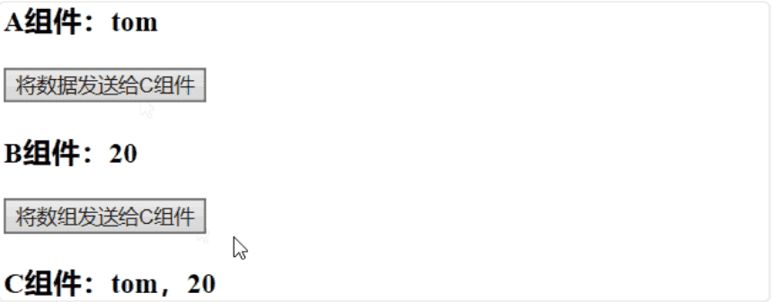

## 前言

组件是 vue.js最强大的功能之一，而组件实例的作用域是相互独立的，这就意味着不同组件之间的数据无法相互引用。一般来说，组件可以有以下几种关系：


如上图所示，A 和 B、B 和 C、B 和 D 都是父子关系，C 和 D 是兄弟关系，A 和 C 是隔代关系（可能隔多代）。

针对不同的使用场景，如何选择行之有效的通信方式？这是我们所要探讨的主题。本文总结了vue组件间通信的几种方式，如props、 `$emit`/ `$on`、vuex、 `$parent` / `$children`、 `$attrs`/ `$listeners`和provide/inject，以通俗易懂的实例讲述这其中的差别及使用场景，希望对小伙伴有些许帮助。

本文的代码请猛戳https://github.com/ljianshu/Blog，纸上得来终觉浅，大家动手多敲敲代码！

## 方法一、 `props　`/ `$emit`

父组件A通过props的方式向子组件B传递，B to A 通过在 B 组件中 $emit, A 组件中 v-on 的方式实现。

### 1.父组件向子组件传值

接下来我们通过一个例子，说明父组件如何向子组件传递值：在子组件Users.vue中如何获取父组件App.vue中的数据 `users:["Henry","Bucky","Emily"]`

```js
//App.vue父组件
<template>
  <div id="app">
    <users v-bind:users="users"></users>//前者自定义名称便于子组件调用，后者要传递数据名
 </div>
</template>
<script>
import Users from "./components/Users"
export default {
  name: 'App',
  data(){   
	return{
      users:["Henry","Bucky","Emily"]
    }
  },
  components:{  
	"users":Users
  }
}
```

```js
//users子组件
<template>  
    <div class="hello">    
        <ul>      
        <li v-for="user in users">{{user}}</li>//遍历传递过来的值，然后呈现到页面    
		</ul>  
	</div>
</template>
<script>
export default {  
	name: 'HelloWorld',  
    props:{    
        users:{           //这个就是父组件中子标签自定义名字      
            type:Array,      
            required:true    
        }  
    }
}
</script>
```

总结：**父组件通过props向下传递数据给子组件。注：组件中的数据共有三种形式：data、props、computed**

### 2.子组件向父组件传值（通过事件形式）

接下来我们通过一个例子，说明子组件如何向父组件传递值：当我们点击“Vue.js Demo”后，子组件向父组件传递值，文字由原来的“传递的是一个值”变成“子向父组件传值”，实现子组件向父组件值的传递。



```js
// 子组件
<template>
<header>
    <h1 @click="changeTitle">{{title}}</h1>//绑定一个点击事件
</header>
</template>
<script>
export default{
  name: 'app-header',
  data() {   
      return{
      title:"Vue.js Demo"
    }
  },
  methods:{
    changeTitle() {     
        this.$emit("titleChanged","子向父组件传值");//自定义事件  传递值“子向父组件传值”
    }
  }
}
</script>
```

```js
// 父组件
<template>
  <div id="app">
    <app-header v-on:titleChanged="updateTitle"></app-header>//与子组件titleChanged自定义事件保持一致
// updateTitle($event)接受传递过来的文字 
<h2>{{title}}</h2>
  </div>
</template>
<script>
import Header from "./components/Header"
export default {
  name: 'App',
  data(){   
      return{
      title:"传递的是一个值"
    }
  },
  methods:{
    updateTitle(e){   //声明这个函数    
        this.title = e;
    }
  },
  components:{   
      "app-header":Header,
  }
}
</script>
```

**总结：子组件通过events给父组件发送消息，实际上就是子组件把自己的数据发送到父组件。**

## 方法二、 `$emit　`/ `$on`

**这种方法通过一个空的Vue实例作为中央事件总线（事件中心），用它来触发事件和监听事件,巧妙而轻量地实现了任何组件间的通信，包括父子、兄弟、跨级**。当我们的项目比较大时，可以选择更好的状态管理解决方案vuex。

#### 1.具体实现方式：

```js
    var Event=new Vue();    
    Event.$emit(事件名,数据);    
    Event.$on(事件名,data => {});
```

#### 2.举个例子

假设兄弟组件有三个，分别是A、B、C组件，C组件如何获取A或者B组件的数据

```js
<div id="itany">   
    <my-a></my-a>
	<my-b></my-b>
	<my-c></my-c>
</div>
<template id="a">  
  <div>   
    <h3>A组件：{{name}}</h3>  
	<button @click="send">将数据发送给C组件</button> 
  </div>
</template>
<template id="b"> 
  <div>   
	<h3>B组件：{{age}}</h3>   
	<button @click="send">将数组发送给C组件</button> 
  </div>
</template>
<template id="c"> 
  <div>   
	<h3>C组件：{{name}}，{{age}}</h3>
  </div>
</template>
<script>
var Event  = new Vue();//定义一个空的Vue实例
var A = {
    template: '#a',
    data() {     
        return {
        name: 'tom'
      }
    },
    methods: {
      send() {       
          Event.$emit('data-a', this.name);
      }
    }
}
var B = {
    template: '#b',
    data() {     
        return {
        age: 20
      }
    },
    methods: {
      send() {       
          Event.$emit('data-b', this.age);
      }
    }
}
var C = {
    template: '#c',
    data() {     
        return {
        name: '',
        age: ""
      }
    },
    mounted() {//在模板编译完成后执行     
        Event.$on('data-a',name => {        
            this.name = name;//箭头函数内部不会产生新的this，这边如果不用=>,this指代Event
     })     
        Event.$on('data-b',age => {         
            this.age = age;
     })
    }
}
var vm = new Vue({
    el: '#itany',
    components: {      
        'my-a': A,      
        'my-b': B,     
        'my-c': C
    }
});    
</script>
```



`$on`监听了自定义事件 data-a和data-b，因为有时不确定何时会触发事件，一般会在 mounted 或 created 钩子中来监听。

## 方法三、vuex


### 1.简要介绍Vuex原理

Vuex实现了一个单向数据流，在全局拥有一个State存放数据，当组件要更改State中的数据时，必须通过Mutation进行，Mutation同时提供了订阅者模式供外部插件调用获取State数据的更新。而当所有异步操作(常见于调用后端接口异步获取更新数据)或批量的同步操作需要走Action，但Action也是无法直接修改State的，还是需要通过Mutation来修改State的数据。最后，根据State的变化，渲染到视图上。

### 2.简要介绍各模块在流程中的功能：

- Vue Components：Vue组件。HTML页面上，负责接收用户操作等交互行为，执行dispatch方法触发对应action进行回应。
- dispatch：操作行为触发方法，是唯一能执行action的方法。
- actions：**操作行为处理模块,由组件中的** **$store.dispatch('action 名称',data1)来触发。然后由commit()来触发mutation的调用 , 间接更新 state**。负责处理Vue Components接收到的所有交互行为。包含同步/异步操作，支持多个同名方法，按照注册的顺序依次触发。向后台API请求的操作就在这个模块中进行，包括触发其他action以及提交mutation的操作。该模块提供了Promise的封装，以支持action的链式触发。
- commit：状态改变提交操作方法。对mutation进行提交，是唯一能执行mutation的方法。
- mutations：**状态改变操作方法，由actions中的** **commit('mutation 名称')来触发**。是Vuex修改state的唯一推荐方法。该方法只能进行同步操作，且方法名只能全局唯一。操作之中会有一些hook暴露出来，以进行state的监控等。
- state：页面状态管理容器对象。集中存储Vue components中data对象的零散数据，全局唯一，以进行统一的状态管理。页面显示所需的数据从该对象中进行读取，利用Vue的细粒度数据响应机制来进行高效的状态更新。
- getters：state对象读取方法。图中没有单独列出该模块，应该被包含在了render中，Vue Components通过该方法读取全局state对象。

### 3.Vuex与localStorage

vuex 是 vue 的状态管理器，存储的数据是响应式的。但是并不会保存起来，刷新之后就回到了初始状态，**具体做法应该在vuex里数据改变的时候把数据拷贝一份保存到localStorage里面，刷新之后，如果localStorage里有保存的数据，取出来再替换store里的state。**

```js
let defaultCity = "上海"
try {   // 用户关闭了本地存储功能，此时在外层加个try...catch  
if (!defaultCity){    
	defaultCity = JSON.parse(window.localStorage.getItem('defaultCity'))  
	}
}catch(e){}
export default new Vuex.Store({  
    state: {    
        city: defaultCity  
    },  
    mutations: {    
        changeCity(state, city) {      
            state.city = city      
            try {      
                window.localStorage.setItem('defaultCity', JSON.stringify(state.city));     		 		// 数据改变的时候把数据拷贝一份保存到localStorage里面      
            } catch (e) {}    
        }  
    }
})
```

这里需要注意的是：由于vuex里，我们保存的状态，都是数组，而localStorage只支持字符串，所以需要用JSON转换：

```js
JSON.stringify(state.subscribeList);   // array -> string
JSON.parse(window.localStorage.getItem("subscribeList"));    // string -> array 
```

## 方法四、 `$attrs　`/ `$listeners`

#### 1.简介

多级组件嵌套需要传递数据时，通常使用的方法是通过vuex。但如果仅仅是传递数据，而不做中间处理，使用 vuex 处理，未免有点大材小用。为此Vue2.4 版本提供了另一种方法---- `$attrs`/ `$listeners`

- `$attrs`：包含了父作用域中不被 prop 所识别 (且获取) 的特性绑定 (class 和 style 除外)。当一个组件没有声明任何 prop 时，这里会包含所有父作用域的绑定 (class 和 style 除外)，并且可以通过 v-bind="$attrs" 传入内部组件。通常配合 interitAttrs 选项一起使用。
- `$listeners`：包含了父作用域中的 (不含 .native 修饰器的) v-on 事件监听器。它可以通过 v-on="$listeners" 传入内部组件

## 总结

常见使用场景可以分为三类：

- 父子通信： 父向子传递数据是通过 props，子向父是通过 events（ `$emit`）；通过父链 / 子链也可以通信（ `$parent` / `$children`）；ref 也可以访问组件实例；provide / inject API； `$attrs/$listeners`
- 兄弟通信： Bus；Vuex
- 跨级通信： Bus；Vuex；provide / inject API、 `$attrs/$listeners`

转载自：<https://mp.weixin.qq.com/s?__biz=MzAxODE2MjM1MA==&mid=2651556445&idx=1&sn=dee936663d7125cf8528b1315a5a93ba&chksm=80255d9cb752d48a3229d28bf69c2d47e561b7b8bbc67d0993c0a19f3038aff94bcd28df9daa&mpshare=1&scene=1&srcid=&key=49a6b6e526a2abaeeb7c2705ab4612b5c9d2c27ea4f1ceb28036690344fae86dcbb9a8ec939d70c7c94b5fdc6d8aebd770bc40c8bd2d025cfa05d1507fec4ec64ba4b1f483ec18f6f940119509f1e3d5&ascene=1&uin=MTM1NzkzOTQ4MA%3D%3D&devicetype=Windows+10&version=62060739&lang=zh_CN&pass_ticket=AXuHfj4%2FO0PJUOt1A0EsaYw688VHA6Sa94%2BF0rEwMG6AIzgSPqIIWPnHyPmKfe%2B3>

讲得比较全的另一篇文章:<https://juejin.im/post/5d267dcdf265da1b957081a3>