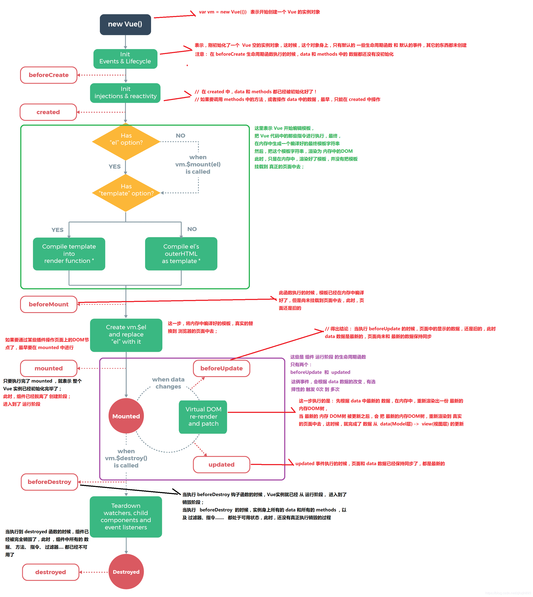
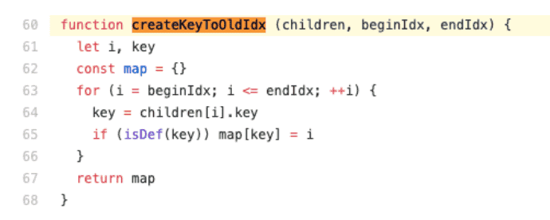
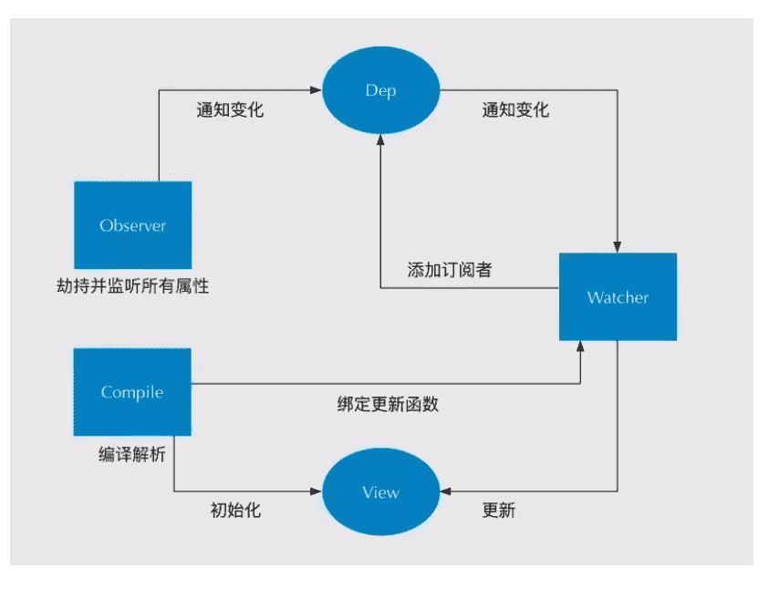

本文转载自:<https://www.cxymsg.com/guide/vue.html>

## 你对MVVM的理解?

### MVVM是什么?

MVVM 模式，顾名思义即 Model-View-ViewModel 模式。它萌芽于2005年微软推出的基于 Windows 的用户界面框架 WPF ，前端最早的 MVVM 框架 knockout 在2010年发布。

Model 层: **对应数据层的域模型，它主要做域模型的同步**。通过 Ajax/fetch 等 API 完成客户端和服务端业务 Model 的同步。在层间关系里，它主要用于抽象出 ViewModel 中视图的 Model。

View 层:作为视图模板存在，在 MVVM 里，整个 View 是一个**动态模板**。除了定义结构、布局外，它展示的是 ViewModel 层的数据和状态。View 层不负责处理状态，View 层做的是 数据绑定的声明、 指令的声明、 事件绑定的声明。

ViewModel 层:把 View 需要的层数据暴露，并对 View 层的 数据绑定声明、 指令声明、 事件绑定声明 负责，也就是处理 View 层的具体业务逻辑。ViewModel 底层会做好绑定属性的监听。当 ViewModel 中数据变化，View 层会得到更新；而当 View 中声明了数据的双向绑定（通常是表单元素），框架也会监听 View 层（表单）值的变化。一旦值变化，View 层绑定的 ViewModel 中的数据也会得到自动更新。


### MVVM的优缺点?

::: tip 优点:

1. **分离视图（View）和模型（Model）,降低代码耦合，提高视图或者逻辑的重用性**: 比如视图（View）可以独立于Model变化和修改，一个ViewModel可以绑定不同的"View"上，当View变化的时候Model不可以不变，当Model变化的时候View也可以不变。你可以把一些视图逻辑放在一个ViewModel里面，让很多view重用这段视图逻辑
2. **提高可测试性**: ViewModel的存在可以帮助开发者更好地编写测试代码
3. **自动更新dom**: 利用双向绑定,数据更新后视图自动更新,让开发者从繁琐的手动dom中解放

:::

::: tip 缺点:

1. **Bug很难被调试**: 因为使用双向绑定的模式，当你看到界面异常了，有可能是你View的代码有Bug，也可能是Model的代码有问题。数据绑定使得一个位置的Bug被快速传递到别的位置，要定位原始出问题的地方就变得不那么容易了。另外，数据绑定的声明是指令式地写在View的模版当中的，这些内容是没办法去打断点debug的
2. **一个大的模块中model也会很大，虽然使用方便了也很容易保证了数据的一致性**，当时长期持有，不释放内存就造成了花费更多的内存
3. 对于大型的图形应用程序，视图状态较多，**ViewModel的构建和维护的成本都会比较高**

:::

## 你对Vue生命周期的理解？

### 生命周期是什么

Vue 实例有一个完整的生命周期，也就是从开始创建、初始化数据、编译模版、挂载Dom -> 渲染、更新 -> 渲染、卸载等一系列过程，我们称这是Vue的生命周期。

### 各个生命周期的作用

| 生命周期      | 描述                                                         |
| ------------- | ------------------------------------------------------------ |
| beforeCreate  | 组件实例被创建之初，组件的属性生效之前                       |
| created       | 组件实例已经完全创建，属性也绑定，但真实dom还没有生成，`$el`还不可用 |
| beforeMount   | 在挂载开始之前被调用：相关的 render 函数首次被调用           |
| mounted       | el 被新创建的 vm.$el 替换，并挂载到实例上去之后调用该钩子    |
| beforeUpdate  | 组件数据更新之前调用，发生在虚拟 DOM 打补丁之前              |
| update        | 组件数据更新之后                                             |
| activited     | keep-alive专属，组件被激活时调用                             |
| deadctivated  | keep-alive专属，组件被销毁时调用                             |
| beforeDestory | 组件销毁前调用                                               |
| destoryed     | 组件销毁后调用                                               |

### 生命周期示意图



## 异步请求适合在哪个生命周期调用？

官方实例的异步请求是在mounted生命周期中调用的，而实际上也可以在created生命周期中调用。

## Vue组件如何通信？

Vue组件通信的方法如下:

- props/$emit+v-on: 通过props将数据自上而下传递，而通过$emit和v-on来向上传递信息。
- EventBus: 通过EventBus进行信息的发布与订阅
- vuex: 是全局数据管理库，可以通过vuex管理全局的数据流
- $attrs/$listeners: Vue2.4中加入的$attrs/$listeners可以进行跨级的组件通信
- provide/inject：以允许一个祖先组件向其所有子孙后代注入一个依赖，不论组件层次有多深，并在起上下游关系成立的时间里始终生效，这成为了跨组件通信的基础

还有一些用solt插槽或者ref实例进行通信的，使用场景过于有限就不赘述了。

> 详细可以参考这篇文章[vue中8种组件通信方式](https://juejin.im/post/5d267dcdf265da1b957081a3),不过太偏门的通信方式根本不会用到,单做知识点了解即可

## computed和watch有什么区别?

::: tip computed:

1. `computed`是计算属性,也就是计算值,它更多用于计算值的场景
2. `computed`具有缓存性,computed的值在getter执行后是会缓存的，只有在它依赖的属性值改变之后，下一次获取computed的值时才会重新调用对应的getter来计算
3. `computed`适用于计算比较消耗性能的计算场景

:::

::: tip watch:

1. 更多的是「观察」的作用,类似于某些数据的监听回调,用于观察`props` `$emit`或者本组件的值,当数据变化时来执行回调进行后续操作
2. 无缓存性，页面重新渲染时值不变化也会执行

:::

小结:

1. 当我们要进行数值计算,而且依赖于其他数据，那么把这个数据设计为computed
2. 如果你需要在某个数据变化时做一些事情，使用watch来观察这个数据变化

## Vue是如何实现双向绑定的?

利用`Object.defineProperty`劫持对象的访问器,在属性值发生变化时我们可以获取变化,然后根据变化进行后续响应,在vue3.0中通过Proxy代理对象进行类似的操作。

```javascript
// 这是将要被劫持的对象
const data = {
  name: '',
};

function say(name) {
  if (name === '古天乐') {
    console.log('给大家推荐一款超好玩的游戏');
  } else if (name === '渣渣辉') {
    console.log('戏我演过很多,可游戏我只玩贪玩懒月');
  } else {
    console.log('来做我的兄弟');
  }
}

// 遍历对象,对其属性值进行劫持
Object.keys(data).forEach(function(key) {
  Object.defineProperty(data, key, {
    enumerable: true,
    configurable: true,
    get: function() {
      console.log('get');
    },
    set: function(newVal) {
      // 当属性值发生变化时我们可以进行额外操作
      console.log(`大家好,我系${newVal}`);
      say(newVal);
    },
  });
});

data.name = '渣渣辉';
//大家好,我系渣渣辉
//戏我演过很多,可游戏我只玩贪玩懒月
```

> 详细实现见[Proxy比defineproperty优劣对比?](https://www.cxymsg.com/guide/devsProxy.html)

## Proxy与Object.defineProperty的优劣对比?

::: tip Proxy的优势如下:

- Proxy可以**直接监听对象**而非属性
- Proxy可以**直接监听数组的变化**
- Proxy有**多达13种拦截方法**,不限于apply、ownKeys、deleteProperty、has等等是`Object.defineProperty`不具备的
- Proxy**返回的是一个新对象,我们可以只操作新的对象达到目的**,而`Object.defineProperty`只能遍历对象属性直接修改
- Proxy作为新标准将受到浏览器厂商重点**持续的性能优化**，也就是传说中的新标准的性能红利

:::

Object.defineProperty的优势如下:

- 兼容性好,支持IE9,而 Proxy 存在浏览器兼容性问题,而且无法用 polyfill 磨平，因此 Vue 的作者才声明需要等到下个大版本( 3.0 )才能用 Proxy 重写。

> 详细实现见[Proxy比defineproperty优劣对比?](https://www.cxymsg.com/guide/devsProxy.html)

## 你是如何理解Vue的响应式系统的?


::: tip 响应式系统简述:

- 任何一个 Vue Component 都有一个与之对应的 Watcher 实例。
- Vue 的 data 上的属性会被添加 getter 和 setter 属性。
- 当 Vue Component render 函数被执行的时候, data 上会被 触碰(touch), 即被读, getter 方法会被调用, 此时 Vue 会去记录此 Vue component 所依赖的所有 data。(这一过程被称为依赖收集)
- data 被改动时（主要是用户操作）, 即被写, setter 方法会被调用, 此时 Vue 会去通知所有依赖于此 data 的组件去调用他们的 render 函数进行更新。

:::

> [深入响应式系统](https://www.cxymsg.com/guide/reactivity.html)

## 既然Vue通过数据劫持可以精准探测数据变化,为什么还需要虚拟DOM进行diff检测差异?

考点: Vue的变化侦测原理

前置知识: 依赖收集、虚拟DOM、响应式系统

现代前端框架有两种方式侦测变化,一种是pull一种是push

pull: 其代表为React,我们可以回忆一下React是如何侦测到变化的,我们通常会用`setState`API显式更新,然后React会进行一层层的Virtual Dom Diff操作找出差异,然后Patch到DOM上,React从一开始就不知道到底是哪发生了变化,只是知道「有变化了」,然后再进行比较暴力的Diff操作查找「哪发生变化了」，另外一个代表就是Angular的脏检查操作。

push: Vue的响应式系统则是push的代表,当Vue程序初始化的时候就会对数据data进行依赖的收集,一但数据发生变化,响应式系统就会立刻得知,因此Vue是一开始就知道是「在哪发生变化了」,但是这又会产生一个问题,如果你熟悉Vue的响应式系统就知道,**通常一个绑定一个数据就需要一个Watcher**,**一但我们的绑定细粒度过高就会产生大量的Watcher,这会带来内存以及依赖追踪的开销,而细粒度过低会无法精准侦测变化,因此Vue的设计是选择中等细粒度的方案**,在组件级别进行push侦测的方式,也就是那套响应式系统,通常我们会第一时间侦测到发生变化的组件,然后在组件内部进行Virtual Dom Diff获取更加具体的差异,而Virtual Dom Diff则是pull操作,Vue是push+pull结合的方式进行变化侦测的。

## Vue为什么没有类似于React中shouldComponentUpdate的生命周期？

考点: Vue的变化侦测原理

前置知识: 依赖收集、虚拟DOM、响应式系统

根本原因是Vue与React的变化侦测方式有所不同

React是pull的方式侦测变化,当React知道发生变化后,会使用Virtual Dom Diff进行差异检测,但是很多组件实际上是肯定不会发生变化的,这个时候需要用shouldComponentUpdate进行手动操作来减少diff,从而提高程序整体的性能.

Vue是pull+push的方式侦测变化的,在一开始就知道那个组件发生了变化,因此在push的阶段并不需要手动控制diff,而组件内部采用的diff方式实际上是可以引入类似于shouldComponentUpdate相关生命周期的,但是通常合理大小的组件不会有过量的diff,手动优化的价值有限,因此目前Vue并没有考虑引入shouldComponentUpdate这种手动优化的生命周期。

## Vue中的key到底有什么用？

`key`是为Vue中的vnode标记的唯一id,通过这个key,我们的diff操作可以更准确、更快速

diff算法的过程中,先会进行新旧节点的首尾交叉对比,当无法匹配的时候会用新节点的`key`与旧节点进行比对,然后超出差异.

> diff程可以概括为：oldCh和newCh各有两个头尾的变量StartIdx和EndIdx，它们的2个变量相互比较，一共有4种比较方式。如果4种比较都没匹配，如果设置了key，就会用key进行比较，在比较的过程中，变量会往中间靠，一旦StartIdx>EndIdx表明oldCh和newCh至少有一个已经遍历完了，就会结束比较,这四种比较方式就是首、尾、旧尾新头、旧头新尾.

- :yum:**准确**: 如果不加`key`,那么vue会选择复用节点(Vue的就地更新策略),导致之前节点的状态被保留下来,会产生一系列的bug.
- :heart:**快速**: key的唯一性可以被Map数据结构充分利用,相比于遍历查找的时间复杂度O(n),Map的时间复杂度仅仅为O(1).



以下转载自:

作者：我是你的超级英雄

链接：<https://juejin.im/post/5d59f2a451882549be53b170>

来源：掘金著作权归作者所有。

## 说说你对 SPA 单页面的理解，它的优缺点分别是什么？

SPA（ single-page application ）仅在 Web 页面初始化时加载相应的 HTML、JavaScript 和 CSS。一旦页面加载完成，SPA 不会因为用户的操作而进行页面的重新加载或跳转；取而代之的是利用路由机制实现 HTML 内容的变换，UI 与用户的交互，避免页面的重新加载。

::: tip 优点：

- **用户体验好、快**，内容的改变不需要重新加载整个页面，避免了不必要的跳转和重复渲染；
- 基于上面一点，**SPA 相对对服务器压力小**；
- **前后端职责分离，架构清晰**，前端进行交互逻辑，后端负责数据处理；

:::

::: tip 缺点：

- **初次加载耗时多**：为实现单页 Web 应用功能及显示效果，需要在加载页面的时候将 JavaScript、CSS 统一加载，部分页面按需加载；
- **前进后退路由管理**：由于单页应用在一个页面中显示所有的内容，所以不能使用浏览器的前进后退功能，所有的页面切换需要自己建立堆栈管理；
- **SEO 难度较大**：由于所有的内容都在一个页面中动态替换显示，所以在 SEO 上其有着天然的弱势。

:::

## v-show 与 v-if 有什么区别？

**v-if** 是**真正**的条件渲染，因为它会确保在切换过程中条件块内的事件监听器和子组件适当地被销毁和重建；也是**惰性的**：如果在初始渲染时条件为假，则什么也不做——直到条件第一次变为真时，才会开始渲染条件块。

**v-show** 就简单得多——不管初始条件是什么，元素总是会被渲染，并且只是简单地基于 CSS 的 “display” 属性进行切换。

所以，v-if 适用于在运行时很少改变条件，不需要频繁切换条件的场景；v-show 则适用于需要非常频繁切换条件的场景。

## Class 与 Style 如何动态绑定？

Class 可以通过对象语法和数组语法进行动态绑定：

- 对象语法：

```js
<div v-bind:class="{ active: isActive, 'text-danger': hasError }"></div>

data: {
  isActive: true,
  hasError: false
}
```

- 数组语法：

```js
<div v-bind:class="[isActive ? activeClass : '', errorClass]"></div>

data: {
  activeClass: 'active',
  errorClass: 'text-danger'
}
```

Style 也可以通过对象语法和数组语法进行动态绑定：

- 对象语法：

```js
<div v-bind:style="{ color: activeColor, fontSize: fontSize + 'px' }"></div>

data: {
  activeColor: 'red',
  fontSize: 30
}
```

- 数组语法：

```js
<div v-bind:style="[styleColor, styleSize]"></div>

data: {
  styleColor: {
     color: 'red'
   },
  styleSize:{
     fontSize:'23px'
  }
}
```

## 怎样理解 Vue 的单向数据流？

所有的 prop 都使得其父子 prop 之间形成了一个**单向下行绑定**：父级 prop 的更新会向下流动到子组件中，但是反过来则不行。这样会防止从子组件意外改变父级组件的状态，从而导致你的应用的数据流向难以理解。

额外的，每次父级组件发生更新时，子组件中所有的 prop 都将会刷新为最新的值。这意味着你不应该在一个子组件内部改变 prop。如果你这样做了，Vue 会在浏览器的控制台中发出警告。子组件想修改时，只能通过 $emit 派发一个自定义事件，父组件接收到后，由父组件修改。

有两种常见的试图改变一个 prop 的情形 :

- **这个 prop 用来传递一个初始值；这个子组件接下来希望将其作为一个本地的 prop 数据来使用。** 在这种情况下，最好定义一个本地的 data 属性并将这个 prop 用作其初始值：

```js
props: ['initialCounter'],
data: function () {
  return {
    counter: this.initialCounter
  }
}
```

- **这个 prop 以一种原始的值传入且需要进行转换。** 在这种情况下，最好使用这个 prop 的值来定义一个计算属性

```js
props: ['size'],
computed: {
  normalizedSize: function () {
    return this.size.trim().toLowerCase()
  }
}
```

## computed 和 watch 的区别和运用的场景？

**computed：** 是**计算属性，依赖其它属性值**，并且 computed 的**值有缓存**，只有它依赖的属性值发生改变，下一次获取 computed 的值时才会重新计算 computed  的值；

**watch：** 更多的是「**观察**」的作用，类似于某些数据的监听回调 ，每当监听的数据变化时都会执行回调进行后续操作；

**运用场景：**

- 当我们需要进行数值计算，并且依赖于其它数据时，应该使用 computed，因为可以利用 computed 的缓存特性，避免每次获取值时，都要重新计算；
- 当我们需要在数据变化时执行异步或开销较大的操作时，应该使用 watch，使用 watch 选项允许我们执行异步操作 ( 访问一个 API )，限制我们执行该操作的频率，并在我们得到最终结果前，设置中间状态。这些都是计算属性无法做到的。

## 直接给一个数组项赋值，Vue 能检测到变化吗？

由于 JavaScript 的限制，Vue 不能检测到以下数组的变动：

- 当你利用索引直接设置一个数组项时，例如：`vm.items[indexOfItem] = newValue`
- 当你修改数组的长度时，例如：`vm.items.length = newLength`

为了解决第一个问题，Vue 提供了以下操作方法：

```js
// Vue.set
Vue.set(vm.items, indexOfItem, newValue)
// vm.$set，Vue.set的一个别名
vm.$set(vm.items, indexOfItem, newValue)
// Array.prototype.splice
vm.items.splice(indexOfItem, 1, newValue)
```

为了解决第二个问题，Vue 提供了以下操作方法：

```js
// Array.prototype.splice
vm.items.splice(newLength)
```

## Vue 的父组件和子组件生命周期钩子函数执行顺序？

Vue 的父组件和子组件生命周期钩子函数执行顺序可以归类为以下 4 部分：

- 加载渲染过程

  父 beforeCreate -> 父 created -> 父 beforeMount -> 子 beforeCreate -> 子 created -> 子 beforeMount -> 子 mounted -> 父 mounted

- 子组件更新过程

  父 beforeUpdate -> 子 beforeUpdate -> 子 updated -> 父 updated

- 父组件更新过程

  父 beforeUpdate -> 父 updated

- 销毁过程

  父 beforeDestroy -> 子 beforeDestroy -> 子 destroyed -> 父 destroyed

## 在哪个生命周期内调用异步请求？

可以在钩子函数 created、beforeMount、mounted 中进行调用，因为在这三个钩子函数中，data 已经创建，可以将服务端端返回的数据进行赋值。但是本人推荐在 **created 钩子函数中调用异步请求**，因为在 created 钩子函数中调用异步请求有以下优点：

- 能更快获取到服务端数据，减少页面 loading 时间；
- ssr 不支持 beforeMount 、mounted 钩子函数，所以放在 created 中有助于一致性；

## 父组件可以监听到子组件的生命周期吗？

比如有父组件 Parent 和子组件 Child，如果父组件监听到子组件挂载 mounted 就做一些逻辑处理，可以通过以下写法实现：

```js
// Parent.vue
<Child @mounted="doSomething"/>
    
// Child.vue
mounted() {
  this.$emit("mounted");
}
```

以上需要手动通过 $emit 触发父组件的事件，更简单的方式可以在父组件引用子组件时通过 @hook 来监听即可，如下所示：

```js
//  Parent.vue
<Child @hook:mounted="doSomething" ></Child>

doSomething() {
   console.log('父组件监听到 mounted 钩子函数 ...');
},
    
//  Child.vue
mounted(){
   console.log('子组件触发 mounted 钩子函数 ...');
},    
    
// 以上输出顺序为：
// 子组件触发 mounted 钩子函数 ...
// 父组件监听到 mounted 钩子函数 ...     
```

当然 @hook 方法不仅仅是可以监听 mounted，其它的生命周期事件，例如：created，updated 等都可以监听。

## 谈谈你对 keep-alive 的了解？

keep-alive 是 Vue 内置的一个组件，可以使被包含的组件保留状态，避免重新渲染 。

::: tip 其有以下特性：

- 一般结合路由和动态组件一起使用，用于**缓存组件**；
- 提供 **include** 和 **exclude** 属性，两者都**支持字符串或正则表达式**， include 表示只有名称匹配的组件会被缓存，exclude 表示任何名称匹配的组件都不会被缓存 ，其中 exclude 的优先级比 include 高；
- 对应两个钩子函数 **activated** 和 **deactivated** ，当组件被激活时，触发钩子函数 activated，当组件被移除时，触发钩子函数 deactivated。

:::

## 组件中 data 为什么是一个函数？

> 为什么组件中的 data 必须是一个函数，然后 return 一个对象，而 new Vue 实例里，data 可以直接是一个对象？

```js
// data
data() {
  return {
	message: "子组件",
	childName:this.name
  }
}

// new Vue
new Vue({
  el: '#app',
  router,
  template: '<App/>',
  components: {App}
})
```

因为组件是用来复用的，且 JS 里对象是引用关系，如果组件中 data 是一个对象，那么这样作用域没有隔离，**子组件中的 data 属性值会相互影响**，**如果组件中 data 选项是一个函数，那么每个实例可以维护一份被返回对象的独立的拷贝**，组件实例之间的 data 属性值不会互相影响；而 new Vue 的实例，是不会被复用的，因此不存在引用对象的问题。

## v-model 的原理？

我们在 vue 项目中主要使用 v-model 指令在表单 input、textarea、select 等元素上创建双向数据绑定，我们知道 v-model 本质上不过是语法糖，v-model 在内部为不同的输入元素使用不同的属性并抛出不同的事件：

- text 和 textarea 元素使用 value 属性和 input 事件；
- checkbox 和 radio 使用 checked 属性和 change 事件；
- select 字段将 value 作为 prop 并将 change 作为事件。

以 input  表单元素为例：

```js
<input v-model='something'>
    
相当于

<input v-bind:value="something" v-on:input="something = $event.target.value">
```

如果:star:**在自定义组件中，v-model 默认会利用名为 value 的 prop 和名为 input 的事件**，如下所示：

```js
父组件：
<ModelChild v-model="message"></ModelChild>

子组件：
<div>{{value}}</div>

props:{
    value: String
},
methods: {
  test1(){
     this.$emit('input', '小红')
  },
},
```

## 你使用过 Vuex 吗？

Vuex 是一个专为 Vue.js 应用程序开发的**状态管理模式**。每一个 Vuex 应用的核心就是 store（仓库）。“store” 基本上就是一个容器，它包含着你的应用中大部分的状态 ( state )。

（1）**Vuex 的状态存储是响应式的**。当 Vue 组件从 store 中读取状态的时候，若 store 中的状态发生变化，那么相应的组件也会相应地得到高效更新。

（2）改变 store 中的状态的唯一途径就是**显式地提交 (commit) mutation**。这样使得我们可以方便地跟踪每一个状态的变化。

::: tip 主要包括以下几个模块：

- State：定义了应用状态的数据结构，可以在这里设置默认的初始状态。
- Getter：允许组件从 Store 中获取数据，mapGetters 辅助函数仅仅是将 store 中的 getter 映射到局部计算属性。
- Mutation：是唯一更改 store 中状态的方法，且必须是同步函数。
- Action：用于提交 mutation，而不是直接变更状态，可以包含任意异步操作。
- Module：允许将单一的 Store 拆分为多个 store 且同时保存在单一的状态树中。

:::

## 使用过 Vue SSR 吗？说说 SSR？

> Vue.js 是构建客户端应用程序的框架。默认情况下，可以在浏览器中输出 Vue 组件，进行生成 DOM 和操作 DOM。然而，也可以将同一个组件渲染为服务端的 HTML 字符串，将它们直接发送到浏览器，最后将这些静态标记"激活"为客户端上完全可交互的应用程序。
>
> 即：SSR大致的意思就是**vue在客户端将标签渲染成的整个 html 片段的工作在服务端完成**，服务端形成的html 片段直接返回给客户端这个过程就叫做服务端渲染。

**服务端渲染 SSR 的优缺点如下：**

::: tip （1）服务端渲染的优点：

- **更好的 SEO**： 因为 SPA 页面的内容是通过 Ajax 获取，而搜索引擎爬取工具并不会等待 Ajax 异步完成后再抓取页面内容，所以在 SPA 中是抓取不到页面通过 Ajax 获取到的内容；而 SSR 是直接由服务端返回已经渲染好的页面（数据已经包含在页面中），所以搜索引擎爬取工具可以抓取渲染好的页面；
- **更快的内容到达时间（首屏加载更快）**： SPA 会等待所有 Vue 编译后的 js 文件都下载完成后，才开始进行页面的渲染，文件下载等需要一定的时间等，所以首屏渲染需要一定的时间；SSR 直接由服务端渲染好页面直接返回显示，无需等待下载 js 文件及再去渲染等，所以 SSR 有更快的内容到达时间；

:::

::: tip （2) 服务端渲染的缺点：

- **更多的开发条件限制**： 例如**服务端渲染只支持 beforeCreate 和 created 两个钩子函数，这会导致一些外部扩展库需要特殊处理，才能在服务端渲染应用程序中运行**；并且与可以部署在任何静态文件服务器上的完全静态单页面应用程序 SPA 不同，服务端渲染应用程序，需要处于 Node.js server 运行环境；
- **更多的服务器负载**：在 Node.js  中渲染完整的应用程序，显然会比仅仅提供静态文件的  server 更加大量占用CPU 资源 (CPU-intensive - CPU 密集)，因此如果你预料在高流量环境 ( high traffic ) 下使用，请准备相应的服务器负载，并明智地采用缓存策略。

:::

如果没有 SSR 开发经验的同学，可以参考本文作者的另一篇 SSR 的实践文章[《Vue SSR 踩坑之旅》](https://juejin.im/post/5cb6c36e6fb9a068af37aa35)，里面 SSR 项目搭建以及附有项目源码。

## vue-router 路由模式有几种？

vue-router 有 3 种路由模式：hash、history、abstract，对应的源码如下所示：

```js
switch (mode) {
  case 'history':
	this.history = new HTML5History(this, options.base)
	break
  case 'hash':
	this.history = new HashHistory(this, options.base, this.fallback)
	break
  case 'abstract':
	this.history = new AbstractHistory(this, options.base)
	break
  default:
	if (process.env.NODE_ENV !== 'production') {
	  assert(false, `invalid mode: ${mode}`)
	}
}
```

其中，3 种路由模式的说明如下：

- **hash**:  使用 URL hash 值来作路由。支持所有浏览器，包括不支持 HTML5 History Api 的浏览器；
- **history** :  依赖 HTML5 History API 和服务器配置。具体可以查看 HTML5 History 模式；
- **abstract** :  支持所有 JavaScript 运行环境，如 Node.js 服务器端。如果发现没有浏览器的 API，路由会自动强制进入这个模式.

## 能说下 vue-router 中常用的 hash 和 history 路由模式实现原理吗？

**（1）hash 模式的实现原理**

早期的前端路由的实现就是基于 location.hash 来实现的。其实现原理很简单，location.hash 的值就是 URL 中 # 后面的内容。比如下面这个网站，它的 location.hash 的值为 '#search'：

```
https://www.word.com#search
```

::: tip hash  路由模式的实现主要是基于下面几个特性：

- URL 中 **hash 值只是客户端的一种状态**，也就是说当向服务器端发出请求时，hash 部分不会被发送；
- hash 值的改变，都会在**浏览器的访问历史中增加一个记录**。因此我们能通过浏览器的回退、前进按钮控制hash 的切换；
- :yum:可以通过 a 标签，并设置 href 属性，当用户点击这个标签后，URL 的 hash 值会发生改变；或者使用  JavaScript 来对 loaction.hash 进行赋值，改变 URL 的 hash 值；
- 我们可以使用 **hashchange** 事件来**监听 hash 值的变化**，从而对页面进行跳转（渲染）。

:::

**（2）history 模式的实现原理**

HTML5 提供了 History API 来实现 URL 的变化。其中做最主要的 API 有以下两个：**history.pushState()** 和 h**istory.repalceState()。**这两个 API 可以在不进行刷新的情况下，操作浏览器的历史纪录。唯一不同的是，前者是新增一个历史记录，后者是直接替换当前的历史记录，如下所示：

```js
window.history.pushState(null, null, path);
window.history.replaceState(null, null, path);
```

::: tip history 路由模式的实现主要基于存在下面几个特性：

- pushState 和 repalceState 两个 API 来操作实现 URL 的变化 ；
- 我们可以使用 **popstate  事件来监听 url 的变化**，从而对页面进行跳转（渲染）；
- history.pushState() 或 history.replaceState() 不会触发 popstate 事件，这时我们需要手动触发页面跳转（渲染）。

:::

## 什么是 MVVM？

Model–View–ViewModel （MVVM） 是一个软件架构设计模式，由微软 WPF 和 Silverlight 的架构师 Ken Cooper 和 Ted Peters 开发，是一种简化用户界面的事件驱动编程方式。由 John Gossman（同样也是 WPF 和 Silverlight 的架构师）于2005年在他的博客上发表

MVVM 源自于经典的 Model–View–Controller（MVC）模式  ，MVVM 的出现促进了前端开发与后端业务逻辑的分离，极大地提高了前端开发效率，MVVM 的核心是 ViewModel 层，它就像是一个中转站（value converter），**负责转换 Model 中的数据对象来让数据变得更容易管理和使用，该层向上与视图层进行双向数据绑定，向下与 Model 层通过接口请求进行数据交互，起呈上启下作用**。如下图所示：


（1）View 层

View 是视图层，也就是用户界面。前端主要由 HTML 和 CSS 来构建 。

（2）Model 层

Model 是指数据模型，泛指后端进行的各种业务逻辑处理和数据操控，对于前端来说就是后端提供的 api 接口。

（3）ViewModel 层

ViewModel 是由前端开发人员组织生成和维护的视图数据层。在这一层，前端开发者对从后端获取的 Model 数据进行转换处理，做二次封装，以生成符合 View 层使用预期的视图数据模型。需要注意的是 ViewModel 所封装出来的数据模型包括视图的状态和行为两部分，而 Model 层的数据模型是只包含状态的，比如页面的这一块展示什么，而页面加载进来时发生什么，点击这一块发生什么，这一块滚动时发生什么这些都属于视图行为（交互），视图状态和行为都封装在了 ViewModel 里。这样的封装使得 ViewModel 可以完整地去描述 View 层。

MVVM 框架实现了双向绑定，这样 ViewModel 的内容会实时展现在 View 层，前端开发者再也不必低效又麻烦地通过操纵 DOM 去更新视图，MVVM 框架已经把最脏最累的一块做好了，我们开发者只需要处理和维护 ViewModel，更新数据视图就会自动得到相应更新。这样 View 层展现的不是 Model 层的数据，而是 ViewModel 的数据，由 ViewModel 负责与 Model 层交互，这就完全解耦了 View 层和 Model 层，这个解耦是至关重要的，它是前后端分离方案实施的重要一环。

我们以下通过一个 Vue 实例来说明 MVVM 的具体实现，有 Vue 开发经验的同学应该一目了然：

（1）View 层

```js
<div id="app">
    <p>{{message}}</p>
    <button v-on:click="showMessage()">Click me</button>
</div>
```

（2）ViewModel 层

```js
var app = new Vue({
    el: '#app',
    data: {  // 用于描述视图状态   
        message: 'Hello Vue!', 
    },
    methods: {  // 用于描述视图行为  
        showMessage(){
            let vm = this;
            alert(vm.message);
        }
    },
    created(){
        let vm = this;
        // Ajax 获取 Model 层的数据
        ajax({
            url: '/your/server/data/api',
            success(res){
                vm.message = res;
            }
        });
    }
})
```

（3） Model 层

```js
{
    "url": "/your/server/data/api",
    "res": {
        "success": true,
        "name": "IoveC",
        "domain": "www.cnblogs.com"
    }
}
```

## Vue 是如何实现数据双向绑定的？

Vue 数据双向绑定主要是指：数据变化更新视图，视图变化更新数据，如下图所示：


即：

- 输入框内容变化时，Data 中的数据同步变化。即 View => Data 的变化。
- Data 中的数据变化时，文本节点的内容同步变化。即 Data => View 的变化。

其中，View 变化更新 Data ，可以通过事件监听的方式来实现，所以 Vue 的数据双向绑定的工作主要是如何根据 Data 变化更新 View。

:star::star:Vue 主要通过以下 4 个步骤来实现数据双向绑定的：

实现一个**监听器 Observer**：对数据对象进行遍历，包括子属性对象的属性，利用 Object.defineProperty() 对属性都加上 setter 和 getter。这样的话，给这个对象的某个值赋值，就会触发 setter，那么就能监听到了数据变化。

实现一个**解析器 Compile**：解析 Vue 模板指令，将模板中的变量都替换成数据，然后初始化渲染页面视图，并将每个指令对应的节点绑定更新函数，添加监听数据的订阅者，一旦数据有变动，收到通知，调用更新函数进行数据更新。

实现一个**订阅者 Watcher**：Watcher 订阅者是 Observer 和 Compile 之间通信的桥梁 ，主要的任务是订阅 Observer 中的属性值变化的消息，当收到属性值变化的消息时，触发解析器 Compile 中对应的更新函数。

实现一个**订阅器 Dep**：订阅器采用 发布-订阅 设计模式，用来收集订阅者 Watcher，对监听器 Observer 和 订阅者 Watcher 进行统一管理。

以上四个步骤的流程图表示如下，如果有同学理解不大清晰的，可以查看作者专门介绍数据双向绑定的文章[《0 到 1 掌握：Vue 核心之数据双向绑定》](https://juejin.im/post/5d421bcf6fb9a06af23853f1)，有进行详细的讲解、以及代码 demo 示例。



## Vue 框架怎么实现对象和数组的监听？

如果被问到 Vue 怎么实现数据双向绑定，大家肯定都会回答 通过 Object.defineProperty() 对数据进行劫持，但是  Object.defineProperty() 只能对属性进行数据劫持，不能对整个对象进行劫持，同理无法对数组进行劫持，但是我们在使用 Vue 框架中都知道，Vue 能检测到对象和数组（部分方法的操作）的变化，那它是怎么实现的呢？我们查看相关代码如下：

```js
  /**
   * Observe a list of Array items.
   */
  observeArray (items: Array<any>) {
    for (let i = 0, l = items.length; i < l; i++) {
      observe(items[i])  // observe 功能为监测数据的变化
    }
  }

  /**
   * 对属性进行递归遍历
   */
  let childOb = !shallow && observe(val) // observe 功能为监测数据的变化

```

通过以上 Vue 源码部分查看，我们就能知道 **Vue 框架是通过遍历数组 和递归遍历对象，从而达到利用  Object.defineProperty() 也能对对象和数组（部分方法的操作）进行监听。**

## Vue 怎么用 vm.$set() 解决对象新增属性不能响应的问题 ？

受现代 JavaScript 的限制 ，Vue **无法检测到对象属性的添加或删除**。由于 Vue 会在初始化实例时对属性执行 getter/setter 转化，所以属性必须在 data 对象上存在才能让 Vue 将它转换为响应式的。但是 Vue 提供了 `Vue.set (object, propertyName, value) / vm.$set (object, propertyName, value)`  来实现为对象添加响应式属性，那框架本身是如何实现的呢？

我们查看对应的 Vue 源码：`vue/src/core/instance/index.js`

```js
export function set (target: Array<any> | Object, key: any, val: any): any {
  // target 为数组  
  if (Array.isArray(target) && isValidArrayIndex(key)) {
    // 修改数组的长度, 避免索引>数组长度导致splcie()执行有误
    target.length = Math.max(target.length, key)
    // 利用数组的splice变异方法触发响应式  
    target.splice(key, 1, val)
    return val
  }
  // key 已经存在，直接修改属性值  
  if (key in target && !(key in Object.prototype)) {
    target[key] = val
    return val
  }
  const ob = (target: any).__ob__
  // target 本身就不是响应式数据, 直接赋值
  if (!ob) {
    target[key] = val
    return val
  }
  // 对属性进行响应式处理
  defineReactive(ob.value, key, val)
  ob.dep.notify()
  return val
}
```

我们阅读以上源码可知，vm.$set 的实现原理是：

- 如果目标是数组，直接使用数组的 splice 方法触发相应式；
- 如果目标是对象，会先判读属性是否存在、对象是否是响应式，最终如果要对属性进行响应式处理，则是通过调用   defineReactive 方法进行响应式处理（ defineReactive 方法就是  Vue 在初始化对象时，给对象属性采用 Object.defineProperty 动态添加 getter 和 setter 的功能所调用的方法）

## 虚拟 DOM 的优缺点？

::: tip 优点：

- **保证性能下限：** 框架的虚拟 DOM 需要适配任何上层 API 可能产生的操作，它的一些 DOM 操作的实现必须是普适的，所以它的性能并不是最优的；但是比起粗暴的 DOM 操作性能要好很多，因此框架的虚拟 DOM 至少可以保证在你不需要手动优化的情况下，依然可以提供还不错的性能，即保证性能的下限；
- **无需手动操作 DOM：** 我们不再需要手动去操作 DOM，只需要写好 View-Model 的代码逻辑，框架会根据虚拟 DOM 和 数据双向绑定，帮我们以可预期的方式更新视图，极大提高我们的开发效率；
- **跨平台：** 虚拟 DOM 本质上是 JavaScript 对象,而 DOM 与平台强相关，相比之下虚拟 DOM 可以进行更方便地跨平台操作，例如服务器渲染、weex 开发等等。

:::

::: tip 缺点:

- **无法进行极致优化：** 虽然虚拟 DOM + 合理的优化，足以应对绝大部分应用的性能需求，但在一些性能要求极高的应用中虚拟 DOM 无法进行针对性的极致优化。

:::

## 虚拟 DOM 实现原理？

虚拟 DOM 的实现原理主要包括以下 3 部分：

- 用 JavaScript 对象模拟真实 DOM 树，对真实 DOM 进行抽象；
- diff 算法 — 比较两棵虚拟 DOM 树的差异；
- pach 算法 — 将两个虚拟 DOM 对象的差异应用到真正的 DOM 树。

如果对以上 3 个部分还不是很了解的同学，可以查看本文作者写的另一篇详解虚拟 DOM 的文章《[深入剖析：Vue核心之虚拟DOM](https://juejin.im/post/5d36cc575188257aea108a74#heading-14)》

## Vue 中的 key 有什么作用？

key 是为 Vue 中 vnode 的唯一标记，通过这个 key，我们的 diff 操作可以更准确、更快速。Vue 的 diff 过程可以概括为：oldCh 和 newCh 各有两个头尾的变量 oldStartIndex、oldEndIndex 和 newStartIndex、newEndIndex，它们会新节点和旧节点会进行两两对比，即一共有4种比较方式：newStartIndex 和oldStartIndex 、newEndIndex 和  oldEndIndex 、newStartIndex 和 oldEndIndex 、newEndIndex 和 oldStartIndex，如果以上 4 种比较都没匹配，如果设置了key，就会用 key 再进行比较，在比较的过程中，遍历会往中间靠，一旦 StartIdx > EndIdx 表明 oldCh 和 newCh 至少有一个已经遍历完了，就会结束比较。具体有无 key 的 diff 过程，可以查看作者写的另一篇详解虚拟 DOM 的文章《[深入剖析：Vue核心之虚拟DOM](https://juejin.im/post/5d36cc575188257aea108a74#heading-14)》

所以 Vue 中 key 的作用是：key 是为 Vue 中 vnode 的唯一标记，通过这个 key，我们的 diff 操作可以更准确、更快速

**更准确**：因为带 key 就不是就地复用了，在 sameNode 函数 `a.key === b.key` 对比中可以避免就地复用的情况。所以会更加准确。

**更快速**：利用 key 的唯一性生成 map 对象来获取对应节点，比遍历方式更快，源码如下：

```js
function createKeyToOldIdx (children, beginIdx, endIdx) {
  let i, key
  const map = {}
  for (i = beginIdx; i <= endIdx; ++i) {
    key = children[i].key
    if (isDef(key)) map[key] = i
  }
  return map
}
```

## 你有对 Vue 项目进行哪些优化？

如果没有对 Vue 项目没有进行过优化总结的同学，可以参考本文作者的另一篇文章[《 Vue 项目性能优化 — 实践指南 》](https://juejin.im/post/5d548b83f265da03ab42471d)，文章主要介绍从 3 个大方面，22 个小方面详细讲解如何进行 Vue 项目的优化。

**（1）代码层面的优化**

- v-if 和 v-show 区分使用场景
- computed 和 watch  区分使用场景
- v-for 遍历必须为 item 添加 key，且避免同时使用 v-if
- 长列表性能优化
- 事件的销毁
- 图片资源懒加载
- 路由懒加载
- 第三方插件的按需引入
- 优化无限列表性能
- 服务端渲染 SSR or 预渲染

**（2）Webpack 层面的优化**

- Webpack 对图片进行压缩
- 减少 ES6 转为 ES5 的冗余代码
- 提取公共代码
- 模板预编译
- 提取组件的 CSS
- 优化 SourceMap
- 构建结果输出分析
- Vue 项目的编译优化

**（3）基础的 Web 技术的优化**

- 开启 gzip 压缩
- 浏览器缓存
- CDN 的使用
- 使用 Chrome Performance 查找性能瓶颈

## 对于即将到来的 vue3.0 特性你有什么了解的吗？

Vue 3.0 正走在发布的路上，Vue 3.0 的目标是让 Vue 核心变得更小、更快、更强大，因此 Vue 3.0 增加以下这些新特性：

**（1）监测机制的改变**

3.0 将带来基于代理 Proxy 的 observer 实现，提供全语言覆盖的反应性跟踪。这消除了 Vue 2 当中基于 Object.defineProperty 的实现所存在的很多限制：

- 只能监测属性，不能监测对象
- 检测属性的添加和删除；
- 检测数组索引和长度的变更；
- 支持 Map、Set、WeakMap 和 WeakSet。

新的 observer 还提供了以下特性：

- 用于创建 observable 的公开 API。这为中小规模场景提供了简单轻量级的跨组件状态管理解决方案。
- 默认采用惰性观察。在 2.x 中，不管反应式数据有多大，都会在启动时被观察到。如果你的数据集很大，这可能会在应用启动时带来明显的开销。在 3.x 中，只观察用于渲染应用程序最初可见部分的数据。
- 更精确的变更通知。在 2.x 中，通过 Vue.set 强制添加新属性将导致依赖于该对象的 watcher 收到变更通知。在 3.x 中，只有依赖于特定属性的 watcher 才会收到通知。
- 不可变的 observable：我们可以创建值的“不可变”版本（即使是嵌套属性），除非系统在内部暂时将其“解禁”。这个机制可用于冻结 prop 传递或 Vuex 状态树以外的变化。
- 更好的调试功能：我们可以使用新的 renderTracked 和 renderTriggered 钩子精确地跟踪组件在什么时候以及为什么重新渲染。

**（2）模板**

模板方面没有大的变更，只改了作用域插槽，2.x 的机制导致作用域插槽变了，父组件会重新渲染，而 3.0 把作用域插槽改成了函数的方式，这样只会影响子组件的重新渲染，提升了渲染的性能。

同时，对于 render 函数的方面，vue3.0 也会进行一系列更改来方便习惯直接使用 api 来生成 vdom 。

**（3）对象式的组件声明方式**

vue2.x 中的组件是通过声明的方式传入一系列 option，和 TypeScript 的结合需要通过一些装饰器的方式来做，虽然能实现功能，但是比较麻烦。3.0 修改了组件的声明方式，改成了类式的写法，这样使得和 TypeScript 的结合变得很容易。

此外，vue 的源码也改用了 TypeScript 来写。其实当代码的功能复杂之后，必须有一个静态类型系统来做一些辅助管理。现在 vue3.0 也全面改用 TypeScript 来重写了，更是使得对外暴露的 api 更容易结合 TypeScript。静态类型系统对于复杂代码的维护确实很有必要。

**（4）其它方面的更改**

vue3.0 的改变是全面的，上面只涉及到主要的 3 个方面，还有一些其他的更改：

- 支持自定义渲染器，从而使得 weex 可以通过自定义渲染器的方式来扩展，而不是直接 fork 源码来改的方式。
- 支持 Fragment（多个根节点）和 Protal（在 dom 其他部分渲染组建内容）组件，针对一些特殊的场景做了处理。
- 基于 treeshaking 优化，提供了更多的内置功能。