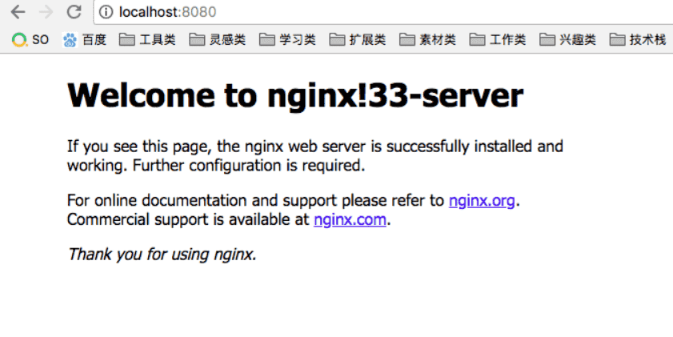
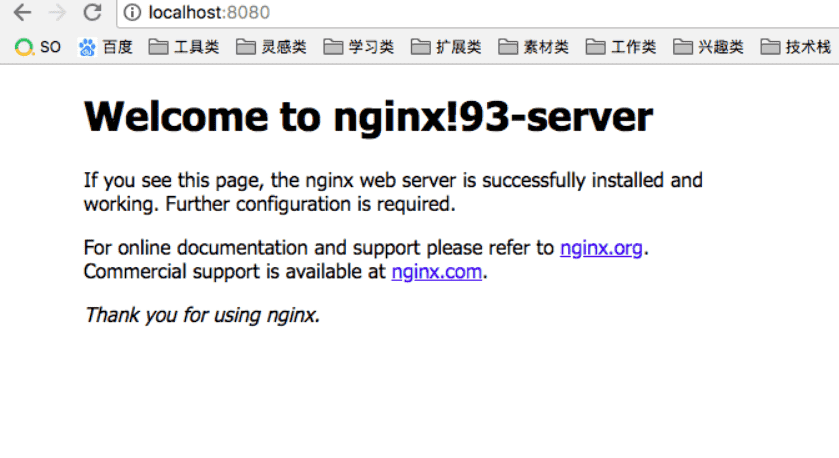

## 什么是反向代理与负载均衡

### 什么是反向代理

当我们有一个服务器集群，并且服务器集群中的每台服务器的内容一样的时候，同样我们要直接从个人电脑访问到服务器集群服务器的时候无法访问，必须通过第三方服务器才能访问集群

这个时候，我们通过第三方服务器访问服务器集群的内容，但是我们并不知道是哪一台服务器提供的内容，此种代理方式称为**反向代理**

### 什么是负载均衡

公司会建立很多的服务器，这些服务器组成了服务器集群，然后，当用户访问网站的时候，先访问一个中间服务器，再让这个中间服务器在服务器集群中选择一个压力较小的服务器，然后将该访问请求引入选择的服务器

所以，用户每次访问，都会保证服务器集群中的每个服务器压力趋于平衡，分担了服务器压力，避免了服务器崩溃的情况

一句话：**nginx会给你分配服务器压力小的去访问**

## Nginx反向代理与负载均衡的实现

用户访问网站的时候首先会访问nginx服务器，然后nginx服务器再从服务器集群中选择压力较小的服务器，将该访问请求引向该服务器

### nginx配置

下面修改配置方面我就从mac系统下来进行简单的演示，如何安装的话也暂以mac为主了，windows系统直接去Nginx官网下载安装即可

```
安装nginx
    1-进到homebrew官网，然后复制命令，预安装需要的东西
    2-brew install nginx    安装nginx
    3-nginx -v  显示版本号
进入nginx
    cd /usr/local/etc/nginx
```

下图为进入nginx文件夹下的文件内容


当进到这个目录下，我们就可以操作nginx了，接下来就列举一些非常非常有用的命令，多敲几遍，一定要记住


#### nginx常用命令

- 启动nginx 
  - nginx
  - 当你敲完nginx这5个键的时候，并没有任何反应，此时你只需访问localhost:8080(默认)即可


- 关闭nginx

  - 如果出现下图情况，不要惊慌，是因为之前nginx被启动过了

  - 只需**nginx -s stop**，停止nginx服务

  - 然后再次启动nginx即可


- 重启nginx 

  - nginx -s reload
  - 每次修改完.conf文件就需要重启nginx

- 检查配置 

  - 检查修改的nginx.conf配置是否正确
  - **nginx -t**
  - 如果出现下面ok和successfull就代表正确了，其他的都不对

  ```
   nginx: the configuration file /usr/local/etc/nginx/nginx.conf syntax is ok
   nginx: configuration file /usr/local/etc/nginx/nginx.conf test is successful
  ```

对于我们前端来说正常工作当中，倒是不需要过多的修改nginx的。我们之所以修改nginx配置，是为了做一些反向代理罢了

### proxy_pass

nginx反向代理主要通过proxy_pass来配置，将你项目的开发机地址填写到proxy_pass后面，正常的格式为proxy_pass URL即可

```js
server {
    listen 80;
    location / {
        proxy_pass http://10.10.10.10:20186;
    }
}
```

### Upstream模块实现负载均衡

- ip_hash指令
- server指令
- upstream指令及相关变量

上面写的三个指令，我们直接通过代码来一一分析

```js
// 修改nginx.conf
worker_processes 1;
events {
    worker_connections 1024;
}
http {
    upstream firstdemo {
        server 39.106.145.33;
        server 47.93.6.93;
    }
    server {
        listen 8080;
        location / {
            proxy_pass http://firstdemo;
        }
    }
}
```

上面修改的nginx.conf就是上图中花圈的那个文件，nginx配置的主要修改就在这里。化繁为简，把原本nginx.conf里的内容直接替换为上面的不到20行的代码了

既然不到20行，那就把里面对应的内容统统解释一下吧，有个了解就好

- worker_processes 
  - 工作进程数，和CPU核数相同
- worker_connections 
  - 每个进程允许的最大连接数
- upstream模块 
  - 负载均衡就靠它
  - 语法格式：upstream name {}
  - 里面写的两个server分别对应着不同的服务器
- server模块 
  - 实现反向代理
  - listen监督端口号
  - location / {}访问根路径
  - proxy_pass http://firstdemo，代理到firstdemo里两个服务器上

上面修改了nginx.conf之后，别忘了最重要的一步重启nginx

那么再次访问localhost:8080，会看到如下图页面



还有另一个页面



每次刷新都会访问不同的服务器，这样就做到了**负载均衡**处理

不过，更应该做到的是当用户第一次访问到其中一台服务器后，下次再访问的时候就直接访问该台服务器就好了，不用总变化了。那么就发挥了ip_hash的威力了

```
// 省略...
    upstream firstdemo {
        ip_hash;
        server 39.106.145.33;
        server 47.93.6.93;
    }
```

ip_hash它的作用是如果第一次访问该服务器后就记录，之后再访问都是该服务器了，这样比如第一次访问是33服务器，那之后再访问也会分配为33服务器访问了

### 工作中的简单使用

在公司开发项目的时候，遇到设计，产品走查环节的时候，不能每次都让他们去配一个host，毕竟这样不友好，走查起来有麻烦。所以更应该给他们直观的感受，既给一个访问地址就可以看到样子

下面给大家看一下，我正常在公司时nginx做的反向代理配置，和咱们上面的如出一辙，只是加了一个server_name，用指定的域名去访问即可

```
server {
    listen       80;
    server_name  chd.news.so.m.qss.test.so.com ;
    auth_basic off;
    location / {
        proxy_pass    http://10.10.10.10:20186;
        proxy_set_header Host $host;
        proxy_redirect off;
        proxy_set_header X-Real-IP $remote_addr;
        proxy_set_header X-Forwarded-For $proxy_add_x_forwarded_for;
        proxy_connect_timeout 60;
        proxy_read_timeout 600;
        proxy_send_timeout 600;
    }
}
```

每次修改完nginx配置后不要忘记重启nginx才能生效，这样只需要访问chd.news.so.m.qss.test.so.com这个地址就可以查看我的开发环境，进行走查了。

作者：chenhongdong

链接：https://juejin.im/post/5b01336af265da0b8a67e5c9

来源：掘金