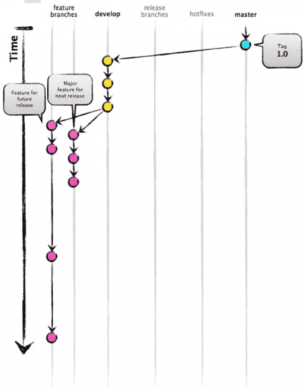
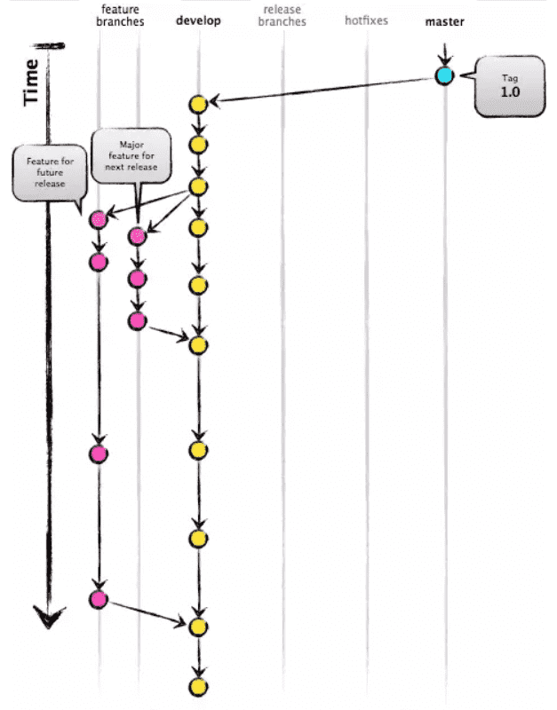
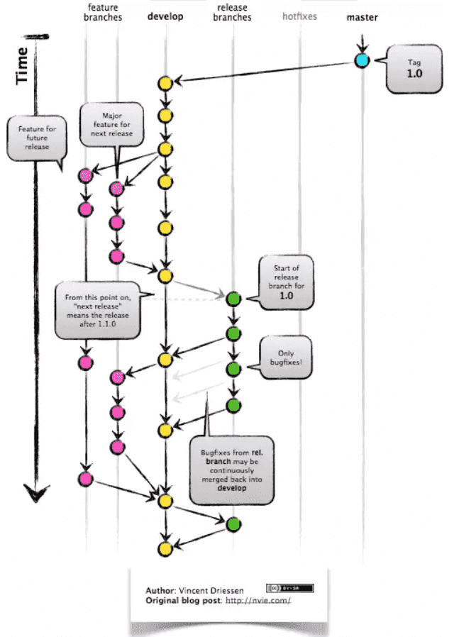
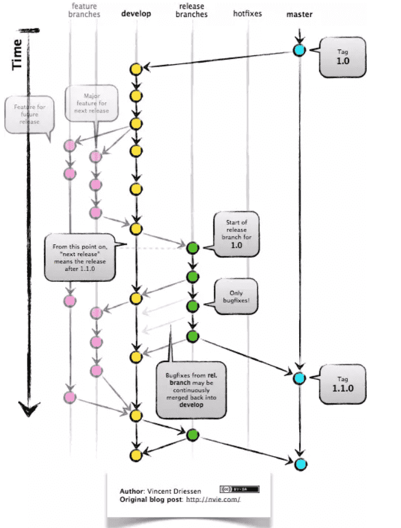

## Babel的原理是什么?

babel 的转译过程也分为三个阶段，这三步具体是：

- 解析 Parse: 将代码解析生成抽象语法树( 即AST )，即词法分析与语法分析的过程
- 转换 Transform: 对于 AST 进行变换一系列的操作，babel 接受得到 AST 并通过 babel-traverse 对其进行遍历，在此过程中进行添加、更新及移除等操作
- 生成 Generate: 将变换后的 AST 再转换为 JS 代码, 使用到的模块是 babel-generator


> 更具体的原理可以移步[如何写一个babel](https://www.cxymsg.com/guide/ast.html)

## 如何写一个babel插件?

**Babel解析成AST，然后插件更改AST，最后由Babel输出代码**

那么Babel的插件模块需要你暴露一个function，function内返回visitor

```javascript
module.export = function(babel){
  return {
    visitor:{
    }
  }
}
```

visitor是对各类型的AST节点做处理的地方，那么我们怎么知道Babel生成了的AST有哪些节点呢？
很简单，你可以把Babel转换的结果打印出来，或者这里有传送门: [AST explorer](https://astexplorer.net/)

这里我们看到 `const result = 1 + 2`中的`1 + 1`是一个`BinaryExpression`节点，那么在visitor中，我们就处理这个节点

```javascript
var babel = require('babel-core');
var t = require('babel-types');
const visitor = {
  BinaryExpression(path) {
    const node = path.node;
    let result;
    // 判断表达式两边，是否都是数字
    if (t.isNumericLiteral(node.left) && t.isNumericLiteral(node.right)) {
      // 根据不同的操作符作运算
      switch (node.operator) {
        case "+":
          result = node.left.value + node.right.value;
          break
        case "-":
          result = node.left.value - node.right.value;
          break;
        case "*":
          result =  node.left.value * node.right.value;
          break;
        case "/":
          result =  node.left.value / node.right.value;
          break;
        case "**":
          let i = node.right.value;
          while (--i) {
            result = result || node.left.value;
            result =  result * node.left.value;
          }
          break;
        default:
      }
    }
    // 如果上面的运算有结果的话
    if (result !== undefined) {
      // 把表达式节点替换成number字面量
      path.replaceWith(t.numericLiteral(result));
    }
  }
};
module.exports = function (babel) {
  return {
    visitor
  };
}
```

插件写好了，我们运行下插件试试

```js
const babel = require("babel-core");
const result = babel.transform("const result = 1 + 2;",{
  plugins:[
    require("./index")
  ]
});
console.log(result.code); // const result = 3;
```

与预期一致，那么转换 `const result = 1 + 2 + 3 + 4 + 5;`呢?
结果是: `const result = 3 + 3 + 4 + 5;`
这就奇怪了，为什么只计算了`1 + 2`之后，就没有继续往下运算了?
我们看一下这个表达式的AST树

你会发现Babel解析成表达式里面再嵌套表达式。

```text
表达式( 表达式( 表达式( 表达式(1 + 2) + 3) + 4) + 5)
```

而我们的判断条件并不符合所有的，只符合`1 + 2`

```javascript
// 判断表达式两边，是否都是数字
    if (t.isNumericLiteral(node.left) && t.isNumericLiteral(node.right)) {}
```

那么我们得改一改
第一次计算`1 + 2`之后，我们会得到这样的表达式

```text
表达式( 表达式( 表达式(3 + 3) + 4) + 5)
```

其中 `3 + 3`又符合了我们的条件， 我们通过向上递归的方式遍历父级节点
又转换成这样:

```js
表达式( 表达式(6 + 4) + 5)
表达式(10 + 5)
15
// 如果上面的运算有结果的话
    if (result !== undefined) {
      // 把表达式节点替换成number字面量
      path.replaceWith(t.numericLiteral(result));
      let parentPath = path.parentPath;
      // 向上遍历父级节点
      parentPath && visitor.BinaryExpression.call(this, parentPath);
    }
```

到这里，我们就得出了结果 `const result = 15;`
那么其他运算呢:
`const result = 100 + 10 - 50` >>> `const result = 60;`
`const result = (100 / 2) + 50` >>> `const result = 100;`
`const result = (((100 / 2) + 50 * 2) / 50) ** 2` >>> `const result = 9;`

> [项目地址](https://github.com/axetroy/babel-plugin-pre-calculate-number)

上述答案来源于cnode[帖子](https://cnodejs.org/topic/5a9317d38d6e16e56bb808d1)

> 更详实的教程移步[官方的插件教程](https://github.com/jamiebuilds/babel-handbook/blob/master/translations/zh-Hans/plugin-handbook.md#builders)

## 你的git工作流是怎样的?

GitFlow 是由 Vincent Driessen 提出的一个 git操作流程标准。包含如下几个关键分支：

| 名称    | 说明                                                         |
| ------- | ------------------------------------------------------------ |
| master  | 主分支                                                       |
| develop | 主开发分支，包含确定即将发布的代码                           |
| feature | 新功能分支，一般一个新功能对应一个分支，对于功能的拆分需要比较合理，以避免一些后面不必要的代码冲突 |
| release | 发布分支，发布时候用的分支，一般测试时候发现的 bug 在这个分支进行修复 |
| hotfix  | hotfix 分支，紧急修 bug 的时候用                             |

GitFlow 的优势有如下几点：

- 并行开发：GitFlow 可以很方便的实现并行开发：每个新功能都会建立一个新的 `feature` 分支，从而和已经完成的功能隔离开来，而且只有在新功能完成开发的情况下，其对应的 `feature` 分支才会合并到主开发分支上（也就是我们经常说的 `develop` 分支）。另外，如果你正在开发某个功能，同时又有一个新的功能需要开发，你只需要提交当前 `feature` 的代码，然后创建另外一个 `feature` 分支并完成新功能开发。然后再切回之前的 `feature` 分支即可继续完成之前功能的开发。
- 协作开发：GitFlow 还支持多人协同开发，因为每个 `feature` 分支上改动的代码都只是为了让某个新的 `feature` 可以独立运行。同时我们也很容易知道每个人都在干啥。
- 发布阶段：当一个新 `feature` 开发完成的时候，它会被合并到 `develop` 分支，这个分支主要用来暂时保存那些还没有发布的内容，所以如果需要再开发新的 `feature`，我们只需要从 `develop` 分支创建新分支，即可包含所有已经完成的 `feature` 。
- 支持紧急修复：GitFlow 还包含了 `hotfix` 分支。这种类型的分支是从某个已经发布的 tag 上创建出来并做一个紧急的修复，而且这个紧急修复只影响这个已经发布的 tag，而不会影响到你正在开发的新 `feature`。

然后就是 GitFlow 最经典的几张流程图，一定要理解：

`feature` 分支都是从 `develop` 分支创建，完成后再合并到 `develop` 分支上，等待发布。

当需要发布时，我们从 `develop` 分支创建一个 `release` 分支

然后这个 `release` 分支会发布到测试环境进行测试，如果发现问题就在这个分支直接进行修复。在所有问题修复之前，我们会不停的重复**发布->测试->修复->重新发布->重新测试**这个流程。
发布结束后，这个 `release` 分支会合并到 `develop` 和 `master` 分支，从而保证不会有代码丢失。

`master` 分支只跟踪已经发布的代码，合并到 `master` 上的 commit 只能来自 `release` 分支和 `hotfix` 分支。
`hotfix` 分支的作用是紧急修复一些 Bug。
它们都是从 `master` 分支上的某个 tag 建立，修复结束后再合并到 `develop` 和 `master` 分支上。

> 更多工作流可以参考阮老师的[Git 工作流程](https://www.ruanyifeng.com/blog/2015/12/git-workflow.html)

## rebase 与 merge的区别?

git rebase 和 git merge 一样都是用于从一个分支获取并且合并到当前分支.

假设一个场景,就是我们开发的[feature/todo]分支要合并到master主分支,那么用rebase或者merge有什么不同呢?


- merge 特点：自动创建一个新的commit 如果合并的时候遇到冲突，仅需要修改后重新commit
- 优点：**记录了真实的commit情况，包括每个分支的详情**
- 缺点：因为每次merge会自动产生一个merge commit，所以在使用一些git 的GUI tools，特别是**commit比较频繁时，看到分支很杂乱。**


- rebase 特点：会**合并之前的commit历史**
- 优点：得到更简洁的项目历史，去掉了merge commit
- 缺点：如果合并出现代码问题不容易定位，因为re-write了history

因此,当需要**保留详细的合并信息的时候建议使用git merge**，特别是需要将分支合并进入master分支时；当发现自己修改某个功能时，频繁进行了git commit提交时，**发现其实过多的提交信息没有必要时**，可以尝试git rebase.

## git高级操作

### git reset、git revert 和 git checkout 有什么区别

这个问题同样也需要先了解 git 仓库的三个组成部分：工作区（Working Directory）、暂存区（Stage）和历史记录区（History）。

- 工作区：在 git 管理下的正常目录都算是工作区，我们平时的编辑工作都是在工作区完成
- 暂存区：临时区域。里面存放将要提交文件的快照
- 历史记录区：git commit 后的记录区

三个区的转换关系以及转换所使用的命令：


git reset、git revert 和 git checkout的共同点：用来撤销代码仓库中的某些更改。

然后是不同点：

首先，从 commit 层面来说：

- git reset 可以将一个分支的末端指向之前的一个 commit。然后再下次 git 执行垃圾回收的时候，会把这个 commit 之后的 commit 都扔掉。git reset 还支持三种标记，用来标记 reset 指令影响的范围：
  - --mixed：会影响到暂存区和历史记录区。也是默认选项
  - --soft：只影响历史记录区
  - --hard：影响工作区、暂存区和历史记录区

> 注意：因为 git reset 是直接删除 commit 记录，从而会影响到其他开发人员的分支，所以不要在公共分支（比如 develop）做这个操作。

- git checkout 可以将 HEAD 移到一个新的分支，并更新工作目录。因为可能会覆盖本地的修改，所以执行这个指令之前，你需要 stash 或者 commit 暂存区和工作区的更改。
- git revert 和 git reset 的目的是一样的，但是做法不同，它会以创建新的 commit 的方式来撤销 commit，这样能保留之前的 commit 历史，比较安全。另外，同样因为可能会覆盖本地的修改，所以执行这个指令之前，你需要 stash 或者 commit 暂存区和工作区的更改。

::: tip 然后，从文件层面来说：
- git reset 只是把文件从历史记录区拿到暂存区，不影响工作区的内容，而且不支持 --mixed、--soft 和 --hard。
- git checkout 则是把文件从历史记录拿到工作区，不影响暂存区的内容。
- git revert 不支持文件层面的操作。
:::


### Rebase 合并

该命令可以让和 `merge` 命令得到的结果基本是一致的。

通常使用 `merge` 操作将分支上的代码合并到 `master` 中，分支样子如下所示


使用 `rebase` 后，会将 `develop` 上的 `commit` 按顺序移到 `master` 的第三个 `commit` 后面，分支样子如下所示


Rebase 对比 merge，优势在于合并后的结果很清晰，只有一条线，劣势在于如果一旦出现冲突，解决冲突很麻烦，可能要解决多个冲突，但是 merge 出现冲突只需要解决一次。

使用 rebase 应该在需要被 rebase 的分支上操作，并且该分支是本地分支。如果 `develop` 分支需要 rebase 到 `master` 上去，那么应该如下操作

```text
## branch develop
git rebase master
git checkout master
## 用于将 `master` 上的 HEAD 移动到最新的 commit
git merge develop
```

### stash

`stash` 用于临时保存工作目录的改动。开发中可能会遇到代码写一半需要切分支打包的问题，如果这时候你不想 `commit` 的话，就可以使用该命令。

```text
git stash
```

使用该命令可以暂存你的工作目录，后面想恢复工作目录，只需要使用

```text
git stash pop
```

这样你之前临时保存的代码又回来了

### reflog

`reflog` 可以看到 HEAD 的移动记录，假如之前误删了一个分支，可以通过 `git reflog` 看到移动 HEAD 的哈希值


从图中可以看出，HEAD 的最后一次移动行为是 `merge` 后，接下来分支 `new` 就被删除了，那么我们可以通过以下命令找回 `new` 分支

```
git checkout 37d9aca
git checkout -b new
```

PS：`reflog` 记录是时效的，只会保存一段时间内的记录。

### Reset

如果你想删除刚写的 commit，就可以通过以下命令实现

```text
git reset --hard HEAD^
```

但是 `reset` 的本质并不是删除了 commit，而是重新设置了 HEAD 和它指向的 branch。