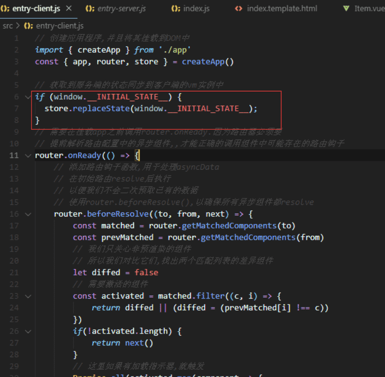

作者：木子水吉

链接：https://juejin.im/post/5d9848306fb9a04ddf2c341b

来源：掘金著作权归作者所有。

## 前言

大家可能都知道单页面的SEO不友好，但是你有没有思考过为什么单页面的SEO不友好呢？在单页面盛行的今天，有哪些策略来规避掉这一缺点呢？很好奇有木有？那就跟我一起开启探索之旅吧~

## 搜索引擎的工作原理

在搜索引擎网站的后台会有一个非常庞大的数据库，里面存储了海量的关键词，而每个关键词又对应着很多网址，这些网址是被称之为“搜索引擎蜘蛛”或“网络爬虫”程序从茫茫的互联网上一点一点下载收集而来的。随着各种各样网站的出现，这些勤劳的“蜘蛛”每天在互联网上爬行，从一个链接到另一个链接，下载其中的内容，进行分析提炼，找到其中的关键词，如果“蜘蛛”认为关键词在数据库中没有而对用户是有用的便存入后台的数据库中。反之，如果“蜘蛛”认为是垃圾信息或重复信息，就舍弃不要，继续爬行，寻找最新的、有用的信息保存起来提供用户搜索。当用户搜索时，就能检索出与关键字相关的网址显示给访客。一个关键词对用多个网址，因此就出现了排序的问题，相应的当与关键词最吻合的网址就会排在前面了。在“蜘蛛”抓取网页内容，提炼关键词的这个过程中，就存在一个问题：“蜘蛛”能否看懂。如果网站内容是flash和js等，那么它是看不懂的，会犯迷糊，即使关键字再贴切也没用。相应的，如果网站内容可以被搜索引擎能识别，那么搜索引擎就会提高该网站的权重，增加对该网站的友好度。

## SEO介绍

SEO是搜索引擎优化(Search Engine Optimization)的英文缩写,意指在了解搜索引擎自然排名机制的基础上,对网站进行内部及外部的调整优化,改进网站在搜索引擎中的关键词自然排名,获得更多的流量,从而达成网站销售以及品牌建设的预期目标.

SEO的主要工作是通过了解各类搜索引擎如何抓取互联网页面,如何进行索引以及如何确定其对某一特定关键词的搜索结果排名等技术,来对网页进行相关的优化,使其提高搜索引擎排名,从而提高访问量,最终提升网站的销售能力或宣传能力的技术.增加网站曝光率,提高整站权重,让用户更容易搜索到你的网站,进而带来客观的流量.通过这一策略引流的优点是: 1. 低成本; 2. 持久性; 3. 不需要承担"无效点击"的风险.

这里简单写一点SEO的优化方向:

1. 网站设计优化

- 网站主标题关键词优化，必须选择好关键词，一般以“一个核心词+三五个长尾词”组合成标题。
- 网站布局的优化。一般来说，企业产品网站，主要是F型布局，内容繁多的网站以“扁平结构”布局为主。
- 代码优化，就是板块、栏目代码，最好使用对应的简拼或者全拼。

1. 网站内容优化

- 分析栏目关键词，有哪些长尾词，挖掘出来，做成表格的形式。然后，逐个分析长尾词都有哪些内容有关，形成二级长尾词。
- 根据挖掘的长尾词，分析用户需求，挖掘与之有关的内容，整理出文章，发布在网站上，一定确保高质量文章。

## 为什么说单页面的SEO不友好

因为单页面的情况下的页面中的很多内容都是根据匹配到的路由动态生成并展示出来的,而且很多页面内容是通过ajax异步获取的,网络抓取工具并不会等待异步请求完成后再行抓取页面内容,对于网络抓取工来说去准确模拟相关的行为获取复合数据是很困难的,它们更擅长对静态资源的抓取和分析.

## 如何解决单页面SEO不友好的问题

明白了问题出在哪里,“搜索引擎蜘蛛”或“网络爬虫”程序更擅长对静态资源的抓取和更新,那我们就要采取相应策略生成尽可能多的静态资源,来让网络爬虫获取更多的数据,从而提升网站的搜索排名.目前市面上用的比较多的就是以下两种策略: 预渲染和SSR(服务端渲染).

简单介绍下SEO的一些优化策略:

### 预渲染

预渲染是基于`prerender-spa-plugin`在项目构建时,通过无头浏览器模拟浏览器请求,将得到的数据插入给出的模板中,从而生成已经包含数据的html,这样有了更多的静态资源,网络爬虫可以抓取到更多的网站信息,提升网站的搜索排名.我最近在使用react做官网,考虑到单页面的SEO的问题和官网大多都是静态资源,采用了预渲染技术,想在这里跟大家分享一下.

这里的预渲染是使用`prerender-spa-plugin`模块,结合`webpack`来生成一些路由对应的静态页面.我的项目是使用`create-react-app`脚手架构建的,在`config-overrides.js`里来进行自定义的webpack配置.

```js
// 在create-react-app 2.x以下的的版本里,   
// 在config-overrides.js是这样配置预渲染的
const PrerenderSPAPlugin = require('prerender-spa-plugin');
const path = require('path');
module.exports = function override(config, env) {
  if (env === 'production') {
    config.plugins = config.plugins.concat([
      new PrerenderSPAPlugin({
        routes: ['/', '/home', 'about'],
        staticDir: path.join(__dirname, 'build'),
      }),
    ]);
  }
  return config;
};

// create-react-app 2.x 以上的ban版本是这样配置的
const { override, fixBabelImports, addLessLoader, addWebpackAlias, addWebpackPlugin } = require('customize-cra');
const PrerenderSPAPlugin = require('prerender-spa-plugin');
const path = require('path');
// 除了单独定义一个功能函数你还可以使用
// customize-cra提供的addWebpackPlugin来添加插件
// 感兴趣的小伙伴可以自行百度使用方法
const addConfigPlugin = config => {
    // 在这里我们还可以很方便的对config扩展别的配置项
    if(process.env.NODE_ENV === 'production') {
        config.plugins = config.plugins.concat([
            new PrerenderSPAPlugin({
                routes: ['/', '/home', 'about'],
                staticDir: path.join(__dirname, 'build'),
            })
        ]);
    }
    return config
}
// 我的理解override函数的本质还是处理config对象并返回
module.exports =  override(
    addConfigPlugin,
    // 这里是按需加载antd
    fixBabelImports('import', {        
        libraryName: 'antd',        
        libraryDirectory: 'es',       
        style: 'css'
    })
)
```

`create-react-app`官方文档关于预渲染也提供了相应的解决方案[戳这里](https://create-react-app.dev/docs/pre-rendering-into-static-html-files).

### SSR(服务端渲染)

服务端渲染就是先向后端服务器请求数据,然后生成完整首屏html返回给浏览器, 服务端渲染返回给客户端的是已经获取了异步数据并执行JavaScript脚本的最终HTML,网络爬虫可以抓取到完整的页面信息,SSR另一个很大的作用是加速首屏渲染,因为无需等待所有的JavaScript都完成下载并执行,才显示服务端渲染的标记,所以用户会更快地看到完整渲染的页面.

**SSR相比预渲染的优势**

1. 更快的构建速度,SSR是动态插入数据,并不会在构建时就去预加载数据,而是在输入url后在服务端请求,拿到返回的数据插入模板后再返回给客户端.
2. 嵌套路由下的个性化页面加载,个性化页面无法进行预渲染,SSR可以解决.
3. 更好的SEO.
4. 更快地首屏加载速度(请求业务数据,和将数据render成html片段都在服务端进行了,浏览器负责加载资源,请求CDN资源,css渲染,到达时间缩短.)

这里推荐一个基于Vue.js的服务端渲染应用框架[Nuxt.js](https://zh.nuxtjs.org/),想要了解的可自行查看官方文档.

我这里的代码示例就采用最基础简洁的技术来实现一个简单的Vue SSR的示例.完整版的实现[戳这里](https://github.com/muzishuiji/vue-ssr)

```js
// 一个基础版本的ssr的实现
const server = require('express')()
const Vue = require('vue')
const fs = require('fs')
const vueServerRender= require('vue-server-renderer');
// 生成一个render函数
const Renderer = vueServerRender.createRenderer({
    // 定义一个基础的模板页面
    template:fs.readFileSync('./src/index.template.html', 'utf-8')
})
server.get('*', (req, res) => {
    // 创建一个vue组件
    const app = new Vue({
        data: {
            name: 'this is vue ssr basic demo',
            url: req.url
        },
        template:'<div> {{name}}, current url is: {{url}}</div>'
    })
    const context = {
        title: 'SSR test#'
    }
    // 将vue实例和对应的传参转换成html字符串
    Renderer.renderToString(app, context, (err, html) => {
        if(err) {
            console.log(err)
            res.status(500).end('server error')
        }
        // 返回渲染完成的页面
        res.end(html)
    })
})
const port = process.env.PORT || 8008;
// 运行服务器端
server.listen(port, () => {
  console.log(`server started at localhost:${port}`);
})
```

结合`vue-server-renderer`开发一个SSR项目,还是有一定挑战的,我也是折腾了一番才成功运行,会踩到的坑就是vue生成的Virtual Dom与服务端渲染的内容不匹配的问题.


 遇到这个问题需要检查`./entry-client.js`中有没有进行状态同步 



如果你们想要动手实现一个不急于Nuxt框架的SSR项目,我的建议是先去查看官方文档[Nuxt](https://zh.nuxtjs.org/guide),然后尝试自己实现一个小型项目,遇到问题可以参考我的实现[vue-ssr-demo](https://github.com/muzishuiji/vue-ssr-demo),还有一个尤大写的一个demo,这个demo实现的功能更强大,更完善,但是很多模块的版本比较低,有些新版本的api可能会有所变化,有些模块依赖node@9以下的版本,想要正确运行可能需要费点功夫[vue-hackernews-2.0](https://github.com/vuejs/vue-hackernews-2.0).

## 单多页应用的区别

### **单页应用（SinglePage Application，SPA）**

> 指只有一个主页面的应用，一开始只需加载一次 `js,css` 等相关资源。所有的内容都包含在主页面，对每一个功能模块组件化。单页应用跳转，就是切换相关组件，仅刷新局部资源。

### **多页应用（MultiPage Application，MPA）**

> 指有多个独立的页面的应用，每个页面必须重复加载 `js,css` 等相关资源。多页应用跳转，需要整页资源刷新。

两者对比表格：

|          |                             SPA                              |                             MPA                              |
| :------: | :----------------------------------------------------------: | :----------------------------------------------------------: |
|   结构   |                 一个主页面 + 许多模块的组件                  |                        许多完整的页面                        |
|   体验   | 页面切换快，体验佳；当初次加载文件过多时，需要做相关的调优。 |            页面切换慢，网速慢的时候，体验尤其不好            |
| 资源文件 |                 组件公用的资源只需要加载一次                 |                每个页面都要自己加载公用的资源                |
| 适用场景 | 对体验度和流畅度有较高要求的应用，不利于 SEO（可借助 SSR 优化 SEO） |                 适用于对 SEO 要求较高的应用                  |
| 过渡动画 |          Vue 提供了 transition 的封装组件，容易实现          |                           很难实现                           |
| 内容更新 |                  相关组件的切换，即局部更新                  |           整体 HTML 的切换，费钱（重复 HTTP 请求）           |
| 路由模式 |              可以使用 hash ，也可以使用 history              |                         普通链接跳转                         |
| 数据传递 |             因为单页面，使用全局变量就好（Vuex）             |  cookie 、localStorage 等缓存方案，URL 参数，调用接口保存等  |
| 相关成本 |              前期开发成本较高，后期维护较为容易              | 前期开发成本低，后期维护就比较麻烦，因为可能一个功能需要改很多地方 |