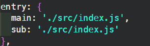
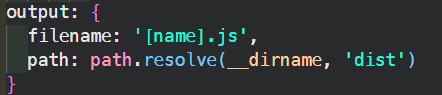
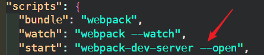
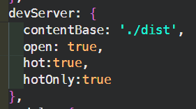
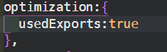
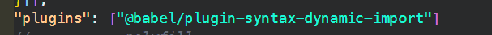

webpack就是一个模块打包工具

webpack.config.js（默认的配置文件）

改变默认的配置文件：npx webpack --config webpackconfig.js

## loader是打包方案

file-loader与url-loader(**url-loader比file-loader多一个最小limit限制，小于此限制就把文件打包进bundle文件里，大于则另外生成文件**)都可对图片进行打包

css则是：style-loader与css-loader

scss则要加上sass-loader和安装node-sass

要对属性加上浏览器前缀则加上postcss-loader和配置postcss.config.js文件

## 配置项

- mode:'development'(**打包出来的文件不会被压缩**),

​			'production'(**打包出来的会被压缩**)

- entry:配置多个入口文件只需加入多个

- output：输出多个出口文件

- devtools:'source-map'（开启source-map，可以识别映射错误行号 ）

  cheap：只精准到行，module:loader模块也可以识别，inline：精准到行列，比较耗时间，eval是最快的。平时开发推荐使用下面这种

  

## 插件

- plugin插件可以在webpack运行到某个时刻的时候，帮你做一些事情。
- HtmlWebpackPlugin 会在打包结束后，自动生成一个html文件，并把打包生成的js自动引入到这个html文件中，new对象时配置template可以生成index.html的模板
- CleanWebpackPlugin会在打包前先删除dist文件夹，然后webpack再打包：new CleanWebpackPlugin({root: path.resolve(__dirname, '../')})

## 实现热更新的几种方式

- 在package.json中加入
- 使用webpack-dev-server:打包后的文件是放在电脑内存的，提高开发效率，我们看不见在配置里加上，然后在package.json里加入命令，优势就在于不仅可以做到更新，而已会自动刷新网页，开启一个服务占据端口。
- 使用node(express)开启服务:

## 热模块更新

开启HotModuleReplacementPlugin(改变了css,没有去刷新页面，只是更新了样式)：

CSS如果有css-loader就不用写

js没有则要写这个。平时开发vue、react有vue-router自动实现这功能，不用手写。

## babel

https://www.babeljs.cn/setup#installation

#### @babel/polyfill：Babel包含一个[polyfill](https://en.wikipedia.org/wiki/Polyfill_(programming))，它包含一个自定义的[再生器运行时](https://github.com/facebook/regenerator/blob/master/packages/regenerator-runtime/runtime.js)和[core-js](https://github.com/zloirock/core-js)。此插件会污染全局环境，不适合类库代码，适合业务代码

https://www.babeljs.cn/docs/babel-polyfill，配置只需要加入业务代码到main.js里面，不用打包全部的polyfill，加入useBuiltIns

#### @babel/plugin-transform-runtime：一个插件，可以重复使用Babel注入的帮助程序代码来节省代码。适合类库代码

## Tree Shaking(摇树)

指的是按需引入时只需要打包需要的模块，不需要打包全部,只支持ES Module(即静态引入)

使用：1.在配置文件里加上（production模式下不用加这个）

​			2.在package.json里加上"sideEffects":false(如果有需要处理的特殊文件，例如import '@babel/polyfill'这种没有导出的，则需要在"sideEffects":['@babel/polyfill']这样加入处理)

## development和production模式区别打包

通过webpack-merge实现提取公共相同部分为webpack.common.js,然后再merge

## Webpack 和 Code Splitting

main.js被拆成lodash.js(1MB),main,js(1MB)

当页面业务逻辑发生变化时，只要加载main.js即可(1MB)

- 同步的:yum:加入配置项，自动分割代码

- 异步代码无需做任何配置，会自动进行代码分割

  

SplitChunksPlugin 配置参数详解

*/\* webpackChunkName:"lodash" \*/* 

