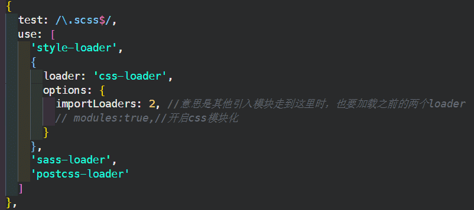

webpack就是一个模块打包工具

webpack.config.js（默认的配置文件）

改变默认的配置文件：npx webpack --config webpackconfig.js

### loader是打包方案

file-loader与url-loader(**url-loader比file-loader多一个最小limit限制，小于此限制就把文件打包进bundle文件里，大于则另外生成文件**)都可对图片进行打包

css则是：style-loader与css-loader

scss则要加上sass-loader和安装node-sass

要对属性加上浏览器前缀则加上postcss-loader和配置postcss.config.js文件

### 配置项

- mode:'development'(**打包出来的文件不会被压缩**),

​			'production'(**打包出来的会被压缩**)

- entry:配置多个入口文件只需加入多个

- output：输出多个出口文件

- devtools:'source-map'（开启source-map，可以识别映射错误行号 ）

  cheap：只精准到行，module:loader模块也可以识别，inline：精准到行列，比较耗时间，eval是最快的。平时开发推荐使用下面这种

  

### 插件

- plugin插件可以在webpack运行到某个时刻的时候，帮你做一些事情。
- HtmlWebpackPlugin 会在打包结束后，自动生成一个html文件，并把打包生成的js自动引入到这个html文件中，new对象时配置template可以生成index.html的模板
- CleanWebpackPlugin会在打包前先删除dist文件夹，然后webpack再打包：new CleanWebpackPlugin(['dist'])

实现热更新的几种方式

- 在package.json中加入
- 

