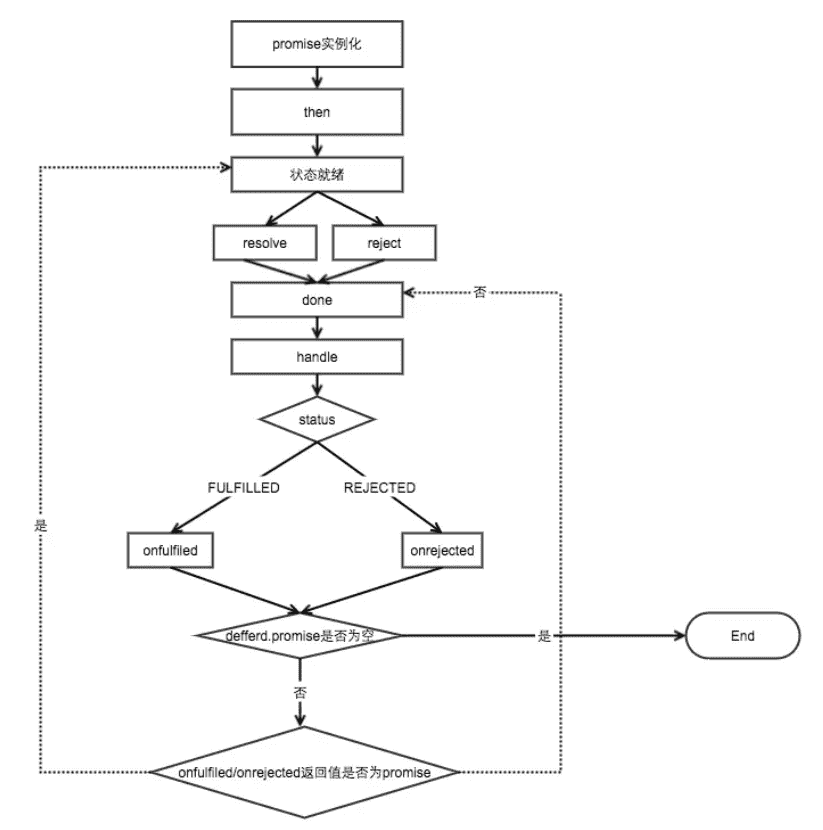

## 防抖

```js
// 防抖函数ES6
const debounce = (fn, delay) => {
  let timer = null;
  return (...args) => {
    clearTimeout(timer);
    timer = setTimeout(() => {
      fn.apply(this, args);
    }, delay);
  };
};

//ES5
function debounce1(fn, wait) {
  var timeout = null;
  return function () {
    if (timeout !== null) {
      clearTimeout(timeout);
    }
    timeout = setTimeout(fn, wait);
  }
}
```

## 节流

```js
//手写节流
function throttle(fn, wait) {
  let prev = new Date();
  return function () {
    const args = arguments;
    const now = new Date()
    if (now - prev > wait) {
      fn.apply(this, args);
      prev = new Date();
    }
  }
}

//小红书版本
function throttle2(fn, wait, context) {
  clearTimeout(fn.tId)
  fn.tId = setTimeout(function () {
    fn.call(context)
  }, wait)
}
```

## 深拷贝

```js
//乞丐版
var newObj = JSON.parse( JSON.stringify( someObj ) );

//简单版对象深度克隆
function deepclone(obj) {
  if (typeof obj == "object") {
    let newObj = obj instanceof Array ? [] : {};
    for (let item in obj) {
      let temple = typeof obj[item] == 'object' ? deepclone(obj[item]) : obj[item]
      newObj[item] = temple;
    }
    return newObj;
  } else {
    return obj;
  }
}
```

## instanceof

```js
function instanceOf(left, right) {
  let left = left.__proto__;
  let right = right.prototype;
  while (true) {
    if (left === null) return false;
    if (left === right) return true;
    left = left.__proto__;
  }
}
```

## new

`new`操作符做了这些事：

- 它创建了一个全新的对象。
- 它会被执行`[[Prototype]]`（也就是`__proto__`）链接。
- 它使`this`指向新创建的对象。。
- 通过`new`创建的每个对象将最终被`[[Prototype]]`链接到这个函数的`prototype`对象上。
- 如果函数没有返回对象类型`Object`(包含`Functoin, Array, Date, RegExg, Error`)，那么`new`表达式中的函数调用将返回该对象引用。

```js
// 实现一个new操作符
function New(func) {
  var res = {};
  if (func.prototype !== null) {
    res.__proto__ = func.prototype;
  }
  var ret = func.apply(res, Array.prototype.slice.call(arguments, 1));
  if ((typeof ret !== 'function' || typeof ret !== 'object') && ret !== null){
    return ret;
  }
  return res;
}
```

## call

```js
//手写一个call
Function.prototype.call2 = function (context = window) {
  context.fn = this;
  let args = [...arguments].slice(1);
  let result = context.fn(...args);
  delete context.fn;
  return result;
}
```

## apply

```js
// 手写一个apply
Function.prototype.apply2 = function (context = window) {
  context.fn = this;
  let result;
  if (arguments[1]) {
    result = context.fn(...arguemnts[1])
  } else {
    result = context.fn();
  }
  delete context.fn;
  return result;
}
```

## bind

```js
// 手写bind
//简单版
function bind(fn, context) {
  return function () {
    return fn.apply(context, arguments)
  }
}

//一般版
function bind2(obj, arg) {
  var arg = Array.prototype.slice(arguments, 1);
  var context = this;
  return function (newArg) {
    arg = arg.concat(Array.prototype.slice.call(newArg));
    return context.apply(obj, arg);
  }
}
```

## 继承

### 构造函数方式

```js
/**
 * 借助构造函数实现继承
 */
function Parent1() {
  this.name = 'parent1';
}
Parent1.prototype.say = function () {
  console.log('hello world');
}

function Child1() {
  Parent1.call(this);
  this.type = 'child1';
}
```

:yum:上方代码中，最重要的那行代码：在子类的构造函数里写了`Parent1.call(this);`，意思是：**让Parent1的构造函数在child1的构造函数中执行**。发生的变化是：**改变this的指向**，parent的实例 --> 改为指向child的实例。导致 parent1的实例的属性挂在到了child1的实例上，这就实现了继承。这种方式，虽然改变了 this 的指向，但是，**Child1 无法继承 Parent1 的原型**。也就是说，如果我给 Parent1 的原型增加一个方法，原型的方法是无法被继承的。

### 原型链方式

```js
/**
 * 借助原型链实现继承
 */
function Parent2() {
  this.name = 'parent2';
  this.play = [1, 2, 3];
}

function Child2() {
  this.type = 'child2';
}
Child2.prototype = new Parent2();
// Child2.prototype = Parent2.prototype;
```

:yum:上方代码中，最重要的那行：每个函数都有`prototype`属性，于是，构造函数也有这个属性，这个属性是一个对象。现在，**我们把Parent2的实例赋值给了Child2的prototye**，从而实现**继承**。此时，`Child`构造函数、`Parent`的实例、`Child`的实例构成一个三角关系。于是：

- `new Child2.__proto__ === new Parent2()`的结果为true

### 组合方式(寄生组合式)

```js
/**
 * 组合方式(寄生组合式)
 */
function Parent3() {
  this.name = 'parent3';
  this.play = [1, 2, 3];
}

function Child3() {
  Parent3.call(this);
  this.type = 'Child3';
}
//Object.create是创建了父类原型的副本，与父类原型完全隔离
Child3.prototype = Object.create(Parent3.prototype);
// 注意记得把子类的构造指向子类本身
Child3.prototype.constructor = Child3;
//不用 Child3.prototype = new Parent3() 的原因是会调用2次父类的构造方法（另一次是call），会存在一份多余的父类实例属性。
//这一步不用 Child3.prototype =Parent3.prototype 的原因是怕共享内存，修改父类原型对象就会影响子类。
```

:yum:这种方式，能解决之前两种方式的问题：既可以继承父类原型的内容，也不会造成原型里属性的修改。

详情请跳转[js八大继承方案](/font/JS/构造函数、原型、继承和原型链.md#javascript常用八种继承方案)一文

## Promise

以下转载自：<https://juejin.im/post/5c9c3989e51d454e3a3902b6#heading-15>

我们来过一遍`Promise/A+`规范：

- 三种状态`pending| fulfilled(resolved) | rejected`
- 当处于`pending`状态的时候，可以转移到`fulfilled(resolved)`或者`rejected`状态
- 当处于`fulfilled(resolved)`状态或者`rejected`状态的时候，就不可变。

1. 必须有一个`then`异步执行方法，`then`接受两个参数且必须返回一个promise：

```js
// onFulfilled 用来接收promise成功的值
// onRejected 用来接收promise失败的原因
promise1=promise.then(onFulfilled, onRejected);
```

### 8.1 `Promise`的流程图分析



来回顾下`Promise`


```js
var promise = new Promise((resolve,reject) => {
    if (操作成功) {
        resolve(value)
    } else {
        reject(error)
    }
})
promise.then(function (value) {
    // success
},function (value) {
    // failure
})
```

### 8.2 面试够用版

> 来源：[实现一个完美符合Promise/A+规范的Promise](https://link.juejin.im?target=https%3A%2F%2Fgithub.com%2Fforthealllight%2Fblog%2Fissues%2F4)

```js
function myPromise(constructor){
    let self=this;
    self.status="pending" //定义状态改变前的初始状态
    self.value=undefined;//定义状态为resolved的时候的状态
    self.reason=undefined;//定义状态为rejected的时候的状态
    function resolve(value){
        //两个==="pending"，保证了状态的改变是不可逆的
       if(self.status==="pending"){
          self.value=value;
          self.status="resolved";
       }
    }
    function reject(reason){
        //两个==="pending"，保证了状态的改变是不可逆的
       if(self.status==="pending"){
          self.reason=reason;
          self.status="rejected";
       }
    }
    //捕获构造异常
    try{
       constructor(resolve,reject);
    }catch(e){
       reject(e);
    }
}
```

同时，需要在`myPromise`的原型上定义链式调用的`then`方法：

```js
myPromise.prototype.then=function(onFullfilled,onRejected){
   let self=this;
   switch(self.status){
      case "resolved":
        onFullfilled(self.value);
        break;
      case "rejected":
        onRejected(self.reason);
        break;
      default:       
   }
}
```

测试一下：

```js
var p=new myPromise(function(resolve,reject){resolve(1)});
p.then(function(x){console.log(x)})
//输出1
```

### 8.3 大厂专供版

直接贴出来吧，这个版本还算好理解

```js
const PENDING = "pending";
const FULFILLED = "fulfilled";
const REJECTED = "rejected";

function Promise(excutor) {
    let that = this; // 缓存当前promise实例对象
    that.status = PENDING; // 初始状态
    that.value = undefined; // fulfilled状态时 返回的信息
    that.reason = undefined; // rejected状态时 拒绝的原因
    that.onFulfilledCallbacks = []; // 存储fulfilled状态对应的onFulfilled函数
    that.onRejectedCallbacks = []; // 存储rejected状态对应的onRejected函数

    function resolve(value) { // value成功态时接收的终值
        if(value instanceof Promise) {
            return value.then(resolve, reject);
        }
        // 实践中要确保 onFulfilled 和 onRejected 方法异步执行，且应该在 then 方法被调用的那一轮事件循环之后的新执行栈中执行。
        setTimeout(() => {
            // 调用resolve 回调对应onFulfilled函数
            if (that.status === PENDING) {
                // 只能由pending状态 => fulfilled状态 (避免调用多次resolve reject)
                that.status = FULFILLED;
                that.value = value;
                that.onFulfilledCallbacks.forEach(cb => cb(that.value));
            }
        });
    }
    function reject(reason) { // reason失败态时接收的拒因
        setTimeout(() => {
            // 调用reject 回调对应onRejected函数
            if (that.status === PENDING) {
                // 只能由pending状态 => rejected状态 (避免调用多次resolve reject)
                that.status = REJECTED;
                that.reason = reason;
                that.onRejectedCallbacks.forEach(cb => cb(that.reason));
            }
        });
    }

    // 捕获在excutor执行器中抛出的异常
    // new Promise((resolve, reject) => {
    //     throw new Error('error in excutor')
    // })
    try {
        excutor(resolve, reject);
    } catch (e) {
        reject(e);
    }
}

Promise.prototype.then = function(onFulfilled, onRejected) {
    const that = this;
    let newPromise;
    // 处理参数默认值 保证参数后续能够继续执行
    onFulfilled =
        typeof onFulfilled === "function" ? onFulfilled : value => value;
    onRejected =
        typeof onRejected === "function" ? onRejected : reason => {
            throw reason;
        };
    if (that.status === FULFILLED) { // 成功态
        return newPromise = new Promise((resolve, reject) => {
            setTimeout(() => {
                try{
                    let x = onFulfilled(that.value);
                    resolvePromise(newPromise, x, resolve, reject); // 新的promise resolve 上一个onFulfilled的返回值
                } catch(e) {
                    reject(e); // 捕获前面onFulfilled中抛出的异常 then(onFulfilled, onRejected);
                }
            });
        })
    }

    if (that.status === REJECTED) { // 失败态
        return newPromise = new Promise((resolve, reject) => {
            setTimeout(() => {
                try {
                    let x = onRejected(that.reason);
                    resolvePromise(newPromise, x, resolve, reject);
                } catch(e) {
                    reject(e);
                }
            });
        });
    }

    if (that.status === PENDING) { // 等待态
        // 当异步调用resolve/rejected时 将onFulfilled/onRejected收集暂存到集合中
        return newPromise = new Promise((resolve, reject) => {
            that.onFulfilledCallbacks.push((value) => {
                try {
                    let x = onFulfilled(value);
                    resolvePromise(newPromise, x, resolve, reject);
                } catch(e) {
                    reject(e);
                }
            });
            that.onRejectedCallbacks.push((reason) => {
                try {
                    let x = onRejected(reason);
                    resolvePromise(newPromise, x, resolve, reject);
                } catch(e) {
                    reject(e);
                }
            });
        });
    }
};
```


## JSON.parse

```js
//第一种：使用eval，它会执行JS代码，有XSS漏洞。
var jsonStr1 = '{"a":"1", "b":2}';
var obj1 = eval("(" + json + ")"); // obj 就是 json 反序列化之后得到的对象

//第二种，使用new Function
var jsonStr2 = '{ "age": 20, "name": "jack" }'
var obj2 = (new Function('return ' + jsonStr))();
```

## JSON.stringify

转载自：<https://juejin.im/post/5c9c3989e51d454e3a3902b6#heading-1>

> `JSON.stringify(value[, replacer [, space]])`：

- `Boolean | Number| String` 类型会自动转换成对应的原始值。
- `undefined`、任意函数以及`symbol`，会被忽略（出现在非数组对象的属性值中时），或者被转换成 `null`（出现在数组中时）。
- 不可枚举的属性会被忽略
- 如果一个对象的属性值通过某种间接的方式指回该对象本身，即循环引用，属性也会被忽略。

```js
function jsonStringify(obj) {
    let type = typeof obj;
    if (type !== "object") {
        if (/string|undefined|function/.test(type)) {
            obj = '"' + obj + '"';
        }
        return String(obj);
    } else {
        let json = []
        let arr = Array.isArray(obj)
        for (let k in obj) {
            let v = obj[k];
            let type = typeof v;
            if (/string|undefined|function/.test(type)) {
                v = '"' + v + '"';
            } else if (type === "object") {
                v = jsonStringify(v);
            }
            json.push((arr ? "" : '"' + k + '":') + String(v));
        }
        return (arr ? "[" : "{") + String(json) + (arr ? "]" : "}")
    }
}
jsonStringify({x : 5}) // "{"x":5}"
jsonStringify([1, "false", false]) // "[1,"false",false]"
jsonStringify({b: undefined}) // "{"b":"undefined"}"
```

## 函数柯里化

以下部分转载自<https://juejin.im/post/5c9c3989e51d454e3a3902b6#heading-12>

**什么是柯里化？**

> 在计算机科学中，柯里化（Currying）是把接受多个参数的函数变换成接受一个单一参数（最初函数的第一个参数）的函数，并且返回接受余下的参数且返回结果的新函数的技术。

**函数柯里化的主要作用和特点就是参数复用、提前返回和延迟执行。**

```js
/**
 * 函数柯里化 ES5实现
 */
function curry(fn, args) {
  var length = fn.length;
  var args = args || [];
  return function () {
    newArgs = args.concat(Array.prototype.slice.call(arguments));
    if (newArgs.length < length) {
      return curry.call(this, fn, newArgs);
    } else {
      return fn.apply(this, newArgs);
    }
  }
}

/**
 * ES6实现
 */
function currying(fn, ...args) {
  if (args.length >= fn.length) {
    return fn(...args);
  } else {
    return (...args2) => currying(fn, ...args, ...args2);
  }
}

function multiFn(a, b, c) {
  return a * b * c;
}

var multi = curry(multiFn);

multi(2)(3)(4);
multi(2, 3, 4);
multi(2)(3, 4);
multi(2, 3)(4);
```


## 数组扁平化

```js
// ES6就有自带的flat()API可供扁平化使用
//标准版
Array.prototype.flat = function () {
  let arr = [];
  this.forEach((item) => {
    if (Array.isArray(item)) {
      arr = arr.concat(item.flat()); //递归去处理数组元素
    } else {
      arr.push(item); //非数组直接push进去
    }
  })
  return arr; //递归出口
}
```

