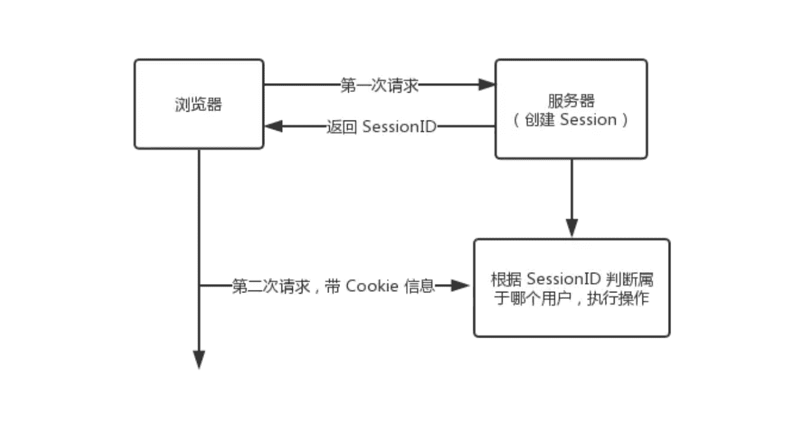

## 1.什么是Cookie与Session

**什么是 Cookie**

HTTP Cookie（也叫 Web Cookie或浏览器 Cookie）是服务器发送到用户浏览器并保存在本地的一小块数据，它会在浏览器下次向同一服务器再发起请求时被携带并发送到服务器上。通常，它用于告知服务端两个请求是否来自同一浏览器，如保持用户的登录状态。Cookie 使基于无状态的 HTTP 协议记录稳定的状态信息成为了可能。

Cookie 主要用于以下三个方面：

- 会话状态管理（如用户登录状态、购物车、游戏分数或其它需要记录的信息）
- 个性化设置（如用户自定义设置、主题等）
- 浏览器行为跟踪（如跟踪分析用户行为等）

**什么是 Session**

Session 代表着服务器和客户端一次会话的过程。Session 对象存储特定用户会话所需的属性及配置信息。这样，当用户在应用程序的 Web 页之间跳转时，存储在 Session 对象中的变量将不会丢失，而是在整个用户会话中一直存在下去。当客户端关闭会话，或者 Session 超时失效时会话结束。

## 2.两者的区别

Cookie 和 Session 有什么不同？

- 作用范围不同，Cookie 保存在客户端（浏览器），Session 保存在服务器端。
- 存取方式的不同，Cookie 只能保存 字符串，Session 可以存任意数据类型，一般情况下我们可以在 Session 中保持一些常用变量信息，比如说 UserId 等。
- 有效期不同，Cookie 可设置为长时间保持，比如我们经常使用的默认登录功能，Session 一般失效时间较短，客户端关闭或者 Session 超时都会失效。
- 隐私策略不同，Cookie 存储在客户端，比较容易遭到不法获取，早期有人将用户的登录名和密码存储在 Cookie 中导致信息被窃取；Session 存储在服务端，安全性相对 Cookie 要好一些。
- 存储大小不同， 单个 Cookie 保存的数据不能超过 4K，Session 可存储数据远高于 Cookie

## 3.如何配合

为什么需要 Cookie 和 Session，他们有什么关联？

说起来为什么需要 Cookie ，这就需要从浏览器开始说起，我们都知道浏览器是没有状态的(HTTP 协议无状态)，这意味着浏览器并不知道是张三还是李四在和服务端打交道。这个时候就需要有一个机制来告诉服务端，本次操作用户是否登录，是哪个用户在执行的操作，那这套机制的实现就需要 Cookie 和 Session 的配合。

那么 Cookie 和 Session 是如何配合的呢？我画了一张图大家可以先了解下。



用户第一次请求服务器的时候，服务器根据用户提交的相关信息，创建创建对应的 Session ，请求返回时将此 Session 的唯一标识信息 SessionID 返回给浏览器，浏览器接收到服务器返回的 SessionID 信息后，会将此信息存入到 Cookie 中，同时 Cookie 记录此 SessionID 属于哪个域名。

当用户第二次访问服务器的时候，请求会自动判断此域名下是否存在 Cookie 信息，如果存在自动将 Cookie 信息也发送给服务端，服务端会从 Cookie 中获取 SessionID，再根据 SessionID 查找对应的 Session 信息，如果没有找到说明用户没有登录或者登录失效，如果找到 Session 证明用户已经登录可执行后面操作。

根据以上流程可知，SessionID 是连接 Cookie 和 Session 的一道桥梁，大部分系统也是根据此原理来验证用户登录状态。

## 4.禁止Cookie后的正常运转

既然服务端是根据 Cookie 中的信息判断用户是否登录，那么如果浏览器中禁止了 Cookie，如何保障整个机制的正常运转。

第一种方案，每次请求中都携带一个 SessionID 的参数，也可以 Post 的方式提交，也可以在请求的地址后面拼接 `xxx?SessionID=123456...`。

第二种方案，Token 机制。Token 机制多用于 App 客户端和服务器交互的模式，也可以用于 Web 端做用户状态管理。

Token 的意思是“令牌”，是服务端生成的一串字符串，作为客户端进行请求的一个标识。Token 机制和 Cookie 和 Session 的使用机制比较类似。

当用户第一次登录后，服务器根据提交的用户信息生成一个 Token，响应时将 Token 返回给客户端，以后客户端只需带上这个 Token 前来请求数据即可，无需再次登录验证。

## 5.分布式Session问题

如何考虑分布式 Session 问题？

在互联网公司为了可以支撑更大的流量，后端往往需要多台服务器共同来支撑前端用户请求，那如果用户在 A 服务器登录了，第二次请求跑到服务 B 就会出现登录失效问题。

分布式 Session 一般会有以下几种解决方案：

- Nginx ip_hash 策略，服务端使用 Nginx 代理，每个请求按访问 IP 的 hash 分配，这样来自同一 IP 固定访问一个后台服务器，避免了在服务器 A 创建 Session，第二次分发到服务器 B 的现象。
- Session 复制，任何一个服务器上的 Session 发生改变（增删改），该节点会把这个 Session 的所有内容序列化，然后广播给所有其它节点。
- 共享 Session，服务端无状态话，将用户的 Session 等信息使用缓存中间件来统一管理，保障分发到每一个服务器的响应结果都一致。

建议采用第三种方案。

## 6.跨域请求

如何解决跨域请求？Jsonp 跨域的原理是什么？

说起跨域请求，必须要了解浏览器的同源策略，同源策略/SOP（Same origin policy）是一种约定，由 Netscape 公司 1995年引入浏览器，它是浏览器最核心也最基本的安全功能，如果缺少了同源策略，浏览器很容易受到 XSS、CSFR 等攻击。所谓同源是指"协议+域名+端口"三者相同，即便两个不同的域名指向同一个 ip 地址，也非同源。

解决跨域请求的常用方法是：

- 通过代理来避免，比如使用 Nginx 在后端转发请求，避免了前端出现跨域的问题。
- 通过 Jsonp 跨域
- 其它跨域解决方案

重点谈一下 Jsonp 跨域原理。浏览器的同源策略把跨域请求都禁止了，但是页面中的 `<script><iframe>`标签是例外，不受同源策略限制。Jsonp 就是利用 `<script>` 标签跨域特性进行跨域数据访问。

JSONP 的理念就是，与服务端约定好一个回调函数名，服务端接收到请求后，将返回一段 Javascript，在这段  Javascript 代码中调用了约定好的回调函数，并且将数据作为参数进行传递。当网页接收到这段 Javascript 代码后，就会执行这个回调函数，这时数据已经成功传输到客户端了。

JSONP 的缺点是：它只支持 GET 请求，而不支持 POST 请求等其他类型的 HTTP 请求。

作者：ityouknow

链接：https://juejin.im/post/5cd9037ee51d456e5c5babca

来源：掘金

著作权归作者所有。商业转载请联系作者获得授权，非商业转载请注明出处。

## 7.localStorage，sessionStorage和cookie的区别

**共同点**：都是保存在浏览器端、且同源的

- ```
  数据存储方面
  ```

  - **cookie数据**始终在同源的http请求中携带（即使不需要），即cookie在浏览器和服务器间来回传递。cookie数据还有路径（path）的概念，可以限制cookie只属于某个路径下
  - **sessionStorage和localStorage**不会自动把数据发送给服务器，仅在**本地保存**。

- ```
  存储数据大小
  ```

  - 存储大小限制也不同，**cookie数据**不能超过4K，同时因为每次http请求都会携带cookie、所以cookie只适合保存很小的数据，如会话标识。
  - **sessionStorage和localStorage**虽然也有存储大小的限制，但比cookie大得多，可以达到5M或更大

- ```
  数据存储有效期
  ```

  - **sessionStorage**：仅在当前浏览器窗口关闭之前有效；
  - **localStorage**：始终有效，窗口或浏览器关闭也一直保存，本地存储，因此用作持久数据；
  - **cookie**：只在设置的cookie过期时间之前有效，即使窗口关闭或浏览器关闭

- ```
  作用域不同
  ```

  - **sessionStorage**不在不同的浏览器窗口中共享，即使是同一个页面；
  - **localstorage**在所有`同源窗口`中都是共享的；也就是说只要浏览器不关闭，数据仍然存在
  - **cookie**: 也是在所有`同源窗口`中都是共享的.也就是说只要浏览器不关闭，数据仍然存在

> Web Storage拥有setItem、getItem、removeItem、clear等方法，不像cookie需要自己封装setCookie、getCookie等方法

### sessionStorage与页面js数据对象的区别

页面中一般的js对象的生存期仅在当前页面有效，因此刷新页面或转到另一页面这样的重新加载页面的情况，数据就不存在了()

而sessionStorage只要同源的同窗口中，刷新页面或进入同源的不同页面，数据始终存在，也就是说只要浏览器不关闭，数据仍然存在()

### cookie使用方法介绍

先说一下，JavaScript原生的用法。

Cookie 以名/值对形式存储 例如username=John Doe，这里的数据是string类型，如要是其他格式注意进行格式转换。

JavaScript 可以使用 document.cookie 属性来创建 、读取、及删除 cookie。JavaScript 中，创建 cookie 如下所示：

```javascript
document.cookie="username=John Doe";
```

您还可以为 cookie 添加一个过期时间（以 UTC 或 GMT 时间）。默认情况下，cookie 在浏览器关闭时删除：

```javascript
document.cookie="username=John Doe; expires=Thu, 18 Dec 2013 12:00:00 GMT";
```

您可以使用 path 参数告诉浏览器 cookie 的路径。默认情况下，cookie 属于当前页面。

```javascript
document.cookie="username=John Doe; expires=Thu, 18 Dec 2013 12:00:00 GMT; path=/";
```

#### 设置cookie

```javascript
function setCookie(cname,cvalue,exdays)
{
  var SetTime = new Date();                                         //设置过期时间
  SetTime.setTime(SetTime.getTime()+(exdays*24*60*60*1000));        //设置过期时间
  var expires = "expires="+SetTime.toGMTString();                   //设置过期时间
  document.cookie = cname + "=" + cvalue + "; " + expires;          //创建一个cookie
}
```

#### 读取cookie

```javascript
function getCookie(c_name)
{
if (document.cookie.length>0) 
  {
  c_start=document.cookie.indexOf(c_name + "=")
  if (c_start!=-1)
    { 
    c_start=c_start + c_name.length+1 
    c_end=document.cookie.indexOf(";",c_start)
    if (c_end==-1) c_end=document.cookie.length
    return unescape(document.cookie.substring(c_start,c_end))
    } 
  }
return ""
}
```

#### 删除cookie

将cookie的有效时间改成昨天。

### SessionStorage 和  localStorage用法

H5对于web storage的支持很友好，使用方法很简单

- **setItem()**

```javascript
sessionStorage.setItem(keyName,value);   // 将value存储到key字段中
//或者
sessionStorage.keyName='value';
eg：sessionStorage.setItem("name","thomas");

localStorage.getItem(keyName);          //获取指定key的本地存储的值
//或者
var keyName=localStorage.key;
eg:sessionStorage.getItem("name");
```

下面我只列举sessionStorage方法。

> 其他的方法基本同上，只是将前缀sessionStorage改成localStorage即可

- **getItem()**

```javascript
sessionStorage.getItem(keyName);          //获取指定key的本地存储的值
//或者
var keyName=sessionStorage.key;
eg: sessionStorage.getItem("name");
```

- **removeItem()**

```javascript
sessionStorage.removeItem(keyName);     // 删除指定ke的本地存储的值
eg: sesisonStorage.removeItem("name");
```

- **clear()**

```javascript
sessionStorage.clear()      //清除所有localStorage数据
```

- **key(index)**：获得 index位置处的值的名字

作者：thomaszhou

链接：https://juejin.im/post/5ad5b9116fb9a028e014fb19

来源：掘金

著作权归作者所有。商业转载请联系作者获得授权，非商业转载请注明出处。