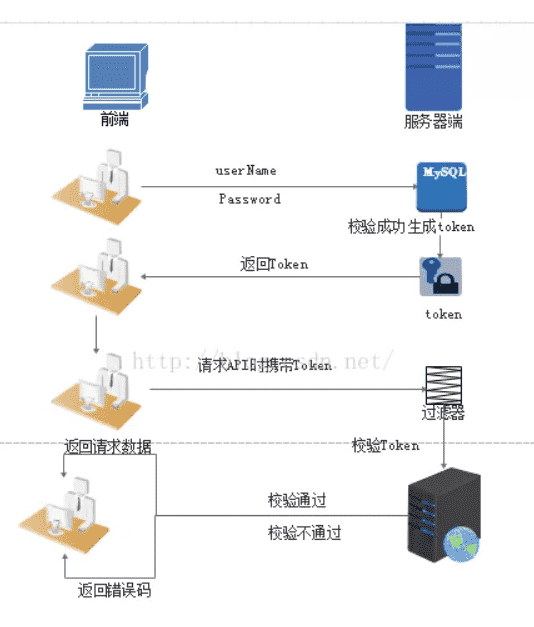

## 1.什么是Cookie与Session

**什么是 Cookie**

HTTP Cookie（也叫 Web Cookie或浏览器 Cookie）是服务器发送到用户浏览器并保存在本地的一小块数据，它会在浏览器下次向同一服务器再发起请求时被携带并发送到服务器上。通常，它用于告知服务端两个请求是否来自同一浏览器，如保持用户的登录状态。Cookie 使基于无状态的 HTTP 协议记录稳定的状态信息成为了可能。

Cookie 主要用于以下三个方面：

- 会话状态管理（如用户登录状态、购物车、游戏分数或其它需要记录的信息）
- 个性化设置（如用户自定义设置、主题等）
- 浏览器行为跟踪（如跟踪分析用户行为等）

**什么是 Session**

Session 代表着服务器和客户端一次会话的过程。Session 对象存储特定用户会话所需的属性及配置信息。这样，当用户在应用程序的 Web 页之间跳转时，存储在 Session 对象中的变量将不会丢失，而是在整个用户会话中一直存在下去。当客户端关闭会话，或者 Session 超时失效时会话结束。

## 2.两者的区别

Cookie 和 Session 有什么不同？

- 作用范围不同，Cookie 保存在客户端（浏览器），Session 保存在服务器端。
- 存取方式的不同，Cookie 只能保存 字符串，Session 可以存任意数据类型，一般情况下我们可以在 Session 中保持一些常用变量信息，比如说 UserId 等。
- 有效期不同，Cookie 可设置为长时间保持，比如我们经常使用的默认登录功能，Session 一般失效时间较短，客户端关闭或者 Session 超时都会失效。
- 隐私策略不同，Cookie 存储在客户端，比较容易遭到不法获取，早期有人将用户的登录名和密码存储在 Cookie 中导致信息被窃取；Session 存储在服务端，安全性相对 Cookie 要好一些。
- 存储大小不同， 单个 Cookie 保存的数据不能超过 4K，Session 可存储数据远高于 Cookie

## 3.如何配合

为什么需要 Cookie 和 Session，他们有什么关联？

说起来为什么需要 Cookie ，这就需要从浏览器开始说起，我们都知道浏览器是没有状态的(HTTP 协议无状态)，这意味着浏览器并不知道是张三还是李四在和服务端打交道。这个时候就需要有一个机制来告诉服务端，本次操作用户是否登录，是哪个用户在执行的操作，那这套机制的实现就需要 Cookie 和 Session 的配合。

那么 Cookie 和 Session 是如何配合的呢？我画了一张图大家可以先了解下。


用户第一次请求服务器的时候，服务器根据用户提交的相关信息，创建创建对应的 Session ，请求返回时将此 Session 的唯一标识信息 SessionID 返回给浏览器，浏览器接收到服务器返回的 SessionID 信息后，会将此信息存入到 Cookie 中，同时 Cookie 记录此 SessionID 属于哪个域名。

当用户第二次访问服务器的时候，请求会自动判断此域名下是否存在 Cookie 信息，如果存在自动将 Cookie 信息也发送给服务端，服务端会从 Cookie 中获取 SessionID，再根据 SessionID 查找对应的 Session 信息，如果没有找到说明用户没有登录或者登录失效，如果找到 Session 证明用户已经登录可执行后面操作。

根据以上流程可知，SessionID 是连接 Cookie 和 Session 的一道桥梁，大部分系统也是根据此原理来验证用户登录状态。

## 4.禁止Cookie后的正常运转

既然服务端是根据 Cookie 中的信息判断用户是否登录，那么如果浏览器中禁止了 Cookie，如何保障整个机制的正常运转。

第一种方案，每次请求中都携带一个 SessionID 的参数，也可以 Post 的方式提交，也可以在请求的地址后面拼接 `xxx?SessionID=123456...`。

第二种方案，Token 机制。Token 机制多用于 App 客户端和服务器交互的模式，也可以用于 Web 端做用户状态管理。

Token 的意思是“令牌”，是服务端生成的一串字符串，作为客户端进行请求的一个标识。Token 机制和 Cookie 和 Session 的使用机制比较类似。

当用户第一次登录后，服务器根据提交的用户信息生成一个 Token，响应时将 Token 返回给客户端，以后客户端只需带上这个 Token 前来请求数据即可，无需再次登录验证。

## 5.分布式Session问题

如何考虑分布式 Session 问题？

在互联网公司为了可以支撑更大的流量，后端往往需要多台服务器共同来支撑前端用户请求，那如果用户在 A 服务器登录了，第二次请求跑到服务 B 就会出现登录失效问题。

分布式 Session 一般会有以下几种解决方案：

- Nginx ip_hash 策略，服务端使用 Nginx 代理，每个请求按访问 IP 的 hash 分配，这样来自同一 IP 固定访问一个后台服务器，避免了在服务器 A 创建 Session，第二次分发到服务器 B 的现象。
- Session 复制，任何一个服务器上的 Session 发生改变（增删改），该节点会把这个 Session 的所有内容序列化，然后广播给所有其它节点。
- 共享 Session，服务端无状态话，将用户的 Session 等信息使用缓存中间件来统一管理，保障分发到每一个服务器的响应结果都一致。

建议采用第三种方案。

## 6.跨域请求

如何解决跨域请求？Jsonp 跨域的原理是什么？

说起跨域请求，必须要了解浏览器的同源策略，同源策略/SOP（Same origin policy）是一种约定，由 Netscape 公司 1995年引入浏览器，它是浏览器最核心也最基本的安全功能，如果缺少了同源策略，浏览器很容易受到 XSS、CSFR 等攻击。所谓同源是指"协议+域名+端口"三者相同，即便两个不同的域名指向同一个 ip 地址，也非同源。

解决跨域请求的常用方法是：

- 通过代理来避免，比如使用 Nginx 在后端转发请求，避免了前端出现跨域的问题。
- 通过 Jsonp 跨域
- 其它跨域解决方案

重点谈一下 Jsonp 跨域原理。浏览器的同源策略把跨域请求都禁止了，但是页面中的 `<script><iframe>`标签是例外，不受同源策略限制。Jsonp 就是利用 `<script>` 标签跨域特性进行跨域数据访问。

JSONP 的理念就是，与服务端约定好一个回调函数名，服务端接收到请求后，将返回一段 Javascript，在这段  Javascript 代码中调用了约定好的回调函数，并且将数据作为参数进行传递。当网页接收到这段 Javascript 代码后，就会执行这个回调函数，这时数据已经成功传输到客户端了。

JSONP 的缺点是：它只支持 GET 请求，而不支持 POST 请求等其他类型的 HTTP 请求。

作者：ityouknow

链接：https://juejin.im/post/5cd9037ee51d456e5c5babca

来源：掘金

著作权归作者所有。商业转载请联系作者获得授权，非商业转载请注明出处。

## 7.localStorage，sessionStorage和cookie的区别

**共同点**：都是保存在浏览器端、且同源的

::: tip 数据存储方面

- **cookie数据**始终在同源的http请求中携带（即使不需要），即cookie在浏览器和服务器间来回传递。cookie数据还有路径（path）的概念，可以限制cookie只属于某个路径下
- **sessionStorage和localStorage**不会自动把数据发送给服务器，仅在**本地保存**。

:::

::: tip 存储数据大小

- 存储大小限制也不同，**cookie数据**不能超过4K，同时因为每次http请求都会携带cookie、所以cookie只适合保存很小的数据，如会话标识。
- **sessionStorage和localStorage**虽然也有存储大小的限制，但比cookie大得多，可以达到5M或更大

:::

::: tip 数据存储有效期

- **sessionStorage**：仅在当前浏览器窗口关闭之前有效；
- **localStorage**：始终有效，窗口或浏览器关闭也一直保存，本地存储，因此用作持久数据；
- **cookie**：只在设置的cookie过期时间之前有效，即使窗口关闭或浏览器关闭

:::

::: tip 作用域不同

- **sessionStorage**不在不同的浏览器窗口中共享，即使是同一个页面；
- **localstorage**在所有`同源窗口`中都是共享的；也就是说只要浏览器不关闭，数据仍然存在
- **cookie**: 也是在所有`同源窗口`中都是共享的.也就是说只要浏览器不关闭，数据仍然存在

:::

::: tip

Web Storage拥有setItem、getItem、removeItem、clear等方法，不像cookie需要自己封装setCookie、getCookie等方法

:::

### sessionStorage与页面js数据对象的区别

页面中一般的js对象的生存期仅在当前页面有效，因此刷新页面或转到另一页面这样的重新加载页面的情况，数据就不存在了()

而sessionStorage只要同源的同窗口中，刷新页面或进入同源的不同页面，数据始终存在，也就是说只要浏览器不关闭，数据仍然存在()

## 8.cookie使用方法介绍

#### 浏览器中的Cookie

浏览器中的Cookie主要由以下几部分组成：

- 名称：Cookie唯一的名称，必须经过URL编码处理。（同名会出现覆盖的情况）
- 值：必须经过URL编码处理。
- 域（domain）：默认情况下cookie在当前域下有效，你也可以设置该值来确保对其子域是否有效。
- 路径（path）：指定Cookie在哪些路径下有效，默认是当前路径下。
- 失效时间（expires）：默认情况下，浏览器会话结束时会自动删除Cookie；也可以设置一个GMT格式的日期，指定具体的删除日期；如果设置的日期为以前的日期，那么Cookie会立即删除。
- 安全标志（secure）：指定之后只允许Cookie发送给https协议。

浏览器在发送请求时，只会将名称与值添加到请求头的Cookie字段中，发送给服务端。

浏览器提供了一个非常蹩脚的API来操作Cookie：

```js
document.cookie
```

通过上述方法可以对该Cookie进行写操作，每一次只能写入一条Cookie字符串：

```js
document.cookie = 'a=1; secure; path=/'
```

通过该方法还可以进行Cookie的读操作：

```js
document.cookie   // "a=1"
```

由于上述方法操作Cookie非常的不直观，一般都会写一些函数来简化Cookie读取、设置和删除操作。

对于Cookie的设置操作中，需要以下几点：

对于名称和值进行URL编码处理，也就是采用JavaScript中的encodeURIComponent()方法； expires要求传入GMT格式的日期，需要处理为更易书写的方式，比如：设置秒数的方式； 注意只有的属性名的secure；

每一段信息需要采用分号加空格。

```js
function setCookie (key, value, attributes) {  
	if (typeof document === 'undefined') {    
	return  
}  
    attributes = Object.assign({}, {    
        path: '/'  
    }, attributes)
  	let { domain, path, expires, secure } = attributes
 	if (typeof expires === 'number') {    
      expires = new Date(Date.now() + expires * 1000)  }  
    if (expires instanceof Date) {    
        expires = expires.toUTCString()  
    } else {    
        expires = ''  
    }
  	key = encodeURIComponent(key)  
  	value = encodeURIComponent(value)
  	let cookieStr = `${key}=${value}`
  	if (domain) {    
      cookieStr += `; domain=${domain}`  
  }
  	if (path) {    
      cookieStr += `; path=${path}`  
  }
  	if (expires) {    
      cookieStr += `; expires=${expires}`  
  }
  	if (secure) {    
      cookieStr += `; secure`  
  }
  	return (document.cookie = cookieStr)
}
```

Cookie的读操作需要注意的是将名称与值进行URL解码处理，也就是调用JavaScript中的decodeURIComponent()方法：

```js
function getCookie (name) {  
if (typeof document === 'undefined') {    
	return  
}  
let cookies = []  
let jar = {}  
document.cookie && (cookies = document.cookie.split('; '))
  for (let i = 0, max = cookies.length; i < max; i++) {    
      let [key, value] = cookies[i].split('=')    
      key = decodeURIComponent(key)    
      value = decodeURIComponent(value)    
      jar[key] = value    
      if (key === name) {      
          break    
      }  
  }
  return name ? jar[name] : jar
}
```

最后一个清除的方法就更加简单了，只要将失效日期（expires）设置为过去的日期即可：

```js
function removeCookie (key) {   
	setCookie(key, '', { expires: -1 }) 
}
```

介绍Cookie基本操作的封装之后，还需要了解浏览器为了限制Cookie不会被恶意使用，规定了Cookie所占磁盘空间的大小以及每个域名下Cookie的个数。

为了绕开单域名下Cookie个数的限制，开发人员还创造了一种称为subcookie的概念，这里就不在赘述了，可以参考【JavaScript高级程序设计第23章 p633】。

#### 服务端的Cookie

相比较浏览器端，服务端执行Cookie的写操作时，是将拼接好的Cookie字符串放入响应头的Set-Cookie字段中；执行Cookie的读操作时，则是解析HTTP请求头字段Cookie中的键值对。

与浏览器最大的不同，在于服务端对于Cookie的安全性操碎了心

signed

当设置signed=true时，服务端会对该条Cookie字符串生成两个Set-Cookie响应头字段：

```js
Set-Cookie: lastTime=2019-03-05T14:31:05.543Z; path=/; httponly
Set-Cookie: lastTime.sig=URXREOYTtMnGm0b7qCYFJ2Db400; path=/; httponly
```

这里通过再发送一条以.sig为后缀的名称以及对值进行加密的Cookie，来验证该条Cookie是否在传输的过程中被篡改。

httpOnly

服务端Set-Cookie字段中新增httpOnly属性，当服务端在返回的Cookie信息中含有httpOnly字段时，开发者是不能通过JavaScript来操纵该条Cookie字符串的。

这样做的好处主要在于面对XSS（Cross-site scripting）攻击时，黑客无法拿到设置httpOnly字段的Cookie信息。

此时，你会发现localStorage相比较Cookie，在XSS攻击的防御上就略逊一筹了。 sameSite

在介绍这个新属性之前，首先你需要明白：当用户从http://a.com发起http://b.com的请求也会携带上Cookie，而从http://a.com携带过来的Cookie称为第三方Cookie。

虽然第三方Cookie有一些好处，但是给CSRF（Cross-site request forgrey）攻击的机会。

为了从根源上解决CSRF攻击，sameSite属性便闪亮登场了，它的取值有以下几种：

- strict：浏览器在任何跨域请求中都不会携带Cookie，这样可以有效的防御CSRF攻击，但是对于有多个子域名的网站采用主域名存储用户登录信息的场景，每个子域名都需要用户重新登录，造成用户体验非常的差。
- lax：相比较strict，它允许从三方网站跳转过来的时候使用Cookie。

为了方便大家理解sameSite的实际效果，可以看这个例子：

```js
// a.com 服务端会在访问页面时返回如下
Cookiecookies.set('foo', 'aaaaa')
cookies.set('bar', 'bbbbb')
cookies.set('name', 'cccccc')
// b.com 服务端会在访问页面时返回如下
Cookiecookies.set('foo', 'a', { sameSite: 'strict' })
cookies.set('bar', 'b', { sameSite: 'lax' })
cookies.set('baz', 'c')
```

如何现在用户在a.com中点击链接跳转到b.com，它的请求头是这样的：

```js
Request Headers 
Cookie: bar=b; baz=c
```

## 9.SessionStorage 和  localStorage用法

H5对于web storage的支持很友好，使用方法很简单

- **setItem()**

```javascript
sessionStorage.setItem(keyName,value);   // 将value存储到key字段中
//或者
sessionStorage.keyName='value';
eg：sessionStorage.setItem("name","thomas");

localStorage.getItem(keyName);          //获取指定key的本地存储的值
//或者
var keyName=localStorage.key;
eg:sessionStorage.getItem("name");
```

下面我只列举sessionStorage方法。

> 其他的方法基本同上，只是将前缀sessionStorage改成localStorage即可

- **getItem()**

```javascript
sessionStorage.getItem(keyName);          //获取指定key的本地存储的值
//或者
var keyName=sessionStorage.key;
eg: sessionStorage.getItem("name");
```

- **removeItem()**

```javascript
sessionStorage.removeItem(keyName);     // 删除指定ke的本地存储的值
eg: sesisonStorage.removeItem("name");
```

- **clear()**

```javascript
sessionStorage.clear()      //清除所有localStorage数据
```

- **key(index)**：获得 index位置处的值的名字

作者：thomaszhou

链接：https://juejin.im/post/5ad5b9116fb9a028e014fb19

来源：掘金

著作权归作者所有。商业转载请联系作者获得授权，非商业转载请注明出处。


以下taken内容来自：https://www.cnblogs.com/moyand/p/9047978.html

## 10.Token

在介绍基于Token的身份验证的原理与优势之前，不妨先看看之前的认证都是怎么做的。

#### **基于服务器的验证**

我们都是知道HTTP协议是无状态的，这种无状态意味着程序需要验证每一次请求，从而辨别客户端的身份。

在这之前，程序都是通过在服务端存储的登录信息来辨别请求的。这种方式一般都是通过存储Session来完成。

随着Web，应用程序，已经移动端的兴起，这种验证的方式逐渐暴露出了问题。尤其是在可扩展性方面。

::: tip 基于服务器验证方式暴露的一些问题

1. **Seesion：**每次认证用户发起请求时，服务器需要去创建一个记录来存储信息。当越来越多的用户发请求时，内存的开销也会不断增加。
2. **可扩展性：**在服务端的内存中使用Seesion存储登录信息，伴随而来的是可扩展性问题。
3. **CORS(跨域资源共享)：**当我们需要让数据跨多台移动设备上使用时，跨域资源的共享会是一个让人头疼的问题。在使用Ajax抓取另一个域的资源，就可以会出现禁止请求的情况。
4. **CSRF(跨站请求伪造)：**用户在访问银行网站时，他们很容易受到跨站请求伪造的攻击，并且能够被利用其访问其他的网站。

:::

在这些问题中，可扩展行是最突出的。因此我们有必要去寻求一种更有行之有效的方法。

#### **基于Token的验证原理**

基于Token的身份验证是无状态的，我们不将用户信息存在服务器或Session中。

这种概念解决了在服务端存储信息时的许多问题

> NoSession意味着你的程序可以根据需要去增减机器，而不用去担心用户是否登录。

::: tip 基于Token的身份验证的过程如下:

1. 用户通过用户名和密码发送请求。
2. 程序验证。
3. 程序返回一个签名的token 给客户端。
4. 客户端储存token,并且每次用于每次发送请求。
5. 服务端验证token并返回数据。

:::

每一次请求都需要token。token应该在HTTP的头部发送从而保证了Http请求无状态。我们同样通过设置服务器属性Access-Control-Allow-Origin:* ，让服务器能接受到来自所有域的请求。

需要主要的是，在ACAO头部标明(designating)*时，不得带有像HTTP认证，客户端SSL证书和cookies的证书。

实现思路：



::: tip 思路

1. 用户登录校验，校验成功后就返回Token给客户端。
2. 客户端收到数据后保存在客户端
3. 客户端每次访问API是携带Token到服务器端。
4. 服务器端采用filter过滤器校验。校验成功则返回请求数据，校验失败则返回错误码

:::

当我们在程序中认证了信息并取得token之后，我们便能通过这个Token做许多的事情。

我们甚至能基于创建一个基于权限的token传给第三方应用程序，这些第三方程序能够获取到我们的数据（当然只有在我们允许的特定的token）

### **Tokens的优势**

**无状态、可扩展**

在客户端存储的Tokens是无状态的，并且能够被扩展。基于这种无状态和不存储Session信息，负载负载均衡器能够将用户信息从一个服务传到其他服务器上。

如果我们将已验证的用户的信息保存在Session中，则每次请求都需要用户向已验证的服务器发送验证信息(称为Session亲和性)。用户量大时，可能会造成一些拥堵。

但是不要着急。使用tokens之后这些问题都迎刃而解，因为tokens自己hold住了用户的验证信息。

**安全性**

请求中发送token而不再是发送cookie能够防止CSRF(跨站请求伪造)。即使在客户端使用cookie存储token，cookie也仅仅是一个存储机制而不是用于认证。不将信息存储在Session中，让我们少了对session操作。

token是有时效的，一段时间之后用户需要重新验证。我们也不一定需要等到token自动失效，**token有撤回的操作，通过token revocataion可以使一个特定的token或是一组有相同认证的token无效。**

**可扩展性**

Tokens能够创建与其它程序共享权限的程序。例如，能将一个随便的社交帐号和自己的大号(Fackbook或是Twitter)联系起来。当通过服务登录Twitter(我们将这个过程Buffer)时，我们可以将这些Buffer附到Twitter的数据流上(we are allowing Buffer to post to our Twitter stream)。

使用tokens时，可以提供可选的权限给第三方应用程序。当用户想让另一个应用程序访问它们的数据，我们可以通过建立自己的API，得出特殊权限的tokens。

**多平台跨域**

我们提前先来谈论一下CORS(跨域资源共享)，对应用程序和服务进行扩展的时候，需要介入各种各种的设备和应用程序。

只要用户有一个通过了验证的token，数据和资源就能够在任何域上被请求到。

```js
Access-Control-Allow-Origin: *      
```


基于标准创建token的时候，你可以设定一些选项。我们在后续的文章中会进行更加详尽的描述，但是标准的用法会在JSON Web Tokens体现。

最近的程序和文档是供给JSON Web Tokens的。它支持众多的语言。这意味在未来的使用中你可以真正的转换你的认证机制。