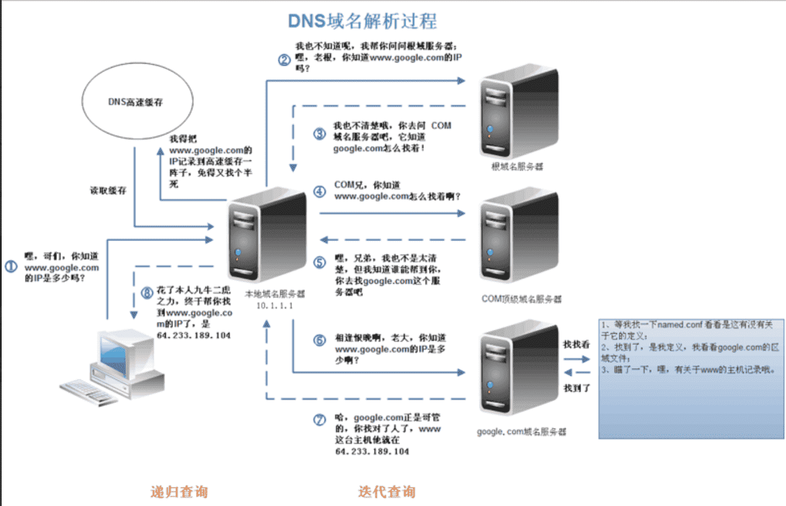
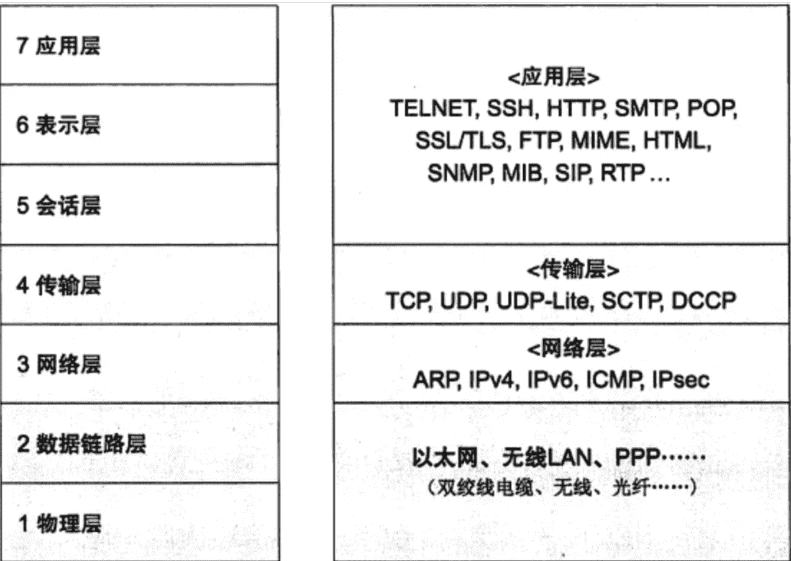
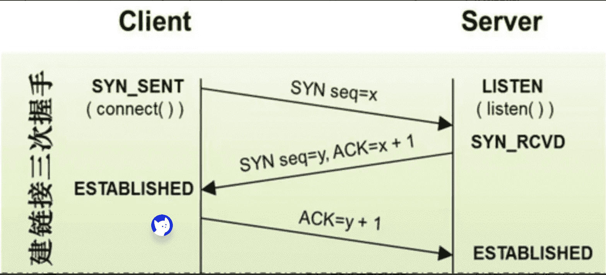
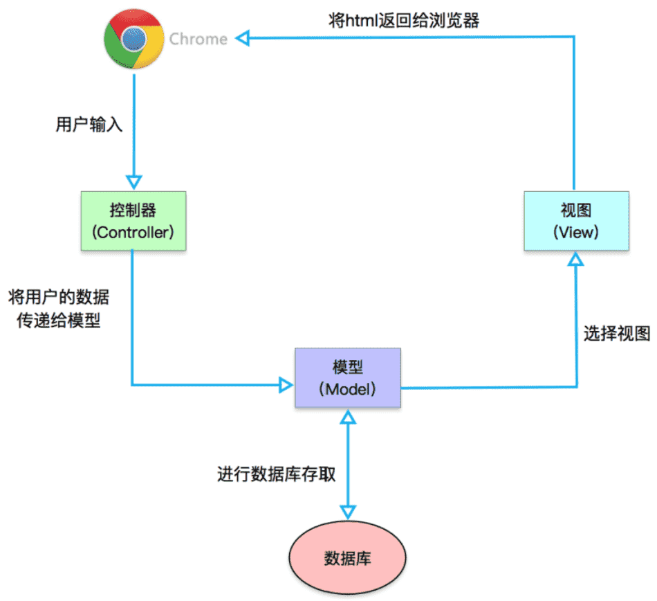
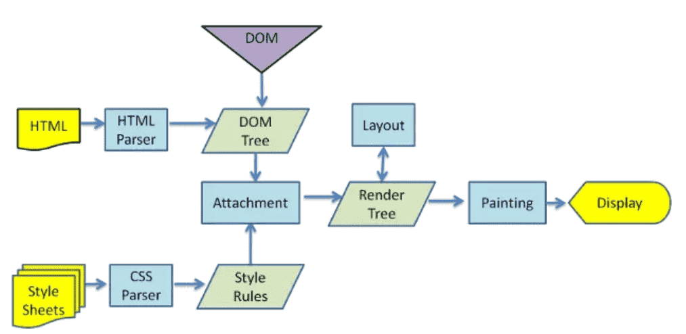
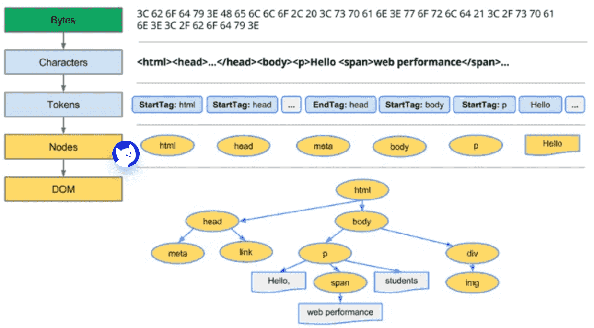
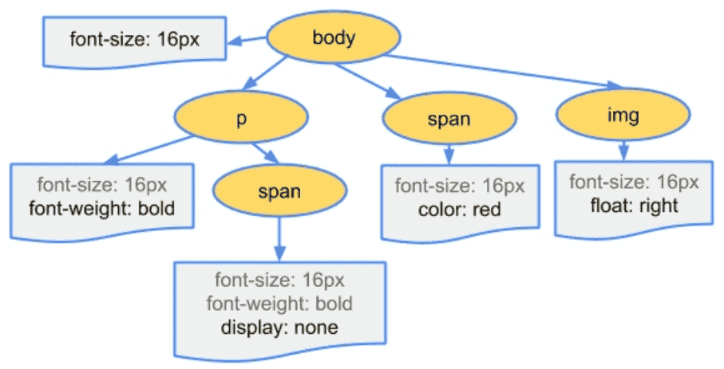
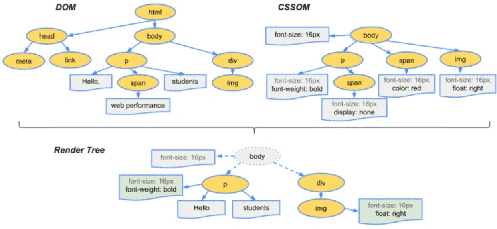

从开发&运维角度方面来看，总体来说分为以下几个过程

- 查找浏览器缓存
- DNS 解析:将域名解析成 IP 地址
- TCP 连接：TCP 三次握手
- 发送 HTTP 请求
- 服务器处理请求并返回 HTTP 报文
- 浏览器解析渲染页面
- 断开连接：TCP 四次挥手

## 一、什么是URL？

URL（Uniform Resource Locator），统一资源定位符，用于定位互联网上资源，俗称网址。

```
scheme: // host.domain:port / path / filename ? abc = 123 # 456789
scheme       - 定义因特网服务的类型。常见的协议有 http、https、ftp、file，
               其中最常见的类型是 http，而 https 则是进行加密的网络传输。
host         - 定义域主机（http 的默认主机是 www）
domain       - 定义因特网域名，比如 baidu.com
port         - 定义主机上的端口号（http 的默认端口号是 80）
path         - 定义服务器上的路径（如果省略，则文档必须位于网站的根目录中）。
filename     - 定义文档/资源的名称
query        - 即查询参数
fragment     - 即 # 后的hash值，一般用来定位到某个位置
```

## 二、DNS域名解析

在浏览器输入网址后，首先要经过域名解析，因为浏览器并不能直接通过域名找到对应的服务器，而是要通过 IP 地址。

​	**IP 地址**

```
IP 地址是指互联网协议地址，是 IP Address 的缩写。IP 地址是 IP 协议提供的一种统一的地址格式，
它为互联网上的每一个网络和每一台主机分配一个逻辑地址，以此来屏蔽物理地址的差异。
```

​	**什么是域名解析**

```
DNS 协议提供通过域名查找 IP 地址，或逆向从 IP 地址反查域名的服务。
DNS 是一个网络服务器，我们的域名解析简单来说就是在 DNS 上记录一条信息记录。
```

​	**浏览器如何通过域名去查询 URL 对应的 IP 呢？**

```
DNS域名解析分为递归查询和迭代查询两种方式，现一般为迭代查询。
```



### DNS的优化与应用

1. DNS缓存 `DNS存在着多级缓存，从离浏览器的距离排序的话，有以下几种: 浏览器缓存，系统缓存，路由器缓存，IPS服务器缓存，根域名服务器缓存，顶级域名服务器缓存，主域名服务器缓存。`
2. DNS负载均衡`(DNS重定向) DNS负载均衡技术的实现原理是在DNS服务器中为同一个主机名配置多个IP地址，在应答DNS查询时， DNS服务器对每个查询将以DNS文件中主机记录的IP地址按顺序返回不同的解析结果，将客户端的访问 引导到不同的机器上去，使得不同的客户端访问不同的服务器，从而达到负载均衡的目的。`

- 大家耳熟能详的CDN(Content Delivery Network)就是利用DNS的重定向技术，DNS服务器会返回一个跟 用户最接近的点的IP地址给用户，CDN节点的服务器负责响应用户的请求，提供所需的内容。

1. dns-prefetch `DNS Prefetch 是一种 DNS 预解析技术。当你浏览网页时，浏览器会在加载网页时对网页中的域名进行解析缓存，这样在你单击当前网页中的连接时就无需进行 DNS 的解析，减少用户等待时间，提高用户体验。`

### OSI参考模型与TCP/IP四层模型



## 三、TCP三次握手



- 客户端发送一个带 SYN=1，Seq=X 的数据包到服务器端口`（第一次握手，由浏览器发起，告诉服务器我要发送请求了）`
- 服务器发回一个带 SYN=1， ACK=X+1， Seq=Y 的响应包以示传达确认信息`（第二次握手，由服务器发起，告诉浏览器我准备接受了，你赶紧发送吧）`
- 客户端再回传一个带 ACK=Y+1， Seq=Z 的数据包，代表“握手结束”`（第三次握手，由浏览器发送，告诉服务器，我马上就发了，准备接受吧）`

## 四、发送 HTTP 请求

TCP 三次握手结束后，开始发送 HTTP 请求报文。

`为避免篇幅过长，http协议、缓存等相关内容请参阅：` [从HTTP到WEB缓存](https://juejin.im/post/5c808d4bf265da2de33f4e5f)

## 五、服务器处理请求并返回 HTTP 报文

每台服务器上都会安装处理请求的应用——Web server。常见的web server产品有apache、nginx、IIS、Lighttpd等。

```
假装我是一个传统的MVC模型，RD同学请无视
```



## 六、浏览器解析渲染页面

### 浏览器的主要构成


```
用户界面    (User Interface)    － 包括地址栏、后退/前进按钮、书签目录等，也就是你所看到的除了用来显示你所请求页面的主窗口之外的其他部分

浏览器引擎  (Browser Engine)    － 用来查询及操作渲染引擎的接口

渲染引擎    (Rendering Engine)  － 用来显示请求的内容，例如，如果请求内容为html，它负责解析html及css，并将解析后的结果显示出来

网络        (Networking)        － 用来完成网络调用，例如http请求，它具有平台无关的接口，可以在不同平台上工作

JS解释器    (JS Interpreter)    － 用来解释执行JS代码

UI后端      (UI Backend)        － 用来绘制类似组合选择框及对话框等基本组件，具有不特定于某个平台的通用接口，底层使用操作系统的用户接口

数据存储    (DB Persistence)    － 属于持久层，浏览器需要在硬盘中保存类似cookie的各种数据，HTML5定义了web database技术，这是一种轻量级完整的客户端存储技术
```

#### 1.多进程的浏览器

浏览器是多进程的，有一个主控进程，以及每一个tab页面都会新开一个进程（某些情况下多个tab会合并进程）

进程可能包括主控进程，插件进程，GPU，tab页（浏览器内核）等等

- Browser进程：浏览器的主进程（负责协调、主控），只有一个
- 第三方插件进程：每种类型的插件对应一个进程，仅当使用该插件时才创建
- GPU进程：最多一个，用于3D绘制
- 浏览器渲染进程（内核）：默认每个Tab页面一个进程，互不影响，控制页面渲染，脚本执行，事件处理等（有时候会优化，如多个空白tab会合并成一个进程）

#### 2.多线程的浏览器内核

每一个tab页面可以看作是浏览器内核进程，然后这个进程是多线程的，它有几大类子线程：

1. GUI线程
2. JS引擎线程
3. 事件触发线程
4. 定时器线程
5. 网络请求线程

### 浏览器内核拿到内容后，渲染步骤大致可以分为以下几步：

```
1. 解析HTML，构建DOM树

2. 解析CSS，生成CSS规则树

3. 合并DOM树和CSS规则，生成render树

4. 布局render树（Layout/reflow），负责各元素尺寸、位置的计算

5. 绘制render树（paint），绘制页面像素信息
```

**以webkit内核为例**



#### 1. HTML解析，构建DOM

简单的理解，这一步的流程是这样的：浏览器解析HTML，构建DOM树。 解析HTML到构建出DOM当然过程可以简述如下：

```
Bytes → characters → tokens → nodes → DOM
```



**其中比较关键的几个步骤**

```
1. Conversion转换：浏览器将获得的HTML内容（Bytes）基于他的编码转换为单个字符

2. Tokenizing分词：浏览器按照HTML规范标准将这些字符转换为不同的标记token。每个token都有自己独特的含义以及规则集

3. Lexing词法分析：分词的结果是得到一堆的token，此时把他们转换为对象，这些对象分别定义他们的属性和规则

4. DOM构建：因为HTML标记定义的就是不同标签之间的关系，这个关系就像是一个树形结构一样
例如：body对象的父节点就是HTML对象，然后段略p对象的父节点就是body对象
```

#### 2. 解析CSS，生成CSS规则树

同理，CSS规则树的生成也是类似。

```
Bytes → characters → tokens → nodes → CSSOM
```



#### 3. 合并DOM树和CSS规则，生成render树

当DOM树和CSSOM都有了后，就要开始构建渲染树了

一般来说，渲染树和DOM树相对应的，但不是严格意义上的一一对应,因为有一些不可见的DOM元素不会插入到渲染树中，如head这种不可见的标签或者display: none等



#### 4. 布局render树（Layout/Reflow），负责各元素尺寸、位置的计算

布局：通过渲染树中渲染对象的信息，计算出每一个渲染对象的位置和尺寸。

#### 5. 绘制render树（Paint），绘制页面像素信息

绘制阶段，系统会遍历呈现树，并调用呈现器的“paint”方法，将呈现器的内容显示在屏幕上。


```
这张图片中重要的四个步骤
1. 计算CSS样式

2. 构建渲染树

3. 布局，主要定位坐标和大小，是否换行，各种position overflow z-index属性

4. 绘制，将图像绘制出来
```

- Layout，也称为Reflow，即回流。一般意味着元素的内容、结构、位置或尺寸发生了变化，需要重新计算样式和渲染树
- Repaint，即重绘。意味着元素发生的改变只是影响了元素的一些外观之类的时候（例如，背景色，边框颜色，文字颜色等），此时只需要应用新样式绘制这个元素就可以了

## 七、断开连接

当数据传送完毕，需要断开 tcp 连接，此时发起 tcp 四次挥手。


- 发起方向被动方发送报文，Fin、Ack、Seq，表示已经没有数据传输了。并进入 FIN_WAIT_1 状态。 `(第一次挥手：由浏览器发起的，发送给服务器，我请求报文发送完了，你准备关闭吧)`
- 被动方发送报文，Ack、Seq，表示同意关闭请求。此时主机发起方进入 FIN_WAIT_2 状态。 `(第二次挥手：由服务器发起的，告诉浏览器，我请求报文接受完了，我准备关闭了，你也准备吧)`
- 被动方向发起方发送报文段，Fin、Ack、Seq，请求关闭连接。并进入 LAST_ACK 状态。 `(第三次挥手：由服务器发起，告诉浏览器，我响应报文发送完了，你准备关闭吧)`
- 发起方向被动方发送报文段，Ack、Seq。然后进入等待 TIME_WAIT 状态。被动方收到发起方的报文段以后关闭连接。发起方等待一定时间未收到回复，则正常关闭。 `(第四次挥手：由浏览器发起，告诉服务器，我响应报文接受完了，我准备关闭了，你也准备吧)`

作者：WilliamCao

链接：https://juejin.im/post/5c7646f26fb9a049fd108380

来源：掘金

著作权归作者所有。商业转载请联系作者获得授权，非商业转载请注明出处。