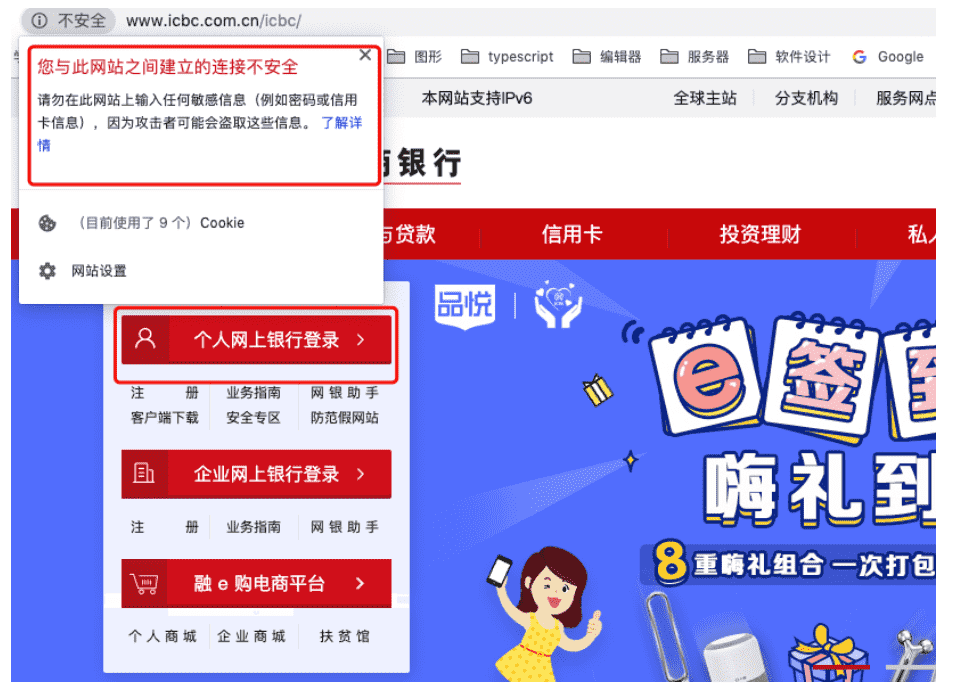
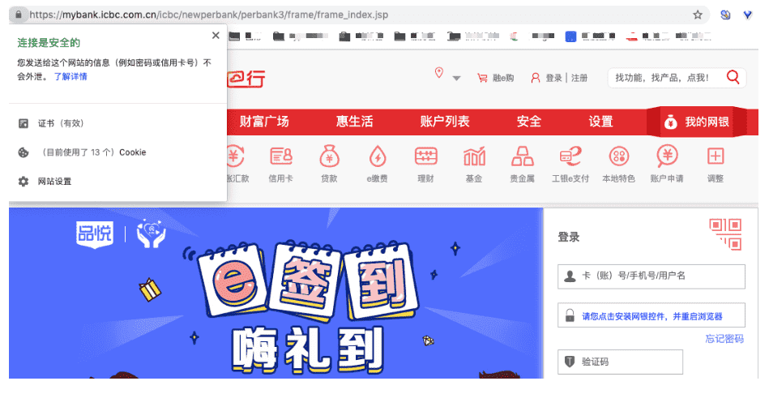

## 有哪些可能引起前端安全的的问题?

- **跨站脚本攻击** (Cross-Site Scripting, **XSS**): 一种代码注入方式, 为了与 CSS 区分所以被称作 XSS. 早期常见于网络论坛, 起因是网站没有对用户的输入进行严格的限制, 使得攻击者可以将脚本上传到帖子让其他人浏览到有恶意脚本的页面, 其注入方式很简单包括但不限于 JavaScript / VBScript / CSS / Flash 等
- **iframe的滥用**: iframe中的内容是由第三方来提供的，默认情况下他们不受我们的控制，他们可以在iframe中运行JavaScirpt脚本、Flash插件、弹出对话框等等，这可能会破坏前端用户体验
- **跨站点请求伪造**（Cross-Site Request Forgeries，**CSRF**）: 指攻击者通过设置好的陷阱，强制对已完成认证的用户进行非预期的个人信息或设定信息等某些状态更新，属于被动攻击
- **恶意第三方库**: 无论是后端服务器应用还是前端应用开发，绝大多数时候我们都是在借助开发框架和各种类库进行快速开发,一旦第三方库被植入恶意代码很容易引起安全问题,比如event-stream的恶意代码事件,2018年11月21日，名为 FallingSnow的用户在知名JavaScript应用库event-stream在github Issuse中发布了针对植入的恶意代码的疑问，表示event-stream中存在用于窃取用户数字钱包的恶意代码

## XSS分为哪几类?

根据攻击的来源，XSS 攻击可分为存储型、反射型和 DOM 型三种。

- **存储区**：恶意代码存放的位置。
- **插入点**：由谁取得恶意代码，并插入到网页上。

### 存储型 XSS

存储型 XSS 的攻击步骤：

1. 攻击者将恶意代码提交到目标网站的数据库中。
2. 用户打开目标网站时，网站服务端将恶意代码从数据库取出，拼接在 HTML 中返回给浏览器。
3. 用户浏览器接收到响应后解析执行，混在其中的恶意代码也被执行。
4. 恶意代码窃取用户数据并发送到攻击者的网站，或者冒充用户的行为，调用目标网站接口执行攻击者指定的操作。

这种攻击常见于带有用户保存数据的网站功能，如论坛发帖、商品评论、用户私信等。

### 反射型 XSS

反射型 XSS 的攻击步骤：

1. 攻击者构造出特殊的 URL，其中包含恶意代码。
2. 用户打开带有恶意代码的 URL 时，网站服务端将恶意代码从 URL 中取出，拼接在 HTML 中返回给浏览器。
3. 用户浏览器接收到响应后解析执行，混在其中的恶意代码也被执行。
4. 恶意代码窃取用户数据并发送到攻击者的网站，或者冒充用户的行为，调用目标网站接口执行攻击者指定的操作。

:heart:**反射型 XSS 跟存储型 XSS 的区别是：存储型 XSS 的恶意代码存在数据库里，反射型 XSS 的恶意代码存在 URL 里。**

反射型 XSS 漏洞常见于通过 URL 传递参数的功能，如网站搜索、跳转等。

由于需要用户主动打开恶意的 URL 才能生效，攻击者往往会结合多种手段诱导用户点击。

POST 的内容也可以触发反射型 XSS，只不过其触发条件比较苛刻（需要构造表单提交页面，并引导用户点击），所以非常少见。

### DOM 型 XSS

DOM 型 XSS 的攻击步骤：

1. 攻击者构造出特殊的 URL，其中包含恶意代码。
2. 用户打开带有恶意代码的 URL。
3. 用户浏览器接收到响应后解析执行，前端 JavaScript 取出 URL 中的恶意代码并执行。
4. 恶意代码窃取用户数据并发送到攻击者的网站，或者冒充用户的行为，调用目标网站接口执行攻击者指定的操作。

:star:**DOM 型 XSS 跟前两种 XSS 的区别：DOM 型 XSS 攻击中，取出和执行恶意代码由浏览器端完成，属于前端 JavaScript 自身的安全漏洞，而其他两种 XSS 都属于服务端的安全漏洞。**

## 如何预防XSS?

XSS 攻击有两大要素：

1. 攻击者提交恶意代码。
2. 浏览器执行恶意代码。

针对第一个要素：我们是否能够在用户输入的过程，过滤掉用户输入的恶意代码呢？

### 输入过滤

在用户提交时，由前端过滤输入，然后提交到后端。这样做是否可行呢？

答案是不可行。一旦攻击者绕过前端过滤，直接构造请求，就可以提交恶意代码了。

那么，换一个过滤时机：后端在写入数据库前，对输入进行过滤，然后把“安全的”内容，返回给前端。这样是否可行呢？

我们举一个例子，一个正常的用户输入了 `5 < 7` 这个内容，在写入数据库前，被转义，变成了 `5 &lt; 7`。

问题是：在提交阶段，我们并不确定内容要输出到哪里。

这里的“并不确定内容要输出到哪里”有两层含义：

1. 用户的输入内容可能同时提供给前端和客户端，而一旦经过了 `escapeHTML()`，客户端显示的内容就变成了乱码( `5 &lt; 7` )。
2. 在前端中，不同的位置所需的编码也不同。

- 当 `5 &lt; 7` 作为 HTML 拼接页面时，可以正常显示：

```html
<div title="comment">5 &lt; 7</div>
```

- 当 `5 &lt; 7` 通过 Ajax 返回，然后赋值给 JavaScript 的变量时，前端得到的字符串就是转义后的字符。这个内容不能直接用于 Vue 等模板的展示，也不能直接用于内容长度计算。不能用于标题、alert 等

所以，**输入侧过滤能够在某些情况下解决特定的 XSS 问题，但会引入很大的不确定性和乱码问题**。在防范 XSS 攻击时应避免此类方法

当然，对于明确的输入类型，例如数字、URL、电话号码、邮件地址等等内容，进行输入过滤还是必要的

既然输入过滤并非完全可靠，我们就要通过“防止浏览器执行恶意代码”来防范 XSS。这部分分为两类：

- 防止 HTML 中出现注入
- 防止 JavaScript 执行时，执行恶意代码

### 预防存储型和反射型 XSS 攻击

存储型和反射型 XSS 都是在服务端取出恶意代码后，插入到响应 HTML 里的，攻击者刻意编写的“数据”被内嵌到“代码”中，被浏览器所执行。

预防这两种漏洞，有两种常见做法：

- 改成纯前端渲染，把代码和数据分隔开。
- 对 HTML 做充分转义。

#### 纯前端渲染

纯前端渲染的过程：

1. 浏览器先加载一个静态 HTML，此 HTML 中不包含任何跟业务相关的数据。
2. 然后浏览器执行 HTML 中的 JavaScript。
3. JavaScript 通过 Ajax 加载业务数据，调用 DOM API 更新到页面上。

在纯前端渲染中，我们会明确的告诉浏览器：下面要设置的内容是文本（`.innerText`），还是属性（`.setAttribute`），还是样式（`.style`）等等。浏览器不会被轻易的被欺骗，执行预期外的代码了。
但纯前端渲染还需注意避免 DOM 型 XSS 漏洞（例如 `onload` 事件和 `href` 中的 `javascript:xxx` 等，请参考下文”预防 DOM 型 XSS 攻击“部分）。
在很多内部、管理系统中，采用纯前端渲染是非常合适的。但对于性能要求高，或有 SEO 需求的页面，我们仍然要面对拼接 HTML 的问题。

#### 转义 HTML

如果拼接 HTML 是必要的，就需要采用合适的转义库，对 HTML 模板各处插入点进行充分的转义。
常用的模板引擎，如 doT.js、ejs、FreeMarker 等，对于 HTML 转义通常只有一个规则，就是把 `& < > " ' /` 这几个字符转义掉，确实能起到一定的 XSS 防护作用，但并不完善：
|XSS 安全漏洞|简单转义是否有防护作用| |-|-| |HTML 标签文字内容|有| |HTML 属性值|有| |CSS 内联样式|无| |内联 JavaScript|无| |内联 JSON|无| |跳转链接|无|
所以要完善 XSS 防护措施，我们要使用更完善更细致的转义策略。
例如 Java 工程里，常用的转义库为 `org.owasp.encoder`。以下代码引用自 [org.owasp.encoder 的官方说明](https://www.owasp.org/index.php/OWASP_Java_Encoder_Project#tab=Use_the_Java_Encoder_Project)。

```html
<!-- HTML 标签内文字内容 -->
<div><%= Encode.forHtml(UNTRUSTED) %></div>
<!-- HTML 标签属性值 -->
<input value="<%= Encode.forHtml(UNTRUSTED) %>" />
<!-- CSS 属性值 -->
<div style="width:<= Encode.forCssString(UNTRUSTED) %>">
<!-- CSS URL -->
<div style="background:<= Encode.forCssUrl(UNTRUSTED) %>">
<!-- JavaScript 内联代码块 -->
<script>
  var msg = "<%= Encode.forJavaScript(UNTRUSTED) %>";
  alert(msg);
</script>
<!-- JavaScript 内联代码块内嵌 JSON -->
<script>
var __INITIAL_STATE__ = JSON.parse('<%= Encoder.forJavaScript(data.to_json) %>');
</script>
<!-- HTML 标签内联监听器 -->
<button
  onclick="alert('<%= Encode.forJavaScript(UNTRUSTED) %>');">
  click me
</button>
<!-- URL 参数 -->
<a href="/search?value=<%= Encode.forUriComponent(UNTRUSTED) %>&order=1#top">
<!-- URL 路径 -->
<a href="/page/<%= Encode.forUriComponent(UNTRUSTED) %>">
<!--
  URL.
  注意：要根据项目情况进行过滤，禁止掉 "javascript:" 链接、非法 scheme 等
-->
<a href='<%=
  urlValidator.isValid(UNTRUSTED) ?
    Encode.forHtml(UNTRUSTED) :
    "/404"
%>'>
  link
</a>
```

可见，HTML 的编码是十分复杂的，在不同的上下文里要使用相应的转义规则。

### 预防 DOM 型 XSS 攻击

DOM 型 XSS 攻击，实际上就是网站前端 JavaScript 代码本身不够严谨，把不可信的数据当作代码执行了。

在使用 `.innerHTML`、`.outerHTML`、`document.write()` 时要特别小心，不要把不可信的数据作为 HTML 插到页面上，而应尽量使用 `.textContent`、`.setAttribute()` 等。

如果用 Vue/React 技术栈，并且不使用 `v-html`/`dangerouslySetInnerHTML` 功能，就在前端 render 阶段避免 `innerHTML`、`outerHTML` 的 XSS 隐患。

DOM 中的内联事件监听器，如 `location`、`onclick`、`onerror`、`onload`、`onmouseover` 等，`<a>` 标签的 `href` 属性，JavaScript 的 `eval()`、`setTimeout()`、`setInterval()` 等，都能把字符串作为代码运行。如果不可信的数据拼接到字符串中传递给这些 API，很容易产生安全隐患，请务必避免。

```html
<!-- 内联事件监听器中包含恶意代码 -->

<!-- 链接内包含恶意代码 -->
<a href="UNTRUSTED">1</a>
<script>
// setTimeout()/setInterval() 中调用恶意代码
setTimeout("UNTRUSTED")
setInterval("UNTRUSTED")
// location 调用恶意代码
location.href = 'UNTRUSTED'
// eval() 中调用恶意代码
eval("UNTRUSTED")
</script>
```

如果项目中有用到这些的话，一定要避免在字符串中拼接不可信数据。

## 其他 XSS 防范措施

虽然在渲染页面和执行 JavaScript 时，通过谨慎的转义可以防止 XSS 的发生，但完全依靠开发的谨慎仍然是不够的。以下介绍一些通用的方案，可以降低 XSS 带来的风险和后果。

### Content Security Policy

严格的 CSP 在 XSS 的防范中可以起到以下的作用：

- 禁止加载外域代码，防止复杂的攻击逻辑
- 禁止外域提交，网站被攻击后，用户的数据不会泄露到外域
- 禁止内联脚本执行（规则较严格，目前发现 GitHub 使用）
- 禁止未授权的脚本执行（新特性，Google Map 移动版在使用）
- 合理使用上报可以及时发现 XSS，利于尽快修复问题

### 输入内容长度控制

对于不受信任的输入，都应该限定一个合理的长度。虽然无法完全防止 XSS 发生，但可以增加 XSS 攻击的难度。

### 其他安全措施

- HTTP-only Cookie: 禁止 JavaScript 读取某些敏感 Cookie，攻击者完成 XSS 注入后也无法窃取此 Cookie。
- 验证码：防止脚本冒充用户提交危险操作。

> 过滤 Html 标签能否防止 XSS? 请列举不能的情况?

用户除了上传

```html
<script>alert('xss');</script>
```

还可以使用图片 url 等方式来上传脚本进行攻击

```html
<table background="javascript:alert(/xss/)"></table>

```

还可以使用各种方式来回避检查, 例如空格, 回车, Tab

```html

```

还可以通过各种编码转换 (URL 编码, Unicode 编码, HTML 编码, ESCAPE 等) 来绕过检查

```html


```

## CSRF是什么?

**CSRF**（Cross-site request forgery）**跨站请求伪造**：攻击者诱导受害者进入第三方网站，在第三方网站中，向被攻击网站发送跨站请求。利用受害者在被攻击网站已经获取的注册凭证，绕过后台的用户验证，达到冒充用户对被攻击的网站执行某项操作的目的。

一个典型的CSRF攻击有着如下的流程：

- 受害者登录 `a.com`，并保留了登录凭证（Cookie）
- 攻击者引诱受害者访问了`b.com`
- `b.com` 向 `a.com` 发送了一个请求：`a.com/act=xx`浏览器会默认携带a.com的Cookie
- a.com接收到请求后，对请求进行验证，并确认是受害者的凭证，误以为是受害者自己发送的请求
- a.com以受害者的名义执行了act=xx
- 攻击完成，攻击者在受害者不知情的情况下，冒充受害者，让a.com执行了自己定义的操作

## CSRF的攻击类型?

**GET类型的CSRF**

GET类型的CSRF利用非常简单，只需要一个HTTP请求，一般会这样利用：

```
https://awps-assets.meituan.net/mit-x/blog-images-bundle-2018b/ff0cdbee.example/withdraw?amount=10000&for=hacker
```

在受害者访问含有这个img的页面后，浏览器会自动向`http://bank.example/withdraw?account=xiaoming&amount=10000&for=hacker`发出一次HTTP请求。bank.example就会收到包含受害者登录信息的一次跨域请求。

**POST类型的CSRF**

这种类型的CSRF利用起来通常使用的是一个自动提交的表单，如：

```html
<form action="http://bank.example/withdraw" method=POST>
    <input type="hidden" name="account" value="xiaoming" />
    <input type="hidden" name="amount" value="10000" />
    <input type="hidden" name="for" value="hacker" />
</form>
<script> document.forms[0].submit(); </script>
```

访问该页面后，表单会自动提交，相当于模拟用户完成了一次POST操作。

POST类型的攻击通常比GET要求更加严格一点，但仍并不复杂。任何个人网站、博客，被黑客上传页面的网站都有可能是发起攻击的来源，后端接口不能将安全寄托在仅允许POST上面。

**链接类型的CSRF**

链接类型的CSRF并不常见，比起其他两种用户打开页面就中招的情况，这种需要用户点击链接才会触发。这种类型通常是在论坛中发布的图片中嵌入恶意链接，或者以广告的形式诱导用户中招，攻击者通常会以比较夸张的词语诱骗用户点击，例如：

```html
<a href="http://test.com/csrf/withdraw.php?amount=1000&for=hacker" taget="_blank">
  重磅消息！！
<a/>
```

由于之前用户登录了信任的网站A，并且保存登录状态，只要用户主动访问上面的这个PHP页面，则表示攻击成功。

## 如何预防CSRF?

CSRF通常从第三方网站发起，被攻击的网站无法防止攻击发生，只能通过增强自己网站针对CSRF的防护能力来提升安全性。

CSRF的两个特点：

- CSRF（通常）发生在第三方域名。
- CSRF攻击者不能获取到Cookie等信息，只是使用。

针对这两点，我们可以专门制定防护策略，如下：

- 阻止不明外域的访问
  - 同源检测
  - Samesite Cookie
- 提交时要求附加本域才能获取的信息
  - CSRF Token
  - 双重Cookie验证

因此我们可以针对性得进行预防

### 同源检测

既然CSRF大多来自第三方网站，那么我们就直接禁止外域（或者不受信任的域名）对我们发起请求:

- 使用Origin Header确定来源域名: 在部分与CSRF有关的请求中，请求的Header中会携带Origin字段,如果Origin存在，那么直接使用Origin中的字段确认来源域名就可以
- 使用Referer Header确定来源域名: 根据HTTP协议，在HTTP头中有一个字段叫Referer，记录了该HTTP请求的来源地址

### CSRF Token

CSRF的另一个特征是，攻击者无法直接窃取到用户的信息（Cookie，Header，网站内容等），仅仅是冒用Cookie中的信息。

而CSRF攻击之所以能够成功，是因为服务器误把攻击者发送的请求当成了用户自己的请求。那么我们可以要求所有的用户请求都携带一个CSRF攻击者无法获取到的Token。服务器通过校验请求是否携带正确的Token，来把正常的请求和攻击的请求区分开，也可以防范CSRF的攻击:

CSRF Token的防护策略分为三个步骤：

- 将CSRF Token输出到页面中
- 页面提交的请求携带这个Token
- 服务器验证Token是否正确

### 双重Cookie验证

在会话中存储CSRF Token比较繁琐，而且不能在通用的拦截上统一处理所有的接口

那么另一种防御措施是使用双重提交Cookie。利用CSRF攻击不能获取到用户Cookie的特点，我们可以要求Ajax和表单请求携带一个Cookie中的值

双重Cookie采用以下流程：

- 在用户访问网站页面时，向请求域名注入一个Cookie，内容为随机字符串（例如`csrfcookie=v8g9e4ksfhw`）。
- 在前端向后端发起请求时，取出Cookie，并添加到URL的参数中（接上例`POST https://www.a.com/comment?csrfcookie=v8g9e4ksfhw`）。
- 后端接口验证Cookie中的字段与URL参数中的字段是否一致，不一致则拒绝。

## Samesite Cookie属性

Google起草了一份草案来改进HTTP协议，那就是为Set-Cookie响应头新增Samesite属性，它用来标明这个 Cookie是个“同站 Cookie”，同站Cookie只能作为第一方Cookie，不能作为第三方Cookie，Samesite 有两个属性值:

- Samesite=Strict: 这种称为严格模式，表明这个 Cookie 在任何情况下都不可能作为第三方 Cookie
- Samesite=Lax: 这种称为宽松模式，比 Strict 放宽了点限制,假如这个请求是这种请求且同时是个GET请求，则这个Cookie可以作为第三方Cookie

## 网络劫持有哪几种?

网络劫持一般分为两种:

- DNS劫持: (输入京东被强制跳转到淘宝这就属于dns劫持)
  - DNS强制解析: 通过修改运营商的本地DNS记录，来引导用户流量到缓存服务器
  - 302跳转的方式: 通过监控网络出口的流量，分析判断哪些内容是可以进行劫持处理的,再对劫持的内存发起302跳转的回复，引导用户获取内容
- HTTP劫持: (访问谷歌但是一直有贪玩蓝月的广告),由于http明文传输,运营商会修改你的http响应内容(即加广告)

## 如何应对网络劫持?

DNS劫持由于涉嫌违法,已经被监管起来,现在很少会有DNS劫持,而http劫持依然非常盛行.

最有效的办法就是全站HTTPS,将HTTP加密,这使得运营商无法获取明文,就无法劫持你的响应内容.

## HTTPS一定是安全的吗?

### 非全站HTTPS并不安全

以国内的工商银行为例



工商银行的首页不支持HTTPS



而工商银行的网银页面是支持HTTPS的

可能有人会问,登录页面支持HTTPS不就行了,首页又没有涉及账户信息.

其实这是非常不安全的行为,黑客会利用这一点进行攻击,一般是以下流程:

1. 用户在首页点击「登录」，页面跳转到有https的网银页面,但此时由于首页是http请求,所以是明文的,这就会被黑客劫持
2. 黑客劫持用户的跳转请求,将https网银页面地址转换为http的地址再发送给银行

用户 <== HTTP ==> 黑客 <== HTTPS ==> 银行 3. 此时如果用户输入账户信息,那么会被中间的黑客获取,此时的账号密码就被泄露了

好在是工商银行的网银页面应该是开启了hsts和pre load,只支持https,因此上述攻击暂时是无效的.

## 中间人攻击

中间人 (Man-in-the-middle attack, MITM) 是指攻击者与通讯的两端分别创建独立的联系, 并交换其所收到的数据, 使通讯的两端认为他们正在通过一个私密的连接与对方直接对话, 但事实上整个会话都被攻击者完全控制. 在中间人攻击中, 攻击者可以拦截通讯双方的通话并插入新的内容.

一般的过程如下:

- 客户端发送请求到服务端，请求被中间人截获
- 服务器向客户端发送公钥
- 中间人截获公钥，保留在自己手上。然后自己生成一个【伪造的】公钥，发给客户端
- 客户端收到伪造的公钥后，生成加密hash值发给服务器
- 中间人获得加密hash值，用自己的私钥解密获得真秘钥,同时生成假的加密hash值，发给服务器
- 服务器用私钥解密获得假密钥,然后加密数据传输给客户端

> [HTTPS中间人攻击实践](https://www.cnblogs.com/lulianqi/p/10558719.html)

------

强烈建议阅读下面两篇前端安全文章:

[前端安全系列（一）：如何防止XSS攻击？ ](https://tech.meituan.com/2018/09/27/fe-security.html)

[前端安全系列（二）：如何防止CSRF攻击？](https://tech.meituan.com/2018/10/11/fe-security-csrf.html)