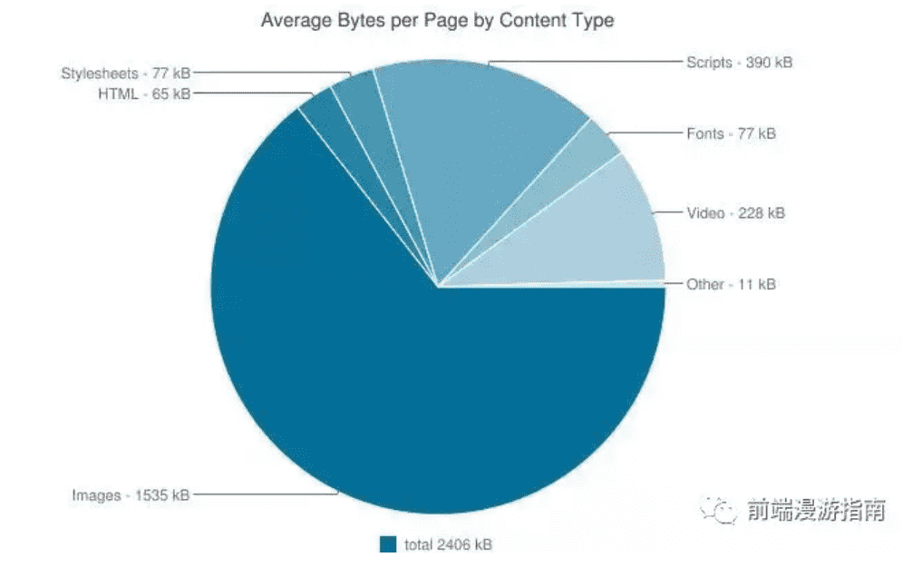
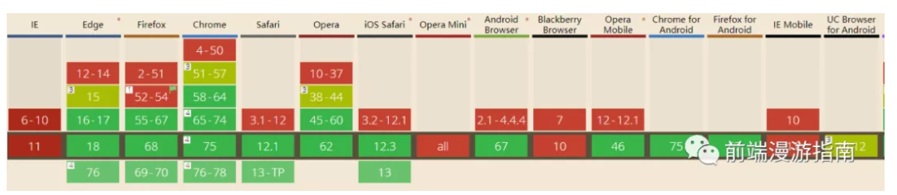
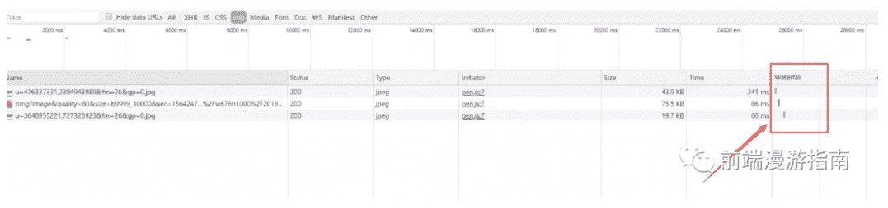
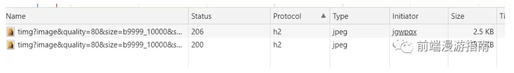
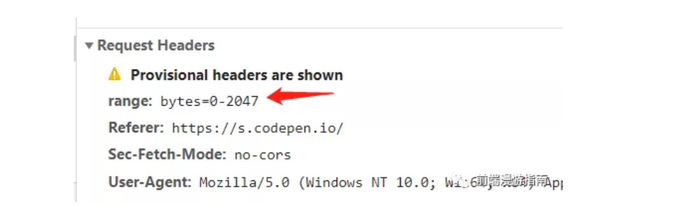
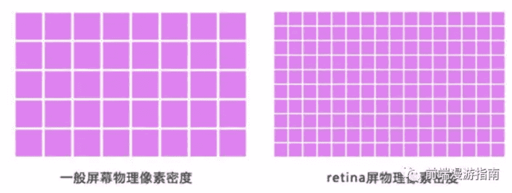
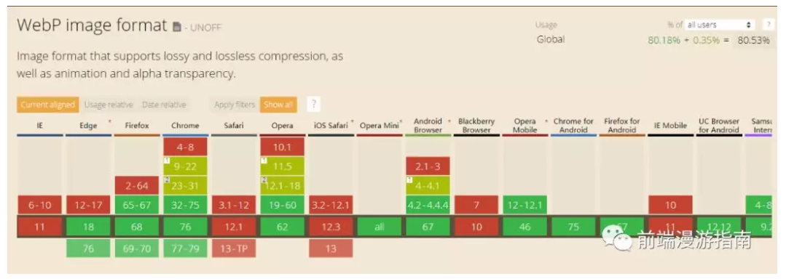
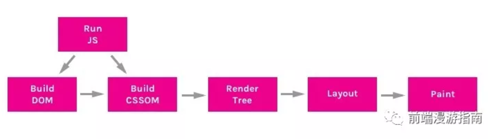

 以下文章来源于前端漫游指南 ，作者fecoder 

## 一、为什么要对图片进行优化

对于大多数前端工程师来说，图片就是UI设计师(或者自己)切好的图，你要做的只是把图片丢进项目中，然后用以链接的方式呈现在页面上，而且我们也经常把精力放在项目的打包优化构建上，如何分包，如何抽取第三方库……..有时我们会忘了，**图片才是一个网站最大头的那块加载资源**(见下图)，虽然图片加载可以不不阻碍页面渲染，但优化图片，绝对可以让网站的体验提升一个档次。



## 二、从图片大小开始优化

压缩图片可以使用统一的压缩工具 — imagemin，它是一款可以集成多个压缩库的工具，支持jpg，png，webp等等格式的图片压缩，比如pngquant，mozjpeg等等，作为测试用途，我们可以直接安装imagemin-pngquant来尝试png图片的压缩:

### PNG压缩

```bash
    npm install imagemin    
    npm install imagemin-pngquant
```

这里先安装imagemin库，再安装对应的png压缩库

```js
const imagemin = require('imagemin');
const imageminPngquant = require('imagemin-pngquant');
(async () => {
  await imagemin(['images/*.png'], 'build/images', {
    plugins: [imageminPngquant({
      quality: '65-80'
    })]
  });
  console.log('Images optimized');
})();
```

我们可以在quailty一项决定压缩比率，65-80貌似是一个在压缩率和质量之间实现平衡的数值，腾讯AlloyTeam出品的gka图片处理工具，同样使用到了imagemin库，他们默认也是使用65-80的选项：
gka代码
用它压缩一张png图片，我们看看效果如何:

这是压缩前的：


这是压缩后的：


从肉眼上几乎看不出区别，但实际上减少了百分之77的体积！读者可以自己保存图片进行比较。

### JPG/JPEG压缩与渐进式图片

压缩jpg/jpeg图片的方式与png类似，imagemin提供了两个插件：jpegtrain和mozjpeg供我们使用。一般我们选择mozjpeg，它拥有更丰富的压缩选项:

```bash
    npm install imagemin-mozjpeg
```
```js
const imagemin = require('imagemin');
const imageminMozjpeg = require('imagemin-mozjpeg');
(async () => {
  await imagemin(['images/*.jpg'], 'build/images', {
    use: [imageminMozjpeg({
      quality: 65,
      progressive: true
    })]
  });
  console.log('Images optimized');
})();
```

注意到我们使用了progressive: true选项，这可以将图片转换为渐进式图片，关于:yum:**渐进式图片，它允许在加载照片的时候，如果网速比较慢的话，先显示一个类似模糊有点小马赛克的质量比较差的照片，然后慢慢的变为清晰的照片：**


而相比之下，非渐进式的图片(Baseline JPEG)则会老老实实地从头到尾去加载：


张鑫旭大神的这篇文章，可以帮你更好地了解两者的区别：
渐进式jpeg(progressive jpeg)图片及其相关
简单来说，**渐进式图片一开始就决定了大小，而不像Baseline图片一样，不断地从上往下加载，从而造成多次回流，但渐进式图片需要消耗CPU去多次计算渲染，这是其主要缺点。**
当然，交错式png也可以实现相应的效果，但目前pngquant没有实现转换功能，但是ps中导出png时是可以设置为交错式的。

### 在真实项目中如何操作？

实际项目中，总不能UI丢一个图过来你就跑一遍压缩代码吧？幸好imagemin有对应的webpack插件，在webpack遍地使用的今天，我们可以轻松实现批量压缩：

```bash
    npm install imagemin-webpack-plugin
```

先安装imagemin-webpack-plugin

```js
import ImageminPlugin from 'imagemin-webpack-plugin'
import imageminMozjpeg from 'imagemin-mozjpeg'
module.exports = {
  plugins: [new ImageminPlugin({
    plugins: [imageminMozjpeg({
      quality: 100,
      progressive: true
    })]
  })]
}
```

接着在webpack配置文件中，引入自己需要的插件，使用方法完全相同。具体可参考github的文档imagemin-webpack-plugin

## 三、通过图片按需加载减少请求压力

图片按需加载是个老生常谈的话题，传统做法自然是通过监听页面滚动位置，符合条件了再去进行资源加载，我们看看如今还有什么方法可以做到按需加载。

### 使用强大的IntersectionObserver

IntersectionObserver提供给我们一项能力：可以用来监听元素是否进入了设备的可视区域之内，这意味着：我们等待图片元素进入可视区域后，再决定是否加载它，毕竟用户没看到图片前，根本不关心它是否已经加载了。
这是Chrome51率先提出和支持的API，而在2019年的今天，各大浏览器对它的支持度已经有所改善(除了IE，全线崩~)：



废话不多说，上代码：
首先，假设我们有一个图片列表，它们的src属性我们暂不设置，而用data-src来替代：

```html
<li> </li>
<li> </li>
<li> </li>
<li> </li>
```

这样会导致图片无法加载，这当然不是我们的目的，我们想做的是，当IntersectionObserver监听到图片元素进入可视区域时，将data-src”还给”src属性，这样我们就可以实现图片加载了:

```js
const observer = new IntersectionObserver(function (changes) {
  changes.forEach(function (element, index) {
    // 当这个值大于0，说明满足我们的加载条件了，这个值可通过rootMargin手动设置    
    if (element.intersectionRatio > 0) {
      // 放弃监听，防止性能浪费，并加载图片。      
      observer.unobserve(element.target);
      element.target.src = element.target.dataset.src;
    }
  });
});

function initObserver() {
  const listItems = document.querySelectorAll('.list-item-img');
  listItems.forEach(function (item) {
    // 对每个list元素进行监听    
    observer.observe(item);
  });
}
initObserver();
```

运行代码并观察控制台的Network，会发现图片随着可视区域的移动而加载，我们的目的达到了。



(ps: 这里额外介绍一个vue的图片懒加载组件vue-view-lazy，也是基于IntersectionObserver实现的)。

### 还是Chrome的黑科技——loading属性

从新版本Chrome(76)开始，已经默认支持一种新的html属性——loading，它包含三种取值:auto、lazy和eager(ps: 之前有文章说是lazyload属性，后来chrome的工程师已经将其确定为loading属性，原因是lazyload语义不够明确)，我们看看这三种属性有什么不同：

**auto**：让浏览器自动决定是否进行懒加载，这其中的机制尚不明确。

**lazy**：明确地让浏览器对此图片进行懒加载，即当用户滚动到图片附近时才进行加载，但目前没有具体说明这个“附近”具体是多近。

**eager**：让浏览器立刻加载此图片，也不是此篇文章关注的功能。

我们可以通过chrome的开发工具看看这个demo中的图片加载方式，我们把上一个demo中的js脚本都删掉了，只用了loading=lazy这个属性。接着，勾选工具栏中的Disabled Cache后仔细观察Network一栏，细心的人应该会发现，一张图片被分为了两次去请求！第一次的状态码是206，第二次的状态码才是200，如图所示：



这个现象跟chrome的lazy-loading功能的实现机制有关：

**首先**，浏览器会发送一个预请求，请求地址就是这张图片的url，但是这个请求只拉取这张图片的头部数据，大约2kb，具体做法是在请求头中设置range: bytes=0-2047，



而从这段数据中，浏览器就可以解析出图片的宽高等基本维度，接着浏览器立马为它生成一个空白的占位，以免图片加载过程中页面不断跳动，这很合理，总不能为了一个懒加载，让用户牺牲其他方面的体验吧？这个请求返回的状态码是206，表明：客户端通过发送范围请求头Range抓取到了资源的部分数据，详细的状态码解释可以看看这篇文章

**然后**，在用户滚动到图片附近时，再发起一个请求，完整地拉取图片的数据下来，这个才是我们熟悉的状态码200请求。

可以预测到，如果以后这个属性被普遍使用，那一个服务器要处理的图片请求连接数可能会变成两倍，对服务器的压力会有所增大，但时代在进步，我们可以依靠http2多路复用的特性来缓解这个压力，这时候就需要技术负责人权衡利弊了

**要注意**，使用这项特性进行图片懒加载时，记得先进行兼容性处理，对不支持这项属性的浏览器，转而使用JavaScript来实现，比如上面说到的IntersectionObserver：

```js
    if ("loading" in HTMLImageElement.prototype) {      
        // 没毛病    
    } else {      
        // .....    
    }
```

##### 还可以做到锦上添花！

以上介绍的两种方式，其实最终实现的效果是相似的，但这里还有个问题，当网速慢的时候，图片还没加载完之前，用户会看到一段空白的时间，在这段空白时间，就算是渐进式图片也无法发挥它的作用，我们需要更友好的展示方式来弥补这段空白，有一种方法简单粗暴，那就是用一张占位图来顶替，这张占位图被加载过一次后，即可从缓存中取出，无须重新加载，但这种图片会显得有些千篇一律，并不能很好地做到preview的效果。
这里我向大家介绍另一种占位图做法——**css渐变色背景**，原理很简单，当img标签的图片还没加载出来，我们可以为其设置背景色，比如:

```html
    
```

这样会先显示出红色背景，再渲染出真实的图片，重点来了，我们此时要借用工具为这张图片”配制”出合适的渐变背景色，以达到部分preview的效果，我们可以使用https://calendar.perfplanet.com/2018/gradient-image-placeholders/ 这篇文章中推荐的工具GIP进行转换，这里附上在线转换的地址https://tools.w3clubs.com/gip/
经过转换后，我们得到了下面这串代码：

```css
    background: linear-gradient(      
		to bottom,      
		#1896f5 0%,      
		#2e6d14 100%    
	)
```

最终效果如下所示：


## 四、响应式图片的实践

我们经常会遇到这种情况：一张在普通笔记本上显示清晰的图片，到了苹果的Retina屏幕或是其他高清晰度的屏幕上，就变得模糊了。

这是因为，在同样尺寸的屏幕上，高清屏可以展示的物理像素点比普通屏多，比如Retina屏，同样的屏幕尺寸下，它的物理像素点的个数是普通屏的4倍(2 * 2)，所以普通屏上显示清晰的图片，在高清屏上就像是被放大了，自然就变得模糊了，要从图片资源上解决这个问题，就需要在设备像素密度为2的高清屏中，对应地展示一张两倍大小的图。



而通常来讲，对于背景图片，我们可以使用css的@media进行媒体查询，以决定不同像素密度下该用哪张倍图，例如：

```css
.bg {
  background-image: url("bg.png");
  width: 100px;
  height: 100px;
  background-size: 100% 100%;
}

@media (-webkit-min-device-pixel-ratio: 2),
(min-device-pixel-ratio: 2) {
  .bg {
    background-image: url("bg@2x.png") // 尺寸为200 * 200的图        
  }    
}
```

这么做有两个好处，一是保证高像素密度的设备下，图片仍能保持应有的清晰度，二是防止在低像素密度的设备下加载大尺寸图片造成浪费。

那么如何处理img标签呢？

我们可以使用HTML5中img标签的srcset来达到这个效果，看看下面这段代码：

```html
    
```

这段代码的作用是：当设备像素密度，也就是dpr(devicePixelRatio)为1时，使用bg.png，为2时使用二倍图bg@2x.png，依此类推，你可以根据需要设置多种精度下要加载的图片，如果没有命中，浏览器会选择最邻近的一个精度对应的图片进行加载。
要注意：老旧的浏览器不支持srcset的特性，它会继续正常加载src属性引用的图像。

## 五、安全地使用WebP图片

WebP的优势这里不再赘述，简单来说就是：同样尺寸的图片，WebP能保证比未压缩过的png、jpg、gif等格式的图片减少百分之40-70(甚至90)的比例，且保证较高的质量，更可以支持显示动态图和透明通道。


但目前WebP的兼容性并不太好：



但我们可以通过两种方式，对暂未支持webp的浏览器进行兼容：

### picture结合source标签

HTML5的picture标签，可以理解为相框，里面可以支持多种格式的图片，并保留一张默认底图：

```html
<picture>
  <source srcset="bg.webp" type="image/webp">
  <source srcset="bg.jpg" type="image/jpeg">  
</picture>
```

有了这段代码，浏览器会自动根据是否支持webp格式来选择加载哪张图片，若不支持，则会显示bg.jpg，如果浏览器连picture都不支持，那么会fallback到默认的img图片，这是必不可少的一个选项。

而且这里要注意source的放置顺序，如果把jpg放在第一位，webp放在第二位，即使浏览器支持webp，那也会选择加载jpg图片。

### 借助cdn服务自动判断

目前，有些图片cdn服务可以开启自动兼容webp的模式，即支持webp的浏览器则将原图转换为webp图片并返回，否则直接返回原图。实现这个功能的原理是，根据浏览器发起的请求头中的Accept属性中是否包含webp格式来判断：


有则说明浏览器支持webp格式，这对开发者来说可能是最简单的兼容方案，但是依赖于后端服务。

接下来，谈一谈我认为应该反思的负优化手段：

## 六、对Base64Url的反思

首先复习一下Base64的概念，:yum:**Base64就是一种基于64个可打印字符来表示二进制数据的方法，编码过程是从二进制数据到字符串的过程，在web应用中我们经常用它来做啥呢——传输图片数据**。**HTML中，img的src和css样式的background-image都可以接受base64字符串，从而在页面上渲染出对应的图片**。正是基于浏览器的这项能力，很多开发者提出了将多张图片转换为base64字符串，放进css样式文件中的“优化方式”，这样做的目的只有一个——**减少HTTP请求数**。但实际上，在如今的应用开发中，这种做法大多数情况是“负优化”效果，接下来让我们细数base64 Url的“罪状”：

### 第一、让css文件的体积失去控制

当你把图片转换为base64字符串之后，字符串的体积一般会比原图更大，一般会多出接近3成的大小，如果你一个页面中有20张平均大小为50kb的图片，转它们为base64后，你的css文件将可能增大1.2mb的大小，这样将严重阻碍浏览器的关键渲染路径：



css文件本身就是**渲染阻塞资源**，浏览器首次加载时如果没有全部下载和解析完css内容就无法进行渲染树的构建，而base64的嵌入则是雪上加霜，这将把原先浏览器可以进行优化的图片异步加载，变成首屏渲染的阻塞和延迟。

或许有人会说，webpack的url-loader可以根据图片大小决定是否转为base64(一般是小于10kb的图片)，但你也应该担心如果页面中有100张小于10kb的图片时，会给css文件增加多少体积。

### 第二、让浏览器的资源缓存策略功亏一篑

假设你的base64Url会被你的应用多次复用，本来浏览器可以直接从本地缓存取出的图片，换成base64Url，将造成应用中多个页面重复下载1.3倍大小的文本，假设一张图片是100kb大小，被你的应用使用了10次，那么造成的流量浪费将是:(100 *1.3* 10) - 100 = 1200kb。

### 第三、低版本浏览器的兼容问题

这是比较次要的问题，dataurl在低版本IE浏览器，比如IE8及以下的浏览器，会有兼容性问题，详细情况可以参考这篇文章。

### 第四、不利于开发者工具调试与查看

无论哪张图片，看上去都是一堆没有意义的字符串，光看代码无法知道原图是哪张，不利于某些情况下的比对。

说了这么多，有人可能不服气，既然这种方案缺点这么多，为啥它会从以前就被广泛使用呢？这要从早期的http协议特性说起，在http1.1之前，http协议尚未实现keep-alive，也就是每一次请求，都必须走三次握手四次挥手去建立连接，连接完又丢弃无法复用，而即使是到了http1.1的时代，keep-alive可以保证tcp的长连接，不需要多次重新建立，但由于http1.1是基于文本分割的协议，所以消息是串行的，必须有序地逐个解析，所以在这种请求“昂贵”，且早期图片体积并不是特别大，用户对网页的响应速度和体验要求也不是很高的各种前提结合下，减少图片资源的请求数是可以理解的。

但是，在越来越多网站支持http2.0的前提下，这些都不是问题，h2是基于二进制帧的协议，在保留http1.1长连接的前提下，实现了消息的并行处理，请求和响应可以交错甚至可以复用，多个并行请求的开销已经大大降低，我已经不知道还有什么理由继续坚持base64Url的使用了。

## 总结

图片优化的手段总是随着浏览器特性的升级，网络传输协议的升级，以及用户对体验要求的提升而不停地更新迭代，几年前适用的或显著的优化手段，几年后不一定仍然如此。因地制宜，多管齐下，才能将其优化做到极致！

