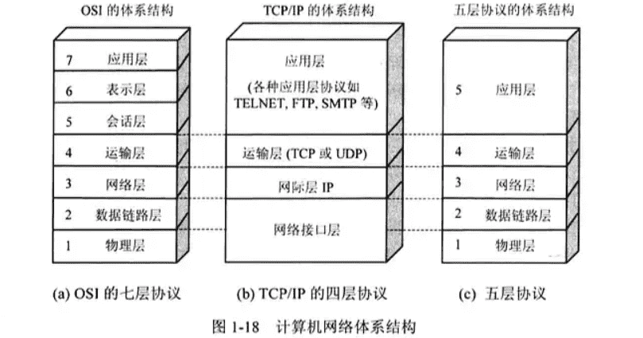
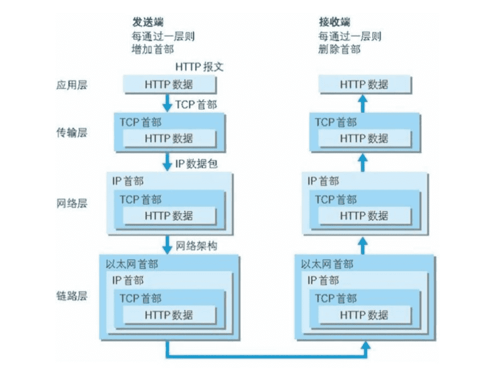
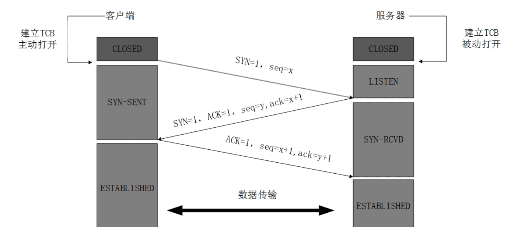
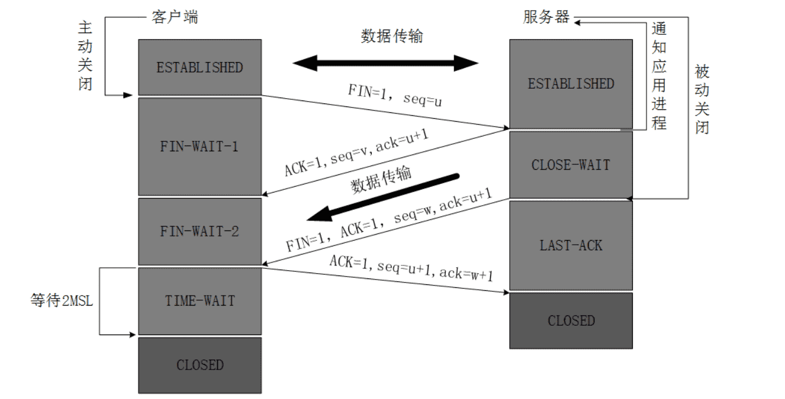
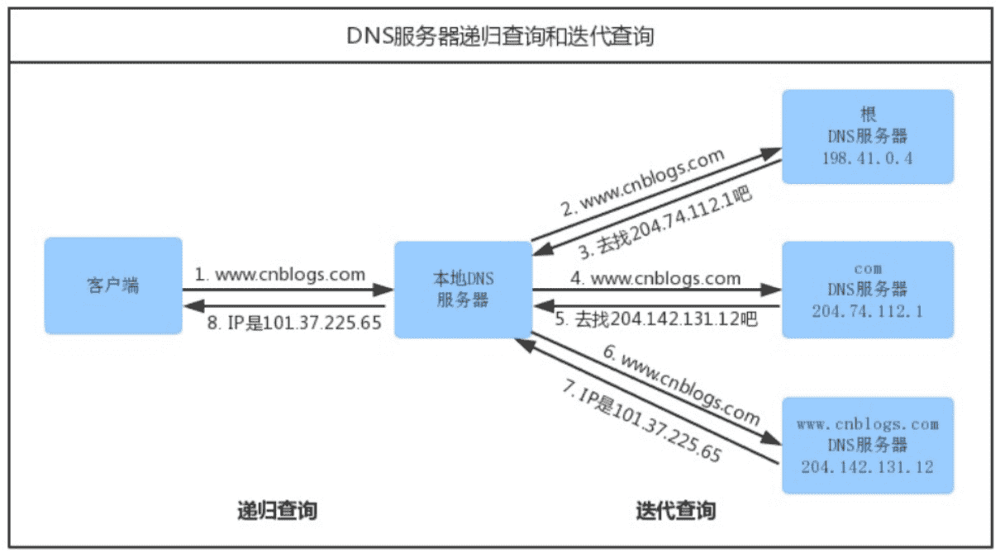
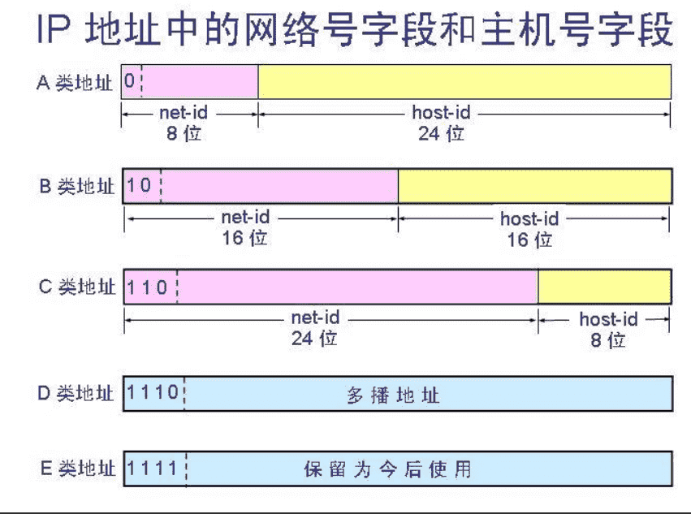
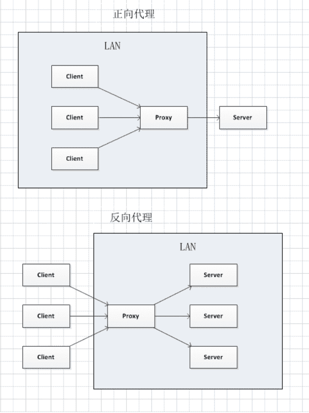
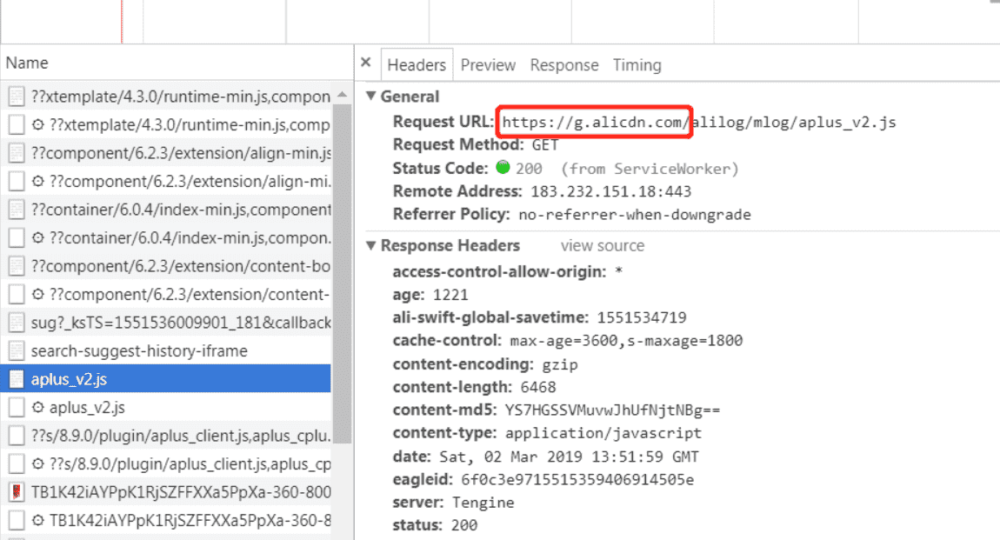
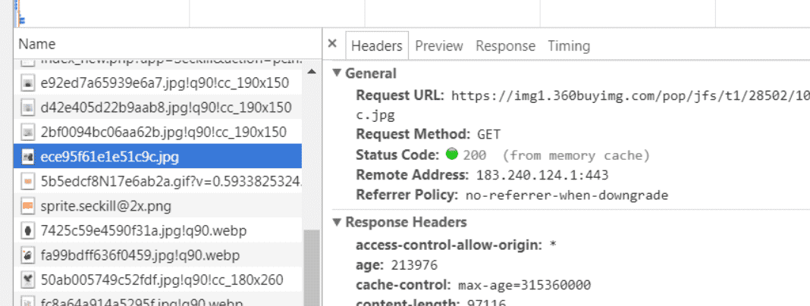
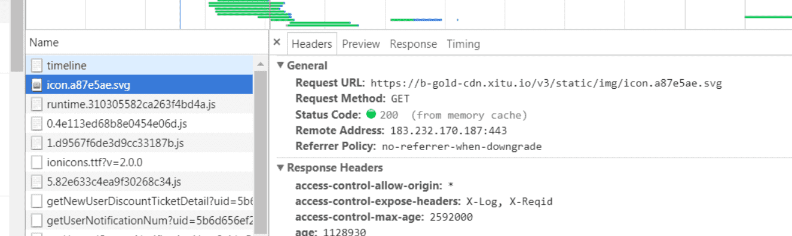

## 五层因特网协议栈 

五层因特网协议栈这个知识点对你来说或许有点枯燥，不过当你对这个协议栈有了一个初步的了解之后，你之前的某些疑问就会很明朗。

### 一、应用层

应用层( application-layer ）的任务是通过应用进程间的交互来完成特定网络应用。**应用层协议定义的是应用进程（进程：主机中正在运行的程序）间的通信和交互的规则**。对于不同的网络应用需要不同的应用层协议。在互联网中应用层协议很多，如域名系统 **DNS**，支持万维网应用的 **HTTP 协议**，支持电子邮件的 **SMTP 协议**、支持文件传输的**FTP协议**等等。

::: tip ~~

我们把**应用层交互的数据单元称为报文**

:::

#### 域名系统

域名系统( Domain Name System )是因特网的一项**核心服务**，它作为可以将域名和 IP 地址相互映射的一个分布式数据库，能够使人更方便的访问互联网，而不用去记住能够被机器直接读取的 IP 数串。

#### http 协议

**超文本传输协议**（ HyperText Transfer Protocol ）是互联网上应用最为广泛的一种网络协议。所有的 WWW（万维网） 文件都必须遵守这个标准。

### 二、传输层(报文)

传输层(transport layer)的主要任务就是负责向两台主机进程之间的通信提供通用的**数据传输服务**。**应用进程利用该服务传送应用层报文。**

::: tip 传输层常用的两种协议

 1. **传输控制协议-TCP**：提供面向连接的，可靠的数据传输服务。
 2. **用户数据协议-UDP**：提供无连接的，尽最大努力的数据传输服务（不保证数据传输的可靠性）。

:::

#### TCP（Transmisson Control Protocol）

1. TCP 是面向连接的（需要先建立连接）；
2. 每一条 TCP 连接只能有两个端点，每一条 TCP 连接只能是一对一；
3. TCP提供可靠交付的服务。通过TCP连接传送的数据，无差错、不丢失、不重复、并且按序到达；
4. TCP 提供全双工通信。TCP 允许通信双方的应用进程在任何时候都能发送数据。TCP 连接的两端都设有发送缓存和接收缓存，用来临时存放双方通信的数据；
5. 面向字节流。TCP 中的“流”（Stream）指的是流入进程或从进程流出的字节序列。

#### UDP（User Datagram Protocol）

1. UDP 是无连接的；

2. UDP 是尽最大努力交付，即不保证可靠交付，因此主机不需要维持复杂的链接状态；

3. UDP 是面向报文的；

4. UDP 没有拥塞控制，因此网络出现拥塞不会使源主机的发送速率降低（对实时应用很有用，如直播，实时视频会议等）；

5. UDP 支持一对一、一对多、多对一和多对多的交互通信；

6. UDP 的首部开销小，只有 8 个字节，比 TCP 的 20 个字节的首部要短。

  ::: tip ~~

  1.单工数据传输只支持数据在一个方向上传输

  2.半双工数据传输允许数据在两个方向上传输，但是，在某一时刻，只允许数据在一个方向上传输，它实际上是一种切换方向的单工通信；

  3.全双工数据通信允许数据同时在两个方向上传输，因此，**全双工通信是两个单工通信方式的结合，它要求发送设备和接收设备都有独立的接收和发送能力。**
  :::

### 三、网络层(分组)

网络层的任务就是选择合适的网间路由和交换结点，确保计算机通信的数据及时传送。在发送数据时，网络层把运输层产生的报文段或用户数据报封装成分组和包进行传送。在 TCP/IP 体系结构中，由于**网络层使用 IP 协议，因此分组也叫 IP 数据报 ，简称数据报。**

::: tip ~~

互联网是由大量的异构（heterogeneous）网络通过路由器（router）相互连接起来的。互联网使用的网络层协议是无连接的网际协议（Intert Prococol）和许多路由选择协议，因此互联网的网络层也叫做网际层或 IP 层。

:::

### 四、数据链路层(帧)

数据链路层(data link layer)通常简称为链路层。两台主机之间的数据传输，总是在一段一段的链路上传送的，这就需要使用专门的链路层的协议。
 在两个相邻节点之间传送数据时，数据链路层将网络层接下来的 IP 数据报组装成**帧**，在两个相邻节点间的链路上传送帧。每一帧包括数据和必要的控制信息（如同步信息，地址信息，差错控制等）。

::: tip ~~

在接收数据时，控制信息使接收端能够知道一个帧从哪个比特开始和到哪个比特结束。

:::

### 五、物理层(比特)

在物理层上所传送的数据单位是**比特**。 物理层(physical layer)的作用是实现相邻计算机节点之间比特流的透明传送，尽可能屏蔽掉具体传输介质和物理设备的差异。使其上面的数据链路层不必考虑网络的具体传输介质是什么。“透明传送比特流”表示经实际电路传送后的比特流没有发生变化，对传送的比特流来说，这个电路好像是看不见的。 在互联网使用的各种协议中最重要和最著名的就是 TCP/IP 两个协议。

### 同 OSI 七层协议模型、TCP/IP 四层模型的区别

1. OSI 七层模型
    OSI七层协议模型主要是：
    应用层（Application）、表示层（Presentation）、会话层（Session）、传输层（Transport）、网络层（Network）、数据链路层（Data Link）、物理层（Physical）。
2. TCP/IP四层模型
    TCP/IP是一个四层的体系结构，主要包括：
    应用层、传输层、网络层和链路层。

### 各层对应

以下一张图很好的说明了这三种协议的区别



## HTTP 与 HTTPS 的区别

|   区别   |                             HTTP                             |                            HTTPS                             |
| :------: | :----------------------------------------------------------: | :----------------------------------------------------------: |
|   协议   | 运行在 TCP 之上，明文传输，**客户端与服务器端都无法验证对方的身份** | 身披 SSL( Secure Socket Layer 安全套接层 )外壳的 HTTP，运行于 SSL 上，SSL 运行于 TCP 之上， **是添加了加密和认证机制的 HTTP**。 |
|   端口   |                            **80**                            |                           **443**                            |
| 资源消耗 |                             较少                             |         由于加解密处理，会消耗更多的 CPU 和内存资源          |
|   开销   |                           无需证书                           |          **需要证书**，而证书一般需要向认证机构购买          |
| 加密机制 |                              无                              |         共享密钥加密和公开密钥加密并用的混合加密机制         |
|  安全性  |                              弱                              |                    由于加密机制，安全性强                    |

### 对称加密与非对称加密

对称密钥加密是指加密和解密使用同一个密钥的方式，**这种方式存在的最大问题就是密钥发送问题，即如何安全地将密钥发给对方；**
 而非对称加密是指使用一对非对称密钥，即公钥和私钥，公钥可以随意发布，但私钥只有自己知道。发送密文的一方使用对方的公钥进行加密处理，对方接收到加密信息后，使用自己的私钥进行解密。
 由于非对称加密的方式不需要发送用来解密的私钥，所以可以保证安全性；但是和对称加密比起来，非常的慢.

::: tip 综上：

我们还是用对称加密来传送消息，但对称加密所使用的密钥我们可以通过非对称加密的方式发送出去。 

::: 

### HTTP2

HTTP2 可以提高了网页的性能。

在 HTTP1 中浏览器限制了同一个域名下的请求数量（Chrome 下一般是六个），当在请求很多资源的时候，由于队头阻塞当浏览器达到最大请求数量时，剩余的资源需等待当前的六个请求完成后才能发起请求。

HTTP2 中引入了**多路复用**的技术，这个技术可以只通过一个 TCP 连接就可以传输所有的请求数据。多路复用可以绕过浏览器限制同一个域名下的请求数量的问题，进而提高了网页的性能。

## TCP/IP 协议

### 负责传输的 IP 协议

按层次分，IP（Internet Protocol）网际协议位于网络层，IP 协议的作用是把各种数据包传送给对方。而要保证确实传送到对方那里，则需要满足各类条件，其中两个重要的条件是 IP 地址和 MAC 地址（Media Access Control Address）。

::: tip 区别：

IP 地址和 MAC 地址： 指明了节点被分配到的地址，MAC 地址是指网卡所属的固定地址，IP 地址可以和 MAC 地址进行配对。**IP 地址可变换，但 MAC 地址基本上不会更改。**

:::

**使用 ARP(地址解析协议) 协议凭借 MAC 地址进行通信**

1. IP 间的通信依赖 MAC 地址。
2. ARP 是一种用以解释地址的协议，根据通信方的 IP 地址就可以反查出对应方的 MAC 地址。

### TCP 协议如何保持传输的可靠性

**TCP提供一种面向连接的、可靠的字节流服务。**
 **1. 面向连接**
 意味着两个使用 TCP 的应用（通常是一个客户和一个服务器）在彼此交换数据之前必须先建立一个 TCP 连接。在一个 TCP 连接中，仅有两方进行彼此通信；
 **2. 字节流服务**
 意味着两个应用程序通过 TCP 连接交换 8bit 字节构成的字节流，TCP 不在字节流中插入记录标识符。

**TCP 之所以可靠，大体上由于以下原因：**

1. **数据包校验**：目的是检测数据在传输过程中的任何变化，若校验出包有错，则丢弃报文段并且不给出响应，这时 TCP 发送数据端超时后会重发数据；
2. **对失序数据包重排序**：既然 TCP 报文段作为 IP 数据报来传输，而 IP 数据报的到达可能会失序，因此 TCP 报文段的到达也可能会失序。TCP 将对失序数据进行重新排序，然后才交给应用层；
3. **丢弃重复数据**：对于重复数据，能够丢弃重复数据；
4. **应答机制**：当 TCP 收到发自 TCP 连接另一端的数据，它将发送一个确认。这个确认不是立即发送，通常将推迟几分之一秒；
5. **超时重发**：当 TCP 发出一个段后，它启动一个定时器，等待目的端确认收到这个报文段。如果不能及时收到一个确认，将重发这个报文段；
6. **流量控制**：TCP 连接的每一方都有固定大小的缓冲空间。TCP 的接收端只允许另一端发送接收端缓冲区所能接纳的数据，这可以防止较快主机致使较慢主机的缓冲区溢出，这就是流量控制。

### TCP/IP 通信传输流

借用图解 HTTP 一书中的图文：



发送端在层与层之间传输数据时，每经过一层必定会加上一个该层的首部信息。反之，接收端在层与层之间传输数据时，每经过一层会把相关的首部信息去掉。

## TCP 三次握手和四次挥手

TCP（Transmission Control Protocol 传输控制协议）是一种面向连接的、可靠的、基于字节流的传输层通信协议，由 IETF 的 RFC793 定义。

### 三次握手



第一次握手：

 建立连接时，向服务器发出连接请求报文，这是报文首部中的同部位 SYN = 1，同时选择一个初始序列号 seq = x ，客户端进程进入了 SYN-SENT （同步已发送状态）状态,等待服务器确认；

第二次握手：

 服务器收到 syn 包后，如果同意连接，则发出确认报文; 确认报文 ACK = 1，SYN = 1，确认号是 ack = x + 1，同时也要为自己初始化一个序列号 seq = y，此时服务器进程进入了 SYN-RCVD（同步收到）状态；

第三次握手：

 客户端收到服务器的 SYN+ACK 包，要向服务器给出确认。确认报文的 ACK = 1，ack = y + 1，自己的序列号 seq = x + 1，此时，TCP 连接建立，客户端进入 ESTABLISHED （已建立连接）状态。

完成三次握手，客户端与服务器开始传送数据。

::: tip 注：
seq:"sequance" 序列号；
ack:"acknowledge" 确认号；
SYN:"synchronize" 请求同步标志；
ACK:"acknowledge" 确认标志；
FIN:"Finally" 结束标志。

:::

**未连接队列**
 在三次握手协议中，服务器维护一个未连接队列，该队列为每个客户端的SYN包（syn=j）开设一个条目，该条目表明服务器已收到SYN包，并向客户端发出确认，正在等待客户端的确认包。这些条目所标识的连接在服务器处于 SYN_RECV状态，当服务器收到客户端的确认包时，删除该条目，服务器进入ESTABLISHED状态。

::: tip ~~

建立一个连接需要三次握手，而终止一个连接要经过四次挥手，这是由 TCP 的半关闭（half-close）造成的。

:::

### 四次挥手



**第一次挥手**：

 客户端进程发出连接释放报文，并且停止发送数据。释放数据报文首部 FIN=1，其序列号为 seq = u（等于前面已经传送过来的数据的最后一个字节的序号加1），此时，客户端进入 FIN-WAIT-1（终止等待1）状态。

**第二次挥手：**
 服务器收到连接释放报文，发出确认报文，ACK = 1，ack = u + 1，并且带上自己的序列号 seq = v，此时，服务端就进入了 CLOSE-WAIT（关闭等待）状态。

> TCP 服务器通知高层的应用进程，客户端向服务器的方向就释放了，这时候处于半关闭状态，即客户端已经没有数据要发送了，但是服务器若发送数据，客户端依然要接受。这个状态还要持续一段时间，也就是整个 CLOSE-WAIT 状态持续的时间。
>  客户端收到服务器的确认请求后，此时，客户端就进入 FIN-WAIT-2（终止等待2）状态，等待服务器发送连接释放报文（在这之前还需要接受服务器发送的最后的数据）。

**第三次挥手：**
 服务器将最后的数据发送完毕后，就向客户端发送连接释放报文，FIN = 1，ack = u + 1，由于在半关闭状态，服务器很可能又发送了一些数据，假定此时的序列号为 seq = w，此时，服务器就进入了 LAST-ACK（最后确认）状态，等待客户端的确认。

**第四次挥手：**
 客户端收到服务器的连接释放报文后，必须发出确认，ACK = 1，ack = w + 1，而自己的序列号是 seq = u + 1，此时，客户端就进入了 TIME-WAIT（时间等待）状态。

> 注意此时 TCP 连接还没有释放，必须经过 2MSL（最长报文段寿命）的时间后，当客户端撤销相应的 TCB 后，才进入 CLOSED 状态。

服务器只要收到了客户端发出的确认，立即进入 CLOSED 状态。同样，撤销 TCB 后，就结束了这次的 TCP 连接。
::: tip 提示
可以看到，**服务器结束 TCP 连接的时间要比客户端早一些。**
:::

#### 四次的原因

这是因为服务端的 LISTEN 状态下的 SOCKET 当收到 SYN 报文的建连请求后，它可以把 ACK 和 SYN（ACK 起应答作用，而 SYN 起同步作用）放在一个报文里来发送。     但关闭连接时，当收到对方的 FIN 报文通知时，它仅仅表示对方没有数据发送给你了；但未必你所有的数据都全部发送给对方了，所以你未必会马上会关闭 SOCKET ,也即你可能还需要发送一些数据给对方之后，再发送 FIN 报文给对方来表示你同意现在可以关闭连接了，所以它这里的 ACK 报文和 FIN 报文多数情况下都是分开发送的.

::: tip ~~

由于 TCP 连接是全双工的，因此每个方向都必须单独进行关闭。这个原则是当一方完成它的数据发送任务后就能发送一个 FIN 来终止这个方向的连接。收到一个 FIN 只意味着这一方向上没有数据流动，一个 TCP 连接在收到一个 FIN 后仍能发送数据。首先进行关闭的一方将执行主动关闭，而另一方执行被动关闭。

:::

## DNS 域名解析

当你在浏览器的地址栏输入 `https://juejin.im` 后会发生什么，大家在心中肯定是有一个大概的，这里我将 **DNS 域名解析** 这个步骤详细的讲一遍。在讲概念之前我先放上一张经典的图文供大家思考一分钟。



### 查找域名对应的 IP 地址的具体过程

1. 浏览器搜索自己的 DNS 缓存（浏览器维护一张域名与 IP 地址的对应表）；如果没有命中，进入下一步；
2. 搜索操作系统中的 DNS 缓存；如果没有命中，进入下一步；
3. 搜索操作系统的 hosts 文件（ Windows 环境下，维护一张域名与 IP 地址的对应表）；如果没有命中，进入下一步；

::: tip ~~

1. 操作系统将域名发送至 **LDNS （本地区域名服务器）**，LDNS 查询自己的 DNS 缓存（一般命中率在 80% 左右），查找成功则返回结果，失败则发起一个迭代 DNS 解析请求：
2. LDNS向 Root Name Server（**根域名服务器**，如com、net、im 等的顶级域名服务器的地址）发起请求，此处，Root Name Server 返回 im 域的顶级域名服务器的地址；
3. LDNS 向 im 域的顶级域名服务器发起请求，返回 juejin.im 域名服务器地址；
4. LDNS 向 juejin.im 域名服务器发起请求，得到 juejin.im 的 IP 地址；
5. LDNS 将得到的 IP 地址返回给操作系统，同时自己也将 **IP 地址缓存起来**；操作系统将 IP 地址返回给浏览器，同时自己也将 **IP 地址缓存起来**。

:::

### DNS Prefetch

即 DNS 预获取，是前端优化的一部分。一般来说，在前端优化中与 DNS 有关的有两点：

1. 减少 DNS 的请求次数
2. 进行 DNS 预获取

典型的一次 DNS 解析需要耗费 20-120  毫秒，减少DNS解析时间和次数是个很好的优化方式。DNS Prefetching 是让具有此属性的域名不需要用户点击链接就在后台解析，而域名解析和内容载入是串行的网络操作，所以这个方式能减少用户的等待时间，提升用户体验。

## 五类 IP 地址

网络地址：用于识别主机所在的网络；
 主机地址：用于识别该网络中的主机。

IP地址分为五类：

1. A 类保留给政府机构
2. B 类分配给中等规模的公司
3. C 类分配给任何需要的人
4. D 类用于用于特殊用途. 又称做广播地址
5. E 类暂时保留

::: tip 各类可容纳的地址数目不同。

其中A类、B类、和C类这三类地址用于 TCP/IP 节点，其它两类D类和E类被用于特殊用途。

:::

首先用一张图给大家一个初步的概念：



### 一. A类地址

第一个八位段为网络地址，其它为主机地址，第一个八位段首位一定为0；
 范围：1.0.0.1—126.155.255.254；
 **私有地址和保留地址**：
 **10.X.X.X是私有地址**（所谓的私有地址就是在互联网上不使用，而被用在局域网络中的地址）。
 **127.X.X.X是保留地址，用做循环测试用的。**

### 二. B类地址

第一个八位段和第二个八位段为网络地址，其它为主机地址，第一个八位段首位一定为10；
 范围：128.0.0.1—191.255.255.254。
 私有地址和保留地址:
 **172.16.0.0—172.31.255.255是私有地址**
 169.254.X.X是保留地址。如果你的IP地址是自动获取IP地址，而你在网络上又没有找到可用的DHCP服务器。就会得到其中一个IP。

### 三. C类地址

前三个八位段为网络地址，第4个个字节为主机地址，第一个八位段首位一定为110。
 范围：192.0.0.1—223.255.255.254。
 私有地址：
 **192.168.X.X是私有地址。**

### 四. D类地址

不分网络地址和主机地址，第一个八位段首位一定为1110。
 范围：224.0.0.1—239.255.255.254

### 五. E类地址

不分网络地址和主机地址，第一个八位段首位一定为11110。
 范围：240.0.0.1—255.255.255.254

::: tip 一些特殊地址：

​	**直接广播地址：** A类、B类与C类IP地址中，主机号为全**1**(如191.1.255.255)的地址，路由器将这个分组以广播方式发送给特定网络(191.1.0.0)的所有主机。

​	**受限广播地址：** 32位网络号与主机号为全1的IP地址(255.255.255.255)为受限广播地址。

​	**“这个网络上的特定主机”地址：** 在A类、B类与C类IP地址中，如果网络号是全**0**，该地址是这个网络上的**特定主机地址。**

​	**回送地址：** A类IP地址中127.0.0.0是回送地址，它是一个保留地址。回送地址用于网络软件测试和本地进程间通信。

:::

## 跨域的原因及处理方式

请跳转《[跨域实现](/font/浏览器网络/跨域实现.md)》一文

## 正向代理和反向代理

### 概念

首先附上正儿八经的说明图，先有一个整体的理解。



然后很官方的解释它们的概念：

正向代理（ Forward Proxy ）：是指是一个位于客户端和原始服务器之间的服务器，为了从原始服务器取得内容， 客户端向代理发送一个请求并指定目标(原始服务器)，然后代理向原始服务器转交请求并将获得的内容返回给客户端。客户端才能使用正向代理。

反向代理（ Reverse Proxy ）：是指以代理服务器来接受 Internet 上的连接请求，然后将请求转发给内部网络上的服务器，并将从服务器上得到的结果返回给 Internet 上请求连接的客户端，此时代理服务器对外就表现为一个反向代理服务器。

### 特点

#### 正向代理

1. **代理客户**;
2. 隐藏真实的客户，为客户端收发请求，使真实客户端对服务器不可见;
3. 一个局域网内的所有用户可能被一台服务器做了正向代理，由该台服务器负责 HTTP 请求;
4. 意味着同服务器做通信的是正向代理服务器;

#### 反向代理

1. **代理服务器**;
2. 隐藏了真实的服务器，为服务器收发请求，使真实服务器对客户端不可见;
3. 负载均衡服务器，将用户的请求分发到空闲的服务器上;
4. 意味着用户和负载均衡服务器直接通信，即用户解析服务器域名时得到的是负载均衡服务器的 IP ;

#### 共同点

1. 都是做为服务器和客户端的中间层
2. 都可以加强内网的安全性，阻止 web 攻击
3. 都可以做缓存机制

### 实际应用

#### Nginx 服务器

Nginx 服务器的功能有很多，诸如反向代理、负载均衡、静态资源服务器等。

客户端本来可以直接通过 HTTP 协议访问服务器，不过我们可以在中间加上一个 Nginx 服务器，客户端请求 Nginx 服务器，Nginx 服务器请求应用服务器，然后将结果返回给客户端，此时 Nginx  服务器就是反向代理服务器。

#### 在虚拟主机的配置中配置反向代理

```js
# 虚拟主机的配置
server {
    listen 8080;                         # 监听的端口
    server_name  192.168.1.1;            # 配置访问域名
    root  /data/toor;                    # 站点根目录
    error_page 502 404 /page/404.html;   # 错误页面
    location ^~ /api/  {                        # 使用 /api/ 代理 proxy_pass 的值
        proxy_pass http://192.168.20.1:8080;    # 被代理的应用服务器 HTTP 地址
    }
}
```

以上简单的配置就可以实现反向代理的功能。

当然反向代理也可以处理跨域问题，在 Vue 中就可以使用 `proxyTable` 这个属性进行相关的配置来解决跨域问题带来的烦恼。配置如下：

```js
...
proxyTable: {
    '/weixin': {
        target: 'http://192.168.48.11:8100/', // 接口的域名 
        secure: false,      // 如果是 https 接口，需要配置这个参数
        changeOrigin: true, // 如果接口跨域，需要进行这个参数配置
        pathRewrite: {
            '^/weixin': ''
        }
    },
},
...
```

#### 负载均衡的配置

```js
# upstream 表示负载服务器池，定义名字为 my
upstream my {
    server 192.168.2.1:8080 weight=1 max_fails=2 fail_timeout=30s;
    server 192.168.2.2:8080 weight=1 max_fails=2 fail_timeout=30s;
    server 192.168.2.3:8080 weight=1 max_fails=2 fail_timeout=30s;
    server 192.168.2.4:8080 weight=1 max_fails=2 fail_timeout=30s;
   # 即在 30s 内尝试 2 次失败即认为主机不可用
  }
```

负载均衡即将 **请求/数据** 轮询分摊到多个服务器上执行，负载均衡的关键在于 **均匀**。

也可以通过 `ip-hash` 的方式，根据客户端 ip 地址的 hash 值将请求分配给固定的某一个服务器处理。

另外，服务器的硬件配置可能不同，配置好的服务器可以处理更多的请求，这时可以通过 `weight` 参数来控制。

## CDN 带来的性能优化

::: tip CDN的全称是 Content Delivery Network，即内容分发网络。

CDN 是构建在网络之上的内容分发网络，依靠部署在各地的边缘服务器，通过中心平台的负载均衡、内容分发、调度等功能模块，使用户就近获取所需内容，降低网络拥塞，提高用户访问响应速度和命中率。CDN 的关键技术主要有**内容存储**和**分发技术**。

:::

### CDN的优势

1. CDN 节点解决了跨运营商和跨地域访问的问题，访问延时大大降低；
2. 大部分请求在 CDN 边缘节点完成，CDN 起到了分流作用，减轻了源站的负载。

::: tip

访问速度快是电商网站取胜的必要法宝之一。

:::

### CDN 的工作模式

比如我们 SHEIN 主站的根服务器中国深圳，CDN 服务器在美国加州，欧洲法国，印度等三个地方（真实的细致很多）。

#### 没有 CDN 服务器

那么全球 6000 万用户请求的资源都是从中国深圳的机房发出的，这样一位美国加州的用户在打开首页的延时可能足够她画一个精致的妆容了。（PS: 深圳前端团队在招前端开发，有需求的可以私信我）

#### 有 CDN 服务器

此时还是这位加州的用户想打开 SHEIN 打算购买一件晚礼服参加晚会。这次她视线还没有移到梳妆台，首页就已经打开了，然后她就开心的购物了。

这就是因为 CDN 服务器。

美国加州的 CDN 服务器，已经将根节点的资源复制过来了。并且我们有个机制，CDN 节点的资源十分钟会回源更新一次。所以在用户请求资源的时候是不会回源到深圳的根服务器请求的。这样不会出现用户在请求资源的时候，因为回源而导致的网络延时。

::: tip CDN 的核心点有两个:

一个是缓存

一个是回源。

:::

### 关键技术

1. 内容发布：它借助于建立索引、缓存、流分裂、组播（Multicast）等技术，将内容发布或投递到距离用户最近的远程服务点（POP）处；
2. 内容路由：它是整体性的网络负载均衡技术，通过内容路由器中的重定向（DNS）机制，在多个远程 POP 上均衡用户的请求，以使用户请求得到最近内容源的响应；
3. 内容交换：它根据内容的可用性、服务器的可用性以及用户的背景，在POP的缓存服务器上，利用应用层交换、流分裂、重定向（ICP、WCCP）等技术，智能地平衡负载流量；
4. 性能管理：它通过内部和外部监控系统，获取网络部件的状况信息，测量内容发布的端到端性能（如包丢失、延时、平均带宽、启动时间、帧速率等），保证网络处于最佳的运行状态。

前端往往认为 CDN 是不需要了解的知识。可是我们前端工程首先是软件工程师。多了解一些东西肯定是有益的。

### CDN & 静态资源

静态资源本身具有访问频率高、承接流量大的特点，因此静态资源加载速度始终是前端性能的一个非常关键的指标。CDN 是静态资源提速的重要手段。

**淘宝**



**京东**



**掘金**



我们随手打开一个网站点开一个静态资源，可以看到它都是从 CDN 服务器上请求来的。可以看出 "静态资源走 CDN" 是最佳实践。

### CDN & Cookie

Cookie 是紧跟域名的。同一个域名下的所有请求，都会携带相同的 Cookie。

但是如果我们只是请求一张图片，我们在请求中还要携带一个笨重的 Cookie 来回的跑，Cookie 中的信息和图片又是没有关联的，这种情况就很让人头痛了。Cookie 虽然小，但是随着请求的越来越多，这种的不必要的 Cookie 带来的开销将是无法想象的……

> 静态资源往往并不需要 Cookie 携带什么认证信息。把静态资源和主页面置于不同的域名下，就可以完美地避免请求中携带不必要的 Cookie。

看起来是一个不起眼的小细节，但带来的效用却是惊人的。电商网站静态资源的流量之庞大，如果没把这个多余的 Cookie 拿下来，不仅用户体验会大打折扣，每年因性能浪费导致的开销也会非常之高。

## HTTP 强缓存&协商缓存

请跳转《[浏览器缓存](/font/浏览器网络/浏览器缓存.md)》一文

作者：小生方勤

链接：https://juejin.im/post/5c7a9f8c518825640d1dd503

来源：掘金


