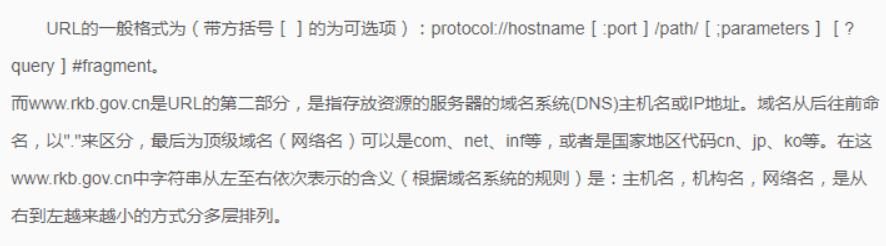

- 计算机网络共四个阶段分为：

  第1阶段：20世纪60年代末到20世纪70年代初为计算机网络发展的萌芽阶段。

  第2阶段：20世纪70年代中后期是局域网络(LAN)发展的重要阶段

  第3阶段：整个20世纪80年代是计算机局域网络的发展时期。

  第4阶段：20世纪90年代初至现在是计算机网络飞速发展的阶段。

- **域名系统DNS**(Domain Name System)是因特网使用的命名系统，用来把便于人们记忆的含有特定含义的主机名转换为便于机器处理的IP地址。DNS系统采用客户\服务器模型，其协议运行在UDP之上，使用53号端口。

- **URI**（identifier）：统一资源标识符       **URL** （locator）：统一资源定位符

- **网桥**是干什么的：主要用于局域网的扩展，作用与数据链路层。可以将局域网划分为多个网段，网桥是数据链路层的

::: tip 网桥

源路由网桥由源结点实现帧的路由选择功能

而透明网桥是通过自学习的方式转发帧

:::

::: tip 位置

**中继器**(信号放大与整形)：物理层

**集线器Hub**(可以有多个端口，也是信号放大与整形)：物理层

**交换机**(在多端口之间同时转发多帧)：MAC层

**网桥**(MAC地址过滤与帧转发)：数据链路层(MAC层)

**路由器**(连接两个网络，对分组报文进行转发的设备)：网络层

**网关**(协议的转换与数据的转发)：网络层以上

:::

::: tip 协议端口

80  http        用于万维网（WWW）服务的超文本传输协议（HTTP）

21  ftp          文件传输协议（FTP）端口；有时被文件服务协议（FSP）使用(FTP服务器有两个端口，其中21端口用于控制连接，20端口用于传输数据)

22  ssh        安全 Shell（SSH）服务

23  telnet     Telnet 服务

25  smtp      简单邮件传输协议（SMTP）

:::

- ICMP 报文作为数据字段封装在 IP 分组中，因此， IP 协议直接为 ICMP 提供服务。 UDP 和 TCP 都是传输层协议，为应用层提供服务。 PPP协议是链路层协议，为网络层提供服务。

- IP 分片发生在 **IP 层** ，不仅 **源端主机** 会进行分片，中间的 **路由器** 也有可能分片，因为不同的网络的 MTU 是不一样的，如果传输路径上的某个网络的 MTU 比源端网络的 MTU 要小，路由器就可能对 IP 数据报再次进行分片。而分片数据的 **重组** 只会发生在 **目的端** 的 IP 层。

- 不同的端口号可以连接不同的服务端，端口号的长度为16为，2*16次方，所以最多为65535个。

- 802.3以太网，采用CSMA/CD(载波监听多点接入/碰撞检测)；802.4令牌总线网；802.5令牌环网。

- PPP（Point-to-Point Protocol点到点协议）是为在 **同等单元之间传输数据包这样的简单链路设计的链路层协议** 。这种链路提供全双工操作，并按照顺序传递数据包。 
  **PPP协议支持以下功能：**

  - IP地址的动态分配和管理
  - 同步或异步的物理层通信
  - 链路的配置、质量检测和纠错
  - 多种配置参数选项的协商

  **PPP是目前使用最广泛的数据链路层协议，不管是低速的拨号猫连接还是高速的光纤链路，都适用PPP协议** 。因特网用户通常都要连接到某个ISP 才能接入到因特网。 PPP协议就是用户计算机和ISP进行通信时所使用的数据链路层协议。 ISP使用PPP协议为计算机分配一些网络参数（如IP地址、域名等）。

- 简单网络管理协议（ SNMP ）：属于**应用层**

- RTSP（Real Time Streaming Protocol），实时流传输协议，是TCP/IP协议体系中的一个**应用层**协议

- **RIP**是一种分布式的基于距离向量的路由选择协议，通过广播**UDP**报文来交换路由信息。

- **OSPF**是一个内部网关协议，不使用传输协议，如UDP或TCP，而是直接用**IP**包封装它的数据。

- **BGP**是一个外部网关协议，用**TCP**封装它的数据。

- **HDLC协议**(高级数据链路控制)对比特串进行组帧时，HDLC数据帧以位值0111 1110 标识，每一个帧的开始和结束，

  因此，在帧数据中凡是出现连续五个1时，就在输出位流末尾加0

::: tip 零散的名词解释

IPS 入侵防御系统

UTM  安全网关

IDS 入侵检测系统

FDDI 光钎分布式接口(属于高速计算机网络技术)

ATM 异步传输模式(属于高速计算机网络技术)

:::