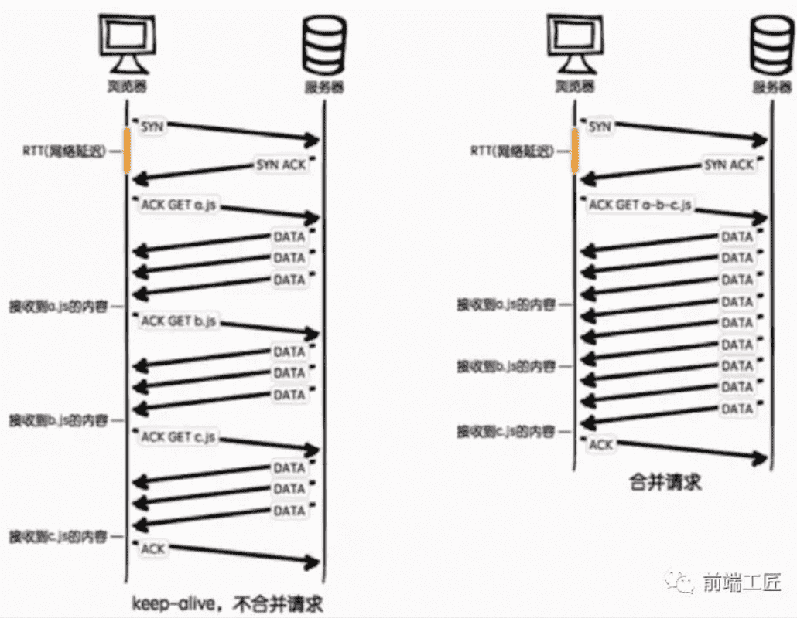

**互联网有一项著名的8秒原则。用户在访问Web网页时，如果时间超过8秒就会感到不耐烦，如果加载需要太长时间，他们就会放弃访问**。大部分用户希望网页能在2秒之内就完成加载。事实上，加载时间每多1秒，你就会流失7%的用户。8秒并不是准确的8秒钟，只是向网站开发者表明了加载时间的重要性。那我们如何优化页面性能，提高页面加载速度呢？这是本文主要要探讨的问题，然而性能优化是个综合性问题，没有标准答案，想要面面俱到罗列出来，并非易事。本文只关注一些核心要点，以下是我总结性能优化常见的办法：

## 一、资源压缩与合并，减少http请求

主要包括这些方面：html压缩、css 压缩、js的压缩和混乱和文件合并。 资源压缩可以从文件中去掉多余的字符，比如回车、空格。你在编辑器中写代码的时候，会使用缩进和注释，这些方法无疑会让你的代码简洁而且易读，但它们也会在文档中添加多余的字节。

- **html压缩、css压缩**:fire:
- **使用精灵图(css sprites)来合并图片**:fire:
- **图片较多的页面也可以使用 lazyLoad(懒加载) 等技术进行优化。**:fire:
- **js的压缩和混乱:fire:**
- **文件合并:fire:**

#### 1.html压缩

html代码压缩就是压缩这些在文本文件中有意义，但是在HTML中不显示的字符，包括空格，制表符，换行符等，还有一些其他意义的字符，如HTML注释也可以被压缩。

**如何进行html压缩：**

1. 使用在线网站进行压缩(开发过程中一般不用)
2. nodejs 提供了html-minifier工具
3. 后端模板引擎渲染压缩

#### 2.css代码压缩

css代码压缩简单来说就是无效代码删除和css语义合并

**如何进行css压缩：**

1. 使用在线网站进行压缩(开发过程中一般不用)

2. 使用html-minifier工具

3. 使用clean-css对css压缩

   

#### 3.js的压缩和混乱

js的压缩和混乱主要包括以下这几部分：

1. 无效字符的删除
2. 剔除注释
3. 代码语义的缩减和优化
4. 代码保护(代码逻辑变得混乱，降低代码的可读性，这点很重要)

**如何进行js的压缩和混乱**

1. 使用在线网站进行压缩(开发过程中一般不用)
2. 使用html-minifier工具
3. 使用uglifyjs2对js进行压缩

**其实css压缩与js的压缩和混乱比html压缩收益要大得多，同时css代码和js代码比html代码多得多，通过css压缩和js压缩带来流量的减少，会非常明显。所以对大公司来说，html压缩可有可无，但css压缩与js的压缩和混乱必须要有！**

#### 4.文件合并



从上图可以看出不合并请求有以下缺点：

- 文件与文件之间有插入的上行请求，增加了N-1个网络延迟
- 受丢包问题影响更严重
- keep-alive方式可能会出现状况，经过代理服务器时可能会被断开，也就是说不能一直保持keep-alive的状态

**压缩合并css和js可以减少网站http请求的次数，但合并文件可能会带来问题:首屏渲染和缓存失效问题**。那该如何处理这问题呢？----公共库合并和不同页面的合并。

**如何进行文件合并**

1. 使用在线网站进行文件合并
2. 使用nodejs实现文件合并(gulp、fis3)

## 二、非核心代码异步加载

#### 1、异步加载的方式

**异步加载的三种方式——async和defer、动态脚本创建**

**①  defer方式**

- 兼容所有浏览器
- defer属性规定是否对脚本执行进行延迟，直到页面加载为止
- 如果是多个脚本，该方法可以确保所有设置了defer属性的脚本按顺序执行
- 如果脚本不会改变文档的内容，可将defer属性加入到script标签中，以便加快处理文档的速度

**② async方式**

- async属性是HTML5新增属性，需要Chrome、FireFox、IE9+浏览器支持
- async属性规定一旦脚本可用，则会异步执行
- async属性仅适用于外部脚本
- 如果是多个脚本，该方法不能保证脚本按顺序执行

```html
<script type="text/javascript" src="xxx.js" async="async"></script>
```

**③动态创建script标签**在还没定义defer和async前，异步加载的方式是动态创建script，通过window.onload方法确保页面加载完毕再将script标签插入到DOM中,具体代码如下：

```js
function addScriptTag(src){      var script = document.createElement('script');      script.setAttribute("type","text/javascript");      script.src = src;      document.body.appendChild(script);  }  window.onload = function(){      addScriptTag("js/index.js");  }  
```

#### 2、异步加载的区别

**1)defer是在HTML解析完之后才会执行，如果是多个，按照加载的顺序依次执行**

**2)async是在加载完之后立即执行，如果是多个，执行顺序和加载顺序无关**


## 三、利用浏览器缓存

## 四、使用CDN

大型Web应用对速度的追求并没有止步于仅仅利用浏览器缓存，因为浏览器缓存始终只是为了提升二次访问的速度，对于首次访问的加速，我们需要从网络层面进行优化，最常见的手段就是CDN（Content Delivery Network，**内容分发网络**）加速。**通过将静态资源(例如javascript，css，图片等等）缓存到离用户很近的相同网络运营商的CDN节点上，不但能提升用户的访问速度，还能节省服务器的带宽消耗，降低负载。**


#### CDN是怎么做到加速的呢？

其实这是CDN服务商在全国各个省份部署计算节点，CDN加速将网站的内容缓存在网络边缘,不同地区的用户就会访问到离自己最近的相同网络线路上的CDN节点，当请求达到CDN节点后，节点会判断自己的内容缓存是否有效，如果有效，则立即响应缓存内容给用户，从而加快响应速度。如果CDN节点的缓存失效，它会根据服务配置去我们的内容源服务器获取最新的资源响应给用户，并将内容缓存下来以便响应给后续访问的用户。**因此，一个地区内只要有一个用户先加载资源，在CDN中建立了缓存，该地区的其他后续用户都能因此而受益**。

## 五、DNS预解析（dns-prefetch）

**资源预加载是另一个性能优化技术，我们可以使用该技术来预先告知浏览器某些资源可能在将来会被使用到。**通过 DNS 预解析来告诉浏览器未来我们可能从某个特定的 URL 获取资源，当浏览器真正使用到该域中的某个资源时就可以尽快地完成 DNS 解析。例如，我们将来可从 example.com 获取图片或音频资源，那么可以在文档顶部的 标签中加入以下内容：

```html
<link rel="dns-prefetch" href="//example.com">
```

当我们从该 URL 请求一个资源时，就不再需要等待 DNS 的解析过程。该技术对使用第三方资源特别有用。通过简单的一行代码就可以告知那些兼容的浏览器进行 DNS 预解析，这意味着当浏览器真正请求该域中的某个资源时，DNS 的解析就已经完成了,从而节省了宝贵的时间。 另外需要注意的是，**浏览器会对a标签的href自动启用DNS Prefetching，所以a标签里包含的域名不需要在head中手动设置link。但是在HTTPS下不起作用，需要meta来强制开启功能**。这个限制的原因是防止窃听者根据DNS Prefetching推断显示在HTTPS页面中超链接的主机名。下面这句话作用是强制打开a标签域名解析

```html
<meta http-equiv="x-dns-prefetch-control" content="on">
```

## 六、js代码惰性载入

来自：公众号(前端大全)