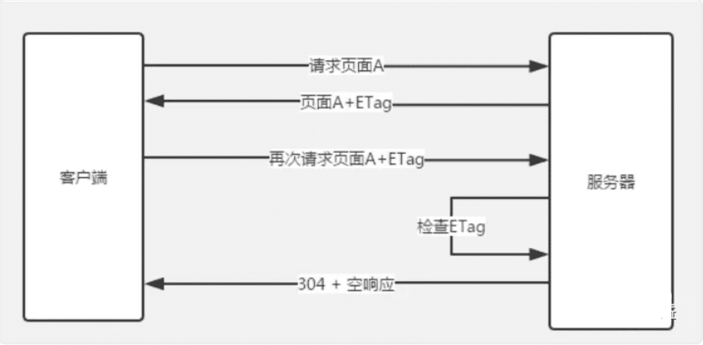

**互联网有一项著名的8秒原则。用户在访问Web网页时，如果时间超过8秒就会感到不耐烦，如果加载需要太长时间，他们就会放弃访问**。大部分用户希望网页能在2秒之内就完成加载。事实上，加载时间每多1秒，你就会流失7%的用户。8秒并不是准确的8秒钟，只是向网站开发者表明了加载时间的重要性。那我们如何优化页面性能，提高页面加载速度呢？这是本文主要要探讨的问题，然而性能优化是个综合性问题，没有标准答案，想要面面俱到罗列出来，并非易事。本文只关注一些核心要点，以下是我总结性能优化常见的办法：

## 一、资源压缩与合并，减少http请求

主要包括这些方面：html压缩、css 压缩、js的压缩和混乱和文件合并。 资源压缩可以从文件中去掉多余的字符，比如回车、空格。你在编辑器中写代码的时候，会使用缩进和注释，这些方法无疑会让你的代码简洁而且易读，但它们也会在文档中添加多余的字节。

- **html压缩、css压缩**:fire:
- **使用精灵图(css sprites)来合并图片**:fire:
- **图片较多的页面也可以使用 lazyLoad(懒加载) 等技术进行优化。**:fire:
- **js的压缩和混乱:fire:**
- **文件合并:fire:**

#### 1.html压缩

html代码压缩就是压缩这些在文本文件中有意义，但是在HTML中不显示的字符，包括空格，制表符，换行符等，还有一些其他意义的字符，如HTML注释也可以被压缩。

**如何进行html压缩：**

1. 使用在线网站进行压缩(开发过程中一般不用)
2. nodejs 提供了html-minifier工具
3. 后端模板引擎渲染压缩

#### 2.css代码压缩

css代码压缩简单来说就是无效代码删除和css语义合并

**如何进行css压缩：**

1. 使用在线网站进行压缩(开发过程中一般不用)

2. 使用html-minifier工具

3. 使用clean-css对css压缩

   

#### 3.js的压缩和混乱

js的压缩和混乱主要包括以下这几部分：

1. 无效字符的删除
2. 剔除注释
3. 代码语义的缩减和优化
4. 代码保护(代码逻辑变得混乱，降低代码的可读性，这点很重要)

**如何进行js的压缩和混乱**

1. 使用在线网站进行压缩(开发过程中一般不用)
2. 使用html-minifier工具
3. 使用uglifyjs2对js进行压缩

**其实css压缩与js的压缩和混乱比html压缩收益要大得多，同时css代码和js代码比html代码多得多，通过css压缩和js压缩带来流量的减少，会非常明显。所以对大公司来说，html压缩可有可无，但css压缩与js的压缩和混乱必须要有！**

#### 4.文件合并


从上图可以看出不合并请求有以下缺点：

- 文件与文件之间有插入的上行请求，增加了N-1个网络延迟
- 受丢包问题影响更严重
- keep-alive方式可能会出现状况，经过代理服务器时可能会被断开，也就是说不能一直保持keep-alive的状态

**压缩合并css和js可以减少网站http请求的次数，但合并文件可能会带来问题:首屏渲染和缓存失效问题**。那该如何处理这问题呢？----公共库合并和不同页面的合并。

**如何进行文件合并**

1. 使用在线网站进行文件合并
2. 使用nodejs实现文件合并(gulp、fis3)

## 二、非核心代码异步加载

#### 1、异步加载的方式

**异步加载的三种方式——async和defer、动态脚本创建**

**①  defer方式**

- 兼容所有浏览器
- defer属性规定是否对脚本执行进行延迟，直到页面加载为止
- 如果是多个脚本，该方法可以确保所有设置了defer属性的脚本按顺序执行
- 如果脚本不会改变文档的内容，可将defer属性加入到script标签中，以便加快处理文档的速度

**② async方式**

- async属性是HTML5新增属性，需要Chrome、FireFox、IE9+浏览器支持
- async属性规定一旦脚本可用，则会异步执行
- async属性仅适用于外部脚本
- 如果是多个脚本，该方法不能保证脚本按顺序执行

```html
<script type="text/javascript" src="xxx.js" async="async"></script>
```

**③动态创建script标签**在还没定义defer和async前，异步加载的方式是动态创建script，通过window.onload方法确保页面加载完毕再将script标签插入到DOM中,具体代码如下：

```js
function addScriptTag(src){      
    var script = document.createElement('script');      
    script.setAttribute("type","text/javascript");      
    script.src = src;      
    document.body.appendChild(script);  
}  
window.onload = function()
{      
    addScriptTag("js/index.js");  
}  
```

#### 2、异步加载的区别

**1)defer是在HTML解析完之后才会执行，如果是多个，按照加载的顺序依次执行**

**2)async是在加载完之后立即执行，如果是多个，执行顺序和加载顺序无关**


## 三、利用浏览器缓存

对于web应用来说，缓存是提升页面性能同时减少服务器压力的利器。

#### 浏览器缓存类型

**1.强缓存：不会向服务器发送请求，直接从缓存中读取资源，在chrome控制台的network选项中可以看到该请求返回200的状态码，并且size显示from disk cache或from memory cache；**

#### 相关的header:

**Expires** ：response header里的过期时间，浏览器再次加载资源时，如果在这个过期时间内，则命中强缓存。它的值为一个绝对时间的GMT格式的时间字符串， 比如Expires:Thu,21 Jan 2018 23:39:02 GMT

**缺点：**

由于`Expires`是服务器返回的一个**绝对时间**，存在的问题是：服务器的事件和客户端的事件可能不一致。在服务器时间与客户端时间相差较大时，缓存管理容易出现问题，比如随意修改客户端时间，就能影响缓存命中的结果。所以，在http1.1中，提出了一个新的response header，就是Cache-Control。

**Cache-Control** ：这是一个**相对时间**，在配置缓存的时候，以秒为单位，用数值表示。当值设为max-age=300时，则代表在这个请求正确返回时间（浏览器也会记录下来）的5分钟内再次加载资源，就会命中强缓存。比如Cache-Control:max-age=300，

**简单概括**：其实这两者差别不大，区别就在于 Expires 是http1.0的产物，Cache-Control是http1.1的产物，**两者同时存在的话，Cache-Control优先级高于Expires**；在某些不支持HTTP1.1的环境下，Expires就会发挥用处。所以Expires其实是过时的产物，现阶段它的存在只是一种兼容性的写法。强缓存判断是否缓存的依据来自于是否超出某个时间或者某个时间段，而不关心服务器端文件是否已经更新，这可能会导致加载文件不是服务器端最新的内容，**那我们如何获知服务器端内容较客户端是否已经发生了更新呢**？此时我们需要协商缓存策略。

**2.协商缓存：向服务器发送请求，服务器会根据这个请求的request header的一些参数来判断是否命中协商缓存，如果命中，则返回304状态码并带上新的response header通知浏览器从缓存中读取资源；另外协商缓存需要与cache-control共同使用。**

#### 相关的header:

**①Last-Modified和If-Modified-Since**：当第一次请求资源时，服务器将资源传递给客户端时，会将资源最后更改的时间以“Last-Modified: GMT”的形式加在实体首部上一起返回给客户端(**表示这该资源在服务器上的最后修改时间**)。

```http
Last-Modified: Fri, 22 Jul 2016 01:47:00 GMT
```

客户端会为资源标记上该信息，下次再次请求时，会把该信息附带在请求报文中一并带给服务器去做检查，若传递的时间值与服务器上该资源最终修改时间是一致的，则说明该资源没有被修改过，**直接返回304状态码，内容为空**，这样就节省了传输数据量 。如果两个时间不一致，则**服务器会发回该资源并返回200状态码，和第一次请求时类似**。这样保证不向客户端重复发出资源，也保证当服务器有变化时，客户端能够得到最新的资源。一个304响应比一个静态资源通常小得多，这样就节省了网络带宽。


但last-modified 存在一些缺点：

**Ⅰ.某些服务端不能获取精确的修改时间**

**Ⅱ.文件修改时间改了，但文件内容却没有变**

既然根据文件修改时间来决定是否缓存尚有不足，能否可以直接根据文件内容是否修改来决定缓存策略？----ETag和If-None-Match

**②ETag和If-None-Match**：Etag是上一次加载资源时，服务器返回的response header，是对该资源的一种唯一标识，只要资源有变化，Etag就会重新生成。浏览器在下一次加载资源向服务器发送请求时，会将上一次返回的Etag值放到request header里的If-None-Match里，服务器只需要比较客户端传来的If-None-Match跟自己服务器上该资源的ETag是否一致，就能很好地判断资源相对客户端而言是否被修改过了。如果服务器发现ETag匹配不上，那么直接以常规GET 200回包形式将新的资源（当然也包括了新的ETag）发给客户端；如果ETag是一致的，则直接返回304知会客户端直接使用本地缓存即可。



**两者之间对比**：**首先在精确度上，Etag要优于Last-Modified**。Last-Modified的时间单位是秒，如果某个文件在1秒内改变了多次，那么他们的Last-Modified其实并没有体现出来修改，但是Etag每次都会改变确保了精度；如果是负载均衡的服务器，各个服务器生成的Last-Modified也有可能不一致。**第二在性能上，Etag要逊于Last-Modified**，毕竟Last-Modified只需要记录时间，而Etag需要服务器通过算法来计算出一个hash值。**第三在优先级上，服务器校验优先考虑Etag**

#### 缓存的机制

**强制缓存优先于协商缓存进行，若强制缓存(Expires和Cache-Control)生效则直接使用缓存，若不生效则进行协商缓存(Last-Modified / If-Modified-Since和Etag / If-None-Match)，协商缓存由服务器决定是否使用缓存，若协商缓存失效，那么代表该请求的缓存失效，重新获取请求结果，再存入浏览器缓存中；生效则返回304，继续使用缓存**。主要过程如下：


#### 用户行为对浏览器缓存的影响

1.地址栏访问，链接跳转是正常用户行为，将会触发浏览器缓存机制；

2.F5刷新，浏览器会设置max-age=0，跳过强缓存判断，会进行协商缓存判断；

3.ctrl+F5刷新，跳过强缓存和协商缓存，直接从服务器拉取资源。

## 四、使用CDN

大型Web应用对速度的追求并没有止步于仅仅利用浏览器缓存，因为浏览器缓存始终只是为了提升二次访问的速度，对于首次访问的加速，我们需要从网络层面进行优化，最常见的手段就是CDN（Content Delivery Network，**内容分发网络**）加速。**通过将静态资源(例如javascript，css，图片等等）缓存到离用户很近的相同网络运营商的CDN节点上，不但能提升用户的访问速度，还能节省服务器的带宽消耗，降低负载。**


#### CDN是怎么做到加速的呢？

其实这是CDN服务商在全国各个省份部署计算节点，CDN加速将网站的内容缓存在网络边缘,不同地区的用户就会访问到离自己最近的相同网络线路上的CDN节点，当请求达到CDN节点后，节点会判断自己的内容缓存是否有效，如果有效，则立即响应缓存内容给用户，从而加快响应速度。如果CDN节点的缓存失效，它会根据服务配置去我们的内容源服务器获取最新的资源响应给用户，并将内容缓存下来以便响应给后续访问的用户。**因此，一个地区内只要有一个用户先加载资源，在CDN中建立了缓存，该地区的其他后续用户都能因此而受益**。

**CDN=更智能的镜像+缓存+流量导流**。

如果某个用户想要访问优酷的视频点播内容，那么：


具体步骤：

①、当用户点击APP上的内容，APP会根据URL地址去**本地DNS**（域名解析系统）寻求IP地址解析。

②、本地DNS系统会将域名的解析权交给**CDN专用DNS服务器**。

③、CDN专用DNS服务器，将CDN的全局负载均衡设备IP地址返回用户。

④、用户向**CDN的负载均衡设备**发起内容URL访问请求。

⑤、CDN负载均衡设备根据用户IP地址，以及用户请求的内容URL，选择一台用户所属区域的**缓存服务器**。

⑥、负载均衡设备告诉用户这台缓存服务器的IP地址，让用户向所选择的缓存服务器发起请求。

⑦、用户向缓存服务器发起请求，缓存服务器响应用户请求，将用户所需内容传送到用户终端。

⑧、如果这台缓存服务器上并没有用户想要的内容，那么这台缓存服务器就要网站的**源服务器**请求内容。

⑨、源服务器返回内容给缓存服务器，缓存服务器发给用户，并根据用户自定义的缓存策略，判断要不要把内容缓存到缓存服务器上。

**采用CDN技术，最大的好处，就是加速了网站的访问——用户与内容之间的物理距离缩短，用户的等待时间也得以缩短。**(来自公众号：鲜枣课堂，作者 小枣君)

## 五、DNS预解析（dns-prefetch）

**资源预加载是另一个性能优化技术，我们可以使用该技术来预先告知浏览器某些资源可能在将来会被使用到。**通过 DNS 预解析来告诉浏览器未来我们可能从某个特定的 URL 获取资源，当浏览器真正使用到该域中的某个资源时就可以尽快地完成 DNS 解析。例如，我们将来可从 example.com 获取图片或音频资源，那么可以在文档顶部的 标签中加入以下内容：

```html
<link rel="dns-prefetch" href="//example.com">
```

当我们从该 URL 请求一个资源时，就不再需要等待 DNS 的解析过程。该技术对使用第三方资源特别有用。通过简单的一行代码就可以告知那些兼容的浏览器进行 DNS 预解析，这意味着当浏览器真正请求该域中的某个资源时，DNS 的解析就已经完成了,从而节省了宝贵的时间。 另外需要注意的是，**浏览器会对a标签的href自动启用DNS Prefetching，所以a标签里包含的域名不需要在head中手动设置link。但是在HTTPS下不起作用，需要meta来强制开启功能**。这个限制的原因是防止窃听者根据DNS Prefetching推断显示在HTTPS页面中超链接的主机名。下面这句话作用是强制打开a标签域名解析

```html
<meta http-equiv="x-dns-prefetch-control" content="on">
```

## 六、js代码惰性载入

来自：公众号(前端大全)

## **你有哪些性能优化的方法？**

- 减少http请求次数：CSS Sprites, JS、CSS源码压缩、图片大小控制合适；网页Gzip，CDN托管，data缓存 ，图片服务器。
- 前端模板 JS+数据，减少由于HTML标签导致的带宽浪费，前端用变量保存AJAX请求结果，每次操作本地变量，不用请求，减少请求次数
- 用innerHTML代替DOM操作，减少DOM操作次数，优化javascript性能。
- 当需要设置的样式很多时设置className而不是直接操作style。
- 少用全局变量、缓存DOM节点查找的结果。减少IO读取操作。
- 避免使用CSS Expression（css表达式)又称Dymic properties(动态属性)。
-  图片预加载，将样式表放在顶部，将脚本放在底部 加上时间戳。
-  避免在页面的主体布局中使用table，table要等其中的内容完全下载之后才会显示出来，显示比div+css布局慢。
- js代码惰性载入
- 使用 HTML5，通过创建 cache manifest 文件，可以轻松地创建 web 应用的离线版本

## 面试题

### 如何渲染几万条数据并不卡住界面

这道题考察了如何在不卡住页面的情况下渲染数据，也就是说不能一次性将几万条都渲染出来，而应该一次渲染部分 DOM，那么就可以通过 `requestAnimationFrame` 来每 16 ms 刷新一次。

```html
<!DOCTYPE html>
<html lang="en">
  <head>
    <meta charset="UTF-8" />
    <meta name="viewport" content="width=device-width, initial-scale=1.0" />
    <meta http-equiv="X-UA-Compatible" content="ie=edge" />
    <title>Document</title>
  </head>
  <body>
    <ul>
      控件
    </ul>
    <script>
      setTimeout(() => {
        // 插入十万条数据
        const total = 100000
        // 一次插入 20 条，如果觉得性能不好就减少
        const once = 20
        // 渲染数据总共需要几次
        const loopCount = total / once
        let countOfRender = 0
        let ul = document.querySelector('ul')
        function add() {
          // 优化性能，插入不会造成回流
          const fragment = document.createDocumentFragment()
          for (let i = 0; i < once; i++) {
            const li = document.createElement('li')
            li.innerText = Math.floor(Math.random() * total)
            fragment.appendChild(li)
          }
          ul.appendChild(fragment)
          countOfRender += 1
          loop()
        }
        function loop() {
          if (countOfRender < loopCount) {
            window.requestAnimationFrame(add)
          }
        }
        loop()
      }, 0)
    </script>
  </body>
</html>
```

## 前端性能优化-加载篇

<https://www.cxymsg.com/guide/load.html>

::: tip 定义

- **白屏时间**：从路由改变起(即用户再按下回车的瞬间)到首次内容绘制(即能看到第一个内容)为止算白屏时间。
- **首次内容绘制**(FCP)
- **首次有意义绘制**(FMP)
- **可交互时间**(TTI)

:::

::: tip 优化方案

- 在白屏时间时插入webpack插件([html-webpack-plugin](https://github.com/jantimon/html-webpack-plugin))加入**loading**图
- **(伪)服务端渲染**
- **开启HTTP2**
- 使用[SplitChunksPlugin](https://webpack.js.org/plugins/split-chunks-plugin/)进行拆包优化
- **骨架屏**(Skeleton Screen):Vue: [vue-skeleton-webpack-plugin](https://github.com/lavas-project/vue-skeleton-webpack-plugin)
- **Tree Shaking**（摇树）
- **polyfill动态加载**
- **动态加载 ES6 代码**
- **Code Splitting**
- **组件懒加载**
- **组件预加载**
- **keep-alive**

:::

## 前端性能优化-执行篇

<https://www.cxymsg.com/guide/execute.html>

### 动画性能优化

在前端实现动画有三种主流的方式:

- Canvas
- CSS3
- Dom

#### css3动画性能优化

**那么如何避免重绘和回流?**

具体而言,就是多使用transform 或者 opacity 来实现动画效果,上述方法在合成层使用不会引起重绘和回流.

**那么如何利用GPU加速呢?**

以下几个属性会获得GPU加速

- opacity
- translate
- rotate
- scale

####  Canvas动画优化

- 运用`requestAnimationFrame`
- 离屏canvas
- 避免浮点运算
- 减少调用Canvas API

###  大量数据性能优化

- #### 虚拟列表:指的就是「可视区域渲染」的列表

- #### Web Worker