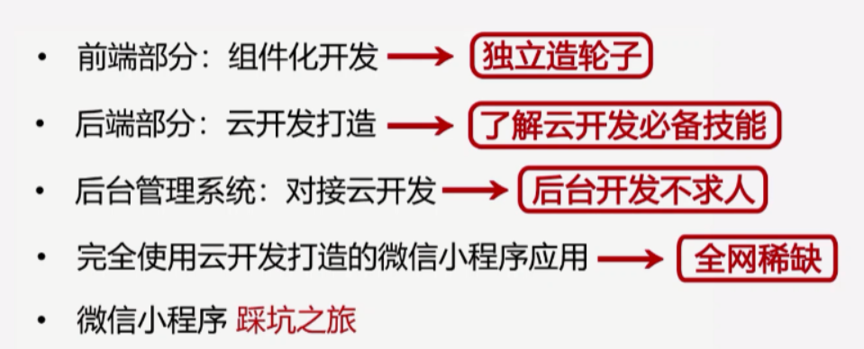

## 云开发与Serverless

### 什么是Serverless

### 云开发优势

- 快速上线
- 专注核心业务
- 独立开发一个完整的微信小程序
- 不需要学习新的语言，只需要掌握JavaScript
- 无需运维，节约成本
- 弹性伸缩
- 数据安全

### 云开发能力

- **云函数**(相当于后端)：在**云端运行的代码**，微信私有协议天然鉴权
- **云数据库**：一个既可以在小程序端操作又可以在云函数中操作的**JSON数据库**
- **云存储**：在**云端存储文件**，可以在云端控制台可视化管理
- **云调用**：基于云函数免鉴权使用**小程序开放接口**的能力
- **HTTP API**：使用HTTP API开发者可在已有服务器上访问云资源，实现与云开发的互通

## 组件化开发

**组件​**:yum:：在用户界面开发领域，组件是一种**面向用户的**、**独立的**、**可复用的**交互元素的封装

### 组件化开发的意义

- 组件化是对实现的分层，是更有效地代码组合方式
- 组件化是对资源的重组和优化，从而使项目资源管理更合理
- 组件化有利于单元测试
- 组件化对重构较友好

### 设计原则

- 高内聚
- 低耦合
- 单一职责
- 避免过多参数

## 云函数路由优化 tcb-router

- 一个用户在一个云环境中只能创建有限个云函数
- 相似的请求归类到同一个云函数处理
- tcb-router是一个koa风格的云函数路由库

::: tip 小程序端和云函数调用云数据库的区别

- 数据限制：小程序端20条，云函数100条
- 权限限制：小程序端有权限的限制(可在云数据库配置)，云函数没有
- 小程序端有一些莫名的坑。

:::

## 获取用户信息的不同方式

- 用open-data标签显示用户信息，也只是显示而已

- js调用wx.getUserInfo方式,只有授权过的用户才能获取到

- 给button按钮配置open-type引导用户授权

- 获取openid的方式是使用云开发里的云函数

  

## 小程序渲染层与逻辑层交互原理

## 小程序运行机制与更新机制

### 运行机制

### 更新机制

## 小程序性能与体验优化

- 合理设置可点击元素的相应区域大小
- 避免渲染页面耗时过长
- 避免执行脚本耗时过长
- 对网络请求作必要的缓存以避免多余的请求
- 不要引入未被使用的wxss样式
- 文字颜色与背景色搭配较好，适宜的颜色对比度更方便用户阅读
- 所有资源请求建议使用HTTPS
- 不适用废弃接口
- 避免过大的WXML节点数目(一个页面少于1000个WXML节点，节点树深度少于30层，子节点树不大于60个)
- 避免将不可能被访问到的页面打包在小程序包里
- 及时回收定时器
- 避免使用:active伪类来实现点击态
- 滚动区域可开启惯性滚动以增强体验(ios上：-webkit-overflow-scrolling:touch)
- 避免出现任何Javascript异常
- 所有请求响应正常，耗时不应太久
- 避免短时间内发起太多的图片请求及其他请求

## setData

:yum:setData函数用于将数据从逻辑层发送到视图层（**异步**），同时改变对应的 this.data 的值（**同步**）

## 管理小程序数据的后台管理系统

## 项目总结

横跨小程序端，云开发后端以及后台管理系统的一站式云开发小程序全栈项目，完成小程序的生态开发。云音乐实战项目为例，使用小程序的组件化开发打造小程序的前端部分，使用云开发打造小程序的后端部分，通过后台管理系统去访问云资源，实现我们对小程序项目中文件和数据的管理。

### 整体架构

