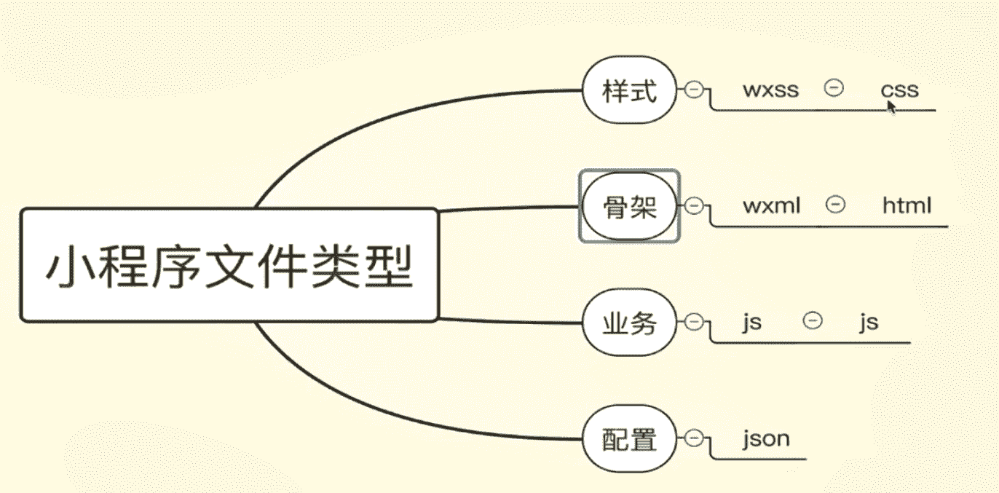
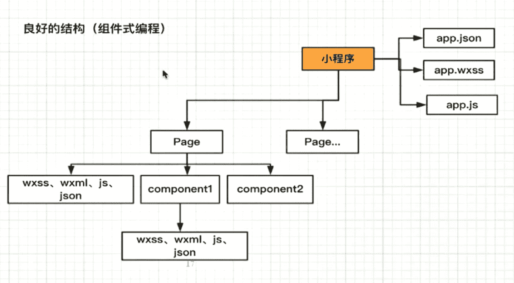
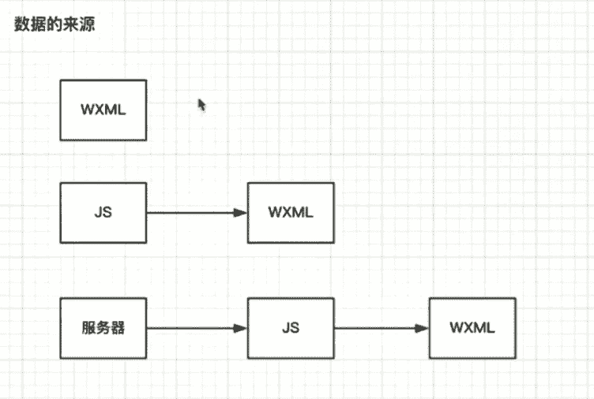
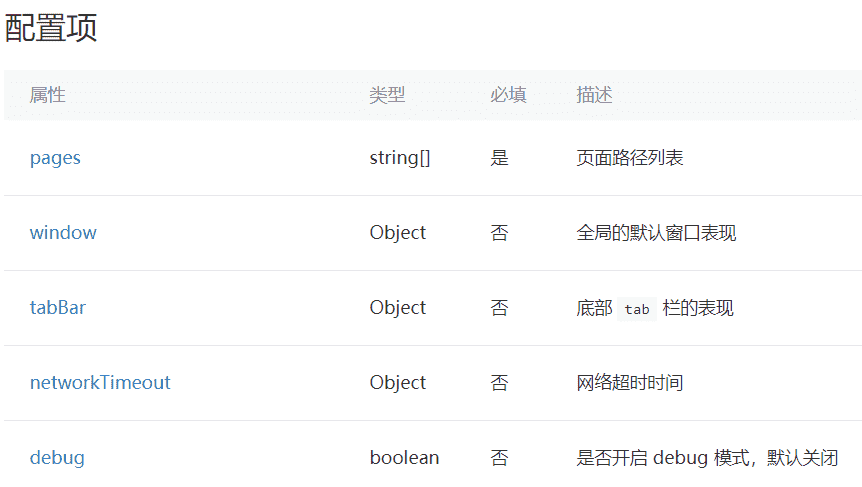
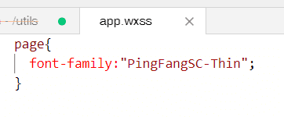

## 1. 小程序的基础知识

 **json文件里不可写注释**，会报错

**新建page要在app.json中注册**

**数据来源：**

#### 全局配置

#### pages

用于指定小程序由哪些页面组成，每一项都对应一个页面的 路径（含文件名） 信息。文件名不需要写文件后缀，框架会自动去寻找对于位置的 `.json`, `.js`, `.wxml`, `.wxss` 四个文件进行处理。

#### window

用于设置小程序的状态栏、导航条、标题、窗口背景色。

**保存数据：**

## 2. 组件

json文件中的："usingComponents": {“组件名”:"路径"}

rpx:自适应

全局样式中只有font、color样式能被组件所继承

页面则可以继承全部全局样式

组件的封装性，开放性,**复用性**，**维护性**(页面分离有利于代码维护)

**组件的属性列表：**

### page样式全局设置

原因是小程序都会在外层包裹page：

## 3. flex布局

块级元素放在设置了display：flex的大盒子里默认就不占一行了。

`<view>`:宽:100%，高:自适应

## 4. 数据，事件与属性

三元表达式：

## 5.生命周期